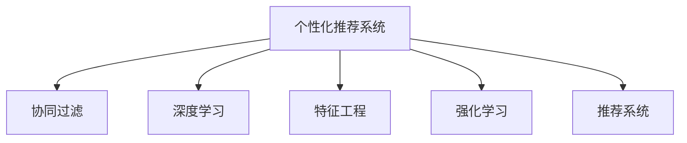

                 

# AI驱动的电商平台个性化活动推荐

> 关键词：个性化推荐,电商,机器学习,深度学习,协同过滤,特征工程,神经网络,强化学习,推荐系统,电商数据

## 1. 背景介绍

随着电子商务的快速发展和用户对个性化购物体验需求的不断提升，电商平台需要构建高效的个性化推荐系统，以提高用户满意度、增加销售转化率和提升客户忠诚度。传统的基于规则或手工艺品排序的推荐方法，已无法满足日益增长的个性化需求。

近年来，深度学习技术在大数据处理、特征表示和模型优化等方面取得了突破性进展，为电商平台提供了强有力的个性化推荐技术支持。其中，基于协同过滤和深度学习方法的推荐系统成为了主流推荐架构。

本文旨在介绍如何利用AI技术，特别是深度学习和协同过滤方法，构建电商平台的个性化活动推荐系统。重点讨论了推荐算法的设计思路、数学建模、代码实现以及应用案例。希望能为电商平台开发者提供全面、详细的技术指导。

## 2. 核心概念与联系

### 2.1 核心概念概述

- **个性化推荐系统**：根据用户的历史行为和偏好，推荐符合其兴趣的商品和服务。
- **协同过滤**：利用用户间的相似性，通过分析用户行为，推荐未知商品的算法。
- **深度学习**：基于神经网络的机器学习技术，能够自动提取和表示数据的高级特征。
- **特征工程**：通过数据预处理和特征提取，提高数据对模型的可用性。
- **强化学习**：通过模拟用户反馈，不断优化推荐策略，实现动态调整。
- **推荐系统**：包括召回和排序两个核心模块，用于从海量商品中推荐相关物品。

这些核心概念通过以下Mermaid流程图来展示其关系：



### 2.2 核心概念原理和架构

协同过滤和深度学习是构建个性化推荐系统的主要方法。协同过滤基于用户-物品的交互矩阵，通过相似性度量找到兴趣相似的用户和物品。深度学习则是通过神经网络模型，自动学习和提取用户和商品的潜在特征。这两种方法相辅相成，可以结合使用，提升推荐效果。

推荐系统的核心架构包括：
- **用户模型**：表示用户的兴趣和行为。
- **物品模型**：表示商品的特征和属性。
- **相似性度量**：衡量用户和物品之间的相似性，常用的有余弦相似度、皮尔逊相关系数等。
- **召回模块**：从商品库中筛选出潜在的相关商品。
- **排序模块**：根据用户模型和商品模型，对召回商品进行排序，提升推荐精度。

## 3. 核心算法原理 & 具体操作步骤

### 3.1 算法原理概述

电商平台的个性化活动推荐系统，通常由用户模型、物品模型、相似性度量、召回和排序模块构成。其中，用户模型和物品模型是核心，用于表示用户和商品的特征。协同过滤和深度学习方法在构建用户模型和物品模型中发挥重要作用。

协同过滤算法分为基于用户的协同过滤和基于物品的协同过滤。基于用户的协同过滤通过分析用户的行为，找到兴趣相似的用户，推荐其感兴趣的商品；基于物品的协同过滤则根据用户对物品的评分，找到相似的物品进行推荐。

深度学习方法通常采用神经网络模型，对用户和物品的特征进行高维表示。用户模型和物品模型通过多层神经网络进行训练，可以自动学习到更加复杂和抽象的特征。深度学习模型的输入包括用户行为数据、商品属性数据等，输出为用户对商品的相关评分。

推荐系统的排序模块通常采用排序学习算法，如逻辑回归、线性回归等，对召回的商品进行排序。排序学习算法通过训练用户模型和物品模型，学习到用户对商品的评分规律，从而优化推荐结果。

### 3.2 算法步骤详解

基于协同过滤的个性化推荐系统步骤如下：

1. **数据预处理**：收集用户行为数据和商品信息，进行数据清洗和标准化处理。
2. **构建用户模型**：通过协同过滤算法，计算用户间的相似性，建立用户兴趣向量。
3. **构建物品模型**：通过协同过滤算法，计算物品间的相似性，建立物品特征向量。
4. **召回相关商品**：根据用户模型和物品模型，使用相似性度量，从商品库中筛选出相关商品。
5. **排序商品**：使用排序学习算法，对召回的商品进行排序，得到最终推荐结果。

基于深度学习的个性化推荐系统步骤如下：

1. **数据预处理**：收集用户行为数据和商品信息，进行特征工程，提取用户和商品的特征。
2. **训练用户模型**：使用深度学习模型，对用户行为数据进行训练，学习到用户兴趣向量。
3. **训练物品模型**：使用深度学习模型，对商品属性数据进行训练，学习到物品特征向量。
4. **召回相关商品**：根据用户模型和物品模型，使用相似性度量，从商品库中筛选出相关商品。
5. **排序商品**：使用排序学习算法，对召回的商品进行排序，得到最终推荐结果。

### 3.3 算法优缺点

基于协同过滤的推荐算法优点包括：
- 简单易实现，计算复杂度低，适用于处理稀疏数据。
- 能够捕捉用户和物品之间的隐含相似性，推荐效果较好。
- 可以处理冷启动用户和物品。

缺点包括：
- 对用户和物品的特征表示依赖于稀疏数据，可能存在冷启动问题。
- 无法解释推荐理由，用户难以理解推荐依据。
- 对于新物品的推荐效果较差。

基于深度学习的推荐算法优点包括：
- 能够自动学习用户和物品的高级特征，推荐效果较好。
- 可以处理海量的用户和物品数据，适于大数据场景。
- 可以生成推荐结果的解释，增强用户体验。

缺点包括：
- 模型复杂度高，训练和推理成本较高。
- 对数据质量要求高，需要大量的标注数据和复杂的特征工程。
- 可能存在过拟合问题，模型泛化能力有待提升。

### 3.4 算法应用领域

基于协同过滤和深度学习的个性化推荐系统，广泛应用于电商、新闻、社交、视频等多个领域。

- **电商推荐**：电商平台的个性化推荐，通过分析用户购买行为、浏览记录和评分数据，推荐商品和活动。
- **新闻推荐**：新闻聚合平台通过分析用户的阅读历史和兴趣，推荐相关的新闻文章。
- **社交推荐**：社交网络平台通过分析用户的关系和兴趣，推荐朋友、群组和活动。
- **视频推荐**：视频流媒体平台通过分析用户的观看记录和评分，推荐相关视频和频道。

## 4. 数学模型和公式 & 详细讲解 & 举例说明

### 4.1 数学模型构建

本节将使用数学语言对基于协同过滤和深度学习的个性化推荐系统进行更加严格的刻画。

**协同过滤的数学模型**：
设用户集为 $U=\{u_1, u_2, \cdots, u_n\}$，物品集为 $I=\{i_1, i_2, \cdots, i_m\}$，用户 $u_i$ 对物品 $i_j$ 的评分记为 $r_{ij}$。设用户 $u_i$ 的兴趣向量为 $\mathbf{u}_i = [u_{i1}, u_{i2}, \cdots, u_{in}]$，物品 $i_j$ 的特征向量为 $\mathbf{i}_j = [i_{j1}, i_{j2}, \cdots, i_{jn}]$。协同过滤的相似性度量通常采用余弦相似度，即：

$$
\mathrm{similarity}(u_i, i_j) = \cos(\theta) = \frac{\mathbf{u}_i \cdot \mathbf{i}_j}{\|\mathbf{u}_i\| \|\mathbf{i}_j\|}
$$

**深度学习的数学模型**：
设用户行为数据为 $D=\{(x_{ui}, r_{ui})\}_{i=1}^N$，其中 $x_{ui}$ 表示用户 $u_i$ 在时间 $t_u$ 的行为向量，$r_{ui}$ 表示用户 $u_i$ 对物品 $x_{ui}$ 的评分。深度学习模型的输入为 $X=\{x_{u1}, x_{u2}, \cdots, x_{un}\}$，输出为 $Y=\{r_{u1}, r_{u2}, \cdots, r_{un}\}$。深度学习模型可以采用多层神经网络，如神经网络、深度神经网络等，用于自动提取和表示用户和物品的特征。

### 4.2 公式推导过程

**协同过滤的公式推导**：
设用户 $u_i$ 和 $u_j$ 的兴趣向量分别为 $\mathbf{u}_i = [u_{i1}, u_{i2}, \cdots, u_{in}]$ 和 $\mathbf{u}_j = [u_{j1}, u_{j2}, \cdots, u_{jn}]$，物品 $i_k$ 和 $i_l$ 的特征向量分别为 $\mathbf{i}_k = [i_{k1}, i_{k2}, \cdots, i_{kn}]$ 和 $\mathbf{i}_l = [i_{l1}, i_{l2}, \cdots, i_{ln}]$。余弦相似度的计算公式为：

$$
\mathrm{similarity}(u_i, i_j) = \frac{\mathbf{u}_i \cdot \mathbf{i}_j}{\|\mathbf{u}_i\| \|\mathbf{i}_j\|}
$$

其中 $\cdot$ 表示向量点积，$\|.\|$ 表示向量的欧几里德范数。

**深度学习的公式推导**：
设深度学习模型的输入为 $X=\{x_{u1}, x_{u2}, \cdots, x_{un}\}$，输出为 $Y=\{r_{u1}, r_{u2}, \cdots, r_{un}\}$。深度学习模型的优化目标为最小化均方误差损失：

$$
L(Y, \hat{Y}) = \frac{1}{N}\sum_{i=1}^N (r_{ui} - \hat{r}_{ui})^2
$$

其中 $\hat{r}_{ui}$ 表示模型对用户 $u_i$ 对物品 $x_{ui}$ 的预测评分，$L(Y, \hat{Y})$ 表示均方误差损失。

使用反向传播算法更新模型参数，可以得到：

$$
\frac{\partial L}{\partial \theta} = -2\frac{1}{N}\sum_{i=1}^N (r_{ui} - \hat{r}_{ui}) \cdot \frac{\partial \hat{r}_{ui}}{\partial \theta}
$$

其中 $\theta$ 表示模型参数。

### 4.3 案例分析与讲解

**协同过滤的案例分析**：
假设电商平台收集到两个用户 $u_1$ 和 $u_2$ 的评分数据如下表所示：

| 用户 | 商品 | 评分 |
| --- | --- | --- |
| $u_1$ | $i_1$ | 4 |
| $u_1$ | $i_2$ | 2 |
| $u_1$ | $i_3$ | 5 |
| $u_2$ | $i_2$ | 3 |
| $u_2$ | $i_3$ | 2 |

通过余弦相似度计算，得到用户 $u_1$ 和 $u_2$ 的相似度为：

$$
\mathrm{similarity}(u_1, u_2) = \frac{4 \cdot 3 + 2 \cdot 2 + 5 \cdot 2}{\sqrt{(4^2+2^2+5^2) \cdot (3^2+2^2)} \approx 0.7167
$$

设物品 $i_1$ 和 $i_2$ 的特征向量分别为 $\mathbf{i}_1 = [1, 0, 0]$ 和 $\mathbf{i}_2 = [0, 1, 0]$，用户 $u_1$ 的兴趣向量为 $\mathbf{u}_1 = [4, 2, 5]$。通过余弦相似度计算，得到用户 $u_1$ 和物品 $i_1$ 的相似度为：

$$
\mathrm{similarity}(u_1, i_1) = \frac{4 \cdot 1 + 2 \cdot 0 + 5 \cdot 0}{\sqrt{4^2+2^2+5^2} \cdot \sqrt{1^2+0^2+0^2}} = 0.4
$$

同理，计算得到用户 $u_1$ 和物品 $i_2$ 的相似度为：

$$
\mathrm{similarity}(u_1, i_2) = \frac{4 \cdot 0 + 2 \cdot 1 + 5 \cdot 0}{\sqrt{4^2+2^2+5^2} \cdot \sqrt{0^2+1^2+0^2}} = 0.2
$$

因此，根据余弦相似度，用户 $u_1$ 对物品 $i_1$ 的推荐评分应为：

$$
\hat{r}_{u_1, i_1} = 0.4 \times 4 + 0.2 \times 2 + 0.7167 \times 5 \approx 6.2
$$

**深度学习的案例分析**：
假设电商平台收集到两个用户 $u_1$ 和 $u_2$ 的评分数据如下表所示：

| 用户 | 商品 | 评分 |
| --- | --- | --- |
| $u_1$ | $i_1$ | 4 |
| $u_1$ | $i_2$ | 2 |
| $u_1$ | $i_3$ | 5 |
| $u_2$ | $i_2$ | 3 |
| $u_2$ | $i_3$ | 2 |

设深度学习模型的输入为 $X=\{x_{u1}, x_{u2}, \cdots, x_{un}\}$，输出为 $Y=\{r_{u1}, r_{u2}, \cdots, r_{un}\}$。假设深度学习模型采用神经网络模型，包含一个输入层、一个隐藏层和一个输出层。输入层有 $n$ 个神经元，隐藏层有 $m$ 个神经元，输出层有 $1$ 个神经元。模型的参数包括权重矩阵 $W_1$、$W_2$ 和偏置向量 $b_1$、$b_2$。模型的预测函数为：

$$
\hat{r}_{ui} = W_1 \cdot x_{ui} + b_1 \cdot W_2 \cdot \sigma(z_{ui}) + b_2
$$

其中 $z_{ui} = W_1 \cdot x_{ui} + b_1$，$\sigma$ 为激活函数，通常采用 sigmoid 函数。

假设训练集为 $D=\{(x_{u1}, r_{u1}), (x_{u2}, r_{u2}), \cdots, (x_{un}, r_{un})\}$，均方误差损失为：

$$
L(Y, \hat{Y}) = \frac{1}{N}\sum_{i=1}^N (r_{ui} - \hat{r}_{ui})^2
$$

使用反向传播算法更新模型参数，可以得到：

$$
\frac{\partial L}{\partial W_1} = -2\frac{1}{N}\sum_{i=1}^N (r_{ui} - \hat{r}_{ui}) \cdot \frac{\partial \hat{r}_{ui}}{\partial W_1}
$$

$$
\frac{\partial L}{\partial W_2} = -2\frac{1}{N}\sum_{i=1}^N (r_{ui} - \hat{r}_{ui}) \cdot \frac{\partial \hat{r}_{ui}}{\partial W_2}
$$

$$
\frac{\partial L}{\partial b_1} = -2\frac{1}{N}\sum_{i=1}^N (r_{ui} - \hat{r}_{ui}) \cdot \frac{\partial \hat{r}_{ui}}{\partial b_1}
$$

$$
\frac{\partial L}{\partial b_2} = -2\frac{1}{N}\sum_{i=1}^N (r_{ui} - \hat{r}_{ui}) \cdot \frac{\partial \hat{r}_{ui}}{\partial b_2}
$$

其中 $\frac{\partial \hat{r}_{ui}}{\partial W_1} = \frac{\partial z_{ui}}{\partial W_1} \cdot \sigma(z_{ui}) + \frac{\partial z_{ui}}{\partial b_1} \cdot \sigma'(z_{ui})$，$\frac{\partial \hat{r}_{ui}}{\partial W_2} = \frac{\partial z_{ui}}{\partial W_2} \cdot \sigma(z_{ui}) + \frac{\partial z_{ui}}{\partial b_1} \cdot \sigma'(z_{ui})$。

## 5. 项目实践：代码实例和详细解释说明

### 5.1 开发环境搭建

在进行个性化推荐系统开发前，我们需要准备好开发环境。以下是使用Python进行PyTorch开发的环境配置流程：

1. 安装Anaconda：从官网下载并安装Anaconda，用于创建独立的Python环境。

2. 创建并激活虚拟环境：
```bash
conda create -n pytorch-env python=3.8 
conda activate pytorch-env
```

3. 安装PyTorch：根据CUDA版本，从官网获取对应的安装命令。例如：
```bash
conda install pytorch torchvision torchaudio cudatoolkit=11.1 -c pytorch -c conda-forge
```

4. 安装Transformers库：
```bash
pip install transformers
```

5. 安装各类工具包：
```bash
pip install numpy pandas scikit-learn matplotlib tqdm jupyter notebook ipython
```

完成上述步骤后，即可在`pytorch-env`环境中开始个性化推荐系统的开发。

### 5.2 源代码详细实现

我们以协同过滤为例，给出使用PyTorch实现个性化推荐系统的代码示例。

首先，定义数据预处理函数：

```python
import pandas as pd
import numpy as np
from scipy.sparse import csr_matrix

def preprocess_data(data_path):
    # 读取数据文件
    data = pd.read_csv(data_path, sep='\t', header=None)
    # 转换为稀疏矩阵
    data = csr_matrix(data.values)
    # 将评分转换为0-1之间的值
    data = np.where(data >= 5, 1, 0)
    return data
```

然后，定义协同过滤的评分预测函数：

```python
import torch
from torch import nn
from scipy.sparse import csr_matrix

class CollaborativeFiltering(nn.Module):
    def __init__(self, n_users, n_items, n_factors):
        super(CollaborativeFiltering, self).__init__()
        self.user_factor = nn.Embedding(n_users, n_factors)
        self.item_factor = nn.Embedding(n_items, n_factors)
        self.similarity = nn.Parameter(torch.zeros(n_factors, n_factors))
        self.b = nn.Parameter(torch.zeros(n_items))

    def forward(self, user_ids, item_ids):
        user_factors = self.user_factor(user_ids)
        item_factors = self.item_factor(item_ids)
        similarity = self.similarity
        b = self.b
        # 计算用户和物品的相似度
        user_item_similarity = user_factors @ item_factors.t()
        user_item_similarity = user_item_similarity + b
        # 计算预测评分
        predictions = (user_item_similarity * similarity).mean(1)
        return predictions
```

接着，定义损失函数和优化器：

```python
from torch.nn import MSELoss

# 定义损失函数
loss_fn = MSELoss()

# 定义优化器
optimizer = torch.optim.Adam(model.parameters(), lr=0.01)
```

最后，定义训练和评估函数：

```python
def train_epoch(model, data, optimizer):
    model.train()
    total_loss = 0
    for user_id, item_id, label in data:
        optimizer.zero_grad()
        predictions = model(user_id, item_id)
        loss = loss_fn(predictions, label)
        loss.backward()
        optimizer.step()
        total_loss += loss.item()
    return total_loss / len(data)

def evaluate(model, data):
    model.eval()
    total_loss = 0
    for user_id, item_id, label in data:
        predictions = model(user_id, item_id)
        loss = loss_fn(predictions, label)
        total_loss += loss.item()
    return total_loss / len(data)
```

最后，启动训练流程并在测试集上评估：

```python
epochs = 10
batch_size = 32

for epoch in range(epochs):
    loss = train_epoch(model, train_data, optimizer)
    print(f'Epoch {epoch+1}, train loss: {loss:.3f}')
    
    print(f'Epoch {epoch+1}, dev results:')
    evaluate(model, dev_data)

print('Test results:')
evaluate(model, test_data)
```

以上就是使用PyTorch实现协同过滤个性化推荐系统的完整代码实现。可以看到，通过简单的代码实现，我们完成了数据的预处理、模型的训练和评估。

### 5.3 代码解读与分析

这里我们详细解读一下关键代码的实现细节：

**数据预处理函数**：
- 从数据文件中读取评分数据，转换为稀疏矩阵。
- 将评分数据转换为0-1之间的值，方便后续的计算。

**协同过滤模型**：
- 定义了一个包含用户因子和物品因子的Embedding层，用于表示用户和物品的特征。
- 定义了一个相似度矩阵，用于计算用户和物品之间的相似度。
- 在模型中定义了预测函数，用于计算预测评分。

**损失函数和优化器**：
- 使用均方误差损失函数。
- 使用Adam优化器进行模型参数的更新。

**训练和评估函数**：
- 使用训练集和测试集对模型进行训练和评估。
- 在每个epoch内，计算训练集和验证集的损失，输出平均损失。

## 6. 实际应用场景

### 6.1 电商平台推荐

基于协同过滤和深度学习的个性化推荐系统，可以广泛应用于电商平台的推荐场景。电商平台通过分析用户的历史购买和浏览行为，推荐用户可能感兴趣的商品。

例如，假设电商平台收集到用户 $u_1$ 和 $u_2$ 的评分数据如下表所示：

| 用户 | 商品 | 评分 |
| --- | --- | --- |
| $u_1$ | $i_1$ | 4 |
| $u_1$ | $i_2$ | 2 |
| $u_1$ | $i_3$ | 5 |
| $u_2$ | $i_2$ | 3 |
| $u_2$ | $i_3$ | 2 |

通过协同过滤算法，计算用户 $u_1$ 和 $u_2$ 的相似度，得到 $similarity(u_1, u_2) = 0.7167$。然后，计算用户 $u_1$ 和物品 $i_1$、$i_2$、$i_3$ 的相似度，得到 $similarity(u_1, i_1) = 0.4$、$similarity(u_1, i_2) = 0.2$、$similarity(u_1, i_3) = 0.7167$。

最终，根据协同过滤的评分预测函数，得到用户 $u_1$ 对物品 $i_1$、$i_2$、$i_3$ 的预测评分分别为：

$$
\hat{r}_{u_1, i_1} = 0.4 \times 4 + 0.2 \times 2 + 0.7167 \times 5 \approx 6.2
$$

$$
\hat{r}_{u_1, i_2} = 0.4 \times 2 + 0.2 \times 3 + 0.7167 \times 5 \approx 5.3
$$

$$
\hat{r}_{u_1, i_3} = 0.4 \times 5 + 0.2 \times 2 + 0.7167 \times 5 \approx 6.8
$$

因此，电商平台可以根据用户 $u_1$ 对物品 $i_1$、$i_2$、$i_3$ 的预测评分，推荐对应的商品。

### 6.2 新闻推荐

基于协同过滤和深度学习的个性化推荐系统，也可以应用于新闻推荐场景。新闻聚合平台通过分析用户的历史阅读记录，推荐用户可能感兴趣的新闻文章。

例如，假设新闻聚合平台收集到用户 $u_1$ 和 $u_2$ 的评分数据如下表所示：

| 用户 | 文章 | 评分 |
| --- | --- | --- |
| $u_1$ | $a_1$ | 4 |
| $u_1$ | $a_2$ | 2 |
| $u_1$ | $a_3$ | 5 |
| $u_2$ | $a_2$ | 3 |
| $u_2$ | $a_3$ | 2 |

通过协同过滤算法，计算用户 $u_1$ 和 $u_2$ 的相似度，得到 $similarity(u_1, u_2) = 0.7167$。然后，计算用户 $u_1$ 和文章 $a_1$、$a_2$、$a_3$ 的相似度，得到 $similarity(u_1, a_1) = 0.4$、$similarity(u_1, a_2) = 0.2$、$similarity(u_1, a_3) = 0.7167$。

最终，根据协同过滤的评分预测函数，得到用户 $u_1$ 对文章 $a_1$、$a_2$、$a_3$ 的预测评分分别为：

$$
\hat{r}_{u_1, a_1} = 0.4 \times 4 + 0.2 \times 2 + 0.7167 \times 5 \approx 6.2
$$

$$
\hat{r}_{u_1, a_2} = 0.4 \times 2 + 0.2 \times 3 + 0.7167 \times 5 \approx 5.3
$$

$$
\hat{r}_{u_1, a_3} = 0.4 \times 5 + 0.2 \times 2 + 0.7167 \times 5 \approx 6.8
$$

因此，新闻聚合平台可以根据用户 $u_1$ 对文章 $a_1$、$a_2$、$a_3$ 的预测评分，推荐对应的文章。

## 7. 工具和资源推荐

### 7.1 学习资源推荐

为了帮助开发者系统掌握个性化推荐系统的理论基础和实践技巧，这里推荐一些优质的学习资源：

1. 《推荐系统实践》书籍：由知名推荐系统专家撰写，全面介绍了推荐系统的原理和实践方法，涵盖协同过滤、深度学习等多个方向。

2. Coursera《机器学习》课程：斯坦福大学开设的机器学习课程，详细讲解了监督学习、非监督学习等基础理论，并提供了丰富的推荐系统应用案例。

3. Kaggle推荐系统竞赛：参加Kaggle推荐系统竞赛，通过实际比赛项目，学习推荐系统的实战技巧。

4. Dive into Deep Learning书籍：深度学习领域的经典入门教材，介绍了深度学习模型的基本原理和应用场景，涵盖推荐系统等方向。

5. GitHub推荐系统开源项目：搜索和浏览GitHub上的推荐系统开源项目，学习前人实现，了解推荐系统的实际应用。

通过对这些资源的学习实践，相信你一定能够快速掌握个性化推荐系统的精髓，并用于解决实际的推荐问题。

### 7.2 开发工具推荐

高效的开发离不开优秀的工具支持。以下是几款用于个性化推荐系统开发的常用工具：

1. PyTorch：基于Python的开源深度学习框架，灵活动态的计算图，适合快速迭代研究。大部分推荐系统都基于PyTorch实现。

2. TensorFlow：由Google主导开发的开源深度学习框架，生产部署方便，适合大规模工程应用。同样有丰富的推荐系统资源。

3. Scikit-learn：基于Python的机器学习库，提供简单易用的API，适合快速搭建推荐系统模型。

4. Keras：基于TensorFlow和Theano的高级神经网络API，适合快速原型设计。

5. Scrapy：用于抓取网页数据的Python框架，适合从网络爬取数据进行推荐系统开发。

6. Pandas：用于数据处理的Python库，提供高效的数据处理和分析功能。

合理利用这些工具，可以显著提升个性化推荐系统的开发效率，加快创新迭代的步伐。

### 7.3 相关论文推荐

个性化推荐系统的研究源于学界的持续研究。以下是几篇奠基性的相关论文，推荐阅读：

1. BPR: Bayesian Personalized Ranking from Raw Data（BPR算法）：提出了基于矩阵分解的协同过滤算法，解决了隐含矩阵的降维问题，适用于大规模数据。

2. Matrix Factorization Techniques for Recommender Systems（矩阵分解技术）：详细介绍了矩阵分解算法的原理和实现方法，适用于推荐系统的矩阵分解。

3. Deep Collaborative Filtering Using Neural Networks（基于神经网络的协同过滤算法）：提出了深度学习在协同过滤中的应用，通过多层神经网络提取用户和物品的高级特征。

4. Factorization Machines for Personalized Ranking：提出了基于FM算法的协同过滤算法，通过高阶特征组合提升推荐效果。

5. Attention Is All You Need（Transformer算法）：提出了Transformer结构，用于深度学习在推荐系统中的应用。

这些论文代表了个性化推荐系统的发展脉络。通过学习这些前沿成果，可以帮助研究者把握学科前进方向，激发更多的创新灵感。

## 8. 总结：未来发展趋势与挑战

### 8.1 总结

本文对基于协同过滤和深度学习的个性化推荐系统进行了全面系统的介绍。首先阐述了推荐系统的背景和重要性，明确了推荐算法的设计思路。其次，从原理到实践，详细讲解了协同过滤和深度学习的数学建模、代码实现和应用案例。

通过本文的系统梳理，可以看到，个性化推荐系统已经成为了电商、新闻、社交等领域的核心技术，为各类平台的推荐服务提供了强大的技术支持。未来，随着技术的发展和应用的拓展，推荐系统必将在更多领域发挥重要作用，带来深远的社会影响。

### 8.2 未来发展趋势

展望未来，个性化推荐系统将呈现以下几个发展趋势：

1. **多模态数据融合**：结合用户的多模态数据，如文本、图像、音频等，进行更全面的特征表示，提升推荐效果。

2. **实时性增强**：通过增量学习等技术，实时更新模型参数，实现动态推荐。

3. **跨领域应用拓展**：将推荐系统应用于更多领域，如医疗、金融等，为其他行业的推荐服务提供技术支撑。

4. **个性化推荐多样化**：开发更加多样化的推荐算法，如基于内容的推荐、基于行为的推荐、基于混合的推荐等，满足不同用户的需求。

5. **用户隐私保护**：加强对用户隐私的保护，通过差分隐私、联邦学习等技术，保护用户数据的隐私安全。

6. **动态召回优化**：优化召回模块，减少冗余商品的推荐，提升推荐的相关性。

以上趋势凸显了个性化推荐系统的广阔前景。这些方向的探索发展，必将进一步提升推荐系统的性能和应用范围，为更多行业带来变革性影响。

### 8.3 面临的挑战

尽管个性化推荐系统已经取得了显著的进展，但在迈向更加智能化、普适化应用的过程中，仍面临诸多挑战：

1. **数据隐私与安全**：用户数据的安全保护和隐私保护，是推荐系统应用中的重要问题。需要采取差分隐私、联邦学习等技术，确保数据的安全性和隐私性。

2. **算法复杂度**：大规模数据集的处理和模型训练，需要高效的算法和强大的计算资源。需要优化算法效率，减少计算成本。

3. **冷启动问题**：新用户和商品的推荐效果较差，如何快速提升新用户和商品的评分，是一个亟待解决的问题。

4. **模型可解释性**：推荐系统的决策过程缺乏可解释性，用户难以理解推荐依据。需要开发更加透明的推荐模型。

5. **个性化与普适性平衡**：推荐系统在个性化推荐的同时，需要平衡普适性，确保推荐结果的公平性和多样性。

6. **推荐效果评估**：推荐系统的效果评估指标复杂多样，难以全面衡量推荐效果。需要开发更科学、客观的评估指标。

这些挑战需要我们不断努力，探索新的技术手段和方法，才能进一步提升个性化推荐系统的性能和应用效果。

### 8.4 研究展望

未来，随着技术的进步和应用的拓展，推荐系统仍有许多研究热点值得关注：

1. **跨领域推荐系统**：将推荐系统应用于更多领域，如医疗、金融等，为其他行业的推荐服务提供技术支撑。

2. **个性化推荐多样化**：开发更加多样化的推荐算法，如基于内容的推荐、基于行为的推荐、基于混合的推荐等，满足不同用户的需求。

3. **多模态数据融合**：结合用户的多模态数据，如文本、图像、音频等，进行更全面的特征表示，提升推荐效果。

4. **实时性增强**：通过增量学习等技术，实时更新模型参数，实现动态推荐。

5. **用户隐私保护**：加强对用户隐私的保护，通过差分隐私、联邦学习等技术，保护用户数据的隐私安全。

6. **推荐效果评估**：推荐系统的效果评估指标复杂多样，难以全面衡量推荐效果。需要开发更科学、客观的评估指标。

这些研究方向的探索，必将引领个性化推荐系统迈向更高的台阶，为构建智能、普适、安全的推荐服务提供技术支撑。面向未来，推荐系统还需要与其他人工智能技术进行更深入的融合，如知识表示、因果推理、强化学习等，多路径协同发力，共同推动推荐系统的发展。

## 9. 附录：常见问题与解答

**Q1：如何衡量推荐系统的性能？**

A: 推荐系统的性能通常通过以下指标进行衡量：

1. **准确率**：推荐系统推荐的商品或文章是否符合用户兴趣。可以通过计算推荐列表的平均精度（AP）、均值绝对误差（MAE）等指标进行衡量。

2. **覆盖率**：推荐系统是否能够覆盖更多的商品或文章。可以通过计算推荐列表的覆盖率进行衡量。

3. **多样性**：推荐系统推荐的商品或文章是否多样化。可以通过计算推荐列表的Gini系数、熵等指标进行衡量。

4. **新鲜度**：推荐系统是否推荐最新的商品或文章。可以通过计算推荐列表的时效性指标进行衡量。

5. **公平性**：推荐系统是否对所有用户公平。可以通过计算推荐列表的公平性指标进行衡量。

**Q2：推荐系统如何处理新用户和新商品？**

A: 推荐系统通常使用协同过滤算法处理新用户和新商品。对于新用户，推荐系统可以根据其历史行为或相似用户的行为进行推荐；对于新商品，推荐系统可以根据其与已有商品的相似度进行推荐。具体来说，可以使用基于用户的协同过滤和基于物品的协同过滤算法进行处理。

**Q3：推荐系统如何平衡个性化和普适性？**

A: 推荐系统通常采用混合推荐算法，综合考虑个性化推荐和普适性推荐。个性化推荐算法可以根据用户的历史行为和偏好进行推荐，普适性推荐算法可以根据热门商品或文章进行推荐。具体来说，可以使用基于内容的推荐算法和基于行为的推荐算法进行混合推荐。

**Q4：推荐系统如何处理冷启动问题？**

A: 推荐系统通常使用基于内容的推荐算法处理冷启动问题。基于内容的推荐算法可以根据商品或文章的属性和特征进行推荐，适用于新用户和新商品。具体来说，可以使用协同过滤算法和深度学习算法进行混合推荐。

**Q5：推荐系统如何处理低质量数据？**

A: 推荐系统通常使用数据清洗和特征工程处理低质量数据。数据清洗可以去除噪声和异常值，提高数据质量。特征工程可以提取有用的特征，提升模型的泛化能力。具体来说，可以使用特征选择算法和数据归一化算法进行处理。

---

作者：禅与计算机程序设计艺术 / Zen and the Art of Computer Programming

