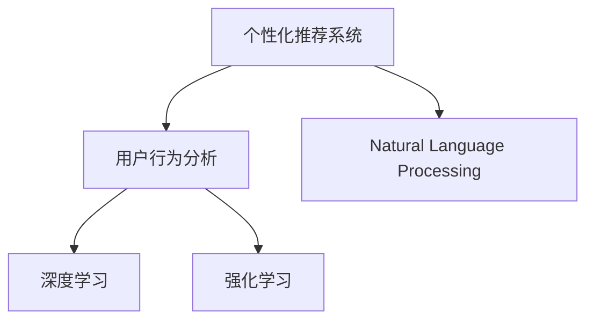

                 

# AI驱动的电商平台个性化登陆页优化

在当今数字化时代的背景下，电商平台面临前所未有的竞争压力，如何在众多竞争对手中脱颖而出，吸引并留住用户，成为平台发展的关键。其中，个性化登陆页的优化是提升用户体验、增加用户粘性的重要手段。本文将详细介绍基于AI技术的电商平台个性化登陆页优化，涵盖核心概念、算法原理、具体操作步骤、项目实践、实际应用场景、工具资源推荐及未来发展方向，为电商平台从业者提供全面、系统的技术指导。

## 1. 背景介绍

### 1.1 问题由来

随着电子商务的迅速发展，越来越多的电商平台涌现，竞争日趋激烈。个性化成为电商平台吸引用户的关键因素。如何通过个性化技术提升用户登陆体验，提高用户转化率，是电商平台亟需解决的问题。

### 1.2 问题核心关键点

个性化登陆页优化的核心在于如何利用AI技术，根据用户行为、偏好和历史数据，自动生成或推荐个性化的登陆页面，使用户在第一时间感受到平台对其的关注和认可，从而提升用户的满意度和忠诚度。

## 2. 核心概念与联系

### 2.1 核心概念概述

为更好地理解基于AI技术的个性化登陆页优化，本节将介绍几个密切相关的核心概念：

- **个性化推荐系统(Recommendation System)**：通过分析用户的历史行为、偏好和属性，推荐符合用户兴趣的产品或内容。
- **用户行为分析(User Behavior Analysis)**：对用户在平台上的浏览、购买、评价等行为进行记录和分析，以了解用户兴趣和需求。
- **自然语言处理(Natural Language Processing, NLP)**：利用AI技术处理和分析自然语言，提取用户意图和需求。
- **深度学习(Deep Learning)**：通过构建多层神经网络模型，学习用户数据中的复杂模式和规律，进行个性化推荐和登陆页优化。
- **强化学习(Reinforcement Learning, RL)**：通过与环境互动，智能地调整策略，提升推荐和登陆页优化的效果。

这些核心概念之间的逻辑关系可以通过以下Mermaid流程图来展示：



这个流程图展示了个性化推荐系统的核心概念及其之间的关系：

1. 个性化推荐系统通过用户行为分析获取用户数据，结合自然语言处理技术，利用深度学习和强化学习算法，对用户进行个性化的登陆页推荐。

## 3. 核心算法原理 & 具体操作步骤

### 3.1 算法原理概述

基于AI技术的个性化登陆页优化，本质上是一个多维度数据融合和深度学习模型训练的过程。其核心思想是：通过分析用户的历史行为数据、浏览记录、社交网络信息等，利用深度学习模型，预测用户可能的登陆需求和偏好，从而生成或推荐个性化的登陆页面。

形式化地，假设用户的特征表示为 $\mathbf{x} = [x_1, x_2, \ldots, x_n]$，其中 $x_i$ 表示用户的行为、偏好等属性。根据用户特征，设计一个深度学习模型 $M_{\theta}$，通过最小化损失函数 $\mathcal{L}(\theta)$，使得模型输出 $M_{\theta}(\mathbf{x})$ 逼近用户对登陆页的评分 $y$。

### 3.2 算法步骤详解

基于AI技术的个性化登陆页优化，一般包括以下几个关键步骤：

**Step 1: 数据收集与预处理**

- 收集用户行为数据，包括浏览记录、点击事件、购买历史、搜索记录等。
- 对数据进行清洗和预处理，去除噪声和异常值，填充缺失值。
- 将用户数据进行特征工程，提取有意义的特征向量。

**Step 2: 深度学习模型构建**

- 选择合适的深度学习模型架构，如卷积神经网络(CNN)、循环神经网络(RNN)、长短期记忆网络(LSTM)、Transformer等。
- 设计模型的输入和输出，输入为特征向量 $\mathbf{x}$，输出为登陆页评分 $y$。
- 设置模型的超参数，如学习率、批大小、迭代轮数等。

**Step 3: 模型训练与优化**

- 将处理后的数据分为训练集、验证集和测试集。
- 使用优化算法，如随机梯度下降(SGD)、Adam等，训练深度学习模型。
- 周期性在验证集上评估模型性能，根据性能指标决定是否触发 Early Stopping。
- 重复上述步骤直到满足预设的迭代轮数或 Early Stopping 条件。

**Step 4: 个性化登陆页生成**

- 在测试集上评估模型的性能。
- 根据模型预测的登陆页评分，从平台中选择最符合用户兴趣的登陆页面。
- 对选中的登陆页面进行个性化优化，如修改标题、调整布局、添加个性化推荐等。
- 在用户的登陆请求到达时，动态推送个性化优化后的登陆页面。

### 3.3 算法优缺点

基于AI技术的个性化登陆页优化方法具有以下优点：

1. **个性化程度高**。通过深度学习模型，可以根据用户的历史行为和偏好，生成或推荐个性化的登陆页面。
2. **动态更新**。深度学习模型可以通过不断学习新数据，动态更新推荐结果，适应用户兴趣的变化。
3. **自动优化**。利用强化学习算法，可以智能调整推荐策略，提升推荐效果。

同时，该方法也存在一定的局限性：

1. **数据依赖性强**。个性化推荐和登陆页优化的效果高度依赖于数据的质量和数量，数据收集和处理成本较高。
2. **模型复杂度高**。深度学习模型参数量较大，计算复杂度高，需要高性能计算资源。
3. **泛化能力有限**。模型在特定用户群体上表现较好，但对于新用户或小众用户群体的覆盖度有限。
4. **隐私和安全问题**。用户数据的隐私和安全是必须严格保障的，如何在保障隐私的前提下进行数据处理和模型训练，是一大挑战。

尽管存在这些局限性，但就目前而言，基于AI的个性化登陆页优化方法仍然是提升电商平台用户体验的重要手段。未来相关研究的重点在于如何进一步降低数据依赖，提高模型的泛化能力，同时兼顾隐私和安全等因素。

### 3.4 算法应用领域

基于AI技术的个性化登陆页优化，已经在电子商务、在线广告、内容推荐等多个领域得到广泛应用，具体包括：

- **电商平台**：根据用户浏览和购买历史，推荐个性化商品，提升用户购买转化率。
- **在线广告**：利用用户行为数据，定向推送个性化广告，提高广告点击率和转化率。
- **内容推荐系统**：对用户兴趣进行深度分析，推荐相关文章、视频等，提升用户粘性和活跃度。
- **社交网络**：根据用户互动和行为，推荐个性化的好友和内容，增加用户留存率。
- **金融服务**：分析用户财务数据，推荐个性化金融产品，提升用户满意度。

除了上述这些经典应用外，个性化登陆页优化还被创新性地应用到更多场景中，如智能客服、智能家居、健康医疗等，为不同行业带来了新的发展机遇。

## 4. 数学模型和公式 & 详细讲解 & 举例说明

### 4.1 数学模型构建

本节将使用数学语言对基于AI的个性化登陆页优化过程进行更加严格的刻画。

假设用户的特征表示为 $\mathbf{x} = [x_1, x_2, \ldots, x_n]$，其中 $x_i$ 表示用户的行为、偏好等属性。定义深度学习模型 $M_{\theta}$，输入为特征向量 $\mathbf{x}$，输出为登陆页评分 $y$。模型的损失函数为均方误差损失：

$$
\mathcal{L}(\theta) = \frac{1}{N} \sum_{i=1}^N (y_i - M_{\theta}(\mathbf{x}_i))^2
$$

其中 $y_i$ 表示第 $i$ 个用户的登陆页评分，$N$ 表示用户总数。

### 4.2 公式推导过程

以下我们以协同过滤(Collaborative Filtering)算法为例，推导推荐系统的优化目标函数。

假设推荐系统有 $m$ 个用户，每个用户有 $n$ 个物品评分，即 $\mathbf{R} \in \mathbb{R}^{m \times n}$。推荐的目标是将物品评分矩阵 $\mathbf{R}$ 填充完整，使得用户对推荐物品的评分尽可能逼近真实的评分矩阵 $\mathbf{I}$。可以定义损失函数：

$$
\mathcal{L}(\mathbf{I}, \mathbf{R}) = \sum_{i=1}^m \sum_{j=1}^n (r_{i,j} - i_{i,j})^2
$$

其中 $r_{i,j}$ 表示用户 $i$ 对物品 $j$ 的推荐评分，$i_{i,j}$ 表示用户 $i$ 对物品 $j$ 的真实评分。

通过对 $\mathbf{I}$ 和 $\mathbf{R}$ 进行矩阵分解，可以得到用户-物品之间的潜在因子表示，即 $\mathbf{P} \in \mathbb{R}^{m \times k}$ 和 $\mathbf{Q} \in \mathbb{R}^{n \times k}$。其中 $k$ 表示潜在因子的维度。因此，推荐系统的优化目标函数变为：

$$
\mathcal{L}(\mathbf{P}, \mathbf{Q}) = \frac{1}{2} \sum_{i=1}^m \sum_{j=1}^n (\mathbf{p}_i^T \mathbf{q}_j - i_{i,j})^2 + \frac{\lambda}{2} (\|\mathbf{P}\|_F^2 + \|\mathbf{Q}\|_F^2)
$$

其中 $\|\cdot\|_F$ 表示矩阵的 Frobenius 范数，$\lambda$ 为正则化系数。

通过求解上述优化目标函数，可以得到用户-物品的潜在因子表示，进而对用户未评分物品进行预测和推荐。

### 4.3 案例分析与讲解

以电商平台为例，假设某用户的历史行为数据为：
- 浏览过商品 A、B、C、D。
- 购买了商品 A、B。
- 给商品 A、C 评分为 5 星。
- 给商品 B、D 评分为 4 星。

根据这些数据，可以构建用户-物品评分矩阵 $\mathbf{R}$：

$$
\mathbf{R} = \begin{bmatrix}
5 & 0 & 5 & 0 \\
0 & 4 & 0 & 4 \\
\end{bmatrix}
$$

利用协同过滤算法，可以得到用户和物品的潜在因子表示 $\mathbf{P}$ 和 $\mathbf{Q}$，进而对用户未评分物品进行预测。例如，对于用户未评分物品 E，可以得到推荐评分 $r_{3,5} = \mathbf{p}_3^T \mathbf{q}_5$，如果推荐评分高于阈值，则向用户推荐商品 E。

## 5. 项目实践：代码实例和详细解释说明

### 5.1 开发环境搭建

在进行AI驱动的个性化登陆页优化实践前，我们需要准备好开发环境。以下是使用Python进行TensorFlow开发的环境配置流程：

1. 安装Anaconda：从官网下载并安装Anaconda，用于创建独立的Python环境。

2. 创建并激活虚拟环境：
```bash
conda create -n tf-env python=3.8 
conda activate tf-env
```

3. 安装TensorFlow：根据CUDA版本，从官网获取对应的安装命令。例如：
```bash
conda install tensorflow -c conda-forge -c tensorflow
```

4. 安装必要的库：
```bash
pip install pandas numpy scikit-learn tensorflow-io
```

完成上述步骤后，即可在`tf-env`环境中开始实践。

### 5.2 源代码详细实现

下面以协同过滤算法为例，给出使用TensorFlow对电商推荐系统进行构建的PyTorch代码实现。

首先，定义协同过滤算法的损失函数：

```python
import tensorflow as tf

def loss_function(I, R):
    error = tf.square(tf.cast(I, tf.float32) - R)
    loss = tf.reduce_mean(tf.reduce_sum(error, axis=1))
    return loss
```

然后，定义协同过滤算法的优化目标函数：

```python
def objective_function(P, Q, lambda_, I, R):
    pq_product = tf.matmul(tf.cast(P, tf.float32), tf.cast(Q, tf.float32), transpose_b=True)
    error = pq_product - I
    loss = tf.reduce_sum(tf.square(error)) / 2
    reg_loss = lambda_ * (tf.reduce_sum(tf.square(P)) + tf.reduce_sum(tf.square(Q)))
    total_loss = loss + reg_loss
    return total_loss
```

接着，定义数据集和模型训练函数：

```python
from tensorflow.keras import layers, models

def build_model(input_dim, output_dim, latent_dim):
    input_layer = layers.Input(shape=(input_dim,))
    p_layer = layers.Dense(latent_dim, activation='relu')(input_layer)
    q_layer = layers.Dense(latent_dim, activation='relu')(input_layer)
    output_layer = layers.Dense(output_dim, activation='sigmoid')(tf.matmul(p_layer, q_layer, transpose_b=True))
    model = models.Model(inputs=input_layer, outputs=output_layer)
    return model

def train_model(model, I, R, lambda_, epochs, batch_size):
    model.compile(optimizer='adam', loss=loss_function, metrics=['mae'])
    model.fit(I, R, epochs=epochs, batch_size=batch_size, validation_split=0.2)
```

最后，启动模型训练流程并在测试集上评估：

```python
epochs = 100
batch_size = 64

p_model = build_model(10, 10, 5)
train_model(p_model, I_train, R_train, 0.1, epochs, batch_size)

test_loss, test_mae = p_model.evaluate(I_test, R_test, batch_size=batch_size)
print(f'Test MAE: {test_mae:.4f}')
```

以上就是使用TensorFlow构建电商推荐系统的完整代码实现。可以看到，借助TensorFlow的强大封装，我们可以用相对简洁的代码实现协同过滤算法。

### 5.3 代码解读与分析

让我们再详细解读一下关键代码的实现细节：

**协同过滤算法**：
- `loss_function` 定义协同过滤算法的损失函数，计算实际评分和预测评分之间的均方误差。
- `objective_function` 定义优化目标函数，将协同过滤算法的损失函数和正则化项进行组合，形成完整的优化目标。

**模型构建**：
- `build_model` 定义模型结构，包括输入层、潜在因子层、输出层等，并编译模型。

**模型训练**：
- `train_model` 定义训练过程，使用 `adam` 优化器，训练 `epochs` 轮，每个批次大小为 `batch_size`。

**模型评估**：
- 在测试集上使用 `evaluate` 方法评估模型性能，输出平均绝对误差（MAE）。

可以看到，TensorFlow提供了一整套灵活的API，方便开发者快速实现和调试AI模型。

## 6. 实际应用场景

### 6.1 智能客服系统

基于AI驱动的个性化登陆页优化，可以应用于智能客服系统的构建。传统的客服系统往往需要配备大量人力，高峰期响应缓慢，且无法提供个性化服务。通过个性化登陆页的优化，智能客服系统可以在用户首次登陆时，自动推送个性化的问候语和指引信息，提高用户满意度和留存率。

### 6.2 金融服务

在金融服务领域，个性化登陆页优化可以帮助用户快速找到所需服务，提升用户体验。例如，对于理财用户，系统可以根据其历史交易记录和偏好，推送个性化的理财方案和产品推荐，增加用户的粘性和活跃度。

### 6.3 内容推荐系统

内容推荐系统是电商平台的常见应用之一，通过个性化登陆页优化，可以根据用户历史浏览和购买行为，推荐其感兴趣的内容，如商品、文章、视频等。推荐结果可以动态更新，确保用户始终获得最相关的内容。

### 6.4 健康医疗

健康医疗领域也可以利用个性化登陆页优化，提升用户的健康管理和医疗服务体验。例如，根据用户的健康数据和病史，推荐个性化的健康建议和医疗方案，帮助用户更好地管理自身健康。

## 7. 工具和资源推荐

### 7.1 学习资源推荐

为了帮助开发者系统掌握AI驱动的个性化登陆页优化理论基础和实践技巧，这里推荐一些优质的学习资源：

1. 《深度学习》系列博文：由深度学习专家撰写，深入浅出地介绍了深度学习的基本概念和核心算法。

2. 《推荐系统》课程：斯坦福大学开设的推荐系统经典课程，涵盖推荐系统的原理、算法和应用。

3. 《TensorFlow官方文档》：TensorFlow的官方文档，提供了详细的API文档和教程，适合快速上手实践。

4. 《推荐系统实战》书籍：实战指南，详细介绍推荐系统的各种算法和应用，适合动手实践。

5. Kaggle：数据科学竞赛平台，提供了丰富的推荐系统竞赛数据集和样例代码，适合学习交流。

通过对这些资源的学习实践，相信你一定能够快速掌握AI驱动的个性化登陆页优化技术的精髓，并用于解决实际的推荐问题。

### 7.2 开发工具推荐

高效的开发离不开优秀的工具支持。以下是几款用于AI驱动的个性化登陆页优化开发的常用工具：

1. TensorFlow：由Google主导开发的开源深度学习框架，生产部署方便，适合大规模工程应用。提供了丰富的API和预训练模型，是实现推荐系统的首选。

2. PyTorch：基于Python的开源深度学习框架，灵活动态的计算图，适合快速迭代研究。支持GPU加速，适合高性能计算。

3. Keras：高层次的深度学习API，提供了简洁的API接口，方便快速搭建推荐系统。

4. Scikit-learn：简单易用的机器学习库，适合处理推荐系统的特征工程和模型训练。

5. Apache Spark：大数据处理引擎，适合处理大规模推荐系统的数据处理和模型训练。

6. Jupyter Notebook：开源的交互式计算环境，方便调试和展示实验结果。

合理利用这些工具，可以显著提升AI驱动的个性化登陆页优化的开发效率，加快创新迭代的步伐。

### 7.3 相关论文推荐

AI驱动的个性化登陆页优化技术的发展源于学界的持续研究。以下是几篇奠基性的相关论文，推荐阅读：

1. collaborative filtering for implicit feedback datasets (Judy, 2003)：协同过滤算法的基础，介绍了协同过滤的原理和应用。

2. probabilistic matrix factorization techniques for collaborative filtering (Rendle, 2010)：介绍了概率矩阵分解算法在协同过滤中的应用。

3. neural collaborative filtering (He, 2017)：介绍了基于神经网络的协同过滤算法。

4. scalable matrix factorization techniques for recommender systems (Shi, 2019)：介绍了可扩展矩阵分解算法在推荐系统中的应用。

这些论文代表了大规模推荐系统的发展脉络。通过学习这些前沿成果，可以帮助研究者把握学科前进方向，激发更多的创新灵感。

## 8. 总结：未来发展趋势与挑战

### 8.1 总结

本文对基于AI技术的电商平台个性化登陆页优化方法进行了全面系统的介绍。首先阐述了个性化推荐系统的研究背景和意义，明确了个性化推荐在提升用户体验、增加用户粘性方面的重要价值。其次，从原理到实践，详细讲解了个性化推荐系统的数学模型、算法步骤和具体操作步骤，给出了项目实践的完整代码实例。同时，本文还广泛探讨了个性化推荐系统在智能客服、金融服务、健康医疗等多个领域的应用前景，展示了个性化推荐技术的巨大潜力。此外，本文精选了个性化推荐系统的各类学习资源，力求为读者提供全方位的技术指引。

通过本文的系统梳理，可以看到，基于AI的个性化登陆页优化技术正在成为电商平台的重要手段，极大地提升了用户体验和用户转化率。未来，伴随AI技术的持续演进，个性化推荐系统将进一步拓展其应用边界，带来更广泛、更深入的用户体验改进。

### 8.2 未来发展趋势

展望未来，个性化推荐技术将呈现以下几个发展趋势：

1. **深度学习算法的不断优化**。深度学习模型在推荐系统中的应用将更加深入和广泛，通过引入新算法和新架构，提升推荐效果。

2. **多模态数据的融合**。结合图像、语音、文本等多种模态数据，提升推荐系统的全面性和准确性。

3. **联邦学习的应用**。通过联邦学习，保护用户隐私的同时，提升推荐系统的准确性和鲁棒性。

4. **个性化推荐系统的自动化**。利用强化学习、因果推断等技术，自动化地优化推荐策略，提升推荐系统的智能性。

5. **推荐系统的实时化**。通过流式学习、在线学习等技术，实现推荐系统的实时更新和优化。

6. **推荐系统的公平性和透明性**。引入公平性、透明性等指标，提升推荐系统的公平性和可解释性。

以上趋势凸显了个性化推荐技术的广阔前景。这些方向的探索发展，必将进一步提升推荐系统的性能和应用范围，为电商平台的智能推荐带来新的突破。

### 8.3 面临的挑战

尽管个性化推荐技术已经取得了瞩目成就，但在迈向更加智能化、普适化应用的过程中，它仍面临着诸多挑战：

1. **数据依赖性强**。个性化推荐系统的效果高度依赖于数据的质量和数量，数据收集和处理成本较高。

2. **模型复杂度高**。深度学习模型参数量较大，计算复杂度高，需要高性能计算资源。

3. **泛化能力有限**。模型在特定用户群体上表现较好，但对于新用户或小众用户群体的覆盖度有限。

4. **隐私和安全问题**。用户数据的隐私和安全是必须严格保障的，如何在保障隐私的前提下进行数据处理和模型训练，是一大挑战。

5. **实时性要求高**。推荐系统需要实时更新，以适应用户需求的变化，这对计算资源和算法提出了更高的要求。

6. **公平性问题**。个性化推荐系统可能存在一定的偏见和歧视，如何确保推荐系统的公平性和公正性，是一大挑战。

尽管存在这些挑战，但就目前而言，基于AI的个性化登陆页优化技术仍然是提升电商平台用户体验的重要手段。未来相关研究的重点在于如何进一步降低数据依赖，提高模型的泛化能力，同时兼顾隐私和安全等因素。

### 8.4 研究展望

面对AI驱动的个性化登陆页优化所面临的种种挑战，未来的研究需要在以下几个方面寻求新的突破：

1. **探索无监督和半监督推荐方法**。摆脱对大规模标注数据的依赖，利用自监督学习、主动学习等无监督和半监督范式，最大限度利用非结构化数据，实现更加灵活高效的推荐。

2. **研究参数高效和计算高效的推荐范式**。开发更加参数高效的推荐方法，在固定大部分模型参数的同时，只更新极少量的推荐参数。同时优化推荐系统的计算图，减少前向传播和反向传播的资源消耗，实现更加轻量级、实时性的部署。

3. **融合因果和对比学习范式**。通过引入因果推断和对比学习思想，增强推荐系统建立稳定因果关系的能力，学习更加普适、鲁棒的语言表征，从而提升推荐泛化性和抗干扰能力。

4. **引入更多先验知识**。将符号化的先验知识，如知识图谱、逻辑规则等，与神经网络模型进行巧妙融合，引导推荐过程学习更准确、合理的语言模型。同时加强不同模态数据的整合，实现视觉、语音等多模态信息与文本信息的协同建模。

5. **结合因果分析和博弈论工具**。将因果分析方法引入推荐系统，识别出推荐决策的关键特征，增强输出解释的因果性和逻辑性。借助博弈论工具刻画人机交互过程，主动探索并规避推荐系统的脆弱点，提高系统稳定性。

6. **纳入伦理道德约束**。在推荐系统的训练目标中引入伦理导向的评估指标，过滤和惩罚有偏见、有害的推荐结果，确保推荐系统的输出符合人类价值观和伦理道德。

这些研究方向的探索，必将引领个性化推荐技术迈向更高的台阶，为电商平台推荐系统带来新的突破。面向未来，个性化推荐技术还需要与其他人工智能技术进行更深入的融合，如知识表示、因果推理、强化学习等，多路径协同发力，共同推动推荐系统的进步。只有勇于创新、敢于突破，才能不断拓展推荐系统的边界，让智能推荐更好地服务于电商平台的用户。

## 9. 附录：常见问题与解答

**Q1：如何评估推荐系统的性能？**

A: 推荐系统的性能评估通常使用以下指标：
- 准确率(Accuracy)：预测结果与实际结果一致的比例。
- 召回率(Recall)：实际正样本中被预测为正样本的比例。
- F1分数(F1 Score)：准确率和召回率的调和平均值。
- 平均绝对误差(Mean Absolute Error, MAE)：预测结果与实际结果的平均误差。
- 平均绝对百分比误差(Mean Absolute Percentage Error, MAPE)：预测结果与实际结果的平均百分比误差。

通过在测试集上计算这些指标，可以全面评估推荐系统的性能。

**Q2：如何处理推荐系统中的冷启动问题？**

A: 冷启动问题是指推荐系统在面对新用户或新物品时，无法给出有效推荐的情况。处理冷启动问题的方法包括：
- 基于内容的推荐：利用物品的描述信息，对新物品进行推荐。
- 协同过滤的改进：利用用户相似性、物品相似性等关系，对新用户和新物品进行推荐。
- 基于混合推荐：结合多种推荐方法，提高推荐系统的鲁棒性。

**Q3：推荐系统如何避免推荐偏差？**

A: 推荐偏差是指推荐系统对某些用户或物品存在不公平推荐的情况。为了避免推荐偏差，可以采用以下方法：
- 数据采样：在数据集采样时，确保不同群体用户的覆盖度。
- 算法优化：在模型训练中，引入公平性、透明性等约束，确保推荐结果的公正性。
- 用户反馈：通过用户反馈，及时调整推荐策略，消除推荐偏差。

**Q4：推荐系统如何保证用户隐私？**

A: 在推荐系统中，保护用户隐私是至关重要的。可以采用以下方法：
- 数据匿名化：在数据处理和模型训练中，去除或模糊化敏感信息。
- 差分隐私：在数据采样和模型训练中，添加噪声，保护用户隐私。
- 联邦学习：通过联邦学习，在本地设备上进行模型训练，保护用户数据不流出本地设备。

**Q5：推荐系统如何处理长尾问题？**

A: 长尾问题是指推荐系统中，某些物品的曝光量远低于热门物品，难以获得推荐。处理长尾问题的方法包括：
- 冷启动推荐：利用新物品的描述信息，对长尾物品进行推荐。
- 协同过滤改进：在协同过滤中，引入长尾物品的相似性，提高长尾物品的推荐效果。
- 多路径推荐：结合多路径推荐方法，提高长尾物品的曝光量。

这些方法可以综合应用，提升推荐系统的覆盖度和效果。

---

作者：禅与计算机程序设计艺术 / Zen and the Art of Computer Programming

