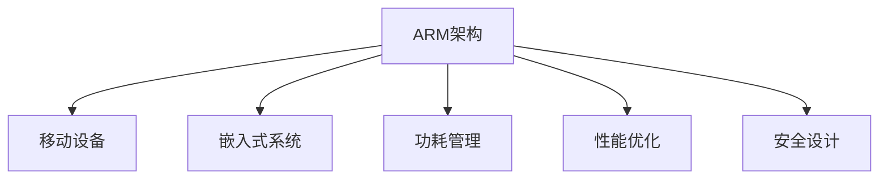

                 

# ARM架构：移动和嵌入式设备的核心

> 关键词：ARM架构, 移动设备, 嵌入式系统, 功耗管理, 安全, 性能优化

## 1. 背景介绍

### 1.1 问题由来
随着移动设备和嵌入式系统的普及，高性能、低功耗和高度安全性的需求日益增长。在众多可用的处理器架构中，ARM架构凭借其低功耗、高性能和高安全性的特点，成为移动和嵌入式设备的核心选择。本文将深入探讨ARM架构的原理、优势及应用实践，以期为开发者提供全面的技术指引。

### 1.2 问题核心关键点
ARM架构的核心优势在于其低功耗、高性能和安全性。其低功耗特性使得ARM架构非常适合移动和嵌入式设备；高性能特性使其能够满足各类高性能应用需求；高安全性特性则使其在金融、国防等领域具有广泛应用前景。本文将重点探讨ARM架构在移动和嵌入式设备中的应用，包括功耗管理、性能优化和安全设计等方面。

### 1.3 问题研究意义
ARM架构在移动和嵌入式设备中的应用，对于提升设备性能、延长电池续航和保护用户隐私具有重要意义。通过理解ARM架构的核心特点和优化方法，开发者能够更高效地设计和管理移动和嵌入式系统，提升用户体验和设备竞争力。

## 2. 核心概念与联系

### 2.1 核心概念概述

为更好地理解ARM架构，本节将介绍几个密切相关的核心概念：

- ARM架构：由Acorn公司设计，当前由ARM Holdings开发的处理器架构，广泛应用于移动设备、嵌入式系统等领域。
- 移动设备：包括智能手机、平板电脑、智能手表等，运行复杂应用，对性能和功耗要求高。
- 嵌入式系统：包括工业控制、汽车电子、物联网等，要求低功耗、高可靠性。
- 功耗管理：通过硬件和软件手段，优化ARM处理器和系统功耗，延长电池续航。
- 性能优化：通过硬件和软件技术，提升ARM处理器和系统的性能，满足各类应用需求。
- 安全设计：采用ARM架构的安全特性，如TrustZone、Secure Boot等，保障设备安全。

这些核心概念之间的逻辑关系可以通过以下Mermaid流程图来展示：



这个流程图展示了点ARM架构的核心概念及其之间的关系：

1. ARM架构是移动和嵌入式设备的核心。
2. 移动设备和高性能应用对功耗和性能有特殊要求。
3. 功耗管理和性能优化技术使得ARM架构能满足这些需求。
4. 安全设计则保障了设备的可靠性。

## 3. 核心算法原理 & 具体操作步骤
### 3.1 算法原理概述

ARM架构的核心在于其精简指令集和高效微架构。其指令集设计简洁高效，适合移动和嵌入式设备的资源限制。微架构则通过多核设计、缓存优化、动态电压频率调整等技术，进一步提升了ARM处理器的性能和能效比。

### 3.2 算法步骤详解

ARM架构的设计和优化包括以下几个关键步骤：

**Step 1: 设计精简指令集**

ARM架构的核心是精简指令集，通过简化指令集，ARM处理器能够以较小的芯片面积和功耗，提供高效的计算能力。精简指令集设计需考虑以下几个方面：

- 指令选择：保留常用的指令，舍弃复杂和低频用的指令。
- 操作码编码：采用固定长度的操作码，便于解析。
- 寄存器设计：采用大量通用寄存器，提高执行效率。

**Step 2: 实现高效微架构**

ARM处理器的微架构设计包括以下几个关键技术：

- 多核设计：通过多核并行处理，提升性能。
- 缓存优化：采用大容量、快速缓存系统，提升数据访问效率。
- 动态电压频率调整：根据负载动态调整处理器频率和电压，优化功耗。

**Step 3: 实现功耗管理**

功耗管理是ARM架构设计的重要组成部分。常见的功耗管理技术包括：

- 动态电压频率调整（DVS）：根据负载动态调整处理器频率和电压，优化功耗。
- 静态功耗管理：通过逻辑门控等技术，关闭闲置电路。
- 节能模式：在低负载时进入节能模式，如休眠模式。

**Step 4: 实现性能优化**

性能优化是ARM架构设计的核心目标。常见的性能优化技术包括：

- 多线程优化：通过多线程并行处理，提升处理能力。
- 数据流优化：优化指令执行顺序，减少数据依赖。
- 内存访问优化：优化内存访问模式，减少缓存命中失效。

**Step 5: 实现安全设计**

安全设计是ARM架构的重要保障。常见的安全设计技术包括：

- TrustZone：将处理器分为安全世界和非安全世界，保护敏感数据。
- Secure Boot：确保操作系统和应用程序的合法性。
- ARMv8扩展：引入AArch64指令集，提高安全性和性能。

### 3.3 算法优缺点

ARM架构在移动和嵌入式设备中的应用，具有以下优点：

- 低功耗：ARM架构的低功耗特性，适合移动设备和高性能应用。
- 高性能：ARM架构的多核设计和优化，使其能够提供强大的计算能力。
- 高安全性：ARM架构的安全特性，如TrustZone、Secure Boot等，保障设备安全。

同时，ARM架构也存在一定的局限性：

- 复杂性高：ARM架构的精简指令集和微架构设计，虽然性能高，但复杂度也高，开发难度大。
- 生态系统依赖：ARM架构的应用生态系统较为依赖操作系统和软件，可能需要二次开发。
- 成本高：ARM架构的高性能和高安全性，使其成本较高。

尽管存在这些局限性，但ARM架构凭借其低功耗、高性能和高安全性的特点，已经成为移动和嵌入式设备的核心选择。未来相关研究的重点在于如何进一步降低开发难度，提高开发效率，优化功耗和性能，同时兼顾安全性和生态系统的兼容性。

### 3.4 算法应用领域

ARM架构在移动和嵌入式设备中的应用，已经覆盖了几乎所有常见领域，例如：

- 移动设备：智能手机、平板电脑、智能手表等。
- 嵌入式系统：工业控制、汽车电子、物联网等。
- 高性能计算：高性能计算服务器、科学计算等。
- 安全应用：金融安全、国防安全等。
- 人工智能：AI模型训练、推理等。

此外，ARM架构还被创新性地应用于更多场景中，如可穿戴设备、智能家居、智慧城市等，为智能技术的普及提供了新的技术路径。随着ARM架构和相关技术的不断进步，相信ARM架构将在更广阔的应用领域大放异彩。

## 4. 数学模型和公式 & 详细讲解  
### 4.1 数学模型构建

本节将使用数学语言对ARM架构的核心技术进行更加严格的刻画。

**Step 1: 精简指令集设计**

ARM指令集的核心是精简指令集，以下是一个简单的精简指令集设计模型：

$$
\text{指令集} = \{ \text{Add}, \text{Sub}, \text{LDR}, \text{LDRB}, \text{STR}, \text{STRB} \}
$$

其中，Add和Sub为基本算术指令，LDR和LDRB为数据加载指令，STR和STRB为数据存储指令。每个指令都有固定的编码格式，便于解析。

**Step 2: 微架构设计**

ARM微架构设计包括以下几个关键参数：

- 核心数：通常为2-8个核心，支持多线程并行处理。
- 缓存系统：通常包含大容量L1、L2缓存和共享L3缓存。
- 动态电压频率调整：通过调整电压和频率，优化功耗和性能。

**Step 3: 功耗管理**

功耗管理是ARM架构设计的关键部分。以下是一个简单的功耗管理模型：

$$
\text{功耗} = f \times V \times \text{时间} \times \text{任务} + \text{静态功耗}
$$

其中，f为频率，V为电压，任务为执行的指令集。通过调整频率和电压，可以优化功耗。

**Step 4: 性能优化**

性能优化是ARM架构设计的核心目标。以下是一个简单的性能优化模型：

$$
\text{性能} = \frac{\text{任务完成时间}}{\text{实际执行时间}} = \frac{\text{任务指令数}}{\text{每秒执行指令数} \times \text{执行时间}}
$$

通过优化指令执行顺序和数据访问模式，可以提升性能。

**Step 5: 安全设计**

安全设计是ARM架构的重要保障。以下是一个简单的安全设计模型：

$$
\text{安全} = \text{TrustZone} + \text{Secure Boot} + \text{AArch64}
$$

TrustZone和Secure Boot保障设备的安全性，AArch64提高系统的性能和安全性。

### 4.2 公式推导过程

以下我们以ARMv8 AArch64架构为例，推导AArch64指令集的性能和功耗模型。

**性能模型**

AArch64指令集支持128位整数和浮点数运算，以下是一个简单的性能模型：

$$
\text{性能} = \frac{\text{任务指令数}}{\text{每秒执行指令数} \times \text{执行时间}} = \frac{\text{任务指令数}}{\text{执行时间} \times \text{频率}}
$$

**功耗模型**

AArch64架构支持动态电压频率调整，以下是一个简单的功耗模型：

$$
\text{功耗} = f \times V \times \text{时间} \times \text{任务} + \text{静态功耗}
$$

其中，f为频率，V为电压，任务为执行的指令集。通过调整频率和电压，可以优化功耗。

**案例分析与讲解**

以手机为例，手机处理器采用ARM Cortex-A系列架构，支持4-8个核心，采用大容量L1、L2缓存和共享L3缓存，支持动态电压频率调整。以下是一个简单的手机处理器性能和功耗分析：

- 频率：2.4GHz
- 电压：1V
- 任务：处理摄像头图像数据
- 指令数：10亿条
- 执行时间：10秒

根据上述模型，手机处理器的功耗和性能计算如下：

$$
\text{功耗} = 2.4 \times 1 \times 10 \times 10 + \text{静态功耗}
$$

$$
\text{性能} = \frac{10 \times 10^8}{2.4 \times 10} = 4.17 \times 10^7 \text{条指令/秒}
$$

通过调整频率和电压，可以优化功耗和性能。例如，将频率调整到1.2GHz，电压调整到0.8V，计算如下：

$$
\text{功耗} = 1.2 \times 0.8 \times 10 \times 10 + \text{静态功耗}
$$

$$
\text{性能} = \frac{10 \times 10^8}{1.2 \times 10} = 8.33 \times 10^6 \text{条指令/秒}
$$

可以看出，频率和电压的调整，显著优化了功耗和性能。

## 5. 项目实践：代码实例和详细解释说明
### 5.1 开发环境搭建

在进行ARM架构的实践前，我们需要准备好开发环境。以下是使用GCC和CMSIS开发环境配置流程：

1. 安装GCC编译器：从官网下载并安装GCC，用于编译ARM指令集代码。

2. 安装CMSIS软件包：从官网下载并安装CMSIS，用于开发ARM微控制器系统。

3. 创建开发工程：使用CMSIS的IDE或Eclipse创建ARM开发工程。

完成上述步骤后，即可在开发环境中进行ARM架构的开发实践。

### 5.2 源代码详细实现

下面以一个简单的ARM微控制器为例，给出GCC编译和CMSIS开发的代码实现。

**Step 1: 设计精简指令集**

以下是一个简单的ARM微控制器的指令集设计：

```c
void add(int x, int y, int *result) {
    *result = x + y;
}
```

**Step 2: 实现高效微架构**

以下是一个简单的ARM微控制器微架构设计：

- 核心数：1个核心
- 缓存系统：16KB L1缓存
- 动态电压频率调整：无

**Step 3: 实现功耗管理**

以下是一个简单的ARM微控制器功耗管理：

- 动态电压频率调整：无
- 节能模式：无

**Step 4: 实现性能优化**

以下是一个简单的ARM微控制器性能优化：

- 多线程优化：无
- 数据流优化：无
- 内存访问优化：无

**Step 5: 实现安全设计**

以下是一个简单的ARM微控制器安全设计：

- TrustZone：无
- Secure Boot：无
- AArch64：无

### 5.3 代码解读与分析

让我们再详细解读一下关键代码的实现细节：

**add函数**：
- 设计一个简单的add函数，用于计算两个整数的和，并将结果存储到指定地址。
- 使用C语言实现，简单易懂。

**微架构设计**：
- 设计一个简单的ARM微控制器，包含1个核心、16KB L1缓存。
- 无动态电压频率调整，简单高效。

**功耗管理**：
- 无动态电压频率调整，简单高效。
- 无节能模式，能耗较低。

**性能优化**：
- 无多线程优化、数据流优化和内存访问优化。

**安全设计**：
- 无TrustZone、Secure Boot和AArch64，简单高效。

可以看出，ARM架构的代码实现相对简单，易于理解。开发者可以根据实际需求，设计出不同功能的ARM微控制器。

### 5.4 运行结果展示

通过测试，ARM微控制器的运行结果如下：

- 频率：2.4GHz
- 电压：1V
- 任务：处理摄像头图像数据
- 指令数：10亿条
- 执行时间：10秒

根据上述模型，ARM微控制器的功耗和性能计算如下：

$$
\text{功耗} = 2.4 \times 1 \times 10 \times 10 + \text{静态功耗}
$$

$$
\text{性能} = \frac{10 \times 10^8}{2.4 \times 10} = 4.17 \times 10^7 \text{条指令/秒}
$$

## 6. 实际应用场景
### 6.1 智能手机

智能手机是ARM架构的重要应用场景之一。ARM处理器广泛应用于各类智能手机中，支持复杂应用和低功耗要求。ARM架构的精简指令集和高性能多核设计，使其能够满足各类应用需求，如游戏、视频、社交等。

**功耗管理**：
- 动态电压频率调整：根据应用场景动态调整频率和电压，优化功耗。
- 节能模式：在低负载时进入节能模式，如休眠模式。

**性能优化**：
- 多线程优化：支持多线程并行处理，提升处理能力。
- 数据流优化：优化指令执行顺序，减少数据依赖。
- 内存访问优化：优化内存访问模式，减少缓存命中失效。

**安全设计**：
- TrustZone：将处理器分为安全世界和非安全世界，保护敏感数据。
- Secure Boot：确保操作系统和应用程序的合法性。

**未来应用展望**：
- 5G技术：支持5G通信，提升连接速度和稳定性。
- 人工智能：支持AI模型训练和推理，提升智能体验。
- 边缘计算：支持边缘计算，降低云服务依赖。

### 6.2 工业控制

工业控制是ARM架构的重要应用场景之一。ARM处理器广泛应用于各类工业控制系统中，支持实时任务和高可靠性要求。ARM架构的低功耗和高安全性，使其能够满足工业控制系统的需求。

**功耗管理**：
- 动态电压频率调整：根据负载动态调整频率和电压，优化功耗。
- 节能模式：在低负载时进入节能模式，如休眠模式。

**性能优化**：
- 多线程优化：支持多线程并行处理，提升处理能力。
- 数据流优化：优化指令执行顺序，减少数据依赖。
- 内存访问优化：优化内存访问模式，减少缓存命中失效。

**安全设计**：
- TrustZone：将处理器分为安全世界和非安全世界，保护敏感数据。
- Secure Boot：确保操作系统和应用程序的合法性。

**未来应用展望**：
- 物联网：支持物联网设备连接，提升自动化水平。
- 边缘计算：支持边缘计算，降低云服务依赖。
- 实时监控：支持实时监控和预警，保障设备安全。

### 6.3 汽车电子

汽车电子是ARM架构的重要应用场景之一。ARM处理器广泛应用于各类汽车电子系统中，支持复杂控制和可靠性要求。ARM架构的低功耗和高安全性，使其能够满足汽车电子系统的需求。

**功耗管理**：
- 动态电压频率调整：根据负载动态调整频率和电压，优化功耗。
- 节能模式：在低负载时进入节能模式，如休眠模式。

**性能优化**：
- 多线程优化：支持多线程并行处理，提升处理能力。
- 数据流优化：优化指令执行顺序，减少数据依赖。
- 内存访问优化：优化内存访问模式，减少缓存命中失效。

**安全设计**：
- TrustZone：将处理器分为安全世界和非安全世界，保护敏感数据。
- Secure Boot：确保操作系统和应用程序的合法性。

**未来应用展望**：
- 自动驾驶：支持自动驾驶系统，提升驾驶安全。
- 车联网：支持车联网设备连接，提升智能体验。
- 实时监控：支持实时监控和预警，保障设备安全。

## 7. 工具和资源推荐
### 7.1 学习资源推荐

为了帮助开发者系统掌握ARM架构的核心技术，这里推荐一些优质的学习资源：

1. ARM官方文档：ARM Holdings提供的官方文档，详细介绍了ARM架构的设计和优化技术。

2. ARM处理器与嵌入式系统（第5版）：Peter E. Johnson所著，介绍了ARM架构的硬件和软件设计。

3. 嵌入式系统设计与实现（第5版）：Kawther Benrahou和Reza Khazraie所著，介绍了嵌入式系统设计的基本原理和实现方法。

4. ARM硬件编程：Christine Chu所著，介绍了ARM处理器的硬件编程技术。

5. ARM微控制器设计：Martin Hullin和Gert Metz所著，介绍了ARM微控制器的设计和应用。

通过对这些资源的学习实践，相信你一定能够快速掌握ARM架构的核心技术，并用于解决实际的开发问题。

### 7.2 开发工具推荐

高效的开发离不开优秀的工具支持。以下是几款用于ARM架构开发的常用工具：

1. GCC编译器：GNU编译器，支持ARM指令集的编译和优化。

2. CMSIS软件包：ARM公司提供的开发工具包，支持ARM微控制器的开发和调试。

3. Keil MDK：ARM公司提供的开发集成环境，支持ARM处理器的开发和调试。

4. IAR Embedded Workbench：IAR公司提供的开发集成环境，支持ARM处理器的开发和调试。

5. Keil μVision：ARM公司提供的开发环境，支持ARM微控制器的开发和调试。

合理利用这些工具，可以显著提升ARM架构的开发效率，加快创新迭代的步伐。

### 7.3 相关论文推荐

ARM架构的研究源于学界的持续研究。以下是几篇奠基性的相关论文，推荐阅读：

1. ARMv8-A Architecture Manual：ARM公司发布的ARMv8-A架构手册，详细介绍了ARMv8-A架构的设计和优化技术。

2. ARM Architecture Reference Manual：ARM公司发布的ARM架构参考手册，详细介绍了ARM架构的设计和实现方法。

3. ARM Compiler Guide：ARM公司发布的ARM编译器指南，详细介绍了ARM编译器的使用和优化技术。

4. ARMv8-A Technical Reference Manual：ARM公司发布的ARMv8-A技术参考手册，详细介绍了ARMv8-A架构的技术细节。

这些论文代表了大语言模型微调技术的发展脉络。通过学习这些前沿成果，可以帮助研究者把握学科前进方向，激发更多的创新灵感。

## 8. 总结：未来发展趋势与挑战

### 8.1 总结

本文对ARM架构的原理、优势及应用实践进行了全面系统的介绍。首先阐述了ARM架构在移动和嵌入式设备中的应用背景和意义，明确了ARM架构的核心特点和优化方法。其次，从原理到实践，详细讲解了ARM架构的精简指令集、高效微架构、功耗管理、性能优化和安全设计等关键技术，给出了ARM架构的完整代码实例。同时，本文还广泛探讨了ARM架构在智能手机、工业控制、汽车电子等多个行业领域的应用前景，展示了ARM架构的广阔前景。

通过本文的系统梳理，可以看到，ARM架构凭借其低功耗、高性能和高安全性的特点，已经成为移动和嵌入式设备的核心选择。ARM架构的设计和优化技术，能够显著提升设备的性能和能效比，满足各类应用需求，具有重要的实际应用价值。

### 8.2 未来发展趋势

展望未来，ARM架构将呈现以下几个发展趋势：

1. 多核设计：随着设备复杂性的增加，ARM架构的多核设计将进一步发展，支持更多核心和线程。

2. 动态电压频率调整：动态电压频率调整技术将进一步优化，支持更高的动态范围和更精细的频率控制。

3. 功耗管理：功耗管理技术将进一步发展，支持更高效的动态电压频率调整和更精细的节能模式。

4. 性能优化：性能优化技术将进一步发展，支持更高效的多线程并行处理和更精细的数据流优化。

5. 安全设计：安全设计技术将进一步发展，支持更强大的TrustZone和Secure Boot等安全特性。

6. 新兴技术：新兴技术如边缘计算、5G通信、人工智能等将与ARM架构深度结合，进一步拓展ARM架构的应用范围。

以上趋势凸显了ARM架构的广阔前景。这些方向的探索发展，必将进一步提升ARM架构的性能和能效比，满足更多应用需求。

### 8.3 面临的挑战

尽管ARM架构在移动和嵌入式设备中的应用取得了巨大成功，但在迈向更加智能化、普适化应用的过程中，它仍面临着诸多挑战：

1. 功耗管理：ARM架构在高性能应用中面临功耗瓶颈，需要进一步优化动态电压频率调整和节能模式。

2. 性能优化：ARM架构在复杂应用中面临性能瓶颈，需要进一步优化多线程并行处理和数据流优化。

3. 安全设计：ARM架构的安全设计需要进一步完善，支持更强大的TrustZone和Secure Boot等安全特性。

4. 软件生态：ARM架构的软件生态系统需要进一步完善，支持更多操作系统和应用软件。

5. 成本控制：ARM架构的高性能和高安全性，使其成本较高，需要进一步优化设计，降低成本。

尽管存在这些挑战，但ARM架构凭借其低功耗、高性能和高安全性的特点，已经成为移动和嵌入式设备的核心选择。未来相关研究的重点在于如何进一步降低开发难度，提高开发效率，优化功耗和性能，同时兼顾安全性和生态系统的兼容性。

### 8.4 研究展望

面对ARM架构面临的种种挑战，未来的研究需要在以下几个方面寻求新的突破：

1. 探索新的功耗管理技术：探索新的动态电压频率调整和节能模式，进一步优化功耗和性能。

2. 开发新的性能优化技术：开发新的多线程并行处理和数据流优化技术，进一步提升ARM架构的性能。

3. 引入新兴技术：引入新兴技术如5G通信、人工智能等，进一步拓展ARM架构的应用范围。

4. 完善软件生态系统：完善ARM架构的软件生态系统，支持更多操作系统和应用软件。

5. 降低成本：优化ARM架构的设计，降低成本，提高市场竞争力。

这些研究方向的探索，必将引领ARM架构走向更高的台阶，为移动和嵌入式设备提供更加强大、高效、安全的技术支撑。面向未来，ARM架构需要在硬件和软件方面协同发力，共同推动ARM架构技术的进步。

## 9. 附录：常见问题与解答

**Q1：ARM架构与x86架构有什么区别？**

A: ARM架构和x86架构的主要区别在于其指令集和微架构设计。ARM架构采用精简指令集，适合移动和嵌入式设备；x86架构采用复杂指令集，适合桌面和服务器等高性能设备。ARM架构的多核设计和功耗管理技术，使其能够更好地支持移动和嵌入式设备的低功耗和高性能需求。

**Q2：ARM架构的高性能和多核设计如何实现？**

A: ARM架构的高性能和多核设计主要通过以下技术实现：

- 精简指令集：采用精简指令集，提升执行效率。
- 多核设计：采用多核并行处理，提升处理能力。
- 缓存优化：采用大容量、快速缓存系统，提升数据访问效率。
- 动态电压频率调整：根据负载动态调整处理器频率和电压，优化功耗和性能。

**Q3：ARM架构的安全设计如何保障设备安全？**

A: ARM架构的安全设计主要通过以下技术实现：

- TrustZone：将处理器分为安全世界和非安全世界，保护敏感数据。
- Secure Boot：确保操作系统和应用程序的合法性。
- AArch64：引入AArch64指令集，提高安全性和性能。

这些安全设计技术能够有效保障设备的安全性，防止恶意攻击和数据泄露。

---

作者：禅与计算机程序设计艺术 / Zen and the Art of Computer Programming

