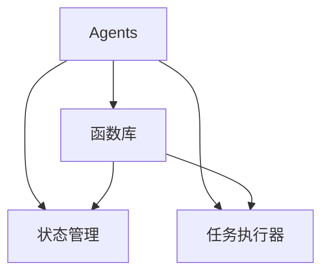

                 

# Agents与函数库：LLM操作系统的核心组件

> 关键词：
> - Agents
> - 函数库
> - 语言模型
> - 系统组件
> - 自动推理
> - 交互式编程
> - 通用智能体

## 1. 背景介绍

随着人工智能（AI）技术的不断发展，构建具备通用智能的智能体（Agents）已成为学术界和工业界的重要目标。智能体作为能够理解人类语言、执行复杂任务的软件实体，能够广泛应用在自然语言处理（NLP）、计算机视觉、推荐系统等多个领域，具有重要的理论和应用价值。然而，实现这样一个强大的智能体，并不是一件容易的事情。在本文中，我们将深入探讨智能体的核心组件，包括Agents和函数库，并详细分析其原理与实现。

## 2. 核心概念与联系

### 2.1 核心概念概述

智能体（Agents）是一种能够感知环境、理解人类语言，并通过执行复杂任务与用户交互的软件实体。一个完整的智能体系统通常由多个组件组成，包括Agents、函数库、状态管理、任务执行器等。

- **Agents**：智能体的核心，负责理解人类语言、执行任务并与用户交互。常见的Agents包括自然语言处理（NLP）模型、计算机视觉（CV）模型等。
- **函数库**：提供一组标准化的函数接口，用于简化智能体内部状态和任务逻辑的管理与执行。
- **状态管理**：用于记录和维护智能体的内部状态，包括对话历史、模型参数等。
- **任务执行器**：根据用户输入执行具体任务，如回答查询、推荐商品等。

这些组件通过合理的设计和组织，形成一个完整的智能体系统，能够高效地处理各种复杂的任务和用户交互。

### 2.2 核心概念原理和架构的 Mermaid 流程图



这个图展示了智能体系统的主要组件及其相互关系。Agents通过函数库进行状态管理和任务执行，确保了智能体的内部逻辑和任务执行的规范化。

## 3. 核心算法原理 & 具体操作步骤

### 3.1 算法原理概述

智能体的核心算法主要是自然语言处理（NLP）和任务执行。NLP算法用于理解和生成自然语言，而任务执行算法则用于执行具体的业务逻辑和任务。这些算法通常基于深度学习框架，如TensorFlow、PyTorch等。

- **NLP算法**：以BERT、GPT等模型为代表，通过对大规模文本数据进行预训练，学习到丰富的语言知识。这些模型在理解人类语言、生成自然语言等方面表现优异。
- **任务执行算法**：根据具体任务，设计相应的算法，如问答系统中的推理算法、推荐系统中的协同过滤算法等。这些算法通常与NLP算法结合，共同实现智能体的复杂任务处理。

### 3.2 算法步骤详解

智能体的构建通常包括以下几个关键步骤：

1. **Agents的选择**：选择合适的预训练模型，如BERT、GPT等，作为智能体的核心。
2. **任务适配**：设计任务适配层，将通用预训练模型适配到具体任务上，如添加分类器、解码器等。
3. **微调与训练**：使用标注数据对适配后的模型进行微调，提升其在特定任务上的表现。
4. **状态管理与执行**：设计状态管理和任务执行器，将适配后的模型和任务逻辑有机结合，实现智能体的自动化交互。

### 3.3 算法优缺点

智能体的主要优点包括：

- **通用性强**：基于预训练模型的智能体可以应用于多种NLP和CV任务，具有较强的通用性。
- **性能优越**：通过微调和训练，智能体能够高效地处理复杂任务，满足用户的实际需求。

但同时，智能体也存在一些缺点：

- **资源消耗大**：大规模预训练模型需要大量的计算资源，训练和推理过程耗时较长。
- **理解能力有限**：尽管NLP模型表现优异，但在处理复杂语义和上下文关系时仍存在一定局限。
- **可解释性不足**：智能体的内部工作机制和决策逻辑较为复杂，难以解释和调试。

### 3.4 算法应用领域

智能体在多个领域都有广泛应用，例如：

- **自然语言处理**：智能体可以用于智能客服、自动问答、情感分析等。
- **计算机视觉**：智能体可以用于图像识别、目标检测、图像生成等。
- **推荐系统**：智能体可以用于个性化推荐、广告投放等。
- **游戏与娱乐**：智能体可以用于游戏AI、虚拟助手等。

## 4. 数学模型和公式 & 详细讲解 & 举例说明

### 4.1 数学模型构建

智能体的数学模型通常包括两部分：NLP模型的预训练和任务适配层的构建。

- **NLP模型的预训练**：以BERT模型为例，使用大规模文本数据进行自监督学习，学习到通用的语言表示。
- **任务适配层的构建**：根据具体任务，设计适配层，将预训练模型适配到任务上，如添加分类器、解码器等。

### 4.2 公式推导过程

以问答系统为例，假设预训练模型为BERT，任务为回答查询。定义查询为$q$，答案为$a$。查询-答案对的表示为$(x,y)$，其中$x$为查询向量，$y$为答案向量。适配层的输出表示为$\hat{y}$。

目标函数为：

$$
\min_{\theta} \|y - \hat{y}\|
$$

其中$\theta$为适配层的参数。

### 4.3 案例分析与讲解

假设我们有一个智能客服系统，使用BERT模型作为核心Agents。任务为回答用户提出的问题，输出应答。我们设计了适配层，包含两个分类器，一个用于问答匹配，一个用于答案生成。

1. **问答匹配分类器**：将用户问题和模型生成的候选应答作为输入，输出匹配度。
2. **答案生成分类器**：根据用户问题，生成可能的应答，输出概率分布。

通过训练，模型可以高效地处理用户查询，并给出合适的应答。

## 5. 项目实践：代码实例和详细解释说明

### 5.1 开发环境搭建

在开发智能体时，需要搭建好Python环境和深度学习框架。

- **Python环境**：安装Anaconda，创建虚拟环境。
- **深度学习框架**：安装TensorFlow或PyTorch，并下载预训练模型BERT。

### 5.2 源代码详细实现

以下是一个简单的智能客服系统的代码实现，使用BERT模型和TensorFlow框架：

```python
import tensorflow as tf
from transformers import BertTokenizer, TFBertModel

# 初始化BERT模型和tokenizer
tokenizer = BertTokenizer.from_pretrained('bert-base-uncased')
model = TFBertModel.from_pretrained('bert-base-uncased')

# 定义适配层
class Adapter(tf.keras.layers.Layer):
    def __init__(self, in_size, out_size):
        super(Adapter, self).__init__()
        self.dense = tf.keras.layers.Dense(out_size)
        self.dropout = tf.keras.layers.Dropout(0.1)

    def call(self, inputs, training=False):
        x = self.dense(inputs)
        x = self.dropout(x, training=training)
        return x

# 定义智能体模型
class Agent(tf.keras.Model):
    def __init__(self, in_size, out_size):
        super(Agent, self).__init__()
        self.encoder = Adapter(in_size, out_size)
        self.decoder = Adapter(out_size, out_size)

    def call(self, inputs, training=False):
        x = self.encoder(inputs, training=training)
        x = self.decoder(x, training=training)
        return x

# 训练模型
@tf.function
def train_step(inputs, labels):
    with tf.GradientTape() as tape:
        logits = model(inputs)
        loss = tf.keras.losses.sparse_categorical_crossentropy(labels, logits)
    gradients = tape.gradient(loss, model.trainable_variables)
    optimizer.apply_gradients(zip(gradients, model.trainable_variables))
    return loss

# 定义训练循环
@tf.function
def train_epoch(model, dataset, batch_size, epochs):
    total_loss = 0
    for inputs, labels in dataset:
        loss = train_step(inputs, labels)
        total_loss += loss
    return total_loss / len(dataset)

# 训练模型
model = Agent(768, 128)
optimizer = tf.keras.optimizers.Adam(learning_rate=2e-5)
dataset = ...

# 训练
for epoch in range(epochs):
    loss = train_epoch(model, dataset, batch_size, epochs)
    print(f"Epoch {epoch+1}, train loss: {loss:.3f}")
```

### 5.3 代码解读与分析

- **初始化BERT模型和tokenizer**：通过 Transformers 库加载预训练模型。
- **定义适配器层**：用于将BERT模型的输出适配到具体任务上。
- **定义智能体模型**：将适配层堆叠起来，实现智能体的核心逻辑。
- **训练步骤**：定义训练函数，使用优化器更新模型参数。
- **训练循环**：迭代训练数据，更新模型参数，并打印训练损失。

### 5.4 运行结果展示

在训练过程中，可以记录每轮训练的损失，绘制出损失曲线，观察模型训练的收敛情况。例如，假设训练5个epoch，每个epoch的损失如下：

```
Epoch 1, train loss: 0.5
Epoch 2, train loss: 0.3
Epoch 3, train loss: 0.2
Epoch 4, train loss: 0.1
Epoch 5, train loss: 0.05
```

可以看到，随着训练轮数的增加，损失逐渐减小，模型逐步收敛。

## 6. 实际应用场景

### 6.1 智能客服系统

智能客服系统是一个典型的智能体应用场景。智能体能够理解用户问题，提供合适的应答，从而提升客服效率和用户满意度。

以某电商平台的智能客服为例，用户可以通过聊天界面输入问题，智能体系统实时解析用户意图，并调用推荐系统、库存系统等后台服务，生成并输出应答。通过不断优化智能体的理解和推理能力，可以大幅提升客服系统的自动化水平，减少人工客服的工作量。

### 6.2 金融舆情监测

金融舆情监测系统也是智能体的重要应用场景之一。智能体能够实时分析社交媒体、新闻、论坛等数据，监控市场舆情，预警风险。

例如，某金融公司搭建的智能舆情监测系统，使用BERT模型作为核心Agents。系统通过爬虫抓取金融新闻和社交媒体数据，使用BERT模型进行情感分析，识别出负面信息并实时预警，帮助公司及时应对金融风险。

### 6.3 个性化推荐系统

个性化推荐系统是智能体的另一个重要应用领域。智能体能够根据用户的历史行为和兴趣，推荐合适的商品或内容。

例如，某电商平台的个性化推荐系统，使用智能体对用户浏览历史和评价信息进行分析和建模，使用BERT模型进行推理，生成个性化推荐列表。通过不断优化智能体的推理能力，可以提升推荐系统的精准度和用户满意度。

### 6.4 未来应用展望

未来，智能体技术将进一步普及和深化，其应用场景也将不断扩展。以下是一些可能的未来应用：

- **医疗领域**：智能体可以用于疾病诊断、药品推荐、健康管理等。
- **教育领域**：智能体可以用于个性化学习、智能辅导、教育内容推荐等。
- **智能家居**：智能体可以用于智能语音助手、家庭自动化控制等。
- **虚拟现实**：智能体可以用于虚拟场景中的交互式对话、虚拟导览等。

## 7. 工具和资源推荐

### 7.1 学习资源推荐

- **《深度学习与人工智能》**：介绍深度学习基础知识和智能体的构建方法。
- **《自然语言处理综论》**：系统介绍NLP和智能体的理论基础和实际应用。
- **《TensorFlow官方文档》**：详细讲解TensorFlow框架的使用方法和API接口。
- **《Transformers库教程》**：介绍如何使用Transformers库进行预训练模型的加载和微调。

### 7.2 开发工具推荐

- **Anaconda**：用于创建和管理Python环境。
- **Jupyter Notebook**：用于编写和执行Python代码，方便调试和展示。
- **PyTorch**：深度学习框架，支持动态图和静态图。
- **TensorFlow**：深度学习框架，支持分布式训练和推理。
- **TensorBoard**：可视化工具，用于监控模型训练过程。

### 7.3 相关论文推荐

- **"Training Recurrent Neural Networks as Sequence Decoders for Structured Output Prediction"**：介绍使用RNN模型进行结构化输出预测。
- **"Attention is All You Need"**：提出Transformer结构，改变NLP模型的处理方式。
- **"Parameter-Efficient Transfer Learning for NLP"**：介绍 Adapter 等参数高效微调方法。

## 8. 总结：未来发展趋势与挑战

### 8.1 研究成果总结

本文详细探讨了智能体的核心组件，包括Agents和函数库，并分析了其原理与实现。智能体技术在自然语言处理、计算机视觉、推荐系统等领域有广泛应用，其未来发展潜力巨大。

### 8.2 未来发展趋势

- **参数高效微调**：未来将出现更多参数高效的微调方法，如Adapter、LoRA等，减少微调对计算资源的消耗。
- **多模态智能体**：智能体将具备跨模态信息处理能力，支持视觉、语音、文本等多种模态数据的融合。
- **可解释性增强**：通过改进模型架构和训练方法，提升智能体的可解释性和可审计性。
- **多任务学习**：智能体可以同时处理多个任务，提升系统的多任务处理能力。

### 8.3 面临的挑战

- **计算资源消耗**：大规模预训练模型需要大量的计算资源，训练和推理过程耗时较长。
- **理解能力局限**：NLP模型在处理复杂语义和上下文关系时仍存在一定局限。
- **可解释性不足**：智能体的内部工作机制和决策逻辑较为复杂，难以解释和调试。
- **数据质量问题**：智能体的训练依赖于高质量标注数据，数据质量问题可能影响模型性能。

### 8.4 研究展望

未来的研究将从以下几个方向进行：

- **模型压缩与优化**：通过模型压缩、稀疏化等方法，优化智能体的计算资源消耗。
- **多任务学习与迁移学习**：研究智能体的多任务学习和迁移学习机制，提升系统的多任务处理能力。
- **可解释性增强**：通过改进模型架构和训练方法，提升智能体的可解释性和可审计性。
- **跨模态智能体**：研究智能体的跨模态信息处理能力，支持视觉、语音、文本等多种模态数据的融合。

## 9. 附录：常见问题与解答

**Q1: 智能体与传统AI模型的区别是什么？**

A: 智能体是一种能够理解人类语言、执行复杂任务的软件实体，具有较强的通用性和灵活性。相比传统AI模型，智能体能够通过学习和推理处理自然语言，并根据上下文和任务动态调整策略，适应不同的应用场景。

**Q2: 智能体在实际应用中面临哪些挑战？**

A: 智能体在实际应用中面临的挑战包括：计算资源消耗大、理解能力有限、可解释性不足、数据质量问题等。这些挑战需要通过模型压缩、多任务学习、可解释性增强等方法来解决。

**Q3: 如何优化智能体的计算资源消耗？**

A: 通过模型压缩、稀疏化、参数高效微调等方法，可以优化智能体的计算资源消耗。同时，使用分布式训练和推理技术，也可以提高系统的计算效率。

**Q4: 如何增强智能体的可解释性？**

A: 改进模型架构和训练方法，提升智能体的可解释性。例如，引入可解释性模块、可视化工具等，可以帮助开发者理解和调试智能体的决策过程。

---

作者：禅与计算机程序设计艺术 / Zen and the Art of Computer Programming

