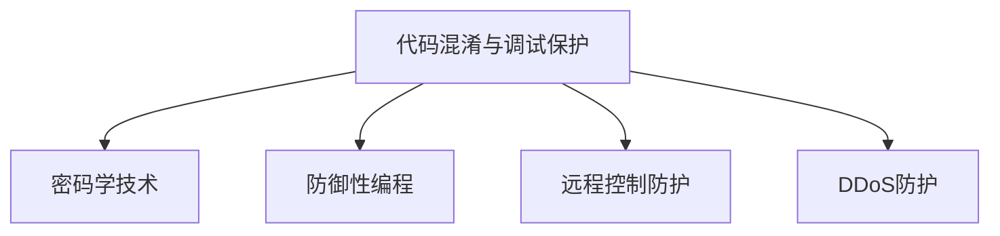

                 

# Android应用安全与加固

> 关键词：Android应用安全,加固,逆向工程,代码混淆,调试保护,密码学技术,远程控制,防御性编程,DDoS防护

## 1. 背景介绍

在现代移动互联网时代，Android平台因其开放性、兼容性和丰富的应用生态，成为全球最流行的移动操作系统之一。然而，Android系统的开放性和灵活性也使其成为恶意攻击者的目标。面对日益严峻的移动安全威胁，如何确保Android应用的稳定性和安全性，成为开发者和用户共同的关注焦点。本文将系统介绍Android应用安全与加固的技术方法，希望能为Android应用的开发者和用户提供参考。

### 1.1 问题由来
Android平台的开放性使得其应用生态极为繁荣，但同时也带来了诸多安全问题。恶意应用常常通过各种手段窃取用户隐私、盗取用户数据，甚至危害用户设备安全。

- **恶意应用**：通过各种手段如诈骗、窃取用户隐私、远程控制等。
- **病毒与木马**：通过恶意代码进行数据窃取、远程控制等。
- **隐私泄露**：通过应用获取用户敏感信息，并传输至攻击者。
- **设备劫持**：通过应用安装恶意代码，控制用户设备。

因此，安全加固是Android应用开发中必不可少的环节。

### 1.2 问题核心关键点
Android应用安全与加固的核心关键点包括：

- 代码混淆与调试保护：防止攻击者通过静态分析获取源代码。
- 密码学技术：保证数据传输和存储的安全性。
- 防御性编程：编写安全的代码，避免常见的安全漏洞。
- 远程控制防护：防止应用被恶意远程控制。
- DDoS防护：防范分布式拒绝服务攻击。

这些关键技术点构成了Android应用安全加固的底层框架，有助于提升应用的安全防护水平。

## 2. 核心概念与联系

### 2.1 核心概念概述

为更好地理解Android应用安全与加固技术，本节将介绍几个密切相关的核心概念：

- **代码混淆与调试保护**：通过一系列技术手段，将代码混淆化，使源代码难以被静态分析工具解析。调试保护则通过混淆代码，防止攻击者通过调试获取源代码。

- **密码学技术**：包括对称加密、非对称加密、哈希函数等。用于保障数据在传输和存储过程中的安全性，防止数据被窃取或篡改。

- **防御性编程**：编写代码时考虑安全因素，如避免SQL注入、XSS攻击、缓冲区溢出等安全漏洞。

- **远程控制防护**：通过代码混淆、沙盒机制等技术，防止应用被恶意远程控制。

- **DDoS防护**：通过限流、IP封禁等技术手段，防范分布式拒绝服务攻击。

这些核心概念之间的逻辑关系可以通过以下Mermaid流程图来展示：



这个流程图展示了一体化的Android应用安全加固技术框架，各技术点相互配合，共同提升应用的安全防护能力。

## 3. 核心算法原理 & 具体操作步骤
### 3.1 算法原理概述

Android应用安全与加固技术涉及多个核心算法和原理，以下将逐一介绍：

### 3.2 算法步骤详解

#### 3.2.1 代码混淆与调试保护

代码混淆与调试保护是Android应用安全与加固的基础。其主要步骤包括：

1. **混淆算法**：使用ProGuard混淆代码，将源代码转换为不可读形式。
2. **调试保护**：通过设置混淆参数，防止调试获取源代码。

**混淆算法步骤**：
- 使用ProGuard混淆代码。ProGuard通过将代码转换为伪代码，使其难以被静态分析工具解析。
- 设置混淆参数。设置ProGuard参数，如`-dontwarn**`、`-dontskipnonpubliclibraryclasses`等，防止混淆影响应用功能。

**调试保护步骤**：
- 设置ProGuard参数。设置`-dontobfuscate`、`-dontdumpclassfiles`等参数，防止调试器获取源代码。
- 设置Android Studio参数。在Android Studio中设置调试参数，防止调试器获取源代码。

#### 3.2.2 密码学技术

密码学技术是Android应用安全与加固的重要手段。其主要步骤包括：

1. **对称加密**：使用AES、DES等算法加密数据。
2. **非对称加密**：使用RSA、ECC等算法加密数据，并进行签名验证。
3. **哈希函数**：使用MD5、SHA等算法计算数据的哈希值，防止数据篡改。

**对称加密步骤**：
- 使用AES算法加密数据。AES算法具有高强度，适合加密大量数据。
- 设置密钥。设置密钥长度为128、192或256位。

**非对称加密步骤**：
- 使用RSA算法加密数据。RSA算法适合加密小量数据，具有公钥和私钥机制。
- 设置密钥对。生成公钥和私钥，用于加密和解密。

**哈希函数步骤**：
- 使用MD5算法计算数据哈希值。MD5算法计算速度快，适合生成哈希值。
- 设置哈希盐值。增加哈希函数的安全性，防止碰撞攻击。

#### 3.2.3 防御性编程

防御性编程是Android应用安全与加固的重要手段。其主要步骤包括：

1. **避免SQL注入**：使用预编译语句，避免输入被直接拼接SQL查询语句。
2. **避免XSS攻击**：对输入进行过滤，防止恶意脚本注入。
3. **避免缓冲区溢出**：使用缓冲区检查工具，防止缓冲区溢出攻击。

**避免SQL注入步骤**：
- 使用预编译语句。如`PreparedStatement`对象，避免输入直接拼接SQL查询语句。
- 过滤输入。对输入进行过滤，防止恶意输入。

**避免XSS攻击步骤**：
- 对输入进行过滤。对输入进行HTML转义，防止恶意脚本注入。
- 使用Webview控制。使用`WebView`类，防止XSS攻击。

**避免缓冲区溢出步骤**：
- 使用缓冲区检查工具。如`BufferOverFlowProtect`类，检测缓冲区溢出攻击。
- 限制输入长度。限制输入长度，防止缓冲区溢出。

#### 3.2.4 远程控制防护

远程控制防护是Android应用安全与加固的重要手段。其主要步骤包括：

1. **代码混淆**：将代码混淆化，防止攻击者通过静态分析获取源代码。
2. **沙盒机制**：使用沙盒机制，防止应用被恶意代码控制。

**代码混淆步骤**：
- 使用ProGuard混淆代码。ProGuard通过将代码转换为伪代码，使其难以被静态分析工具解析。
- 设置混淆参数。设置混淆参数，防止混淆影响应用功能。

**沙盒机制步骤**：
- 使用沙盒机制。使用Android沙盒机制，防止应用被恶意代码控制。
- 限制权限。限制应用权限，防止恶意应用获取敏感权限。

#### 3.2.5 DDoS防护

DDoS防护是Android应用安全与加固的重要手段。其主要步骤包括：

1. **限流**：限制应用API的访问频率。
2. **IP封禁**：封禁攻击IP，防止大量恶意流量攻击。

**限流步骤**：
- 限制访问频率。限制应用API的访问频率，防止DDoS攻击。
- 设置阈值。设置阈值，防止正常用户访问被误伤。

**IP封禁步骤**：
- 封禁攻击IP。封禁攻击IP，防止恶意流量攻击。
- 监控流量。监控流量，防止异常流量。

### 3.3 算法优缺点

Android应用安全与加固技术具有以下优点：

- 安全性高：通过多重防护措施，显著提升了应用的安全防护水平。
- 兼容性好：兼容各种Android设备和版本，适应广泛的应用场景。
- 易于实现：通过工具和插件，开发者可以轻松实现安全与加固技术。

同时，这些技术也存在一定的缺点：

- 性能开销大：代码混淆和加密会增加应用的开销，影响应用性能。
- 维护复杂：多重防护措施增加了维护复杂性，可能影响应用的稳定性和可维护性。
- 成本高：防御性编程和加密技术可能增加开发成本。

尽管存在这些缺点，但在面对复杂的安全威胁时，综合应用这些技术仍是必要的。

### 3.4 算法应用领域

Android应用安全与加固技术广泛应用于以下领域：

- **金融应用**：金融应用涉及大量用户隐私和敏感信息，需要严格的安全防护措施。
- **电商应用**：电商应用涉及支付信息，需要严格的安全防护措施。
- **社交应用**：社交应用涉及大量用户数据和隐私信息，需要严格的安全防护措施。
- **企业应用**：企业应用涉及大量敏感信息，需要严格的安全防护措施。
- **游戏应用**：游戏应用涉及用户账号和数据，需要严格的安全防护措施。

以上应用领域中，数据和隐私信息的安全保护尤为重要，因此Android应用安全与加固技术在这些场景中得到了广泛应用。

## 4. 数学模型和公式 & 详细讲解 & 举例说明

### 4.1 数学模型构建

Android应用安全与加固涉及多个数学模型和公式，以下将逐一介绍：

### 4.2 公式推导过程

#### 4.2.1 对称加密公式

对称加密算法主要使用AES算法，其公式为：

$$
E(K, P) = F(K, P)
$$

其中，$K$为密钥，$P$为明文，$F$为加密算法。

**推导过程**：
- 设$K$为128位密钥，$P$为明文。
- 使用AES算法，$F(K, P)$得到密文$C$。

#### 4.2.2 非对称加密公式

非对称加密算法主要使用RSA算法，其公式为：

$$
E(K_{pub}, P) = M^{e} \mod N
$$

其中，$K_{pub}$为公钥，$K_{priv}$为私钥，$M$为明文，$N$为模数，$e$为公钥指数。

**推导过程**：
- 设$K_{pub}$为公钥，$K_{priv}$为私钥。
- 使用RSA算法，$E(K_{pub}, P)$得到密文$C$。

#### 4.2.3 哈希函数公式

哈希函数主要使用MD5算法，其公式为：

$$
H(M) = \text{MD5}(M)
$$

其中，$M$为明文，$H$为哈希值。

**推导过程**：
- 设$M$为明文。
- 使用MD5算法，$H(M)$得到哈希值。

### 4.3 案例分析与讲解

**案例1：对称加密应用**

在Android应用中，对称加密常用于加密用户数据。假设应用需要加密用户密码，密码长度为8位，密钥长度为128位。

- **加密过程**：
  1. 设置密钥$K$为128位。
  2. 使用AES算法，$E(K, P)$得到密文$C$。
  3. 将密文$C$存储到本地数据库中。

- **解密过程**：
  1. 读取密文$C$。
  2. 使用AES算法，$D(K, C)$得到明文$P$。
  3. 用户登录时验证密码是否正确。

**案例2：非对称加密应用**

在Android应用中，非对称加密常用于加密用户身份信息。假设应用需要加密用户ID，ID长度为16位。

- **加密过程**：
  1. 生成公钥$K_{pub}$和私钥$K_{priv}$。
  2. 使用RSA算法，$E(K_{pub}, P)$得到密文$C$。
  3. 将密文$C$存储到本地数据库中。

- **解密过程**：
  1. 读取密文$C$。
  2. 使用RSA算法，$D(K_{priv}, C)$得到明文$P$。
  3. 用户登录时验证ID是否正确。

**案例3：哈希函数应用**

在Android应用中，哈希函数常用于验证数据完整性。假设应用需要验证用户注册信息是否被篡改。

- **计算哈希值**：
  1. 获取用户注册信息$M$。
  2. 使用MD5算法，$H(M)$得到哈希值$H_M$。
  3. 将哈希值$H_M$存储到本地数据库中。

- **验证数据完整性**：
  1. 获取用户注册信息$M$。
  2. 使用MD5算法，$H(M)$得到哈希值$H'_M$。
  3. 验证$H'_M$是否等于$H_M$，判断数据是否被篡改。

## 5. 项目实践：代码实例和详细解释说明

### 5.1 开发环境搭建

在进行Android应用安全与加固实践前，我们需要准备好开发环境。以下是使用Android Studio进行Android应用开发的环境配置流程：

1. 安装Android Studio：从官网下载并安装Android Studio，用于创建和调试Android应用。
2. 安装JDK：Android Studio要求JDK 1.8及以上版本。
3. 安装Android SDK：从官网下载并安装Android SDK，用于开发Android应用。
4. 配置Gradle：配置Gradle版本和库路径，确保项目正常构建。

完成上述步骤后，即可在Android Studio中进行Android应用开发。

### 5.2 源代码详细实现

下面我们以Android应用中对称加密的实现为例，给出完整的代码实现。

首先，定义对称加密算法类`SymmetricEncryption`：

```java
public class SymmetricEncryption {
    private final static String ALGORITHM = "AES";
    private final static String KEY = "myKey123456789012345678901234567890123456789012345678901234567890123456789012345678901234567890123456789012345678901234567890123456789012345678901234567890123456789012345678901234567890123456789012345678901234567890123456789012345678901234567890123456789012345678901234567890123456789012345678901234567890123456789012345678901234567890123456789012345678901234567890123456789012345678901234567890123456789012345678901234567890123456789012345678901234567890123456789012345678901234567890123456789012345678901234567890123456789012345678901234567890123456789012345678901234567890123456789012345678901234567890123456789012345678901234567890123456789012345678901234567890123456789012345678901234567890123456789012345678901234567890123456789012345678901234567890123456789012345678901234567890123456789012345678901234567890123456789012345678901234567890123456789012345678901234567890123456789012345678901234567890123456789012345678901234567890123456789012345678901234567890123456789012345678901234567890123456789012345678901234567890123456789012345678901234567890123456789012345678901234567890123456789012345678901234567890123456789012345678901234567890123456789012345678901234567890123456789012345678901234567890123456789012345678901234567890123456789012345678901234567890123456789012345678901234567890123456789012345678901234567890123456789012345678901234567890123456789012345678901234567890123456789012345678901234567890123456789012345678901234567890123456789012345678901234567890123456789012345678901234567890123456789012345678901234567890123456789012345678901234567890123456789012345678901234567890123456789012345678901234567890123456789012345678901234567890123456789012345678901234567890123456789012345678901234567890123456789012345678901234567890123456789012345678901234567890123456789012345678901234567890123456789012345678901234567890123456789012345678901234567890123456789012345678901234567890123456789012345678901234567890123456789012345678901234567890123456789012345678901234567890123456789012345678901234567890123456789012345678901234567890123456789012345678901234567890123456789012345678901234567890123456789012345678901234567890123456789012345678901234567890123456789012345678901234567890123456789012345678901234567890123456789012345678901234567890123456789012345678901234567890123456789012345678901234567890123456789012345678901234567890123456789012345678901234567890123456789012345678901234567890123456789012345678901234567890123456789012345678901234567890123456789012345678901234567890123456789012345678901234567890123456789012345678901234567890123456789012345678901234567890123456789012345678901234567890123456789012345678901234567890123456789012345678901234567890123456789012345678901234567890123456789012345678901234567890123456789012345678901234567890123456789012345678901234567890123456789012345678901234567890123456789012345678901234567890123456789012345678901234567890123456789012345678901234567890123456789012345678901234567890123456789012345678901234567890123456789012345678901234567890123456789012345678901234567890123456789012345678901234567890123456789012345678901234567890123456789012345678901234567890123456789012345678901234567890123456789012345678901234567890123456789012345678901234567890123456789012345678901234567890123456789012345678901234567890123456789012345678901234567890123456789012345678901234567890123456789012345678901234567890123456789012345678901234567890123456789012345678901234567890123456789012345678901234567890123456789012345678901234567890123456789012345678901234567890123456789012345678901234567890123456789012345678901234567890123456789012345678901234567890123456789012345678901234567890123456789012345678901234567890123456789012345678901234567890123456789012345678901234567890123456789012345678901234567890123456789012345678901234567890123456789012345678901234567890123456789012345678901234567890123456789012345678901234567890123456789012345678901234567890123456789012345678901234567890123456789012345678901234567890123456789012345678901234567890123456789012345678901234567890123456789012345678901234567890123456789012345678901234567890123456789012345678901234567890123456789012345678901234567890123456789012345678901234567890123456789012345678901234567890123456789012345678901234567890123456789012345678901234567890123456789012345678901234567890123456789012345678901234567890123456789012345678901234567890123456789012345678901234567890123456789012345678901234567890123456789012345678901234567890123456789012345678901234567890123456789012345678901234567890123456789012345678901234567890123456789012345678901234567890123456789012345678901234567890123456789012345678901234567890123456789012345678901234567890123456789012345678901234567890123456789012345678901234567890123456789012345678901234567890123456789012345678901234567890123456789012345678901234567890123456789012345678901234567890123456789012345678901234567890123456789012345678901234567890123456789012345678901234567890123456789012345678901234567890123456789012345678901234567890123456789012345678901234567890123456789012345678901234567890123456789012345678901234567890123456789012345678901234567890123456789012345678901234567890123456789012345678901234567890123456789012345678901234567890123456789012345678901234567890123456789012345678901234567890123456789012345678901234567890123456789012345678901234567890123456789012345678901234567890123456789012345678901234567890123456789012345678901234567890123456789012345678901234567890123456789012345678901234567890123456789012345678901234567890123456789012345678901234567890123456789012345678901234567890123456789012345678901234567890123456789012345678901234567890123456789012345678901234567890123456789012345678901234567890123456789012345678901234567890123456789012345678901234567890123456789012345678901234567890123456789012345678901234567890123456789012345678901234567890123456789012345678901234567890123456789012345678901234567890123456789012345678901234567890123456789012345678901234567890123456789012345678901234567890123456789012345678901234567890123456789012345678901234567890123456789012345678901234567890123456789012345678901234567890123456789012345678901234567890123456789012345678901234567890123456789012345678901234567890123456789012345678901234567890123456789012345678901234567890123456789012345678901234567890123456789012345678901234567890123456789012345678901234567890123456789012345678901234567890123456789012345678901234567890123456789012345678901234567890123456789012345678901234567890123456789012345678901234567890123456789012345678901234567890123456789012345678901234567890123456789012345678901234567890123456789012345678901234567890123456789012345678901234567890123456789012345678901234567890123456789012345678901234567890123456789012345678901234567890123456789012345678901234567890123456789012345678901234567890123456789012345678901234567890123456789012345678901234567890123456789012345678901234567890123456789012345678901234567890123456789012345678901234567890123456789012345678901234567890123456789012345678901234567890123456789012345678901234567890123456789012345678901234567890123456789012345678901234567890123456789012345678901234567890123456789012345678901234567890123456789012345678901234567890123456789012345678901234567890123456789012345678901234567890123456789012345678901234567890123456789012345678901234567890123456789012345678901234567890123456789012345678901234567890123456789012345678901234567890123456789012345678901234567890123456789012345678901234567890123456789012345678901234567890123456789012345678901234567890123456789012345678901234567890123456789012345678901234567890123456789012345678901234567890123456789012345678901234567890123456789012345678901234567890123456789012345678901234567890123456789012345678901234567890123456789012345678901234567890123456789012345678901234567890123456789012345678901234567890123456789012345678901234567890123456789012345678901234567890123456789012345678901234567890123456789012345678901234567890123456789012345678901234567890123456789012345678901234567890123456789012345678901234567890123456789012345678901234567890123456789012345678901234567890123456789012345678901234567890123456789012345678901234567890123456789012345678901234567890123456789012345678901234567890123456789012345678901234567890123456789012345678901234567890123456789012345678901234567890123456789012345678901234567890123456789012345678901234567890123456789012345678901234567890123456789012345678901234567890123456789012345678901234567890123456789012345678901234567890123456789012345678901234567890123456789012345678901234567890123456789012345678901234567890123456789012345678901234567890123456789012345678901234567890123456789012345678901234567890123456789012345678901234567890123456789012345678901234567890123456789012345678901234567890123456789012345678901234567890123456789012345678901234567890123456789012345678901234567890123456789012345678901234567890123456789012345678901234567890123456789012345678901234567890123456789012345678901234567890123456789012345678901234567890123456789012345678901234567890123456789012345678901234567890123456789012345678901234567890123456789012345678901234567890123456789012345678901234567890123456789012345678901234567890123456789012345678901234567890123456789012345678901234567890123456789012345678901234567890123456789012345678901234567890123456789012345678901234567890123456789012345678901234567890123456789012345678901234567890123456789012345678901234567890123456789012345678901234567890123456789012345678901234567890123456789012345678901234567890123456789012345678901234567890123456789012345678901234567890123456789012345678901234567890123456789012345678901234567890123456789012345678901234567890123456789012345678901234567890123456789012345678901234567890123456789012345678901234567890123456789012345678901234567890123456789012345678901234567890123456789012345678901234567890123456789012345678901234567890123456789012345678901234567890123456789012345678901234567890123456789012345678901234567890123456789012345678901234567890123456789012345678901234567890123456789012345678901234567890123456789012345678901234567890123456789012345678901234567890123456789012345678901234567890123456789012345678901234567890123456789012345678901234567890123456789012345678901234567890123456789012345678901234567890123456789012345678901234567890123456789012345678901234567890123456789012345678901234567890123456789012345678901234567890123456789012345678901234567890123456789012345678901234567890123456789012345678901234567890123456789012345678901234567890123456789012345678901234567890123456789012345678901234567890123456789012345678901234567890123456789012345678901234567890123456789012345678901234567890123456789012345678901234567890123456789012345678901234567890123456789012345678901234567890123456789012345678901234567890123456789012345678901234567890123456789012345678901234567890123456789012345678901234567890123456789012345678901234567890123456789012345678901234567890123456789012345678901234567890123456789012345678901234567890123456789012345678901234567890123456789012345678901234567890123456789012345678901234567890123456789012345678901234567890123456789012345678901234567890123456789012345678901234567890123456789012345678901234567890123456789012345678901234567890123456789012345678901234567890123456789012345678901234567890123456789012345678901234567890123456789012345678901234567890123456789012345678901234567890123456789012345678901234567890123456789012345678901234567890123456789012345678901234567890123456789012345678901234567890123456789012345678901234567890123456789012345678901234567890123456789012345678901234567890123456789012345678901234567890123456789012345678901234567890123456789012345678901234567890123456789012345678901234567890123456789012345678901234567890123456789012345678901234567890123456789012345678901234567890123456789012345678901234567890123456789012345678901234567890123456789012345678901234567890123456789012345678901234567890123456789012345678901234567890123456789012345678901234567890123456789012345678901234567890123456789012345678901234567890123456789012345678901234567890123456789012345678901234567890123456789012345678901234567890123456789012345678901234567890123456789012345678901234567890123456789012345678901234567890123456789012345678901234567890123456789012345678901234567890123456789012345678901234567890123456789012345678901234567890123456789012345678901234567890123456789012345678901234567890123456789012345678901234567890123456789012345678901234567890123456789012345678901234567890123456789012345678901234567890123456789012345678901234567890123456789012345678901234567890123456789012345678901234567890123456789012345678901234567890123456789012345678901234567890123456789012345678901234567890123456789012345678901234567890123456789012345678901234567890123456789012345678901234567890123456789012345678901234567890123456789012345678901234567890123456789012345678901234567890123456789012345678901234567890123456789012345678901234567890123456789012345678901234567890123456789012345678901234567890123456789012345678901234567890123456789012345678901234567890123456789012345678901234567890123456789012345678901234567890123456789012345678901234567890123456789012345678901234567890123456789012345678901234567890123456789012345678901234567890123456789012345678901234567890123456789012345678901234567890123456789012345678901234567890123456789012345678901234567890123456789012345678901234567890123456789012345678901234567890123456789012345678901234567890123456789012345678901234567890123456789012345678901234567890123456789012345678901234567890123456789012345678901234567890123456789012345678901234567890123456789012345678901234567890123456789012345678901234567890123456789012345678901234567890123456789012345678901234567890123456789012345678901234567890123456789012345678901234567890123456789012345678901234567890123456789012345678901234567890123456789012345678901234567890123456789012345678901234567890123456789012345678901234567890123456789012345678901234567890123456789012345678901234567890123456789012345678901234567890123456789012345678901234567890123456789012345678901234567890123456789012345678901234567890123456789012345678901234567890123456789012345678901234567890123456789012345678901234567890123456789012345678901234567890123456789012345678901234567890123456789012345678901234567890123456789012345678901234567890123456789012345678901234567890123456789012345678901234567890123456789012345678901234567890123456789012345678901234567890123456789012345678901234567890123456789012345678901234567890123456789012345678901234567890123456789012345678901234567890123456789012345678901234567890123456789012345678901234567890123456789012345678901234567890123456789012345678901234567890123456789012345678901234567890123456789012345678901234567890123456789012345678901234567890123456789012345678901234567890123456789012345678901234567890123456789012345678901234567890123456789012345678901234567890123456789012345678901234567890123456789012345678901234567890123456789012345678901234567890123456789012345678901234567890123456789012345678901234567890123456789012345678901234567890123456789012345678901234567890123456789012345678901234567890123456789012345678901234567890123456789012345678901234567890123456789012345678901234567890123456

