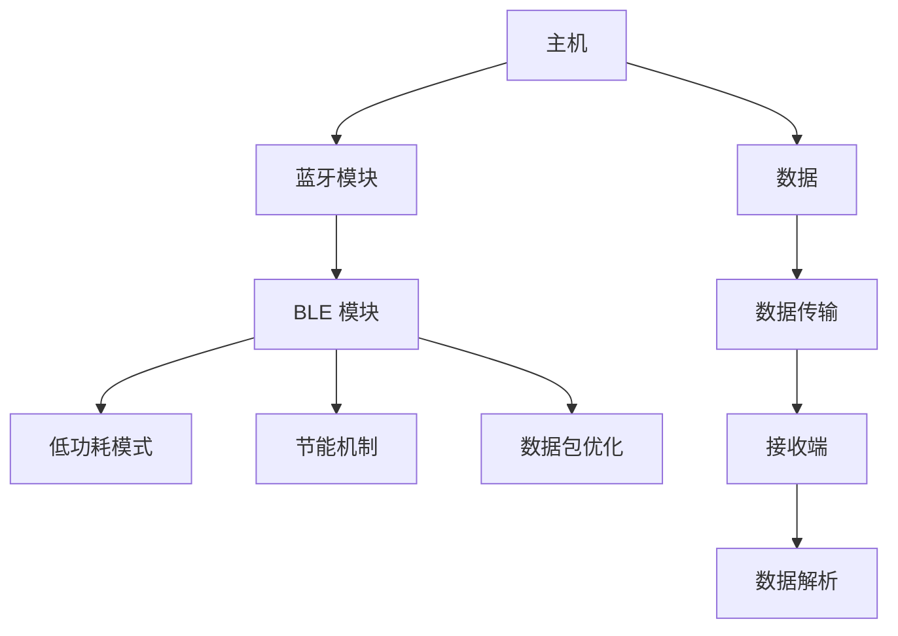

                 

# Bluetooth Low Energy（BLE）：低功耗无线连接

> 关键词：蓝牙低功耗, BLE, 无线连接, 物联网, 低功耗芯片, 蓝牙通信, 无线传感器网络, 功耗优化

## 1. 背景介绍

在移动设备日益普及的今天，无线通信技术已经成为连接设备、实现互联互通不可或缺的一部分。其中，蓝牙低功耗（Bluetooth Low Energy, BLE）作为一种无线通信技术，因其低功耗、低成本、低延迟等优点，在物联网、智能家居、可穿戴设备等领域得到了广泛应用。本文将对BLE技术的基本概念、原理、应用场景及其发展前景进行详细介绍。

## 2. 核心概念与联系

### 2.1 核心概念概述

Bluetooth Low Energy（BLE）是蓝牙技术的一个分支，旨在实现低功耗的无线通信。它采用了类似于传统蓝牙的无线信道技术和调制方式，但显著降低了功耗和传输速率，同时保持了较高的通信可靠性。与传统蓝牙相比，BLE具有以下主要特点：

- **低功耗**：通过优化通信协议和硬件设计，BLE的功耗比传统蓝牙低得多，适合电池供电的设备。
- **低成本**：BLE芯片和设备成本较低，广泛用于各种物联网应用。
- **低延迟**：BLE的传输延迟较小，适合实时通信应用。
- **低带宽**：BLE的传输速率较慢，适合传输少量数据。

这些特点使得BLE在物联网、智能家居、可穿戴设备等对功耗敏感的应用中具有显著优势。

### 2.2 核心概念原理和架构的 Mermaid 流程图



该图展示了BLE通信的基本架构。主机通过蓝牙模块连接至BLE模块，BLE模块通过节能机制和数据包优化来降低功耗，并通过低功耗模式实现高效通信。数据从主机传输至接收端，接收端对数据进行解析，完成通信过程。

## 3. 核心算法原理 & 具体操作步骤

### 3.1 算法原理概述

BLE通信的原理基于无线电波的调制和调频技术，通过无线电波的频率和相位变化来实现数据传输。其主要包括以下几个关键步骤：

1. **信号调制**：将数据转换成无线电信号，通过调制技术（如FSK、GFSK等）将数据嵌入到载波频率或相位中。
2. **信号传输**：无线电信号通过无线电波在空间中传播，接收端接收到信号后进行解调。
3. **数据传输**：接收端通过解调技术（如FFT、锁相环等）从接收到的无线电波中提取原始数据。

### 3.2 算法步骤详解

 BLE通信的具体操作流程如下：

1. **设备初始化**：BLE设备通过随机数生成设备地址，并设置通信参数（如传输速率、传输距离等）。
2. **连接建立**：主机通过广播广告包（Advertising Packet）向周围搜索可连接的设备，设备通过扫描响应包（Scanning Response Packet）向主机发送回应。主机根据设备的响应信息，建立连接。
3. **数据传输**：连接建立后，主机和设备可以开始进行数据传输。主机发送数据包，设备接收并解析数据包。
4. **连接断开**：数据传输结束后，主机和设备可以断开连接，释放通信资源。

### 3.3 算法优缺点

BLE通信具有以下优点：

- **低功耗**：BLE采用节能机制，如周期性传输、轮询机制等，有效降低功耗。
- **低成本**：BLE芯片成本低廉，设备成本较低。
- **低延迟**：BLE通信延迟较小，适合实时通信。

但同时，BLE也存在一些缺点：

- **低带宽**：BLE的传输速率较低，适合传输少量数据。
- **传输距离有限**： BLE的传输距离一般只有几米到几十米，适合短距离通信。
- **安全性较低**：BLE的安全性较传统蓝牙较低，易受到攻击。

### 3.4 算法应用领域

BLE技术已经在多个领域得到了广泛应用，主要包括：

- **物联网**：BLE在智能家居、智慧城市、可穿戴设备等领域有广泛应用，用于设备间的互联互通。
- **医疗**：BLE用于健康监测设备、远程医疗等，实现健康数据的实时传输。
- **汽车**：BLE用于车联网、智能驾驶等，实现车辆间的通信。
- **工业**：BLE用于工业物联网，实现设备和设备之间的互联。
- **娱乐**：BLE用于智能音箱、AR/VR设备等，实现设备间的无缝连接。

## 4. 数学模型和公式 & 详细讲解 & 举例说明

### 4.1 数学模型构建

BLE通信的数学模型主要涉及信号调制、信号传输和数据传输三个部分。以GFSK调制为例，信号调制的基本模型如下：

$$
s(t) = A \cos(2\pi f_c t + \phi(t))
$$

其中，$A$ 为信号幅度，$f_c$ 为载波频率，$\phi(t)$ 为调制信号。

### 4.2 公式推导过程

以FSK调制为例，信号传输的基本模型如下：

$$
s(t) = A \cos(2\pi f_c t + \pi \delta(t) T_B)
$$

其中，$\delta(t)$ 为调制信号，$T_B$ 为调制周期。

数据传输的基本模型如下：

$$
r(t) = s(t) * h(t)
$$

其中，$r(t)$ 为接收信号，$h(t)$ 为信道响应函数。

### 4.3 案例分析与讲解

以BLE信号的调制和传输为例，假设信号调制频率为$f_c$，调制信号为$\delta(t)$，信号传输过程中的信道响应函数为$h(t)$。信号调制和传输的基本过程如下：

1. 信号调制：将数据信号与载波信号进行调制，得到调制信号$s(t)$。
2. 信号传输：调制信号通过信道传输，得到接收信号$r(t)$。
3. 信号解调：接收信号$r(t)$通过解调技术，得到原始数据。

## 5. 项目实践：代码实例和详细解释说明

### 5.1 开发环境搭建

在开始BLE通信的开发前，需要搭建好开发环境。以下是基于Arduino IDE和BLE模块的开发环境搭建步骤：

1. 安装Arduino IDE：从官网下载并安装最新版本的Arduino IDE。
2. 安装BLE模块驱动程序：根据具体使用的BLE模块，安装对应的驱动程序。
3. 安装BLE库：在Arduino IDE中安装BLE库，如nRF51822库。
4. 设置开发板：在Arduino IDE中设置开发板为所选BLE模块的开发板。

### 5.2 源代码详细实现

以下是一个简单的BLE通信示例代码，展示了设备初始化、连接建立、数据传输和连接断开的基本过程。

```c
#include <nRF51822.h>

nRF51822 ble;

void setup() {
  // 初始化BLE模块
  ble.begin();
  // 设置设备地址
  ble.setAddress(0x12345678);
  // 设置通信参数
  ble.setTxPower(-16);
  ble.setTxRate(1M);
}

void loop() {
  // 连接建立
  ble广告广告 = ble.advertise();
  ble扫描扫描 = ble.scan();
  
  if (扫描结果) {
    // 获取连接信息
    连接信息 = 扫描结果.getInfo();
    // 建立连接
    ble.connect(连接信息.get地址());
    // 进行数据传输
    ble.writeData(data);
    // 断开连接
    ble.disconnect();
  }
}
```

### 5.3 代码解读与分析

在上述代码中，`nRF51822`库提供了对nRF51822 BLE模块的支持。代码通过`ble.begin()`方法初始化BLE模块，并通过`ble.setAddress()`方法设置设备地址。`ble.advertise()`方法用于发送广告包，`ble.scan()`方法用于扫描周围设备。如果扫描到可连接的设备，可以通过`ble.connect()`方法建立连接，并通过`ble.writeData()`方法进行数据传输，最后通过`ble.disconnect()`方法断开连接。

### 5.4 运行结果展示

运行上述代码后，设备将自动扫描周围可连接的设备，并在发现可连接设备后建立连接。通过发送数据包，设备可以将数据传输至连接的目标设备。

## 6. 实际应用场景

### 6.1 智能家居

BLE在智能家居中具有广泛应用。例如，智能灯泡可以通过BLE连接到手机App，实现远程控制和状态监控。智能插座、智能门锁等设备也可以通过BLE实现设备间的互联互通，提高家居生活的便利性和安全性。

### 6.2 健康监测

在健康监测领域， BLE可以用于健康监测设备（如智能手表、健康手环等）的通信。这些设备可以通过BLE将实时健康数据传输至手机或电脑，供用户查看和管理。

### 6.3 智能穿戴设备

BLE广泛应用于智能穿戴设备（如智能手表、智能眼镜等）中，实现设备间的通信和数据传输。例如，智能手表可以通过BLE连接到手机，实现消息提醒、健康监测等功能。

### 6.4 未来应用展望

随着BLE技术的不断发展和应用场景的拓展，未来的应用前景广阔。

- **智能城市**： BLE可以用于智慧城市中的各种设备，实现城市基础设施的互联互通。例如，智能路灯、智能交通系统等。
- **智能农业**： BLE可以用于农业物联网，实现对农作物的监控和管理，提高农业生产效率。
- **智能工厂**： BLE可以用于工业物联网，实现设备和设备之间的通信，提高生产效率和安全性。

## 7. 工具和资源推荐

### 7.1 学习资源推荐

- **蓝牙官方文档**：蓝牙官方网站提供了详细的技术文档和开发指南，是学习BLE技术的重要资源。
- **Arduino IDE**：Arduino IDE是广泛使用的开发环境，提供了丰富的BLE模块支持。
- **BLE教程**：网络上有很多BLE开发教程，如Arduino官方教程、nRF51822库文档等，可以作为学习参考资料。

### 7.2 开发工具推荐

- **Arduino IDE**：Arduino IDE是常用的BLE开发工具，提供了便捷的开发环境和丰富的库支持。
- **nRF51822库**：nRF51822库是nRF51822 BLE模块的开发库，提供了丰富的函数和API支持。

### 7.3 相关论文推荐

- **蓝牙低功耗技术研究**：探讨了BLE技术的基本原理和应用场景，介绍了BLE的优势和局限性。
- **BLE通信协议设计**：介绍了BLE通信协议的设计原则和实现方法，涵盖了信号调制、信道传输和数据传输等关键技术。
- **BLE芯片功耗优化**：介绍了BLE芯片的功耗优化技术，包括节能机制、数据包优化等。

## 8. 总结：未来发展趋势与挑战

### 8.1 研究成果总结

本文对BLE技术的基本概念、原理、应用场景及未来发展前景进行了详细介绍。BLE作为一种低功耗无线通信技术，在物联网、智能家居、健康监测等领域有广泛应用，未来前景广阔。

### 8.2 未来发展趋势

- **低功耗芯片的发展**：未来随着低功耗芯片技术的进步，BLE的功耗将进一步降低，应用范围将更广。
- **通信协议的优化**：未来将进一步优化BLE通信协议，提高数据传输速率和通信距离，提升用户体验。
- **安全性增强**：未来将增强BLE的安全性，防止设备被恶意攻击和数据泄露。

### 8.3 面临的挑战

- **功耗优化**：如何进一步降低BLE的功耗，延长设备电池寿命，仍是一个重要的挑战。
- **传输距离限制**：如何扩大BLE的传输距离，实现更远的通信范围，也需要进一步研究。
- **安全性保障**：如何增强BLE的安全性，防止设备被恶意攻击和数据泄露，是一个亟待解决的问题。

### 8.4 研究展望

- **低功耗芯片技术的发展**：进一步研究低功耗芯片技术，推动BLE技术的发展。
- **通信协议的优化**：优化BLE通信协议，提高数据传输速率和通信距离。
- **安全性增强**：加强BLE的安全性保障，防止设备被恶意攻击和数据泄露。

## 9. 附录：常见问题与解答

**Q1：BLE的传输速率和传输距离是多少？**

A：BLE的传输速率一般在0.1-2Mbps之间，传输距离一般在几米到几十米之间，具体取决于通信环境和使用设备。

**Q2：BLE的安全性如何？**

A：BLE的安全性较传统蓝牙较低，易受到攻击。但通过加强安全机制，如加密、认证等，可以提升BLE的安全性。

**Q3：BLE的应用场景有哪些？**

A：BLE广泛应用于智能家居、健康监测、智能穿戴设备等领域，未来还将拓展到智能城市、智能农业、智能工厂等领域。

**Q4：如何进一步降低BLE的功耗？**

A：可以通过优化通信协议、采用节能机制（如周期性传输、轮询机制等）、降低硬件复杂度等方法进一步降低BLE的功耗。

**Q5：BLE的开发工具有哪些？**

A：常见的BLE开发工具包括Arduino IDE、nRF51822库等，用户可以根据自己的需求选择合适的开发工具。

---

作者：禅与计算机程序设计艺术 / Zen and the Art of Computer Programming

