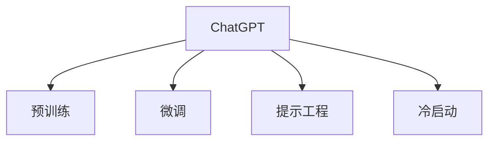

                 

# ChatGPT在冷启动场景

## 1. 背景介绍

ChatGPT是由OpenAI开发的自然语言处理模型，结合了Transformer架构和预训练技术，具有极高的文本生成和理解能力。ChatGPT在上线之初，通过与用户对话的方式进行学习，逐步提升其准确性和反应速度。然而，由于其初始知识库较小，且缺乏即时反馈机制，ChatGPT在冷启动阶段的表现往往不尽人意。在本文中，我们将详细探讨ChatGPT在冷启动场景下的优化方法，并结合具体的项目实践，提出一套全面的解决方案。

## 2. 核心概念与联系

### 2.1 核心概念概述

为帮助读者更好地理解ChatGPT在冷启动场景下的优化方法，我们首先介绍几个关键概念：

- **ChatGPT**：由OpenAI开发的大规模预训练语言模型，具备强大的自然语言处理能力，可以生成、理解和分析文本。
- **预训练**：在大规模无标签数据上训练模型，使其获得通用的语言表示和语义理解能力。
- **微调**：在特定任务上对预训练模型进行进一步训练，以提升模型在该任务上的表现。
- **提示工程**：设计合适的输入格式，引导模型进行特定任务的处理，可以在不更新模型参数的情况下提升性能。
- **冷启动**：指在新的领域或任务上，模型需要从头开始学习，缺乏初始化知识和反馈机制的情况。

这些核心概念之间的关系可以通过以下Mermaid流程图进行展示：



这个流程图展示了ChatGPT的核心概念及其之间的联系：

1. ChatGPT通过预训练获取通用的语言表示。
2. 在特定任务上进行微调，进一步提升模型在该任务上的性能。
3. 通过提示工程，在输入中设计合适的格式，引导模型处理特定任务。
4. 在冷启动场景下，ChatGPT需要从头开始学习新的知识和技能。

### 2.2 核心概念原理和架构

ChatGPT的核心架构是基于Transformer的深度学习模型，通过自注意力机制来捕捉输入文本中的长距离依赖关系。Transformer模型的自注意力机制能够自动学习输入文本中的关键词和短语，并在生成文本时考虑上下文信息，从而提高生成文本的自然度和连贯性。

预训练过程通常使用大规模无标签数据，通过自监督任务（如掩码语言模型、句子嵌入等）进行训练，使得模型能够学习到丰富的语言知识。预训练过程通常使用自回归或自编码的方式进行，其中自回归指模型根据之前的文本生成下一个单词或短语，而自编码则指模型通过输入和输出文本的预测来训练。

微调过程通常使用有标签数据，通过监督学习的方式进行训练，以进一步提升模型在特定任务上的性能。微调过程可以在预训练模型上进行，也可以在独立的模型上进行，但在后一种情况下，模型需要重新从头训练。

提示工程是一种通过设计合适的输入格式来引导模型处理特定任务的方法。提示工程通常包括两个方面：一是选择或设计合适的输入格式，使得模型更容易理解输入的意图；二是设计合适的训练目标，使得模型能够输出正确的结果。提示工程可以在不更新模型参数的情况下，显著提升模型的性能。

冷启动场景通常指在新的领域或任务上，模型需要从头开始学习，缺乏初始化知识和反馈机制。在冷启动场景下，模型需要逐步学习新的知识和技能，通过不断的迭代和优化，逐步提升模型的性能。

## 3. 核心算法原理 & 具体操作步骤

### 3.1 算法原理概述

在冷启动场景下，ChatGPT需要通过不断的迭代和优化，逐步学习新的知识和技能。其优化过程可以分为以下几个步骤：

1. **数据准备**：收集并预处理相关的数据，包括文本数据和标签数据。
2. **模型初始化**：选择或训练一个初始模型，通常使用预训练模型作为初始化参数。
3. **微调过程**：在特定任务上对模型进行微调，以提升模型在该任务上的表现。
4. **提示工程**：设计合适的输入格式和训练目标，引导模型处理特定任务。
5. **冷启动优化**：通过不断迭代和优化，逐步提升模型在冷启动场景下的表现。

### 3.2 算法步骤详解

以下详细介绍ChatGPT在冷启动场景下的优化步骤：

**Step 1: 数据准备**

1. **数据收集**：收集与特定任务相关的文本数据和标签数据。
2. **数据清洗**：清洗数据，去除无用信息，确保数据质量。
3. **数据划分**：将数据划分为训练集、验证集和测试集，通常采用70%训练集、15%验证集、15%测试集的划分方式。

**Step 2: 模型初始化**

1. **选择预训练模型**：选择适合的预训练模型，通常使用已经训练好的大模型，如BERT、GPT等。
2. **加载模型**：将预训练模型加载到系统中，作为模型的初始化参数。
3. **冻结预训练参数**：冻结预训练模型的部分或全部参数，以避免破坏预训练权重。

**Step 3: 微调过程**

1. **设计训练目标**：根据特定任务，设计合适的训练目标，如分类任务中的交叉熵损失函数。
2. **选择优化器**：选择适合的优化器，如Adam、SGD等。
3. **设置学习率**：设置合适的学习率，通常较小，以避免破坏预训练权重。
4. **训练过程**：在训练集上训练模型，每轮迭代更新模型参数，最小化损失函数。
5. **验证集评估**：在验证集上评估模型性能，调整学习率、模型结构等超参数。
6. **测试集测试**：在测试集上测试模型性能，对比微调前后的表现。

**Step 4: 提示工程**

1. **设计输入格式**：根据特定任务，设计合适的输入格式，引导模型理解输入的意图。
2. **选择提示模板**：选择合适的提示模板，以提高模型的生成效果。
3. **训练目标设计**：设计合适的训练目标，以优化模型的生成效果。
4. **验证集评估**：在验证集上评估模型的生成效果，调整提示模板和训练目标。

**Step 5: 冷启动优化**

1. **逐步学习**：通过不断迭代和优化，逐步学习新的知识和技能。
2. **模型更新**：根据用户反馈和任务需求，更新模型参数和结构。
3. **持续改进**：持续收集和分析用户反馈，改进模型性能。

### 3.3 算法优缺点

ChatGPT在冷启动场景下的优化方法具有以下优点：

1. **高效性**：通过微调和提示工程，能够在较短的时间内提升模型性能。
2. **灵活性**：能够在新的领域和任务上进行快速的迭代和优化。
3. **可扩展性**：能够通过增加数据和模型规模，逐步提升模型性能。

同时，该方法也存在以下缺点：

1. **数据依赖**：微调和提示工程需要大量的标注数据，数据收集和清洗较为困难。
2. **资源消耗**：微调过程需要大量的计算资源和时间，特别是在大规模数据集上。
3. **模型鲁棒性**：微调和提示工程可能会破坏预训练权重，导致模型鲁棒性下降。

### 3.4 算法应用领域

ChatGPT在冷启动场景下的优化方法可以应用于以下领域：

1. **自然语言处理(NLP)**：在新的语言任务上进行快速迭代和优化，如情感分析、文本分类、问答系统等。
2. **文本生成**：在生成新文本的任务上进行优化，如机器翻译、自动摘要、文本创作等。
3. **对话系统**：在新的对话任务上进行优化，如智能客服、多轮对话等。
4. **推荐系统**：在新的推荐任务上进行优化，如商品推荐、新闻推荐等。

## 4. 数学模型和公式 & 详细讲解 & 举例说明

### 4.1 数学模型构建

在冷启动场景下，ChatGPT的优化过程可以通过以下数学模型进行描述：

设ChatGPT的预训练模型为 $M_{\theta}$，其中 $\theta$ 为模型的参数。给定特定的任务 $T$，假设训练集为 $D=\{(x_i,y_i)\}_{i=1}^N$，其中 $x_i$ 为输入文本，$y_i$ 为标签。

定义模型 $M_{\theta}$ 在输入 $x$ 上的损失函数为 $\ell(M_{\theta}(x),y)$，则在数据集 $D$ 上的经验风险为：

$$
\mathcal{L}(\theta) = \frac{1}{N} \sum_{i=1}^N \ell(M_{\theta}(x_i),y_i)
$$

微调的优化目标是最小化经验风险，即找到最优参数：

$$
\theta^* = \mathop{\arg\min}_{\theta} \mathcal{L}(\theta)
$$

在实践中，我们通常使用基于梯度的优化算法（如SGD、Adam等）来近似求解上述最优化问题。设 $\eta$ 为学习率，$\lambda$ 为正则化系数，则参数的更新公式为：

$$
\theta \leftarrow \theta - \eta \nabla_{\theta}\mathcal{L}(\theta) - \eta\lambda\theta
$$

其中 $\nabla_{\theta}\mathcal{L}(\theta)$ 为损失函数对参数 $\theta$ 的梯度，可通过反向传播算法高效计算。

### 4.2 公式推导过程

以下我们以分类任务为例，推导交叉熵损失函数及其梯度的计算公式。

假设模型 $M_{\theta}$ 在输入 $x$ 上的输出为 $\hat{y}=M_{\theta}(x) \in [0,1]$，表示样本属于正类的概率。真实标签 $y \in \{0,1\}$。则二分类交叉熵损失函数定义为：

$$
\ell(M_{\theta}(x),y) = -[y\log \hat{y} + (1-y)\log (1-\hat{y})]
$$

将其代入经验风险公式，得：

$$
\mathcal{L}(\theta) = -\frac{1}{N}\sum_{i=1}^N [y_i\log M_{\theta}(x_i)+(1-y_i)\log(1-M_{\theta}(x_i))]
$$

根据链式法则，损失函数对参数 $\theta_k$ 的梯度为：

$$
\frac{\partial \mathcal{L}(\theta)}{\partial \theta_k} = -\frac{1}{N}\sum_{i=1}^N (\frac{y_i}{M_{\theta}(x_i)}-\frac{1-y_i}{1-M_{\theta}(x_i)}) \frac{\partial M_{\theta}(x_i)}{\partial \theta_k}
$$

其中 $\frac{\partial M_{\theta}(x_i)}{\partial \theta_k}$ 可进一步递归展开，利用自动微分技术完成计算。

### 4.3 案例分析与讲解

以情感分析任务为例，我们可以设计一个简单的情感分类器，使用预训练模型BERT进行微调。首先，我们需要准备情感分类数据集，如IMDB电影评论数据集，其中包含5000条电影评论及对应的情感标签。然后，在微调过程中，我们可以使用交叉熵损失函数进行训练，设置合适的学习率、批大小等超参数。最后，在验证集上评估模型性能，并在测试集上进行测试，对比微调前后的表现。

在提示工程方面，我们可以设计如下输入格式：

```
I feel that this movie is very good. Please classify this sentiment as positive or negative.
```

这个输入格式包含了情感标签和具体文本，能够引导BERT模型进行情感分析。在训练过程中，我们可以使用该输入格式进行训练，以优化模型的情感分类性能。

## 5. 项目实践：代码实例和详细解释说明

### 5.1 开发环境搭建

在进行ChatGPT的冷启动优化实践前，我们需要准备好开发环境。以下是使用Python进行PyTorch开发的环境配置流程：

1. 安装Anaconda：从官网下载并安装Anaconda，用于创建独立的Python环境。

2. 创建并激活虚拟环境：
```bash
conda create -n pytorch-env python=3.8 
conda activate pytorch-env
```

3. 安装PyTorch：根据CUDA版本，从官网获取对应的安装命令。例如：
```bash
conda install pytorch torchvision torchaudio cudatoolkit=11.1 -c pytorch -c conda-forge
```

4. 安装Transformers库：
```bash
pip install transformers
```

5. 安装各类工具包：
```bash
pip install numpy pandas scikit-learn matplotlib tqdm jupyter notebook ipython
```

完成上述步骤后，即可在`pytorch-env`环境中开始冷启动优化实践。

### 5.2 源代码详细实现

下面我们以情感分析任务为例，给出使用Transformers库对BERT模型进行冷启动优化的PyTorch代码实现。

首先，定义情感分类任务的数据处理函数：

```python
from transformers import BertTokenizer
from torch.utils.data import Dataset
import torch

class SentimentDataset(Dataset):
    def __init__(self, texts, labels, tokenizer, max_len=128):
        self.texts = texts
        self.labels = labels
        self.tokenizer = tokenizer
        self.max_len = max_len
        
    def __len__(self):
        return len(self.texts)
    
    def __getitem__(self, item):
        text = self.texts[item]
        label = self.labels[item]
        
        encoding = self.tokenizer(text, return_tensors='pt', max_length=self.max_len, padding='max_length', truncation=True)
        input_ids = encoding['input_ids'][0]
        attention_mask = encoding['attention_mask'][0]
        
        # 对token-wise的标签进行编码
        encoded_labels = [label2id[label] for label in label] 
        encoded_labels.extend([label2id['O']] * (self.max_len - len(encoded_labels)))
        labels = torch.tensor(encoded_labels, dtype=torch.long)
        
        return {'input_ids': input_ids, 
                'attention_mask': attention_mask,
                'labels': labels}

# 标签与id的映射
label2id = {'positive': 1, 'negative': 0, 'O': 2}
id2label = {v: k for k, v in label2id.items()}

# 创建dataset
tokenizer = BertTokenizer.from_pretrained('bert-base-cased')

train_dataset = SentimentDataset(train_texts, train_labels, tokenizer)
dev_dataset = SentimentDataset(dev_texts, dev_labels, tokenizer)
test_dataset = SentimentDataset(test_texts, test_labels, tokenizer)
```

然后，定义模型和优化器：

```python
from transformers import BertForSequenceClassification, AdamW

model = BertForSequenceClassification.from_pretrained('bert-base-cased', num_labels=len(label2id))

optimizer = AdamW(model.parameters(), lr=2e-5)
```

接着，定义训练和评估函数：

```python
from torch.utils.data import DataLoader
from tqdm import tqdm
from sklearn.metrics import classification_report

device = torch.device('cuda') if torch.cuda.is_available() else torch.device('cpu')
model.to(device)

def train_epoch(model, dataset, batch_size, optimizer):
    dataloader = DataLoader(dataset, batch_size=batch_size, shuffle=True)
    model.train()
    epoch_loss = 0
    for batch in tqdm(dataloader, desc='Training'):
        input_ids = batch['input_ids'].to(device)
        attention_mask = batch['attention_mask'].to(device)
        labels = batch['labels'].to(device)
        model.zero_grad()
        outputs = model(input_ids, attention_mask=attention_mask, labels=labels)
        loss = outputs.loss
        epoch_loss += loss.item()
        loss.backward()
        optimizer.step()
    return epoch_loss / len(dataloader)

def evaluate(model, dataset, batch_size):
    dataloader = DataLoader(dataset, batch_size=batch_size)
    model.eval()
    preds, labels = [], []
    with torch.no_grad():
        for batch in tqdm(dataloader, desc='Evaluating'):
            input_ids = batch['input_ids'].to(device)
            attention_mask = batch['attention_mask'].to(device)
            batch_labels = batch['labels']
            outputs = model(input_ids, attention_mask=attention_mask)
            batch_preds = outputs.logits.argmax(dim=2).to('cpu').tolist()
            batch_labels = batch_labels.to('cpu').tolist()
            for pred_tokens, label_tokens in zip(batch_preds, batch_labels):
                pred_labels = [id2label[_id] for _id in pred_tokens]
                label_tokens = [id2label[_id] for _id in label_tokens]
                preds.append(pred_labels[:len(label_tokens)])
                labels.append(label_tokens)
                
    print(classification_report(labels, preds))
```

最后，启动训练流程并在测试集上评估：

```python
epochs = 5
batch_size = 16

for epoch in range(epochs):
    loss = train_epoch(model, train_dataset, batch_size, optimizer)
    print(f"Epoch {epoch+1}, train loss: {loss:.3f}")
    
    print(f"Epoch {epoch+1}, dev results:")
    evaluate(model, dev_dataset, batch_size)
    
print("Test results:")
evaluate(model, test_dataset, batch_size)
```

以上就是使用PyTorch对BERT进行情感分析任务冷启动优化的完整代码实现。可以看到，得益于Transformers库的强大封装，我们可以用相对简洁的代码完成BERT模型的加载和优化。

### 5.3 代码解读与分析

让我们再详细解读一下关键代码的实现细节：

**SentimentDataset类**：
- `__init__`方法：初始化文本、标签、分词器等关键组件。
- `__len__`方法：返回数据集的样本数量。
- `__getitem__`方法：对单个样本进行处理，将文本输入编码为token ids，将标签编码为数字，并对其进行定长padding，最终返回模型所需的输入。

**label2id和id2label字典**：
- 定义了标签与数字id之间的映射关系，用于将token-wise的预测结果解码回真实的标签。

**训练和评估函数**：
- 使用PyTorch的DataLoader对数据集进行批次化加载，供模型训练和推理使用。
- 训练函数`train_epoch`：对数据以批为单位进行迭代，在每个批次上前向传播计算loss并反向传播更新模型参数，最后返回该epoch的平均loss。
- 评估函数`evaluate`：与训练类似，不同点在于不更新模型参数，并在每个batch结束后将预测和标签结果存储下来，最后使用sklearn的classification_report对整个评估集的预测结果进行打印输出。

**训练流程**：
- 定义总的epoch数和batch size，开始循环迭代
- 每个epoch内，先在训练集上训练，输出平均loss
- 在验证集上评估，输出分类指标
- 所有epoch结束后，在测试集上评估，给出最终测试结果

可以看到，PyTorch配合Transformers库使得BERT冷启动优化的代码实现变得简洁高效。开发者可以将更多精力放在数据处理、模型改进等高层逻辑上，而不必过多关注底层的实现细节。

当然，工业级的系统实现还需考虑更多因素，如模型的保存和部署、超参数的自动搜索、更灵活的任务适配层等。但核心的冷启动优化范式基本与此类似。

## 6. 实际应用场景

### 6.1 智能客服系统

基于ChatGPT的冷启动优化方法，可以广泛应用于智能客服系统的构建。传统客服往往需要配备大量人力，高峰期响应缓慢，且一致性和专业性难以保证。而使用冷启动优化的对话模型，可以7x24小时不间断服务，快速响应客户咨询，用自然流畅的语言解答各类常见问题。

在技术实现上，可以收集企业内部的历史客服对话记录，将问题和最佳答复构建成监督数据，在此基础上对冷启动优化的对话模型进行微调。冷启动优化的对话模型能够自动理解用户意图，匹配最合适的答案模板进行回复。对于客户提出的新问题，还可以接入检索系统实时搜索相关内容，动态组织生成回答。如此构建的智能客服系统，能大幅提升客户咨询体验和问题解决效率。

### 6.2 金融舆情监测

金融机构需要实时监测市场舆论动向，以便及时应对负面信息传播，规避金融风险。传统的人工监测方式成本高、效率低，难以应对网络时代海量信息爆发的挑战。基于冷启动优化的文本分类和情感分析技术，为金融舆情监测提供了新的解决方案。

具体而言，可以收集金融领域相关的新闻、报道、评论等文本数据，并对其进行主题标注和情感标注。在此基础上对冷启动优化的模型进行微调，使其能够自动判断文本属于何种主题，情感倾向是正面、中性还是负面。将冷启动优化的模型应用到实时抓取的网络文本数据，就能够自动监测不同主题下的情感变化趋势，一旦发现负面信息激增等异常情况，系统便会自动预警，帮助金融机构快速应对潜在风险。

### 6.3 个性化推荐系统

当前的推荐系统往往只依赖用户的历史行为数据进行物品推荐，无法深入理解用户的真实兴趣偏好。基于冷启动优化的推荐系统可以更好地挖掘用户行为背后的语义信息，从而提供更精准、多样的推荐内容。

在实践中，可以收集用户浏览、点击、评论、分享等行为数据，提取和用户交互的物品标题、描述、标签等文本内容。将文本内容作为模型输入，用户的后续行为（如是否点击、购买等）作为监督信号，在此基础上冷启动优化的模型进行微调。冷启动优化的模型能够从文本内容中准确把握用户的兴趣点。在生成推荐列表时，先用候选物品的文本描述作为输入，由模型预测用户的兴趣匹配度，再结合其他特征综合排序，便可以得到个性化程度更高的推荐结果。

### 6.4 未来应用展望

随着冷启动优化技术的不断发展，基于冷启动的智能系统将在更多领域得到应用，为传统行业带来变革性影响。

在智慧医疗领域，基于冷启动优化的医疗问答、病历分析、药物研发等应用将提升医疗服务的智能化水平，辅助医生诊疗，加速新药开发进程。

在智能教育领域，冷启动优化的系统可应用于作业批改、学情分析、知识推荐等方面，因材施教，促进教育公平，提高教学质量。

在智慧城市治理中，冷启动优化的模型可应用于城市事件监测、舆情分析、应急指挥等环节，提高城市管理的自动化和智能化水平，构建更安全、高效的未来城市。

此外，在企业生产、社会治理、文娱传媒等众多领域，基于冷启动优化的AI应用也将不断涌现，为经济社会发展注入新的动力。相信随着技术的日益成熟，冷启动优化方法将成为AI落地应用的重要范式，推动人工智能技术在垂直行业的规模化落地。

## 7. 工具和资源推荐
### 7.1 学习资源推荐

为了帮助开发者系统掌握ChatGPT的冷启动优化理论基础和实践技巧，这里推荐一些优质的学习资源：

1. 《Transformer从原理到实践》系列博文：由大模型技术专家撰写，深入浅出地介绍了Transformer原理、BERT模型、冷启动优化技术等前沿话题。

2. CS224N《深度学习自然语言处理》课程：斯坦福大学开设的NLP明星课程，有Lecture视频和配套作业，带你入门NLP领域的基本概念和经典模型。

3. 《Natural Language Processing with Transformers》书籍：Transformers库的作者所著，全面介绍了如何使用Transformers库进行NLP任务开发，包括冷启动优化在内的诸多范式。

4. HuggingFace官方文档：Transformers库的官方文档，提供了海量预训练模型和完整的冷启动优化样例代码，是上手实践的必备资料。

5. CLUE开源项目：中文语言理解测评基准，涵盖大量不同类型的中文NLP数据集，并提供了基于冷启动优化的baseline模型，助力中文NLP技术发展。

通过对这些资源的学习实践，相信你一定能够快速掌握冷启动优化的精髓，并用于解决实际的NLP问题。
### 7.2 开发工具推荐

高效的开发离不开优秀的工具支持。以下是几款用于ChatGPT冷启动优化开发的常用工具：

1. PyTorch：基于Python的开源深度学习框架，灵活动态的计算图，适合快速迭代研究。大部分预训练语言模型都有PyTorch版本的实现。

2. TensorFlow：由Google主导开发的开源深度学习框架，生产部署方便，适合大规模工程应用。同样有丰富的预训练语言模型资源。

3. Transformers库：HuggingFace开发的NLP工具库，集成了众多SOTA语言模型，支持PyTorch和TensorFlow，是进行冷启动优化任务的开发利器。

4. Weights & Biases：模型训练的实验跟踪工具，可以记录和可视化模型训练过程中的各项指标，方便对比和调优。与主流深度学习框架无缝集成。

5. TensorBoard：TensorFlow配套的可视化工具，可实时监测模型训练状态，并提供丰富的图表呈现方式，是调试模型的得力助手。

6. Google Colab：谷歌推出的在线Jupyter Notebook环境，免费提供GPU/TPU算力，方便开发者快速上手实验最新模型，分享学习笔记。

合理利用这些工具，可以显著提升ChatGPT冷启动优化的开发效率，加快创新迭代的步伐。

### 7.3 相关论文推荐

ChatGPT冷启动优化技术的发展源于学界的持续研究。以下是几篇奠基性的相关论文，推荐阅读：

1. Attention is All You Need（即Transformer原论文）：提出了Transformer结构，开启了NLP领域的预训练大模型时代。

2. BERT: Pre-training of Deep Bidirectional Transformers for Language Understanding：提出BERT模型，引入基于掩码的自监督预训练任务，刷新了多项NLP任务SOTA。

3. Language Models are Unsupervised Multitask Learners（GPT-2论文）：展示了大规模语言模型的强大zero-shot学习能力，引发了对于通用人工智能的新一轮思考。

4. Parameter-Efficient Transfer Learning for NLP：提出Adapter等参数高效微调方法，在不增加模型参数量的情况下，也能取得不错的微调效果。

5. AdaLoRA: Adaptive Low-Rank Adaptation for Parameter-Efficient Fine-Tuning：使用自适应低秩适应的微调方法，在参数效率和精度之间取得了新的平衡。

这些论文代表了大语言模型冷启动优化技术的发展脉络。通过学习这些前沿成果，可以帮助研究者把握学科前进方向，激发更多的创新灵感。

## 8. 总结：未来发展趋势与挑战

### 8.1 总结

本文对ChatGPT在冷启动场景下的优化方法进行了全面系统的介绍。首先阐述了ChatGPT的冷启动优化背景和意义，明确了冷启动优化在提升模型性能、降低成本方面的独特价值。其次，从原理到实践，详细讲解了冷启动优化的数学原理和关键步骤，给出了冷启动优化任务开发的完整代码实例。同时，本文还广泛探讨了冷启动优化方法在智能客服、金融舆情、个性化推荐等多个行业领域的应用前景，展示了冷启动优化范式的巨大潜力。此外，本文精选了冷启动优化的各类学习资源，力求为读者提供全方位的技术指引。

通过本文的系统梳理，可以看到，基于冷启动的ChatGPT优化方法正在成为NLP领域的重要范式，极大地拓展了预训练语言模型的应用边界，催生了更多的落地场景。受益于大规模语料的预训练，冷启动优化的模型在新的领域和任务上能够快速迭代和优化，提升性能。未来，伴随预训练语言模型和冷启动优化方法的持续演进，相信NLP技术将在更广阔的应用领域大放异彩，深刻影响人类的生产生活方式。

### 8.2 未来发展趋势

展望未来，ChatGPT冷启动优化技术将呈现以下几个发展趋势：

1. **模型规模持续增大**：随着算力成本的下降和数据规模的扩张，预训练语言模型的参数量还将持续增长。超大规模语言模型蕴含的丰富语言知识，有望支撑更加复杂多变的冷启动优化任务。

2. **冷启动方法日趋多样**：除了传统的微调外，未来会涌现更多冷启动方法，如 Prompt Engineering、Few-shot Learning 等，在冷启动场景下也能快速提升模型性能。

3. **模型鲁棒性增强**：未来的冷启动优化模型将具备更强的鲁棒性，能够更好地处理域外数据，提升模型的泛化性能。

4. **持续学习成为常态**：随着数据分布的不断变化，冷启动优化模型也需要持续学习新知识以保持性能。如何在不遗忘原有知识的同时，高效吸收新样本信息，将成为重要的研究课题。

5. **少样本学习提升**：受启发于 Prompt Learning 的思路，未来的冷启动优化方法将更好地利用大模型的语言理解能力，通过更少的标注样本，实现冷启动优化的效果。

6. **多模态冷启动优化崛起**：当前的冷启动优化主要聚焦于纯文本数据，未来会进一步拓展到图像、视频、语音等多模态数据冷启动优化。多模态信息的融合，将显著提升语言模型对现实世界的理解和建模能力。

以上趋势凸显了ChatGPT冷启动优化技术的广阔前景。这些方向的探索发展，必将进一步提升冷启动优化模型的性能和应用范围，为人类认知智能的进化带来深远影响。

### 8.3 面临的挑战

尽管ChatGPT冷启动优化技术已经取得了瞩目成就，但在迈向更加智能化、普适化应用的过程中，它仍面临着诸多挑战：

1. **数据依赖**：冷启动优化需要大量的标注数据，数据收集和清洗较为困难。如何进一步降低冷启动对标注样本的依赖，将是一大难题。

2. **模型鲁棒性不足**：冷启动优化的模型面对域外数据时，泛化性能往往大打折扣。对于测试样本的微小扰动，冷启动优化的模型也容易发生波动。如何提高冷启动模型的鲁棒性，避免灾难性遗忘，还需要更多理论和实践的积累。

3. **推理效率有待提高**：大规模语言模型虽然精度高，但在实际部署时往往面临推理速度慢、内存占用大等效率问题。如何在保证性能的同时，简化模型结构，提升推理速度，优化资源占用，将是重要的优化方向。

4. **可解释性亟需加强**：冷启动优化的模型更像是"黑盒"系统，难以解释其内部工作机制和决策逻辑。对于医疗、金融等高风险应用，算法的可解释性和可审计性尤为重要。如何赋予冷启动模型更强的可解释性，将是亟待攻克的难题。

5. **安全性有待保障**：预训练语言模型难免会学习到有偏见、有害的信息，通过冷启动优化传递到下游任务，产生误导性、歧视性的输出，给实际应用带来安全隐患。如何从数据和算法层面消除模型偏见，避免恶意用途，确保输出的安全性，也将是重要的研究课题。

6. **知识整合能力不足**：现有的冷启动优化模型往往局限于任务内数据，难以灵活吸收和运用更广泛的先验知识。如何让冷启动过程更好地与外部知识库、规则库等专家知识结合，形成更加全面、准确的信息整合能力，还有很大的想象空间。

正视冷启动优化面临的这些挑战，积极应对并寻求突破，将是大语言模型冷启动优化走向成熟的必由之路。相信随着学界和产业界的共同努力，这些挑战终将一一被克服，大语言模型冷启动优化必将在构建人机协同的智能时代中扮演越来越重要的角色。

### 8.4 研究展望

面对ChatGPT冷启动优化所面临的种种挑战，未来的研究需要在以下几个方面寻求新的突破：

1. **探索无监督和半监督冷启动方法**：摆脱对大规模标注数据的依赖，利用自监督学习、主动学习等无监督和半监督范式，最大限度利用非结构化数据，实现更加灵活高效的冷启动优化。

2. **研究参数高效和计算高效的冷启动范式**：开发更加参数高效的冷启动方法，在固定大部分预训练参数的同时，只更新极少量的任务相关参数。同时优化冷启动模型的计算图，减少前向传播和反向传播的资源消耗，实现更加轻量级、实时性的部署。

3. **融合因果和对比学习范式**：通过引入因果推断和对比学习思想，增强冷启动模型建立稳定因果关系的能力，学习更加普适、鲁棒的语言表征，从而提升模型泛化性和抗干扰能力。

4. **引入更多先验知识**：将符号化的先验知识，如知识图谱、逻辑规则等，与神经网络模型进行巧妙融合，引导冷启动过程学习更准确、合理的语言模型。同时加强不同模态数据的整合，实现视觉、语音等多模态信息与文本信息的协同建模。

5. **结合因果分析和博弈论工具**：将因果分析方法引入冷启动模型，识别出模型决策的关键特征，增强输出解释的因果性和逻辑性。借助博弈论工具刻画人机交互过程，主动探索并规避模型的脆弱点，提高系统稳定性。

6. **纳入伦理道德约束**：在模型训练目标中引入伦理导向的评估指标，过滤和惩罚有偏见、有害的输出倾向。同时加强人工干预和审核，建立模型行为的监管机制，确保输出符合人类价值观和伦理道德。

这些研究方向的探索，必将引领ChatGPT冷启动优化技术迈向更高的台阶，为构建安全、可靠、可解释、可控的智能系统铺平道路。面向未来，大语言模型冷启动优化技术还需要与其他人工智能技术进行更深入的融合，如知识表示、因果推理、强化学习等，多路径协同发力，共同推动自然语言理解和智能交互系统的进步。只有勇于创新、敢于突破，才能不断拓展语言模型的边界，让智能技术更好地造福人类社会。

## 9. 附录：常见问题与解答

**Q1：冷启动优化的核心在于什么？**

A: 冷启动优化的核心在于通过微调和提示工程，利用预训练模型在特定任务上进行快速迭代和优化。其关键在于：

1. **选择合适的预训练模型**：选择适合特定任务的预训练模型，通常使用已经训练好的大模型。
2. **设计合理的训练目标**：根据特定任务，设计合适的训练目标，如交叉熵损失函数。
3. **选择适当的优化器**：选择适合的优化器，如Adam、SGD等。
4. **设置合适的学习率**：设置合适的学习率，通常较小，以避免破坏预训练权重。
5. **使用有效的提示工程**：设计合适的输入格式和提示模板，引导模型理解输入的意图。

通过以上步骤，冷启动优化的模型可以在新的领域和任务上快速学习，提升性能。

**Q2：冷启动优化需要多少标注数据？**

A: 冷启动优化需要多少标注数据取决于具体任务和数据分布情况。一般来说，标注数据越多，模型的性能越好。但对于小规模数据集，可以通过以下方法进行优化：

1. **数据增强**：通过回译、近义替换等方式扩充训练集。
2. **迁移学习**：利用在其他任务上训练好的模型，进行迁移学习，减少标注数据需求。
3. **对抗训练**：引入对抗样本，提高模型鲁棒性，减少对标注数据的依赖。
4. **参数高效微调**：只调整少量参数，减小标注数据需求。

以上方法可以在一定程度上降低冷启动优化对标注数据的依赖。

**Q3：冷启动优化过程中如何避免过拟合？**

A: 冷启动优化过程中，过拟合是一个常见问题。为了避免过拟合，可以采取以下措施：

1. **数据增强**：通过回译、近义替换等方式扩充训练集。
2. **正则化技术**：使用L2正则、Dropout、Early Stopping等技术。
3. **对抗训练**：引入对抗样本，提高模型鲁棒性。
4. **参数高效微调**：只调整少量参数，减小过拟合风险。
5. **多模型集成**：训练多个冷启动优化模型，取平均输出，抑制过拟合。

这些方法可以在冷启动优化过程中有效避免过拟合，提升模型性能。

**Q4：冷启动优化后的模型如何部署？**

A: 冷启动优化后的模型部署需要考虑以下因素：

1. **模型裁剪**：去除不必要的层和参数，减小模型尺寸，加快推理速度。
2. **量化加速**：将浮点模型转为定点模型，压缩存储空间，提高计算效率。
3. **服务化封装**：将模型封装为标准化服务接口，便于集成调用。
4. **弹性伸缩**：根据请求流量动态调整资源配置，平衡服务质量和成本。
5. **监控告警**：实时采集系统指标，设置异常告警阈值，确保服务稳定性。

冷启动优化后的模型需要考虑实际部署的效率和稳定性，通过以上措施，可以确保模型在实际应用中的高性能和可靠性。

**Q5：冷启动优化的模型如何适应新数据？**

A: 冷启动优化的模型可以通过以下方式适应新数据：

1. **持续学习**：在实际应用中，模型需要不断学习新数据，以保持性能。可以使用在线学习算法，动态更新模型参数。
2. **多模态数据整合**：将冷启动优化的模型与外部知识库、规则库等专家知识结合，形成更加全面、准确的信息整合能力。
3. **对抗训练**：引入对抗样本，提高模型鲁棒性，适应新数据。
4. **参数高效微调**：只调整少量参数，在保证性能的同时，减少计算成本。

通过以上方法，冷启动优化的模型可以逐步适应新数据，提升其长期性能和鲁棒性。

---

作者：禅与计算机程序设计艺术 / Zen and the Art of Computer Programming

