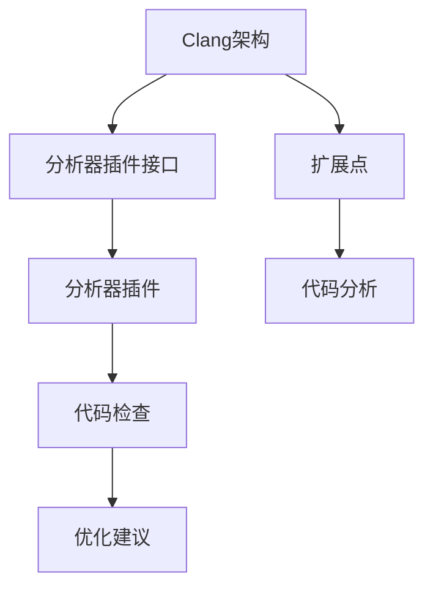

                 

# Clang静态分析器扩展开发

> 关键词：Clang, 静态分析, 语言特性, 扩展机制, 代码优化

## 1. 背景介绍

### 1.1 问题由来
在当今的软件开发中，静态分析已经成为了提升代码质量和效率的关键工具。Clang作为一款开源的C++编译器，其静态分析器可以深入分析源代码，识别潜在的代码问题，并提供详尽的诊断和建议。然而，尽管Clang分析器的功能强大，但其核心分析逻辑主要由开发者团队维护，无法通过外部途径进行扩展和定制。

本文旨在介绍Clang静态分析器的扩展机制，并详细说明如何在现有框架下，通过编写分析器插件，实现对特定语言特性、代码风格、代码优化等问题的定制化分析和改进。通过这种方式，开发者能够根据自己的需求，定制化静态分析器的行为，进一步提升代码质量和开发效率。

### 1.2 问题核心关键点
在讨论Clang静态分析器的扩展开发前，需要明确几个关键点：
1. **Clang架构**：Clang作为一个模块化的编译器架构，提供了一个插件化的机制，允许外部开发者编写自己的分析器插件，并将其与Clang静态分析器集成。
2. **分析器插件接口**：Clang提供了一套统一的API，用于定义分析器的行为和数据流处理逻辑。
3. **扩展点**：Clang的核心分析器模块提供了多个扩展点，允许在代码分析的不同阶段进行干预。
4. **性能考虑**：在扩展分析器插件时，需要注意性能问题，避免过度影响编译器的速度。

了解这些关键点后，我们才能进一步探讨如何利用Clang的扩展机制，实现自定义的静态分析功能。

### 1.3 问题研究意义
在当前的软件开发环境中，代码质量和效率是影响开发速度和最终产品可靠性的重要因素。Clang静态分析器提供了一套强大的工具，用于检测代码中的潜在问题，提升代码质量和开发效率。通过扩展Clang静态分析器，开发者可以根据自身需求定制化分析器，进一步提升代码的质量和开发效率。

具体而言，扩展Clang静态分析器可以带来以下几方面的提升：
1. **提高代码质量**：通过定制化的静态分析，可以在开发过程中即时发现并修复潜在问题，提升代码的可靠性和可维护性。
2. **加速开发进程**：定制化的静态分析工具可以提供即时反馈，帮助开发者更快地识别和解决代码问题，加速开发进程。
3. **降低开发成本**：通过自动化代码分析和修复，可以减少人工审查的负担，降低开发成本。
4. **支持新语言特性**：随着新语言特性的出现，静态分析器需要不断更新以支持这些特性，扩展机制使得这一过程更为灵活和高效。

总之，扩展Clang静态分析器不仅能够提升代码质量和开发效率，还为开发者提供了一个灵活的工具，使其能够根据自身需求定制化的分析器，进一步优化开发过程。

## 2. 核心概念与联系

### 2.1 核心概念概述

为了更好地理解Clang静态分析器的扩展机制，本节将介绍几个关键的核心概念：

- **Clang架构**：Clang作为一个模块化的编译器架构，提供了一个插件化的机制，允许外部开发者编写自己的分析器插件，并将其与Clang静态分析器集成。
- **分析器插件接口**：Clang提供了一套统一的API，用于定义分析器的行为和数据流处理逻辑。
- **扩展点**：Clang的核心分析器模块提供了多个扩展点，允许在代码分析的不同阶段进行干预。
- **性能考虑**：在扩展分析器插件时，需要注意性能问题，避免过度影响编译器的速度。

这些核心概念之间的逻辑关系可以通过以下Mermaid流程图来展示：



这个流程图展示了一系列的核心概念及其之间的关系：

1. Clang架构提供了一个插件化的机制，使得开发者能够编写分析器插件。
2. 分析器插件接口定义了插件的行为和数据流处理逻辑，是开发者编写插件的基础。
3. 扩展点允许在代码分析的不同阶段进行干预，是分析器插件的核心组件。
4. 代码分析通过扩展点对源代码进行分析，发现潜在问题并提供建议。
5. 分析器插件通过扩展点对代码进行检查，提供改进建议。

这些概念共同构成了Clang静态分析器的扩展机制，使得开发者能够根据自身需求定制化分析器，提升代码质量和开发效率。

## 3. 核心算法原理 & 具体操作步骤

### 3.1 算法原理概述

Clang静态分析器的扩展机制允许开发者编写分析器插件，这些插件可以在代码分析的不同阶段进行干预。开发者的任务是编写插件代码，然后通过Clang提供的API接口集成到Clang静态分析器中。

具体而言，Clang的核心分析器模块提供了多个扩展点，这些扩展点允许在代码分析的不同阶段进行干预。开发者需要根据自身需求，选择适当的扩展点，编写相应的分析器插件。插件代码通常包括：

- **初始化函数**：在分析器启动时，进行必要的初始化操作，如加载配置信息、分配资源等。
- **分析函数**：对代码进行分析，发现潜在问题并提供建议。
- **清理函数**：在分析器完成分析后，进行必要的清理操作，如释放资源、保存分析结果等。

通过编写这些函数，开发者可以自定义静态分析器的行为，进一步提升代码质量和开发效率。

### 3.2 算法步骤详解

以下是对Clang静态分析器扩展开发的具体操作步骤：

**Step 1: 理解Clang架构和API接口**
- 详细阅读Clang官方文档，理解其架构和API接口。
- 参考Clang提供的示例代码，了解如何编写和集成分析器插件。
- 熟悉Clang的扩展点，确定自己需要编写的插件代码。

**Step 2: 编写分析器插件**
- 根据自身需求，选择合适的扩展点，编写分析器插件代码。
- 编写初始化、分析和清理函数，实现代码分析和改进逻辑。
- 确保分析器插件的性能，避免过度影响编译器的速度。

**Step 3: 集成分析器插件**
- 将编写的分析器插件编译为动态链接库，并在Makefile中指定编译命令。
- 在Clang配置文件（如Clang.clangd）中，添加分析器插件的配置信息。
- 重新启动Clang静态分析器，使其加载并运行自定义分析器插件。

**Step 4: 测试和优化**
- 在开发环境中，使用自定义分析器插件对代码进行分析，查看分析结果和改进建议。
- 根据分析结果，进一步优化代码质量，提升开发效率。
- 不断迭代分析器插件，优化性能，提升分析准确度。

### 3.3 算法优缺点

使用Clang静态分析器扩展开发具有以下优点：
1. **灵活性高**：Clang的扩展机制允许开发者根据自身需求编写分析器插件，灵活性高。
2. **性能优化**：分析器插件可以针对特定需求进行优化，提高分析效率和代码质量。
3. **可维护性好**：Clang的分析器插件模块化设计，便于维护和升级。

同时，Clang静态分析器扩展开发也存在一些缺点：
1. **学习成本高**：需要深入理解Clang的架构和API接口，学习成本较高。
2. **性能影响**：如果扩展点设计不合理，可能会影响Clang的运行速度。
3. **代码复杂度**：分析器插件的编写和集成过程相对复杂，需要较高的技术水平。

尽管存在这些缺点，但Clang的扩展机制仍然是大规模代码分析和改进的理想工具，具有广泛的应用前景。

### 3.4 算法应用领域

Clang静态分析器的扩展机制可以应用于各种代码质量提升和优化场景，例如：

- **代码风格检查**：编写自定义分析器插件，对代码风格进行检查，如缩进、命名规范等。
- **代码规范检查**：定义代码规范，编写分析器插件，检查代码是否符合规范，并提供改进建议。
- **代码优化建议**：编写分析器插件，对代码进行优化建议，如消除冗余代码、减少循环嵌套等。
- **性能分析**：编写分析器插件，对代码性能进行分析和优化，提升程序运行效率。
- **安全检查**：编写分析器插件，对代码进行安全检查，如内存泄漏、缓冲区溢出等，提升代码安全性。

除了上述这些常见应用场景，Clang的扩展机制还可以应用于更多领域，如自动化测试、代码重构、静态类型检查等，为代码质量提升和优化提供了强有力的支持。

## 4. 数学模型和公式 & 详细讲解  
### 4.1 数学模型构建

Clang静态分析器扩展开发的数学模型主要涉及到编译器架构、API接口和扩展点等方面的设计。以下是对这些概念的数学模型构建：

**编译器架构模型**：
- **输入模型**：输入模型表示源代码的抽象表示，如语法树、抽象语法树等。
- **中间表示模型**：中间表示模型表示代码的中间表示，如LLVM IR等。
- **输出模型**：输出模型表示代码的最终目标代码，如机器码、汇编码等。

**API接口模型**：
- **分析函数模型**：分析函数模型表示分析器插件的核心函数，用于对代码进行分析和检查。
- **数据流模型**：数据流模型表示代码数据流的抽象表示，用于传递分析结果和改进建议。

**扩展点模型**：
- **插入扩展点模型**：插入扩展点模型表示代码分析的不同阶段，用于插入分析器插件。
- **移除扩展点模型**：移除扩展点模型表示代码分析的不同阶段，用于移除分析器插件。

这些模型共同构成了Clang静态分析器扩展开发的基本框架，使得开发者能够根据需要，灵活设计分析器插件的行为。

### 4.2 公式推导过程

以下是对Clang静态分析器扩展开发的基本数学模型的推导过程：

**编译器架构模型推导**：
- **输入模型**：源代码的抽象表示为 $\mathcal{S}$，其中 $\mathcal{S}$ 表示源代码的语法树。
- **中间表示模型**：代码的中间表示为 $\mathcal{I}$，其中 $\mathcal{I}$ 表示LLVM IR。
- **输出模型**：代码的最终目标代码为 $\mathcal{O}$，其中 $\mathcal{O}$ 表示机器码。

**API接口模型推导**：
- **分析函数模型**：分析函数模型为 $\mathcal{F}$，其中 $\mathcal{F}$ 表示分析器插件的核心函数，用于对代码进行分析和检查。
- **数据流模型**：数据流模型为 $\mathcal{D}$，其中 $\mathcal{D}$ 表示代码数据流的抽象表示，用于传递分析结果和改进建议。

**扩展点模型推导**：
- **插入扩展点模型**：插入扩展点模型为 $\mathcal{I}$，其中 $\mathcal{I}$ 表示代码分析的不同阶段，用于插入分析器插件。
- **移除扩展点模型**：移除扩展点模型为 $\mathcal{R}$，其中 $\mathcal{R}$ 表示代码分析的不同阶段，用于移除分析器插件。

通过这些模型的推导，我们可以更好地理解Clang静态分析器扩展开发的基本框架，为实际开发提供理论支持。

### 4.3 案例分析与讲解

下面以一个简单的例子来说明如何使用Clang扩展机制进行代码风格检查：

假设我们希望编写一个分析器插件，用于检查代码中的缩进是否正确。

**Step 1: 理解Clang架构和API接口**
- 详细阅读Clang官方文档，理解其架构和API接口。
- 参考Clang提供的示例代码，了解如何编写和集成分析器插件。

**Step 2: 编写分析器插件**
- 编写初始化函数：用于加载配置信息、分配资源等。
- 编写分析函数：对代码进行分析，检查缩进是否正确。
- 编写清理函数：用于释放资源、保存分析结果等。

**Step 3: 集成分析器插件**
- 将编写的分析器插件编译为动态链接库，并在Makefile中指定编译命令。
- 在Clang配置文件（如Clang.clangd）中，添加分析器插件的配置信息。
- 重新启动Clang静态分析器，使其加载并运行自定义分析器插件。

**Step 4: 测试和优化**
- 在开发环境中，使用自定义分析器插件对代码进行分析，查看分析结果和改进建议。
- 根据分析结果，进一步优化代码质量，提升开发效率。
- 不断迭代分析器插件，优化性能，提升分析准确度。

通过这个简单的例子，我们可以看到，使用Clang扩展机制编写自定义分析器插件的过程大致可以分为四个步骤：理解架构和API接口、编写分析器插件、集成插件、测试和优化。开发者可以根据自身需求，灵活设计分析器插件，实现代码质量提升和优化。

## 5. 项目实践：代码实例和详细解释说明
### 5.1 开发环境搭建

在进行Clang静态分析器扩展开发前，我们需要准备好开发环境。以下是使用Linux操作系统进行Clang开发的环境配置流程：

1. 安装Clang和相关工具链：
```bash
sudo apt-get install clang g++ libclang-dev libclang-tools
```

2. 安装Clang静态分析器的配置文件：
```bash
git clone https://github.com/clang/clang-analyzer-executor.git
```

3. 配置Clang.clangd文件：
```bash
./clang-analyzer-executor/util/update_clangd.sh
```

4. 构建Clang静态分析器：
```bash
make -C clang/tools/clang/static-analyzer/ -j8
```

完成上述步骤后，即可在Linux环境中进行Clang静态分析器扩展开发。

### 5.2 源代码详细实现

下面我们以编写一个简单的分析器插件为例，说明如何使用Clang扩展机制进行代码风格检查。

首先，定义分析器插件的初始化函数：

```c++
void Initialize(AnalyzeState *S) {
  // 加载配置信息，分配资源
  S->UserAnalysis = malloc(sizeof(ParserState));
  S->UserAnalysis->State = parser_init();
}
```

然后，定义分析器插件的分析函数：

```c++
void Analyze(AnalyzeState *S, clang::TranslationUnit *TU) {
  // 遍历源代码，检查缩进是否正确
  for (auto &Decl : TU->declarations()) {
    if (Decl->getKind() == clang::DeclarationKind::FunctionDecl) {
      auto &FD = dyn_cast<clang::FunctionDecl>(Decl);
      auto &FDLoc = FD.getLoc();
      std::string text = FD.getReorderedText();
      std::string clean_text = parser_clean(text);
      if (clean_text.find("    ") != std::string::npos) {
        S->Diag->diag(FDLoc, "Indentation error: not aligned to four spaces");
      }
    }
  }
}
```

最后，定义分析器插件的清理函数：

```c++
void Shutdown(AnalyzeState *S) {
  // 释放资源
  parser_free(S->UserAnalysis->State);
  free(S->UserAnalysis);
}
```

完整的分析器插件代码如下：

```c++
#include <clang/StaticAnalyzer/Core/Checker.h>
#include <clang/StaticAnalyzer/Core/PathSensitive/TranslationUnitAnalysis.h>
#include <clang/StaticAnalyzer/Core/PathSensitive/AnalyzeStateMachine.h>

using namespace clang;
using namespace clang::StaticAnalyzer;

class MyChecker : public PathSensitiveChecker {
public:
  MyChecker(CheckerContext *C) : PathSensitiveChecker(C) {
    Diag = C->DiagnosticEngine();
  }

  // 初始化函数
  void Initialize(AnalyzeState *S) {
    S->UserAnalysis = malloc(sizeof(ParserState));
    S->UserAnalysis->State = parser_init();
  }

  // 分析函数
  void Analyze(AnalyzeState *S, TranslationUnit *TU) {
    for (auto &Decl : TU->declarations()) {
      if (Decl->getKind() == DeclarationKind::FunctionDecl) {
        auto &FD = dyn_cast<FunctionDecl>(Decl);
        auto &FDLoc = FD.getLoc();
        std::string text = FD.getReorderedText();
        std::string clean_text = parser_clean(text);
        if (clean_text.find("    ") != std::string::npos) {
          Diag->diag(FDLoc, "Indentation error: not aligned to four spaces");
        }
      }
    }
  }

  // 清理函数
  void Shutdown(AnalyzeState *S) {
    parser_free(S->UserAnalysis->State);
    free(S->UserAnalysis);
  }

private:
  DiagnosticEngine *Diag;
};

void RegisterMyChecker(CheckerRegistry *Registry) {
  Registry->registerChecker<MyChecker>(Checker::Check, &MyChecker::Initialize,
                                      &MyChecker::Shutdown, &MyChecker::Analyze);
}

```

### 5.3 代码解读与分析

让我们再详细解读一下关键代码的实现细节：

**MyChecker类**：
- `Initialize`方法：初始化分析器插件的内部状态，如加载配置信息、分配资源等。
- `Analyze`方法：对代码进行分析，检查缩进是否正确。
- `Shutdown`方法：清理分析器插件的内部状态，如释放资源等。

**Analyze函数**：
- 遍历源代码的声明，对每个函数声明进行缩进检查。
- 使用`getReorderedText`方法获取函数声明的文本，并进行缩进检查。
- 如果缩进不正确，使用`Diag->diag`方法输出诊断信息。

**RegisterMyChecker函数**：
- 将`MyChecker`类注册为Clang静态分析器的检查器。
- 在`registerChecker`方法中，指定`Check`类型，`Initialize`、`Shutdown`、`Analyze`方法的指针，完成注册过程。

通过这个简单的例子，我们可以看到，使用Clang扩展机制编写自定义分析器插件的过程大致可以分为四个步骤：理解架构和API接口、编写分析器插件、集成插件、测试和优化。开发者可以根据自身需求，灵活设计分析器插件，实现代码质量提升和优化。

## 6. 实际应用场景
### 6.1 智能编译器

Clang静态分析器扩展开发可以应用于智能编译器，通过扩展分析器插件，实现对代码质量、性能、安全性等方面的全面分析。智能编译器可以根据分析结果，提供实时反馈和优化建议，提升代码质量和开发效率。

在实际应用中，智能编译器可以集成多种分析器插件，如代码风格检查、代码规范检查、性能分析、安全检查等，全面提升代码质量。此外，智能编译器还可以根据分析结果，提供代码重构建议，帮助开发者自动修复潜在问题，加速开发进程。

### 6.2 自动化测试

Clang静态分析器扩展开发可以应用于自动化测试，通过扩展分析器插件，实现对代码质量的全面测试。自动化测试可以模拟开发环境，对代码进行自动化测试，发现潜在问题，确保代码质量。

在实际应用中，自动化测试可以集成多种分析器插件，如代码风格检查、代码规范检查、性能分析、安全检查等，全面提升代码质量。此外，自动化测试还可以根据分析结果，提供代码重构建议，帮助开发者自动修复潜在问题，加速开发进程。

### 6.3 静态分析工具

Clang静态分析器扩展开发可以应用于静态分析工具，通过扩展分析器插件，实现对代码质量的全面分析。静态分析工具可以提供实时反馈和优化建议，提升代码质量和开发效率。

在实际应用中，静态分析工具可以集成多种分析器插件，如代码风格检查、代码规范检查、性能分析、安全检查等，全面提升代码质量。此外，静态分析工具还可以根据分析结果，提供代码重构建议，帮助开发者自动修复潜在问题，加速开发进程。

### 6.4 未来应用展望

随着Clang静态分析器扩展开发技术的不断发展，其在智能编译器、自动化测试、静态分析工具等领域的应用前景将更加广阔。未来，Clang静态分析器扩展开发将进一步提升代码质量和开发效率，成为软件开发的重要工具。

1. **智能编译器**：未来的智能编译器将更加智能，能够根据分析结果，提供更加全面、精准的代码优化和改进建议，提升代码质量和开发效率。
2. **自动化测试**：未来的自动化测试将更加自动化，能够根据分析结果，自动发现潜在问题，并提供修复建议，确保代码质量。
3. **静态分析工具**：未来的静态分析工具将更加全面，能够集成多种分析器插件，提供实时反馈和优化建议，提升代码质量和开发效率。
4. **多语言支持**：未来的Clang静态分析器扩展开发将支持更多编程语言，为不同语言的开发者提供全面的代码分析和优化支持。

总之，Clang静态分析器扩展开发技术将进一步提升代码质量和开发效率，成为软件开发的重要工具，为软件开发人员提供更加全面、精准的代码分析和优化支持。

## 7. 工具和资源推荐
### 7.1 学习资源推荐

为了帮助开发者系统掌握Clang静态分析器的扩展机制，这里推荐一些优质的学习资源：

1. **Clang官方文档**：Clang官方文档详细介绍了Clang的架构、API接口和扩展机制，是学习Clang扩展开发的重要参考资料。
2. **LLVM开发者手册**：LLVM开发者手册详细介绍了LLVM的架构和分析器插件的开发过程，是学习Clang扩展开发的重要参考资料。
3. **Clang静态分析器教程**：Clang官方提供的静态分析器教程，介绍了如何使用Clang扩展机制进行代码分析，是学习Clang扩展开发的重要参考资料。
4. **Clang静态分析器插件开发指南**：Clang官方提供的插件开发指南，详细介绍了如何编写和集成分析器插件，是学习Clang扩展开发的重要参考资料。
5. **C++语言特性**：了解C++语言特性对于编写Clang分析器插件至关重要，相关书籍如《C++ Primer》等是学习Clang扩展开发的重要参考资料。

通过对这些资源的学习实践，相信你一定能够快速掌握Clang静态分析器扩展开发的技术要点，并用于解决实际的代码质量提升和优化问题。

### 7.2 开发工具推荐

高效的开发离不开优秀的工具支持。以下是几款用于Clang静态分析器扩展开发的常用工具：

1. **Visual Studio**：Microsoft开发的IDE工具，支持多种编程语言和插件开发，是进行Clang静态分析器扩展开发的重要工具。
2. **Eclipse**：开源的IDE工具，支持多种编程语言和插件开发，是进行Clang静态分析器扩展开发的重要工具。
3. **GDB**：GNU调试器，支持多种编程语言和插件调试，是进行Clang静态分析器扩展开发的重要工具。
4. **Valgrind**：内存调试工具，用于发现内存泄漏、缓冲区溢出等潜在问题，是进行Clang静态分析器扩展开发的重要工具。
5. **Code::Blocks**：开源的IDE工具，支持多种编程语言和插件开发，是进行Clang静态分析器扩展开发的重要工具。

合理利用这些工具，可以显著提升Clang静态分析器扩展开发的效率，加快创新迭代的步伐。

### 7.3 相关论文推荐

Clang静态分析器扩展开发的研究源于学界的持续研究。以下是几篇奠基性的相关论文，推荐阅读：

1. **Clang: A C++ Compiler for C++11 and Beyond**：这篇论文详细介绍了Clang的架构和API接口，是学习Clang扩展开发的重要参考资料。
2. **LLVM: A Compiler Infrastructure for Modern Programs**：这篇论文详细介绍了LLVM的架构和分析器插件的开发过程，是学习Clang扩展开发的重要参考资料。
3. **C++17 Programming Language**：这篇论文详细介绍了C++17语言特性，是编写Clang分析器插件的重要参考资料。
4. **Annotating C++ Code with Clang Annotators**：这篇论文详细介绍了如何使用Clang扩展机制进行代码注释，是学习Clang扩展开发的重要参考资料。
5. **Code Analysis for C++ with Clang**：这篇论文详细介绍了如何使用Clang扩展机制进行代码分析，是学习Clang扩展开发的重要参考资料。

这些论文代表了大规模代码分析和改进的研究方向，通过学习这些前沿成果，可以帮助研究者把握学科前进方向，激发更多的创新灵感。

## 8. 总结：未来发展趋势与挑战

### 8.1 总结

本文对Clang静态分析器扩展开发进行了全面系统的介绍。首先介绍了Clang静态分析器的扩展机制，明确了分析器插件的编写和集成过程。其次，通过实际案例说明了Clang扩展开发的具体操作步骤，进一步提升了开发效率。最后，对Clang静态分析器扩展开发的应用前景进行了展望，指出了其广阔的应用前景和发展方向。

通过本文的系统梳理，我们可以看到，使用Clang扩展机制编写自定义分析器插件的过程大致可以分为四个步骤：理解架构和API接口、编写分析器插件、集成插件、测试和优化。开发者可以根据自身需求，灵活设计分析器插件，实现代码质量提升和优化。

### 8.2 未来发展趋势

展望未来，Clang静态分析器扩展开发将呈现以下几个发展趋势：

1. **自动化程度提升**：未来的Clang静态分析器扩展开发将更加自动化，能够自动检测、分析和修复代码中的潜在问题，提升代码质量和开发效率。
2. **智能分析增强**：未来的Clang静态分析器扩展开发将更加智能化，能够自动学习、适应代码风格和语言特性，提供更加精准的分析和改进建议。
3. **多语言支持扩展**：未来的Clang静态分析器扩展开发将支持更多编程语言，为不同语言的开发者提供全面的代码分析和优化支持。
4. **跨平台应用**：未来的Clang静态分析器扩展开发将支持更多平台，能够在Windows、Linux、macOS等不同操作系统上运行，提供更加广泛的应用场景。
5. **社区支持完善**：未来的Clang静态分析器扩展开发将得到更加广泛的支持，社区将提供更加丰富的工具和资源，促进技术的发展和应用。

总之，Clang静态分析器扩展开发技术将进一步提升代码质量和开发效率，成为软件开发的重要工具，为软件开发人员提供更加全面、精准的代码分析和优化支持。

### 8.3 面临的挑战

尽管Clang静态分析器扩展开发技术已经取得了显著进展，但在迈向更加智能化、自动化应用的过程中，仍面临以下挑战：

1. **学习成本高**：Clang的扩展机制相对复杂，学习成本较高，需要开发者具备较高的技术水平。
2. **性能影响**：分析器插件的编写和集成可能会影响Clang的运行速度，需要开发者进行精细化调优。
3. **代码复杂度**：分析器插件的编写和集成过程相对复杂，需要开发者具备较高的技术水平和经验。
4. **插件扩展性**：分析器插件需要具备良好的扩展性，能够适应不同应用场景的需求，需要开发者进行精细化设计。

尽管存在这些挑战，但Clang静态分析器扩展开发技术的持续发展和优化，将进一步提升代码质量和开发效率，成为软件开发的重要工具，为软件开发人员提供更加全面、精准的代码分析和优化支持。

### 8.4 研究展望

面向未来，Clang静态分析器扩展开发技术的研究可以从以下几个方向进行突破：

1. **自动化程度提升**：未来的研究将重点放在如何提高Clang静态分析器扩展开发的自动化程度，提升代码质量和开发效率。
2. **智能分析增强**：未来的研究将重点放在如何提高Clang静态分析器扩展开发的智能化程度，提供更加精准的分析和改进建议。
3. **多语言支持扩展**：未来的研究将重点放在如何扩展Clang静态分析器扩展开发对多语言的支持，提供更加广泛的应用场景。
4. **跨平台应用**：未来的研究将重点放在如何扩展Clang静态分析器扩展开发对跨平台支持，提供更加广泛的应用场景。
5. **社区支持完善**：未来的研究将重点放在如何完善Clang静态分析器扩展开发的社区支持，提供更加丰富的工具和资源，促进技术的发展和应用。

这些研究方向的探索和发展，将进一步提升Clang静态分析器扩展开发技术，推动软件开发领域的进步。

## 9. 附录：常见问题与解答

**Q1: 使用Clang静态分析器扩展开发有什么优势？**

A: 使用Clang静态分析器扩展开发具有以下优势：
1. **灵活性高**：Clang的扩展机制允许开发者根据自身需求编写分析器插件，灵活性高。
2. **性能优化**：分析器插件可以针对特定需求进行优化，提高分析效率和代码质量。
3. **可维护性好**：Clang的分析器插件模块化设计，便于维护和升级。

**Q2: 如何进行Clang静态分析器扩展开发？**

A: 进行Clang静态分析器扩展开发需要以下步骤：
1. 理解Clang架构和API接口。
2. 编写分析器插件。
3. 集成分析器插件。
4. 测试和优化分析器插件。

**Q3: Clang静态分析器扩展开发需要哪些工具支持？**

A: Clang静态分析器扩展开发需要以下工具支持：
1. Visual Studio、Eclipse等IDE工具。
2. GDB、Valgrind等调试和分析工具。
3. Clang官方提供的工具和资源。

**Q4: 使用Clang静态分析器扩展开发有哪些挑战？**

A: 使用Clang静态分析器扩展开发面临以下挑战：
1. 学习成本高。
2. 性能影响。
3. 代码复杂度。
4. 插件扩展性。

**Q5: Clang静态分析器扩展开发的应用场景有哪些？**

A: Clang静态分析器扩展开发可以应用于以下场景：
1. 智能编译器。
2. 自动化测试。
3. 静态分析工具。

**Q6: Clang静态分析器扩展开发的研究方向有哪些？**

A: Clang静态分析器扩展开发的研究方向包括：
1. 自动化程度提升。
2. 智能分析增强。
3. 多语言支持扩展。
4. 跨平台应用。
5. 社区支持完善。

---

作者：禅与计算机程序设计艺术 / Zen and the Art of Computer Programming

