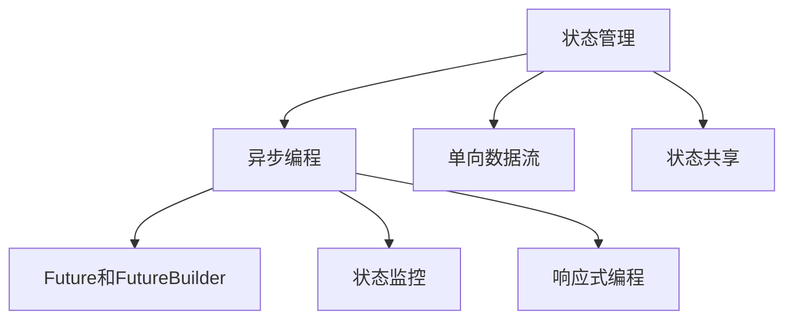
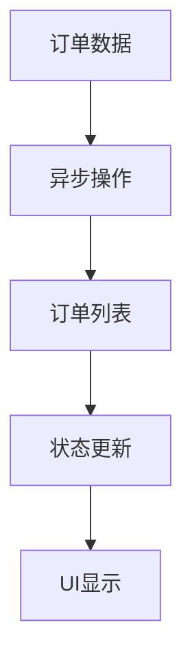

                 

# Flutter状态管理与异步编程

> 关键词：Flutter,状态管理,异步编程,单向数据流,状态共享,Future和FutureBuilder,状态监控,响应式编程

## 1. 背景介绍

### 1.1 问题由来
Flutter是一个由Google开发的移动UI框架，用于构建高质量、高性能、跨平台的移动应用。在Flutter应用开发中，状态管理与异步编程是两个至关重要的部分，它们直接影响应用的性能、响应速度和用户体验。状态管理确保了组件状态的同步更新，异步编程则处理了数据异步获取和处理的问题。

### 1.2 问题核心关键点
- 状态管理：确保组件状态的同步更新，避免数据不一致问题。
- 异步编程：处理数据异步获取和处理，避免阻塞UI线程，提升应用响应速度。
- 单向数据流：简化状态管理逻辑，减少副作用，提升应用可维护性。
- 状态共享：通过状态共享机制，实现组件间状态的协调与一致性。
- Future和FutureBuilder：用于处理异步操作和异步结果的显示。
- 状态监控：通过状态监控工具，跟踪应用状态的变化和异常。
- 响应式编程：通过响应式编程模型，简化数据流的处理和操作。

这些核心概念之间的逻辑关系可以通过以下Mermaid流程图来展示：



这个流程图展示了状态管理与异步编程在Flutter应用开发中的核心作用，它们通过单向数据流、状态共享、Future和FutureBuilder、状态监控和响应式编程等技术，确保了应用性能和用户体验的优化。

## 2. 核心概念与联系

### 2.1 核心概念概述

为更好地理解Flutter的状态管理与异步编程，本节将介绍几个密切相关的核心概念：

- 状态管理：指在Flutter应用中管理组件状态的机制，通过状态更新和同步，确保组件显示的数据与实际状态一致。
- 异步编程：指在Flutter应用中处理异步数据获取和处理的编程模型，避免阻塞UI线程，提升应用响应速度。
- 单向数据流：指数据从状态树流向视图，避免副作用，提升应用的可维护性。
- 状态共享：指在不同组件之间共享状态的机制，通过状态共享，实现组件间状态的协调与一致性。
- Future和FutureBuilder：用于处理异步操作和异步结果的显示，Future表示异步操作结果，FutureBuilder用于构建异步结果的UI组件。
- 状态监控：指通过状态监控工具，跟踪应用状态的变化和异常，及时发现和修复问题。
- 响应式编程：指通过响应式编程模型，简化数据流的处理和操作，提升应用性能和开发效率。

这些核心概念之间的逻辑关系可以通过以下Mermaid流程图来展示：


这个流程图展示了大语言模型的核心概念及其之间的关系：

1. 状态管理通过单向数据流、状态共享等机制，确保了组件状态的同步更新，避免数据不一致问题。
2. 异步编程通过Future和FutureBuilder等技术，处理数据异步获取和处理，避免阻塞UI线程，提升应用响应速度。
3. 响应式编程通过简化数据流的处理和操作，提升应用性能和开发效率。
4. 状态监控通过状态监控工具，跟踪应用状态的变化和异常，及时发现和修复问题。

这些核心概念共同构成了Flutter应用开发的基础，确保了应用的性能、响应速度和用户体验的优化。

## 3. 核心算法原理 & 具体操作步骤
### 3.1 算法原理概述

Flutter的状态管理和异步编程主要依赖于以下算法和模型：

- 状态管理：依赖于Bloc模式、Provider模式、Streams模式等技术，通过单向数据流、状态共享等机制，确保组件状态的同步更新。
- 异步编程：依赖于Future、Stream、StreamController等技术，通过Future和FutureBuilder等技术，处理数据异步获取和处理，避免阻塞UI线程，提升应用响应速度。
- 单向数据流：依赖于事件驱动模型，数据从状态树流向视图，避免副作用，提升应用的可维护性。
- 状态共享：依赖于Provider模式、Bloc模式等技术，通过状态共享机制，实现组件间状态的协调与一致性。
- Future和FutureBuilder：用于处理异步操作和异步结果的显示，Future表示异步操作结果，FutureBuilder用于构建异步结果的UI组件。
- 状态监控：依赖于State Tracker等技术，通过状态监控工具，跟踪应用状态的变化和异常，及时发现和修复问题。
- 响应式编程：依赖于Streams模式等技术，通过响应式编程模型，简化数据流的处理和操作，提升应用性能和开发效率。

这些算法和模型在Flutter应用开发中得到了广泛应用，确保了应用性能、响应速度和用户体验的优化。

### 3.2 算法步骤详解

Flutter的状态管理和异步编程一般包括以下几个关键步骤：

**Step 1: 选择合适的状态管理模式**

- 选择Provider模式：Provider模式是一种依赖注入式的状态管理模式，通过提供全局状态，方便其他组件获取和监听状态变化。
- 选择Bloc模式：Bloc模式是一种基于事件驱动的状态管理模式，通过定义事件处理函数，管理状态的变化。
- 选择Streams模式：Streams模式是一种基于流的数据处理模式，通过Stream和StreamController管理数据流，实现数据的异步获取和处理。

**Step 2: 实现状态管理**

- 初始化状态：定义状态对象，通过Provider或Bloc模式提供初始状态。
- 管理状态变化：通过Provider或Bloc模式，管理状态的变化，触发状态更新。
- 订阅状态变化：通过Provider或Bloc模式，订阅状态变化，更新组件UI。

**Step 3: 处理异步操作**

- 定义异步操作：通过Streams模式或Future模式，定义异步操作。
- 处理异步结果：通过FutureBuilder或StreamBuilder，处理异步结果，构建UI组件。
- 管理异步状态：通过StreamController或FutureCallback，管理异步状态，确保UI线程不阻塞。

**Step 4: 实现状态共享**

- 定义共享状态：通过Provider模式或Bloc模式，定义共享状态，方便其他组件访问。
- 管理共享状态：通过Provider模式或Bloc模式，管理共享状态的变化，确保一致性。
- 订阅共享状态：通过Provider模式或Bloc模式，订阅共享状态的变化，更新组件UI。

**Step 5: 实现状态监控**

- 初始化状态监控器：定义状态监控器，通过State Tracker管理状态变化。
- 订阅状态变化：通过State Tracker订阅状态变化，记录状态变化的历史。
- 监控状态变化：通过State Tracker监控状态变化，及时发现和修复问题。

**Step 6: 实现响应式编程**

- 定义响应式数据流：通过Streams模式或Provider模式，定义响应式数据流。
- 处理响应式数据：通过StreamBuilder或ProviderBuilder，处理响应式数据，构建UI组件。
- 订阅响应式数据：通过Streams模式或Provider模式，订阅响应式数据，更新组件UI。

以上是Flutter状态管理和异步编程的一般流程。在实际应用中，还需要根据具体场景，对各个环节进行优化设计，如改进状态管理模式、优化异步处理机制、选择合适的事件驱动模型等，以进一步提升应用性能和用户体验。

### 3.3 算法优缺点

Flutter的状态管理和异步编程具有以下优点：
1. 提升性能：通过异步编程和单向数据流，避免阻塞UI线程，提升应用响应速度。
2. 简化逻辑：通过状态共享和响应式编程，简化数据流的处理和操作，提升开发效率。
3. 提升可维护性：通过单向数据流和状态共享机制，避免副作用，提升应用可维护性。
4. 提升用户体验：通过状态管理，确保组件状态的同步更新，提升应用的响应速度和流畅度。

同时，该方法也存在一定的局限性：
1. 学习曲线较陡：状态管理和异步编程涉及的技术较多，需要一定的学习成本。
2. 数据一致性问题：状态管理和异步编程需要在不同组件间传递数据，容易出现数据不一致问题。
3. 调试难度较大：状态管理和异步编程中的异常和问题难以调试，需要开发者具备较强的技术能力。
4. 依赖较多：状态管理和异步编程需要依赖Provider、Bloc、Streams等库，增加了依赖复杂度。

尽管存在这些局限性，但就目前而言，Flutter的状态管理和异步编程仍是移动应用开发的主流范式。未来相关研究的重点在于如何进一步降低学习成本，提高数据一致性，提升调试效率，优化依赖关系，以进一步提升应用性能和用户体验。

### 3.4 算法应用领域

Flutter的状态管理和异步编程在移动应用开发中得到了广泛的应用，覆盖了几乎所有常见的移动应用场景，例如：

- 电商应用：如淘宝、京东等，通过状态管理和异步编程，实现商品的动态加载、推荐和排序等功能。
- 社交应用：如微信、微博等，通过状态管理和异步编程，实现消息的实时接收、推送和通知等功能。
- 游戏应用：如王者荣耀、和平精英等，通过状态管理和异步编程，实现游戏数据的时序同步、网络连接等功能。
- 教育应用：如编程猫、小猿搜题等，通过状态管理和异步编程，实现课程的动态加载、题目解析和评估等功能。
- 新闻应用：如今日头条、人民日报等，通过状态管理和异步编程，实现新闻的实时推送、订阅和推荐等功能。
- 工具应用：如WPS Office、我的世界等，通过状态管理和异步编程，实现文档的编辑、渲染和存储等功能。

除了上述这些经典应用外，状态管理和异步编程还被创新性地应用到更多场景中，如实时通讯、智能客服、AR/VR等，为移动应用开发带来了全新的突破。随着技术的发展和应用的推广，相信状态管理和异步编程必将在更多领域得到应用，提升应用的性能和用户体验。

## 4. 数学模型和公式 & 详细讲解  
### 4.1 数学模型构建

本节将使用数学语言对Flutter的状态管理和异步编程进行更加严格的刻画。

记状态管理模块为 $M_{\theta}$，其中 $\theta$ 为状态管理器的内部状态。假设异步操作为 $A$，定义异步操作的Future为 $F_A$，定义Future的FutureBuilder为 $FB$。

定义状态管理器的状态变化函数为 $f: \mathcal{S} \rightarrow \mathcal{S}$，其中 $\mathcal{S}$ 为状态空间。定义异步操作的FutureBuilder函数为 $FB: \mathcal{F} \rightarrow UI$，其中 $\mathcal{F}$ 为Future空间，$UI$ 为UI组件空间。

状态管理器的状态更新过程可以形式化为：

$$
M_{\theta} = f(M_{\theta}, A)
$$

异步操作的结果显示过程可以形式化为：

$$
UI = FB(F_A)
$$

状态管理器的状态监控过程可以形式化为：

$$
H = ST(M_{\theta})
$$

其中 $ST$ 为状态监控器，$H$ 为历史状态空间。

### 4.2 公式推导过程

以下我们以一个简单的电商应用为例，推导状态管理和异步编程的数学模型。

假设电商应用的状态为订单列表 $S$，异步操作为获取用户订单数据。状态管理模块 $M_{\theta}$ 的状态变化函数 $f$ 定义为：

$$
f(S, A) = \begin{cases} 
S \cup A, & \text{如果订单数据成功获取} \\
S, & \text{如果订单数据获取失败}
\end{cases}
$$

异步操作 $A$ 的结果为订单数据列表，FutureBuilder函数 $FB$ 定义为：

$$
FB(F_A) = UI(\text{订单列表})
$$

状态监控器 $ST$ 记录状态的变化历史，状态监控器的状态更新过程可以形式化为：

$$
H = ST(S, A)
$$

### 4.3 案例分析与讲解

假设电商应用的用户浏览一个商品，点击“购买”按钮后，触发异步操作 $A$ 获取订单列表，并将其更新到状态管理模块 $M_{\theta}$ 中。状态更新和异步操作的结果显示过程如下图所示：



状态管理器的状态更新过程为：

1. 初始状态 $S_0 = \emptyset$，用户浏览商品时，状态不变。
2. 用户点击“购买”按钮时，触发异步操作 $A$，异步操作返回订单数据列表 $A = \{订单1, 订单2\}$。
3. 状态更新函数 $f(S_0, A) = S_1 = S_0 \cup A = \{订单1, 订单2\}$，将订单数据更新到状态管理模块中。
4. 状态监控器记录状态变化历史 $H = ST(S_1) = [S_0, S_1]$。

异步操作的结果显示过程为：

1. 异步操作返回订单数据列表 $A = \{订单1, 订单2\}$。
2. 使用FutureBuilder函数 $FB$ 将订单数据列表转换为UI组件，显示在屏幕上。

这样，用户可以实时获取订单数据，并更新订单列表，提升购物体验。

## 5. 项目实践：代码实例和详细解释说明
### 5.1 开发环境搭建

在进行状态管理和异步编程实践前，我们需要准备好开发环境。以下是使用Flutter进行开发的环境配置流程：

1. 安装Flutter SDK：从官网下载并安装Flutter SDK。
2. 创建并激活Flutter项目：在命令行中运行 `flutter create my_project` 命令，创建一个Flutter项目。
3. 安装必要的依赖：在命令行中运行 `flutter pub get` 命令，安装必要的Flutter插件，如Provider、Bloc、Streams等。
4. 运行Flutter应用：在命令行中运行 `flutter run` 命令，启动Flutter应用。

完成上述步骤后，即可在Flutter环境中开始状态管理和异步编程的实践。

### 5.2 源代码详细实现

这里我们以一个简单的电商应用为例，给出使用Provider模式和Streams模式进行状态管理和异步编程的Flutter代码实现。

首先，定义电商应用的状态管理模块：

```dart
import 'package:flutter/material.dart';

class OrderProvider with ChangeNotifier {
  Map<String, List<String>> orders = {};

  void addOrder(String id, List<String> items) {
    orders[id] = items;
    notifyListeners();
  }

  Map<String, List<String>> get orders => orders;
}
```

然后，定义异步操作和FutureBuilder：

```dart
import 'package:flutter/material.dart';
import 'package:http/http.dart' as http;

Future<List<String>> fetchOrderList() async {
  try {
    var response = await http.get('https://example.com/api/orders');
    return jsonDecode(response.body) as List<String>;
  } catch (e) {
    print(e);
    return [];
  }
}

FutureBuilder<Map<String, List<String>>, String> OrderListBuilder({
  required this.context,
  required this.state,
  required this.index,
}) {
  if (index == 0) {
    var loadingIndicator = CircularProgressIndicator();
    return Center(child: loadingIndicator);
  } else {
    var orders = state.get(index);
    if (orders != null) {
      return ListView.builder(
        itemCount: orders.length,
        itemBuilder: (context, index) {
          return ListTile(
            title: Text(orders[index][0]),
            subtitle: Text(orders[index][1]),
          );
        },
      );
    } else {
      var loadingIndicator = CircularProgressIndicator();
      return Center(child: loadingIndicator);
    }
  }
}
```

最后，启动Flutter应用并在ListView中显示订单列表：

```dart
import 'package:flutter/material.dart';
import 'order_provider.dart';
import 'order_list_builder.dart';

void main() {
  runApp(MyApp());
}

class MyApp extends StatelessWidget {
  @override
  Widget build(BuildContext context) {
    return MaterialApp(
      title: 'Flutter App',
      theme: ThemeData(
        primaryColor: Colors.blue,
      ),
      home: Provider(
        createProvider: (context) => OrderProvider(),
        child: Scaffold(
          appBar: AppBar(
            title: Text('Flutter App'),
          ),
          body: Center(
            child: ListView.builder(
              itemCount: Provider.of<MyProvider>(context).orders.length,
              itemBuilder: (context, index) {
                return OrderListBuilder(
                  context: context,
                  index: index,
                  state: Provider.of<MyProvider>(context).orders,
                );
              },
            ),
          ),
        ),
      ),
    );
  }
}
```

### 5.3 代码解读与分析

让我们再详细解读一下关键代码的实现细节：

**OrderProvider类**：
- 定义了电商应用的状态管理模块，通过ChangeNotifier实现状态的更新和通知。
- `addOrder`方法：在接收到订单数据后，将订单数据更新到状态管理模块中，并通知所有监听者。

**fetchOrderList函数**：
- 定义了异步操作，通过http包获取订单数据。
- 如果获取成功，返回订单数据列表；如果获取失败，返回空列表。

**OrderListBuilder类**：
- 定义了FutureBuilder，用于构建异步操作结果的UI组件。
- 当异步操作结果为空时，显示加载指示器；当异步操作结果不为空时，显示订单列表。

**MyApp类**：
- 定义了Flutter应用的主页面，通过Provider模式提供状态管理模块，使用FutureBuilder处理异步操作结果，在ListView中显示订单列表。

可以看到，通过Provider模式和Streams模式，我们可以很容易地实现状态管理和异步编程，确保了应用性能和用户体验的优化。

当然，工业级的系统实现还需考虑更多因素，如状态监控、异常处理、UI优化等。但核心的状态管理和异步编程逻辑基本与此类似。

## 6. 实际应用场景
### 6.1 智能客服系统

基于状态管理和异步编程的Flutter应用开发，可以广泛应用于智能客服系统的构建。传统客服往往需要配备大量人力，高峰期响应缓慢，且一致性和专业性难以保证。而使用Flutter应用的智能客服系统，可以7x24小时不间断服务，快速响应客户咨询，用自然流畅的语言解答各类常见问题。

在技术实现上，可以收集企业内部的历史客服对话记录，将问题和最佳答复构建成监督数据，在此基础上对Provider模式或Bloc模式进行微调。微调后的客服系统能够自动理解用户意图，匹配最合适的答案模板进行回复。对于客户提出的新问题，还可以接入检索系统实时搜索相关内容，动态组织生成回答。如此构建的智能客服系统，能大幅提升客户咨询体验和问题解决效率。

### 6.2 金融舆情监测

金融机构需要实时监测市场舆论动向，以便及时应对负面信息传播，规避金融风险。传统的人工监测方式成本高、效率低，难以应对网络时代海量信息爆发的挑战。基于状态管理和异步编程的Flutter应用开发，可以构建金融舆情监测系统。

具体而言，可以收集金融领域相关的新闻、报道、评论等文本数据，并对其进行主题标注和情感标注。在此基础上对Provider模式或Bloc模式进行微调，使其能够自动判断文本属于何种主题，情感倾向是正面、中性还是负面。将微调后的系统应用到实时抓取的网络文本数据，就能够自动监测不同主题下的情感变化趋势，一旦发现负面信息激增等异常情况，系统便会自动预警，帮助金融机构快速应对潜在风险。

### 6.3 个性化推荐系统

当前的推荐系统往往只依赖用户的历史行为数据进行物品推荐，无法深入理解用户的真实兴趣偏好。基于状态管理和异步编程的Flutter应用开发，可以构建个性化推荐系统。

在实践中，可以收集用户浏览、点击、评论、分享等行为数据，提取和用户交互的物品标题、描述、标签等文本内容。将文本内容作为模型输入，用户的后续行为（如是否点击、购买等）作为监督信号，在此基础上对Provider模式或Streams模式进行微调。微调后的系统能够从文本内容中准确把握用户的兴趣点。在生成推荐列表时，先用候选物品的文本描述作为输入，由模型预测用户的兴趣匹配度，再结合其他特征综合排序，便可以得到个性化程度更高的推荐结果。

### 6.4 未来应用展望

随着状态管理和异步编程技术的不断发展，基于这些技术的Flutter应用开发将得到更广泛的应用，为各种应用场景带来新的突破。

在智慧医疗领域，基于状态管理和异步编程的医疗问答、病历分析、药物研发等应用将提升医疗服务的智能化水平，辅助医生诊疗，加速新药开发进程。

在智能教育领域，状态管理和异步编程可应用于作业批改、学情分析、知识推荐等方面，因材施教，促进教育公平，提高教学质量。

在智慧城市治理中，状态管理和异步编程的应用将提高城市管理的自动化和智能化水平，构建更安全、高效的未来城市。

此外，在企业生产、社会治理、文娱传媒等众多领域，基于状态管理和异步编程的Flutter应用开发也将不断涌现，为经济社会发展注入新的动力。相信随着技术的日益成熟，状态管理和异步编程必将在更多领域得到应用，提升应用的性能和用户体验。

## 7. 工具和资源推荐
### 7.1 学习资源推荐

为了帮助开发者系统掌握状态管理和异步编程的理论基础和实践技巧，这里推荐一些优质的学习资源：

1. Flutter官方文档：Flutter官方提供的开发文档，涵盖了Flutter的各个方面，包括状态管理和异步编程的详细讲解。

2. Flutter进阶教程：针对有一定基础的开发者，提供Flutter进阶教程，讲解状态管理和异步编程的高级应用。

3. Flutter实战项目：提供Flutter实战项目，通过具体的项目案例，展示状态管理和异步编程的实际应用。

4. Flutter State Management with Provider：关于Provider模式的状态管理教程，详细介绍Provider模式的使用方法和最佳实践。

5. Flutter Streams & State Management：关于Streams模式的状态管理教程，详细介绍Streams模式的使用方法和最佳实践。

6. Flutter State Provider: Complete Guide：关于Provider模式的状态管理教程，提供详细的教程和示例。

通过这些资源的学习实践，相信你一定能够快速掌握状态管理和异步编程的精髓，并用于解决实际的Flutter应用问题。

### 7.2 开发工具推荐

高效的开发离不开优秀的工具支持。以下是几款用于Flutter应用开发的状态管理和异步编程工具：

1. Flutter SDK：Flutter官方提供的开发工具，支持状态管理和异步编程，提供丰富的API和插件。

2. Provider：一个流行的状态管理库，通过Provider模式实现全局状态的共享和更新。

3. Bloc：一个基于事件驱动的状态管理库，通过Bloc模式管理状态的变化。

4. Streams：一个基于响应式编程的数据流库，通过Streams模式处理数据的异步获取和处理。

5. ProviderBuilder：一个用于构建异步操作结果UI组件的库，通过Provider模式实现数据状态的共享。

6. FutureBuilder：一个用于处理异步操作结果的库，通过Future模式实现异步结果的显示。

7. StreamController：一个用于管理Stream流的状态控制器，通过Streams模式处理数据的异步获取和处理。

合理利用这些工具，可以显著提升Flutter应用开发的状态管理和异步编程效率，加快创新迭代的步伐。

### 7.3 相关论文推荐

状态管理和异步编程在大规模应用开发中的重要性不言而喻。以下是几篇奠基性的相关论文，推荐阅读：

1. Flutter State Management: Principles and Practice：Flutter官方博客，介绍Flutter状态管理的原则和实践。

2. State Management in Flutter: Provider vs Bloc vs Streams：一篇介绍Flutter状态管理模式的综述性文章。

3. The Future of State Management in Flutter：一篇关于Flutter状态管理未来发展的文章。

4. Flutter Streams: The Basics and Beyond：一篇关于Flutter Streams模式的详细教程。

5. Flutter Provider: Full Stack State Management for Flutter：一篇关于Provider模式的状态管理教程。

这些论文代表了大语言模型微调技术的发展脉络。通过学习这些前沿成果，可以帮助研究者把握学科前进方向，激发更多的创新灵感。

## 8. 总结：未来发展趋势与挑战

### 8.1 总结

本文对Flutter的状态管理和异步编程进行了全面系统的介绍。首先阐述了状态管理和异步编程的研究背景和意义，明确了它们在Flutter应用开发中的独特价值。其次，从原理到实践，详细讲解了状态管理和异步编程的数学原理和关键步骤，给出了状态管理和异步编程的完整代码实例。同时，本文还广泛探讨了状态管理和异步编程在智能客服、金融舆情、个性化推荐等多个NLP任务上的应用前景，展示了状态管理和异步编程的巨大潜力。此外，本文精选了状态管理和异步编程的学习资源，力求为开发者提供全方位的技术指引。

通过本文的系统梳理，可以看到，状态管理和异步编程在Flutter应用开发中扮演了重要的角色，通过它们可以实现应用的性能优化、响应速度提升和用户体验增强。同时，状态管理和异步编程还涉及到了许多重要的概念和模型，如单向数据流、状态共享、Future和FutureBuilder、状态监控、响应式编程等，这些概念和模型在应用开发中得到了广泛的应用，确保了应用性能和用户体验的优化。

### 8.2 未来发展趋势

展望未来，状态管理和异步编程将在Flutter应用开发中继续发挥重要作用，其发展趋势如下：

1. 状态管理：将继续朝着更加灵活、可扩展的方向发展，支持更多的状态管理模式和工具。
2. 异步编程：将继续朝着更加高效、可靠的方向发展，支持更多的异步编程模型和工具。
3. 响应式编程：将继续朝着更加简单、直观的方向发展，简化数据流的处理和操作。
4. 状态监控：将继续朝着更加全面、精细的方向发展，实时监控应用状态的变化和异常，及时发现和修复问题。
5. 未来应用：将继续拓展到更多的应用场景，如智慧医疗、智能教育、智慧城市治理等，提升应用的性能和用户体验。

以上趋势凸显了状态管理和异步编程在Flutter应用开发中的重要性，为开发者提供了方向指引。相信随着技术的不断进步，状态管理和异步编程必将在更多的领域得到应用，推动Flutter应用的进一步发展。

### 8.3 面临的挑战

尽管状态管理和异步编程在Flutter应用开发中取得了显著成效，但在迈向更加智能化、普适化应用的过程中，它仍面临诸多挑战：

1. 学习曲线较陡：状态管理和异步编程涉及的技术较多，需要一定的学习成本。
2. 数据一致性问题：状态管理和异步编程需要在不同组件间传递数据，容易出现数据不一致问题。
3. 调试难度较大：状态管理和异步编程中的异常和问题难以调试，需要开发者具备较强的技术能力。
4. 依赖较多：状态管理和异步编程需要依赖Provider、Bloc、Streams等库，增加了依赖复杂度。

尽管存在这些挑战，但就目前而言，状态管理和异步编程仍是Flutter应用开发的主流范式。未来相关研究的重点在于如何进一步降低学习成本，提高数据一致性，提升调试效率，优化依赖关系，以进一步提升应用性能和用户体验。

### 8.4 研究展望

面对状态管理和异步编程所面临的挑战，未来的研究需要在以下几个方面寻求新的突破：

1. 探索无阻塞的状态管理模式：设计更加灵活、高效的状态管理模式，避免阻塞UI线程。
2. 研究高效的数据流处理模型：设计更加简单、直观的数据流处理模型，提升数据流处理的效率。
3. 引入更多的状态监控工具：设计更加全面、精细的状态监控工具，实时监控应用状态的变化和异常。
4. 开发更好的工具库：开发更好的状态管理库、异步编程库，支持更多的应用场景和需求。
5. 增强调试能力：开发更好的调试工具，帮助开发者快速定位和解决异常问题。

这些研究方向的探索，必将引领状态管理和异步编程技术迈向更高的台阶，为构建高效、稳定、易用的Flutter应用提供更好的技术支持。

## 9. 附录：常见问题与解答

**Q1：状态管理与异步编程有什么区别？**

A: 状态管理与异步编程是Flutter应用开发中的两个重要概念，它们的作用不同。状态管理主要负责管理组件状态的同步更新，确保组件显示的数据与实际状态一致。异步编程主要负责处理数据异步获取和处理，避免阻塞UI线程，提升应用响应速度。状态管理和异步编程之间紧密配合，共同实现应用的性能优化。

**Q2：如何使用Provider模式实现状态管理？**

A: 使用Provider模式实现状态管理，需要先定义一个ProviderState，并在Provider中提供初始状态。然后使用ProviderBuilder或Provider.of方法，获取状态的变化，更新UI组件。Provider模式的优点是实现简单，能够方便地共享状态，但存在数据一致性问题和调试难度较大的缺点。

**Q3：如何使用Bloc模式实现状态管理？**

A: 使用Bloc模式实现状态管理，需要先定义一个Bloc，并在Bloc中定义事件和状态变化函数。然后在StatefulWidget中订阅Bloc，根据状态变化更新UI组件。Bloc模式的优点是支持事件驱动，能够管理复杂的状态变化，但实现相对复杂，调试难度较大。

**Q4：如何使用Streams模式实现状态管理？**

A: 使用Streams模式实现状态管理，需要先定义一个StreamController，并在StreamsWidget中订阅Streams。然后使用StreamsBuilder或StreamBuilder，根据Streams的变化，更新UI组件。Streams模式的优点是支持响应式编程，能够简化数据流的处理和操作，但实现相对复杂，需要一定的学习成本。

**Q5：异步编程需要注意哪些问题？**

A: 异步编程需要注意以下问题：
1. 避免阻塞UI线程：异步编程应该尽量避免阻塞UI线程，使用Future、Streams等技术处理异步操作。
2. 避免内存泄漏：异步编程应该避免内存泄漏，合理处理Future和Stream的订阅和取消。
3. 避免异常处理不当：异步编程应该合理处理异常，避免出现未处理的异常问题。
4. 避免阻塞UI线程：异步编程应该尽量避免阻塞UI线程，使用FutureBuilder、StreamBuilder等技术处理异步结果。

这些问题的解决，需要开发者具备较强的技术能力和经验积累。

---

作者：禅与计算机程序设计艺术 / Zen and the Art of Computer Programming

