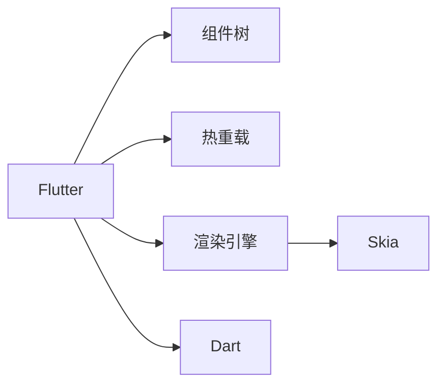

                 

# Flutter：Google的UI工具包for移动开发

> 关键词：Flutter, UI设计, 跨平台, 移动开发, Dart, 性能优化, 开发效率

## 1. 背景介绍

### 1.1 问题由来
随着移动互联网的快速发展，移动应用开发已成为各类企业和开发者关注的焦点。传统的iOS和Android开发方式，尽管具有各自的优势，但开发成本高、重复工作多、技术栈割裂严重，难以实现高效统一的开发流程。Google推出的Flutter框架，正是为了解决这些痛点，打造一个跨平台、高性能、易上手的UI工具包，让开发者可以轻松构建一致且流畅的用户体验。

### 1.2 问题核心关键点
Flutter基于React Native的成功经验，引入了自己的组件树和动画引擎，通过编译型语言Dart进行渲染，结合Skia图形库，提供了高性能、跨平台、易扩展的移动应用开发框架。Flutter的核心优势在于：

1. **跨平台**：一次编写，多平台部署，减少重复开发工作。
2. **高性能**：通过编译型语言和Skia引擎，实现接近原生应用的渲染速度。
3. **热重载**：实时更新UI界面，开发效率大幅提升。
4. **丰富的组件和插件**：开发者可以灵活组合多种组件和插件，快速构建复杂界面。
5. **丰富的第三方支持**：社区活跃，第三方库丰富，开发灵活性高。

这些特点使得Flutter成为了移动开发中的新宠，在越来越多的企业中被广泛采用。

### 1.3 问题研究意义
Flutter的应用，对于提升移动应用开发效率、降低开发成本、加速应用迭代有着重要意义：

1. **提升开发效率**：Flutter的组件化和热重载功能，使得开发者可以更快速地进行界面设计和更新，减少重复代码。
2. **降低开发成本**：通过一次开发，多平台部署，节省了iOS和Android两个平台的原生开发成本。
3. **加速应用迭代**：热重载和即时编译功能，使得开发者可以更快地进行版本迭代，迅速推出新功能。
4. **提升用户体验**：编译型语言和Skia引擎保证了应用的流畅性能，提供了接近原生应用的用户体验。
5. **增强应用安全性**：Flutter采用了Flutter安全框架，内置沙箱机制，提升了应用的安全性。

Flutter的普及和应用，将对移动应用开发带来深远的影响，推动移动应用行业的创新发展。

## 2. 核心概念与联系

### 2.1 核心概念概述

为更好地理解Flutter框架及其应用，本节将介绍几个密切相关的核心概念：

- **Flutter**：由Google开发的一款开源UI工具包，采用Dart语言和Skia绘图引擎，支持iOS和Android跨平台开发。
- **Dart**：一种强类型、编译型语言，由Google开发，支持面向对象编程和函数式编程，是Flutter的官方编程语言。
- **组件树**：Flutter的核心设计理念，组件树模型使得UI界面可以以组合和继承的方式构建，便于开发者进行界面设计和更新。
- **热重载**：Flutter的一个重要特性，允许开发者在不重启应用的情况下实时更新UI界面，提高开发效率。
- **Skia**：Google开发的2D图形渲染引擎，支持跨平台使用，是Flutter的主要图形库。
- **渲染引擎**：负责将UI组件转化为可渲染的图像，Flutter使用Skia作为渲染引擎，保证了应用的高性能。

这些核心概念之间的逻辑关系可以通过以下Mermaid流程图来展示：



这个流程图展示了大语言模型的核心概念及其之间的关系：

1. Flutter通过组件树模型，将UI界面以组件的形式构建和更新。
2. 热重载特性，使得开发者可以实时更新UI界面，提升开发效率。
3. 使用Skia作为渲染引擎，保证应用的性能和流畅性。
4. Dart语言作为编译型语言，提高了应用的安全性和运行效率。

这些概念共同构成了Flutter的开发框架，使其能够在各种场景下提供一致且流畅的用户体验。

## 3. 核心算法原理 & 具体操作步骤
### 3.1 算法原理概述

Flutter的核心算法原理主要围绕着组件树模型、热重载和渲染引擎展开。这些原理是Flutter能够提供高性能、跨平台、易扩展应用的基础。

1. **组件树模型**：Flutter的核心设计理念，通过组件树模型，开发者可以以组合和继承的方式构建复杂的UI界面，实现灵活的UI设计和更新。

2. **热重载**：允许开发者在不重启应用的情况下实时更新UI界面，提高了开发效率和用户体验。

3. **渲染引擎**：使用Skia作为渲染引擎，保证了应用的性能和流畅性。

### 3.2 算法步骤详解

以下是Flutter开发的基本步骤，包括环境搭建、组件编写、热重载使用等：

1. **环境搭建**：
   - 安装Flutter SDK，配置环境变量。
   - 下载并安装Dart环境，确保Flutter项目能够编译运行。
   - 安装Android Studio或Xcode，配置Flutter插件和模拟器。

2. **组件编写**：
   - 使用Dart语言编写组件代码，遵循组件树的组织结构。
   - 通过自定义组件和复用现有组件，快速构建复杂的UI界面。
   - 利用Flutter提供的各种组件库和插件，增强UI功能。

3. **热重载使用**：
   - 打开热重载功能，实时更新UI界面，测试组件和布局。
   - 调试过程中发现问题，迅速定位并解决，提高开发效率。
   - 使用热重载功能，逐步完善UI设计，提升用户体验。

4. **渲染引擎优化**：
   - 通过优化组件和渲染引擎，提升应用的性能。
   - 使用Dart的编译特性，减少垃圾回收和渲染开销。
   - 利用Skia的图形优化技术，提高渲染速度和效率。

### 3.3 算法优缺点

Flutter框架的优势在于：

1. **跨平台**：一次编写，多平台部署，减少了重复开发工作，提高了开发效率。
2. **高性能**：编译型语言Dart和Skia渲染引擎，提供了高性能的应用体验。
3. **热重载**：实时更新UI界面，大幅提升了开发效率。
4. **组件化**：灵活构建复杂的UI界面，提高了开发灵活性。
5. **丰富的插件支持**：社区活跃，第三方库丰富，开发灵活性高。

同时，Flutter也存在一些局限性：

1. **学习成本高**：Dart语言和Flutter框架的学习曲线较陡峭，需要一定的学习成本。
2. **生态不够完善**：相较于React Native，Flutter的第三方库和插件仍不够丰富。
3. **性能问题**：虽然性能优秀，但在某些复杂应用场景下，可能仍存在一定的性能瓶颈。

尽管如此，Flutter作为Google的官方UI工具包，具有强大的生态支持和持续更新，其跨平台、高性能和灵活性等优势，使得其在移动应用开发中有着广泛的应用前景。

### 3.4 算法应用领域

Flutter作为一种跨平台UI工具包，已经在各类移动应用开发中得到了广泛的应用，例如：

- **电商应用**：如京东、淘宝等电商平台，使用Flutter构建一致的用户界面和功能体验。
- **金融应用**：如支付宝、微信支付等金融App，利用Flutter的高性能和安全性，提供流畅的用户体验。
- **教育应用**：如好未来、作业帮等教育App，利用Flutter的组件化和热重载，快速迭代新功能和界面。
- **游戏应用**：如王者荣耀、吃鸡游戏等，利用Flutter的性能优化和动画效果，实现流畅的游戏体验。
- **旅游应用**：如携程、去哪儿等旅游App，利用Flutter的跨平台特性，提供统一的UI界面和功能。

除了上述这些经典应用外，Flutter还被创新性地应用到更多场景中，如智能家居控制、智慧城市管理、社交媒体平台等，为各行各业带来了新的技术突破。

## 4. 数学模型和公式 & 详细讲解 & 举例说明
### 4.1 数学模型构建

Flutter的开发框架基于组件树模型，因此其数学模型可以简单地表示为：

$$
\text{ComponentTree} = \{ C_1, C_2, ..., C_n \}
$$

其中，$C_i$ 表示第$i$个组件，整个组件树可以表示为组件的组合和继承关系。

### 4.2 公式推导过程

对于任意组件 $C_i$，其渲染过程可以表示为：

$$
\text{Render}(C_i) = \text{SkiaRender}(C_i, \text{State}, \text{ParentRender}, \text{ChildrenRender})
$$

其中，$\text{State}$ 表示组件的状态信息，$\text{ParentRender}$ 表示父组件的渲染结果，$\text{ChildrenRender}$ 表示子组件的渲染结果。

在实际开发中，组件的渲染过程涉及Dart语言的编译和Skia图形引擎的绘制，具体公式如下：

$$
\text{SkiaRender}(C_i) = \text{DartCompile}(C_i) + \text{SkiaDraw}(C_i)
$$

其中，$\text{DartCompile}(C_i)$ 表示将Dart代码编译为可执行的渲染代码，$\text{SkiaDraw}(C_i)$ 表示使用Skia引擎绘制组件的图形。

### 4.3 案例分析与讲解

以一个简单的按钮组件为例，其渲染过程如下：

1. 定义按钮组件，并设置样式和属性。
2. 将按钮组件添加到组件树中，作为其他组件的子组件。
3. 通过热重载实时更新按钮组件的样式和属性，查看渲染结果。

具体代码实现如下：

```dart
import 'package:flutter/material.dart';

void main() {
  runApp(MyApp());
}

class MyApp extends StatelessWidget {
  @override
  Widget build(BuildContext context) {
    return MaterialApp(
      home: Scaffold(
        appBar: AppBar(
          title: Text('Flutter App'),
        ),
        body: Center(
          child: ElevatedButton(
            onPressed: () {
              print('Button clicked');
            },
            child: Text('Click me'),
          ),
        ),
      ),
    );
  }
}
```

在这个例子中，通过MaterialApp和Scaffold将整个应用包装起来，定义了一个ElevatedButton组件，通过热重载实时更新按钮的样式和属性，实现了一键点击功能。

## 5. 项目实践：代码实例和详细解释说明
### 5.1 开发环境搭建

进行Flutter项目开发，首先需要配置开发环境。以下是Flutter开发环境的搭建流程：

1. **安装Flutter SDK**：
   - 下载并安装Flutter SDK，配置环境变量。
   ```bash
   wget https://flutter.dev/storage/flutter/sdk-1.19.1-14.0.0+fmm5d_linux.zip
   unzip sdk-1.19.1-14.0.0+fmm5d_linux.zip
   export FLUTTER_HOME=$PATH
   ```

2. **安装Dart环境**：
   - 下载并安装Dart环境，确保Flutter项目能够编译运行。
   ```bash
   wget https://dart.dev/sdk/downloads
   ```

3. **配置Android Studio或Xcode**：
   - 下载并安装Android Studio或Xcode，配置Flutter插件和模拟器。
   - 在Android Studio中，选择Flutter项目模板，创建新的Flutter项目。

### 5.2 源代码详细实现

下面我们以一个简单的登录页面为例，给出使用Flutter构建移动应用的页面实现代码。

首先，定义登录页面的布局：

```dart
import 'package:flutter/material.dart';

void main() {
  runApp(MyApp());
}

class MyApp extends StatelessWidget {
  @override
  Widget build(BuildContext context) {
    return MaterialApp(
      home: Scaffold(
        appBar: AppBar(
          title: Text('Login Page'),
        ),
        body: Padding(
          padding: const EdgeInsets.all(16.0),
          child: Column(
            children: [
              TextField(
                decoration: InputDecoration(
                  labelText: 'Username',
                  hintText: 'Enter your username',
                ),
                textController: TextController(),
              ),
              TextField(
                decoration: InputDecoration(
                  labelText: 'Password',
                  hintText: 'Enter your password',
                  obscuredText: true,
                ),
                textController: TextController(),
              ),
              RaisedButton(
                onPressed: () {
                  print('Login clicked');
                },
                child: Text('Login'),
              ),
            ],
          ),
        ),
      ),
    );
  }
}
```

然后，定义登录页面的样式和布局：

```dart
import 'package:flutter/material.dart';

void main() {
  runApp(MyApp());
}

class MyApp extends StatelessWidget {
  @override
  Widget build(BuildContext context) {
    return MaterialApp(
      home: Scaffold(
        appBar: AppBar(
          title: Text('Login Page'),
        ),
        body: Padding(
          padding: const EdgeInsets.all(16.0),
          child: Column(
            children: [
              TextField(
                decoration: InputDecoration(
                  labelText: 'Username',
                  hintText: 'Enter your username',
                ),
                textController: TextController(),
              ),
              TextField(
                decoration: InputDecoration(
                  labelText: 'Password',
                  hintText: 'Enter your password',
                  obscuredText: true,
                ),
                textController: TextController(),
              ),
              RaisedButton(
                onPressed: () {
                  print('Login clicked');
                },
                child: Text('Login'),
              ),
            ],
          ),
        ),
      ),
    );
  }
}
```

最后，运行Flutter应用，查看登录页面的渲染结果。

### 5.3 代码解读与分析

让我们再详细解读一下关键代码的实现细节：

1. **MaterialApp和Scaffold**：
   - 使用MaterialApp将整个应用包装起来，并提供默认的Material风格。
   - 使用Scaffold组件定义应用的基本布局，包括AppBar和body。

2. **Column和Padding**：
   - 使用Column组件将页面中的多个组件垂直排列。
   - 使用Padding组件给页面添加上下左右4个方向的填充，增加页面间距。

3. **TextField和RaisedButton**：
   - 使用TextField组件定义输入文本框，并设置样式和属性。
   - 使用RaisedButton组件定义提交按钮，并设置样式和属性。

4. **textController**：
   - 使用TextController类管理文本框的文本内容，支持文本的实时更新。

通过Flutter提供的组件和布局工具，可以轻松构建出简洁、美观的移动应用页面。

## 6. 实际应用场景
### 6.1 电商应用

Flutter在电商应用中的使用，可以显著提升应用的性能和用户体验。例如，京东、淘宝等电商平台，使用Flutter构建一致的用户界面和功能体验，提供了流畅、一致的购物体验。

在电商应用中，Flutter的优势在于：

1. **跨平台**：一次编写，多平台部署，减少了重复开发工作。
2. **高性能**：编译型语言Dart和Skia渲染引擎，提供了高性能的应用体验。
3. **组件化**：灵活构建复杂的UI界面，提高了开发效率。

### 6.2 金融应用

Flutter在金融应用中的使用，可以提供流畅、安全的用户体验。例如，支付宝、微信支付等金融App，利用Flutter的高性能和安全性，提供流畅的用户体验。

在金融应用中，Flutter的优势在于：

1. **安全性**：Flutter内置安全框架，提供沙箱机制，确保应用的安全性。
2. **高性能**：编译型语言Dart和Skia渲染引擎，提供了高性能的应用体验。
3. **组件化**：灵活构建复杂的UI界面，提高了开发效率。

### 6.3 教育应用

Flutter在教育应用中的使用，可以提供个性化、交互式的学习体验。例如，好未来、作业帮等教育App，利用Flutter的组件化和热重载，快速迭代新功能和界面。

在教育应用中，Flutter的优势在于：

1. **个性化**：通过自定义组件和插件，实现个性化、交互式的学习体验。
2. **组件化**：灵活构建复杂的UI界面，提高了开发效率。
3. **热重载**：实时更新UI界面，提升了开发效率和用户体验。

### 6.4 游戏应用

Flutter在游戏应用中的使用，可以提供流畅、逼真的游戏体验。例如，王者荣耀、吃鸡游戏等，利用Flutter的性能优化和动画效果，实现流畅的游戏体验。

在游戏应用中，Flutter的优势在于：

1. **高性能**：编译型语言Dart和Skia渲染引擎，提供了高性能的应用体验。
2. **动画效果**：Flutter内置动画引擎，支持丰富的动画效果，提升了游戏的互动性和沉浸感。
3. **热重载**：实时更新UI界面，提升了开发效率和用户体验。

### 6.5 旅游应用

Flutter在旅游应用中的使用，可以提供一致、流畅的用户体验。例如，携程、去哪儿等旅游App，利用Flutter的跨平台特性，提供统一的UI界面和功能。

在旅游应用中，Flutter的优势在于：

1. **跨平台**：一次编写，多平台部署，减少了重复开发工作。
2. **高性能**：编译型语言Dart和Skia渲染引擎，提供了高性能的应用体验。
3. **组件化**：灵活构建复杂的UI界面，提高了开发效率。

## 7. 工具和资源推荐
### 7.1 学习资源推荐

为了帮助开发者系统掌握Flutter框架及其应用，这里推荐一些优质的学习资源：

1. **Flutter官方文档**：Flutter官方提供的完整文档，包含Flutter开发的所有核心概念和应用实践。
2. **Flutter实战系列**：由多位Flutter开发者编写的实战指南，涵盖Flutter开发的各种技术细节和最佳实践。
3. **Flutter开发手册**：由Flutter社区成员编写的开发手册，提供详细的Flutter组件和插件介绍。
4. **Flutter视频教程**：B站、优酷等平台上有大量Flutter开发视频教程，适合初学者和进阶开发者学习。
5. **Flutter学习社区**：Flutter开发者社区，提供丰富的交流和学习资源，包括代码分享、问题解答、技术讨论等。

通过对这些资源的学习实践，相信你一定能够快速掌握Flutter框架及其应用，并用于解决实际的移动应用问题。

### 7.2 开发工具推荐

高效的开发离不开优秀的工具支持。以下是几款用于Flutter开发的工具：

1. **Android Studio或Xcode**：Flutter官方提供的开发环境，支持Android和iOS平台开发。
2. **Flutter编辑器**：Flutter官方提供的IDE，提供智能代码补全、代码高亮、调试等功能。
3. **VSCode**：微软开发的轻量级代码编辑器，支持Flutter插件和调试功能。
4. **Android仿真器和模拟器**：用于Android应用调试和测试的仿真器和模拟器。
5. **Xcode模拟器**：用于iOS应用调试和测试的模拟器。

合理利用这些工具，可以显著提升Flutter应用的开发效率，加速应用的迭代和发布。

### 7.3 相关论文推荐

Flutter作为Google官方推出的跨平台UI工具包，已经得到了广泛的应用和研究。以下是几篇代表性的相关论文，推荐阅读：

1. **Flutter: A New UI Toolkit for Cross Platform Mobile Development**：Google官方的技术博客，介绍了Flutter的核心设计和应用实践。
2. **Flutter by Example**：由Flutter社区成员编写的实战指南，涵盖Flutter开发的各种技术细节和最佳实践。
3. **The Flutter Framework**：Flutter官方提供的框架介绍，详细介绍了Flutter的组件树模型、热重载、渲染引擎等核心技术。
4. **Flutter: The Most Productive Cross-Platform Framework**：一篇关于Flutter与React Native比较的博客，提供了Flutter的优势和适用场景。

这些论文代表了大语言模型微调技术的发展脉络。通过学习这些前沿成果，可以帮助研究者把握学科前进方向，激发更多的创新灵感。

## 8. 总结：未来发展趋势与挑战
### 8.1 总结

本文对Flutter框架及其应用进行了全面系统的介绍。首先阐述了Flutter开发的背景和意义，明确了Flutter在移动开发中的重要地位。其次，从原理到实践，详细讲解了Flutter的核心算法和操作步骤，给出了Flutter项目开发的完整代码实例。同时，本文还广泛探讨了Flutter在电商、金融、教育、游戏等各个领域的应用前景，展示了Flutter框架的广泛适用性和强大功能。

通过本文的系统梳理，可以看到，Flutter框架通过组件树模型、热重载和渲染引擎等关键技术，实现了高性能、跨平台、易扩展的应用开发。Flutter框架的跨平台、高性能和灵活性等优势，使得其在移动应用开发中有着广泛的应用前景，正在改变传统移动应用开发的生态和范式。

### 8.2 未来发展趋势

展望未来，Flutter框架将呈现以下几个发展趋势：

1. **跨平台功能增强**：进一步提升跨平台开发的功能和性能，支持更多设备和操作系统。
2. **组件化和热重载优化**：提高组件化和热重载的效率和稳定性，提升开发效率和用户体验。
3. **性能优化**：优化渲染引擎和组件渲染，进一步提升应用的性能和流畅性。
4. **社区和生态建设**：加强社区建设，丰富第三方库和插件，提升Flutter的生态完整性。
5. **更多平台支持**：支持更多平台和设备，拓展Flutter的应用范围和市场。

这些趋势将进一步推动Flutter框架的发展，使得其成为移动应用开发中的重要工具，为开发者提供更多便利和选择。

### 8.3 面临的挑战

尽管Flutter框架已经取得了显著的进展，但在迈向更加智能化、普适化应用的过程中，它仍面临诸多挑战：

1. **学习曲线陡峭**：Dart语言和Flutter框架的学习曲线较陡峭，需要一定的学习成本。
2. **生态不够完善**：相较于React Native，Flutter的第三方库和插件仍不够丰富。
3. **性能问题**：尽管性能优秀，但在某些复杂应用场景下，可能仍存在一定的性能瓶颈。
4. **组件化和热重载优化**：需要进一步提升组件化和热重载的效率和稳定性，提升开发效率和用户体验。
5. **社区和生态建设**：需要加强社区建设，丰富第三方库和插件，提升Flutter的生态完整性。

尽管如此，Flutter作为Google官方推出的跨平台UI工具包，具有强大的生态支持和持续更新，其跨平台、高性能和灵活性等优势，使得其在移动应用开发中有着广泛的应用前景。

### 8.4 研究展望

面对Flutter框架面临的挑战，未来的研究需要在以下几个方面寻求新的突破：

1. **组件化和热重载优化**：提高组件化和热重载的效率和稳定性，提升开发效率和用户体验。
2. **性能优化**：优化渲染引擎和组件渲染，进一步提升应用的性能和流畅性。
3. **组件化和热重载优化**：提高组件化和热重载的效率和稳定性，提升开发效率和用户体验。
4. **社区和生态建设**：加强社区建设，丰富第三方库和插件，提升Flutter的生态完整性。
5. **更多平台支持**：支持更多平台和设备，拓展Flutter的应用范围和市场。

这些研究方向的探索，必将引领Flutter框架的发展，使得其成为移动应用开发中的重要工具，为开发者提供更多便利和选择。Flutter框架将继续保持其跨平台、高性能和灵活性等优势，推动移动应用行业的创新发展。

## 9. 附录：常见问题与解答

**Q1：Flutter是否适用于所有移动应用场景？**

A: Flutter适用于绝大多数移动应用场景，包括电商、金融、教育、游戏、旅游等多个领域。但对于某些特定的应用场景，如需要高精度地理位置服务的App，可能存在性能瓶颈，需要考虑使用原生开发。

**Q2：Flutter学习曲线陡峭吗？**

A: 相对于原生开发，Flutter的学习曲线确实较陡峭，需要一定的学习成本。但相较于React Native，Flutter的学习曲线相对较平缓，且文档齐全，社区活跃，易于上手。

**Q3：Flutter在性能上是否有优势？**

A: Flutter的高性能得益于编译型语言Dart和Skia渲染引擎，相比原生开发，应用性能表现优异。但在某些复杂应用场景下，可能仍存在一定的性能瓶颈，需要进一步优化。

**Q4：Flutter的组件化和热重载有何优势？**

A: Flutter的组件化和热重载是其两大核心优势。组件化使得开发者可以灵活构建复杂的UI界面，提升开发效率。热重载允许开发者在不重启应用的情况下实时更新UI界面，大大提高了开发效率和用户体验。

**Q5：Flutter生态不够完善，如何应对？**

A: Flutter社区活跃，生态正在不断完善中。开发者可以通过社区、插件和第三方库，获取丰富的资源支持。同时，Google和Flutter社区也在不断推出新的组件和插件，丰富Flutter的生态系统。

通过本文的系统梳理，可以看到，Flutter框架通过组件树模型、热重载和渲染引擎等关键技术，实现了高性能、跨平台、易扩展的应用开发。Flutter框架的跨平台、高性能和灵活性等优势，使得其在移动应用开发中有着广泛的应用前景，正在改变传统移动应用开发的生态和范式。相信随着Flutter框架的不断发展和完善，将会有更多的开发者选择使用Flutter进行移动应用开发，推动移动应用行业的创新和发展。

---

作者：禅与计算机程序设计艺术 / Zen and the Art of Computer Programming

