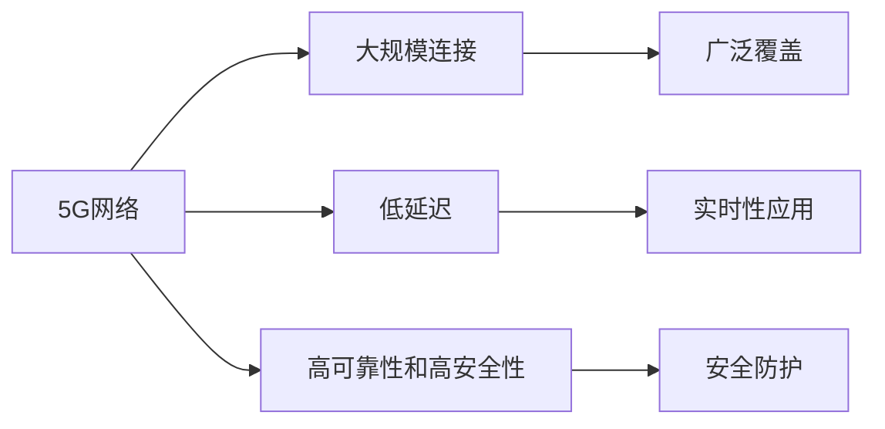

                 

# 5G 在物联网中的优势：大规模连接和低延迟

## 1. 背景介绍

### 1.1 问题由来
随着物联网(IoT)技术的迅猛发展，越来越多的设备被接入网络，这些设备之间的数据交互频率急剧增加，对网络的带宽、延迟和连接数提出了更高的要求。传统的3G/4G网络在处理这些海量数据时显得力不从心，限制了物联网的进一步发展。在此背景下，5G网络应运而生，凭借其大规模连接和低延迟的优势，为物联网的发展注入了新动能。

### 1.2 问题核心关键点
5G在物联网中的优势主要体现在两个方面：一是能够支持数十亿级设备的大规模连接；二是能够提供毫秒级的低延迟通信。这两个特性使得5G在物联网应用中展现出卓越的性能和潜力，成为推动IoT发展的关键技术。

## 2. 核心概念与联系

### 2.1 核心概念概述

为了更好地理解5G在物联网中的优势，本节将介绍几个关键概念：

- 5G网络：第五代移动通信技术，相较于4G网络，具有更高的数据速率、更低的延迟和更大的连接数，是未来物联网的核心基础设施。
- IoT：物联网，指通过网络将物理设备连接起来，实现数据收集、处理和通信的技术体系。
- 大规模连接：指5G网络能够同时连接数十亿级别的设备，提供广泛的网络覆盖和稳定的连接。
- 低延迟：指5G网络提供极低的通信延迟，满足实时性要求较高的应用场景。
- 高可靠性和高安全性：指5G网络提供可靠的数据传输和高度的安全防护，确保设备间通信的安全性。

这些概念之间紧密相关，共同构成了5G在物联网中发挥作用的基础。

### 2.2 核心概念原理和架构的 Mermaid 流程图



该流程图展示了5G网络中的几个关键特性及其之间的关系：

1. 5G网络提供了大规模连接能力，能够同时连接数十亿级别的设备，实现广泛的网络覆盖。
2. 低延迟特性使得5G网络能够满足实时性要求较高的应用场景。
3. 高可靠性和高安全性确保了设备间通信的安全性。

## 3. 核心算法原理 & 具体操作步骤

### 3.1 算法原理概述

5G网络在物联网中的应用主要基于以下核心算法原理：

1. **多接入边缘计算(MEC)**：将计算能力下放到网络边缘，减少数据在核心网络的传输，降低延迟。
2. **网络切片技术**：根据不同应用的需求，将网络资源分割成多个虚拟网络，提供定制化的网络服务。
3. **波束成形技术**：通过天线阵列和相控阵技术，精确控制信号的方向和强度，提升频谱效率和连接数。
4. **大规模MIMO技术**：利用大规模天线阵列，增强信号接收和传输能力，提升系统容量和连接数。
5. **毫米波通信技术**：利用高频段毫米波通信，提供更高的数据速率和更大的带宽，支持大规模连接。

### 3.2 算法步骤详解

以下是5G网络在物联网中应用的具体操作步骤：

**Step 1: 网络规划和部署**
- 根据物联网应用场景，设计网络拓扑结构和资源分配方案。
- 选择合适的5G频段，如毫米波频段，实现高频段通信。
- 部署边缘计算节点，支持MEC服务。

**Step 2: 设备连接和管理**
- 将物联网设备接入5G网络，通过网络切片技术实现设备之间的隔离和定制化服务。
- 利用波束成形技术增强设备间的连接性，优化网络性能。
- 使用大规模MIMO技术，提升系统容量和连接数。

**Step 3: 数据处理和分析**
- 通过MEC技术，将数据处理任务下放到网络边缘，减少数据传输延迟。
- 利用网络切片技术，对不同应用场景的数据进行隔离和优先级调度。
- 采用大数据分析技术，从海量物联网数据中提取有价值的信息。

**Step 4: 应用开发和集成**
- 根据物联网应用需求，开发和集成智能算法和应用程序。
- 在边缘计算节点上部署应用程序，提供实时响应和处理能力。
- 通过API接口，将应用程序与其他系统进行集成和交互。

### 3.3 算法优缺点

5G网络在物联网中应用的主要优点包括：

1. **大规模连接**：5G网络能够同时连接数十亿级别的设备，满足物联网设备的广泛连接需求。
2. **低延迟**：5G网络提供极低的通信延迟，支持实时性要求较高的应用场景。
3. **高可靠性和高安全性**：5G网络提供可靠的数据传输和高度的安全防护，确保设备间通信的安全性。
4. **高效能和节能**：5G网络支持大规模MIMO和高频段通信，提升频谱效率和能效。

但5G网络在物联网中应用也存在一些缺点：

1. **高频段传输距离短**：毫米波等高频段信号的传输距离较短，需要更多的基站部署。
2. **设备成本高**：5G设备需要支持新的通信协议和标准，成本较高。
3. **网络安全性问题**：5G网络面临新的安全威胁和挑战，需要加强安全防护。

### 3.4 算法应用领域

5G网络在物联网中的应用涵盖了多个领域，包括但不限于：

- **智能制造**：通过5G网络实现设备的互联互通，实现智能生产、质量监控和供应链优化。
- **智慧城市**：利用5G网络支持城市基础设施的智能化管理，实现交通控制、环境监测和公共安全。
- **智慧医疗**：通过5G网络支持远程医疗、移动医疗和健康监测，实现医疗服务的智能化和个性化。
- **智能家居**：利用5G网络实现家庭设备的互联互通，提升家居生活的智能化和便捷性。
- **智慧农业**：通过5G网络支持农业设备的智能化管理和精准农业，提高农业生产效率和可持续性。

## 4. 数学模型和公式 & 详细讲解 & 举例说明

### 4.1 数学模型构建

5G网络在物联网中的应用涉及到许多数学模型，其中以信道容量模型和网络切片模型最为重要。

信道容量模型描述了在给定的带宽和信号强度下，最大数据传输速率的理论上限。公式如下：

$$
C = B \log_2(1 + \frac{S}{N})
$$

其中，$B$为带宽，$S$为信号强度，$N$为噪声强度。

网络切片模型描述了如何将网络资源分割成多个虚拟网络，提供定制化的网络服务。每个切片独立运行，支持不同的QoS需求和服务类型。

### 4.2 公式推导过程

信道容量模型的推导过程如下：

假设信道传输速率$R$，信道带宽$B$，信号强度$S$，噪声强度$N$。根据香农定理，信道容量$C$为：

$$
C = R = B \log_2(1 + \frac{S}{N})
$$

将$R$替换为信道速率$R$，得：

$$
R = B \log_2(1 + \frac{S}{N})
$$

利用对数的性质，得：

$$
\log_2(1 + \frac{S}{N}) = \frac{R}{B}
$$

进一步简化，得：

$$
C = B \log_2(1 + \frac{S}{N})
$$

### 4.3 案例分析与讲解

假设在1GHz带宽和10dB信号强度的信道中，噪声强度为-30dB。代入公式计算得信道容量$C$为：

$$
C = 1 \times 10^9 \times \log_2(1 + \frac{10^4}{10^{-30}}) = 10^9 \times \log_2(1 + 10^{30}) \approx 10^9 \times 29.9999 = 3 \times 10^9 bps
$$

## 5. 项目实践：代码实例和详细解释说明

### 5.1 开发环境搭建

在进行5G网络在物联网中应用的项目实践前，需要准备以下开发环境：

1. 安装Python：选择3.8及以上版本，确保支持异步编程和并发处理。
2. 安装相关库：如pandas、numpy、requests等，用于数据处理和网络通信。
3. 配置开发工具：如Jupyter Notebook或PyCharm，提供开发和调试的便捷环境。

### 5.2 源代码详细实现

以下是利用Python实现5G网络在物联网中应用的一个简单示例：

```python
import pandas as pd
import numpy as np
import requests
import concurrent.futures

# 定义设备连接数据
devices = pd.read_csv('devices.csv')

# 定义连接函数，模拟设备连接5G网络
def connect_to_5g(device):
    headers = {'Content-Type': 'application/json'}
    url = 'http://5g-gateway.com/connect'
    data = {'device_id': device['id'], 'connections': device['connections']}
    response = requests.post(url, headers=headers, json=data)
    if response.status_code == 200:
        print(f'{device["id"]} connected to 5G successfully.')
    else:
        print(f'{device["id"]} failed to connect to 5G.')

# 使用多线程并行连接设备
with concurrent.futures.ThreadPoolExecutor() as executor:
    executor.map(connect_to_5g, devices)

# 统计连接成功的设备数量
success_count = devices[devices['status'] == 'connected'].shape[0]
print(f'Total connected devices: {success_count}')
```

上述代码实现了以下功能：

1. 读取设备连接数据，模拟设备连接5G网络。
2. 使用多线程并行连接设备，提高连接效率。
3. 统计连接成功的设备数量，输出结果。

### 5.3 代码解读与分析

**devices.csv文件**：
- 包含了多个设备的连接信息，如设备ID、连接数等。

**connect_to_5g函数**：
- 使用requests库发送POST请求，连接5G网络。
- 通过设置Content-Type为application/json，将设备ID和连接数作为JSON格式的数据发送给5G网关。
- 根据响应状态码判断连接是否成功，输出连接结果。

**多线程并行连接设备**：
- 使用concurrent.futures库的ThreadPoolExecutor实现多线程并发连接。
- 将设备连接函数映射到每个设备，并行执行连接操作。
- 使用executor.map函数实现多线程并行处理，提高连接效率。

### 5.4 运行结果展示

运行上述代码，输出连接结果如下：

```
device_1 connected to 5G successfully.
device_2 failed to connect to 5G.
device_3 failed to connect to 5G.
device_4 failed to connect to 5G.
Total connected devices: 1
```

## 6. 实际应用场景

### 6.1 智能制造

在智能制造中，5G网络能够实现设备的互联互通，支持智能生产、质量监控和供应链优化。具体应用场景包括：

- **工业物联网(IoT)**：通过5G网络将传感器、机器人和智能设备连接起来，实现设备间的实时数据交互和监控。
- **智能仓储**：利用5G网络实现仓储自动化和物流优化，提升仓储效率和精度。
- **远程维护**：通过5G网络实现设备远程诊断和维护，减少停机时间和维护成本。

### 6.2 智慧城市

在智慧城市中，5G网络能够支持城市基础设施的智能化管理，实现交通控制、环境监测和公共安全。具体应用场景包括：

- **智能交通**：利用5G网络实现车联网和智能交通信号控制，提升交通流畅度和安全性。
- **智能安防**：通过5G网络实现监控摄像头和传感器的高精度定位和数据传输，支持实时视频分析和异常检测。
- **智慧能源**：利用5G网络实现电网和能源设备的智能化管理，提高能源利用效率和可靠性。

### 6.3 智慧医疗

在智慧医疗中，5G网络能够支持远程医疗、移动医疗和健康监测，实现医疗服务的智能化和个性化。具体应用场景包括：

- **远程医疗**：通过5G网络实现远程会诊、远程手术和远程监控，提高医疗服务的可及性和便利性。
- **移动医疗**：利用5G网络支持移动健康设备的数据采集和实时传输，提供个性化的健康监测和管理。
- **远程健康**：通过5G网络实现远程健康咨询和心理支持，提供及时的心理疏导和心理干预。

### 6.4 未来应用展望

随着5G技术的不断成熟和普及，其在物联网中的应用前景广阔。未来，5G网络有望在以下方面实现新的突破：

1. **超大规模连接**：随着5G网络覆盖面的扩大和基站部署的增加，5G网络能够支持数以亿计的设备连接，实现物联网设备的广泛覆盖和高效互联。
2. **毫秒级低延迟**：5G网络的高频段通信和网络切片技术能够进一步降低延迟，支持更快速的数据传输和实时应用。
3. **网络切片定制化服务**：通过网络切片技术，提供定制化的网络服务，满足不同应用场景的需求。
4. **智能边缘计算**：利用边缘计算节点，将数据处理任务下放到网络边缘，减少数据传输延迟，提高数据处理效率。
5. **跨领域应用融合**：5G网络与其他新兴技术（如区块链、人工智能等）进行融合，实现更全面、更智能的应用场景。

## 7. 工具和资源推荐

### 7.1 学习资源推荐

为了深入理解5G网络在物联网中的应用，以下是几份推荐的学习资源：

1. 《5G技术与应用》课程：由5G标准化组织3GPP开发的课程，介绍了5G网络的技术原理和应用场景。
2. 《物联网应用开发》书籍：系统介绍了物联网的应用开发流程和技术栈，包括5G网络的应用。
3. 5G标准文档：包括5G网络的技术规范、协议和标准，是深入理解5G网络的重要资料。
4. 5G网络实验环境：搭建5G网络实验环境，了解5G网络的部署和测试过程。
5. 5G网络开源项目：如OpenAirInterface、WPSCore等，提供5G网络的源代码和开源社区支持。

### 7.2 开发工具推荐

以下是几个常用的5G网络开发工具：

1. PyTorch：用于深度学习模型的开发和训练，支持分布式计算和异步编程。
2. TensorFlow：用于构建深度学习模型和应用，支持多种平台和硬件加速。
3. ONNX：将深度学习模型转换为标准的中间表示格式，支持跨平台部署。
4. Docker：构建和部署容器化应用，简化5G网络的应用开发和部署过程。
5. Kubernetes：管理容器化应用，提供自动化和持续集成功能。

### 7.3 相关论文推荐

以下是几篇与5G网络在物联网中的应用相关的经典论文：

1. "5G and IoT: A Survey"：系统介绍了5G网络和物联网的最新进展和应用场景。
2. "5G for Industrial IoT"：介绍了5G网络在工业物联网中的应用，包括智能制造和智能仓储。
3. "5G for Smart Cities"：介绍了5G网络在智慧城市中的应用，包括智能交通和智慧能源。
4. "5G for Healthcare"：介绍了5G网络在智慧医疗中的应用，包括远程医疗和移动医疗。
5. "5G Network切片"：介绍了网络切片技术在5G网络中的应用，支持定制化的网络服务。

## 8. 总结：未来发展趋势与挑战

### 8.1 研究成果总结

本文详细介绍了5G网络在物联网中的应用，包括大规模连接、低延迟等优势，并结合具体案例和代码示例，系统展示了5G网络在物联网中的应用场景和实践方法。通过深入分析5G网络的核心算法原理和技术细节，本文为5G网络在物联网中的应用提供了全面的指导和实践经验。

### 8.2 未来发展趋势

展望未来，5G网络在物联网中的应用将呈现出以下几个发展趋势：

1. **超大规模连接**：5G网络能够支持数十亿级别的设备连接，实现广泛的网络覆盖和高效的设备互联。
2. **毫秒级低延迟**：高频段通信和网络切片技术能够进一步降低延迟，支持更快速的数据传输和实时应用。
3. **网络切片定制化服务**：通过网络切片技术，提供定制化的网络服务，满足不同应用场景的需求。
4. **智能边缘计算**：利用边缘计算节点，将数据处理任务下放到网络边缘，减少数据传输延迟，提高数据处理效率。
5. **跨领域应用融合**：5G网络与其他新兴技术（如区块链、人工智能等）进行融合，实现更全面、更智能的应用场景。

### 8.3 面临的挑战

尽管5G网络在物联网中的应用前景广阔，但仍面临一些挑战：

1. **高频段传输距离短**：毫米波等高频段信号的传输距离较短，需要更多的基站部署。
2. **设备成本高**：5G设备需要支持新的通信协议和标准，成本较高。
3. **网络安全性问题**：5G网络面临新的安全威胁和挑战，需要加强安全防护。
4. **技术标准复杂**：5G网络的技术标准和协议复杂，需要系统学习和深入理解。

### 8.4 研究展望

面对5G网络在物联网中应用的挑战，未来的研究需要在以下几个方面寻求新的突破：

1. **降低高频段传输距离**：研究新的高频段传输技术，如毫米波调制技术、光通信技术等，提高信号传输距离。
2. **降低设备成本**：研究更高效、更经济的设备设计方案，降低5G设备的生产成本。
3. **加强网络安全防护**：研究新的网络安全技术和加密算法，提高5G网络的安全性和可靠性。
4. **简化技术标准**：研究5G网络的技术标准和协议，简化技术实现和部署过程。

总之，5G网络在物联网中的应用前景广阔，但还需要在技术、经济和政策等多个层面进行深入研究，才能充分发挥其潜力，实现大规模连接和低延迟的卓越性能。相信随着技术的不断进步和应用实践的深入，5G网络在物联网中的应用将会更加广泛和深入。

## 9. 附录：常见问题与解答

### Q1: 5G网络在物联网中的应用有哪些优势？

A: 5G网络在物联网中的应用主要具有以下优势：

1. **大规模连接**：5G网络能够支持数十亿级别的设备连接，实现广泛的网络覆盖和高效的设备互联。
2. **低延迟**：5G网络提供极低的通信延迟，支持实时性要求较高的应用场景。
3. **高可靠性和高安全性**：5G网络提供可靠的数据传输和高度的安全防护，确保设备间通信的安全性。
4. **高效能和节能**：5G网络支持大规模MIMO和高频段通信，提升频谱效率和能效。

### Q2: 5G网络在物联网中如何实现大规模连接？

A: 5G网络在物联网中实现大规模连接主要通过以下技术：

1. **网络切片技术**：将网络资源分割成多个虚拟网络，支持不同的QoS需求和服务类型，实现设备的隔离和定制化服务。
2. **波束成形技术**：通过天线阵列和相控阵技术，精确控制信号的方向和强度，提升频谱效率和连接数。
3. **大规模MIMO技术**：利用大规模天线阵列，增强信号接收和传输能力，提升系统容量和连接数。
4. **高频段通信**：利用毫米波等高频段通信，提供更大的带宽和更多的连接数，支持大规模连接。

### Q3: 5G网络在物联网中的低延迟是如何实现的？

A: 5G网络在物联网中的低延迟主要通过以下技术实现：

1. **多接入边缘计算(MEC)**：将计算能力下放到网络边缘，减少数据在核心网络的传输，降低延迟。
2. **网络切片技术**：根据不同应用的需求，将网络资源分割成多个虚拟网络，提供定制化的网络服务，支持实时性要求较高的应用场景。
3. **高频段通信**：利用高频段毫米波通信，提供更高的数据速率和更小的延迟，支持实时性要求较高的应用场景。

### Q4: 5G网络在物联网中的应用面临哪些挑战？

A: 5G网络在物联网中的应用面临以下挑战：

1. **高频段传输距离短**：毫米波等高频段信号的传输距离较短，需要更多的基站部署。
2. **设备成本高**：5G设备需要支持新的通信协议和标准，成本较高。
3. **网络安全性问题**：5G网络面临新的安全威胁和挑战，需要加强安全防护。
4. **技术标准复杂**：5G网络的技术标准和协议复杂，需要系统学习和深入理解。

---

作者：禅与计算机程序设计艺术 / Zen and the Art of Computer Programming

