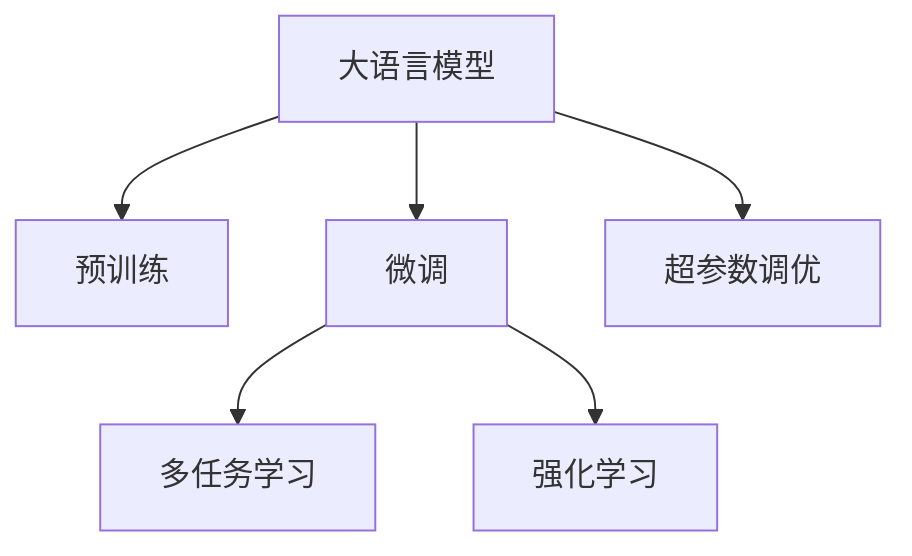

                 

# GENRE: 灵活、可配置的LLM推荐

> 关键词：推荐系统,自然语言处理(NLP),深度学习,强化学习,超参数调优,多任务学习,召回率,点击率,推荐模型,性能评估

## 1. 背景介绍

### 1.1 问题由来

随着互联网和数字媒体的发展，推荐系统在电子商务、社交网络、视频流媒体等领域得到了广泛应用。推荐系统通过分析用户的兴趣、行为和反馈，智能推荐符合用户偏好的内容，从而提升用户体验和平台收益。然而，推荐系统的发展也面临诸多挑战，如冷启动问题、数据稀疏性、动态性等。

近年来，自然语言处理(NLP)技术在推荐系统中的应用引起了广泛关注。特别是基于深度学习的大语言模型(LLM)，由于其强大的语言理解和生成能力，被认为能够有效提升推荐系统的精度和个性化水平。大语言模型可以通过预训练获得丰富的语言知识，并通过微调适配特定任务，如生成推荐语料、理解用户评论等，从而更好地满足用户的个性化需求。

### 1.2 问题核心关键点

本文聚焦于基于深度学习的大语言模型在推荐系统中的应用，特别是如何设计灵活、可配置的推荐模型。关键问题包括：

- 如何设计能够适应不同用户偏好的推荐模型？
- 如何通过微调来优化模型参数？
- 如何在推荐系统中引入多任务学习？
- 如何设计高效的推荐模型评估指标？
- 如何在推荐模型中引入强化学习？

## 2. 核心概念与联系

### 2.1 核心概念概述

为更好地理解基于深度学习的大语言模型在推荐系统中的应用，本节将介绍几个密切相关的核心概念：

- 大语言模型(Large Language Model, LLM)：以自回归(如GPT)或自编码(如BERT)模型为代表的大规模预训练语言模型。通过在大规模无标签文本语料上进行预训练，学习通用的语言表示，具备强大的语言理解和生成能力。

- 推荐系统(Recommendation System)：通过分析用户行为和偏好，智能推荐符合用户需求的产品或内容，提升用户体验和业务收益的智能系统。

- 微调(Fine-tuning)：指在预训练模型的基础上，使用下游任务的少量标注数据，通过有监督地训练来优化模型在该任务上的性能。通常只需要调整顶层分类器或解码器，并以较小的学习率更新全部或部分的模型参数。

- 多任务学习(Multi-task Learning)：指在一个模型上同时训练多个任务，通过共享底层参数，提高模型在多任务上的泛化能力。

- 强化学习(Reinforcement Learning)：通过与环境互动，最大化累积奖励的学习范式，特别适用于动态环境下的推荐系统优化。

- 超参数调优(Hyperparameter Tuning)：通过调整模型的超参数，如学习率、批大小、优化器等，以优化模型性能的过程。

这些核心概念之间的逻辑关系可以通过以下Mermaid流程图来展示：



这个流程图展示了大语言模型的核心概念及其之间的关系：

1. 大语言模型通过预训练获得基础能力。
2. 微调是对预训练模型进行任务特定的优化，可以分为全参数微调和参数高效微调。
3. 多任务学习将多个任务融合到一个模型中，提升模型的泛化能力和迁移能力。
4. 强化学习通过与环境互动，调整模型参数，实现推荐系统的动态优化。
5. 超参数调优通过调整模型训练的参数，优化模型性能。

这些概念共同构成了大语言模型在推荐系统中的应用框架，使其能够在各种场景下发挥强大的推荐能力。通过理解这些核心概念，我们可以更好地把握大语言模型在推荐系统中的应用范式。

## 3. 核心算法原理 & 具体操作步骤
### 3.1 算法原理概述

基于深度学习的大语言模型在推荐系统中的应用，本质上是一个多任务学习(MTL)和微调过程。其核心思想是：将大语言模型视作一个强大的"特征提取器"，通过在多个推荐任务上进行微调，使得模型输出能够匹配不同任务的目标，从而实现个性化推荐。

形式化地，假设预训练模型为 $M_{\theta}$，其中 $\theta$ 为预训练得到的模型参数。给定推荐系统中的多个任务 $T=\{T_1, T_2, ..., T_n\}$ 的标注数据集 $\{D_i\}_{i=1}^n$，多任务微调的目标是找到新的模型参数 $\hat{\theta}$，使得：

$$
\hat{\theta}=\mathop{\arg\min}_{\theta} \sum_{i=1}^n \mathcal{L}_i(M_{\theta},D_i)
$$

其中 $\mathcal{L}_i$ 为任务 $T_i$ 对应的损失函数，用于衡量模型预测输出与真实标签之间的差异。常见的损失函数包括交叉熵损失、均方误差损失等。

通过梯度下降等优化算法，多任务微调过程不断更新模型参数 $\theta$，最小化任务总损失函数，使得模型输出逼近各个任务的理想标签。由于 $\theta$ 已经通过预训练获得了较好的初始化，因此即便在小规模数据集上微调，也能较快收敛到理想的模型参数 $\hat{\theta}$。

### 3.2 算法步骤详解

基于深度学习的大语言模型在推荐系统中的应用，一般包括以下几个关键步骤：

**Step 1: 准备预训练模型和数据集**
- 选择合适的预训练语言模型 $M_{\theta}$ 作为初始化参数，如 BERT、GPT 等。
- 准备推荐系统中的多个任务 $T=\{T_1, T_2, ..., T_n\}$ 的标注数据集 $\{D_i\}_{i=1}^n$，划分为训练集、验证集和测试集。一般要求标注数据与预训练数据的分布不要差异过大。

**Step 2: 添加任务适配层**
- 根据任务类型，在预训练模型顶层设计合适的输出层和损失函数。
- 对于分类任务，通常在顶层添加线性分类器和交叉熵损失函数。
- 对于生成任务，通常使用语言模型的解码器输出概率分布，并以负对数似然为损失函数。

**Step 3: 设置多任务超参数**
- 选择合适的优化算法及其参数，如 AdamW、SGD 等，设置学习率、批大小、迭代轮数等。
- 设置正则化技术及强度，包括权重衰减、Dropout、Early Stopping 等。
- 确定冻结预训练参数的策略，如仅微调顶层，或全部参数都参与微调。

**Step 4: 执行多任务梯度训练**
- 将训练集数据分批次输入模型，前向传播计算损失函数。
- 反向传播计算参数梯度，根据设定的优化算法和学习率更新模型参数。
- 周期性在验证集上评估模型性能，根据性能指标决定是否触发 Early Stopping。
- 重复上述步骤直到满足预设的迭代轮数或 Early Stopping 条件。

**Step 5: 测试和部署**
- 在测试集上评估多任务微调后模型 $M_{\hat{\theta}}$ 的性能，对比微调前后的精度提升。
- 使用微调后的模型对新样本进行推理预测，集成到实际的应用系统中。
- 持续收集新的数据，定期重新微调模型，以适应数据分布的变化。

以上是基于深度学习的大语言模型在推荐系统中的应用的一般流程。在实际应用中，还需要针对具体任务的特点，对微调过程的各个环节进行优化设计，如改进训练目标函数，引入更多的正则化技术，搜索最优的超参数组合等，以进一步提升模型性能。

### 3.3 算法优缺点

基于深度学习的大语言模型在推荐系统中的应用方法具有以下优点：
1. 简单高效。只需准备少量标注数据，即可对预训练模型进行快速适配，获得较大的性能提升。
2. 通用适用。适用于各种推荐任务，包括推荐商品、新闻、文章等，设计简单的任务适配层即可实现微调。
3. 性能提升明显。通过多任务微调，模型能够更好地适应不同任务，在推荐精度和个性化上取得显著提升。
4. 模型可配置。通过任务适配层和超参数调优，可以灵活地调整模型结构，适应不同的推荐场景。

同时，该方法也存在一定的局限性：
1. 依赖标注数据。微调的效果很大程度上取决于标注数据的质量和数量，获取高质量标注数据的成本较高。
2. 数据分布不一致。当不同任务的标注数据分布差异较大时，多任务微调的性能提升有限。
3. 模型规模庞大。大语言模型参数量巨大，对计算资源和时间都有较高的要求。
4. 可解释性不足。多任务微调模型往往是一个复杂的"黑盒"系统，难以解释其内部工作机制。

尽管存在这些局限性，但就目前而言，基于深度学习的大语言模型在推荐系统中的应用是最主流范式。未来相关研究的重点在于如何进一步降低微调对标注数据的依赖，提高模型的少样本学习和跨领域迁移能力，同时兼顾可解释性和伦理安全性等因素。

### 3.4 算法应用领域

基于深度学习的大语言模型在推荐系统中的应用已经得到了广泛的应用，覆盖了几乎所有常见推荐任务，例如：

- 商品推荐：推荐用户可能感兴趣的商品，提升电商平台的销售额。通过微调模型，能够更好地理解用户的个性化需求。
- 新闻推荐：为用户推荐可能感兴趣的新闻内容，提升新闻平台的用户粘性。通过多任务微调，可以同时优化文章的点击率和用户阅读时长。
- 文章推荐：为用户推荐可能感兴趣的文章，提升内容平台的用户活跃度。通过微调模型，能够更准确地预测用户阅读行为。
- 视频推荐：为用户推荐可能感兴趣的视频内容，提升视频平台的用户参与度。通过多任务微调，可以同时优化视频的播放次数和用户评价。
- 音乐推荐：为用户推荐可能喜欢的音乐，提升音乐平台的用户满意度。通过微调模型，可以更精准地预测用户的音乐偏好。

除了上述这些经典任务外，大语言模型在推荐系统中的应用还在不断扩展，如个性化广告推荐、游戏推荐、内容生成等，为推荐系统带来了全新的突破。随着预训练模型和微调方法的不断进步，相信推荐系统必将在更广阔的应用领域大放异彩。

## 4. 数学模型和公式 & 详细讲解 & 举例说明
### 4.1 数学模型构建

本节将使用数学语言对基于深度学习的大语言模型在推荐系统中的应用过程进行更加严格的刻画。

记预训练语言模型为 $M_{\theta}$，其中 $\theta$ 为预训练得到的模型参数。假设推荐系统中的多个任务 $T=\{T_1, T_2, ..., T_n\}$ 的训练集为 $D=\{(x_i,y_i)\}_{i=1}^N$，其中 $x_i$ 为输入，$y_i$ 为任务 $T_i$ 的标签。

定义模型 $M_{\theta}$ 在数据样本 $(x,y)$ 上的损失函数为 $\ell(M_{\theta}(x),y)$，则在数据集 $D$ 上的经验风险为：

$$
\mathcal{L}(\theta) = \frac{1}{N}\sum_{i=1}^N \ell(M_{\theta}(x_i),y_i)
$$

多任务微调的目标是最小化任务总损失函数，即找到最优参数：

$$
\theta^* = \mathop{\arg\min}_{\theta} \sum_{i=1}^n \mathcal{L}_i(M_{\theta},D_i)
$$

在实践中，我们通常使用基于梯度的优化算法（如SGD、Adam等）来近似求解上述最优化问题。设 $\eta$ 为学习率，$\lambda$ 为正则化系数，则参数的更新公式为：

$$
\theta \leftarrow \theta - \eta \nabla_{\theta}\mathcal{L}(\theta) - \eta\lambda\theta
$$

其中 $\nabla_{\theta}\mathcal{L}(\theta)$ 为损失函数对参数 $\theta$ 的梯度，可通过反向传播算法高效计算。

### 4.2 公式推导过程

以下我们以推荐系统的商品推荐任务为例，推导多任务微调的交叉熵损失函数及其梯度的计算公式。

假设模型 $M_{\theta}$ 在输入 $x$ 上的输出为 $\hat{y}=M_{\theta}(x) \in [0,1]$，表示商品 $x$ 被推荐给用户 $y$ 的概率。真实标签 $y \in \{0,1\}$。则二分类交叉熵损失函数定义为：

$$
\ell(M_{\theta}(x),y) = -[y\log \hat{y} + (1-y)\log (1-\hat{y})]
$$

将其代入经验风险公式，得：

$$
\mathcal{L}(\theta) = -\frac{1}{N}\sum_{i=1}^N [y_i\log M_{\theta}(x_i)+(1-y_i)\log(1-M_{\theta}(x_i))]
$$

根据链式法则，损失函数对参数 $\theta_k$ 的梯度为：

$$
\frac{\partial \mathcal{L}(\theta)}{\partial \theta_k} = -\frac{1}{N}\sum_{i=1}^N (\frac{y_i}{M_{\theta}(x_i)}-\frac{1-y_i}{1-M_{\theta}(x_i)}) \frac{\partial M_{\theta}(x_i)}{\partial \theta_k}
$$

其中 $\frac{\partial M_{\theta}(x_i)}{\partial \theta_k}$ 可进一步递归展开，利用自动微分技术完成计算。

在得到损失函数的梯度后，即可带入参数更新公式，完成模型的迭代优化。重复上述过程直至收敛，最终得到适应推荐任务的最优模型参数 $\theta^*$。

## 5. 项目实践：代码实例和详细解释说明
### 5.1 开发环境搭建

在进行推荐系统开发前，我们需要准备好开发环境。以下是使用Python进行PyTorch开发的环境配置流程：

1. 安装Anaconda：从官网下载并安装Anaconda，用于创建独立的Python环境。

2. 创建并激活虚拟环境：
```bash
conda create -n pytorch-env python=3.8 
conda activate pytorch-env
```

3. 安装PyTorch：根据CUDA版本，从官网获取对应的安装命令。例如：
```bash
conda install pytorch torchvision torchaudio cudatoolkit=11.1 -c pytorch -c conda-forge
```

4. 安装Transformers库：
```bash
pip install transformers
```

5. 安装各类工具包：
```bash
pip install numpy pandas scikit-learn matplotlib tqdm jupyter notebook ipython
```

完成上述步骤后，即可在`pytorch-env`环境中开始推荐系统开发。

### 5.2 源代码详细实现

这里我们以电商平台的商品推荐任务为例，给出使用Transformers库对BERT模型进行多任务微调的PyTorch代码实现。

首先，定义推荐任务的数据处理函数：

```python
from transformers import BertTokenizer
from torch.utils.data import Dataset
import torch

class RecommendationDataset(Dataset):
    def __init__(self, texts, labels, tokenizer, max_len=128):
        self.texts = texts
        self.labels = labels
        self.tokenizer = tokenizer
        self.max_len = max_len
        
    def __len__(self):
        return len(self.texts)
    
    def __getitem__(self, item):
        text = self.texts[item]
        label = self.labels[item]
        
        encoding = self.tokenizer(text, return_tensors='pt', max_length=self.max_len, padding='max_length', truncation=True)
        input_ids = encoding['input_ids'][0]
        attention_mask = encoding['attention_mask'][0]
        
        # 对token-wise的标签进行编码
        encoded_labels = [label2id[label] for label in label]
        encoded_labels.extend([label2id['0']] * (self.max_len - len(encoded_labels)))
        labels = torch.tensor(encoded_labels, dtype=torch.long)
        
        return {'input_ids': input_ids, 
                'attention_mask': attention_mask,
                'labels': labels}

# 标签与id的映射
label2id = {'1': 1, '0': 0}
id2label = {v: k for k, v in label2id.items()}

# 创建dataset
tokenizer = BertTokenizer.from_pretrained('bert-base-cased')

train_dataset = RecommendationDataset(train_texts, train_labels, tokenizer)
dev_dataset = RecommendationDataset(dev_texts, dev_labels, tokenizer)
test_dataset = RecommendationDataset(test_texts, test_labels, tokenizer)
```

然后，定义模型和优化器：

```python
from transformers import BertForTokenClassification, AdamW

model = BertForTokenClassification.from_pretrained('bert-base-cased', num_labels=2)

optimizer = AdamW(model.parameters(), lr=2e-5)
```

接着，定义训练和评估函数：

```python
from torch.utils.data import DataLoader
from tqdm import tqdm
from sklearn.metrics import accuracy_score

device = torch.device('cuda') if torch.cuda.is_available() else torch.device('cpu')
model.to(device)

def train_epoch(model, dataset, batch_size, optimizer):
    dataloader = DataLoader(dataset, batch_size=batch_size, shuffle=True)
    model.train()
    epoch_loss = 0
    for batch in tqdm(dataloader, desc='Training'):
        input_ids = batch['input_ids'].to(device)
        attention_mask = batch['attention_mask'].to(device)
        labels = batch['labels'].to(device)
        model.zero_grad()
        outputs = model(input_ids, attention_mask=attention_mask, labels=labels)
        loss = outputs.loss
        epoch_loss += loss.item()
        loss.backward()
        optimizer.step()
    return epoch_loss / len(dataloader)

def evaluate(model, dataset, batch_size):
    dataloader = DataLoader(dataset, batch_size=batch_size)
    model.eval()
    preds, labels = [], []
    with torch.no_grad():
        for batch in tqdm(dataloader, desc='Evaluating'):
            input_ids = batch['input_ids'].to(device)
            attention_mask = batch['attention_mask'].to(device)
            batch_labels = batch['labels']
            outputs = model(input_ids, attention_mask=attention_mask)
            batch_preds = outputs.logits.argmax(dim=2).to('cpu').tolist()
            batch_labels = batch_labels.to('cpu').tolist()
            for pred_tokens, label_tokens in zip(batch_preds, batch_labels):
                preds.append(pred_tokens[:len(label_tokens)])
                labels.append(label_tokens)
                
    print(accuracy_score(labels, preds))
```

最后，启动训练流程并在测试集上评估：

```python
epochs = 5
batch_size = 16

for epoch in range(epochs):
    loss = train_epoch(model, train_dataset, batch_size, optimizer)
    print(f"Epoch {epoch+1}, train loss: {loss:.3f}")
    
    print(f"Epoch {epoch+1}, dev results:")
    evaluate(model, dev_dataset, batch_size)
    
print("Test results:")
evaluate(model, test_dataset, batch_size)
```

以上就是使用PyTorch对BERT进行商品推荐任务的多任务微调的完整代码实现。可以看到，得益于Transformers库的强大封装，我们可以用相对简洁的代码完成BERT模型的加载和微调。

### 5.3 代码解读与分析

让我们再详细解读一下关键代码的实现细节：

**RecommendationDataset类**：
- `__init__`方法：初始化文本、标签、分词器等关键组件。
- `__len__`方法：返回数据集的样本数量。
- `__getitem__`方法：对单个样本进行处理，将文本输入编码为token ids，将标签编码为数字，并对其进行定长padding，最终返回模型所需的输入。

**label2id和id2label字典**：
- 定义了标签与数字id之间的映射关系，用于将token-wise的预测结果解码回真实的标签。

**训练和评估函数**：
- 使用PyTorch的DataLoader对数据集进行批次化加载，供模型训练和推理使用。
- 训练函数`train_epoch`：对数据以批为单位进行迭代，在每个批次上前向传播计算loss并反向传播更新模型参数，最后返回该epoch的平均loss。
- 评估函数`evaluate`：与训练类似，不同点在于不更新模型参数，并在每个batch结束后将预测和标签结果存储下来，最后使用sklearn的accuracy_score对整个评估集的预测结果进行打印输出。

**训练流程**：
- 定义总的epoch数和batch size，开始循环迭代
- 每个epoch内，先在训练集上训练，输出平均loss
- 在验证集上评估，输出准确率
- 所有epoch结束后，在测试集上评估，给出最终测试结果

可以看到，PyTorch配合Transformers库使得BERT微调的代码实现变得简洁高效。开发者可以将更多精力放在数据处理、模型改进等高层逻辑上，而不必过多关注底层的实现细节。

当然，工业级的系统实现还需考虑更多因素，如模型的保存和部署、超参数的自动搜索、更灵活的任务适配层等。但核心的微调范式基本与此类似。

## 6. 实际应用场景
### 6.1 电商平台

基于深度学习的大语言模型在电商平台中的应用，可以显著提升推荐系统的个性化和精准度。传统的推荐系统往往基于用户的历史行为数据进行推荐，而忽视了用户对商品的语义理解。通过大语言模型的预训练和微调，推荐系统可以更好地理解用户的语言表达，从而更准确地预测用户对商品的兴趣。

具体而言，可以收集用户对商品的评论、评分等文本数据，并对其进行预处理和标注。在此基础上对预训练语言模型进行微调，使其能够理解评论中的情感和内容，从而更好地预测用户的购买意愿。在推荐算法中，将微调后的模型作为特征提取器，结合其他特征进行综合排序，便可以得到更加个性化和精准的商品推荐结果。

### 6.2 新闻平台

新闻平台推荐系统的目标是为用户推荐可能感兴趣的新闻内容，提升用户粘性和阅读时长。传统的推荐系统往往基于用户的历史点击行为进行推荐，而忽略了用户的兴趣偏好。通过大语言模型的预训练和微调，推荐系统可以更好地理解用户的语言表达，从而更准确地预测用户的阅读兴趣。

具体而言，可以收集用户对新闻文章的点击、收藏、分享等行为数据，并对其进行预处理和标注。在此基础上对预训练语言模型进行微调，使其能够理解文章的标题、摘要等文本信息，从而更好地预测用户的阅读行为。在推荐算法中，将微调后的模型作为特征提取器，结合其他特征进行综合排序，便可以得到更加个性化和精准的新闻推荐结果。

### 6.3 视频平台

视频平台推荐系统的目标是为用户推荐可能感兴趣的视频内容，提升用户参与度和观看时长。传统的推荐系统往往基于用户的历史观看行为进行推荐，而忽略了用户的兴趣偏好。通过大语言模型的预训练和微调，推荐系统可以更好地理解用户的语言表达，从而更准确地预测用户的观看兴趣。

具体而言，可以收集用户对视频内容的观看、点赞、评论等行为数据，并对其进行预处理和标注。在此基础上对预训练语言模型进行微调，使其能够理解视频的标题、简介、弹幕等文本信息，从而更好地预测用户的观看行为。在推荐算法中，将微调后的模型作为特征提取器，结合其他特征进行综合排序，便可以得到更加个性化和精准的视频推荐结果。

### 6.4 音乐平台

音乐平台推荐系统的目标是为用户推荐可能喜欢的音乐，提升用户的满意度。传统的推荐系统往往基于用户的历史听歌行为进行推荐，而忽略了用户的音乐品味。通过大语言模型的预训练和微调，推荐系统可以更好地理解用户的语言表达，从而更准确地预测用户的音乐偏好。

具体而言，可以收集用户对音乐的听歌、收藏、分享等行为数据，并对其进行预处理和标注。在此基础上对预训练语言模型进行微调，使其能够理解歌曲的歌词、曲风等文本信息，从而更好地预测用户的听歌行为。在推荐算法中，将微调后的模型作为特征提取器，结合其他特征进行综合排序，便可以得到更加个性化和精准的音乐推荐结果。

## 7. 工具和资源推荐
### 7.1 学习资源推荐

为了帮助开发者系统掌握基于深度学习的大语言模型在推荐系统中的应用理论基础和实践技巧，这里推荐一些优质的学习资源：

1. 《深度学习基础》课程：吴恩达教授主讲的Coursera课程，从零基础讲起深度学习的基本概念和经典模型。

2. 《自然语言处理综论》书籍：斯坦福大学出版社出版的NLP入门教材，涵盖NLP的各个方面，包括文本表示、序列模型、语言模型等。

3. 《推荐系统》课程：CSDN学院提供的推荐系统专题课程，涵盖推荐系统的理论基础和经典算法，适合有一定基础的学习者。

4. 《深度学习与推荐系统》书籍：详细介绍了基于深度学习的推荐系统设计方法和实践技巧，适合工程实践者参考。

5. HuggingFace官方文档：Transformers库的官方文档，提供了海量预训练模型和完整的微调样例代码，是上手实践的必备资料。

通过对这些资源的学习实践，相信你一定能够快速掌握基于深度学习的大语言模型在推荐系统中的应用精髓，并用于解决实际的推荐问题。
###  7.2 开发工具推荐

高效的开发离不开优秀的工具支持。以下是几款用于推荐系统开发的常用工具：

1. PyTorch：基于Python的开源深度学习框架，灵活动态的计算图，适合快速迭代研究。大部分预训练语言模型都有PyTorch版本的实现。

2. TensorFlow：由Google主导开发的开源深度学习框架，生产部署方便，适合大规模工程应用。同样有丰富的预训练语言模型资源。

3. Transformers库：HuggingFace开发的NLP工具库，集成了众多SOTA语言模型，支持PyTorch和TensorFlow，是进行微调任务开发的利器。

4. Weights & Biases：模型训练的实验跟踪工具，可以记录和可视化模型训练过程中的各项指标，方便对比和调优。与主流深度学习框架无缝集成。

5. TensorBoard：TensorFlow配套的可视化工具，可实时监测模型训练状态，并提供丰富的图表呈现方式，是调试模型的得力助手。

6. Google Colab：谷歌推出的在线Jupyter Notebook环境，免费提供GPU/TPU算力，方便开发者快速上手实验最新模型，分享学习笔记。

合理利用这些工具，可以显著提升推荐系统微调的开发效率，加快创新迭代的步伐。

### 7.3 相关论文推荐

基于深度学习的大语言模型在推荐系统中的应用源于学界的持续研究。以下是几篇奠基性的相关论文，推荐阅读：

1. Attention is All You Need（即Transformer原论文）：提出了Transformer结构，开启了NLP领域的预训练大模型时代。

2. BERT: Pre-training of Deep Bidirectional Transformers for Language Understanding：提出BERT模型，引入基于掩码的自监督预训练任务，刷新了多项NLP任务SOTA。

3. Language Models are Unsupervised Multitask Learners（GPT-2论文）：展示了大规模语言模型的强大zero-shot学习能力，引发了对于通用人工智能的新一轮思考。

4. Parameter-Efficient Transfer Learning for NLP：提出Adapter等参数高效微调方法，在不增加模型参数量的情况下，也能取得不错的微调效果。

5. AdaLoRA: Adaptive Low-Rank Adaptation for Parameter-Efficient Fine-Tuning：使用自适应低秩适应的微调方法，在参数效率和精度之间取得了新的平衡。

6. Attention-Based Few-shot Learning：提出基于注意力机制的少样本学习算法，能够高效地利用少量样本进行模型微调。

这些论文代表了大语言模型在推荐系统中的应用的发展脉络。通过学习这些前沿成果，可以帮助研究者把握学科前进方向，激发更多的创新灵感。

## 8. 总结：未来发展趋势与挑战

### 8.1 总结

本文对基于深度学习的大语言模型在推荐系统中的应用进行了全面系统的介绍。首先阐述了推荐系统和大语言模型的研究背景和意义，明确了微调在提升推荐系统个性化和精准度方面的独特价值。其次，从原理到实践，详细讲解了多任务微调的数学原理和关键步骤，给出了推荐系统开发的完整代码实例。同时，本文还广泛探讨了微调方法在电商平台、新闻平台、视频平台、音乐平台等多个领域的应用前景，展示了微调范式的巨大潜力。此外，本文精选了微调技术的各类学习资源，力求为读者提供全方位的技术指引。

通过本文的系统梳理，可以看到，基于深度学习的大语言模型在推荐系统中的应用已经成为一种主流范式，极大地提升了推荐系统的个性化和精准度。未来，伴随预训练语言模型和微调方法的持续演进，推荐系统必将在更广阔的应用领域大放异彩，深刻影响用户的生产生活方式。

### 8.2 未来发展趋势

展望未来，基于深度学习的大语言模型在推荐系统中的应用将呈现以下几个发展趋势：

1. 模型规模持续增大。随着算力成本的下降和数据规模的扩张，预训练语言模型的参数量还将持续增长。超大规模语言模型蕴含的丰富语言知识，有望支撑更加复杂多变的推荐任务。

2. 多任务学习日趋多样。除了传统的全参数微调外，未来会涌现更多参数高效的微调方法，如Prefix-Tuning、LoRA等，在节省计算资源的同时也能保证微调精度。

3. 超参数调优成为常态。随着模型的复杂度增加，超参数调优成为提升模型性能的关键环节。未来将有更多自动调参工具，帮助研究者高效地进行超参数搜索。

4. 强化学习在推荐中的重要性提升。推荐系统面对的用户行为和环境变化非常动态，强化学习将进一步提升推荐模型的自适应能力和优化效果。

5. 多模态推荐系统崛起。当前推荐系统主要聚焦于文本数据，未来会进一步拓展到图像、视频、语音等多模态数据推荐。多模态信息的融合，将显著提升推荐系统的表现力。

6. 推荐系统的公平性和鲁棒性增强。当前推荐系统中的性别、年龄、地域等偏见问题备受关注。未来将引入更多公平性约束和鲁棒性优化技术，确保推荐系统的公正性和稳定性。

以上趋势凸显了大语言模型在推荐系统中的应用前景。这些方向的探索发展，必将进一步提升推荐系统的性能和应用范围，为用户的推荐体验带来新的突破。

### 8.3 面临的挑战

尽管基于深度学习的大语言模型在推荐系统中的应用已经取得了瞩目成就，但在迈向更加智能化、普适化应用的过程中，它仍面临着诸多挑战：

1. 数据分布不一致。推荐系统中的不同任务可能具有不同的用户行为模式和数据分布，如何处理不同任务的标注数据不一致性，是一个需要解决的问题。

2. 模型泛化能力不足。当前推荐模型往往只关注特定场景下的表现，对于新用户和新场景的适应能力有限。未来需要通过跨领域迁移和多任务学习来提升模型的泛化能力。

3. 资源消耗大。大语言模型参数量巨大，对计算资源和时间都有较高的要求。未来需要通过模型压缩和优化技术，减小资源消耗，提高模型的实时性。

4. 算法复杂度高。当前推荐系统中的算法设计相对复杂，难以进行高效的部署和优化。未来需要通过简化模型结构和算法，提升推荐系统的可扩展性和可维护性。

5. 推荐效果不稳定。当前推荐模型在面对新数据和环境变化时，容易产生波动，影响推荐效果。未来需要通过更多鲁棒性优化和异常检测技术，提高推荐系统的稳定性。

6. 模型可解释性不足。当前推荐系统中的模型往往是"黑盒"系统，难以解释其内部工作机制和决策逻辑。未来需要通过更多可解释性技术，提高推荐系统的透明性和可信度。

尽管存在这些挑战，但伴随大语言模型和微调方法的持续演进，推荐系统的前景依然广阔。相信随着学界和产业界的共同努力，这些挑战终将一一被克服，大语言模型在推荐系统中的应用必将在未来取得更大的突破。

### 8.4 研究展望

面对大语言模型在推荐系统中的应用所面临的种种挑战，未来的研究需要在以下几个方面寻求新的突破：

1. 探索无监督和半监督推荐方法。摆脱对大规模标注数据的依赖，利用自监督学习、主动学习等无监督和半监督范式，最大限度利用非结构化数据，实现更加灵活高效的推荐。

2. 研究参数高效和计算高效的推荐方法。开发更加参数高效的推荐方法，在固定大部分预训练参数的同时，只更新极少量的任务相关参数。同时优化推荐模型的计算图，减少前向传播和反向传播的资源消耗，实现更加轻量级、实时性的部署。

3. 融合因果和对比学习范式。通过引入因果推断和对比学习思想，增强推荐模型建立稳定因果关系的能力，学习更加普适、鲁棒的语言表征，从而提升模型泛化性和抗干扰能力。

4. 引入更多先验知识。将符号化的先验知识，如知识图谱、逻辑规则等，与神经网络模型进行巧妙融合，引导推荐过程学习更准确、合理的语言模型。同时加强不同模态数据的整合，实现视觉、语音等多模态信息与文本信息的协同建模。

5. 结合因果分析和博弈论工具。将因果分析方法引入推荐模型，识别出模型决策的关键特征，增强推荐输出的因果性和逻辑性。借助博弈论工具刻画人机交互过程，主动探索并规避推荐模型的脆弱点，提高系统稳定性。

6. 纳入伦理道德约束。在推荐模型训练目标中引入伦理导向的评估指标，过滤和惩罚有偏见、有害的输出倾向。同时加强人工干预和审核，建立推荐行为的监管机制，确保输出的公平性和安全性。

这些研究方向的探索，必将引领推荐系统迈向更高的台阶，为构建安全、可靠、可解释、可控的推荐系统铺平道路。面向未来，大语言模型在推荐系统中的应用还需要与其他人工智能技术进行更深入的融合，如知识表示、因果推理、强化学习等，多路径协同发力，共同推动推荐系统技术的进步。只有勇于创新、敢于突破，才能不断拓展语言模型的边界，让推荐系统更好地服务于用户。

## 9. 附录：常见问题与解答
### 附录：常见问题与解答

**Q1：大语言模型在推荐系统中如何处理数据分布不一致的问题？**

A: 数据分布不一致是推荐系统中的一个普遍问题，可以通过以下方法进行处理：
1. 多任务学习：将不同的推荐任务作为一个整体进行训练，共享底层参数，提高模型的泛化能力。
2. 数据增强：通过回译、近义替换等方式扩充训练集，增加不同任务的数据量。
3. 迁移学习：在特定任务上对预训练模型进行微调，并将微调后的模型应用于其他任务，提高模型的迁移能力。
4. 超参数调优：通过调整模型的超参数，如学习率、批大小等，优化模型在不同任务上的性能。

这些方法可以组合使用，根据具体的场景和数据分布情况，选择合适的策略。

**Q2：如何优化推荐模型的计算资源消耗？**

A: 推荐模型计算资源消耗大，可以通过以下方法进行优化：
1. 模型压缩：通过剪枝、量化等技术，减小模型参数量和计算量。
2. 模型并行：将模型拆分为多个部分，并行计算，提高计算效率。
3. 数据并行：将数据分成多个批次，并行加载和处理，提高模型训练和推理速度。
4. 模型裁剪：去除不必要的层和参数，减小模型尺寸，加快推理速度。
5. 量化加速：将浮点模型转为定点模型，压缩存储空间，提高计算效率。

这些技术可以结合使用，根据具体的推荐场景和计算资源情况，选择合适的策略。

**Q3：推荐系统中的冷启动问题如何解决？**

A: 冷启动问题是指新用户或新商品在推荐系统中缺乏足够的历史数据，导致推荐系统无法准确预测其行为。可以通过以下方法解决：
1. 基于内容的推荐：利用商品的标签、属性等信息进行推荐，适用于商品信息丰富的情况。
2. 基于协同过滤的推荐：利用用户的历史行为数据进行推荐，适用于用户行为数据较多的情况。
3. 基于标签传播的推荐：利用用户对商品的评分信息进行推荐，适用于用户评分数据较多的情况。
4. 基于多模态数据的推荐：利用用户的多模态数据（如图片、视频、评论等）进行推荐，适用于多模态数据丰富的场景。
5. 基于强化学习的推荐：利用强化学习算法，在用户交互过程中不断调整推荐策略，提高推荐的个性化和精准度。

这些方法可以组合使用，根据具体的推荐场景和数据情况，选择合适的策略。

**Q4：如何提升推荐系统的公平性和鲁棒性？**

A: 推荐系统的公平性和鲁棒性可以通过以下方法进行提升：
1. 引入公平性约束：在推荐模型的训练目标中引入公平性指标，如性别、年龄、地域等特征的公平性，过滤和惩罚有偏见、有害的输出倾向。
2. 引入鲁棒性优化：通过鲁棒性优化技术，提高模型对异常数据和噪声的鲁棒性，确保推荐的稳定性和可靠性。
3. 引入对抗性训练：通过对抗性训练技术，提高模型对攻击和干扰的鲁棒性，确保推荐的健壮性。
4. 引入解释性技术：通过可解释性技术，提高推荐系统的透明性和可信度，确保推荐过程的可解释性。

这些方法可以组合使用，根据具体的推荐场景和公平性要求，选择合适的策略。

**Q5：推荐系统中的多任务学习与微调有什么区别？**

A: 多任务学习和微调是推荐系统中的两种重要技术，它们的区别在于：
1. 目标不同：多任务学习的目标是提高模型在多个任务上的泛化能力，而微调的目标是优化模型在特定任务上的性能。
2. 训练方式不同：多任务学习通常在一个模型上同时训练多个任务，共享底层参数，而微调通常对模型进行逐个任务的训练和优化。
3. 参数更新方式不同：多任务学习通常采用联合优化方式，更新所有任务的参数，而微调通常对模型进行逐个任务的微调，只更新特定任务的参数。
4. 数据集不同：多任务学习通常使用多个任务的标注数据进行训练，而微调通常只使用一个任务的标注数据进行训练。

这些区别决定了多任务学习和微调在推荐系统中的应用场景和效果。

**Q6：推荐系统中的超参数调优如何实现？**

A: 推荐系统中的超参数调优可以通过以下方法实现：
1. 网格搜索：在超参数空间中，通过穷举所有可能的参数组合，选择性能最好的参数组合。
2. 随机搜索：在超参数空间中，随机选择一组参数进行训练，选择性能最好的一组参数。
3. 贝叶斯优化：通过贝叶斯方法，根据模型训练结果，动态调整超参数的选择，提高调优效率。
4. 遗传算法：通过模拟生物进化过程，优化超参数的选择，提高调优效率和效果。
5. 模型裁剪和量化：通过剪枝、量化等技术，减小模型参数量和计算量，提高调优效率。

这些方法可以结合使用，根据具体的推荐场景和数据情况，选择合适的策略。

---

作者：禅与计算机程序设计艺术 / Zen and the Art of Computer Programming

