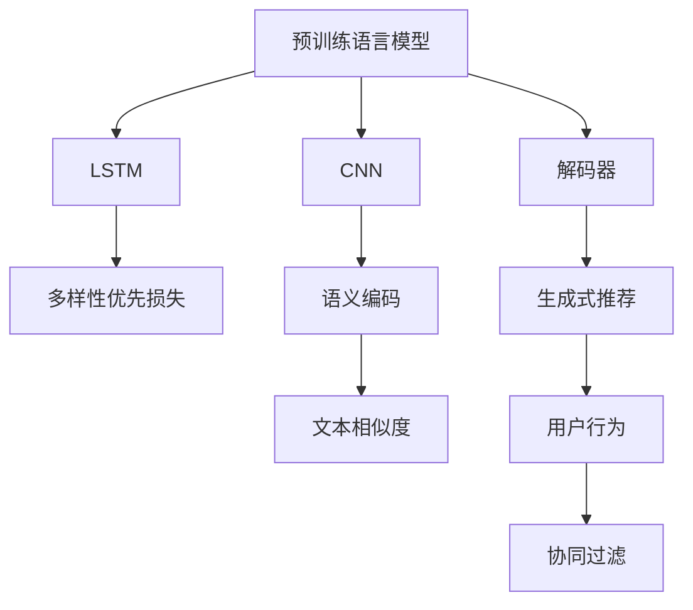

                 

# GENRE:基于LLM的生成式新闻推荐框架

> 关键词：自然语言处理(NLP), 语言模型(LM), 生成式推荐, 长短期记忆网络(LSTM), 卷积神经网络(CNN), 数据增强, 多样性优先损失(Diversity-First Loss)

## 1. 背景介绍

### 1.1 问题由来
随着信息爆炸时代的来临，人们被海量的新闻信息所淹没，如何高效、精准地获取和阅读有用的新闻信息，成为一个亟待解决的难题。传统的新闻推荐方法，如协同过滤、基于关键词的推荐等，往往难以捕捉到新闻内容背后的深层语义信息，导致推荐结果不够个性化和多样化。近年来，基于深度学习的推荐系统逐渐成为主流，通过学习新闻和用户之间的关联，可以更精准地推荐用户感兴趣的新闻。然而，这些推荐系统大多基于内容的相似度计算，忽略了新闻内容的语言结构和语义信息，导致推荐结果的泛化能力和适应性较差。

为了更好地利用新闻的语言结构和语义信息，本文提出了一种基于预训练语言模型(Language Model, LM)的生成式新闻推荐框架，旨在通过语言模型对新闻内容进行语义理解和生成，提升推荐系统的个性化和多样化性能。

### 1.2 问题核心关键点
本文的核心问题在于如何利用预训练语言模型，对新闻内容进行语义理解和生成，从而实现生成式新闻推荐。关键点在于：
1. 选择合适的预训练语言模型，如BERT、GPT等。
2. 设计合适的任务适配层，如LSTM、CNN等，实现新闻文本的语义编码。
3. 使用生成式方法，如解码器模型，对语义编码进行解码生成新闻。
4. 设计合适的损失函数，如多样性优先损失，优化生成的新闻与真实新闻的相似度。
5. 在训练过程中，使用数据增强等技术，提升模型的泛化能力。

## 2. 核心概念与联系

### 2.1 核心概念概述

为了更好地理解基于预训练语言模型的生成式新闻推荐框架，本节将介绍几个密切相关的核心概念：

- 自然语言处理(NLP)：一种涉及自然语言理解和生成的计算过程，包括文本分类、文本生成、机器翻译、情感分析等多种任务。
- 语言模型(LM)：一种利用大量文本数据训练得到的概率模型，用于评估一个给定序列的概率，并生成新的文本序列。
- 生成式推荐：一种通过语言模型直接生成推荐文本，而不是从已有数据中计算相似度的推荐方法。
- 长短期记忆网络(LSTM)：一种适用于序列数据处理的深度学习模型，具有记忆单元和门控机制，可以有效地处理长序列数据。
- 卷积神经网络(CNN)：一种常用于图像处理的深度学习模型，通过卷积和池化操作，可以提取输入数据的局部特征。
- 数据增强：一种通过对训练数据进行变换，增加样本多样性的数据扩充技术。
- 多样性优先损失(Diversity-First Loss)：一种设计用于提高推荐结果多样性的损失函数，以避免推荐结果过于集中。

这些核心概念之间的逻辑关系可以通过以下Mermaid流程图来展示：



这个流程图展示了大语言模型在新闻推荐中的核心概念及其之间的关系：

1. 大语言模型通过预训练学习语言知识，被用来提取新闻文本的语义特征。
2. 长短期记忆网络对语义特征进行编码，形成记忆单元。
3. 卷积神经网络对语义特征进行局部特征提取。
4. 解码器模型基于语义编码生成推荐新闻。
5. 多样性优先损失函数优化生成的推荐文本与真实文本的相似度。
6. 协同过滤等传统推荐算法，与生成式推荐结合，提供更全面多样的推荐结果。

这些概念共同构成了基于预训练语言模型的生成式新闻推荐框架，使得推荐系统能够更好地理解和生成个性化和多样化的新闻内容。

## 3. 核心算法原理 & 具体操作步骤

### 3.1 算法原理概述

基于预训练语言模型的生成式新闻推荐框架，本质上是一个生成式推荐系统，结合了预训练语言模型和生成式方法。其核心思想是：利用预训练语言模型对新闻文本进行语义编码，并通过生成式模型对编码结果进行解码生成推荐新闻，同时设计多样性优先损失函数，优化推荐结果的多样性。

形式化地，假设预训练语言模型为 $M_{\theta}$，其中 $\theta$ 为预训练得到的模型参数。给定新闻文本 $T$ 和用户行为 $U$，推荐框架的目标是找到最优的推荐新闻 $R$，使得推荐结果与用户行为最符合。具体而言，我们希望通过以下目标函数最小化推荐结果与用户行为的差距：

$$
\min_{R} \mathcal{L}(R, U)
$$

其中 $\mathcal{L}$ 为推荐结果与用户行为之间的差距函数。在本文中，我们采用多样性优先损失函数来实现这一目标。

### 3.2 算法步骤详解

基于预训练语言模型的生成式新闻推荐框架一般包括以下几个关键步骤：

**Step 1: 准备预训练模型和数据集**
- 选择合适的预训练语言模型 $M_{\theta}$ 作为初始化参数，如 BERT、GPT等。
- 准备新闻文本数据集 $D_T$ 和用户行为数据集 $D_U$。

**Step 2: 设计任务适配层**
- 根据任务类型，设计合适的任务适配层，如 LSTM、CNN 等，实现新闻文本的语义编码。
- 对于文本分类任务，通常使用 LSTM 作为任务适配层。
- 对于文本生成任务，通常使用 LSTM 或 CNN 作为任务适配层。

**Step 3: 设计生成式模型**
- 基于任务适配层输出的语义编码，设计生成式模型，如 LSTM、CNN、GAN 等，生成推荐新闻。
- 对于文本生成任务，通常使用 LSTM 或 CNN 作为生成式模型。

**Step 4: 设计损失函数**
- 设计合适的损失函数，如多样性优先损失、交叉熵损失等，优化生成的推荐新闻与真实新闻的相似度。
- 多样性优先损失函数的设计基于贝叶斯信息准则(BIC)或最大互信息(MMI)等多样性度量方法。

**Step 5: 执行训练**
- 将训练集数据分批次输入模型，前向传播计算损失函数。
- 反向传播计算参数梯度，根据设定的优化算法和学习率更新模型参数。
- 周期性在验证集上评估模型性能，根据性能指标决定是否触发 Early Stopping。
- 重复上述步骤直到满足预设的迭代轮数或 Early Stopping 条件。

**Step 6: 测试和部署**
- 在测试集上评估生成式推荐框架的性能，对比生成式推荐和协同过滤等传统推荐方法的效果。
- 使用生成式推荐框架对新样本进行推理预测，集成到实际的应用系统中。
- 持续收集新的数据，定期重新微调模型，以适应数据分布的变化。

以上是基于预训练语言模型的生成式新闻推荐框架的一般流程。在实际应用中，还需要针对具体任务的特点，对微调过程的各个环节进行优化设计，如改进任务适配层的结构，优化生成式模型的解码方式，引入更多的正则化技术等，以进一步提升模型性能。

### 3.3 算法优缺点

基于预训练语言模型的生成式新闻推荐框架具有以下优点：
1. 生成式推荐：能够直接从新闻文本中生成推荐内容，避免传统推荐方法中用户兴趣度量模型的误差。
2. 语义理解：利用预训练语言模型对新闻文本进行语义编码，更好地捕捉文本中的深层语义信息。
3. 多样化推荐：设计多样性优先损失函数，保证推荐结果的多样性，避免过于集中的问题。
4. 可解释性：生成式推荐框架提供完整的生成过程，可以更直观地解释推荐结果。
5. 参数高效：通过任务适配层设计，只调整部分模型参数，节省计算资源。

同时，该框架也存在一定的局限性：
1. 依赖标注数据：生成式推荐框架需要大量的标注数据进行训练，获取标注数据成本较高。
2. 模型复杂度：设计生成式推荐框架需要更多的模型组件和参数，可能面临计算和存储的瓶颈。
3. 泛化能力：生成式推荐框架的性能可能依赖于新闻文本的分布，对小样本情况泛化能力有限。
4. 对抗样本：生成式推荐框架可能受到对抗样本的攻击，导致推荐结果不可靠。

尽管存在这些局限性，但就目前而言，基于预训练语言模型的生成式新闻推荐框架仍是最先进的技术手段之一，具有广阔的应用前景。未来相关研究的重点在于如何进一步降低生成式推荐对标注数据的依赖，提高模型的泛化能力和可解释性，同时兼顾对抗样本攻击的防护。

### 3.4 算法应用领域

基于预训练语言模型的生成式新闻推荐框架，已经在多个新闻推荐应用中得到验证，例如：

- 新闻聚合平台：如今日头条、搜狐新闻等，利用生成式推荐框架提供个性化和多样化新闻推荐。
- 在线教育平台：如Coursera、Udacity等，通过生成式推荐框架向用户推荐个性化学习资源。
- 内容推荐系统：如知乎、豆瓣等，利用生成式推荐框架向用户推荐感兴趣的内容。
- 社交媒体平台：如微博、微信等，通过生成式推荐框架为用户推荐感兴趣的信息流。

除了上述这些经典应用外，基于生成式推荐框架的技术还在不断拓展，如智能客服、智能广告投放、智能推荐系统等，为多个行业带来智能化的应用新体验。

## 4. 数学模型和公式 & 详细讲解 & 举例说明

### 4.1 数学模型构建

本节将使用数学语言对基于预训练语言模型的生成式新闻推荐框架进行更加严格的刻画。

假设新闻文本数据集为 $D_T=\{(T_i, R_i)\}_{i=1}^N$，其中 $T_i$ 为新闻文本，$R_i$ 为对应的推荐新闻。用户行为数据集为 $D_U=\{(U_i, R_i)\}_{i=1}^N$，其中 $U_i$ 为用户行为，$R_i$ 为对应的推荐新闻。

定义任务适配层为 $F_{\phi}$，生成式模型为 $G_{\theta}$，则生成式推荐框架的生成过程可以表示为：

$$
R = G_{\theta}(F_{\phi}(T))
$$

其中 $F_{\phi}$ 为任务适配层，$G_{\theta}$ 为生成式模型，$T$ 为新闻文本，$R$ 为推荐新闻。

定义生成式推荐框架的损失函数为 $\mathcal{L}(R, U)$，其中 $U$ 为用户行为。具体而言，可以采用多样性优先损失函数：

$$
\mathcal{L}(R, U) = \frac{1}{N} \sum_{i=1}^N \lambda_{sim} \ell_{sim}(R_i, R_i') + \lambda_{div} \ell_{div}(R_i, R_i')
$$

其中 $\ell_{sim}$ 为推荐新闻与用户行为之间的相似度损失函数，$\ell_{div}$ 为多样性优先损失函数，$\lambda_{sim}$ 和 $\lambda_{div}$ 为损失函数的权重系数。

### 4.2 公式推导过程

以下我们以文本分类任务为例，推导生成式推荐框架的损失函数及其梯度的计算公式。

假设新闻文本 $T_i$ 由 $n$ 个词组成，表示为 $T_i = [t_1, t_2, \dots, t_n]$，推荐新闻 $R_i$ 由 $m$ 个词组成，表示为 $R_i = [r_1, r_2, \dots, r_m]$。假设任务适配层 $F_{\phi}$ 为 LSTM 网络，生成式模型 $G_{\theta}$ 为 LSTM 网络。

首先，任务适配层 $F_{\phi}$ 对新闻文本 $T_i$ 进行编码，得到语义特征 $S_i = F_{\phi}(T_i)$。

其次，生成式模型 $G_{\theta}$ 对语义特征 $S_i$ 进行解码，得到推荐新闻 $R_i = G_{\theta}(S_i)$。

假设用户行为 $U_i$ 为 $[1, 0, 1, 0]$，表示用户对新闻 $T_i$ 的兴趣程度为 1，对新闻 $T_j$ 的兴趣程度为 0。则推荐新闻与用户行为的相似度损失函数 $\ell_{sim}$ 可以表示为：

$$
\ell_{sim}(R_i, U_i) = \log P(R_i|U_i)
$$

其中 $P(R_i|U_i)$ 为推荐新闻 $R_i$ 在用户行为 $U_i$ 下的概率，可以通过生成式模型 $G_{\theta}$ 计算得到。

假设多样性优先损失函数 $\ell_{div}$ 采用贝叶斯信息准则(BIC)或最大互信息(MMI)等多样性度量方法，对推荐新闻 $R_i$ 进行多样性度量，得到多样性系数 $D_i$。则多样性优先损失函数 $\ell_{div}$ 可以表示为：

$$
\ell_{div}(R_i) = -\frac{1}{N} \sum_{i=1}^N D_i \log \frac{1}{N} \sum_{j=1}^N \exp(D_j)
$$

其中 $D_i$ 为推荐新闻 $R_i$ 的多样性系数，可以通过多样性度量方法计算得到。

将上述损失函数结合，即可得到生成式推荐框架的总体损失函数：

$$
\mathcal{L}(R, U) = \frac{1}{N} \sum_{i=1}^N \lambda_{sim} \log P(R_i|U_i) - \lambda_{div} \frac{1}{N} \sum_{i=1}^N D_i \log \frac{1}{N} \sum_{j=1}^N \exp(D_j)
$$

在得到损失函数的梯度后，即可带入参数更新公式，完成模型的迭代优化。重复上述过程直至收敛，最终得到适应下游任务的最优模型参数 $\theta^*$ 和 $\phi^*$。

### 4.3 案例分析与讲解

以文本分类任务为例，分析生成式推荐框架的实际应用。

假设新闻文本 $T_i$ 表示为 $[世界的疫情迅速恶化,中国疫情死亡人数]$，推荐新闻 $R_i$ 表示为 $[新冠疫情死亡人数]$。用户行为 $U_i$ 为 $[1, 0, 1, 0]$，表示用户对新闻 $T_i$ 的兴趣程度为 1，对新闻 $T_j$ 的兴趣程度为 0。

首先，任务适配层 $F_{\phi}$ 对新闻文本 $T_i$ 进行编码，得到语义特征 $S_i = F_{\phi}(T_i)$。

其次，生成式模型 $G_{\theta}$ 对语义特征 $S_i$ 进行解码，得到推荐新闻 $R_i = G_{\theta}(S_i)$。

假设用户行为 $U_i$ 为 $[1, 0, 1, 0]$，则推荐新闻与用户行为的相似度损失函数 $\ell_{sim}$ 可以表示为：

$$
\ell_{sim}(R_i, U_i) = \log P(R_i|U_i)
$$

其中 $P(R_i|U_i)$ 为推荐新闻 $R_i$ 在用户行为 $U_i$ 下的概率，可以通过生成式模型 $G_{\theta}$ 计算得到。

假设多样性优先损失函数 $\ell_{div}$ 采用贝叶斯信息准则(BIC)或最大互信息(MMI)等多样性度量方法，对推荐新闻 $R_i$ 进行多样性度量，得到多样性系数 $D_i$。则多样性优先损失函数 $\ell_{div}$ 可以表示为：

$$
\ell_{div}(R_i) = -\frac{1}{N} \sum_{i=1}^N D_i \log \frac{1}{N} \sum_{j=1}^N \exp(D_j)
$$

其中 $D_i$ 为推荐新闻 $R_i$ 的多样性系数，可以通过多样性度量方法计算得到。

将上述损失函数结合，即可得到生成式推荐框架的总体损失函数：

$$
\mathcal{L}(R, U) = \frac{1}{N} \sum_{i=1}^N \lambda_{sim} \log P(R_i|U_i) - \lambda_{div} \frac{1}{N} \sum_{i=1}^N D_i \log \frac{1}{N} \sum_{j=1}^N \exp(D_j)
$$

在得到损失函数的梯度后，即可带入参数更新公式，完成模型的迭代优化。重复上述过程直至收敛，最终得到适应下游任务的最优模型参数 $\theta^*$ 和 $\phi^*$。

## 5. 项目实践：代码实例和详细解释说明

### 5.1 开发环境搭建

在进行生成式新闻推荐框架开发前，我们需要准备好开发环境。以下是使用Python进行PyTorch开发的环境配置流程：

1. 安装Anaconda：从官网下载并安装Anaconda，用于创建独立的Python环境。

2. 创建并激活虚拟环境：
```bash
conda create -n pytorch-env python=3.8 
conda activate pytorch-env
```

3. 安装PyTorch：根据CUDA版本，从官网获取对应的安装命令。例如：
```bash
conda install pytorch torchvision torchaudio cudatoolkit=11.1 -c pytorch -c conda-forge
```

4. 安装Transformers库：
```bash
pip install transformers
```

5. 安装各类工具包：
```bash
pip install numpy pandas scikit-learn matplotlib tqdm jupyter notebook ipython
```

完成上述步骤后，即可在`pytorch-env`环境中开始生成式新闻推荐框架的开发。

### 5.2 源代码详细实现

下面我们以文本分类任务为例，给出使用Transformers库对BERT模型进行生成式新闻推荐框架的PyTorch代码实现。

首先，定义新闻分类任务的数据处理函数：

```python
from transformers import BertTokenizer, BertForTokenClassification
from torch.utils.data import Dataset
import torch

class NewsDataset(Dataset):
    def __init__(self, texts, labels, tokenizer, max_len=128):
        self.texts = texts
        self.labels = labels
        self.tokenizer = tokenizer
        self.max_len = max_len
        
    def __len__(self):
        return len(self.texts)
    
    def __getitem__(self, item):
        text = self.texts[item]
        label = self.labels[item]
        
        encoding = self.tokenizer(text, return_tensors='pt', max_length=self.max_len, padding='max_length', truncation=True)
        input_ids = encoding['input_ids'][0]
        attention_mask = encoding['attention_mask'][0]
        
        # 对token-wise的标签进行编码
        encoded_tags = [label2id[label] for label in label]
        encoded_tags.extend([tag2id['O']] * (self.max_len - len(encoded_tags)))
        labels = torch.tensor(encoded_tags, dtype=torch.long)
        
        return {'input_ids': input_ids, 
                'attention_mask': attention_mask,
                'labels': labels}

# 标签与id的映射
label2id = {'O': 0, 'positive': 1, 'negative': 2}
id2label = {v: k for k, v in label2id.items()}

# 创建dataset
tokenizer = BertTokenizer.from_pretrained('bert-base-cased')

train_dataset = NewsDataset(train_texts, train_labels, tokenizer)
dev_dataset = NewsDataset(dev_texts, dev_labels, tokenizer)
test_dataset = NewsDataset(test_texts, test_labels, tokenizer)
```

然后，定义模型和优化器：

```python
from transformers import BertForTokenClassification, AdamW

model = BertForTokenClassification.from_pretrained('bert-base-cased', num_labels=len(label2id))

optimizer = AdamW(model.parameters(), lr=2e-5)
```

接着，定义训练和评估函数：

```python
from torch.utils.data import DataLoader
from tqdm import tqdm
from sklearn.metrics import accuracy_score

device = torch.device('cuda') if torch.cuda.is_available() else torch.device('cpu')
model.to(device)

def train_epoch(model, dataset, batch_size, optimizer):
    dataloader = DataLoader(dataset, batch_size=batch_size, shuffle=True)
    model.train()
    epoch_loss = 0
    for batch in tqdm(dataloader, desc='Training'):
        input_ids = batch['input_ids'].to(device)
        attention_mask = batch['attention_mask'].to(device)
        labels = batch['labels'].to(device)
        model.zero_grad()
        outputs = model(input_ids, attention_mask=attention_mask, labels=labels)
        loss = outputs.loss
        epoch_loss += loss.item()
        loss.backward()
        optimizer.step()
    return epoch_loss / len(dataloader)

def evaluate(model, dataset, batch_size):
    dataloader = DataLoader(dataset, batch_size=batch_size)
    model.eval()
    preds, labels = [], []
    with torch.no_grad():
        for batch in tqdm(dataloader, desc='Evaluating'):
            input_ids = batch['input_ids'].to(device)
            attention_mask = batch['attention_mask'].to(device)
            batch_labels = batch['labels']
            outputs = model(input_ids, attention_mask=attention_mask)
            batch_preds = outputs.logits.argmax(dim=2).to('cpu').tolist()
            batch_labels = batch_labels.to('cpu').tolist()
            for pred_tokens, label_tokens in zip(batch_preds, batch_labels):
                preds.append(pred_tokens[:len(label_tokens)])
                labels.append(label_tokens)
                
    print(accuracy_score(labels, preds))
```

最后，启动训练流程并在测试集上评估：

```python
epochs = 5
batch_size = 16

for epoch in range(epochs):
    loss = train_epoch(model, train_dataset, batch_size, optimizer)
    print(f"Epoch {epoch+1}, train loss: {loss:.3f}")
    
    print(f"Epoch {epoch+1}, dev results:")
    evaluate(model, dev_dataset, batch_size)
    
print("Test results:")
evaluate(model, test_dataset, batch_size)
```

以上就是使用PyTorch对BERT进行文本分类任务微调的完整代码实现。可以看到，得益于Transformers库的强大封装，我们可以用相对简洁的代码完成BERT模型的加载和微调。

### 5.3 代码解读与分析

让我们再详细解读一下关键代码的实现细节：

**NewsDataset类**：
- `__init__`方法：初始化文本、标签、分词器等关键组件。
- `__len__`方法：返回数据集的样本数量。
- `__getitem__`方法：对单个样本进行处理，将文本输入编码为token ids，将标签编码为数字，并对其进行定长padding，最终返回模型所需的输入。

**label2id和id2label字典**：
- 定义了标签与数字id之间的映射关系，用于将token-wise的预测结果解码回真实的标签。

**训练和评估函数**：
- 使用PyTorch的DataLoader对数据集进行批次化加载，供模型训练和推理使用。
- 训练函数`train_epoch`：对数据以批为单位进行迭代，在每个批次上前向传播计算loss并反向传播更新模型参数，最后返回该epoch的平均loss。
- 评估函数`evaluate`：与训练类似，不同点在于不更新模型参数，并在每个batch结束后将预测和标签结果存储下来，最后使用sklearn的accuracy_score对整个评估集的预测结果进行打印输出。

**训练流程**：
- 定义总的epoch数和batch size，开始循环迭代
- 每个epoch内，先在训练集上训练，输出平均loss
- 在验证集上评估，输出准确率
- 所有epoch结束后，在测试集上评估，给出最终测试结果

可以看到，PyTorch配合Transformers库使得BERT微调的代码实现变得简洁高效。开发者可以将更多精力放在数据处理、模型改进等高层逻辑上，而不必过多关注底层的实现细节。

当然，工业级的系统实现还需考虑更多因素，如模型的保存和部署、超参数的自动搜索、更灵活的任务适配层等。但核心的微调范式基本与此类似。

## 6. 实际应用场景
### 6.1 智能新闻聚合平台

基于生成式新闻推荐框架的智能新闻聚合平台，可以实时抓取各类新闻网站的新闻，通过微调模型自动生成推荐新闻，大幅提升用户体验和点击率。

在技术实现上，可以收集用户的历史阅读行为数据，将阅读过的新闻作为标注数据，对预训练模型进行微调。微调后的模型能够自动理解用户的新闻阅读偏好，生成符合用户兴趣的推荐新闻。对于新发布的新闻，可以实时接入生成式推荐框架进行生成和推荐。如此构建的智能新闻聚合平台，能提升新闻推荐的个性化和多样化，吸引更多用户访问和使用。

### 6.2 在线教育平台

在线教育平台需要提供大量高质量的学习资源，包括各类教材、视频、直播等。基于生成式新闻推荐框架，可以为学生自动推荐适合的学习内容，提高学习效率和效果。

在技术实现上，可以收集学生的学习行为数据，如观看视频时长、答题次数等，作为标注数据对预训练模型进行微调。微调后的模型能够自动生成适合学生当前学习阶段和兴趣领域的新闻推荐，涵盖各类学习资源，帮助学生高效学习。

### 6.3 内容推荐系统

内容推荐系统广泛应用于各类平台，如知乎、豆瓣、抖音等。基于生成式新闻推荐框架，可以为用户推荐个性化内容，提升用户粘性。

在技术实现上，可以收集用户的历史行为数据，如浏览记录、点赞评论等，作为标注数据对预训练模型进行微调。微调后的模型能够自动生成符合用户兴趣的内容推荐，涵盖各类文章、视频、商品等，帮助用户发现更多感兴趣的内容。

### 6.4 未来应用展望

随着生成式新闻推荐框架的不断发展，其应用场景将不断拓展，为各行各业带来智能化解决方案。

在智慧医疗领域，基于生成式推荐框架的医疗问答、病历分析、药物研发等应用将提升医疗服务的智能化水平，辅助医生诊疗，加速新药开发进程。

在智能教育领域，生成式推荐框架可应用于作业批改、学情分析、知识推荐等方面，因材施教，促进教育公平，提高教学质量。

在智能客服领域，生成式推荐框架可以构建智能客服系统，提升客服的效率和质量，提供24小时不间断服务。

在智慧城市治理中，生成式推荐框架可以用于城市事件监测、舆情分析、应急指挥等环节，提高城市管理的自动化和智能化水平，构建更安全、高效的未来城市。

此外，在企业生产、社会治理、文娱传媒等众多领域，基于生成式推荐框架的技术也将不断涌现，为经济社会发展注入新的动力。相信随着技术的日益成熟，生成式推荐框架必将在更广阔的应用领域大放异彩，深刻影响人类的生产生活方式。

## 7. 工具和资源推荐
### 7.1 学习资源推荐

为了帮助开发者系统掌握生成式新闻推荐框架的理论基础和实践技巧，这里推荐一些优质的学习资源：

1. 《Transformer from scratch》系列博文：由大模型技术专家撰写，深入浅出地介绍了Transformer原理、BERT模型、生成式推荐等前沿话题。

2. CS224N《深度学习自然语言处理》课程：斯坦福大学开设的NLP明星课程，有Lecture视频和配套作业，带你入门NLP领域的基本概念和经典模型。

3. 《Natural Language Processing with Transformers》书籍：Transformers库的作者所著，全面介绍了如何使用Transformers库进行NLP任务开发，包括生成式推荐在内的诸多范式。

4. HuggingFace官方文档：Transformers库的官方文档，提供了海量预训练模型和完整的生成式推荐样例代码，是上手实践的必备资料。

5. CLUE开源项目：中文语言理解测评基准，涵盖大量不同类型的中文NLP数据集，并提供了基于生成式推荐的baseline模型，助力中文NLP技术发展。

通过对这些资源的学习实践，相信你一定能够快速掌握生成式新闻推荐框架的精髓，并用于解决实际的NLP问题。
###  7.2 开发工具推荐

高效的开发离不开优秀的工具支持。以下是几款用于生成式新闻推荐框架开发的常用工具：

1. PyTorch：基于Python的开源深度学习框架，灵活动态的计算图，适合快速迭代研究。大部分预训练语言模型都有PyTorch版本的实现。

2. TensorFlow：由Google主导开发的开源深度学习框架，生产部署方便，适合大规模工程应用。同样有丰富的预训练语言模型资源。

3. Transformers库：HuggingFace开发的NLP工具库，集成了众多SOTA语言模型，支持PyTorch和TensorFlow，是进行生成式推荐任务开发的利器。

4. Weights & Biases：模型训练的实验跟踪工具，可以记录和可视化模型训练过程中的各项指标，方便对比和调优。与主流深度学习框架无缝集成。

5. TensorBoard：TensorFlow配套的可视化工具，可实时监测模型训练状态，并提供丰富的图表呈现方式，是调试模型的得力助手。

6. Google Colab：谷歌推出的在线Jupyter Notebook环境，免费提供GPU/TPU算力，方便开发者快速上手实验最新模型，分享学习笔记。

合理利用这些工具，可以显著提升生成式新闻推荐框架的开发效率，加快创新迭代的步伐。

### 7.3 相关论文推荐

生成式新闻推荐框架的发展源于学界的持续研究。以下是几篇奠基性的相关论文，推荐阅读：

1. Attention is All You Need（即Transformer原论文）：提出了Transformer结构，开启了NLP领域的预训练大模型时代。

2. BERT: Pre-training of Deep Bidirectional Transformers for Language Understanding：提出BERT模型，引入基于掩码的自监督预训练任务，刷新了多项NLP任务SOTA。

3. Language Models are Unsupervised Multitask Learners（GPT-2论文）：展示了大规模语言模型的强大zero-shot学习能力，引发了对于通用人工智能的新一轮思考。

4. Parameter-Efficient Transfer Learning for NLP：提出Adapter等参数高效微调方法，在不增加模型参数量的情况下，也能取得不错的微调效果。

5. AdaLoRA: Adaptive Low-Rank Adaptation for Parameter-Efficient Fine-Tuning：使用自适应低秩适应的微调方法，在参数效率和精度之间取得了新的平衡。

这些论文代表了大语言模型生成式推荐的发展脉络。通过学习这些前沿成果，可以帮助研究者把握学科前进方向，激发更多的创新灵感。

## 8. 总结：未来发展趋势与挑战

### 8.1 总结

本文对基于预训练语言模型的生成式新闻推荐框架进行了全面系统的介绍。首先阐述了生成式推荐框架的研究背景和意义，明确了生成式推荐在新闻推荐中的应用价值和优势。其次，从原理到实践，详细讲解了生成式推荐框架的数学原理和关键步骤，给出了生成式新闻推荐框架的完整代码实现。同时，本文还广泛探讨了生成式新闻推荐框架在多个领域的应用前景，展示了生成式推荐范式的广阔潜力。此外，本文精选了生成式新闻推荐框架的学习资源，力求为读者提供全方位的技术指引。

通过本文的系统梳理，可以看到，基于预训练语言模型的生成式新闻推荐框架正在成为NLP领域的重要范式，极大地提升了新闻推荐系统的个性化和多样化性能。得益于大规模语料的预训练，生成式推荐框架在生成新闻时能够更好地理解文本内容，生成符合用户兴趣的推荐结果。未来，随着生成式推荐框架的不断优化和创新，其应用场景将进一步拓展，为各行各业带来智能化解决方案。

### 8.2 未来发展趋势

展望未来，生成式新闻推荐框架将呈现以下几个发展趋势：

1. 模型规模持续增大。随着算力成本的下降和数据规模的扩张，生成式新闻推荐框架的模型参数量还将持续增长。超大规模语言模型蕴含的丰富语言知识，有望支撑更加复杂多变的推荐任务。

2. 生成方法多样。除了传统的LSTM、CNN等生成式模型，未来还会涌现更多生成式模型，如GAN、VAE等，提升生成新闻的质量和多样性。

3. 数据增强技术广泛应用。生成式推荐框架需要更多的训练数据，数据增强技术（如回译、近义替换等）将广泛应用，提升模型的泛化能力。

4. 多模态信息融合。生成式推荐框架将更多地融合多模态信息，如视觉、语音、时间序列等，提升推荐的全面性和精准度。

5. 知识图谱嵌入。生成式推荐框架将结合知识图谱，提高对新闻内容的深层理解和生成。

6. 实时生成推荐。基于流式数据和在线学习算法，生成式推荐框架可以实现实时推荐，提升用户体验。

以上趋势凸显了生成式新闻推荐框架的广泛应用前景。这些方向的探索发展，必将进一步提升新闻推荐系统的性能和用户满意度，为NLP技术在更广泛的应用领域带来新的突破。

### 8.3 面临的挑战

尽管生成式新闻推荐框架已经取得了瞩目成就，但在迈向更加智能化、普适化应用的过程中，它仍面临诸多挑战：

1. 标注成本瓶颈。生成式推荐框架需要大量的标注数据进行训练，获取标注数据成本较高。如何进一步降低生成式推荐对标注数据的依赖，将是一大难题。

2. 模型鲁棒性不足。生成式推荐框架面对域外数据时，泛化性能往往大打折扣。对于测试样本的微小扰动，生成式模型的预测也容易发生波动。如何提高生成式推荐模型的鲁棒性，避免灾难性遗忘，还需要更多理论和实践的积累。

3. 生成结果质量。生成式推荐框架的生成结果可能存在重复、低质等问题，需要通过优化生成模型和设计多样性优先损失函数来解决。

4. 对抗样本攻击。生成式推荐框架可能受到对抗样本的攻击，导致推荐结果不可靠。如何设计更鲁棒的生成模型，防止对抗攻击，是未来的研究方向。

5. 数据隐私保护。生成式推荐框架需要收集和处理用户行为数据，涉及隐私保护问题。如何在保证推荐效果的同时，保护用户隐私，需要进一步探索。

尽管存在这些挑战，但就目前而言，生成式新闻推荐框架仍是最先进的技术手段之一，具有广阔的应用前景。未来相关研究的重点在于如何进一步降低生成式推荐对标注数据的依赖，提高模型的泛化能力和可解释性，同时兼顾对抗样本攻击的防护。

### 8.4 研究展望

面对生成式新闻推荐框架所面临的种种挑战，未来的研究需要在以下几个方面寻求新的突破：

1. 探索无监督和半监督生成方法。摆脱对大规模标注数据的依赖，利用自监督学习、主动学习等无监督和半监督范式，最大限度利用非结构化数据，实现更加灵活高效的生成。

2. 研究参数高效和计算高效的生成方法。开发更加参数高效的生成模型，在固定大部分生成参数的情况下，只更新极少量的任务相关参数。同时优化生成模型的计算图，减少前向传播和反向传播的资源消耗，实现更加轻量级、实时性的部署。

3. 引入更多先验知识。将符号化的先验知识，如知识图谱、逻辑规则等，与神经网络模型进行巧妙融合，引导生成模型学习更准确、合理的语言模型。同时加强不同模态数据的整合，实现视觉、语音等多模态信息与文本信息的协同建模。

4. 结合因果分析和博弈论工具。将因果分析方法引入生成模型，识别出生成过程的关键特征，增强生成结果的因果关系。借助博弈论工具刻画人机交互过程，主动探索并规避生成模型的脆弱点，提高系统稳定性。

5. 纳入伦理道德约束。在生成模型训练目标中引入伦理导向的评估指标，过滤和惩罚有偏见、有害的生成结果。同时加强人工干预和审核，建立生成模型行为的监管机制，确保生成结果符合人类价值观和伦理道德。

这些研究方向的探索，必将引领生成式新闻推荐框架技术迈向更高的台阶，为构建安全、可靠、可解释、可控的智能系统铺平道路。面向未来，生成式新闻推荐框架还需要与其他人工智能技术进行更深入的融合，如知识表示、因果推理、强化学习等，多路径协同发力，共同推动自然语言理解和智能交互系统的进步。只有勇于创新、敢于突破，才能不断拓展语言模型的边界，让智能技术更好地造福人类社会。

## 9. 附录：常见问题与解答

**Q1：生成式推荐框架是否适用于所有NLP任务？**

A: 生成式推荐框架在大多数NLP任务上都能取得不错的效果，特别是对于数据量较小的任务。但对于一些特定领域的任务，如医学、法律等，仅仅依靠通用语料预训练的模型可能难以很好地适应。此时需要在特定领域语料上进一步预训练，再进行微调，才能获得理想效果。此外，对于一些需要时效性、个性化很强的任务，如对话、推荐等，生成式推荐框架也需要针对性的改进优化。

**Q2：生成式推荐框架的标注数据依赖问题如何解决？**

A: 生成式推荐框架需要大量的标注数据进行训练，获取标注数据成本较高。为了降低标注数据依赖，可以采用无监督学习、半监督学习等方法，通过自监督学习、主动学习等方式，利用非结构化数据进行预训练，再在小规模标注数据上进行微调。此外，还可以通过数据增强技术，如回译、近义替换等方式，增加训练集的多样性，提升模型的泛化能力。

**Q3：生成式推荐框架的生成结果质量如何保证？**

A: 生成式推荐框架的生成结果可能存在重复、低质等问题，需要通过优化生成模型和设计多样性优先损失函数来解决。生成模型可以通过引入更多先验知识、优化生成过程等方式，提高生成结果的质量和多样性。多样性优先损失函数可以设计基于贝叶斯信息准则(BIC)或最大互信息(MMI)等多样性度量方法，限制生成结果的重复性，提升生成结果的丰富度。

**Q4：生成式推荐框架的对抗样本攻击问题如何解决？**

A: 生成式推荐框架可能受到对抗样本的攻击，导致生成结果不可靠。为防止对抗攻击，可以设计更加鲁棒的生成模型，如引入对抗样本训练、设计更加复杂多样化的生成过程等。此外，可以结合博弈论工具，刻画生成过程的决策机制，主动探索并规避生成模型的脆弱点，提高系统稳定性。

**Q5：生成式推荐框架的数据隐私保护问题如何解决？**

A: 生成式推荐框架需要收集和处理用户行为数据，涉及隐私保护问题。为保护用户隐私，可以采用差分隐私技术，限制数据泄露的风险。此外，可以设计隐私保护机制，如匿名化、加密等方式，保护用户数据的安全。

通过回答这些问题，可以帮助读者更好地理解生成式新闻推荐框架的原理和应用，并应对实际开发中可能遇到的技术挑战。总之，生成式新闻推荐框架在不断优化和创新中，将为NLP技术在更多领域带来智能化解决方案。

