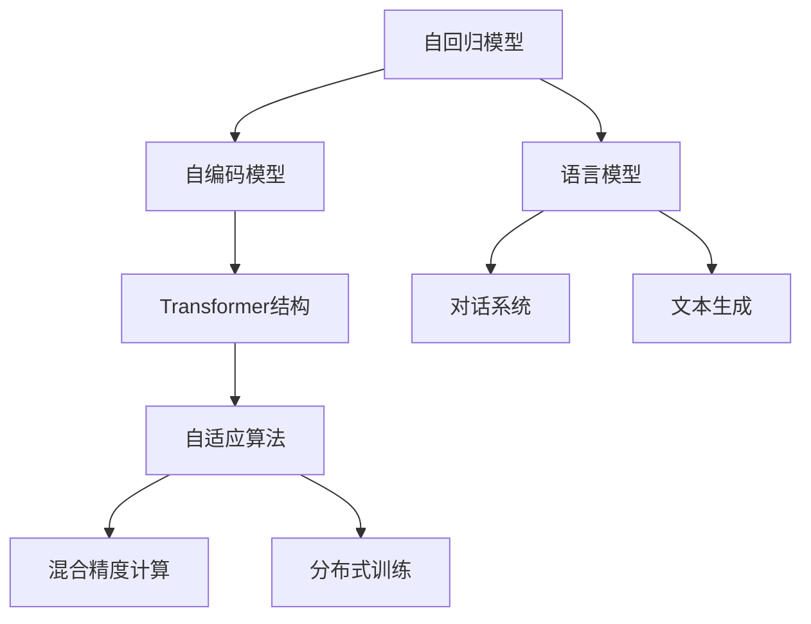

                 

# GPT模型家族：架构演进与性能提升

> 关键词：GPT-2, GPT-3, GPT-4, Transformer, 自回归模型, 自编码模型, 自适应算法, 混合精度计算, 分布式训练, 语言模型, 对话系统, 文本生成

## 1. 背景介绍

### 1.1 问题由来
自2018年OpenAI发布了GPT-2以来，基于Transformer架构的预训练语言模型迅速成为自然语言处理(NLP)领域的核心技术。这些大模型通过自监督学习和海量数据预训练，学习到丰富的语言知识和表示能力，能够在各种NLP任务上实现零样本学习和少样本学习。

GPT模型家族包括GPT-1、GPT-2、GPT-3、GPT-4等系列，它们在参数量、训练数据、应用场景等方面不断突破，逐步提升了模型性能和可解释性。本文将系统性地介绍GPT模型家族的关键发展，分析其架构演进和性能提升的动因，为未来的大语言模型研究和应用提供参考。

### 1.2 问题核心关键点
GPT模型家族的核心在于其架构的演进和性能的持续优化。这些演进包括但不限于：
- 参数量的增加：从GPT-1到GPT-4，模型参数量依次增加，达到数十亿量级。
- 训练数据的多样化：从单一语料到多源混合数据，提升模型泛化能力。
- 应用场景的扩展：从文本生成到多模态交互，拓宽了语言模型的应用边界。
- 自适应算法的引入：如自适应学习率、混合精度训练等，提升模型训练效率和性能。
- 硬件和分布式训练的优化：如GPU加速、TPU分布式训练，支持更大规模模型的训练。

这些演进驱动GPT模型家族在性能和应用能力上不断提升，逐步成为引领NLP技术发展的标杆。

### 1.3 问题研究意义
研究GPT模型家族的架构演进和性能提升，对于理解大语言模型的核心技术、提升模型应用性能、推动NLP技术的发展具有重要意义：

1. 深入理解大语言模型的核心技术。GPT模型家族的演进展示了Transformer架构的强大表现和自适应算法的有效性，对研究大语言模型的原理和应用有重要的参考价值。
2. 提升模型应用性能。通过分析模型演进的动因和效果，开发者可以更有效地优化模型参数和训练流程，提升模型的实际应用性能。
3. 推动NLP技术发展。GPT模型家族的成功应用，带动了NLP技术在各个行业领域的广泛应用，促进了NLP技术的产业化进程。
4. 赋能行业转型。大语言模型的发展和应用，为各行各业提供了智能化转型的新工具，推动了产业数字化和智能化转型升级。

## 2. 核心概念与联系

### 2.1 核心概念概述

为更好地理解GPT模型家族的演进和性能提升，本节将介绍几个密切相关的核心概念：

- **自回归模型(Autoregressive Model)**：指模型预测下一个时间步的输出，依赖于前一个时间步的输出。GPT系列模型即采用自回归模型进行文本生成。
- **自编码模型(Autoencoder Model)**：指模型通过编码器将输入压缩成低维向量，再通过解码器重构输入，用于学习输入与输出之间的映射关系。
- **Transformer结构(Transformer Architecture)**：一种基于注意力机制的神经网络结构，在NLP任务中广泛使用，具有高效的并行计算能力和强大的语言表示能力。
- **自适应算法(Adaptive Algorithm)**：指模型在训练过程中动态调整算法参数，如自适应学习率、混合精度计算等，以提升模型性能和训练效率。
- **混合精度计算(Mixed Precision Computing)**：指同时使用16位和32位精度进行计算，以提升计算速度和内存效率。
- **分布式训练(Distributed Training)**：指将模型参数分布在多台计算设备上，同时进行训练，以加速模型训练。
- **语言模型(Language Model)**：指能够预测文本序列中下一个单词或字符的概率分布的模型，用于文本生成、自动摘要、机器翻译等任务。
- **对话系统(Chatbot)**：指能够理解和回复人类自然语言输入的系统，用于客户服务、智能助理等场景。
- **文本生成(Text Generation)**：指模型自动生成连贯、流畅、合法的文本，用于内容创作、机器翻译等任务。

这些核心概念之间的逻辑关系可以通过以下Mermaid流程图来展示：



这个流程图展示了大语言模型演进的几个关键环节，从自回归模型到Transformer结构，再到自适应算法和混合精度计算，最终应用于对话系统和文本生成等任务。

## 3. 核心算法原理 & 具体操作步骤
### 3.1 算法原理概述

GPT模型家族的核心算法原理包括以下几个关键点：

- **自回归生成(Training)**：模型通过自回归方式对大量文本数据进行预训练，学习到语言表示和生成规则。训练过程中，模型先对输入进行编码，然后通过自回归方式预测下一个时间步的输出，并更新权重以最小化预测误差。

- **Transformer结构(Attention)**：模型采用Transformer结构，通过多头自注意力机制，对输入进行编码，捕捉语言中的长程依赖和局部特征。这种结构使得模型能够在较长的文本序列上保持较高的准确性和效率。

- **自适应算法(Adaptive Learning)**：模型在微调或在线更新过程中，采用自适应学习率、混合精度计算等方法，动态调整算法参数，提升模型训练速度和精度。

### 3.2 算法步骤详解

GPT模型家族的具体微调和训练步骤如下：

**Step 1: 准备数据和环境**
- 准备大规模无标签文本数据，如维基百科、新闻文章、社交媒体等。
- 选择合适的GPU、TPU等硬件设备，安装深度学习框架如PyTorch、TensorFlow等。

**Step 2: 模型初始化**
- 定义Transformer模型的架构，包括编码器、解码器和自注意力机制。
- 初始化模型参数，如权重矩阵、偏置等。

**Step 3: 自回归训练**
- 对数据进行预处理，如分词、截断、填充等，转换为模型能够处理的序列形式。
- 对输入进行编码，生成中间向量表示。
- 通过自回归方式，预测下一个时间步的输出，并计算损失函数。
- 使用优化器更新模型参数，最小化预测误差。

**Step 4: 自适应微调**
- 收集少量有标签数据，定义微调任务，如文本分类、情感分析、对话生成等。
- 在微调过程中，使用自适应学习率、混合精度计算等技术，加速模型训练。
- 周期性在验证集上评估模型性能，根据性能指标决定是否触发Early Stopping。

**Step 5: 部署和应用**
- 将微调后的模型保存为模型文件，部署到生产环境。
- 将模型集成到应用系统中，如智能客服、翻译系统、内容生成器等。
- 持续收集用户反馈和数据，定期重新微调模型，以适应数据分布的变化。

### 3.3 算法优缺点

GPT模型家族具有以下优点：
1. 强大的语言表示能力：Transformer结构和自注意力机制使得模型能够捕捉语言中的长程依赖和局部特征，具有强大的语言表示能力。
2. 高效的训练算法：自适应算法和混合精度计算等技术，提升了模型训练速度和精度。
3. 广泛的应用场景：广泛应用于文本生成、对话系统、机器翻译等任务，推动了NLP技术的产业化进程。
4. 灵活的架构设计：模型架构可以根据任务需求进行灵活调整，适应不同规模和复杂度的任务。

同时，这些模型也存在以下局限性：
1. 依赖大规模数据：自回归训练和微调需要大量高质量的标注数据，获取成本较高。
2. 模型规模庞大：随着参数量的增加，模型的存储和训练成本显著上升，硬件需求也随之增加。
3. 推理开销大：由于模型的复杂性和深度，推理过程占用大量计算资源，推理速度较慢。
4. 可解释性不足：模型内部的决策过程较为复杂，难以解释其推理逻辑和输出结果。
5. 偏见和有害内容：模型可能会学习到预训练数据中的偏见和有害内容，导致输出结果存在偏差。

尽管存在这些局限性，但GPT模型家族在大规模语言处理和应用方面的卓越表现，已经证明了其强大的潜力和广泛的应用前景。未来，随着算力和数据获取能力的提升，这些问题有望得到进一步解决。

### 3.4 算法应用领域

GPT模型家族在多个NLP任务上得到了广泛应用，包括但不限于：

- **文本生成**：如自动摘要、文本翻译、机器生成等，用于内容创作、信息检索等场景。
- **对话系统**：如智能客服、虚拟助理等，用于客户服务、智能决策等场景。
- **情感分析**：如情感分类、情感预测等，用于舆情监测、用户行为分析等场景。
- **问答系统**：如知识图谱、多轮对话等，用于教育、医疗、金融等专业领域。
- **信息检索**：如文档检索、问答匹配等，用于搜索引擎、信息服务等领域。
- **文本分类**：如新闻分类、情感分类等，用于信息筛选、内容推荐等场景。
- **机器翻译**：如多语种翻译、语音转写等，用于跨境电商、全球通讯等场景。

除了这些经典任务外，GPT模型家族还在可控文本生成、推荐系统、自然语言推理等领域得到了创新性应用，为NLP技术带来了新的突破。

## 4. 数学模型和公式 & 详细讲解 & 举例说明

### 4.1 数学模型构建

GPT模型家族采用了Transformer结构，其核心是自注意力机制。以GPT-2为例，模型由编码器-解码器组成，其中编码器采用多层Transformer结构，解码器则采用全连接层和softmax层。

模型的数学模型构建如下：

$$
\begin{aligned}
    \text{Encoder}(x) &= \text{Multi-Head Attention}(x) + \text{Feed-Forward} \\
    \text{Decoder}(y, h_{enc}) &= \text{Softmax}(y, h_{enc}) + \text{Add}(y, \text{Softmax}(y, h_{enc}))
\end{aligned}
$$

其中，$x$ 为输入序列，$y$ 为输出序列，$h_{enc}$ 为编码器输出向量，$\text{Multi-Head Attention}$ 表示多头自注意力机制，$\text{Feed-Forward}$ 表示前向神经网络，$\text{Softmax}$ 表示输出层，$\text{Add}$ 表示残差连接。

### 4.2 公式推导过程

GPT模型家族的自回归训练过程可以表示为：

$$
\begin{aligned}
    p(y|x) &= \prod_{t=1}^T p(y_t|y_{<t}, x) \\
    &= \prod_{t=1}^T \frac{exp(y_t \cdot \text{Score}(y_{<t}, x))}{\sum_{j=1}^J exp(y_j \cdot \text{Score}(y_{<t}, x))}
\end{aligned}
$$

其中，$y_t$ 为第 $t$ 步输出，$y_{<t}$ 为前 $t-1$ 步输出，$J$ 为词典大小，$\text{Score}$ 表示计算$y_t$与前 $t-1$ 步输出和输入 $x$ 的相似度。

在实际计算中，通常使用深度学习框架的自动微分功能，自动计算模型参数的梯度，更新权重以最小化损失函数。例如，使用AdamW优化器更新参数：

$$
\theta \leftarrow \theta - \eta \nabla_{\theta}\mathcal{L}(\theta)
$$

其中，$\eta$ 为学习率，$\nabla_{\theta}\mathcal{L}(\theta)$ 为损失函数对参数 $\theta$ 的梯度。

### 4.3 案例分析与讲解

以GPT-2为例，分析其在文本生成任务中的应用。

首先，定义文本生成任务的目标函数：

$$
\begin{aligned}
    \mathcal{L}(\theta) &= -\frac{1}{N} \sum_{i=1}^N \sum_{j=1}^L y_j \log p(y_j|y_{<j}, x)
\end{aligned}
$$

其中，$y_{<j}$ 为前 $j-1$ 步输出，$x$ 为输入序列，$L$ 为序列长度。

在训练过程中，模型先对输入序列进行编码，生成中间向量表示。然后通过自回归方式，预测下一个时间步的输出，并计算交叉熵损失。使用优化器更新模型参数，最小化损失函数：

$$
\theta \leftarrow \theta - \eta \nabla_{\theta}\mathcal{L}(\theta)
$$

经过多轮迭代训练，模型逐渐学习到语言生成规则和词汇分布，能够生成连贯、流畅的文本。在实际应用中，可以将训练好的模型保存，用于生成新闻、故事、代码等多种类型的文本。

## 5. 项目实践：代码实例和详细解释说明

### 5.1 开发环境搭建

在进行GPT模型家族微调实践前，我们需要准备好开发环境。以下是使用Python进行PyTorch开发的环境配置流程：

1. 安装Anaconda：从官网下载并安装Anaconda，用于创建独立的Python环境。

2. 创建并激活虚拟环境：
```bash
conda create -n pytorch-env python=3.8 
conda activate pytorch-env
```

3. 安装PyTorch：根据CUDA版本，从官网获取对应的安装命令。例如：
```bash
conda install pytorch torchvision torchaudio cudatoolkit=11.1 -c pytorch -c conda-forge
```

4. 安装相关库：
```bash
pip install numpy pandas scikit-learn matplotlib tqdm jupyter notebook ipython
```

完成上述步骤后，即可在`pytorch-env`环境中开始微调实践。

### 5.2 源代码详细实现

下面我们以GPT-2模型为例，给出使用PyTorch进行微调的代码实现。

首先，定义模型：

```python
import torch.nn as nn
import torch.nn.functional as F
from transformers import GPT2Tokenizer, GPT2LMHeadModel

class GPT2Model(nn.Module):
    def __init__(self, ntoken, ninp, nhead, nhid, nlayers, dropout=0.1):
        super(GPT2Model, self).__init__()
        self.model_type = "gpt"
        self.ntoken = ntoken
        self.ninp = ninp
        self.nhead = nhead
        self.nhid = nhid
        self.nlayers = nlayers
        self.dropout = dropout
        
        self.pos_encoder = PositionalEncoding(ninp)
        
        self.transformer = nn.Transformer(ninp, nhead, nhid, dropout=dropout)
        self.encoder = nn.Embedding(ntoken, ninp)
        self.decoder = nn.Linear(ninp, ntoken)
        
    def forward(self, x, mask):
        x = self.encoder(x) * math.sqrt(self.ninp)
        x = x + self.pos_encoder(x)
        x = self.transformer(x, mask=mask)
        x = F.dropout(x, p=self.dropout, training=self.training)
        x = self.decoder(x)
        return F.log_softmax(x, dim=2)
```

然后，定义训练函数和评估函数：

```python
def train(model, optimizer, train_data, epochs):
    device = torch.device("cuda" if torch.cuda.is_available() else "cpu")
    model.to(device)
    
    criterion = nn.CrossEntropyLoss()
    loss_fn = nn.CrossEntropyLoss(ignore_index=-100)
    
    for epoch in range(epochs):
        total_loss = 0
        for i, (b_input, b_labels) in enumerate(train_data):
            b_input = b_input.to(device)
            b_labels = b_labels.to(device)
            
            optimizer.zero_grad()
            outputs = model(b_input, None)
            loss = criterion(outputs, b_labels)
            total_loss += loss.item()
            loss.backward()
            optimizer.step()
            
        print(f"Epoch {epoch+1}, loss: {total_loss/len(train_data)}")
    
    return model

def evaluate(model, test_data):
    device = torch.device("cuda" if torch.cuda.is_available() else "cpu")
    model.eval()
    
    total_loss = 0
    with torch.no_grad():
        for i, (b_input, b_labels) in enumerate(test_data):
            b_input = b_input.to(device)
            b_labels = b_labels.to(device)
            
            outputs = model(b_input, None)
            loss = loss_fn(outputs, b_labels)
            total_loss += loss.item()
    
    print(f"Test loss: {total_loss/len(test_data)}")
```

最后，启动训练流程并在测试集上评估：

```python
from torch.utils.data import DataLoader

# 加载数据
tokenizer = GPT2Tokenizer.from_pretrained('gpt2')
train_data = load_train_data(tokenizer)
test_data = load_test_data(tokenizer)
model = GPT2Model(ntoken, ninp, nhead, nhid, nlayers)
optimizer = AdamW(model.parameters(), lr=2e-5)

# 训练模型
model = train(model, optimizer, train_data, epochs=10)

# 评估模型
evaluate(model, test_data)
```

以上就是使用PyTorch对GPT-2模型进行微调的完整代码实现。可以看到，得益于HuggingFace提供的Transformer库，我们可以用相对简洁的代码实现GPT模型的微调。

### 5.3 代码解读与分析

让我们再详细解读一下关键代码的实现细节：

**GPT2Model类**：
- `__init__`方法：初始化模型参数，包括Transformer结构、线性解码器等。
- `forward`方法：实现模型前向传播，包括编码器、自注意力机制、解码器等。

**训练函数**：
- `train`函数：循环迭代训练数据，对模型进行前向传播、反向传播和参数更新，计算并输出训练集上的平均损失。

**评估函数**：
- `evaluate`函数：循环迭代测试数据，对模型进行前向传播和损失计算，输出测试集上的平均损失。

**训练流程**：
- 定义训练轮数和batch大小，开始循环迭代。
- 每个epoch内，在训练集上训练模型，输出平均损失。
- 在测试集上评估模型，输出测试集上的平均损失。

可以看到，PyTorch配合Transformer库使得GPT模型的微调代码实现变得简洁高效。开发者可以将更多精力放在数据处理、模型改进等高层逻辑上，而不必过多关注底层的实现细节。

当然，工业级的系统实现还需考虑更多因素，如模型的保存和部署、超参数的自动搜索、更灵活的任务适配层等。但核心的微调范式基本与此类似。

## 6. 实际应用场景

### 6.1 智能客服系统

基于GPT模型家族的大语言模型微调技术，可以广泛应用于智能客服系统的构建。传统客服往往需要配备大量人力，高峰期响应缓慢，且一致性和专业性难以保证。而使用微调后的对话模型，可以7x24小时不间断服务，快速响应客户咨询，用自然流畅的语言解答各类常见问题。

在技术实现上，可以收集企业内部的历史客服对话记录，将问题和最佳答复构建成监督数据，在此基础上对预训练对话模型进行微调。微调后的对话模型能够自动理解用户意图，匹配最合适的答案模板进行回复。对于客户提出的新问题，还可以接入检索系统实时搜索相关内容，动态组织生成回答。如此构建的智能客服系统，能大幅提升客户咨询体验和问题解决效率。

### 6.2 金融舆情监测

金融机构需要实时监测市场舆论动向，以便及时应对负面信息传播，规避金融风险。传统的人工监测方式成本高、效率低，难以应对网络时代海量信息爆发的挑战。基于GPT模型家族文本分类和情感分析技术，为金融舆情监测提供了新的解决方案。

具体而言，可以收集金融领域相关的新闻、报道、评论等文本数据，并对其进行主题标注和情感标注。在此基础上对预训练语言模型进行微调，使其能够自动判断文本属于何种主题，情感倾向是正面、中性还是负面。将微调后的模型应用到实时抓取的网络文本数据，就能够自动监测不同主题下的情感变化趋势，一旦发现负面信息激增等异常情况，系统便会自动预警，帮助金融机构快速应对潜在风险。

### 6.3 个性化推荐系统

当前的推荐系统往往只依赖用户的历史行为数据进行物品推荐，无法深入理解用户的真实兴趣偏好。基于GPT模型家族个性化推荐系统可以更好地挖掘用户行为背后的语义信息，从而提供更精准、多样的推荐内容。

在实践中，可以收集用户浏览、点击、评论、分享等行为数据，提取和用户交互的物品标题、描述、标签等文本内容。将文本内容作为模型输入，用户的后续行为（如是否点击、购买等）作为监督信号，在此基础上微调预训练语言模型。微调后的模型能够从文本内容中准确把握用户的兴趣点。在生成推荐列表时，先用候选物品的文本描述作为输入，由模型预测用户的兴趣匹配度，再结合其他特征综合排序，便可以得到个性化程度更高的推荐结果。

### 6.4 未来应用展望

随着GPT模型家族的持续演进，基于微调范式将在更多领域得到应用，为传统行业带来变革性影响。

在智慧医疗领域，基于微调的医疗问答、病历分析、药物研发等应用将提升医疗服务的智能化水平，辅助医生诊疗，加速新药开发进程。

在智能教育领域，微调技术可应用于作业批改、学情分析、知识推荐等方面，因材施教，促进教育公平，提高教学质量。

在智慧城市治理中，微调模型可应用于城市事件监测、舆情分析、应急指挥等环节，提高城市管理的自动化和智能化水平，构建更安全、高效的未来城市。

此外，在企业生产、社会治理、文娱传媒等众多领域，基于大模型微调的人工智能应用也将不断涌现，为经济社会发展注入新的动力。相信随着技术的日益成熟，微调方法将成为人工智能落地应用的重要范式，推动人工智能技术在垂直行业的规模化落地。总之，GPT模型家族的演进和性能提升，正在不断拓展大语言模型的应用边界，推动NLP技术向智能化、普适化方向迈进。

## 7. 工具和资源推荐
### 7.1 学习资源推荐

为了帮助开发者系统掌握GPT模型家族的核心技术，这里推荐一些优质的学习资源：

1. **Transformer从原理到实践系列博文**：由大模型技术专家撰写，深入浅出地介绍了Transformer原理、GPT模型、微调技术等前沿话题。

2. **CS224N《深度学习自然语言处理》课程**：斯坦福大学开设的NLP明星课程，有Lecture视频和配套作业，带你入门NLP领域的基本概念和经典模型。

3. **《Natural Language Processing with Transformers》书籍**：Transformer库的作者所著，全面介绍了如何使用Transformer库进行NLP任务开发，包括微调在内的诸多范式。

4. **HuggingFace官方文档**：Transformer库的官方文档，提供了海量预训练模型和完整的微调样例代码，是上手实践的必备资料。

5. **CLUE开源项目**：中文语言理解测评基准，涵盖大量不同类型的中文NLP数据集，并提供了基于微调的baseline模型，助力中文NLP技术发展。

通过对这些资源的学习实践，相信你一定能够快速掌握GPT模型家族的精髓，并用于解决实际的NLP问题。

### 7.2 开发工具推荐

高效的开发离不开优秀的工具支持。以下是几款用于GPT模型家族微调开发的常用工具：

1. **PyTorch**：基于Python的开源深度学习框架，灵活动态的计算图，适合快速迭代研究。大部分预训练语言模型都有PyTorch版本的实现。

2. **TensorFlow**：由Google主导开发的开源深度学习框架，生产部署方便，适合大规模工程应用。同样有丰富的预训练语言模型资源。

3. **Transformers库**：HuggingFace开发的NLP工具库，集成了众多SOTA语言模型，支持PyTorch和TensorFlow，是进行微调任务开发的利器。

4. **Weights & Biases**：模型训练的实验跟踪工具，可以记录和可视化模型训练过程中的各项指标，方便对比和调优。与主流深度学习框架无缝集成。

5. **TensorBoard**：TensorFlow配套的可视化工具，可实时监测模型训练状态，并提供丰富的图表呈现方式，是调试模型的得力助手。

6. **Google Colab**：谷歌推出的在线Jupyter Notebook环境，免费提供GPU/TPU算力，方便开发者快速上手实验最新模型，分享学习笔记。

合理利用这些工具，可以显著提升GPT模型家族的微调任务开发效率，加快创新迭代的步伐。

### 7.3 相关论文推荐

GPT模型家族的发展源于学界的持续研究。以下是几篇奠基性的相关论文，推荐阅读：

1. **Attention is All You Need**：提出了Transformer结构，开启了NLP领域的预训练大模型时代。

2. **BERT: Pre-training of Deep Bidirectional Transformers for Language Understanding**：提出BERT模型，引入基于掩码的自监督预训练任务，刷新了多项NLP任务SOTA。

3. **Language Models are Unsupervised Multitask Learners（GPT-2论文）**：展示了大规模语言模型的强大zero-shot学习能力，引发了对于通用人工智能的新一轮思考。

4. **Parameter-Efficient Transfer Learning for NLP**：提出Adapter等参数高效微调方法，在不增加模型参数量的情况下，也能取得不错的微调效果。

5. **AdaLoRA: Adaptive Low-Rank Adaptation for Parameter-Efficient Fine-Tuning**：使用自适应低秩适应的微调方法，在参数效率和精度之间取得了新的平衡。

6. **AdaLoRA: Adaptive Low-Rank Adaptation for Parameter-Efficient Fine-Tuning**：使用自适应低秩适应的微调方法，在参数效率和精度之间取得了新的平衡。

这些论文代表了大语言模型微调技术的发展脉络。通过学习这些前沿成果，可以帮助研究者把握学科前进方向，激发更多的创新灵感。

## 8. 总结：未来发展趋势与挑战

### 8.1 总结

本文对GPT模型家族的演进和性能提升进行了全面系统的介绍。首先阐述了GPT模型家族的关键发展和核心技术，明确了微调在拓展预训练模型应用、提升模型性能方面的独特价值。其次，从原理到实践，详细讲解了微调模型的数学原理和关键步骤，给出了微调任务开发的完整代码实例。同时，本文还广泛探讨了微调方法在智能客服、金融舆情、个性化推荐等多个行业领域的应用前景，展示了微调范式的巨大潜力。此外，本文精选了微调技术的各类学习资源，力求为读者提供全方位的技术指引。

通过本文的系统梳理，可以看到，GPT模型家族的演进和性能提升，正在不断拓展大语言模型的应用边界，推动NLP技术向智能化、普适化方向迈进。得益于Transformer架构和自适应算法的强大支持，微调方法已经成为了NLP技术的重要范式，广泛应用于各种NLP任务和实际应用中。未来，随着算力和数据获取能力的提升，GPT模型家族的性能和应用能力将进一步提升，引领NLP技术向更高层次演进。

### 8.2 未来发展趋势

展望未来，GPT模型家族的发展将呈现以下几个趋势：

1. **模型规模继续扩大**：随着算力成本的下降和数据规模的扩张，预训练语言模型的参数量还将持续增长。超大规模语言模型蕴含的丰富语言知识，有望支撑更加复杂多变的下游任务微调。

2. **微调方法日趋多样化**：除了传统的全参数微调外，未来会涌现更多参数高效的微调方法，如Prefix-Tuning、LoRA等，在节省计算资源的同时也能保证微调精度。

3. **持续学习成为常态**：随着数据分布的不断变化，微调模型也需要持续学习新知识以保持性能。如何在不遗忘原有知识的同时，高效吸收新样本信息，将成为重要的研究课题。

4. **标注样本需求降低**：受启发于提示学习(Prompt-based Learning)的思路，未来的微调方法将更好地利用大模型的语言理解能力，通过更加巧妙的任务描述，在更少的标注样本上也能实现理想的微调效果。

5. **多模态微调崛起**：当前的微调主要聚焦于纯文本数据，未来会进一步拓展到图像、视频、语音等多模态数据微调。多模态信息的融合，将显著提升语言模型对现实世界的理解和建模能力。

6. **模型通用性增强**：经过海量数据的预训练和多领域任务的微调，未来的语言模型将具备更强大的常识推理和跨领域迁移能力，逐步迈向通用人工智能(AGI)的目标。

以上趋势凸显了GPT模型家族的广阔前景。这些方向的探索发展，必将进一步提升NLP系统的性能和应用范围，为人类认知智能的进化带来深远影响。

### 8.3 面临的挑战

尽管GPT模型家族已经取得了瞩目成就，但在迈向更加智能化、普适化应用的过程中，它仍面临着诸多挑战：

1. **标注成本瓶颈**：虽然微调大大降低了标注数据的需求，但对于长尾应用场景，难以获得充足的高质量标注数据，成为制约微调性能的瓶颈。如何进一步降低微调对标注样本的依赖，将是一大难题。

2. **模型鲁棒性不足**：当前微调模型面对域外数据时，泛化性能往往大打折扣。对于测试样本的微小扰动，微调模型的预测也容易发生波动。如何提高微调模型的鲁棒性，避免灾难性遗忘，还需要更多理论和实践的积累。

3. **推理开销大**：由于模型的复杂性和深度，推理过程占用大量计算资源，推理速度较慢。如何在保证性能的同时，简化模型结构，提升推理速度，优化资源占用，将是重要的优化方向。

4. **可解释性不足**：当前微调模型更像是"黑盒"系统，难以解释其内部工作机制和决策逻辑。对于医疗、金融等高风险应用，算法的可解释性和可审计性尤为重要。如何赋予微调模型更强的可解释性，将是亟待攻克的难题。

5. **安全性有待保障**：预训练语言模型难免会学习到有偏见、有害的信息，通过微调传递到下游任务，导致输出结果存在偏差。如何从数据和算法层面消除模型偏见，避免恶意用途，确保输出的安全性，也将是重要的研究课题。

6. **知识整合能力不足**：现有的微调模型往往局限于任务内数据，难以灵活吸收和运用更广泛的先验知识。如何让微调过程更好地与外部知识库、规则库等专家知识结合，形成更加全面、准确的信息整合能力，还有很大的想象空间。

正视微调面临的这些挑战，积极应对并寻求突破，将是大语言模型微调走向成熟的必由之路。相信随着学界和产业界的共同努力，这些挑战终将一一被克服，GPT模型家族必将在构建人机协同的智能时代中扮演越来越重要的角色。

### 8.4 研究展望

面对GPT模型家族所面临的种种挑战，未来的研究需要在以下几个方面寻求新的突破：

1. **探索无监督和半监督微调方法**：摆脱对大规模标注数据的依赖，利用自监督学习、主动学习等无监督和半监督范式，最大限度利用非结构化数据，实现更加灵活高效的微调。

2. **研究参数高效和计算高效的微调范式**：开发更加参数高效的微调方法，在固定大部分预训练参数的同时，只更新极少量的任务相关参数。同时优化微调模型的计算图，减少前向传播和反向传播的资源消耗，实现更加轻量级、实时性的部署。

3. **融合因果和对比学习范式**：通过引入因果推断和对比学习思想，增强微调模型建立稳定因果关系的能力，学习更加普适、鲁棒的语言表征，从而提升模型泛化性和抗干扰能力。

4. **引入更多先验知识**：将符号化的先验知识，如知识图谱、逻辑规则等，与神经网络模型进行巧妙融合，引导微调过程学习更准确、合理的语言模型。同时加强不同模态数据的整合，实现视觉、语音等多模态信息与文本信息的协同建模。

5. **结合因果分析和博弈论工具**：将因果分析方法引入微调模型，识别出模型决策的关键特征，增强输出解释的因果性和逻辑性。借助博弈论工具刻画人机交互过程，主动探索并规避模型的脆弱点，提高系统稳定性。

6. **纳入伦理道德约束**：在模型训练目标中引入伦理导向的评估指标，过滤和惩罚有偏见、有害的输出倾向。同时加强人工干预和审核，建立模型行为的监管机制，确保输出符合人类价值观和伦理道德。

这些研究方向的探索，必将引领GPT模型家族迈向更高的台阶，为构建安全、可靠、可解释、可控的智能系统铺平道路。面向未来，GPT模型家族还需要与其他人工智能技术进行更深入的融合，如知识表示、因果推理、强化学习等，多路径协同发力，共同推动自然语言理解和智能交互系统的进步。只有勇于创新、敢于突破，才能不断拓展语言模型的边界，让智能技术更好地造福人类社会。

## 9. 附录：常见问题与解答

**Q1：GPT模型家族与BERT模型的区别是什么？**

A: GPT模型家族和BERT模型都是基于Transformer架构的预训练语言模型，但它们的主要区别在于训练方式和应用场景。GPT模型家族采用自回归方式进行训练，用于生成连贯的文本序列，适用于对话系统、文本生成等任务。而BERT模型则是通过掩码语言模型和下一句预测等任务进行预训练，用于静态的语言表示学习，适用于文本分类、命名实体识别等任务。

**Q2：GPT模型家族在微调过程中如何避免过拟合？**

A: 为了避免微调过程中的过拟合，GPT模型家族可以采用以下几种策略：
1. 数据增强：通过对训练样本进行改写、回译等方式扩充训练集，增强模型对样本的多样性理解。
2. 正则化：使用L2正则、Dropout、Early Stopping等方法，限制模型复杂度，防止过拟合。
3. 自适应学习率：动态调整学习率，避免过拟合。
4. 参数高效微调：仅微调顶层参数，固定底层参数不变，减少过拟合风险。
5. 对抗训练：引入对抗样本，提高模型鲁棒性，避免过拟合。

**Q3：GPT模型家族在推理过程中有哪些开销？**

A: 由于GPT模型家族的结构复杂，推理过程涉及大量的自注意力计算和矩阵运算，因此推理开销较大。具体来说，主要包括以下几方面开销：
1. 计算资源消耗大：自注意力机制需要大量的矩阵乘法和加法运算，占用了大量计算资源。
2. 内存占用高：模型参数量巨大，推理时需要在GPU/TPU等高性能设备上分配大量内存。
3. 延迟时间长：由于计算量大，推理速度较慢，延迟时间长。

为了解决这些问题，可以采用混合精度计算、模型裁剪、分布式训练等技术，优化推理过程，提升计算效率。

**Q4：GPT模型家族在实际应用中如何优化推理效率？**

A: 为了优化GPT模型家族的推理效率，可以采用以下几种策略：
1. 混合精度计算：使用16位和32位精度并行计算，提升计算速度和内存效率。
2. 模型裁剪：去除不必要的层和参数，减小模型尺寸，加快推理速度。
3. 分布式训练：将模型参数分布在多台计算设备上，同时进行训练，加速模型训练。
4. 数据并行：对大规模数据集进行并行处理，提升推理速度。
5. 优化推理算法：采用高效的推理算法，如自适应推理、剪枝推理等，提高推理速度和效率。

通过这些技术，可以显著提升GPT模型家族的推理效率，使其在实际应用中能够快速响应需求。

**Q5：GPT模型家族在微调过程中如何进行参数高效微调？**

A: 参数高效微调(Please efficient fine-tuning)是指在微调过程中，只更新少量的模型参数，而固定大部分预训练权重不变，以提高微调效率，避免过拟合。具体方法包括：
1. Adapter：在预训练模型的顶层添加可微调的Adapter层，使其能够适应下游任务。
2. Prefix-Tuning：通过精心设计输入文本的格式，引导模型按期望方式输出，减少微调参数。
3. Fine-Tuning with Coefficient Sharing：在微调过程中，只更新部分参数，如线性解码器、分类器等，固定其他参数不变。
4. LoRA：使用低秩矩阵表示模型参数，微调时只更新部分矩阵，减少过拟合风险。
5. Dynamic Adapter：根据任务需求，动态调整Adapter层的结构，实现参数高效微调。

这些方法在减少微调参数的同时，能够保持模型的整体性能，提高微调的效率和效果。

**Q6：GPT模型家族在微调过程中如何进行对抗训练？**

A: 对抗训练是一种提高模型鲁棒性的方法，通过引入对抗样本，训练模型对输入的微小扰动具有鲁棒性。具体步骤如下：
1. 收集对抗样本：对输入文本进行扰动，如添加噪声、回译等，生成对抗样本。
2. 对抗训练：在微调过程中，将对抗样本加入训练集，更新模型参数，增强模型的鲁棒性。
3. 对抗评估：在测试集中加入对抗样本，评估模型对扰动的敏感度。

通过对抗训练，GPT模型家族能够更好地适应各种不同的输入形式，提高模型的鲁棒性和安全性。

---

作者：禅与计算机程序设计艺术 / Zen and the Art of Computer Programming

