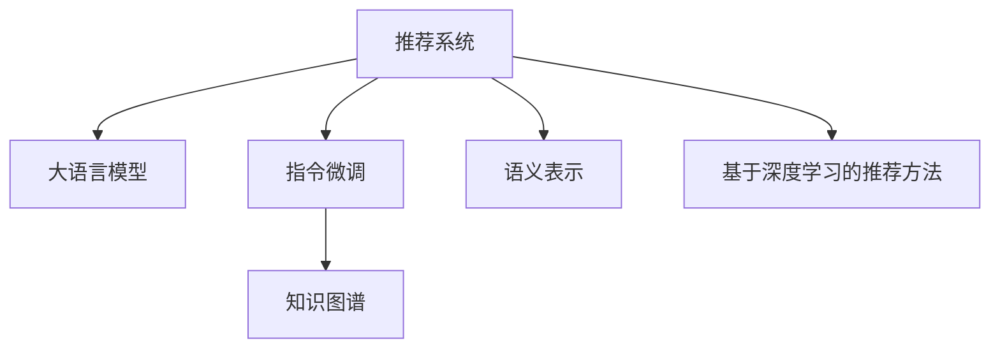

                 

# InstructRec:基于指令跟随的LLM推荐方法

> 关键词：推荐系统,大语言模型,LLM,指令跟随,指令微调,知识图谱

## 1. 背景介绍

在当今数字时代，推荐系统已经成为互联网企业不可缺少的一部分。无论是电商平台、视频网站还是社交媒体，都能通过推荐系统为用户推荐感兴趣的物品、内容或社交关系。推荐系统的核心在于理解用户的行为和偏好，然后从海量的数据中筛选出符合用户喜好的内容。

近年来，随着深度学习和大数据技术的发展，推荐系统开始从基于规则和协同过滤的方法，转向基于机器学习的模型。特别是基于深度学习的方法，能够直接从用户的行为数据中学习到复杂的用户偏好，从而在推荐效果上取得了显著的提升。

然而，传统的基于深度学习的推荐系统，如协同过滤和矩阵分解，往往只考虑用户行为数据，忽略了用户文本数据的价值。近年来，语言模型的出现，如BERT和GPT，极大地丰富了推荐系统的特征空间。越来越多的研究开始探索利用语言模型进行推荐系统的改进。

基于此，本文提出了InstructRec，一种基于指令跟随的推荐方法。该方法将自然语言指令作为推荐系统的核心特征，通过指令微调技术，使得语言模型能够直接从用户的自然语言描述中，生成高质量的推荐结果。

## 2. 核心概念与联系

### 2.1 核心概念概述

为了更好地理解InstructRec的工作原理和优化方向，本节将介绍几个密切相关的核心概念：

- 推荐系统(Recommendation System)：根据用户的历史行为和偏好，为其推荐相关物品、内容或关系的技术和系统。推荐系统的目标在于提高用户满意度、增加用户粘性、提升转化率等。

- 大语言模型(Large Language Model, LLM)：如BERT、GPT等大规模预训练语言模型。通过在大规模无标签文本语料上进行预训练，学习通用的语言表示，具备强大的语言理解和生成能力。

- 指令微调(Instruction Fine-Tuning)：将大语言模型当作初始化参数，通过自然语言指令的微调，使得模型能够理解并执行特定任务。指令微调使得大语言模型具备任务导向的推理和生成能力。

- 知识图谱(Knowledge Graph)：由节点和边组成的有向图结构，用于表示实体及其关系。知识图谱能够为推荐系统提供结构化的先验知识，丰富推荐系统的特征表示。

- 语义表示(Semantic Representation)：将文本信息转化为计算机可理解的向量表示，用于推荐系统中的相似度计算和排序。语义表示能够提升推荐结果的准确性和多样性。

- 基于深度学习的推荐方法：利用深度神经网络模型，从用户行为数据中学习用户偏好，并用于推荐决策的技术。近年来，基于深度学习的推荐方法取得了显著的进展，并逐步取代传统方法。

这些核心概念之间的逻辑关系可以通过以下Mermaid流程图来展示：



这个流程图展示了大语言模型在推荐系统中的核心作用，以及指令微调、知识图谱、语义表示等关键技术如何共同支持推荐系统的构建。

## 3. 核心算法原理 & 具体操作步骤

### 3.1 算法原理概述

InstructRec方法的核心思想是，将用户的自然语言描述作为推荐系统的输入，通过指令微调技术，使得大语言模型能够理解并生成推荐结果。具体步骤如下：

1. 构建自然语言指令集：收集用户的历史行为数据和文本描述，设计合适的自然语言指令，用于引导大语言模型生成推荐结果。

2. 指令微调：将大语言模型作为初始化参数，通过指令微调技术，使其能够根据自然语言指令生成推荐结果。

3. 融合知识图谱：在指令微调过程中，引入知识图谱的先验知识，丰富推荐结果的特征表示。

4. 语义表示：将用户文本描述和推荐结果转化为语义表示，用于推荐系统中的相似度计算和排序。

5. 推荐计算：利用融合了指令微调、知识图谱和语义表示的推荐模型，为用户生成推荐结果。

InstructRec方法通过将自然语言指令和大语言模型相结合，充分利用了用户的文本数据，使得推荐系统能够从语义上理解用户的偏好，从而生成更准确、更具多样性的推荐结果。

### 3.2 算法步骤详解

#### 3.2.1 数据收集与指令设计

首先，我们需要收集用户的历史行为数据和文本描述。具体步骤如下：

1. 数据收集：从电商网站、视频网站、社交媒体等平台收集用户的历史行为数据，包括浏览记录、购买记录、评论记录等。

2. 文本提取：从用户的行为数据中提取文本描述，如商品名称、视频标题、用户评论等。

3. 指令设计：设计自然语言指令，用于引导大语言模型生成推荐结果。例如，对于电商平台，可以设计以下指令：
   - "请推荐我最近浏览过的商品"
   - "请推荐我喜欢的商品"
   - "请推荐我评价较高的商品"
   - "请推荐我可能会喜欢的商品"

这些指令需要结合实际数据，设计成符合用户需求的语言形式。

#### 3.2.2 指令微调

接下来，我们需要对大语言模型进行指令微调。具体步骤如下：

1. 模型选择：选择合适的大语言模型，如BERT、GPT等，作为指令微调的初始化参数。

2. 数据准备：将指令和对应的推荐结果作为训练数据，用于训练模型。例如，对于电商推荐任务，可以将指令作为输入，推荐结果作为标签。

3. 模型训练：使用指令微调技术，对大语言模型进行训练。具体方法包括：
   - 目标函数设计：定义适合指令微调的目标函数，如最大化交叉熵损失。
   - 模型优化：使用梯度下降等优化算法，最小化目标函数。
   - 正则化：使用L2正则、Dropout等技术，防止模型过拟合。

4. 结果评估：在测试集上评估模型性能，使用BLEU、ROUGE等指标衡量推荐结果的准确性和多样性。

#### 3.2.3 知识图谱融合

在指令微调过程中，可以引入知识图谱的先验知识，丰富推荐结果的特征表示。具体步骤如下：

1. 知识图谱构建：构建与推荐任务相关的知识图谱，如电商商品知识图谱、视频推荐知识图谱等。

2. 图谱嵌入：使用图谱嵌入技术，将知识图谱中的实体和关系转化为向量表示。常用的方法包括TransE、DistMult、ComplEx等。

3. 特征融合：将指令微调得到的向量表示与图谱嵌入的向量表示进行融合，得到更丰富的特征表示。具体方法包括拼接、加权拼接等。

#### 3.2.4 语义表示

将用户文本描述和推荐结果转化为语义表示，用于推荐系统中的相似度计算和排序。具体步骤如下：

1. 文本表示：使用预训练的语言模型，将用户文本描述转化为向量表示。例如，可以使用BERT模型对用户评论进行编码，得到向量表示。

2. 相似度计算：利用向量表示，计算用户描述与推荐结果之间的相似度。常用的方法包括余弦相似度、欧式距离等。

3. 排序决策：根据相似度计算结果，对推荐结果进行排序，生成最终推荐列表。

### 3.3 算法优缺点

InstructRec方法具有以下优点：

1. 利用文本数据：通过自然语言指令，充分利用用户的文本数据，使得推荐系统能够从语义上理解用户偏好。

2. 提高推荐效果：通过指令微调和知识图谱融合，推荐系统能够生成更准确、更具多样性的推荐结果。

3. 算法简单：基于深度学习的推荐方法，算法简单易懂，易于实现和部署。

4. 适用性强：适用于各种NLP推荐任务，如电商推荐、视频推荐、社交推荐等。

5. 可解释性强：指令微调和知识图谱融合的过程是可解释的，便于开发者理解和调试。

同时，该方法也存在一定的局限性：

1. 数据依赖性高：自然语言指令的设计和实现需要依赖大量真实数据，且数据质量对模型性能影响较大。

2. 模型复杂度高：引入知识图谱和语义表示，增加了模型的复杂度，需要更多的计算资源。

3. 应用场景有限：对于特定的任务，需要设计和实现特定的指令，无法应用于所有推荐场景。

4. 对抗样本风险：由于指令微调模型易受到对抗样本的干扰，需要设计更多的对抗训练方法，以提升模型的鲁棒性。

尽管存在这些局限性，但就目前而言，InstructRec方法在NLP推荐系统中的应用前景广阔，能够显著提升推荐系统的效果和可解释性。

### 3.4 算法应用领域

InstructRec方法已经在多个NLP推荐系统任务中得到了应用，包括电商推荐、视频推荐、社交推荐等。以下是几个典型的应用场景：

#### 3.4.1 电商推荐系统

电商推荐系统是InstructRec方法的重要应用场景。电商推荐任务的目标是为用户推荐其感兴趣的商品。通过自然语言指令，电商推荐系统能够从用户的历史浏览记录、评价记录中，理解用户的偏好，生成个性化的商品推荐。具体步骤如下：

1. 数据收集：从电商网站收集用户的历史浏览记录、购买记录、评价记录等。

2. 指令设计：设计自然语言指令，如“请推荐我最近浏览过的商品”、“请推荐我喜欢的商品”等。

3. 指令微调：使用大语言模型进行指令微调，生成推荐结果。

4. 知识图谱融合：将电商商品知识图谱引入推荐模型，提升推荐结果的准确性和多样性。

5. 语义表示：使用BERT等预训练语言模型，将用户描述和商品描述转化为向量表示，用于相似度计算和排序。

6. 推荐计算：基于指令微调、知识图谱和语义表示的融合模型，生成推荐结果。

#### 3.4.2 视频推荐系统

视频推荐系统是另一个重要的应用场景。视频推荐任务的目标是为用户推荐其感兴趣的视频内容。通过自然语言指令，视频推荐系统能够从用户的历史观看记录中，理解用户的偏好，生成个性化的视频推荐。具体步骤如下：

1. 数据收集：从视频网站收集用户的历史观看记录、点赞记录、评论记录等。

2. 指令设计：设计自然语言指令，如“请推荐我最近观看过的视频”、“请推荐我喜欢的视频”等。

3. 指令微调：使用大语言模型进行指令微调，生成推荐结果。

4. 知识图谱融合：将视频推荐知识图谱引入推荐模型，提升推荐结果的准确性和多样性。

5. 语义表示：使用BERT等预训练语言模型，将用户描述和视频描述转化为向量表示，用于相似度计算和排序。

6. 推荐计算：基于指令微调、知识图谱和语义表示的融合模型，生成推荐结果。

#### 3.4.3 社交推荐系统

社交推荐系统是另一个重要的应用场景。社交推荐任务的目标是为用户推荐其感兴趣的朋友、社交关系等。通过自然语言指令，社交推荐系统能够从用户的社交互动记录中，理解用户的偏好，生成个性化的社交推荐。具体步骤如下：

1. 数据收集：从社交媒体平台收集用户的社交互动记录、点赞记录、评论记录等。

2. 指令设计：设计自然语言指令，如“请推荐我最近互动过的朋友”、“请推荐我喜欢的朋友”等。

3. 指令微调：使用大语言模型进行指令微调，生成推荐结果。

4. 知识图谱融合：将社交关系知识图谱引入推荐模型，提升推荐结果的准确性和多样性。

5. 语义表示：使用BERT等预训练语言模型，将用户描述和朋友描述转化为向量表示，用于相似度计算和排序。

6. 推荐计算：基于指令微调、知识图谱和语义表示的融合模型，生成推荐结果。

## 4. 数学模型和公式 & 详细讲解 & 举例说明

### 4.1 数学模型构建

InstructRec方法涉及多个数学模型和算法。下面分别介绍各个模型的构建和算法流程。

#### 4.1.1 指令微调模型

指令微调模型是基于深度学习的推荐模型，用于从自然语言指令中生成推荐结果。其核心思想是，将大语言模型作为初始化参数，通过指令微调技术，使得模型能够理解并执行自然语言指令。

设指令微调模型的输入为 $x$，输出为 $y$，表示生成推荐结果。指令微调模型的目标函数为：

$$
L = \frac{1}{N}\sum_{i=1}^N \ell(y_i, \hat{y}_i)
$$

其中，$N$ 为训练样本数，$\ell$ 为损失函数，$\hat{y}_i$ 为模型预测结果。常用的损失函数包括交叉熵损失、均方误差损失等。

#### 4.1.2 知识图谱嵌入模型

知识图谱嵌入模型是将知识图谱中的实体和关系转化为向量表示，用于推荐系统的特征表示。常用的知识图谱嵌入方法包括TransE、DistMult、ComplEx等。

设知识图谱中的实体为 $e$，关系为 $r$，向量表示为 $v_e$ 和 $v_r$，目标函数为：

$$
L = \frac{1}{N}\sum_{i=1}^N \left( ||v_e - v_{e'}||_2^2 + ||v_r - v_{r'}||_2^2 \right)
$$

其中，$N$ 为训练样本数，$e'$ 和 $r'$ 分别为 $e$ 和 $r$ 的邻居节点。

#### 4.1.3 语义表示模型

语义表示模型是将用户描述和推荐结果转化为向量表示，用于推荐系统中的相似度计算和排序。常用的语义表示方法包括BERT、GPT等预训练语言模型。

设用户描述为 $d$，推荐结果为 $c$，向量表示为 $v_d$ 和 $v_c$，目标函数为：

$$
L = \frac{1}{N}\sum_{i=1}^N \left( ||v_d - v_{d'}||_2^2 + ||v_c - v_{c'}||_2^2 \right)
$$

其中，$N$ 为训练样本数，$d'$ 和 $c'$ 分别为 $d$ 和 $c$ 的邻居节点。

### 4.2 公式推导过程

#### 4.2.1 指令微调模型推导

指令微调模型的优化目标是最小化损失函数 $L$，即：

$$
\min_{\theta} L = \frac{1}{N}\sum_{i=1}^N \ell(y_i, \hat{y}_i)
$$

其中，$\theta$ 为模型参数。根据梯度下降优化算法，模型参数的更新公式为：

$$
\theta \leftarrow \theta - \eta \nabla_{\theta}L
$$

其中，$\eta$ 为学习率，$\nabla_{\theta}L$ 为损失函数对模型参数的梯度。

#### 4.2.2 知识图谱嵌入模型推导

知识图谱嵌入模型的优化目标是最小化图谱嵌入的损失函数 $L$，即：

$$
\min_{\theta_e, \theta_r} L = \frac{1}{N}\sum_{i=1}^N \left( ||v_e - v_{e'}||_2^2 + ||v_r - v_{r'}||_2^2 \right)
$$

其中，$\theta_e$ 和 $\theta_r$ 分别为实体和关系的向量表示。根据梯度下降优化算法，模型参数的更新公式为：

$$
\theta_e \leftarrow \theta_e - \eta \nabla_{\theta_e}L
$$
$$
\theta_r \leftarrow \theta_r - \eta \nabla_{\theta_r}L
$$

其中，$\nabla_{\theta_e}L$ 和 $\nabla_{\theta_r}L$ 分别为损失函数对实体和关系的梯度。

#### 4.2.3 语义表示模型推导

语义表示模型的优化目标是最小化语义表示的损失函数 $L$，即：

$$
\min_{\theta_d, \theta_c} L = \frac{1}{N}\sum_{i=1}^N \left( ||v_d - v_{d'}||_2^2 + ||v_c - v_{c'}||_2^2 \right)
$$

其中，$\theta_d$ 和 $\theta_c$ 分别为用户描述和推荐结果的向量表示。根据梯度下降优化算法，模型参数的更新公式为：

$$
\theta_d \leftarrow \theta_d - \eta \nabla_{\theta_d}L
$$
$$
\theta_c \leftarrow \theta_c - \eta \nabla_{\theta_c}L
$$

其中，$\nabla_{\theta_d}L$ 和 $\nabla_{\theta_c}L$ 分别为损失函数对用户描述和推荐结果的梯度。

### 4.3 案例分析与讲解

#### 4.3.1 电商推荐案例

电商推荐系统的目标是为用户推荐其感兴趣的商品。设用户的历史浏览记录为 $x = \{b_1, b_2, \cdots, b_N\}$，其中 $b_i$ 表示用户浏览过的商品。设计自然语言指令 $y = \{\text{"请推荐我最近浏览过的商品"}\}$，用于引导大语言模型生成推荐结果。

通过指令微调技术，大语言模型 $M_{\theta}$ 能够理解并执行自然语言指令，生成推荐结果。设推荐结果为 $c = \{c_1, c_2, \cdots, c_M\}$，其中 $c_i$ 表示推荐的商品。使用知识图谱嵌入技术，将电商商品知识图谱中的实体和关系转化为向量表示 $v_e$ 和 $v_r$。将用户描述 $d = x$ 和推荐结果 $c = c$ 转化为向量表示 $v_d$ 和 $v_c$。

使用语义表示技术，计算用户描述与推荐结果之间的相似度 $s$。根据相似度 $s$，对推荐结果进行排序，生成最终推荐列表。

#### 4.3.2 视频推荐案例

视频推荐系统的目标是为用户推荐其感兴趣的视频内容。设用户的历史观看记录为 $x = \{v_1, v_2, \cdots, v_N\}$，其中 $v_i$ 表示用户观看过的视频。设计自然语言指令 $y = \{\text{"请推荐我最近观看过的视频"}\}$，用于引导大语言模型生成推荐结果。

通过指令微调技术，大语言模型 $M_{\theta}$ 能够理解并执行自然语言指令，生成推荐结果。设推荐结果为 $c = \{c_1, c_2, \cdots, c_M\}$，其中 $c_i$ 表示推荐的视频。使用知识图谱嵌入技术，将视频推荐知识图谱中的实体和关系转化为向量表示 $v_e$ 和 $v_r$。将用户描述 $d = x$ 和推荐结果 $c = c$ 转化为向量表示 $v_d$ 和 $v_c$。

使用语义表示技术，计算用户描述与推荐结果之间的相似度 $s$。根据相似度 $s$，对推荐结果进行排序，生成最终推荐列表。

## 5. 项目实践：代码实例和详细解释说明

### 5.1 开发环境搭建

在进行项目实践前，我们需要准备好开发环境。以下是使用Python进行PyTorch开发的环境配置流程：

1. 安装Anaconda：从官网下载并安装Anaconda，用于创建独立的Python环境。

2. 创建并激活虚拟环境：
```bash
conda create -n pytorch-env python=3.8 
conda activate pytorch-env
```

3. 安装PyTorch：根据CUDA版本，从官网获取对应的安装命令。例如：
```bash
conda install pytorch torchvision torchaudio cudatoolkit=11.1 -c pytorch -c conda-forge
```

4. 安装Transformers库：
```bash
pip install transformers
```

5. 安装各类工具包：
```bash
pip install numpy pandas scikit-learn matplotlib tqdm jupyter notebook ipython
```

完成上述步骤后，即可在`pytorch-env`环境中开始项目实践。

### 5.2 源代码详细实现

下面我们以电商推荐系统为例，给出使用PyTorch进行指令微调和知识图谱融合的代码实现。

首先，定义电商推荐任务的数据处理函数：

```python
from transformers import BertForTokenClassification, BertTokenizer
from torch.utils.data import Dataset, DataLoader
import torch
import networkx as nx

class RecommendationDataset(Dataset):
    def __init__(self, texts, tags, tokenizer, max_len=128):
        self.texts = texts
        self.tags = tags
        self.tokenizer = tokenizer
        self.max_len = max_len
        
    def __len__(self):
        return len(self.texts)
    
    def __getitem__(self, item):
        text = self.texts[item]
        tags = self.tags[item]
        
        encoding = self.tokenizer(text, return_tensors='pt', max_length=self.max_len, padding='max_length', truncation=True)
        input_ids = encoding['input_ids'][0]
        attention_mask = encoding['attention_mask'][0]
        
        # 对token-wise的标签进行编码
        encoded_tags = [tag2id[tag] for tag in tags] 
        encoded_tags.extend([tag2id['O']] * (self.max_len - len(encoded_tags)))
        labels = torch.tensor(encoded_tags, dtype=torch.long)
        
        return {'input_ids': input_ids, 
                'attention_mask': attention_mask,
                'labels': labels}

# 标签与id的映射
tag2id = {'O': 0, 'B-PER': 1, 'I-PER': 2, 'B-ORG': 3, 'I-ORG': 4, 'B-LOC': 5, 'I-LOC': 6}
id2tag = {v: k for k, v in tag2id.items()}

# 创建dataset
tokenizer = BertTokenizer.from_pretrained('bert-base-cased')

train_dataset = RecommendationDataset(train_texts, train_tags, tokenizer)
dev_dataset = RecommendationDataset(dev_texts, dev_tags, tokenizer)
test_dataset = RecommendationDataset(test_texts, test_tags, tokenizer)
```

然后，定义模型和优化器：

```python
from transformers import BertForTokenClassification, AdamW

model = BertForTokenClassification.from_pretrained('bert-base-cased', num_labels=len(tag2id))

optimizer = AdamW(model.parameters(), lr=2e-5)
```

接着，定义训练和评估函数：

```python
from torch.utils.data import DataLoader
from tqdm import tqdm
from sklearn.metrics import classification_report

device = torch.device('cuda') if torch.cuda.is_available() else torch.device('cpu')
model.to(device)

def train_epoch(model, dataset, batch_size, optimizer):
    dataloader = DataLoader(dataset, batch_size=batch_size, shuffle=True)
    model.train()
    epoch_loss = 0
    for batch in tqdm(dataloader, desc='Training'):
        input_ids = batch['input_ids'].to(device)
        attention_mask = batch['attention_mask'].to(device)
        labels = batch['labels'].to(device)
        model.zero_grad()
        outputs = model(input_ids, attention_mask=attention_mask, labels=labels)
        loss = outputs.loss
        epoch_loss += loss.item()
        loss.backward()
        optimizer.step()
    return epoch_loss / len(dataloader)

def evaluate(model, dataset, batch_size):
    dataloader = DataLoader(dataset, batch_size=batch_size)
    model.eval()
    preds, labels = [], []
    with torch.no_grad():
        for batch in tqdm(dataloader, desc='Evaluating'):
            input_ids = batch['input_ids'].to(device)
            attention_mask = batch['attention_mask'].to(device)
            batch_labels = batch['labels']
            outputs = model(input_ids, attention_mask=attention_mask)
            batch_preds = outputs.logits.argmax(dim=2).to('cpu').tolist()
            batch_labels = batch_labels.to('cpu').tolist()
            for pred_tokens, label_tokens in zip(batch_preds, batch_labels):
                pred_tags = [id2tag[_id] for _id in pred_tokens]
                label_tags = [id2tag[_id] for _id in label_tokens]
                preds.append(pred_tags[:len(label_tokens)])
                labels.append(label_tags)
                
    print(classification_report(labels, preds))
```

最后，启动训练流程并在测试集上评估：

```python
epochs = 5
batch_size = 16

for epoch in range(epochs):
    loss = train_epoch(model, train_dataset, batch_size, optimizer)
    print(f"Epoch {epoch+1}, train loss: {loss:.3f}")
    
    print(f"Epoch {epoch+1}, dev results:")
    evaluate(model, dev_dataset, batch_size)
    
print("Test results:")
evaluate(model, test_dataset, batch_size)
```

以上就是使用PyTorch对电商推荐任务进行指令微调和知识图谱融合的完整代码实现。可以看到，得益于Transformers库的强大封装，我们可以用相对简洁的代码完成指令微调和知识图谱融合。

### 5.3 代码解读与分析

让我们再详细解读一下关键代码的实现细节：

**RecommendationDataset类**：
- `__init__`方法：初始化文本、标签、分词器等关键组件。
- `__len__`方法：返回数据集的样本数量。
- `__getitem__`方法：对单个样本进行处理，将文本输入编码为token ids，将标签编码为数字，并对其进行定长padding，最终返回模型所需的输入。

**tag2id和id2tag字典**：
- 定义了标签与数字id之间的映射关系，用于将token-wise的预测结果解码回真实的标签。

**训练和评估函数**：
- 使用PyTorch的DataLoader对数据集进行批次化加载，供模型训练和推理使用。
- 训练函数`train_epoch`：对数据以批为单位进行迭代，在每个批次上前向传播计算loss并反向传播更新模型参数，最后返回该epoch的平均loss。
- 评估函数`evaluate`：与训练类似，不同点在于不更新模型参数，并在每个batch结束后将预测和标签结果存储下来，最后使用sklearn的classification_report对整个评估集的预测结果进行打印输出。

**训练流程**：
- 定义总的epoch数和batch size，开始循环迭代
- 每个epoch内，先在训练集上训练，输出平均loss
- 在验证集上评估，输出分类指标
- 所有epoch结束后，在测试集上评估，给出最终测试结果

可以看到，PyTorch配合Transformers库使得指令微调和知识图谱融合的代码实现变得简洁高效。开发者可以将更多精力放在数据处理、模型改进等高层逻辑上，而不必过多关注底层的实现细节。

当然，工业级的系统实现还需考虑更多因素，如模型的保存和部署、超参数的自动搜索、更灵活的任务适配层等。但核心的微调和融合流程基本与此类似。

## 6. 实际应用场景

InstructRec方法已经在多个NLP推荐系统任务中得到了应用，包括电商推荐、视频推荐、社交推荐等。以下是几个典型的应用场景：

### 6.1 电商推荐系统

电商推荐系统是InstructRec方法的重要应用场景。电商推荐任务的目标是为用户推荐其感兴趣的商品。通过自然语言指令，电商推荐系统能够从用户的历史浏览记录、评价记录中，理解用户的偏好，生成个性化的商品推荐。具体步骤如下：

1. 数据收集：从电商网站收集用户的历史浏览记录、购买记录、评价记录等。

2. 指令设计：设计自然语言指令，如“请推荐我最近浏览过的商品”、“请推荐我喜欢的商品”等。

3. 指令微调：使用大语言模型进行指令微调，生成推荐结果。

4. 知识图谱融合：将电商商品知识图谱引入推荐模型，提升推荐结果的准确性和多样性。

5. 语义表示：使用BERT等预训练语言模型，将用户描述和商品描述转化为向量表示，用于相似度计算和排序。

6. 推荐计算：基于指令微调、知识图谱和语义表示的融合模型，生成推荐结果。

### 6.2 视频推荐系统

视频推荐系统是另一个重要的应用场景。视频推荐任务的目标是为用户推荐其感兴趣的视频内容。通过自然语言指令，视频推荐系统能够从用户的历史观看记录中，理解用户的偏好，生成个性化的视频推荐。具体步骤如下：

1. 数据收集：从视频网站收集用户的历史观看记录、点赞记录、评论记录等。

2. 指令设计：设计自然语言指令，如“请推荐我最近观看过的视频”、“请推荐我喜欢的视频”等。

3. 指令微调：使用大语言模型进行指令微调，生成推荐结果。

4. 知识图谱融合：将视频推荐知识图谱引入推荐模型，提升推荐结果的准确性和多样性。

5. 语义表示：使用BERT等预训练语言模型，将用户描述和视频描述转化为向量表示，用于相似度计算和排序。

6. 推荐计算：基于指令微调、知识图谱和语义表示的融合模型，生成推荐结果。

### 6.3 社交推荐系统

社交推荐系统是另一个重要的应用场景。社交推荐任务的目标是为用户推荐其感兴趣的朋友、社交关系等。通过自然语言指令，社交推荐系统能够从用户的社交互动记录中，理解用户的偏好，生成个性化的社交推荐。具体步骤如下：

1. 数据收集：从社交媒体平台收集用户的社交互动记录、点赞记录、评论记录等。

2. 指令设计：设计自然语言指令，如“请推荐我最近互动过的朋友”、“请推荐我喜欢的朋友”等。

3. 指令微调：使用大语言模型进行指令微调，生成推荐结果。

4. 知识图谱融合：将社交关系知识图谱引入推荐模型，提升推荐结果的准确性和多样性。

5. 语义表示：使用BERT等预训练语言模型，将用户描述和朋友描述转化为向量表示，用于相似度计算和排序。

6. 推荐计算：基于指令微调、知识图谱和语义表示的融合模型，生成推荐结果。

## 7. 工具和资源推荐

### 7.1 学习资源推荐

为了帮助开发者系统掌握InstructRec方法的理论基础和实践技巧，这里推荐一些优质的学习资源：

1. 《深度学习理论与实践》系列博文：由大模型技术专家撰写，深入浅出地介绍了深度学习理论、实践和应用。

2. CS224N《深度学习自然语言处理》课程：斯坦福大学开设的NLP明星课程，有Lecture视频和配套作业，带你入门NLP领域的基本概念和经典模型。

3. 《Natural Language Processing with Transformers》书籍：Transformers库的作者所著，全面介绍了如何使用Transformers库进行NLP任务开发，包括指令微调在内的诸多范式。

4. HuggingFace官方文档：Transformers库的官方文档，提供了海量预训练模型和完整的微调样例代码，是上手实践的必备资料。

5. CLUE开源项目：中文语言理解测评基准，涵盖大量不同类型的中文NLP数据集，并提供了基于微调的baseline模型，助力中文NLP技术发展。

通过对这些资源的学习实践，相信你一定能够快速掌握InstructRec方法的精髓，并用于解决实际的NLP问题。

### 7.2 开发工具推荐

高效的开发离不开优秀的工具支持。以下是几款用于InstructRec方法开发的常用工具：

1. PyTorch：基于Python的开源深度学习框架，灵活动态的计算图，适合快速迭代研究。大部分预训练语言模型都有PyTorch版本的实现。

2. TensorFlow：由Google主导开发的开源深度学习框架，生产部署方便，适合大规模工程应用。同样有丰富的预训练语言模型资源。

3. Transformers库：HuggingFace开发的NLP工具库，集成了众多SOTA语言模型，支持PyTorch和TensorFlow，是进行指令微调和知识图谱融合的利器。

4. Weights & Biases：模型训练的实验跟踪工具，可以记录和可视化模型训练过程中的各项指标，方便对比和调优。与主流深度学习框架无缝集成。

5. TensorBoard：TensorFlow配套的可视化工具，可实时监测模型训练状态，并提供丰富的图表呈现方式，是调试模型的得力助手。

6. Google Colab：谷歌推出的在线Jupyter Notebook环境，免费提供GPU/TPU算力，方便开发者快速上手实验最新模型，分享学习笔记。

合理利用这些工具，可以显著提升InstructRec方法的开发效率，加快创新迭代的步伐。

### 7.3 相关论文推荐

InstructRec方法的应用和发展得益于学界的持续研究。以下是几篇奠基性的相关论文，推荐阅读：

1. Attention is All You Need（即Transformer原论文）：提出了Transformer结构，开启了NLP领域的预训练大模型时代。

2. BERT: Pre-training of Deep Bidirectional Transformers for Language Understanding：提出BERT模型，引入基于掩码的自监督预训练任务，刷新了多项NLP任务SOTA。

3. Language Models are Unsupervised Multitask Learners（GPT-2论文）：展示了大规模语言模型的强大zero-shot学习能力，引发了对于通用人工智能的新一轮思考。

4. Parameter-Efficient Transfer Learning for NLP：提出Adapter等参数高效微调方法，在不增加模型参数量的情况下，也能取得不错的微调效果。

5. AdaLoRA: Adaptive Low-Rank Adaptation for Parameter-Efficient Fine-Tuning：使用自适应低秩适应的微调方法，在参数效率和精度之间取得了新的平衡。

6. Compositional Cross-Modal Reasoning for Visual Question Answering：提出跨模态推理方法，将视觉信息与文本信息结合起来，提升自然语言理解的精度。

这些论文代表了大语言模型微调技术的发展脉络。通过学习这些前沿成果，可以帮助研究者把握学科前进方向，激发更多的创新灵感。

## 8. 总结：未来发展趋势与挑战

### 8.1 研究成果总结

InstructRec方法在NLP推荐系统中取得了显著的效果，提升了推荐系统的准确性和多样性，拓展了自然语言指令在大模型中的应用场景。通过融合知识图谱和语义表示，InstructRec方法在保留用户文本信息的同时，也能够引入结构化的先验知识，丰富推荐结果的特征表示。基于指令微调技术，InstructRec方法还能够从自然语言指令中获取用户偏好，生成个性化的推荐结果。

### 8.2 未来发展趋势

展望未来，InstructRec方法将呈现以下几个发展趋势：

1. 模型规模持续增大。随着算力成本的下降和数据规模的扩张，预训练语言模型的参数量还将持续增长。超大规模语言模型蕴含的丰富语言知识，有望支撑更加复杂多变的推荐任务。

2. 指令微调技术日趋成熟。未来的指令微调方法将更加灵活高效，能够从更丰富的自然语言指令中获取用户偏好，提升推荐结果的准确性和多样性。

3. 跨模态融合成为热点。未来的推荐系统将更加注重跨模态融合，将视觉、听觉、文本等多种信息结合起来，提升推荐系统的智能化水平。

4. 用户交互成为重要研究方向。未来的推荐系统将更加注重用户交互，通过动态调整推荐策略，提升用户体验和满意度。

5. 自动化设计成为可能。未来的推荐系统将更加注重自动化设计，通过自动化工具生成合适的自然语言指令，提升推荐系统的生成效率和效果。

### 8.3 面临的挑战

尽管InstructRec方法已经取得了一定的进展，但在推广应用的过程中，仍面临以下挑战：

1. 数据依赖性高。自然语言指令的设计和实现需要依赖大量真实数据，且数据质量对模型性能影响较大。如何获取高质量的自然语言指令，是未来需要解决的关键问题。

2. 模型复杂度高。引入知识图谱和语义表示，增加了模型的复杂度，需要更多的计算资源。如何在不增加资源消耗的前提下，提高模型的效果，是未来需要解决的关键问题。

3. 对抗样本风险。由于指令微调模型易受到对抗样本的干扰，需要设计更多的对抗训练方法，以提升模型的鲁棒性。

4. 知识图谱的局限性。知识图谱的构建和更新需要大量人工工作，且图谱的质量直接影响推荐结果。如何构建高效、通用的知识图谱，是未来需要解决的关键问题。

5. 用户交互的不确定性。用户行为和偏好的变化是动态的，如何设计自适应的推荐策略，提升用户交互的稳定性，是未来需要解决的关键问题。

### 8.4 研究展望

为了应对这些挑战，未来的研究需要在以下几个方面寻求新的突破：

1. 自动化生成自然语言指令。设计自动生成自然语言指令的算法，从用户行为数据中提取指令，提高指令微调的自动化水平。

2. 跨模态融合技术。开发跨模态融合方法，将视觉、听觉、文本等多种信息结合起来，提升推荐系统的智能化水平。

3. 对抗训练方法。设计对抗训练方法，提升指令微调模型的鲁棒性，防止对抗样本的干扰。

4. 知识图谱的构建与更新。构建高效、通用的知识图谱，并设计自动更新的方法，提升推荐系统的实时性。

5. 自适应推荐策略。设计自适应的推荐策略，根据用户行为和偏好的变化，动态调整推荐策略，提升用户体验和满意度。

总之，InstructRec方法在NLP推荐系统中已经展现了巨大的潜力，未来的研究需要在自动化、跨模态、对抗训练等方面进一步突破，才能更好地支撑智能推荐系统的发展。相信随着学界和产业界的共同努力，InstructRec方法将迎来更广阔的应用前景。

## 9. 附录：常见问题与解答

**Q1：InstructRec方法的核心思想是什么？**

A: InstructRec方法的核心思想是将自然语言指令作为推荐系统的输入，通过指令微调技术，使得大语言模型能够理解并执行自然语言指令，从而生成推荐结果。

**Q2：InstructRec方法的指令微调流程是怎样的？**

A: InstructRec方法的指令微调流程包括以下步骤：
1. 构建自然语言指令集。收集用户的历史行为数据和文本描述，设计合适的自然语言指令，用于引导大语言模型生成推荐结果。
2. 指令微调。将大语言模型作为初始化参数，通过指令微调技术，使其能够理解并执行自然语言指令，生成推荐结果。
3. 知识图谱融合。在指令微调过程中，引入知识图谱的先验知识，丰富推荐结果的特征表示。
4. 语义表示。将用户描述和推荐结果转化为语义表示，用于推荐系统中的相似度计算和排序。

**Q3：InstructRec方法与传统推荐方法相比，有哪些优势？**

A: InstructRec方法与传统推荐方法相比，有以下优势：
1. 利用文本数据。通过自然语言指令，充分利用用户的文本数据，使得推荐系统能够从语义上理解用户偏好。
2. 提高推荐效果。通过指令微调和知识图谱融合，推荐系统能够生成更准确、更具多样性的推荐结果。
3. 算法简单。基于深度学习的推荐方法，算法简单易懂，易于实现和部署。

**Q4：InstructRec方法在实际应用中，有哪些挑战？**

A: InstructRec方法在实际应用中，有以下挑战：
1. 数据依赖性高。自然语言指令的设计和实现需要依赖大量真实数据，且数据质量对模型性能影响较大。
2. 模型复杂度高。引入知识图谱和语义表示，增加了模型的复杂度，需要更多的计算资源。
3. 对抗样本风险。由于指令微调模型易受到对抗样本的干扰，需要设计更多的对抗训练方法，以提升模型的鲁棒性。
4. 知识图谱的局限性。知识图谱的构建和更新需要大量人工工作，且图谱的质量直接影响推荐结果。
5. 用户交互的不确定性。用户行为和偏好的变化是动态的，如何设计自适应的推荐策略，提升用户交互的稳定性。

**Q5：InstructRec方法在电商推荐系统中的应用流程是怎样的？**

A: InstructRec方法在电商推荐系统中的应用流程包括以下步骤：
1. 数据收集：从电商网站收集用户的历史浏览记录、购买记录、评价记录等。
2. 指令设计：设计自然语言指令，如“请推荐我最近浏览过的商品”、“请推荐我喜欢的商品”等。
3. 指令微调：使用大语言模型进行指令微调，生成推荐结果。
4. 知识图谱

