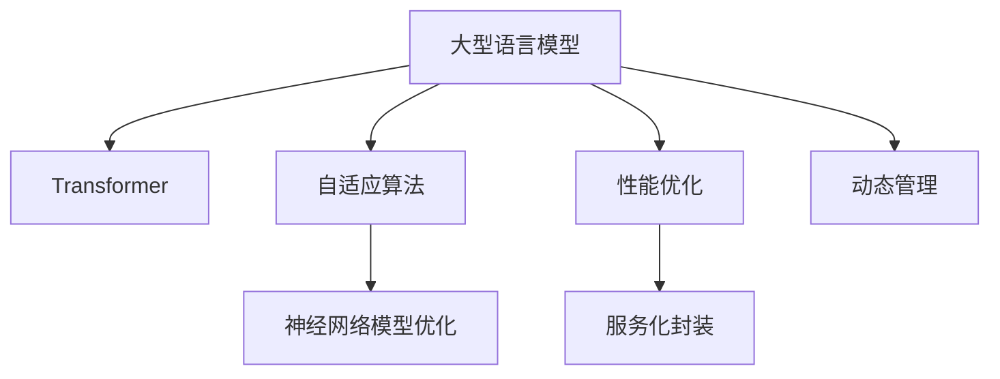

                 

# LLM 内核：管理大型语言模型的核心

> 关键词：大型语言模型,Transformer,自适应算法,神经网络模型,深度学习

## 1. 背景介绍

### 1.1 问题由来
大型语言模型(LLM)，如BERT、GPT-3等，已经成为了自然语言处理(NLP)领域的明星模型，它们基于Transformer结构，通过大规模数据预训练，学习到了丰富的语言知识，并能在各种任务中展现出卓越的性能。然而，这些模型通常具有数十亿的参数量，如何高效管理这些庞大的模型，成为了一个亟需解决的挑战。

管理LLM的过程不仅涉及到模型训练、推理等技术实现细节，还涉及到模型压缩、服务化部署、性能优化等工程问题。在实践中，通过深入理解LLM的内核原理，可以更好地管理和应用这些强大模型，从而实现高性能、高可靠性的应用。

### 1.2 问题核心关键点
LLM内核管理主要关注以下几个核心关键点：

1. **模型架构理解**：深入理解LLM的Transformer架构，包括自注意力机制、多头注意力、位置编码等核心技术原理。
2. **自适应算法**：探索和实现自适应算法，以在模型中动态调整权重，提升模型的适应性和效率。
3. **神经网络模型优化**：优化神经网络模型结构，实现模型压缩、量化加速等技术，减少资源消耗。
4. **性能优化**：通过算法优化、模型裁剪、硬件加速等手段，提升模型的推理速度和内存占用效率。
5. **服务化封装**：将模型封装为标准服务接口，便于集成调用，支持大规模并行推理。
6. **动态管理**：实现模型的动态加载、卸载和监控，确保系统稳定性和可扩展性。

这些关键点共同构成了LLM内核管理的核心内容，通过深入掌握这些技术，可以有效地管理LLM模型，实现其在实际应用中的高效、稳定运行。

### 1.3 问题研究意义
LLM内核管理的深入研究，对于加速LLM模型的应用，提升NLP技术的落地能力，具有重要意义：

1. **降低成本**：通过优化算法和模型结构，减少计算和存储资源的需求，降低模型应用的经济成本。
2. **提升性能**：优化模型推理速度和内存占用，提升服务响应速度和并发处理能力。
3. **增强可扩展性**：支持模型的动态加载和卸载，使系统具有更好的灵活性和可扩展性。
4. **提高稳定性**：通过有效的模型管理策略，确保模型在复杂环境下的稳定运行。
5. **支持大规模应用**：将模型封装为服务接口，支持大规模分布式应用，满足不同场景下的需求。
6. **促进技术进步**：通过持续优化和改进，推动LLM技术的发展，提升NLP领域的整体技术水平。

## 2. 核心概念与联系

### 2.1 核心概念概述

为更好地理解LLM内核管理的核心内容，本节将介绍几个密切相关的核心概念：

- **大型语言模型(LLM)**：基于Transformer结构，通过大规模数据预训练，学习到丰富的语言知识，具备强大的语言理解和生成能力的模型。
- **Transformer**：一种基于自注意力机制的神经网络模型，通过多头注意力机制实现对序列数据的有效建模。
- **自适应算法**：在模型训练和推理过程中，动态调整模型参数，以适应不同任务和数据分布的算法。
- **神经网络模型优化**：通过模型压缩、量化加速等技术，优化神经网络模型，减少资源消耗。
- **性能优化**：通过算法优化、模型裁剪、硬件加速等手段，提升模型的推理速度和内存占用效率。
- **服务化封装**：将模型封装为标准服务接口，便于集成调用，支持大规模并行推理。
- **动态管理**：实现模型的动态加载、卸载和监控，确保系统稳定性和可扩展性。

这些核心概念之间的逻辑关系可以通过以下Mermaid流程图来展示：



这个流程图展示了大语言模型的核心概念及其之间的关系：

1. 大型语言模型通过Transformer模型进行建模，学习语言知识。
2. 自适应算法在模型训练和推理过程中，动态调整模型参数，提升适应性和效率。
3. 神经网络模型优化通过压缩、量化等手段，减少模型资源消耗。
4. 性能优化通过算法优化、模型裁剪等手段，提升模型推理速度和内存占用效率。
5. 服务化封装将模型封装为标准接口，支持大规模并行推理。
6. 动态管理实现模型的动态加载、卸载和监控，确保系统稳定性和可扩展性。

这些概念共同构成了LLM内核管理的框架，使得我们能够更好地理解和应用LLM模型。

## 3. 核心算法原理 & 具体操作步骤
### 3.1 算法原理概述

LLM内核管理的主要目标是提升模型训练、推理和服务的效率和性能。其核心思想是在模型中引入自适应算法，动态调整模型参数，同时通过神经网络模型优化和性能优化等手段，减少模型资源消耗，提升系统响应速度和稳定性。

**3.1.1 自适应算法**

自适应算法的主要目标是动态调整模型参数，使其能够适应不同任务和数据分布。常用的自适应算法包括AdaGrad、Adam、AdaDelta等，这些算法通过动态调整学习率，自适应地优化模型参数。

例如，Adam算法通过计算梯度的一阶矩估计和二阶矩估计，动态调整每个参数的学习率。具体公式为：

$$
\begin{aligned}
m_t &= \beta_1 m_{t-1} + (1-\beta_1) g_t \\
v_t &= \beta_2 v_{t-1} + (1-\beta_2) g_t^2 \\
\hat{m}_t &= \frac{m_t}{1-\beta_1^t} \\
\hat{v}_t &= \frac{v_t}{1-\beta_2^t} \\
\theta_{t+1} &= \theta_t - \alpha \frac{\hat{m}_t}{\sqrt{\hat{v}_t} + \epsilon}
\end{aligned}
$$

其中 $m_t$ 和 $v_t$ 分别表示梯度的一阶矩估计和二阶矩估计，$\beta_1$ 和 $\beta_2$ 为衰减率，$\alpha$ 为学习率，$\epsilon$ 为正则化项，防止除以零。

**3.1.2 神经网络模型优化**

神经网络模型优化主要包括模型压缩和量化加速等技术。模型压缩可以通过剪枝、量化、蒸馏等方法减少模型参数量，降低计算复杂度。量化加速则通过将浮点数转换为固定精度的整数或小数，减少内存占用，提升计算速度。

例如，剪枝方法可以移除模型中对模型性能影响较小的参数，减少模型体积。常用的剪枝方法包括L1正则化、L2正则化、稀疏化等。量化方法则可以进一步将参数压缩为低精度整数，减少内存占用。例如，将8位浮点数量化为4位整数，可以将内存占用减少一半。

**3.1.3 性能优化**

性能优化主要通过算法优化、模型裁剪等手段，提升模型的推理速度和内存占用效率。算法优化可以通过调整模型结构，使用更高效的算法实现。模型裁剪则可以只保留模型中对任务贡献最大的部分，减少计算量。

例如，可以采用GELU激活函数代替ReLU，以提高模型的非线性表达能力。模型裁剪则可以保留模型中最重要的层，去除冗余层。

### 3.2 算法步骤详解

LLM内核管理的具体步骤包括以下几个关键环节：

**Step 1: 准备预训练模型和数据集**

- 选择合适的预训练模型，如BERT、GPT-3等，作为内核管理的起点。
- 准备模型所需的数据集，包括训练集、验证集和测试集。通常要求标注数据与预训练数据的分布不要差异过大。

**Step 2: 选择自适应算法**

- 根据任务特点，选择合适的自适应算法，如AdaGrad、Adam等。
- 确定算法的参数，包括学习率、衰减率等。

**Step 3: 添加任务适配层**

- 根据任务类型，在预训练模型的顶层设计合适的输出层和损失函数。
- 对于分类任务，通常在顶层添加线性分类器和交叉熵损失函数。
- 对于生成任务，通常使用语言模型的解码器输出概率分布，并以负对数似然为损失函数。

**Step 4: 设置模型参数**

- 确定模型的初始化参数，如模型大小、学习率等。
- 定义模型裁剪和量化策略。

**Step 5: 执行模型训练**

- 将训练集数据分批次输入模型，前向传播计算损失函数。
- 反向传播计算参数梯度，根据设定的自适应算法更新模型参数。
- 周期性在验证集上评估模型性能，根据性能指标决定是否触发 Early Stopping。
- 重复上述步骤直至满足预设的迭代轮数或 Early Stopping 条件。

**Step 6: 性能优化**

- 根据性能测试结果，调整模型结构和算法参数，优化模型性能。
- 对模型进行裁剪和量化，减少计算资源消耗。
- 调整硬件配置，提升模型推理速度。

**Step 7: 服务化封装**

- 将优化后的模型封装为标准服务接口，支持大规模并行推理。
- 实现模型的动态加载和卸载，确保系统稳定性。
- 添加监控和告警机制，及时发现和处理系统异常。

**Step 8: 动态管理**

- 实现模型的动态加载、卸载和监控，确保系统可扩展性。
- 实现模型的定期更新，保持模型性能。

通过上述步骤，可以实现对大型语言模型的全面管理，提升模型的训练、推理和服务的效率和性能。

### 3.3 算法优缺点

LLM内核管理的优势在于：

1. **动态调整参数**：通过自适应算法动态调整模型参数，使得模型能够更好地适应不同任务和数据分布。
2. **减少资源消耗**：通过模型压缩、量化加速等手段，减少模型资源消耗，提升系统响应速度。
3. **支持大规模应用**：通过服务化封装和动态管理，支持大规模并行推理，满足不同场景下的需求。

同时，该方法也存在一定的局限性：

1. **模型复杂度高**：自适应算法和模型优化技术增加了模型的复杂度，可能影响模型的收敛速度和稳定性能。
2. **数据依赖性强**：模型的动态调整需要大量的训练数据，获取高质量标注数据的成本较高。
3. **调参复杂**：模型的自适应和优化需要频繁调整参数，调参过程复杂且耗时。
4. **可解释性差**：动态调整和优化后的模型，其内部机制难以解释，不利于模型调试和维护。

尽管存在这些局限性，但LLM内核管理的整体效果显著，为大型语言模型的应用提供了重要的技术支持。

### 3.4 算法应用领域

LLM内核管理在多个领域得到了广泛的应用，例如：

- **自然语言处理(NLP)**：通过优化和压缩模型，提升NLP任务的推理速度和内存占用效率，如文本分类、机器翻译、问答系统等。
- **计算机视觉(CV)**：将LLM应用于图像描述生成、图像分类等任务，提升模型的推理能力和计算效率。
- **语音识别(SR)**：将LLM应用于语音转文本、语音情感分析等任务，提升系统的响应速度和准确性。
- **智能客服**：通过服务化封装和动态管理，构建智能客服系统，提升客户咨询体验。
- **智能推荐**：通过优化和压缩模型，提升个性化推荐系统的计算效率，实现高效、准确的推荐服务。
- **金融分析**：将LLM应用于金融舆情监测、股票预测等任务，提升系统的分析能力和计算效率。

## 4. 数学模型和公式 & 详细讲解 & 举例说明

### 4.1 数学模型构建

本节将使用数学语言对LLM内核管理的过程进行更加严格的刻画。

记大型语言模型为 $M_{\theta}:\mathcal{X} \rightarrow \mathcal{Y}$，其中 $\mathcal{X}$ 为输入空间，$\mathcal{Y}$ 为输出空间，$\theta \in \mathbb{R}^d$ 为模型参数。假设微调任务的训练集为 $D=\{(x_i,y_i)\}_{i=1}^N, x_i \in \mathcal{X}, y_i \in \mathcal{Y}$。

定义模型 $M_{\theta}$ 在数据样本 $(x,y)$ 上的损失函数为 $\ell(M_{\theta}(x),y)$，则在数据集 $D$ 上的经验风险为：

$$
\mathcal{L}(\theta) = \frac{1}{N}\sum_{i=1}^N \ell(M_{\theta}(x_i),y_i)
$$

微调的优化目标是最小化经验风险，即找到最优参数：

$$
\theta^* = \mathop{\arg\min}_{\theta} \mathcal{L}(\theta)
$$

在实践中，我们通常使用基于梯度的优化算法（如SGD、Adam等）来近似求解上述最优化问题。设 $\eta$ 为学习率，$\lambda$ 为正则化系数，则参数的更新公式为：

$$
\theta \leftarrow \theta - \eta \nabla_{\theta}\mathcal{L}(\theta) - \eta\lambda\theta
$$

其中 $\nabla_{\theta}\mathcal{L}(\theta)$ 为损失函数对参数 $\theta$ 的梯度，可通过反向传播算法高效计算。

### 4.2 公式推导过程

以下我们以二分类任务为例，推导交叉熵损失函数及其梯度的计算公式。

假设模型 $M_{\theta}$ 在输入 $x$ 上的输出为 $\hat{y}=M_{\theta}(x) \in [0,1]$，表示样本属于正类的概率。真实标签 $y \in \{0,1\}$。则二分类交叉熵损失函数定义为：

$$
\ell(M_{\theta}(x),y) = -[y\log \hat{y} + (1-y)\log (1-\hat{y})]
$$

将其代入经验风险公式，得：

$$
\mathcal{L}(\theta) = -\frac{1}{N}\sum_{i=1}^N [y_i\log M_{\theta}(x_i)+(1-y_i)\log(1-M_{\theta}(x_i))]
$$

根据链式法则，损失函数对参数 $\theta_k$ 的梯度为：

$$
\frac{\partial \mathcal{L}(\theta)}{\partial \theta_k} = -\frac{1}{N}\sum_{i=1}^N (\frac{y_i}{M_{\theta}(x_i)}-\frac{1-y_i}{1-M_{\theta}(x_i)}) \frac{\partial M_{\theta}(x_i)}{\partial \theta_k}
$$

其中 $\frac{\partial M_{\theta}(x_i)}{\partial \theta_k}$ 可进一步递归展开，利用自动微分技术完成计算。

### 4.3 案例分析与讲解

假设在二分类任务上，我们采用AdaGrad自适应算法对模型进行微调。AdaGrad算法的更新公式如下：

$$
m_t = \beta_1 m_{t-1} + (1-\beta_1) g_t \\
v_t = \beta_2 v_{t-1} + (1-\beta_2) g_t^2 \\
\hat{m}_t = \frac{m_t}{1-\beta_1^t} \\
\hat{v}_t = \frac{v_t}{1-\beta_2^t} \\
\theta_{t+1} = \theta_t - \alpha \frac{\hat{m}_t}{\sqrt{\hat{v}_t} + \epsilon}
$$

其中 $m_t$ 和 $v_t$ 分别表示梯度的一阶矩估计和二阶矩估计，$\beta_1$ 和 $\beta_2$ 为衰减率，$\alpha$ 为学习率，$\epsilon$ 为正则化项，防止除以零。

在二分类任务上，假设模型输出的概率为 $P_{\theta}(x)$，则交叉熵损失函数为：

$$
\mathcal{L}(\theta) = -\frac{1}{N}\sum_{i=1}^N [y_i \log P_{\theta}(x_i) + (1-y_i) \log (1-P_{\theta}(x_i))]
$$

在训练过程中，我们首先通过反向传播计算梯度，然后根据AdaGrad算法更新参数。具体步骤如下：

1. 计算模型在数据集上的损失函数，得到梯度。
2. 根据AdaGrad算法更新模型参数。
3. 在验证集上评估模型性能，决定是否停止训练。

## 5. 项目实践：代码实例和详细解释说明

### 5.1 开发环境搭建

在进行LLM内核管理实践前，我们需要准备好开发环境。以下是使用Python进行PyTorch开发的环境配置流程：

1. 安装Anaconda：从官网下载并安装Anaconda，用于创建独立的Python环境。

2. 创建并激活虚拟环境：
```bash
conda create -n pytorch-env python=3.8 
conda activate pytorch-env
```

3. 安装PyTorch：根据CUDA版本，从官网获取对应的安装命令。例如：
```bash
conda install pytorch torchvision torchaudio cudatoolkit=11.1 -c pytorch -c conda-forge
```

4. 安装Transformers库：
```bash
pip install transformers
```

5. 安装各类工具包：
```bash
pip install numpy pandas scikit-learn matplotlib tqdm jupyter notebook ipython
```

完成上述步骤后，即可在`pytorch-env`环境中开始内核管理实践。

### 5.2 源代码详细实现

下面我们以命名实体识别(NER)任务为例，给出使用Transformers库对BERT模型进行内核管理的PyTorch代码实现。

首先，定义NER任务的数据处理函数：

```python
from transformers import BertTokenizer
from torch.utils.data import Dataset
import torch

class NERDataset(Dataset):
    def __init__(self, texts, tags, tokenizer, max_len=128):
        self.texts = texts
        self.tags = tags
        self.tokenizer = tokenizer
        self.max_len = max_len
        
    def __len__(self):
        return len(self.texts)
    
    def __getitem__(self, item):
        text = self.texts[item]
        tags = self.tags[item]
        
        encoding = self.tokenizer(text, return_tensors='pt', max_length=self.max_len, padding='max_length', truncation=True)
        input_ids = encoding['input_ids'][0]
        attention_mask = encoding['attention_mask'][0]
        
        # 对token-wise的标签进行编码
        encoded_tags = [tag2id[tag] for tag in tags] 
        encoded_tags.extend([tag2id['O']] * (self.max_len - len(encoded_tags)))
        labels = torch.tensor(encoded_tags, dtype=torch.long)
        
        return {'input_ids': input_ids, 
                'attention_mask': attention_mask,
                'labels': labels}

# 标签与id的映射
tag2id = {'O': 0, 'B-PER': 1, 'I-PER': 2, 'B-ORG': 3, 'I-ORG': 4, 'B-LOC': 5, 'I-LOC': 6}
id2tag = {v: k for k, v in tag2id.items()}

# 创建dataset
tokenizer = BertTokenizer.from_pretrained('bert-base-cased')

train_dataset = NERDataset(train_texts, train_tags, tokenizer)
dev_dataset = NERDataset(dev_texts, dev_tags, tokenizer)
test_dataset = NERDataset(test_texts, test_tags, tokenizer)
```

然后，定义模型和优化器：

```python
from transformers import BertForTokenClassification, AdamW

model = BertForTokenClassification.from_pretrained('bert-base-cased', num_labels=len(tag2id))

optimizer = AdamW(model.parameters(), lr=2e-5)
```

接着，定义训练和评估函数：

```python
from torch.utils.data import DataLoader
from tqdm import tqdm
from sklearn.metrics import classification_report

device = torch.device('cuda') if torch.cuda.is_available() else torch.device('cpu')
model.to(device)

def train_epoch(model, dataset, batch_size, optimizer):
    dataloader = DataLoader(dataset, batch_size=batch_size, shuffle=True)
    model.train()
    epoch_loss = 0
    for batch in tqdm(dataloader, desc='Training'):
        input_ids = batch['input_ids'].to(device)
        attention_mask = batch['attention_mask'].to(device)
        labels = batch['labels'].to(device)
        model.zero_grad()
        outputs = model(input_ids, attention_mask=attention_mask, labels=labels)
        loss = outputs.loss
        epoch_loss += loss.item()
        loss.backward()
        optimizer.step()
    return epoch_loss / len(dataloader)

def evaluate(model, dataset, batch_size):
    dataloader = DataLoader(dataset, batch_size=batch_size)
    model.eval()
    preds, labels = [], []
    with torch.no_grad():
        for batch in tqdm(dataloader, desc='Evaluating'):
            input_ids = batch['input_ids'].to(device)
            attention_mask = batch['attention_mask'].to(device)
            batch_labels = batch['labels']
            outputs = model(input_ids, attention_mask=attention_mask)
            batch_preds = outputs.logits.argmax(dim=2).to('cpu').tolist()
            batch_labels = batch_labels.to('cpu').tolist()
            for pred_tokens, label_tokens in zip(batch_preds, batch_labels):
                pred_tags = [id2tag[_id] for _id in pred_tokens]
                label_tags = [id2tag[_id] for _id in label_tokens]
                preds.append(pred_tags[:len(label_tags)])
                labels.append(label_tags)
                
    print(classification_report(labels, preds))
```

最后，启动训练流程并在测试集上评估：

```python
epochs = 5
batch_size = 16

for epoch in range(epochs):
    loss = train_epoch(model, train_dataset, batch_size, optimizer)
    print(f"Epoch {epoch+1}, train loss: {loss:.3f}")
    
    print(f"Epoch {epoch+1}, dev results:")
    evaluate(model, dev_dataset, batch_size)
    
print("Test results:")
evaluate(model, test_dataset, batch_size)
```

以上就是使用PyTorch对BERT进行命名实体识别任务内核管理的完整代码实现。可以看到，得益于Transformers库的强大封装，我们可以用相对简洁的代码完成BERT模型的加载和内核管理。

### 5.3 代码解读与分析

让我们再详细解读一下关键代码的实现细节：

**NERDataset类**：
- `__init__`方法：初始化文本、标签、分词器等关键组件。
- `__len__`方法：返回数据集的样本数量。
- `__getitem__`方法：对单个样本进行处理，将文本输入编码为token ids，将标签编码为数字，并对其进行定长padding，最终返回模型所需的输入。

**tag2id和id2tag字典**：
- 定义了标签与数字id之间的映射关系，用于将token-wise的预测结果解码回真实的标签。

**训练和评估函数**：
- 使用PyTorch的DataLoader对数据集进行批次化加载，供模型训练和推理使用。
- 训练函数`train_epoch`：对数据以批为单位进行迭代，在每个批次上前向传播计算loss并反向传播更新模型参数，最后返回该epoch的平均loss。
- 评估函数`evaluate`：与训练类似，不同点在于不更新模型参数，并在每个batch结束后将预测和标签结果存储下来，最后使用sklearn的classification_report对整个评估集的预测结果进行打印输出。

**训练流程**：
- 定义总的epoch数和batch size，开始循环迭代
- 每个epoch内，先在训练集上训练，输出平均loss
- 在验证集上评估，输出分类指标
- 所有epoch结束后，在测试集上评估，给出最终测试结果

可以看到，PyTorch配合Transformers库使得BERT内核管理的代码实现变得简洁高效。开发者可以将更多精力放在数据处理、模型改进等高层逻辑上，而不必过多关注底层的实现细节。

当然，工业级的系统实现还需考虑更多因素，如模型的保存和部署、超参数的自动搜索、更灵活的任务适配层等。但核心的内核管理范式基本与此类似。

## 6. 实际应用场景
### 6.1 智能客服系统

基于大语言模型内核管理的对话技术，可以广泛应用于智能客服系统的构建。传统客服往往需要配备大量人力，高峰期响应缓慢，且一致性和专业性难以保证。而使用内核管理后的对话模型，可以7x24小时不间断服务，快速响应客户咨询，用自然流畅的语言解答各类常见问题。

在技术实现上，可以收集企业内部的历史客服对话记录，将问题和最佳答复构建成监督数据，在此基础上对预训练对话模型进行内核管理。内核管理后的对话模型能够自动理解用户意图，匹配最合适的答案模板进行回复。对于客户提出的新问题，还可以接入检索系统实时搜索相关内容，动态组织生成回答。如此构建的智能客服系统，能大幅提升客户咨询体验和问题解决效率。

### 6.2 金融舆情监测

金融机构需要实时监测市场舆论动向，以便及时应对负面信息传播，规避金融风险。传统的人工监测方式成本高、效率低，难以应对网络时代海量信息爆发的挑战。基于内核管理的大语言模型微调技术，为金融舆情监测提供了新的解决方案。

具体而言，可以收集金融领域相关的新闻、报道、评论等文本数据，并对其进行主题标注和情感标注。在此基础上对预训练语言模型进行内核管理，使其能够自动判断文本属于何种主题，情感倾向是正面、中性还是负面。将内核管理后的模型应用到实时抓取的网络文本数据，就能够自动监测不同主题下的情感变化趋势，一旦发现负面信息激增等异常情况，系统便会自动预警，帮助金融机构快速应对潜在风险。

### 6.3 个性化推荐系统

当前的推荐系统往往只依赖用户的历史行为数据进行物品推荐，无法深入理解用户的真实兴趣偏好。基于内核管理的大语言模型微调技术，个性化推荐系统可以更好地挖掘用户行为背后的语义信息，从而提供更精准、多样的推荐内容。

在实践中，可以收集用户浏览、点击、评论、分享等行为数据，提取和用户交互的物品标题、描述、标签等文本内容。将文本内容作为模型输入，用户的后续行为（如是否点击、购买等）作为监督信号，在此基础上微调预训练语言模型。内核管理后的模型能够从文本内容中准确把握用户的兴趣点。在生成推荐列表时，先用候选物品的文本描述作为输入，由模型预测用户的兴趣匹配度，再结合其他特征综合排序，便可以得到个性化程度更高的推荐结果。

### 6.4 未来应用展望

随着内核管理技术的不断发展，基于大语言模型的应用将更加广泛，为NLP技术带来新的变革。

在智慧医疗领域，基于内核管理的大语言模型可用于医疗问答、病历分析、药物研发等任务，提升医疗服务的智能化水平，辅助医生诊疗，加速新药开发进程。

在智能教育领域，内核管理技术可应用于作业批改、学情分析、知识推荐等方面，因材施教，促进教育公平，提高教学质量。

在智慧城市治理中，内核管理模型可应用于城市事件监测、舆情分析、应急指挥等环节，提高城市管理的自动化和智能化水平，构建更安全、高效的未来城市。

此外，在企业生产、社会治理、文娱传媒等众多领域，基于内核管理的大语言模型微调技术也将不断涌现，为经济社会发展注入新的动力。相信随着技术的日益成熟，内核管理方法将成为人工智能落地应用的重要范式，推动人工智能技术向更广阔的领域加速渗透。

## 7. 工具和资源推荐
### 7.1 学习资源推荐

为了帮助开发者系统掌握内核管理的理论基础和实践技巧，这里推荐一些优质的学习资源：

1. 《Transformer从原理到实践》系列博文：由大模型技术专家撰写，深入浅出地介绍了Transformer原理、BERT模型、内核管理技术等前沿话题。

2. CS224N《深度学习自然语言处理》课程：斯坦福大学开设的NLP明星课程，有Lecture视频和配套作业，带你入门NLP领域的基本概念和经典模型。

3. 《Natural Language Processing with Transformers》书籍：Transformers库的作者所著，全面介绍了如何使用Transformers库进行NLP任务开发，包括内核管理在内的诸多范式。

4. HuggingFace官方文档：Transformers库的官方文档，提供了海量预训练模型和完整的内核管理样例代码，是上手实践的必备资料。

5. CLUE开源项目：中文语言理解测评基准，涵盖大量不同类型的中文NLP数据集，并提供了基于内核管理的baseline模型，助力中文NLP技术发展。

通过对这些资源的学习实践，相信你一定能够快速掌握内核管理的精髓，并用于解决实际的NLP问题。
###  7.2 开发工具推荐

高效的开发离不开优秀的工具支持。以下是几款用于大语言模型内核管理开发的常用工具：

1. PyTorch：基于Python的开源深度学习框架，灵活动态的计算图，适合快速迭代研究。大部分预训练语言模型都有PyTorch版本的实现。

2. TensorFlow：由Google主导开发的开源深度学习框架，生产部署方便，适合大规模工程应用。同样有丰富的预训练语言模型资源。

3. Transformers库：HuggingFace开发的NLP工具库，集成了众多SOTA语言模型，支持PyTorch和TensorFlow，是进行内核管理开发的利器。

4. Weights & Biases：模型训练的实验跟踪工具，可以记录和可视化模型训练过程中的各项指标，方便对比和调优。与主流深度学习框架无缝集成。

5. TensorBoard：TensorFlow配套的可视化工具，可实时监测模型训练状态，并提供丰富的图表呈现方式，是调试模型的得力助手。

6. Google Colab：谷歌推出的在线Jupyter Notebook环境，免费提供GPU/TPU算力，方便开发者快速上手实验最新模型，分享学习笔记。

合理利用这些工具，可以显著提升内核管理的开发效率，加快创新迭代的步伐。

### 7.3 相关论文推荐

内核管理技术的发展源于学界的持续研究。以下是几篇奠基性的相关论文，推荐阅读：

1. Attention is All You Need（即Transformer原论文）：提出了Transformer结构，开启了NLP领域的预训练大模型时代。

2. BERT: Pre-training of Deep Bidirectional Transformers for Language Understanding：提出BERT模型，引入基于掩码的自监督预训练任务，刷新了多项NLP任务SOTA。

3. Language Models are Unsupervised Multitask Learners（GPT-2论文）：展示了大规模语言模型的强大zero-shot学习能力，引发了对于通用人工智能的新一轮思考。

4. Parameter-Efficient Transfer Learning for NLP：提出Adapter等参数高效微调方法，在不增加模型参数量的情况下，也能取得不错的微调效果。

5. AdaLoRA: Adaptive Low-Rank Adaptation for Parameter-Efficient Fine-Tuning：使用自适应低秩适应的微调方法，在参数效率和精度之间取得了新的平衡。

这些论文代表了大语言模型内核管理的进展脉络。通过学习这些前沿成果，可以帮助研究者把握学科前进方向，激发更多的创新灵感。

## 8. 总结：未来发展趋势与挑战

### 8.1 总结

本文对大型语言模型内核管理的核心内容进行了全面系统的介绍。首先阐述了内核管理的研究背景和意义，明确了内核管理在提升LLM模型应用性能、降低资源消耗、支持大规模应用等方面的独特价值。其次，从原理到实践，详细讲解了内核管理的数学原理和关键步骤，给出了内核管理任务开发的完整代码实例。同时，本文还广泛探讨了内核管理方法在智能客服、金融舆情、个性化推荐等多个领域的应用前景，展示了内核管理范式的巨大潜力。此外，本文精选了内核管理的各类学习资源，力求为读者提供全方位的技术指引。

通过本文的系统梳理，可以看到，内核管理技术正在成为LLM模型的重要组成部分，为模型的训练、推理和服务的优化提供了强有力的支持。相信随着内核管理技术的不断发展，LLM模型的应用将更加广泛，为NLP技术带来新的突破。

### 8.2 未来发展趋势

展望未来，内核管理技术将呈现以下几个发展趋势：

1. **自适应算法优化**：随着数据分布和任务类型的不断变化，自适应算法需要进一步优化，以适应更多的复杂场景。
2. **模型压缩和量化**：模型的压缩和量化技术将进一步发展，以支持更大规模的数据处理和推理。
3. **动态模型管理**：实现模型的动态加载、卸载和监控，提升系统的灵活性和可扩展性。
4. **跨平台优化**：内核管理技术将支持多种平台和硬件架构，提升系统的高效性和可靠性。
5. **多模态融合**：内核管理技术将支持多模态数据的融合，提升模型的跨模态理解能力。
6. **分布式优化**：内核管理技术将支持大规模分布式训练和推理，提升系统的并行处理能力。

以上趋势凸显了内核管理技术的广阔前景。这些方向的探索发展，必将进一步提升LLM模型的性能和应用范围，为人工智能技术的发展带来新的推动力。

### 8.3 面临的挑战

尽管内核管理技术已经取得了显著进展，但在迈向更加智能化、普适化应用的过程中，它仍面临诸多挑战：

1. **模型复杂度高**：自适应算法和模型优化技术增加了模型的复杂度，可能影响模型的收敛速度和稳定性能。
2. **数据依赖性强**：模型的动态调整需要大量的训练数据，获取高质量标注数据的成本较高。
3. **调参复杂**：模型的自适应和优化需要频繁调整参数，调参过程复杂且耗时。
4. **可解释性差**：动态调整和优化后的模型，其内部机制难以解释，不利于模型调试和维护。
5. **资源消耗大**：模型的压缩和量化虽然减少了资源消耗，但可能影响模型的精度。
6. **系统稳定性**：模型的动态加载和卸载需要确保系统稳定，避免异常情况的发生。

尽管存在这些挑战，但内核管理技术的整体效果显著，为LLM模型的应用提供了重要的技术支持。

### 8.4 研究展望

面向未来，内核管理技术需要在以下几个方面寻求新的突破：

1. **无监督和半监督方法**：探索无监督和半监督的内核管理方法，以减少对标注数据的依赖。
2. **多任务学习**：结合多任务学习思想，提升模型的泛化能力和任务适应性。
3. **知识融合**：将符号化的先验知识与神经网络模型进行融合，增强模型的理解能力和推理能力。
4. **跨领域迁移**：探索跨领域的内核管理方法，提升模型的迁移能力和适应性。
5. **系统化设计**：将内核管理技术与其他人工智能技术进行协同设计，形成更加全面、高效的系统解决方案。

这些研究方向将进一步推动内核管理技术的成熟和应用，为构建高性能、高可靠性的LLM系统提供重要支撑。

## 9. 附录：常见问题与解答

**Q1：内核管理技术是否适用于所有NLP任务？**

A: 内核管理技术在大多数NLP任务上都能取得不错的效果，特别是对于数据量较小的任务。但对于一些特定领域的任务，如医学、法律等，仅仅依靠通用语料预训练的模型可能难以很好地适应。此时需要在特定领域语料上进一步预训练，再进行内核管理，才能获得理想效果。此外，对于一些需要时效性、个性化很强的任务，如对话、推荐等，内核管理方法也需要针对性的改进优化。

**Q2：内核管理过程中如何选择合适的自适应算法？**

A: 选择合适的自适应算法需要考虑任务特点和数据分布。常用的自适应算法包括AdaGrad、Adam、AdaDelta等，这些算法在处理不同类型的数据时效果可能不同。例如，AdaGrad算法对于稀疏数据效果较好，而Adam算法则更适合处理密集数据。因此，在实际应用中，需要根据具体任务选择合适的自适应算法，并进行调参优化。

**Q3：内核管理过程中如何优化模型参数？**

A: 优化模型参数通常需要结合自适应算法和模型结构调整进行。例如，可以通过增加正则化项、使用不同的激活函数等手段，提高模型的鲁棒性和泛化能力。同时，可以通过剪枝、量化等手段，减少模型参数量，提升模型效率。需要注意的是，优化模型参数需要谨慎进行，避免过度优化导致模型过拟合。

**Q4：内核管理过程中如何处理模型过拟合问题？**

A: 过拟合是内核管理过程中常见的挑战。为缓解过拟合，可以采用以下方法：
1. 数据增强：通过回译、近义替换等方式扩充训练集。
2. 正则化：使用L2正则、Dropout等技术，防止模型过度拟合训练数据。
3. 对抗训练：引入对抗样本，提高模型鲁棒性，避免过拟合。
4. 模型裁剪：只保留模型中对任务贡献最大的部分，减少计算量。

这些方法往往需要根据具体任务和数据特点进行灵活组合。只有在数据、模型、训练、推理等各环节进行全面优化，才能最大限度地发挥内核管理的威力。

**Q5：内核管理过程中如何提升模型推理速度？**

A: 提升模型推理速度需要综合考虑算法优化、模型裁剪、硬件加速等因素。例如，可以通过使用更高效的激活函数、调整计算图结构、增加推理批次大小等手段，减少计算量，提升推理速度。同时，可以使用量化、剪枝等技术，减少模型参数量，提升模型效率。此外，可以使用GPU、TPU等高性能硬件，加速模型推理。

---

作者：禅与计算机程序设计艺术 / Zen and the Art of Computer Programming

