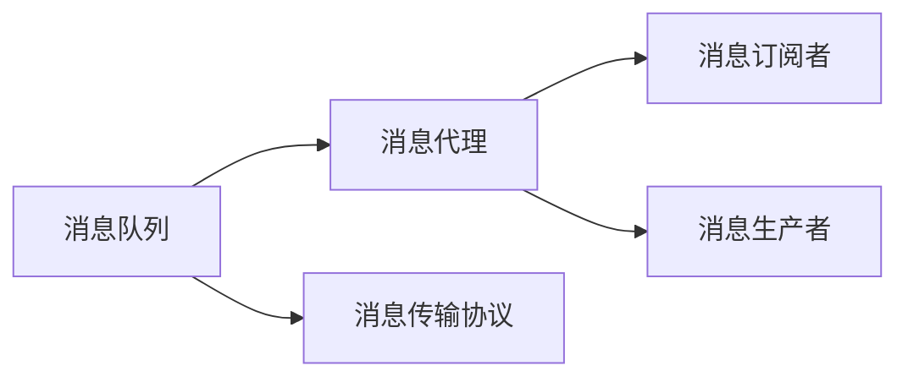

                 

## 1. 背景介绍

在现代分布式系统中，消息机制（Message Mechanism）是实现系统组件之间高效、可靠、低延迟通信的重要手段。消息机制允许不同组件异步、解耦、高并发地进行信息交换，是构建微服务架构的核心组件。本文将深入探讨在大规模分布式系统中，如何高效地构建和管理消息机制，实现系统组件之间的信息交换，提升系统的整体性能和稳定性。

## 2. 核心概念与联系

### 2.1 核心概念概述

本节将详细介绍与消息机制相关的重要概念和其间的联系。

- **分布式系统（Distributed System）**：由多个独立的计算机节点通过网络相互连接，协同完成特定任务的计算系统。典型的分布式系统包括互联网应用、云计算平台等。
- **消息队列（Message Queue）**：一种异步通信机制，通过队列形式存储消息，各个消息消费者按照顺序依次处理队列中的消息。消息队列支持解耦、异步、高并发、可靠的消息传递。
- **消息代理（Message Broker）**：负责消息的路由和分发，根据消息的目标地址将其分发给相应的消费者。消息代理通常具备负载均衡、路由策略、消息持久化等功能。
- **消息传输协议（Message Transport Protocol）**：用于消息传递的网络协议，支持各种消息传输方式，如基于TCP/IP的RabbitMQ、基于HTTP的Kafka等。
- **消息订阅者（Message Subscriber）**：接收并处理消息队列中的消息的消费者。订阅者可以根据消息内容异步、并行处理消息，提升系统的处理效率。
- **消息生产者（Message Producer）**：负责生成并发布消息到消息队列中，常见的生产者包括Web应用、后端服务、日志系统等。

### 2.2 核心概念联系

以下是一个Mermaid流程图，展示了大语言模型消息机制各组件之间的联系：



这个流程图展示了消息机制的基本结构：

1. **消息队列（A）**：作为消息传递的容器，支持存储、持久化、过滤等操作。
2. **消息代理（B）**：负责消息的路由和分发，确保消息能够正确地传递给对应的订阅者。
3. **消息传输协议（C）**：提供消息传输的基础网络支持，支持多种传输方式，保证消息传递的可靠性和效率。
4. **消息订阅者（D）**：负责接收并处理消息，支持异步、并行处理，提升系统的处理能力。
5. **消息生产者（E）**：生成并发布消息，常见的生产者包括Web应用、后端服务等。

## 3. 核心算法原理 & 具体操作步骤

### 3.1 算法原理概述

基于消息队列的消息机制通常包括以下核心算法原理：

1. **消息路由算法**：消息代理根据消息的目标地址（如消息的主题或标识），将消息正确路由到对应的订阅者。
2. **消息存储算法**：消息队列根据消息的优先级、时间戳、消息大小等因素，进行存储和排序，确保消息的有序处理。
3. **消息传输算法**：消息传输协议负责在发送者和接收者之间传递消息，提供可靠、高效、低延迟的消息传递服务。

### 3.2 算法步骤详解

#### 3.2.1 消息生成和发送

1. **消息生产者生成消息**：消息生产者根据业务需求生成消息内容，常见的消息内容格式包括JSON、XML、Protocol Buffers等。
2. **消息生产者发布消息**：消息生产者将消息内容打包成标准格式，并根据消息队列的路由规则，将消息发送至消息代理。

#### 3.2.2 消息路由和分发

1. **消息代理接收消息**：消息代理接收到消息后，解析消息内容，确定消息的目标地址。
2. **消息代理路由消息**：消息代理根据消息的目标地址，选择合适的订阅者进行消息分发。

#### 3.2.3 消息接收和处理

1. **消息订阅者接收消息**：消息订阅者从消息代理接收到消息，并解析消息内容。
2. **消息订阅者处理消息**：消息订阅者根据消息内容进行处理，常见的处理方式包括异步处理、并行处理、过滤处理等。

### 3.3 算法优缺点

#### 3.3.1 优点

1. **异步通信**：消息机制支持异步通信，各个组件可以独立运行，提高系统的并发能力和稳定性。
2. **解耦合**：消息机制支持解耦合，各个组件通过消息代理进行通信，降低了组件之间的耦合度。
3. **可扩展性**：消息机制支持水平扩展，通过增加消息代理和订阅者节点，提高系统的处理能力。
4. **故障容忍性**：消息机制支持故障容忍，各个组件的故障不会影响整个系统的运行。

#### 3.3.2 缺点

1. **延迟**：消息机制可能会引入一定的延迟，尤其是在消息队列中积压较多消息时。
2. **复杂性**：消息机制的实现较为复杂，需要考虑消息的路由、分发、存储等问题。
3. **资源消耗**：消息机制的运行需要消耗额外的系统资源，包括内存、CPU等。

### 3.4 算法应用领域

基于消息队列的消息机制广泛应用于各种分布式系统中，例如：

- **微服务架构**：支持各个微服务的异步、解耦、高并发通信。
- **实时数据处理**：支持各种实时数据处理任务，如流计算、实时数据采集等。
- **消息推送系统**：支持各种消息推送任务，如新闻推送、邮件推送等。
- **事件驱动系统**：支持各种事件驱动任务，如任务调度、异常监控等。

## 4. 数学模型和公式 & 详细讲解 & 举例说明

### 4.1 数学模型构建

消息机制的数学模型通常包括以下几个要素：

1. **消息数量（M）**：消息队列中的消息总数。
2. **消息大小（S）**：消息队列中每个消息的大小。
3. **消息传输速率（T）**：消息传输协议的消息传输速率。
4. **消息处理速率（P）**：消息订阅者的消息处理速率。
5. **消息延迟（D）**：消息从生产到处理的延迟时间。

### 4.2 公式推导过程

#### 4.2.1 消息队列容量

假设消息队列的容量为N，消息生产者的发送速率为R，则消息队列中消息的动态变化可以表示为：

$$
M(t) = M(t-1) + R(t) - P(t)
$$

其中，$M(t)$ 表示在时间t时消息队列中的消息数量，$R(t)$ 表示在时间t时消息生产者的发送速率，$P(t)$ 表示在时间t时消息订阅者的处理速率。

#### 4.2.2 消息队列长度

假设消息队列的最大长度为L，则在时间t时消息队列的长度为：

$$
Q(t) = \max(M(t) - N, 0)
$$

其中，$Q(t)$ 表示在时间t时消息队列的长度。

### 4.3 案例分析与讲解

假设有一个消息队列，容量为1000，消息生产者的发送速率为1000条/秒，消息订阅者的处理速率为1000条/秒，则在时间t时消息队列的长度为：

$$
Q(t) = \max(M(t) - N, 0) = \max((1000 - 1000) - 1000, 0) = 0
$$

这表示在时间t时消息队列中的消息数量为0。

## 5. 项目实践：代码实例和详细解释说明

### 5.1 开发环境搭建

在进行消息机制实践前，我们需要准备好开发环境。以下是使用Python和RabbitMQ进行消息机制开发的环境配置流程：

1. 安装RabbitMQ：从官网下载并安装RabbitMQ，搭建消息代理服务。
2. 安装Python RabbitMQ客户端：
```bash
pip install pika
```

### 5.2 源代码详细实现

下面是使用Python和RabbitMQ进行消息机制开发的代码实现：

```python
import pika

# 创建连接
connection = pika.BlockingConnection(pika.ConnectionParameters('localhost'))
channel = connection.channel()

# 声明队列
channel.queue_declare(queue='hello')

# 定义生产者函数
def producer():
    channel.basic_publish(exchange='',
                         routing_key='hello',
                         body='Hello, RabbitMQ!')
    print(' [x] Sent "Hello World!"')

# 定义消费者函数
def consumer():
    channel.basic_consume(queue='hello',
                         on_message_callback=on_message_callback,
                         auto_ack=True)

# 定义回调函数
def on_message_callback(ch, method, properties, body):
    print(f' [x] Received {body}')

# 启动生产者和消费者
producer_task = channel.call_later(0, producer)
consumer_task = channel.call_later(0, consumer)
channel.start_consuming()
```

### 5.3 代码解读与分析

让我们再详细解读一下关键代码的实现细节：

**pika库**：
- `BlockingConnection`：创建RabbitMQ连接对象。
- `channel.queue_declare`：声明队列，确保队列在RabbitMQ中存在。
- `channel.basic_publish`：发布消息，指定交换机和路由键。
- `channel.basic_consume`：监听队列，设置回调函数。
- `on_message_callback`：回调函数，处理接收到的消息。

**生产者和消费者**：
- `producer`函数：生成并发布消息。
- `consumer`函数：监听队列，处理接收到的消息。
- `on_message_callback`函数：回调函数，处理接收到的消息。

**生产者和消费者的启动**：
- `channel.call_later`：在指定时间后调用函数。
- `channel.start_consuming`：启动消费循环。

可以看到，使用Python和RabbitMQ进行消息机制的开发非常简单，只需要几行代码即可实现消息的生产和消费。

### 5.4 运行结果展示

运行上述代码后，可以在RabbitMQ的管理界面中看到队列、交换机和消息的实时状态。通过监控消息队列中消息的数量和延迟，可以评估消息机制的性能和稳定性。

## 6. 实际应用场景

### 6.1 微服务架构

在微服务架构中，各个微服务组件之间通过消息机制进行通信，支持异步、解耦、高并发。例如，电商平台的订单服务、库存服务、物流服务等组件，通过消息机制实现订单生成、库存更新、物流通知等功能。

### 6.2 实时数据处理

在实时数据处理场景中，消息机制支持各种实时数据处理任务。例如，大数据分析、流计算、实时数据采集等任务，通过消息机制实现数据的异步处理和存储。

### 6.3 消息推送系统

在消息推送系统中，消息机制支持各种消息推送任务。例如，新闻推送、邮件推送、短信推送等任务，通过消息机制实现推送消息的异步处理和推送。

### 6.4 事件驱动系统

在事件驱动系统中，消息机制支持各种事件驱动任务。例如，任务调度、异常监控、日志记录等任务，通过消息机制实现事件的异步处理和存储。

## 7. 工具和资源推荐

### 7.1 学习资源推荐

为了帮助开发者系统掌握消息机制的理论基础和实践技巧，这里推荐一些优质的学习资源：

1. **《RabbitMQ实战》**：介绍RabbitMQ的基本原理、配置和使用，适合初学者快速上手。
2. **《Spring Boot实战》**：介绍Spring Boot消息机制的实现，适合有一定经验的开发者深入学习。
3. **《微服务架构实战》**：介绍微服务架构的消息机制实现，适合架构设计师和架构师学习。
4. **《Kafka：分布式流处理平台》**：介绍Apache Kafka的基本原理、配置和使用，适合分布式系统开发者学习。

### 7.2 开发工具推荐

高效的开发离不开优秀的工具支持。以下是几款用于消息机制开发的常用工具：

1. **RabbitMQ**：RabbitMQ是一种高性能的消息队列，支持多种消息传输协议和路由策略。
2. **Apache Kafka**：Apache Kafka是一种分布式流处理平台，支持高吞吐量的消息传输和存储。
3. **RocketMQ**：RocketMQ是一种基于Kafka的开源消息队列，支持分布式部署和高可用性。
4. **Kafka Streams**：Kafka Streams是Apache Kafka的流处理框架，支持实时数据处理和流计算。
5. **Spring Boot**：Spring Boot是Spring框架的轻量级应用启动器，支持消息机制的快速开发和部署。

### 7.3 相关论文推荐

消息机制的研究源于学界的持续研究。以下是几篇奠基性的相关论文，推荐阅读：

1. **《AMQP 3.0: Specification of the Advanced Message Queuing Protocol, Third Edition》**：介绍AMQP协议的基本原理和规范，适合系统架构设计师学习。
2. **《Apache Kafka: The Definitive Guide》**：介绍Apache Kafka的基本原理、配置和使用，适合分布式系统开发者学习。
3. **《Microservices Design Patterns》**：介绍微服务架构的消息机制实现，适合架构设计师和架构师学习。

## 8. 总结：未来发展趋势与挑战

### 8.1 总结

本文对基于消息队列的消息机制进行了全面系统的介绍。首先阐述了消息机制在大规模分布式系统中的重要性和应用场景，明确了消息机制在异步通信、解耦合、高并发等方面的独特价值。其次，从原理到实践，详细讲解了消息机制的数学模型和关键步骤，给出了消息机制开发的完整代码实例。同时，本文还广泛探讨了消息机制在微服务架构、实时数据处理、消息推送系统、事件驱动系统等多个领域的应用前景，展示了消息机制的巨大潜力。最后，本文精选了消息机制的相关学习资源，力求为读者提供全方位的技术指引。

通过本文的系统梳理，可以看到，消息机制在现代分布式系统中的应用已经成为一种不可或缺的重要手段。它通过异步通信、解耦合、高并发等特性，提高了系统的稳定性和性能。未来，伴随消息机制技术的不断演进，消息机制必将在构建高可靠、高可扩展、高并发、高稳定的分布式系统中发挥越来越重要的作用。

### 8.2 未来发展趋势

展望未来，消息机制的发展趋势将呈现以下几个方向：

1. **容器化和云原生化**：消息机制将越来越多地部署在容器化和云原生环境中，支持更灵活的部署和管理。
2. **分布式一致性**：消息机制将支持分布式一致性协议，如Raft、Paxos等，确保消息在分布式系统中的可靠传递。
3. **微服务治理**：消息机制将越来越多地应用于微服务治理，支持服务发现、负载均衡、故障恢复等功能。
4. **实时计算和流处理**：消息机制将支持实时计算和流处理，实现数据的实时分析和处理。
5. **跨平台和跨语言支持**：消息机制将支持跨平台和跨语言的消息传递，支持更多应用场景。
6. **分布式数据存储**：消息机制将支持分布式数据存储，支持数据的分布式计算和处理。

这些趋势凸显了消息机制在现代分布式系统中的重要性和广阔应用前景。这些方向的探索发展，必将进一步提升分布式系统的性能和稳定性，为构建高可靠、高可扩展、高并发的分布式系统铺平道路。

### 8.3 面临的挑战

尽管消息机制已经取得了显著的成果，但在迈向更加智能化、普适化应用的过程中，它仍面临着诸多挑战：

1. **延迟和吞吐量**：消息机制的延迟和吞吐量性能还需要进一步提升，尤其是在大规模数据处理场景下。
2. **消息一致性**：消息机制需要支持更高的消息一致性，确保消息的可靠传递和处理。
3. **跨平台和跨语言支持**：消息机制需要支持更多的跨平台和跨语言支持，确保跨应用和跨语言的稳定通信。
4. **安全性和隐私保护**：消息机制需要支持更高的安全性和隐私保护，确保数据的安全和隐私。
5. **可扩展性和可维护性**：消息机制需要具备更高的可扩展性和可维护性，确保系统的稳定性和可靠性。

这些挑战需要开发人员不断进行技术改进和优化，以确保消息机制的可靠性和高效性。唯有在技术上不断突破，才能真正发挥消息机制在分布式系统中的核心作用。

### 8.4 研究展望

面对消息机制面临的挑战，未来的研究需要在以下几个方面寻求新的突破：

1. **分布式一致性协议**：研究新的分布式一致性协议，提高消息在分布式系统中的可靠传递和处理能力。
2. **实时计算和流处理**：研究新的实时计算和流处理技术，提高数据处理的实时性和效率。
3. **跨平台和跨语言支持**：研究新的跨平台和跨语言支持技术，支持更多的应用场景和语言环境。
4. **安全性和隐私保护**：研究新的安全性和隐私保护技术，确保数据的安全和隐私。
5. **可扩展性和可维护性**：研究新的可扩展性和可维护性技术，确保系统的稳定性和可靠性。

这些研究方向的探索，必将引领消息机制技术迈向更高的台阶，为构建高可靠、高可扩展、高并发的分布式系统铺平道路。面向未来，消息机制还需要与其他分布式系统技术进行更深入的融合，如微服务、流计算、分布式数据库等，多路径协同发力，共同推动分布式系统的发展。

## 9. 附录：常见问题与解答

**Q1：消息机制的延迟和吞吐量如何优化？**

A: 消息机制的延迟和吞吐量性能可以通过以下方式进行优化：
1. **增加消息队列深度**：增加消息队列深度，可以减少消息传输的延迟。
2. **优化消息传输协议**：选择高效的消息传输协议，减少消息传输的延迟。
3. **增加消费者并发度**：增加消费者并发度，提高消息处理能力。
4. **优化消费者处理逻辑**：优化消费者处理逻辑，减少处理延迟。
5. **使用缓存技术**：使用缓存技术，提高消息处理效率。

**Q2：如何确保消息的一致性？**

A: 消息机制的一致性可以通过以下方式进行保证：
1. **消息顺序**：确保消息按照顺序传递和处理，避免消息乱序。
2. **事务处理**：使用事务处理机制，确保消息的一致性。
3. **分布式锁**：使用分布式锁机制，确保消息的一致性。
4. **分布式事务**：使用分布式事务机制，确保消息的一致性。
5. **重试机制**：使用重试机制，确保消息的一致性。

**Q3：如何提高消息机制的可扩展性和可维护性？**

A: 消息机制的可扩展性和可维护性可以通过以下方式进行优化：
1. **水平扩展**：使用水平扩展机制，增加消息队列的节点数量。
2. **垂直扩展**：使用垂直扩展机制，增加消息队列节点的资源配置。
3. **分布式存储**：使用分布式存储机制，支持消息的分布式存储。
4. **微服务治理**：使用微服务治理机制，支持服务的发现、负载均衡和故障恢复。
5. **可配置化**：使用可配置化机制，支持系统的灵活配置。

**Q4：如何确保消息机制的安全性和隐私保护？**

A: 消息机制的安全性和隐私保护可以通过以下方式进行保证：
1. **加密传输**：使用加密传输机制，确保消息的安全传输。
2. **身份认证**：使用身份认证机制，确保消息发送者和接收者的身份。
3. **访问控制**：使用访问控制机制，确保消息的访问权限。
4. **审计日志**：使用审计日志机制，确保消息的审计和记录。
5. **隐私保护**：使用隐私保护机制，确保消息的隐私保护。

这些方法可以结合使用，确保消息机制在安全性和隐私保护方面的可靠性。只有从技术上不断突破，才能真正发挥消息机制在分布式系统中的核心作用。

---

作者：禅与计算机程序设计艺术 / Zen and the Art of Computer Programming

