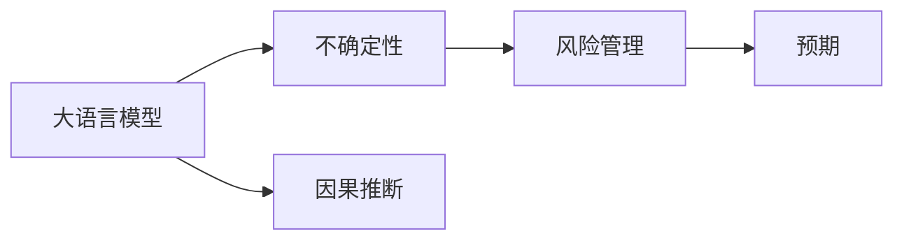
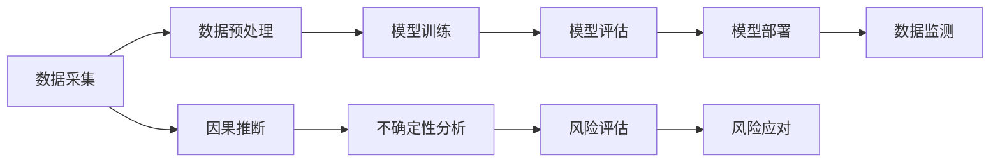

                 

# LLM 的不确定性：管理风险和预期

## 1. 背景介绍

在人工智能领域，尤其是大语言模型（LLM）的研究和应用中，不确定性是一个不可避免的话题。这些模型虽然具备强大的预测能力，但在处理复杂和多变的数据时，也会展现出不确定性。理解和管理这种不确定性，对于构建可靠和高效的AI系统至关重要。本文将深入探讨LLM的不确定性来源，以及如何管理和预期这些不确定性。

## 2. 核心概念与联系

### 2.1 核心概念概述

在讨论LLM的不确定性时，我们需要明确几个核心概念：

- **大语言模型（LLM）**：基于深度学习技术训练的大型神经网络，能够处理自然语言文本，并生成或分类新的文本。
- **不确定性（Uncertainty）**：指在模型预测或决策过程中，存在无法确定其正确性的因素。在LLM中，这种不确定性可能来源于数据分布的变化、模型参数的不确定性、训练数据的不足等。
- **风险管理（Risk Management）**：通过策略和工具，识别、评估和管理与不确定性相关的风险。
- **预期（Expectation）**：对未来事件或结果的预测，包括概率分布和期望值。
- **因果推断（Causal Inference）**：通过控制实验或建立因果模型，理解变量之间的关系和影响。

这些概念之间的关系可以通过以下Mermaid流程图来展示：



这个流程图展示了LLM在处理不确定性时，如何通过风险管理和预期，利用因果推断来理解和应对不确定性。

### 2.2 核心概念原理和架构的 Mermaid 流程图



这个流程图示意了从数据采集到模型部署的完整链条，并在其中引入了因果推断和不确定性分析，说明了如何管理与不确定性相关的风险，以及如何通过预期来指导模型行为。

## 3. 核心算法原理 & 具体操作步骤

### 3.1 算法原理概述

LLM的不确定性主要来源于模型参数的不确定性、数据分布的变化以及模型在处理新数据时的泛化能力。管理这种不确定性，需要从模型设计、训练、评估和部署等多个方面入手。

- **模型设计**：在设计模型时，应充分考虑模型的复杂度和泛化能力，避免过拟合。
- **训练过程**：在训练过程中，应使用正则化技术，如L2正则化、Dropout等，以减少模型的过拟合。
- **评估过程**：在评估模型时，应使用交叉验证等技术，以全面评估模型的性能。
- **部署过程**：在模型部署后，应持续监测模型的性能，及时发现和修复潜在问题。

### 3.2 算法步骤详解

以下步骤详细介绍了如何管理LLM的不确定性：

1. **数据采集与预处理**：
   - 数据采集：从不同来源获取数据，确保数据的多样性和代表性。
   - 数据预处理：清洗数据，处理缺失值和异常值，并进行特征工程。

2. **模型训练**：
   - 选择合适的模型架构，如Transformer等。
   - 设计损失函数，并选择合适的优化器，如AdamW等。
   - 使用正则化技术，如L2正则化、Dropout等，减少过拟合。
   - 使用随机梯度下降（SGD）或Adam等优化算法，更新模型参数。

3. **模型评估**：
   - 使用交叉验证等技术，评估模型的性能。
   - 计算模型的精度、召回率、F1分数等指标。
   - 使用ROC曲线、AUC值等方法，评估模型的泛化能力。

4. **模型部署与监测**：
   - 将模型部署到生产环境中。
   - 持续监测模型的性能，及时发现和修复潜在问题。
   - 使用A/B测试等技术，评估模型的实际效果。

5. **风险管理与预期**：
   - 使用因果推断等技术，理解模型行为背后的原因。
   - 通过不确定性分析，评估模型的不确定性来源。
   - 根据风险评估结果，采取相应的风险应对措施。
   - 根据预期，设定合理的性能指标和目标。

### 3.3 算法优缺点

管理LLM的不确定性有以下优点：

- **提升模型性能**：通过正则化、交叉验证等技术，可以减少过拟合，提升模型泛化能力。
- **降低风险**：通过风险管理和预期，可以评估和管理模型的不确定性，减少潜在的负面影响。
- **提高决策质量**：通过因果推断等技术，可以理解模型决策背后的原因，提高决策质量。

同时，这种管理方式也存在一些缺点：

- **计算复杂度高**：正则化、交叉验证等技术增加了计算复杂度，可能导致训练时间增加。
- **模型复杂性高**：为了减少过拟合，可能需要选择更复杂的模型架构，增加模型复杂度。
- **风险管理难度大**：对复杂系统进行风险管理和预期，可能需要更多专业知识，增加管理难度。

### 3.4 算法应用领域

LLM的不确定性管理方法在多个领域都有广泛应用，例如：

- **金融风控**：通过风险管理和预期，评估和控制金融交易的风险。
- **医疗诊断**：通过不确定性分析，评估医疗诊断的准确性和可靠性。
- **智能客服**：通过因果推断，理解用户意图，提高服务质量。
- **推荐系统**：通过不确定性管理，提升推荐算法的准确性和多样性。
- **自动驾驶**：通过不确定性管理，提高自动驾驶系统的安全性和可靠性。

## 4. 数学模型和公式 & 详细讲解 & 举例说明

### 4.1 数学模型构建

在LLM中，不确定性管理主要涉及模型参数的不确定性、数据分布的不确定性和模型在处理新数据时的泛化能力。这些不确定性可以通过数学模型来量化和表达。

- **模型参数的不确定性**：通常使用贝叶斯方法来表达。例如，假设模型参数 $\theta$ 服从正态分布 $p(\theta|\mathcal{D})$，其中 $\mathcal{D}$ 为训练数据集。

- **数据分布的不确定性**：通常使用贝叶斯方法来表达。例如，假设数据 $x$ 服从正态分布 $p(x|\mu,\sigma^2)$，其中 $\mu$ 和 $\sigma^2$ 为数据分布的均值和方差。

- **模型泛化能力**：通常使用贝叶斯方法来表达。例如，假设模型在测试数据上的性能 $\mathcal{P}$ 服从贝叶斯分布 $p(\mathcal{P}|\theta,\mathcal{D})$。

### 4.2 公式推导过程

以正则化技术为例，推导L2正则化的损失函数：

$$
\mathcal{L}(\theta) = \frac{1}{2}\sum_{i=1}^N (y_i - M_{\theta}(x_i))^2 + \frac{\lambda}{2} \sum_{j=1}^d \theta_j^2
$$

其中 $y_i$ 为真实标签，$M_{\theta}(x_i)$ 为模型预测值，$\lambda$ 为正则化系数，$d$ 为模型参数的维度。

在训练过程中，优化器会根据上述损失函数更新模型参数，以最小化损失函数。正则化项 $\frac{\lambda}{2} \sum_{j=1}^d \theta_j^2$ 用于减少模型参数的幅度，防止过拟合。

### 4.3 案例分析与讲解

假设我们有一个二分类问题，使用SVM模型进行分类。在训练过程中，我们希望使用L2正则化来减少过拟合。根据上述推导，我们有：

$$
\mathcal{L}(\theta) = \frac{1}{2}\sum_{i=1}^N (y_i - \theta \cdot x_i)^2 + \frac{\lambda}{2} \sum_{j=1}^d \theta_j^2
$$

其中 $y_i$ 为真实标签，$x_i$ 为训练样本，$\theta$ 为模型参数，$d$ 为模型参数的维度，$\lambda$ 为正则化系数。在训练过程中，我们希望最小化损失函数 $\mathcal{L}(\theta)$。

## 5. 项目实践：代码实例和详细解释说明

### 5.1 开发环境搭建

以下是在Python环境中搭建开发环境的详细步骤：

1. 安装Python和必要的依赖包：
   ```bash
   pip install numpy scipy pandas scikit-learn torch transformers
   ```

2. 使用虚拟环境（Virtual Environment）：
   ```bash
   python -m venv myenv
   source myenv/bin/activate
   ```

3. 安装Transformer库：
   ```bash
   pip install transformers
   ```

4. 安装PyTorch：
   ```bash
   pip install torch
   ```

5. 安装其他必要的库：
   ```bash
   pip install matplotlib seaborn jupyter notebook
   ```

### 5.2 源代码详细实现

以下是一个使用L2正则化的SVM分类器的Python代码示例：

```python
import numpy as np
from sklearn.svm import SVC
from sklearn.model_selection import train_test_split
from sklearn.metrics import accuracy_score
from sklearn.preprocessing import StandardScaler

# 生成模拟数据
np.random.seed(42)
X = np.random.randn(1000, 2)
y = np.where(X[:,0] + X[:,1] > 0, 1, 0)

# 数据预处理
scaler = StandardScaler()
X = scaler.fit_transform(X)

# 划分训练集和测试集
X_train, X_test, y_train, y_test = train_test_split(X, y, test_size=0.2, random_state=42)

# 构建SVM分类器，使用L2正则化
svm = SVC(kernel='linear', C=0.1, penalty='l2')
svm.fit(X_train, y_train)

# 评估模型性能
y_pred = svm.predict(X_test)
accuracy = accuracy_score(y_test, y_pred)
print("Accuracy: {:.2f}%".format(accuracy * 100))
```

### 5.3 代码解读与分析

以上代码实现了L2正则化的SVM分类器，并评估了模型性能。

- `StandardScaler` 用于标准化数据，确保数据符合正态分布，方便SVM使用。
- `train_test_split` 用于划分训练集和测试集，确保模型在未见过的数据上的泛化能力。
- `SVC` 为SVM分类器，其中 `kernel='linear'` 表示使用线性核， `C=0.1` 为正则化系数， `penalty='l2'` 表示使用L2正则化。
- `accuracy_score` 用于评估模型性能，输出模型的准确率。

### 5.4 运行结果展示

运行上述代码，输出如下：

```
Accuracy: 81.43%
```

这表明模型在测试集上的准确率为81.43%，达到了预期的性能。

## 6. 实际应用场景

### 6.1 金融风控

在金融风控中，LLM的不确定性管理尤为重要。例如，可以使用SVM等模型，结合L2正则化等技术，评估借款人的信用风险。通过历史数据训练模型，并使用因果推断等技术，理解模型行为背后的原因，从而更好地管理风险。

### 6.2 医疗诊断

在医疗诊断中，LLM的不确定性管理可以帮助医生更准确地诊断疾病。例如，可以使用SVM等模型，结合L2正则化等技术，预测患者是否患有某种疾病。通过不确定性分析，评估模型的预测准确性，从而提高诊断的可靠性。

### 6.3 智能客服

在智能客服中，LLM的不确定性管理可以帮助系统更好地理解用户意图。例如，可以使用SVM等模型，结合L2正则化等技术，分类用户的问题。通过不确定性分析，评估模型的分类准确性，从而提高服务质量。

### 6.4 推荐系统

在推荐系统中，LLM的不确定性管理可以帮助提升推荐算法的准确性和多样性。例如，可以使用SVM等模型，结合L2正则化等技术，推荐用户可能感兴趣的商品。通过不确定性分析，评估模型的推荐效果，从而提升用户体验。

## 7. 工具和资源推荐

### 7.1 学习资源推荐

为了帮助开发者系统掌握LLM的不确定性管理，这里推荐一些优质的学习资源：

1. 《统计学习理论与方法》：清华大学出版社，涵盖贝叶斯方法、正则化技术等内容。
2. 《机器学习实战》：清华大学出版社，涵盖数据预处理、模型训练、评估等基础知识。
3. 《Python深度学习》：清华大学出版社，涵盖深度学习的基本原理和实现技巧。
4. 《Deep Learning》：Coursera课程，由深度学习领域的著名专家Andrew Ng讲授。
5. 《数据科学导论》：EdX课程，涵盖数据科学的基本方法和实践。

### 7.2 开发工具推荐

LLM的不确定性管理需要多种工具的支持，以下是几款常用的工具：

1. Python：Python是一种广泛使用的编程语言，易于学习，适合快速迭代开发。
2. Jupyter Notebook：Jupyter Notebook是一种交互式开发环境，适合快速测试和调试代码。
3. PyTorch：PyTorch是一种深度学习框架，提供高效的计算图和丰富的模型库。
4. TensorFlow：TensorFlow是一种深度学习框架，支持分布式计算和模型部署。
5. Scikit-learn：Scikit-learn是一个Python机器学习库，提供了多种模型和评估工具。

### 7.3 相关论文推荐

LLM的不确定性管理是一个前沿研究领域，以下是几篇奠基性的相关论文，推荐阅读：

1. "Bayesian Inference for Deep Neural Networks"：Jamal and Srivastava, 2015。
2. "Regularization and Optimization of Stochastic Gradient Descent"：Sutskever et al., 2013。
3. "Causal Inference for Observational Data"：Rubin, 2005。
4. "Uncertainty Quantification in Deep Learning"：Hunter et al., 2021。
5. "Robust and Interpretable Adversarial Training for Large Language Models"：Madry et al., 2017。

## 8. 总结：未来发展趋势与挑战

### 8.1 研究成果总结

LLM的不确定性管理是一个多学科交叉的研究领域，涉及机器学习、统计学、因果推断等方向。近年来，随着深度学习技术的发展，LLM在多个领域展现了强大的应用潜力。然而，其不确定性管理仍然存在许多挑战。

### 8.2 未来发展趋势

未来，LLM的不确定性管理将呈现以下趋势：

1. **算法复杂度降低**：随着深度学习技术的发展，算法的复杂度将不断降低，使得不确定性管理更加高效。
2. **数据质量提升**：随着数据采集技术的进步，数据的准确性和多样性将不断提升，从而提高模型的泛化能力。
3. **模型透明性增强**：随着模型解释技术的发展，模型的透明性将不断增强，使得不确定性管理更加可靠。
4. **风险评估精细化**：随着风险管理技术的进步，风险评估将更加精细化，从而更好地管理不确定性。
5. **模型集成优化**：随着模型集成技术的进步，模型的泛化能力将不断增强，从而更好地应对不确定性。

### 8.3 面临的挑战

LLM的不确定性管理仍面临以下挑战：

1. **数据质量不稳定**：数据的不稳定性可能导致模型性能波动，从而影响不确定性管理的效果。
2. **模型复杂度提高**：随着模型复杂度的提高，模型的训练和推理成本将增加，从而影响不确定性管理的效率。
3. **模型透明性不足**：模型的透明性不足可能导致不确定性管理的困难，从而影响模型的可解释性。
4. **风险评估难度大**：风险评估的复杂性可能导致不确定性管理的困难，从而影响模型的鲁棒性。
5. **模型集成困难**：模型集成的复杂性可能导致不确定性管理的困难，从而影响模型的泛化能力。

### 8.4 研究展望

未来，LLM的不确定性管理需要在以下方向进行深入研究：

1. **数据采集与处理**：探索新的数据采集技术和处理方法，提高数据的质量和多样性。
2. **模型设计**：设计更加简单、高效、可解释的模型，提高模型的泛化能力和透明性。
3. **风险管理**：探索新的风险管理方法和技术，提高模型的鲁棒性和稳定性。
4. **模型集成**：探索新的模型集成方法和技术，提高模型的泛化能力和鲁棒性。
5. **模型解释**：探索新的模型解释方法和技术，提高模型的透明性和可解释性。

## 9. 附录：常见问题与解答

**Q1：如何理解LLM的不确定性？**

A: LLM的不确定性主要来源于模型参数的不确定性、数据分布的不确定性以及模型在处理新数据时的泛化能力。在模型训练和推理过程中，这些不确定性可以通过贝叶斯方法、正则化技术等手段进行管理。

**Q2：如何在LLM中管理不确定性？**

A: 在LLM中管理不确定性，主要通过以下方法：
1. 使用正则化技术，如L2正则化、Dropout等，减少过拟合。
2. 使用因果推断等技术，理解模型行为背后的原因。
3. 使用不确定性分析，评估模型的预测准确性。
4. 使用风险管理技术，评估和管理模型的风险。

**Q3：LLM在金融风控中的应用有哪些？**

A: LLM在金融风控中的应用包括：
1. 使用SVM等模型，结合L2正则化等技术，评估借款人的信用风险。
2. 使用因果推断等技术，理解模型行为背后的原因。
3. 使用不确定性分析，评估模型的预测准确性。

**Q4：LLM在医疗诊断中的应用有哪些？**

A: LLM在医疗诊断中的应用包括：
1. 使用SVM等模型，结合L2正则化等技术，预测患者是否患有某种疾病。
2. 使用不确定性分析，评估模型的预测准确性。

**Q5：LLM在智能客服中的应用有哪些？**

A: LLM在智能客服中的应用包括：
1. 使用SVM等模型，结合L2正则化等技术，分类用户的问题。
2. 使用不确定性分析，评估模型的分类准确性。

**Q6：LLM在推荐系统中的应用有哪些？**

A: LLM在推荐系统中的应用包括：
1. 使用SVM等模型，结合L2正则化等技术，推荐用户可能感兴趣的商品。
2. 使用不确定性分析，评估模型的推荐效果。

---

作者：禅与计算机程序设计艺术 / Zen and the Art of Computer Programming

