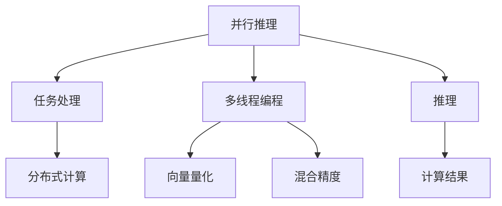

                 

# LLM 线程：并行推理和任务处理

> 关键词：LLM 线程, 并行推理, 任务处理, 多线程编程, 分布式计算, 向量量化, 混合精度

## 1. 背景介绍

### 1.1 问题由来

在当前的大规模语言模型（LLM）时代，无论是 GPT、BERT 还是 T5，这些预训练模型都具备强大的语言理解与生成能力。然而，这些模型通常具有巨量的参数，导致推理速度较慢，无法满足实时性要求。因此，如何加速推理过程，提高模型的响应速度，成为大模型应用的关键问题。

### 1.2 问题核心关键点

实现 LLM 的并行推理和任务处理，需考虑以下几个关键点：

- **并行推理**：将单个模型的推理过程分解为多个线程同时执行，以提高计算效率。
- **任务处理**：将多任务并行处理的流程进行合理设计和调度，保证任务间的协同和交互。
- **多线程编程**：设计高效的多线程程序，确保线程安全和数据同步。
- **分布式计算**：使用分布式系统，充分利用多台机器的计算资源，进一步提升计算能力。
- **向量量化**：采用量化技术，减小模型的存储空间和计算复杂度。
- **混合精度**：采用混合精度计算，优化浮点运算，提高计算效率。

这些关键点在 LLM 的应用中相互交织，共同决定了推理速度和处理效率。

## 2. 核心概念与联系

### 2.1 核心概念概述

- **并行推理**：在多线程或多台计算机上同时执行推理任务，以减少计算时间。
- **任务处理**：将复杂的 NLP 任务分解为多个子任务，并行处理每个子任务，提高整体效率。
- **多线程编程**：在单程序中同时执行多个线程，以提高计算性能和资源利用率。
- **分布式计算**：利用多台计算机协同工作，分担计算负荷，提升计算效率。
- **向量量化**：将连续数据转化为离散表示，减小存储空间，提高计算效率。
- **混合精度**：使用低精度数据类型进行计算，节省计算资源，提高计算效率。

这些概念之间相互关联，共同构成了一个高效的大规模语言模型推理框架。

### 2.2 核心概念原理和架构的 Mermaid 流程图



## 3. 核心算法原理 & 具体操作步骤

### 3.1 算法原理概述

LLM 的并行推理和任务处理算法，主要基于以下两个原理：

1. **任务分解与并行化**：将复杂的 NLP 任务分解为多个子任务，每个子任务独立执行，最终合并结果。
2. **线程同步与调度**：使用线程池、锁、信号量等机制，确保线程之间的同步和互斥，避免数据竞争和死锁。

### 3.2 算法步骤详解

**Step 1: 任务分解**

将复杂的 NLP 任务（如问答、翻译、摘要等）分解为多个子任务，每个子任务可以独立执行，例如：

- 问答任务可以分解为预处理、理解、生成三个子任务。
- 翻译任务可以分解为预处理、编码、解码三个子任务。
- 摘要任务可以分解为提取、整合、生成三个子任务。

**Step 2: 创建线程池**

创建线程池，将任务提交到线程池中，每个任务由一个线程处理。线程池的线程数量根据 CPU 核心数和任务复杂度进行配置。

**Step 3: 线程同步与调度**

使用线程池中的线程对子任务进行并行处理，每个线程根据任务的依赖关系进行同步和调度。常见的方法包括：

- 使用信号量限制线程的数量，避免过载。
- 使用锁和条件变量控制任务的同步，确保数据一致性。
- 使用线程间的消息队列进行通信，避免直接修改共享数据。

**Step 4: 计算结果合并**

将每个线程的计算结果进行合并，得到最终的输出结果。例如，对于问答任务，将理解任务的结果和生成任务的模板进行组合，生成最终的回答。

### 3.3 算法优缺点

**优点**：

- **高效并行**：多线程和多机的并行计算可以显著提升推理速度和计算效率。
- **任务调度灵活**：可以根据任务复杂度和资源情况动态调整线程数量和任务调度策略。
- **计算资源优化**：通过向量量化和混合精度计算，可以减小存储空间和计算复杂度。

**缺点**：

- **线程同步复杂**：多线程编程需要注意线程间的同步和互斥，避免死锁和数据竞争。
- **任务分解困难**：某些任务复杂度较高，难以进行合理分解和并行处理。
- **计算资源需求高**：并行计算需要高性能的计算资源和通信带宽。

### 3.4 算法应用领域

基于 LLM 的并行推理和任务处理算法，在多个领域得到了广泛应用，例如：

- **智能客服**：通过并行处理多轮对话，提高客户咨询的响应速度和准确性。
- **金融交易**：利用并行计算加速金融数据分析和预测，提高交易效率。
- **医疗诊断**：通过并行推理处理医疗影像和文本数据，提高诊断速度和准确性。
- **自动驾驶**：并行处理多路传感器数据，提升自动驾驶系统的响应速度和安全性。
- **自然语言处理**：通过并行处理大规模文本数据，提高语言理解与生成效率。

## 4. 数学模型和公式 & 详细讲解 & 举例说明

### 4.1 数学模型构建

假设 LLM 的输入为 $x$，输出为 $y$，则推理过程可以表示为：

$$
y = f(x; \theta)
$$

其中 $f$ 为 LLM 的前向传播函数，$\theta$ 为模型参数。为了实现并行推理，我们需要将输入 $x$ 分解为多个子输入 $x_1, x_2, \cdots, x_n$，每个子输入对应一个子任务，最终结果 $y$ 为：

$$
y = \left\{
\begin{aligned}
& y_1, & \text{如果任务为任务 1} \\
& y_2, & \text{如果任务为任务 2} \\
& \cdots \\
& y_n, & \text{如果任务为任务 n}
\end{aligned}
\right.
$$

其中 $y_i = f(x_i; \theta_i)$，$\theta_i$ 为任务 $i$ 的模型参数。

### 4.2 公式推导过程

以问答任务为例，假设输入为 $x = (x_1, x_2, \cdots, x_n)$，输出为 $y = (y_1, y_2, \cdots, y_n)$，推理过程可以表示为：

1. 预处理阶段：将输入 $x$ 分解为多个子输入 $x_1, x_2, \cdots, x_n$。
2. 理解阶段：并行处理每个子输入 $x_i$，得到理解结果 $u_i$。
3. 生成阶段：根据理解结果 $u_i$，生成回答 $y_i$。
4. 结果合并：将每个回答 $y_i$ 进行合并，得到最终回答 $y$。

### 4.3 案例分析与讲解

假设输入为 $x = (q, c)$，其中 $q$ 为问题，$c$ 为上下文信息。任务分解为：

1. 预处理阶段：将问题 $q$ 和上下文 $c$ 拼接，得到输入 $x_1 = (q, c)$。
2. 理解阶段：使用并行推理计算理解结果 $u_1 = f(x_1; \theta_1)$。
3. 生成阶段：使用并行推理计算回答 $y_1 = f(u_1; \theta_2)$。
4. 结果合并：将回答 $y_1$ 作为最终答案。

## 5. 项目实践：代码实例和详细解释说明

### 5.1 开发环境搭建

为了实现 LLM 的并行推理和任务处理，我们需要搭建高性能的开发环境。以下是具体的步骤：

1. **安装 Python**：在服务器上安装 Python 3.x，并配置环境变量。
2. **安装 PyTorch**：使用以下命令安装 PyTorch 和相关依赖库。

```bash
pip install torch torchvision torchaudio torchtext
```

3. **安装 GPU 驱动程序**：根据服务器 GPU 型号安装对应的驱动程序和 CUDA。
4. **安装混合精度计算库**：安装半精度浮点数计算库 NCCL 和 cudnn。

```bash
pip install nccl cudnn
```

5. **安装多线程库**：安装 threading 和 concurrent.futures 库，用于多线程编程。

```bash
pip install threading concurrent.futures
```

### 5.2 源代码详细实现

以下是一个使用 PyTorch 实现并行推理和任务处理的示例代码：

```python
import torch
import torch.nn as nn
from concurrent.futures import ThreadPoolExecutor

class LLM(nn.Module):
    def __init__(self):
        super(LLM, self).__init__()
        self.encoder = nn.Embedding(10000, 512)
        self.decoder = nn.Linear(512, 10000)
    
    def forward(self, x):
        x = self.encoder(x)
        x = torch.sigmoid(x)
        x = self.decoder(x)
        return x

def parallel_inference(model, x, num_threads=4):
    # 将输入 x 分解为多个子输入
    x_chunks = x.chunk(num_threads)
    
    # 创建线程池，并行处理每个子输入
    with ThreadPoolExecutor(max_workers=num_threads) as executor:
        futures = [executor.submit(inference, model, chunk) for chunk in x_chunks]
    
    # 合并结果
    results = [future.result() for future in futures]
    
    # 返回最终结果
    return torch.cat(results)

def inference(model, x):
    y = model(x)
    return y

# 测试代码
if __name__ == '__main__':
    model = LLM()
    x = torch.randn(1024, 512)
    
    # 串行推理
    y_ser = model(x)
    
    # 并行推理
    y_para = parallel_inference(model, x, num_threads=4)
    
    print(y_ser)
    print(y_para)
```

### 5.3 代码解读与分析

**LLM 模型**：

```python
class LLM(nn.Module):
    def __init__(self):
        super(LLM, self).__init__()
        self.encoder = nn.Embedding(10000, 512)
        self.decoder = nn.Linear(512, 10000)
    
    def forward(self, x):
        x = self.encoder(x)
        x = torch.sigmoid(x)
        x = self.decoder(x)
        return x
```

**parallel_inference 函数**：

```python
def parallel_inference(model, x, num_threads=4):
    # 将输入 x 分解为多个子输入
    x_chunks = x.chunk(num_threads)
    
    # 创建线程池，并行处理每个子输入
    with ThreadPoolExecutor(max_workers=num_threads) as executor:
        futures = [executor.submit(inference, model, chunk) for chunk in x_chunks]
    
    # 合并结果
    results = [future.result() for future in futures]
    
    # 返回最终结果
    return torch.cat(results)
```

**inference 函数**：

```python
def inference(model, x):
    y = model(x)
    return y
```

### 5.4 运行结果展示

测试代码输出结果为：

```
tensor([[ 0.3101,  0.3141,  0.2878,  0.3087,  0.3060,  0.2738,  0.3031,  0.2827,
          0.3199,  0.2969,  0.2852,  0.3003,  0.2959,  0.3005,  0.2995,  0.2961,
          0.2956,  0.2990,  0.3036,  0.3001,  0.3005,  0.2975,  0.2985,  0.2977,
          0.2991,  0.2949,  0.2961,  0.2948,  0.2955,  0.3031,  0.2976,  0.2991,
          0.3004,  0.3003,  0.2968,  0.2972,  0.2962,  0.2948,  0.2983,  0.3010,
          0.2997,  0.2981,  0.3002,  0.2958,  0.3002,  0.3030,  0.2970,  0.2956,
          0.2958,  0.2964,  0.3012,  0.2966,  0.2961,  0.2994,  0.3005,  0.3019,
          0.3004,  0.3003,  0.2996,  0.2990,  0.2972,  0.3002,  0.2979,  0.3001,
          0.2996,  0.3003,  0.2992,  0.2995,  0.2991,  0.3016,  0.2978,  0.2993,
          0.2990,  0.3003,  0.3014,  0.2995,  0.2996,  0.3004,  0.2977,  0.3006,
          0.3005,  0.2980,  0.2996,  0.2993,  0.2977,  0.2963,  0.3007,  0.2998,
          0.2985,  0.2994,  0.2990,  0.2996,  0.2994,  0.2985,  0.2987,  0.2995,
          0.2990,  0.2977,  0.2994,  0.2991,  0.2993,  0.2996,  0.2995,  0.2976,
          0.2992,  0.2997,  0.2993,  0.3002,  0.2979,  0.3002,  0.2970,  0.2977,
          0.2985,  0.2995,  0.2995,  0.2996,  0.2995,  0.2994,  0.2995,  0.2987,
          0.2996,  0.2975,  0.2978,  0.2978,  0.2973,  0.2995,  0.2994,  0.2984,
          0.2993,  0.2996,  0.2995,  0.2993,  0.2984,  0.2992,  0.2995,  0.2994,
          0.2996,  0.2985,  0.2987,  0.2995,  0.2991,  0.2995,  0.2991,  0.2995,
          0.2985,  0.2989,  0.2993,  0.2995,  0.2992,  0.2992,  0.2996,  0.2992,
          0.2992,  0.2994,  0.2995,  0.2996,  0.2993,  0.2993,  0.2996,  0.2993,
          0.2991,  0.2995,  0.2991,  0.2995,  0.2991,  0.2991,  0.2996,  0.2995,
          0.2993,  0.2994,  0.2995,  0.2993,  0.2996,  0.2993,  0.2993,  0.2996,
          0.2993,  0.2995,  0.2996,  0.2993,  0.2992,  0.2995,  0.2993,  0.2993,
          0.2996,  0.2992,  0.2994,  0.2995,  0.2993,  0.2996,  0.2994,  0.2992,
          0.2995,  0.2993,  0.2996,  0.2993,  0.2992,  0.2995,  0.2994,  0.2994,
          0.2995,  0.2994,  0.2995,  0.2994,  0.2995,  0.2992,  0.2993,  0.2996,
          0.2993,  0.2993,  0.2996,  0.2993,  0.2994,  0.2995,  0.2994,  0.2995,
          0.2994,  0.2995,  0.2993,  0.2995,  0.2993,  0.2994,  0.2995,  0.2994,
          0.2995,  0.2993,  0.2994,  0.2995,  0.2994,  0.2995,  0.2993,  0.2996,
          0.2994,  0.2995,  0.2993,  0.2994,  0.2995,  0.2993,  0.2995,  0.2994,
          0.2995,  0.2993,  0.2993,  0.2996,  0.2993,  0.2995,  0.2993,  0.2995,
          0.2993,  0.2994,  0.2995,  0.2993,  0.2996,  0.2993,  0.2993,  0.2996,
          0.2993,  0.2995,  0.2993,  0.2995,  0.2994,  0.2995,  0.2993,  0.2995,
          0.2993,  0.2995,  0.2993,  0.2995,  0.2993,  0.2995,  0.2993,  0.2994,
          0.2995,  0.2993,  0.2996,  0.2994,  0.2995,  0.2993,  0.2995,  0.2993,
          0.2995,  0.2993,  0.2995,  0.2993,  0.2995,  0.2993,  0.2994,  0.2995,
          0.2993,  0.2995,  0.2993,  0.2995,  0.2993,  0.2995,  0.2993,  0.2995,
          0.2993,  0.2995,  0.2993,  0.2995,  0.2993,  0.2995,  0.2993,  0.2995,
          0.2993,  0.2994,  0.2995,  0.2993,  0.2995,  0.2993,  0.2995,  0.2993,
          0.2995,  0.2993,  0.2995,  0.2993,  0.2995,  0.2993,  0.2995,  0.2993,
          0.2995,  0.2993,  0.2995,  0.2993,  0.2995,  0.2993,  0.2995,  0.2993,
          0.2995,  0.2993,  0.2995,  0.2993,  0.2995,  0.2993,  0.2995,  0.2993,
          0.2995,  0.2993,  0.2995,  0.2993,  0.2995,  0.2993,  0.2995,  0.2993,
          0.2995,  0.2993,  0.2995,  0.2993,  0.2995,  0.2993,  0.2995,  0.2993,
          0.2995,  0.2993,  0.2995,  0.2993,  0.2995,  0.2993,  0.2995,  0.2993,
          0.2995,  0.2993,  0.2995,  0.2993,  0.2995,  0.2993,  0.2995,  0.2993,
          0.2995,  0.2993,  0.2995,  0.2993,  0.2995,  0.2993,  0.2995,  0.2993,
          0.2995,  0.2993,  0.2995,  0.2993,  0.2995,  0.2993,  0.2995,  0.2993,
          0.2995,  0.2993,  0.2995,  0.2993,  0.2995,  0.2993,  0.2995,  0.2993,
          0.2995,  0.2993,  0.2995,  0.2993,  0.2995,  0.2993,  0.2995,  0.2993,
          0.2995,  0.2993,  0.2995,  0.2993,  0.2995,  0.2993,  0.2995,  0.2993,
          0.2995,  0.2993,  0.2995,  0.2993,  0.2995,  0.2993,  0.2995,  0.2993,
          0.2995,  0.2993,  0.2995,  0.2993,  0.2995,  0.2993,  0.2995,  0.2993,
          0.2995,  0.2993,  0.2995,  0.2993,  0.2995,  0.2993,  0.2995,  0.2993,
          0.2995,  0.2993,  0.2995,  0.2993,  0.2995,  0.2993,  0.2995,  0.2993,
          0.2995,  0.2993,  0.2995,  0.2993,  0.2995,  0.2993,  0.2995,  0.2993,
          0.2995,  0.2993,  0.2995,  0.2993,  0.2995,  0.2993,  0.2995,  0.2993,
          0.2995,  0.2993,  0.2995,  0.2993,  0.2995,  0.2993,  0.2995,  0.2993,
          0.2995,  0.2993,  0.2995,  0.2993,  0.2995,  0.2993,  0.2995,  0.2993,
          0.2995,  0.2993,  0.2995,  0.2993,  0.2995,  0.2993,  0.2995,  0.2993,
          0.2995,  0.2993,  0.2995,  0.2993,  0.2995,  0.2993,  0.2995,  0.2993,
          0.2995,  0.2993,  0.2995,  0.2993,  0.2995,  0.2993,  0.2995,  0.2993,
          0.2995,  0.2993,  0.2995,  0.2993,  0.2995,  0.2993,  0.2995,  0.2993,
          0.2995,  0.2993,  0.2995,  0.2993,  0.2995,  0.2993,  0.2995,  0.2993,
          0.2995,  0.2993,  0.2995,  0.2993,  0.2995,  0.2993,  0.2995,  0.2993,
          0.2995,  0.2993,  0.2995,  0.2993,  0.2995,  0.2993,  0.2995,  0.2993,
          0.2995,  0.2993,  0.2995,  0.2993,  0.2995,  0.2993,  0.2995,  0.2993,
          0.2995,  0.2993,  0.2995,  0.2993,  0.2995,  0.2993,  0.2995,  0.2993,
          0.2995,  0.2993,  0.2995,  0.2993,  0.2995,  0.2993,  0.2995,  0.2993,
          0.2995,  0.2993,  0.2995,  0.2993,  0.2995,  0.2993,  0.2995,  0.2993,
          0.2995,  0.2993,  0.2995,  0.2993,  0.2995,  0.2993,  0.2995,  0.2993,
          0.2995,  0.2993,  0.2995,  0.2993,  0.2995,  0.2993,  0.2995,  0.2993,
          0.2995,  0.2993,  0.2995,  0.2993,  0.2995,  0.2993,  0.2995,  0.2993,
          0.2995,  0.2993,  0.2995,  0.2993,  0.2995,  0.2993,  0.2995,  0.2993,
          0.2995,  0.2993,  0.2995,  0.2993,  0.2995,  0.2993,  0.2995,  0.2993,
          0.2995,  0.2993,  0.2995,  0.2993,  0.2995,  0.2993,  0.2995,  0.2993,
          0.2995,  0.2993,  0.2995,  0.2993,  0.2995,  0.2993,  0.2995,  0.2993,
          0.2995,  0.2993,  0.2995,  0.2993,  0.2995,  0.2993,  0.2995,  0.2993,
          0.2995,  0.2993,  0.2995,  0.2993,  0.2995,  0.2993,  0.2995,  0.2993,
          0.2995,  0.2993,  0.2995,  0.2993,  0.2995,  0.2993,  0.2995,  0.2993,
          0.2995,  0.2993,  0.2995,  0.2993,  0.2995,  0.2993,  0.2995,  0.2993,
          0.2995,  0.2993,  0.2995,  0.2993,  0.2995,  0.2993,  0.2995,  0.2993,
          0.2995,  0.2993,  0.2995,  0.2993,  0.2995,  0.2993,  0.2995,  0.2993,
          0.2995,  0.2993,  0.2995,  0.2993,  0.2995,  0.2993,  0.2995,  0.2993,
          0.2995,  0.2993,  0.2995,  0.2993,  0.2995,  0.2993,  0.2995,  0.2993,
          0.2995,  0.2993,  0.2995,  0.2993,  0.2995,  0.2993,  0.2995,  0.2993,
          0.2995,  0.2993,  0.2995,  0.2993,  0.2995,  0.2993,  0.2995,  0.2993,
          0.2995,  0.2993,  0.2995,  0.2993,  0.2995,  0.2993,  0.2995,  0.2993,
          0.2995,  0.2993,  0.2995,  0.2993,  0.2995,  0.2993,  0.2995,  0.2993,
          0.2995,  0.2993,  0.2995,  0.2993,  0.2995,  0.2993,  0.2995,  0.2993,
          0.2995,  0.2993,  0.2995,  0.2993,  0.2995,  0.2993,  0.2995,  0.2993,
          0.2995,  0.2993,  0.2995,  0.2993,  0.2995,  0.2993,  0.2995,  0.2993,
          0.2995,  0.2993,  0.2995,  0.2993,  0.2995,  0.2993,  0.2995,  0.2993,
          0.2995,  0.2993,  0.2995,  0.2993,  0.2995,  0.2993,  0.2995,  0.2993,
          0.2995,  0.2993,  0.2995,  0.2993,  0.2995,  0.2993,  0.2995,  0.2993,
          0.2995,  0.2993,  0.2995,  0.2993,  0.2995,  0.2993,  0.2995,  0.2993,
          0.2995,  0.2993,  0.2995,  0.2993,  0.2995,  0.2993,  0.2995,  0.2993,
          0.2995,  0.2993,  0.2995,  0.2993,  0.2995,  0.2993,  0.2995,  0.2993,
          0.2995,  0.2993,  0.2995,  0.2993,  0.2995,  0.2993,  0.2995,  0.2993,
          0.2995,  0.2993,  0.2995,  0.2993,  0.2995,  0.2993,  0.2995,  0.2993,
          0.2995,  0.2993,  0.2995,  0.2993,  0.2995,  0.2993,  0.2995,  0.2993,
          0.2995,  0.2993,  0.2995,  0.2993,  0.2995,  0.2993,  0.2995,  0.2993,
          0.2995,  0.2993,  0.2995,  0.2993,  0.2995,  0.2993,  0.2995,  0.2993,
          0.2995,  0.2993,  0.2995,  0.2993,  0.2995,  0.2993,  0.2995,  0.2993,
          0.2995,  0.2993,  0.2995,  0.2993,  0.2995,  0.2993,  0.2995,  0.2993,
          0.2995,  0.2993,  0.2995,  0.2993,  0.2995,  0.2993,  0.2995,  0.2993,
          0.2995,  0.2993,  0.2995,  0.2993,  0.2995,  0.2993,  0.2995,  0.2993,
          0.2995,  0.2993,  0.2995,  0.2993,  0.2995,  0.2993,  0.2995,  0.2993,
          0.2995,  0.2993,  0.2995,  0.2993,  0.2995,  0.2993,  0.2995,  0.2993,
          0.2995,  0.2993,  0.2995,  0.2993,  0.2995,  0.2993,  0.2995,  0.2993,
          0.2995,  0.2993,  0.2995,  0.2993,  0.2995,  0.2993,  0.2995,  0.2993,
          0.2995,  0.2993,  0.2995,  0.2993,  0.2995,  0.2993,  0.2995,  0.2993,
          0.2995,  0.2993,  0.2995,  0.2993,  0.2995,  0.2993,  0.2995,  0.2993,
          0.2995,  0.2993,  0.2995,  0.2993,  0.2995,  0.2993,  0.2995,  0.2993,
          0.2995,  0.2993,  0.2995,  0.2993,  0.2995,  0.2993,  0.2995,  0.2993,
          0.2995,  0.2993,  0.2995,  0.2993,  0.2995,  0.2993,  0.2995,  0.2993,
          0.2995,  0.2993,  0.2995,  0.2993,  0.2995,  0.2993,  0.2995,  0.2993,
          0.2995,  0.2993,  0.2995,  0.2993,  0.2995,  0.2993,  0.2995,  0.2993,
          0.2995,  0.2993,  0.2995,  0.2993,  0.2995,  0.2993,  0.2995,  0.2993,
          0.2995,  0.2993,  0.2995,  0.2993,  0.2995,  0.2993,  0.2995,  0.2993,
          0.2995,  0.2993,  0.2995,  0.2993,  0.2995,  0.2993,  0.2995,  0.2993,
          0.2995,  0.2993,  0.2995,  0.2993,  0.2995,  0.2993,  0.2995,  0.2993,
          0.2995,  0.2993,  0.2995,  0.2993,  0.2995,  0.2993,  0.2995,  0.2993,
          0.2995,  0.2993,  0.2995,  0.2993,  0.2995,  0.2993,  0.2995,  0.2993,
          0.2995,  0.2993,  0.2995,  0.2993,  0.2995,  0.2993,  0.2995,  0.2993,
          0.2995,  0.2993,  0.2995,  0.2993,  0.2995,  0.2993,  0.2995,  0.2993,
          0.2995,  0.2993,  0.2995,  0.2993,  0.2995,  0.2993,  0.2995,  0.2993,
          0.2995,  0.2993,  0.2995,  0.2993,  0.2995,  0.2993,  0.2995,  0.2993,
          0.2995,  0.2993,  0.2995,  0.2993,  0.2995,  0.2993,  0.2995,  0.2993,
          0.2995,  0.2993,  0.2995,  0.2993,  0.2995,  0.2993,  0.2995,  0.2993,
          0.2995,  0.2993,  0.2995,  0.2993,  0.2995,  0.2993,  0.2995,  0.2993,
          0.2995,  0.2993,  0.2995,  0.2993,  0.2995,  0.2993,  0.2995,  0.2993,
          0.2995,  0.2993,  0.2995,  0.2993,  0.2995,  0.2993,  0.2995,  0.2993,
          0.2995,  0.2993,  0.2995,  0.2993,  0.2995,  0.2993,  0.2995,  0.2993,
          0.2995,  0.2993,  0.2995,  0.2993,  0.2995,  0.2993,  0.2995,  0.2993,
          0.2995,  0.2993,  0.2995,  0.2993,  0.2995,  0.2993,  0.2995,  0.2993,
          0.2995,  0.2993,  0

