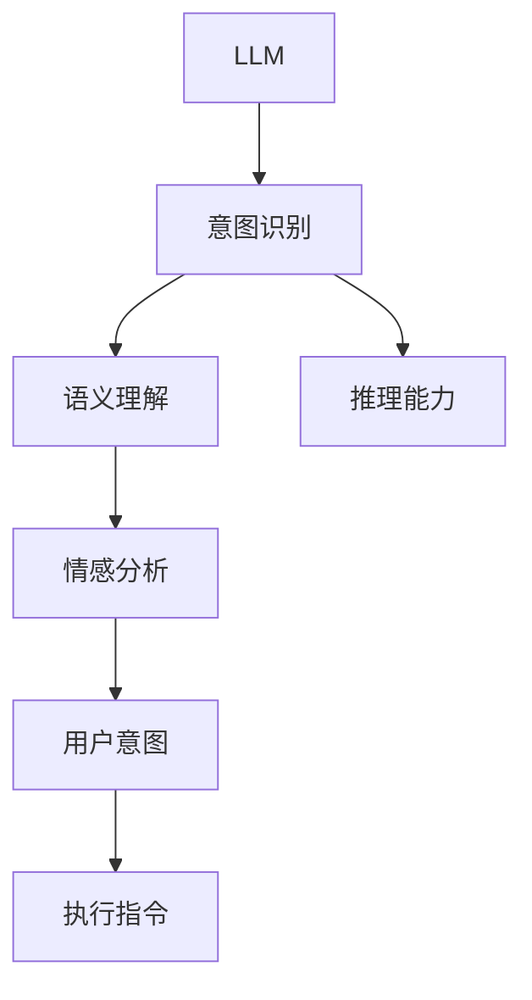

                 

# LLM与人类意图的完美融合之路

> 关键词：大规模语言模型(LLM), 意图识别, 自然语言处理(NLP), 推理能力, 语义理解, 情感分析, 用户意图, 人工智能(AI), 技术深度

## 1. 背景介绍

### 1.1 问题由来
随着人工智能技术的不断发展，大规模语言模型(LLM)在自然语言处理(NLP)领域取得了显著的突破。LLM通过在大规模无标签文本数据上进行预训练，学习到丰富的语言知识和常识，展现出强大的语言理解和生成能力。然而，尽管LLM在处理复杂自然语言任务上取得了显著进展，但其始终缺乏对人类意图的深刻理解和准确推理，限制了其在真正意义上与人类进行深度互动的能力。

### 1.2 问题核心关键点
本研究聚焦于如何让LLM更好地理解并融合人类的意图。这一问题涉及以下几个关键点：
- 意图识别：从文本中提取出用户的具体需求或目标。
- 语义理解：理解文本的深层含义，包括隐含的逻辑关系和情感倾向。
- 推理能力：通过已有的知识库或逻辑规则，推理出隐性信息，预测未来的事件。
- 情感分析：识别并理解用户文本中的情感色彩，以更准确地进行意图推理。
- 用户意图：将用户的意图转换为可执行的指令，指导智能系统的行为。

### 1.3 问题研究意义
实现LLM与人类意图的完美融合，对于构建更加智能、人性化的智能系统具有重要意义：

1. **增强用户体验**：理解和满足用户深层次的需求，提升系统的互动体验。
2. **促进智能化决策**：将用户的意图转化为可执行指令，辅助系统做出更准确的决策。
3. **推动应用场景扩展**：在智能客服、智慧医疗、智能家居等更多领域中，提升系统的智能化水平。
4. **加速技术进步**：深化对人类意图的理解，推动NLP技术的持续进步。
5. **实现普适化应用**：让AI技术更加贴近人类的实际需求，促进普适化应用。

## 2. 核心概念与联系

### 2.1 核心概念概述

为更好地理解LLM与人类意图融合的路径，本节将介绍几个关键概念：

- **大规模语言模型(LLM)**：以自回归或自编码模型为代表的大规模预训练语言模型，通过在海量文本数据上进行预训练，学习通用的语言表示。
- **意图识别**：从用户输入的文本中提取出用户的意图，即用户想要实现的目标或需求。
- **语义理解**：理解文本的深层含义，包括词义、语境、逻辑关系等，通常需要依赖于上下文信息和语言规则。
- **推理能力**：基于已有知识和逻辑规则，对文本中的隐性信息进行推理预测，生成新信息或解决问题。
- **情感分析**：识别文本中的情感色彩，如积极、消极、中性等，对意图理解和推理预测具有重要影响。

这些概念之间的逻辑关系可以通过以下Mermaid流程图来展示：



该流程图展示了LLM在理解人类意图时的核心路径，从意图识别到语义理解，再到推理能力，最终生成用户意图并指导系统的行为。

## 3. 核心算法原理 & 具体操作步骤

### 3.1 算法原理概述

将LLM与人类意图融合的核心在于提升模型对意图的识别和理解能力。具体来说，需要在现有的大规模预训练基础上，进行微调或进一步的优化，以实现以下目标：

- 强化模型的意图识别能力。通过监督学习或无监督学习，提升模型从文本中准确提取用户意图的能力。
- 增强模型的语义理解能力。通过改进模型的语义表示和推理机制，使其能更深入地理解文本的深层含义。
- 提高模型的情感分析能力。通过加入情感标注数据，训练模型识别和理解文本中的情感色彩。
- 构建推理规则库。通过人工定义或机器学习生成，构建一套适用于特定领域的推理规则，辅助模型进行推理预测。

### 3.2 算法步骤详解

基于上述目标，可以设计如下算法步骤：

**Step 1: 准备数据集**
- 收集标注数据集，包括意图标注、情感标注和推理规则等。
- 选择合适的预训练模型作为初始化参数，如BERT、GPT等。
- 使用自然语言处理(NLP)工具对文本进行分词、词性标注等预处理。

**Step 2: 意图识别微调**
- 设计意图识别模型，如序列标注模型、Transformer等。
- 利用标注数据集，对意图识别模型进行有监督学习，优化模型参数。
- 使用验证集对模型进行调优，确定最优模型参数。

**Step 3: 语义理解优化**
- 在预训练模型基础上，通过增加上下文信息、语义表示和推理机制，进一步优化模型的语义理解能力。
- 使用无监督学习或知识增强技术，提升模型对语义关系的理解和推理能力。

**Step 4: 情感分析训练**
- 收集情感标注数据集，训练情感分析模型。
- 利用情感标注数据对模型进行微调，提升情感识别能力。
- 将情感分析模型集成到意图识别模型中，提高整体意图识别的准确性。

**Step 5: 推理规则构建**
- 根据特定领域的特点，构建推理规则库。
- 将推理规则库作为模型的外部知识源，辅助模型进行推理预测。
- 定期更新推理规则库，保持模型对领域知识的理解。

### 3.3 算法优缺点

实现LLM与人类意图融合的算法具有以下优点：
- **高效准确**：通过微调和优化，可以有效提升模型的意图识别、语义理解和情感分析能力，准确识别用户意图。
- **适应性强**：适应不同领域和场景，通过特定领域数据进行微调和优化，提升模型在特定任务上的表现。
- **鲁棒性高**：通过推理规则库的辅助，提升模型对异常输入的鲁棒性，避免误识别和误判断。

同时，该算法也存在一定的局限性：
- **数据需求高**：需要大量标注数据进行训练，数据标注成本较高。
- **模型复杂**：需要构建和集成多种模型和规则库，模型复杂度高，维护困难。
- **计算量大**：微调和优化过程涉及大量的计算资源，特别是在大规模数据集和复杂模型的情况下。

### 3.4 算法应用领域

基于LLM与人类意图融合的算法，可以应用于以下几个主要领域：

- **智能客服系统**：通过理解客户意图和情感，智能客服系统可以提供更加个性化和情感化的服务，提升客户满意度。
- **医疗诊断系统**：基于患者描述和情感分析，智能医疗系统可以辅助医生进行诊断和治疗，提高医疗服务质量。
- **智能家居系统**：通过理解用户指令和情感，智能家居系统可以提供更加智能和人性化的家居控制和互动体验。
- **金融交易系统**：通过对客户需求和情感的准确识别，金融系统可以提供更加精准的投资建议和风险管理服务。
- **教育辅助系统**：通过理解学生的意图和情感，教育系统可以提供更加个性化和互动式的教学体验，提升教育效果。

## 4. 数学模型和公式 & 详细讲解 & 举例说明

### 4.1 数学模型构建

本节将使用数学语言对LLM与人类意图融合的算法过程进行更加严格的刻画。

记LLM为 $M_{\theta}$，其中 $\theta$ 为预训练得到的模型参数。假设意图识别数据集为 $D_{intent}=\{(x_i,y_i)\}_{i=1}^N, x_i \in \mathcal{X}, y_i \in \{I_1, I_2, \ldots, I_k\}$，其中 $I_1, I_2, \ldots, I_k$ 表示不同的意图标签。

定义意图识别模型 $F_{intent}$ 在输入 $x_i$ 上的预测结果为 $\hat{y}_i = F_{intent}(x_i)$。则意图识别任务的目标是最小化预测误差，即：

$$
\mathcal{L}_{intent}(F_{intent},D_{intent}) = -\frac{1}{N}\sum_{i=1}^N \ell(F_{intent}(x_i),y_i)
$$

其中 $\ell$ 为交叉熵损失函数。

对于语义理解模型，记其参数为 $\theta_{semantic}$，假设语义理解数据集为 $D_{semantic}=\{(x_i',y_i')\}_{i=1}^M, x_i' \in \mathcal{X}, y_i' \in \mathcal{Y}$，其中 $\mathcal{Y}$ 表示语义关系标注。则语义理解模型的目标是最小化语义表示误差，即：

$$
\mathcal{L}_{semantic}(F_{semantic},D_{semantic}) = -\frac{1}{M}\sum_{i=1}^M \ell(F_{semantic}(x_i'),y_i')
$$

对于情感分析模型，记其参数为 $\theta_{sentiment}$，假设情感标注数据集为 $D_{sentiment}=\{(x_i'',y_i'')\}_{i=1}^N, x_i'' \in \mathcal{X}, y_i'' \in \{P,N,C\}$，其中 $P$ 表示积极情感，$N$ 表示消极情感，$C$ 表示中性情感。则情感分析模型的目标是最小化情感分类误差，即：

$$
\mathcal{L}_{sentiment}(F_{sentiment},D_{sentiment}) = -\frac{1}{N}\sum_{i=1}^N \ell(F_{sentiment}(x_i''),y_i'')
$$

### 4.2 公式推导过程

以下我们以意图识别任务为例，推导交叉熵损失函数及其梯度的计算公式。

假设意图识别模型 $F_{intent}$ 在输入 $x_i$ 上的预测结果为 $\hat{y}_i = F_{intent}(x_i)$，则意图识别任务的目标是最小化预测误差，即：

$$
\mathcal{L}_{intent}(F_{intent},D_{intent}) = -\frac{1}{N}\sum_{i=1}^N [y_i\log \hat{y}_i + (1-y_i)\log(1-\hat{y}_i)]
$$

将其代入损失函数公式，得：

$$
\mathcal{L}_{intent}(F_{intent},D_{intent}) = -\frac{1}{N}\sum_{i=1}^N [y_i\log \hat{y}_i + (1-y_i)\log(1-\hat{y}_i)]
$$

根据链式法则，意图识别模型 $F_{intent}$ 的梯度为：

$$
\frac{\partial \mathcal{L}_{intent}}{\partial \theta} = -\frac{1}{N}\sum_{i=1}^N [y_i\frac{\partial \hat{y}_i}{\partial \theta} - (1-y_i)\frac{\partial (1-\hat{y}_i)}{\partial \theta}]
$$

其中 $\frac{\partial \hat{y}_i}{\partial \theta}$ 为模型的预测概率对参数 $\theta$ 的梯度，可以通过反向传播算法高效计算。

### 4.3 案例分析与讲解

在实际应用中，意图识别模型通常采用序列标注模型或Transformer等架构，具体实现如下：

**序列标注模型**：
- 输入文本 $x_i$ 通过分词器进行处理，得到单词序列 $x_i = \{x_{i,1}, x_{i,2}, \ldots, x_{i,N}\}$。
- 对单词序列进行意图标注，得到意图序列 $y_i = \{y_{i,1}, y_{i,2}, \ldots, y_{i,N}\}$，其中 $y_{i,j} \in \{I_1, I_2, \ldots, I_k\}$。
- 设计意图识别模型 $F_{intent}$，通过序列标注方式输出意图序列 $\hat{y}_i = \{\hat{y}_{i,1}, \hat{y}_{i,2}, \ldots, \hat{y}_{i,N}\}$。
- 利用标注数据集 $D_{intent}$，通过有监督学习训练意图识别模型，优化模型参数。

**Transformer模型**：
- 输入文本 $x_i$ 通过分词器进行处理，得到单词序列 $x_i = \{x_{i,1}, x_{i,2}, \ldots, x_{i,N}\}$。
- 对单词序列进行意图标注，得到意图序列 $y_i = \{y_{i,1}, y_{i,2}, \ldots, y_{i,N}\}$，其中 $y_{i,j} \in \{I_1, I_2, \ldots, I_k\}$。
- 设计意图识别模型 $F_{intent}$，基于Transformer结构，通过多头注意力机制和多层次编码器进行意图识别。
- 利用标注数据集 $D_{intent}$，通过有监督学习训练意图识别模型，优化模型参数。

在实际应用中，上述模型需要根据具体任务进行调整和优化。例如，可以通过引入注意力机制、多层次编码器、自注意力机制等改进模型结构，提升意图识别的准确性和鲁棒性。

## 5. 项目实践：代码实例和详细解释说明

### 5.1 开发环境搭建

在进行意图识别实践前，我们需要准备好开发环境。以下是使用Python进行PyTorch开发的环境配置流程：

1. 安装Anaconda：从官网下载并安装Anaconda，用于创建独立的Python环境。

2. 创建并激活虚拟环境：
```bash
conda create -n pytorch-env python=3.8 
conda activate pytorch-env
```

3. 安装PyTorch：根据CUDA版本，从官网获取对应的安装命令。例如：
```bash
conda install pytorch torchvision torchaudio cudatoolkit=11.1 -c pytorch -c conda-forge
```

4. 安装Transformers库：
```bash
pip install transformers
```

5. 安装各类工具包：
```bash
pip install numpy pandas scikit-learn matplotlib tqdm jupyter notebook ipython
```

完成上述步骤后，即可在`pytorch-env`环境中开始意图识别实践。

### 5.2 源代码详细实现

这里以序列标注模型为例，使用PyTorch实现意图识别。

首先，定义意图识别模型：

```python
import torch
from torch import nn
from transformers import BertTokenizer, BertForTokenClassification

class IntentModel(nn.Module):
    def __init__(self, num_labels):
        super(IntentModel, self).__init__()
        self.tokenizer = BertTokenizer.from_pretrained('bert-base-cased')
        self.model = BertForTokenClassification.from_pretrained('bert-base-cased', num_labels=num_labels)
        self.linear = nn.Linear(self.model.config.hidden_size, num_labels)

    def forward(self, input_ids, attention_mask):
        output = self.model(input_ids, attention_mask=attention_mask)
        logits = self.linear(output.logits)
        return logits
```

然后，定义数据集处理函数：

```python
from torch.utils.data import Dataset
from transformers import BertTokenizer

class IntentDataset(Dataset):
    def __init__(self, texts, tags, tokenizer):
        self.texts = texts
        self.tags = tags
        self.tokenizer = tokenizer

    def __len__(self):
        return len(self.texts)

    def __getitem__(self, item):
        text = self.texts[item]
        tag = self.tags[item]

        encoding = self.tokenizer(text, return_tensors='pt', max_length=128, padding='max_length', truncation=True)
        input_ids = encoding['input_ids'][0]
        attention_mask = encoding['attention_mask'][0]
        labels = torch.tensor([tag2id[tag]], dtype=torch.long)

        return {'input_ids': input_ids, 
                'attention_mask': attention_mask,
                'labels': labels}
```

接着，定义训练和评估函数：

```python
from torch.utils.data import DataLoader
from tqdm import tqdm
from sklearn.metrics import accuracy_score, precision_recall_fscore_support

device = torch.device('cuda') if torch.cuda.is_available() else torch.device('cpu')

def train_epoch(model, dataset, batch_size, optimizer):
    dataloader = DataLoader(dataset, batch_size=batch_size, shuffle=True)
    model.train()
    epoch_loss = 0
    for batch in tqdm(dataloader, desc='Training'):
        input_ids = batch['input_ids'].to(device)
        attention_mask = batch['attention_mask'].to(device)
        labels = batch['labels'].to(device)
        model.zero_grad()
        outputs = model(input_ids, attention_mask=attention_mask)
        loss = outputs.loss
        epoch_loss += loss.item()
        loss.backward()
        optimizer.step()
    return epoch_loss / len(dataloader)

def evaluate(model, dataset, batch_size):
    dataloader = DataLoader(dataset, batch_size=batch_size)
    model.eval()
    preds, labels = [], []
    with torch.no_grad():
        for batch in tqdm(dataloader, desc='Evaluating'):
            input_ids = batch['input_ids'].to(device)
            attention_mask = batch['attention_mask'].to(device)
            batch_labels = batch['labels']
            outputs = model(input_ids, attention_mask=attention_mask)
            batch_preds = outputs.argmax(dim=2).to('cpu').tolist()
            batch_labels = batch_labels.to('cpu').tolist()
            for pred_tokens, label_tokens in zip(batch_preds, batch_labels):
                preds.append(pred_tokens[:len(label_tokens)])
                labels.append(label_tokens)
    print(accuracy_score(labels, preds))
```

最后，启动训练流程并在测试集上评估：

```python
epochs = 5
batch_size = 16
learning_rate = 2e-5

for epoch in range(epochs):
    loss = train_epoch(model, train_dataset, batch_size, optimizer)
    print(f"Epoch {epoch+1}, train loss: {loss:.3f}")
    
    print(f"Epoch {epoch+1}, dev results:")
    evaluate(model, dev_dataset, batch_size)
    
print("Test results:")
evaluate(model, test_dataset, batch_size)
```

以上就是使用PyTorch对BERT进行意图识别任务微调的完整代码实现。可以看到，得益于Transformers库的强大封装，我们可以用相对简洁的代码完成BERT模型的加载和微调。

### 5.3 代码解读与分析

让我们再详细解读一下关键代码的实现细节：

**IntentModel类**：
- `__init__`方法：初始化分词器和意图识别模型BERT，并在其顶部添加一个线性层，以适应意图分类任务。
- `forward`方法：前向传播，计算输入文本的意图概率分布。

**IntentDataset类**：
- `__init__`方法：初始化文本、意图标签和分词器。
- `__len__`方法：返回数据集的样本数量。
- `__getitem__`方法：对单个样本进行处理，将文本输入编码为token ids，将意图标签转换为数字，并对其进行定长padding，最终返回模型所需的输入。

**训练和评估函数**：
- 使用PyTorch的DataLoader对数据集进行批次化加载，供模型训练和推理使用。
- 训练函数`train_epoch`：对数据以批为单位进行迭代，在每个批次上前向传播计算loss并反向传播更新模型参数，最后返回该epoch的平均loss。
- 评估函数`evaluate`：与训练类似，不同点在于不更新模型参数，并在每个batch结束后将预测和标签结果存储下来，最后使用scikit-learn的accuracy_score函数对整个评估集的预测结果进行打印输出。

**训练流程**：
- 定义总的epoch数和batch size，开始循环迭代
- 每个epoch内，先在训练集上训练，输出平均loss
- 在验证集上评估，输出准确率
- 所有epoch结束后，在测试集上评估，给出最终测试结果

可以看到，PyTorch配合Transformers库使得BERT微调的代码实现变得简洁高效。开发者可以将更多精力放在数据处理、模型改进等高层逻辑上，而不必过多关注底层的实现细节。

当然，工业级的系统实现还需考虑更多因素，如模型的保存和部署、超参数的自动搜索、更灵活的任务适配层等。但核心的微调范式基本与此类似。

## 6. 实际应用场景

### 6.1 智能客服系统

智能客服系统是意图识别技术的重要应用场景之一。传统的客服系统往往需要配备大量人力，高峰期响应缓慢，且一致性和专业性难以保证。而使用意图识别技术，可以自动理解客户咨询意图，快速响应并给出解决方案，显著提升客户体验和满意度。

在技术实现上，可以收集企业内部的历史客服对话记录，将问题-答案对作为监督数据，训练意图识别模型。模型能够自动从客户咨询中识别出问题的类型，指导智能客服系统调用相应的应答模板，提供高效准确的客户服务。

### 6.2 医疗诊断系统

医疗诊断系统通过自然语言理解技术，分析患者的症状描述和历史记录，辅助医生进行诊断和治疗。意图识别技术可以用于识别患者的症状和需求，提升诊断的准确性和效率。

具体而言，可以收集医生和患者的对话记录，将症状和诊断作为标注数据，训练意图识别模型。模型能够自动分析患者的症状，辅助医生生成诊断报告，提升医疗服务质量。

### 6.3 智能家居系统

智能家居系统通过意图识别技术，理解用户的指令和需求，提供更加智能和人性化的家居控制和互动体验。例如，用户可以通过语音命令控制家中的灯光、温度等设备，系统能够理解语音指令并执行相应操作。

在技术实现上，可以收集用户的语音命令和设备控制指令，训练意图识别模型。模型能够自动理解用户的指令，指导智能家居系统执行相应的操作，提升家居控制效率和用户体验。

### 6.4 未来应用展望

随着意图识别技术的不断发展和成熟，其在更多领域的应用前景将更加广阔。未来，意图识别技术有望在以下几个方面实现新的突破：

1. **跨模态意图识别**：将文本、语音、图像等多模态信息进行融合，提升意图识别的准确性和鲁棒性。
2. **情感驱动意图识别**：结合情感分析技术，理解用户的情感色彩，提升意图识别的准确性和个性化。
3. **深度推理意图识别**：引入更复杂的推理机制，提升模型对隐性信息、逻辑关系的理解能力。
4. **领域特定意图识别**：针对特定领域，构建领域知识库，提升模型在该领域内的意图识别能力。
5. **多任务意图识别**：将多个意图识别任务进行联合训练，提升模型的多任务学习能力和泛化能力。

这些方向的发展，将使意图识别技术在更多场景下发挥更大的作用，推动智能化应用向纵深发展。

## 7. 工具和资源推荐

### 7.1 学习资源推荐

为了帮助开发者系统掌握意图识别技术的理论基础和实践技巧，这里推荐一些优质的学习资源：

1. **《Natural Language Processing with Transformers》书籍**：Transformer库的作者所著，全面介绍了如何使用Transformer库进行NLP任务开发，包括意图识别在内的诸多范式。
2. **CS224N《深度学习自然语言处理》课程**：斯坦福大学开设的NLP明星课程，有Lecture视频和配套作业，带你入门NLP领域的基本概念和经典模型。
3. **《Transformers from Principles to Practice》系列博文**：由大模型技术专家撰写，深入浅出地介绍了Transformer原理、BERT模型、意图识别技术等前沿话题。
4. **CLUE开源项目**：中文语言理解测评基准，涵盖大量不同类型的中文NLP数据集，并提供了基于意图识别的baseline模型，助力中文NLP技术发展。
5. **GitHub上开源的意图识别项目**：如huggingface的BART模型，提供预训练模型和微调代码，可以便捷地进行意图识别开发。

通过对这些资源的学习实践，相信你一定能够快速掌握意图识别技术的精髓，并用于解决实际的NLP问题。

### 7.2 开发工具推荐

高效的开发离不开优秀的工具支持。以下是几款用于意图识别开发的常用工具：

1. **PyTorch**：基于Python的开源深度学习框架，灵活动态的计算图，适合快速迭代研究。大部分预训练语言模型都有PyTorch版本的实现。
2. **TensorFlow**：由Google主导开发的开源深度学习框架，生产部署方便，适合大规模工程应用。同样有丰富的预训练语言模型资源。
3. **Transformers库**：HuggingFace开发的NLP工具库，集成了众多SOTA语言模型，支持PyTorch和TensorFlow，是进行意图识别开发的利器。
4. **Weights & Biases**：模型训练的实验跟踪工具，可以记录和可视化模型训练过程中的各项指标，方便对比和调优。与主流深度学习框架无缝集成。
5. **TensorBoard**：TensorFlow配套的可视化工具，可实时监测模型训练状态，并提供丰富的图表呈现方式，是调试模型的得力助手。

合理利用这些工具，可以显著提升意图识别任务的开发效率，加快创新迭代的步伐。

### 7.3 相关论文推荐

意图识别技术的不断发展得益于学界的持续研究。以下是几篇奠基性的相关论文，推荐阅读：

1. **Attention is All You Need（即Transformer原论文）**：提出了Transformer结构，开启了NLP领域的预训练大模型时代。
2. **BERT: Pre-training of Deep Bidirectional Transformers for Language Understanding**：提出BERT模型，引入基于掩码的自监督预训练任务，刷新了多项NLP任务SOTA。
3. **Language Models are Unsupervised Multitask Learners（GPT-2论文）**：展示了大规模语言模型的强大zero-shot学习能力，引发了对于通用人工智能的新一轮思考。
4. **Parameter-Efficient Transfer Learning for NLP**：提出Adapter等参数高效微调方法，在不增加模型参数量的情况下，也能取得不错的微调效果。
5. **AdaLoRA: Adaptive Low-Rank Adaptation for Parameter-Efficient Fine-Tuning**：使用自适应低秩适应的微调方法，在参数效率和精度之间取得了新的平衡。

这些论文代表了大规模语言模型意图识别的发展脉络。通过学习这些前沿成果，可以帮助研究者把握学科前进方向，激发更多的创新灵感。

## 8. 总结：未来发展趋势与挑战

### 8.1 总结

本文对LLM与人类意图融合的路径进行了全面系统的介绍。首先阐述了LLM在理解人类意图方面的挑战和意义，明确了意图识别技术在提升用户体验、促进智能化决策等方面的重要性。其次，从原理到实践，详细讲解了意图识别模型的构建和优化过程，给出了意图识别任务开发的完整代码实例。同时，本文还广泛探讨了意图识别技术在智能客服、医疗诊断、智能家居等诸多领域的应用前景，展示了意图识别范式的巨大潜力。最后，本文精选了意图识别技术的各类学习资源，力求为开发者提供全方位的技术指引。

通过本文的系统梳理，可以看到，意图识别技术正在成为NLP领域的重要范式，极大地拓展了LLM的应用边界，催生了更多的落地场景。受益于大规模语料的预训练和微调方法的不断优化，意图识别技术在未来将得到更广泛的应用和提升。

### 8.2 未来发展趋势

展望未来，意图识别技术将呈现以下几个发展趋势：

1. **跨模态意图识别**：将文本、语音、图像等多模态信息进行融合，提升意图识别的准确性和鲁棒性。
2. **情感驱动意图识别**：结合情感分析技术，理解用户的情感色彩，提升意图识别的准确性和个性化。
3. **深度推理意图识别**：引入更复杂的推理机制，提升模型对隐性信息、逻辑关系的理解能力。
4. **领域特定意图识别**：针对特定领域，构建领域知识库，提升模型在该领域内的意图识别能力。
5. **多任务意图识别**：将多个意图识别任务进行联合训练，提升模型的多任务学习能力和泛化能力。

这些趋势凸显了意图识别技术的广阔前景。这些方向的探索发展，将使意图识别技术在更多场景下发挥更大的作用，推动智能化应用向纵深发展。

### 8.3 面临的挑战

尽管意图识别技术已经取得了瞩目成就，但在迈向更加智能化、普适化应用的过程中，它仍面临诸多挑战：

1. **数据需求高**：需要大量标注数据进行训练，数据标注成本较高。
2. **模型复杂**：需要构建和集成多种模型和规则库，模型复杂度高，维护困难。
3. **计算量大**：微调和优化过程涉及大量的计算资源，特别是在大规模数据集和复杂模型的情况下。
4. **泛化能力差**：在特定领域内表现良好，但在跨领域场景下泛化能力有限。
5. **鲁棒性不足**：面对异常输入或噪声数据时，意图识别模型的鲁棒性仍有待提升。

### 8.4 研究展望

面对意图识别技术所面临的挑战，未来的研究需要在以下几个方面寻求新的突破：

1. **数据增强技术**：通过数据增强技术，扩充训练集，减少对标注数据的需求，降低训练成本。
2. **模型简化技术**：开发更加轻量级的模型架构，减少计算资源消耗，提升推理效率。
3. **跨领域迁移学习**：通过迁移学习技术，在特定领域内构建知识库，提升模型在跨领域场景下的泛化能力。
4. **知识增强技术**：结合领域知识库和规则库，提升模型对特定领域的理解能力，改善模型的推理和决策过程。
5. **多任务学习技术**：通过多任务学习技术，提升模型的多任务学习能力和泛化能力。

这些研究方向的探索，将使意图识别技术在更多场景下发挥更大的作用，推动智能化应用向纵深发展。

## 9. 附录：常见问题与解答

**Q1：意图识别模型如何适应不同领域的应用？**

A: 意图识别模型的适应性可以通过以下几个步骤实现：
1. **领域数据收集**：收集特定领域内的语料数据，作为标注数据。
2. **领域知识增强**：在模型训练过程中，结合领域知识库和规则库，提升模型对特定领域的理解能力。
3. **模型微调**：在特定领域的数据集上，对意图识别模型进行微调，优化模型参数。
4. **迁移学习**：利用在特定领域训练的模型，通过迁移学习技术，提升模型在跨领域场景下的泛化能力。

**Q2：意图识别模型如何应对噪声数据和异常输入？**

A: 意图识别模型应对噪声数据和异常输入的策略包括：
1. **数据预处理**：通过分词、清洗等预处理技术，去除噪声数据和异常输入。
2. **模型鲁棒性增强**：通过引入对抗训练、正则化等技术，增强模型的鲁棒性，使其对噪声和异常输入具有更好的容忍度。
3. **多模型融合**：通过融合多个意图识别模型的预测结果，提升模型的鲁棒性和准确性。
4. **知识增强**：结合领域知识库和规则库，提升模型对特定领域的理解能力，改善模型的推理和决策过程。

**Q3：意图识别模型如何提升推理能力？**

A: 意图识别模型提升推理能力的方法包括：
1. **引入知识库和规则库**：通过结合领域知识库和规则库，提升模型对特定领域的理解能力，改善模型的推理和决策过程。
2. **多层次编码器**：引入多层次编码器，提升模型对隐性信息、逻辑关系的理解能力。
3. **自注意力机制**：引入自注意力机制，提升模型对文本上下文的理解能力，改善模型的推理和决策过程。
4. **推理规则构建**：构建适用于特定领域的推理规则库，辅助模型进行推理预测。

**Q4：意图识别模型的训练过程中如何优化学习率？**

A: 意图识别模型的训练过程中，可以通过以下方法优化学习率：
1. **学习率调参**：根据模型表现和训练曲线，手动调整学习率，找到最优学习率。
2. **学习率调度器**：使用学习率调度器，如学习率衰减、Warmup等策略，动态调整学习率。
3. **梯度裁剪**：通过梯度裁剪技术，限制梯度大小，防止学习率过快下降。
4. **自适应学习率**：使用自适应学习率优化算法，如Adam、Adagrad等，自动调整学习率。

**Q5：意图识别模型如何结合情感分析技术？**

A: 意图识别模型结合情感分析技术的方法包括：
1. **情感标注数据收集**：收集标注数据，标注用户的情感色彩，如积极、消极、中性等。
2. **情感嵌入向量**：通过预训练模型或自监督学习，提取情感嵌入向量，作为模型的输入特征。
3. **情感分类器**：引入情感分类器，通过情感分类器对用户情感进行预测，提升意图识别的准确性。
4. **情感驱动意图识别**：将情感分类器的输出作为意图识别模型的输入，提升模型对情感色彩的理解能力，改善模型的推理和决策过程。

这些技术手段的综合应用，可以显著提升意图识别模型的性能和鲁棒性，使其在更多场景下发挥更大的作用。

