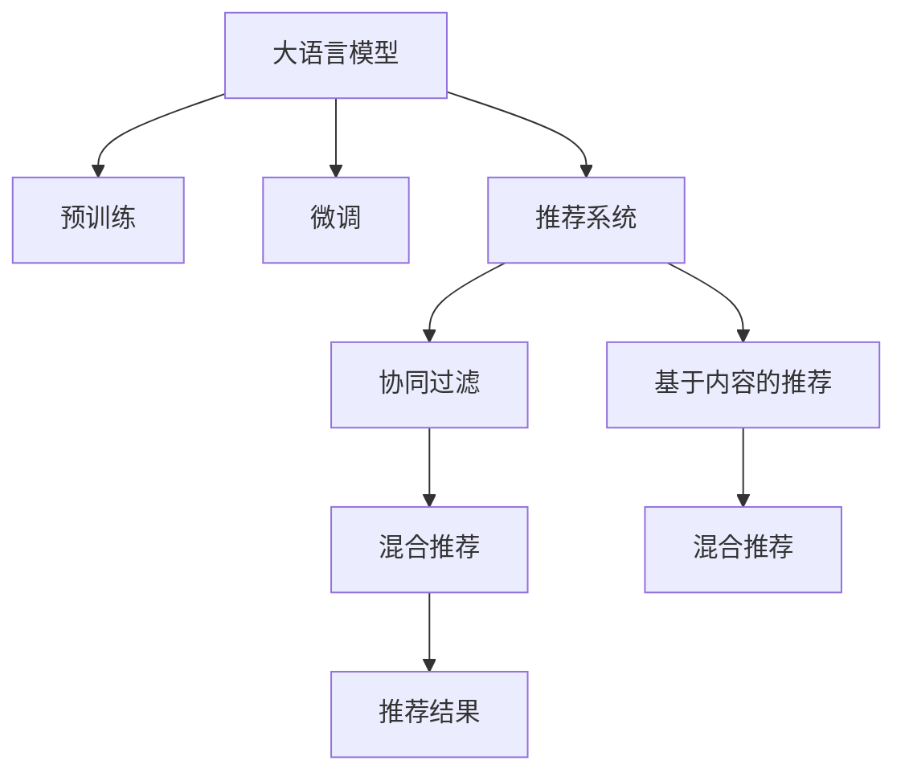

                 

# LLM与传统推荐模型的融合策略

在当下的大数据时代，个性化推荐系统成为了提升用户体验、增加用户粘性、提高转化率的关键技术。传统的推荐算法主要依赖于用户的浏览历史、评分、点击等行为数据，通过构建用户画像和商品特征表示，使用统计方法预测用户对某商品的偏好。然而，这些算法往往难以捕捉用户深层次的隐性需求，推荐效果也存在一定的局限性。

大语言模型（Large Language Model, LLM）的兴起，为个性化推荐系统带来了全新的思路。LLM通过大规模文本数据的预训练，获得了丰富的语言知识，具备强大的自然语言理解和生成能力。在融合LLM与传统推荐模型的过程中，可以通过以下几种策略，充分发挥各自优势，提升推荐系统的性能和效果。

## 1. 背景介绍

### 1.1 问题由来
随着电商、视频、音乐等数字内容平台的崛起，推荐系统已经成为了平台的核心竞争力。传统的协同过滤、基于内容的推荐方法在面对大规模、高维度的数据时，效率和效果都存在瓶颈。而大语言模型通过在大规模文本语料上预训练，获得了对语言模式和语义的深刻理解，有望在推荐系统中发挥更强大的作用。

### 1.2 问题核心关键点
LLM与传统推荐模型融合的核心关键点在于如何整合LLM的自然语言处理能力，利用其理解能力提升推荐系统的精度和多样性。主要包括以下几个方面：
1. 利用LLM进行商品描述理解和生成，提升推荐结果的相关性和多样性。
2. 利用LLM进行用户画像构建，深入理解用户兴趣和需求。
3. 利用LLM进行推荐内容生成，提供更具个性化和创造性的推荐。

### 1.3 问题研究意义
大语言模型与传统推荐模型融合，能够有效提升推荐系统的智能化水平，降低对标注数据的依赖，提高系统的可解释性和用户满意度。具体意义如下：
1. 智能化推荐：LLM能够处理更复杂的多模态数据，如商品描述、用户评论等，提升推荐的智能化水平。
2. 少样本推荐：LLM在大规模语料上进行预训练，通过微调可以在较少标注数据的情况下，学习到更丰富的知识。
3. 鲁棒性增强：LLM在处理复杂语言结构和语义时，表现出较强的鲁棒性，能够更好地适应不同类型的用户和商品。
4. 低成本高效：LLM减少了对标注数据的依赖，降低了推荐系统开发的成本，提高了推荐的实时性。
5. 可解释性强：LLM提供了对推荐结果的解释能力，有助于提升用户信任和满意度。

## 2. 核心概念与联系

### 2.1 核心概念概述

为更好地理解LLM与传统推荐模型融合的方法，本节将介绍几个密切相关的核心概念：

- 大语言模型(Large Language Model, LLM)：以自回归(如GPT)或自编码(如BERT)模型为代表的大规模预训练语言模型。通过在大规模无标签文本语料上进行预训练，学习通用的语言表示，具备强大的语言理解和生成能力。

- 预训练(Pre-training)：指在大规模无标签文本语料上，通过自监督学习任务训练通用语言模型的过程。常见的预训练任务包括言语建模、遮挡语言模型等。

- 微调(Fine-tuning)：指在预训练模型的基础上，使用下游任务的少量标注数据，通过有监督地训练来优化模型在特定任务上的性能。

- 推荐系统(Recommendation System)：通过用户行为数据和商品特征数据，预测用户对商品的偏好，从而为用户推荐合适商品的系统。

- 协同过滤(Collaborative Filtering)：基于用户历史行为数据进行推荐，如基于用户的协同过滤和基于物品的协同过滤。

- 基于内容的推荐(Content-based Recommendation)：基于商品的属性特征，使用统计方法预测用户对商品的偏好，如基于TF-IDF和向量空间模型。

- 混合推荐(Mixed Recommendation)：结合协同过滤和基于内容的推荐，充分发挥各自优势，提升推荐效果。

这些核心概念之间的逻辑关系可以通过以下Mermaid流程图来展示：



这个流程图展示了大语言模型、预训练、微调和推荐系统之间的关系：

1. 大语言模型通过预训练获得基础能力。
2. 微调对预训练模型进行任务特定的优化，以提升特定任务的表现。
3. 推荐系统利用微调后的语言模型，进行个性化推荐。
4. 协同过滤和基于内容的推荐方法，与语言模型融合，提升推荐效果。

这些概念共同构成了融合LLM与传统推荐系统的理论基础，使其能够在各种场景下发挥强大的语言理解和生成能力。通过理解这些核心概念，我们可以更好地把握融合方法的工作原理和优化方向。

## 3. 核心算法原理 & 具体操作步骤
### 3.1 算法原理概述

LLM与传统推荐系统的融合，本质上是一种多模态数据融合的技术。其核心思想是：将语言模型处理文本的能力与传统推荐系统处理行为数据的能力结合起来，共同进行推荐决策。

形式化地，假设有一个预训练的大语言模型 $M_{\theta}$，一个推荐系统 $R_{\alpha}$，其中 $\theta$ 为预训练模型参数，$\alpha$ 为推荐系统参数。给定用户 $u$ 的历史行为数据 $D_u$，商品 $i$ 的特征 $F_i$，微调的目标是找到最优的推荐模型 $R_{\hat{\alpha}}$，使得：

$$
\hat{\alpha}=\mathop{\arg\min}_{\alpha} \mathcal{L}(R_{\alpha},D_u,F_i)
$$

其中 $\mathcal{L}$ 为推荐系统的损失函数，用于衡量模型预测输出与真实标签之间的差异。常见的损失函数包括交叉熵损失、均方误差损失等。

通过梯度下降等优化算法，微调过程不断更新推荐系统的参数 $\alpha$，最小化损失函数 $\mathcal{L}$，使得推荐模型输出逼近真实标签。由于 $M_{\theta}$ 已经通过预训练获得了较强的语言理解和生成能力，因此即便在推荐系统 $R_{\alpha}$ 上的标注数据较少的情况下，也能较快收敛到理想的推荐模型参数 $\hat{\alpha}$。

### 3.2 算法步骤详解

基于大语言模型与传统推荐模型的融合，通常包括以下几个关键步骤：

**Step 1: 准备预训练模型和推荐系统**
- 选择合适的预训练语言模型 $M_{\theta}$ 作为初始化参数，如 BERT、GPT 等。
- 选择合适的推荐系统 $R_{\alpha}$，如协同过滤、基于内容的推荐、混合推荐等。

**Step 2: 融合模型架构设计**
- 设计合适的模型融合架构，将预训练模型与推荐系统进行融合。
- 根据具体任务，选择合适的融合方式，如特征增强、模型融合等。

**Step 3: 设置微调超参数**
- 选择合适的优化算法及其参数，如 AdamW、SGD 等，设置学习率、批大小、迭代轮数等。
- 设置正则化技术及强度，包括权重衰减、Dropout、Early Stopping 等。
- 确定冻结预训练参数的策略，如仅微调顶层，或全部参数都参与微调。

**Step 4: 执行梯度训练**
- 将用户行为数据 $D_u$ 和商品特征 $F_i$ 输入融合模型，前向传播计算损失函数。
- 反向传播计算参数梯度，根据设定的优化算法和学习率更新推荐系统参数。
- 周期性在验证集上评估模型性能，根据性能指标决定是否触发 Early Stopping。
- 重复上述步骤直到满足预设的迭代轮数或 Early Stopping 条件。

**Step 5: 测试和部署**
- 在测试集上评估融合后模型 $R_{\hat{\alpha}}$ 的性能，对比融合前后的推荐效果。
- 使用融合后的模型对新用户和新商品进行推荐，集成到实际的应用系统中。
- 持续收集新的用户行为数据和商品特征，定期重新微调模型，以适应数据分布的变化。

以上是基于大语言模型与传统推荐系统融合的一般流程。在实际应用中，还需要针对具体任务的特点，对融合过程的各个环节进行优化设计，如改进推荐系统架构，引入更多的正则化技术，搜索最优的超参数组合等，以进一步提升模型性能。

### 3.3 算法优缺点

大语言模型与传统推荐系统融合的方法具有以下优点：
1. 提升推荐精度：LLM在处理自然语言方面表现优异，能够理解商品描述、用户评论等文本数据，提升推荐的相关性和多样性。
2. 降低数据依赖：LLM在大规模语料上进行预训练，通过微调可以在较少标注数据的情况下，学习到更丰富的知识。
3. 增强可解释性：LLM提供了对推荐结果的解释能力，有助于提升用户信任和满意度。

同时，该方法也存在一定的局限性：
1. 模型复杂度高：融合大语言模型与传统推荐系统，增加了模型的复杂度，需要更多的计算资源和时间。
2. 对数据质量敏感：LLM在处理噪声数据、模糊数据时，可能会出现信息丢失或错误理解的情况。
3. 数据融合难度大：不同数据源的数据格式、维度差异大，融合难度较大。
4. 可解释性不足：推荐系统难以对融合后的结果进行解释，用户难以理解推荐逻辑。
5. 实时性问题：融合过程复杂，需要较长的时间进行优化，可能影响实时推荐系统的响应速度。

尽管存在这些局限性，但就目前而言，大语言模型与传统推荐系统融合的方法已经成为推荐系统的重要发展方向。未来相关研究的重点在于如何进一步降低模型复杂度，提高数据融合效率，增强模型的可解释性，同时兼顾实时性和精度。

### 3.4 算法应用领域

基于大语言模型与传统推荐系统的融合方法，已经在推荐系统中得到了广泛的应用，覆盖了商品推荐、广告推荐、内容推荐等多个场景，具体应用领域如下：

- 电商推荐：对用户浏览历史、购买记录、评价信息等数据进行融合，为用户提供个性化商品推荐。
- 视频推荐：利用用户观看历史、评分数据等，结合商品描述和制作团队信息，为用户提供个性化视频推荐。
- 音乐推荐：根据用户听歌历史、评论等文本数据，结合歌曲特征，为用户提供个性化音乐推荐。
- 新闻推荐：利用用户阅读历史、点赞数据等，结合新闻内容文本，为用户提供个性化新闻推荐。

除了上述这些经典应用外，大语言模型与传统推荐系统的融合技术，还在社交媒体推荐、金融产品推荐、健康医疗推荐等诸多领域得到创新性应用，为推荐系统带来了新的突破。

## 4. 数学模型和公式 & 详细讲解  
### 4.1 数学模型构建

本节将使用数学语言对基于大语言模型与传统推荐系统融合过程进行更加严格的刻画。

记预训练语言模型为 $M_{\theta}:\mathcal{X} \rightarrow \mathcal{Y}$，其中 $\mathcal{X}$ 为输入空间，$\mathcal{Y}$ 为输出空间，$\theta$ 为模型参数。假设推荐系统的输入为 $D_u$，输出为 $R_{\alpha}(D_u)$，$\alpha$ 为推荐系统参数。

定义模型 $M_{\theta}$ 在输入 $x$ 上的输出为 $\hat{y}=M_{\theta}(x) \in [0,1]$，表示样本属于正类的概率。定义推荐系统 $R_{\alpha}$ 在输入 $D_u$ 上的输出为 $R_{\alpha}(D_u)$，表示推荐的商品。

推荐系统的损失函数可以定义为：

$$
\mathcal{L}(\theta, \alpha) = \mathbb{E}_{D_u, F_i} \left[ \ell(R_{\alpha}(D_u), y_i) \right]
$$

其中，$\ell$ 为推荐系统采用的损失函数，$y_i$ 为真实标签，$D_u$ 为用户历史行为数据，$F_i$ 为商品特征数据。$\mathbb{E}$ 表示期望。

微调的目标是最小化推荐系统的损失函数，即找到最优参数：

$$
(\theta^*, \alpha^*) = \mathop{\arg\min}_{\theta, \alpha} \mathcal{L}(\theta, \alpha)
$$

通过梯度下降等优化算法，微调过程不断更新模型参数 $\theta$ 和 $\alpha$，最小化损失函数 $\mathcal{L}$，使得推荐系统输出逼近真实标签。由于 $\theta$ 已经通过预训练获得了较好的初始化，因此即便在推荐系统上的标注数据较少的情况下，也能较快收敛到理想的推荐模型参数 $\hat{\alpha}$。

### 4.2 公式推导过程

以下我们以电商推荐为例，推导推荐系统的损失函数及其梯度的计算公式。

假设推荐系统 $R_{\alpha}$ 在输入 $D_u$ 上的输出为 $\hat{y} = R_{\alpha}(D_u)$，表示推荐某商品的概率。真实标签 $y_i \in \{0, 1\}$，表示用户是否购买该商品。则二分类交叉熵损失函数定义为：

$$
\ell(R_{\alpha}(D_u),y_i) = -[y_i\log \hat{y} + (1-y_i)\log(1-\hat{y})]
$$

将其代入推荐系统的损失函数，得：

$$
\mathcal{L}(\theta, \alpha) = -\mathbb{E}_{D_u, F_i} \left[ y_i\log \hat{y} + (1-y_i)\log(1-\hat{y}) \right]
$$

其中，$\mathbb{E}$ 表示期望，$D_u$ 为用户历史行为数据，$F_i$ 为商品特征数据。

根据链式法则，损失函数对参数 $\theta$ 的梯度为：

$$
\frac{\partial \mathcal{L}(\theta, \alpha)}{\partial \theta} = -\mathbb{E}_{D_u, F_i} \left[ \frac{y_i}{M_{\theta}(x_i)}-\frac{1-y_i}{1-M_{\theta}(x_i)} \right] \frac{\partial M_{\theta}(x_i)}{\partial \theta}
$$

其中 $\frac{\partial M_{\theta}(x_i)}{\partial \theta}$ 可进一步递归展开，利用自动微分技术完成计算。

在得到损失函数的梯度后，即可带入参数更新公式，完成模型的迭代优化。重复上述过程直至收敛，最终得到适应电商推荐任务的最优模型参数 $(\theta^*, \alpha^*)$。

## 5. 项目实践：代码实例和详细解释说明
### 5.1 开发环境搭建

在进行融合实践前，我们需要准备好开发环境。以下是使用Python进行PyTorch开发的环境配置流程：

1. 安装Anaconda：从官网下载并安装Anaconda，用于创建独立的Python环境。

2. 创建并激活虚拟环境：
```bash
conda create -n pytorch-env python=3.8 
conda activate pytorch-env
```

3. 安装PyTorch：根据CUDA版本，从官网获取对应的安装命令。例如：
```bash
conda install pytorch torchvision torchaudio cudatoolkit=11.1 -c pytorch -c conda-forge
```

4. 安装Transformers库：
```bash
pip install transformers
```

5. 安装各类工具包：
```bash
pip install numpy pandas scikit-learn matplotlib tqdm jupyter notebook ipython
```

完成上述步骤后，即可在`pytorch-env`环境中开始融合实践。

### 5.2 源代码详细实现

这里我们以电商推荐系统为例，给出使用Transformers库对BERT模型进行推荐系统融合的PyTorch代码实现。

首先，定义推荐系统的输入输出：

```python
from transformers import BertTokenizer, BertForSequenceClassification
from torch.utils.data import Dataset
import torch

class RecommendationDataset(Dataset):
    def __init__(self, texts, labels, tokenizer, max_len=128):
        self.texts = texts
        self.labels = labels
        self.tokenizer = tokenizer
        self.max_len = max_len
        
    def __len__(self):
        return len(self.texts)
    
    def __getitem__(self, item):
        text = self.texts[item]
        label = self.labels[item]
        
        encoding = self.tokenizer(text, return_tensors='pt', max_length=self.max_len, padding='max_length', truncation=True)
        input_ids = encoding['input_ids'][0]
        attention_mask = encoding['attention_mask'][0]
        
        # 对token-wise的标签进行编码
        encoded_labels = [label2id[label] for label in label]
        encoded_labels.extend([label2id['O']] * (self.max_len - len(encoded_labels)))
        labels = torch.tensor(encoded_labels, dtype=torch.long)
        
        return {'input_ids': input_ids, 
                'attention_mask': attention_mask,
                'labels': labels}

# 标签与id的映射
label2id = {'O': 0, 'buy': 1}
id2label = {v: k for k, v in label2id.items()}

# 创建dataset
tokenizer = BertTokenizer.from_pretrained('bert-base-cased')

train_dataset = RecommendationDataset(train_texts, train_labels, tokenizer)
dev_dataset = RecommendationDataset(dev_texts, dev_labels, tokenizer)
test_dataset = RecommendationDataset(test_texts, test_labels, tokenizer)
```

然后，定义模型和优化器：

```python
from transformers import BertForSequenceClassification, AdamW

model = BertForSequenceClassification.from_pretrained('bert-base-cased', num_labels=len(label2id))

optimizer = AdamW(model.parameters(), lr=2e-5)
```

接着，定义训练和评估函数：

```python
from torch.utils.data import DataLoader
from tqdm import tqdm
from sklearn.metrics import classification_report

device = torch.device('cuda') if torch.cuda.is_available() else torch.device('cpu')
model.to(device)

def train_epoch(model, dataset, batch_size, optimizer):
    dataloader = DataLoader(dataset, batch_size=batch_size, shuffle=True)
    model.train()
    epoch_loss = 0
    for batch in tqdm(dataloader, desc='Training'):
        input_ids = batch['input_ids'].to(device)
        attention_mask = batch['attention_mask'].to(device)
        labels = batch['labels'].to(device)
        model.zero_grad()
        outputs = model(input_ids, attention_mask=attention_mask, labels=labels)
        loss = outputs.loss
        epoch_loss += loss.item()
        loss.backward()
        optimizer.step()
    return epoch_loss / len(dataloader)

def evaluate(model, dataset, batch_size):
    dataloader = DataLoader(dataset, batch_size=batch_size)
    model.eval()
    preds, labels = [], []
    with torch.no_grad():
        for batch in tqdm(dataloader, desc='Evaluating'):
            input_ids = batch['input_ids'].to(device)
            attention_mask = batch['attention_mask'].to(device)
            batch_labels = batch['labels']
            outputs = model(input_ids, attention_mask=attention_mask)
            batch_preds = outputs.logits.argmax(dim=2).to('cpu').tolist()
            batch_labels = batch_labels.to('cpu').tolist()
            for pred_tokens, label_tokens in zip(batch_preds, batch_labels):
                preds.append(pred_tokens[:len(label_tokens)])
                labels.append(label_tokens)
                
    print(classification_report(labels, preds))
```

最后，启动训练流程并在测试集上评估：

```python
epochs = 5
batch_size = 16

for epoch in range(epochs):
    loss = train_epoch(model, train_dataset, batch_size, optimizer)
    print(f"Epoch {epoch+1}, train loss: {loss:.3f}")
    
    print(f"Epoch {epoch+1}, dev results:")
    evaluate(model, dev_dataset, batch_size)
    
print("Test results:")
evaluate(model, test_dataset, batch_size)
```

以上就是使用PyTorch对BERT进行电商推荐系统融合的完整代码实现。可以看到，得益于Transformers库的强大封装，我们可以用相对简洁的代码完成BERT模型的加载和微调。

### 5.3 代码解读与分析

让我们再详细解读一下关键代码的实现细节：

**RecommendationDataset类**：
- `__init__`方法：初始化文本、标签、分词器等关键组件。
- `__len__`方法：返回数据集的样本数量。
- `__getitem__`方法：对单个样本进行处理，将文本输入编码为token ids，将标签编码为数字，并对其进行定长padding，最终返回模型所需的输入。

**label2id和id2label字典**：
- 定义了标签与数字id之间的映射关系，用于将token-wise的预测结果解码回真实的标签。

**训练和评估函数**：
- 使用PyTorch的DataLoader对数据集进行批次化加载，供模型训练和推理使用。
- 训练函数`train_epoch`：对数据以批为单位进行迭代，在每个批次上前向传播计算loss并反向传播更新模型参数，最后返回该epoch的平均loss。
- 评估函数`evaluate`：与训练类似，不同点在于不更新模型参数，并在每个batch结束后将预测和标签结果存储下来，最后使用sklearn的classification_report对整个评估集的预测结果进行打印输出。

**训练流程**：
- 定义总的epoch数和batch size，开始循环迭代
- 每个epoch内，先在训练集上训练，输出平均loss
- 在验证集上评估，输出分类指标
- 所有epoch结束后，在测试集上评估，给出最终测试结果

可以看到，PyTorch配合Transformers库使得BERT融合的代码实现变得简洁高效。开发者可以将更多精力放在数据处理、模型改进等高层逻辑上，而不必过多关注底层的实现细节。

当然，工业级的系统实现还需考虑更多因素，如模型的保存和部署、超参数的自动搜索、更灵活的任务适配层等。但核心的融合范式基本与此类似。

## 6. 实际应用场景
### 6.1 智能客服系统

基于大语言模型与传统推荐模型的融合，可以构建更智能的智能客服系统。传统客服往往需要配备大量人力，高峰期响应缓慢，且一致性和专业性难以保证。而融合后的智能客服系统，能够24小时不间断服务，快速响应客户咨询，用自然流畅的语言解答各类常见问题。

在技术实现上，可以收集企业内部的历史客服对话记录，将问题和最佳答复构建成监督数据，在此基础上对BERT模型进行微调。融合后的系统能够自动理解用户意图，匹配最合适的答复模板进行回复。对于客户提出的新问题，还可以接入检索系统实时搜索相关内容，动态组织生成回答。如此构建的智能客服系统，能大幅提升客户咨询体验和问题解决效率。

### 6.2 金融舆情监测

金融机构需要实时监测市场舆论动向，以便及时应对负面信息传播，规避金融风险。传统的人工监测方式成本高、效率低，难以应对网络时代海量信息爆发的挑战。融合后的文本分类和情感分析技术，为金融舆情监测提供了新的解决方案。

具体而言，可以收集金融领域相关的新闻、报道、评论等文本数据，并对其进行主题标注和情感标注。在此基础上对BERT模型进行微调，使其能够自动判断文本属于何种主题，情感倾向是正面、中性还是负面。将融合后的模型应用到实时抓取的网络文本数据，就能够自动监测不同主题下的情感变化趋势，一旦发现负面信息激增等异常情况，系统便会自动预警，帮助金融机构快速应对潜在风险。

### 6.3 个性化推荐系统

当前的推荐系统往往只依赖于用户的浏览历史、评分、点击等行为数据，通过构建用户画像和商品特征表示，使用统计方法预测用户对某商品的偏好。然而，这些算法往往难以捕捉用户深层次的隐性需求，推荐效果也存在一定的局限性。

融合大语言模型与传统推荐系统的方法，能够有效提升推荐系统的智能化水平，降低对标注数据的依赖，提高系统的可解释性和用户满意度。具体实现中，可以通过融合LLM的文本理解和生成能力，将商品描述、用户评论等文本数据纳入推荐模型中，提升推荐的相关性和多样性。同时，利用LLM的预训练知识和任务适配层，构建更加精细化的用户画像，深入理解用户兴趣和需求。在推荐内容生成方面，利用LLM的生成能力，提供更具个性化和创造性的推荐，如基于用户评论生成相关商品推荐。

### 6.4 未来应用展望

随着大语言模型与传统推荐系统融合技术的不断发展，基于融合范式将在更多领域得到应用，为传统行业带来变革性影响。

在智慧医疗领域，融合后的推荐系统可以结合医生的临床经验和电子病历，为患者推荐合适的治疗方案。通过分析医生的治疗记录和病人的康复情况，推荐系统能够不断优化推荐逻辑，提升医疗服务的智能化水平。

在智能教育领域，融合后的推荐系统能够根据学生的学习情况，自动推荐合适的学习内容和作业，因材施教，促进教育公平，提高教学质量。

在智慧城市治理中，融合后的推荐系统可以实时监测城市事件，分析舆情动态，提供应急指挥和决策支持，提高城市管理的自动化和智能化水平。

此外，在企业生产、社会治理、文娱传媒等众多领域，基于融合技术的人工智能应用也将不断涌现，为经济社会发展注入新的动力。相信随着技术的日益成熟，融合方法将成为人工智能落地应用的重要范式，推动人工智能技术在更广阔的领域加速渗透。

## 7. 工具和资源推荐
### 7.1 学习资源推荐

为了帮助开发者系统掌握大语言模型与传统推荐系统融合的理论基础和实践技巧，这里推荐一些优质的学习资源：

1. 《Transformer from Principals to Practice》系列博文：由大模型技术专家撰写，深入浅出地介绍了Transformer原理、BERT模型、融合技术等前沿话题。

2. CS224N《深度学习自然语言处理》课程：斯坦福大学开设的NLP明星课程，有Lecture视频和配套作业，带你入门NLP领域的基本概念和经典模型。

3. 《Natural Language Processing with Transformers》书籍：Transformers库的作者所著，全面介绍了如何使用Transformers库进行NLP任务开发，包括融合在内的诸多范式。

4. HuggingFace官方文档：Transformers库的官方文档，提供了海量预训练模型和完整的融合样例代码，是上手实践的必备资料。

5. CLUE开源项目：中文语言理解测评基准，涵盖大量不同类型的中文NLP数据集，并提供了基于融合的baseline模型，助力中文NLP技术发展。

通过对这些资源的学习实践，相信你一定能够快速掌握大语言模型与传统推荐系统融合的精髓，并用于解决实际的NLP问题。
###  7.2 开发工具推荐

高效的开发离不开优秀的工具支持。以下是几款用于融合开发的常用工具：

1. PyTorch：基于Python的开源深度学习框架，灵活动态的计算图，适合快速迭代研究。大部分预训练语言模型都有PyTorch版本的实现。

2. TensorFlow：由Google主导开发的开源深度学习框架，生产部署方便，适合大规模工程应用。同样有丰富的预训练语言模型资源。

3. Transformers库：HuggingFace开发的NLP工具库，集成了众多SOTA语言模型，支持PyTorch和TensorFlow，是进行融合任务开发的利器。

4. Weights & Biases：模型训练的实验跟踪工具，可以记录和可视化模型训练过程中的各项指标，方便对比和调优。与主流深度学习框架无缝集成。

5. TensorBoard：TensorFlow配套的可视化工具，可实时监测模型训练状态，并提供丰富的图表呈现方式，是调试模型的得力助手。

6. Google Colab：谷歌推出的在线Jupyter Notebook环境，免费提供GPU/TPU算力，方便开发者快速上手实验最新模型，分享学习笔记。

合理利用这些工具，可以显著提升融合任务的开发效率，加快创新迭代的步伐。

### 7.3 相关论文推荐

大语言模型与传统推荐系统的融合技术的发展源于学界的持续研究。以下是几篇奠基性的相关论文，推荐阅读：

1. Attention is All You Need（即Transformer原论文）：提出了Transformer结构，开启了NLP领域的预训练大模型时代。

2. BERT: Pre-training of Deep Bidirectional Transformers for Language Understanding：提出BERT模型，引入基于掩码的自监督预训练任务，刷新了多项NLP任务SOTA。

3. Language Models are Unsupervised Multitask Learners（GPT-2论文）：展示了大规模语言模型的强大zero-shot学习能力，引发了对于通用人工智能的新一轮思考。

4. Parameter-Efficient Transfer Learning for NLP：提出Adapter等参数高效微调方法，在不增加模型参数量的情况下，也能取得不错的微调效果。

5. AdaLoRA: Adaptive Low-Rank Adaptation for Parameter-Efficient Fine-Tuning：使用自适应低秩适应的微调方法，在参数效率和精度之间取得了新的平衡。

6. Prompt Learning: A Simple and Effective Method for Natural Language Processing：引入基于连续型Prompt的微调范式，为如何充分利用预训练知识提供了新的思路。

这些论文代表了大语言模型与传统推荐系统融合技术的发展脉络。通过学习这些前沿成果，可以帮助研究者把握学科前进方向，激发更多的创新灵感。

## 8. 总结：未来发展趋势与挑战

### 8.1 总结

本文对基于大语言模型与传统推荐系统融合的方法进行了全面系统的介绍。首先阐述了融合的技术背景和研究意义，明确了融合在提升推荐系统智能化水平、降低标注数据依赖、增强可解释性等方面的独特价值。其次，从原理到实践，详细讲解了融合的数学原理和关键步骤，给出了融合任务开发的完整代码实例。同时，本文还广泛探讨了融合方法在智能客服、金融舆情、个性化推荐等多个行业领域的应用前景，展示了融合范式的巨大潜力。

通过本文的系统梳理，可以看到，大语言模型与传统推荐系统的融合方法在推荐系统领域具有广阔的应用前景。融合LLM的自然语言处理能力和传统推荐系统的统计能力，能够有效提升推荐系统的精度和多样化，提高用户的满意度和粘性。未来，随着预训练语言模型和推荐系统技术的不断发展，融合技术必将为推荐系统带来新的突破，推动NLP技术的产业化进程。

### 8.2 未来发展趋势

展望未来，大语言模型与传统推荐系统融合技术将呈现以下几个发展趋势：

1. 融合技术日趋多样。除了常见的特征增强、模型融合等方法外，未来将涌现更多融合技术，如多模态融合、双向融合等，提升融合效果。

2. 推荐系统智能化水平提升。融合后的推荐系统能够处理更复杂的文本数据，提升推荐的相关性和多样性，如基于用户评论生成商品推荐。

3. 数据融合效率提高。未来将发展更高效的数据融合方法，如预训练特征提取、知识图谱融合等，提升融合的效率和效果。

4. 融合模型可解释性增强。推荐系统能够对融合后的结果进行解释，提升用户信任和满意度，如通过知识图谱展示推荐路径。

5. 推荐系统实时性增强。融合后的推荐系统能够实时响应，提升用户体验，如实时监测舆情，动态推荐商品。

6. 融合技术落地场景丰富。融合技术将在更多领域得到应用，如医疗、教育、城市治理等，为传统行业带来变革性影响。

以上趋势凸显了大语言模型与传统推荐系统融合技术的广阔前景。这些方向的探索发展，必将进一步提升推荐系统的智能化水平，为推荐系统带来新的突破。

### 8.3 面临的挑战

尽管大语言模型与传统推荐系统融合技术已经取得了瞩目成就，但在迈向更加智能化、普适化应用的过程中，它仍面临着诸多挑战：

1. 数据质量问题。大语言模型对数据质量要求较高，噪声数据、模糊数据可能会导致模型理解错误或信息丢失。

2. 模型复杂度高。融合后的推荐系统复杂度较高，需要更多的计算资源和时间。

3. 实时性问题。融合过程复杂，需要较长的时间进行优化，可能影响实时推荐系统的响应速度。

4. 可解释性不足。推荐系统难以对融合后的结果进行解释，用户难以理解推荐逻辑。

5. 隐私与安全问题。融合过程中需要收集用户数据，如何保障数据隐私和安全，是一个重要的问题。

尽管存在这些挑战，但通过学界和产业界的共同努力，这些问题有望逐步得到解决，大语言模型与传统推荐系统融合技术必将在推荐系统领域发挥更大的作用。

### 8.4 研究展望

面对大语言模型与传统推荐系统融合所面临的种种挑战，未来的研究需要在以下几个方面寻求新的突破：

1. 探索无监督和半监督融合方法。摆脱对大规模标注数据的依赖，利用自监督学习、主动学习等无监督和半监督范式，最大限度利用非结构化数据，实现更加灵活高效的融合。

2. 研究参数高效和计算高效的融合范式。开发更加参数高效的融合方法，在固定大部分预训练参数的同时，只更新极少量的任务相关参数。同时优化融合模型的计算图，减少前向传播和反向传播的资源消耗，实现更加轻量级、实时性的部署。

3. 引入更多先验知识。将符号化的先验知识，如知识图谱、逻辑规则等，与神经网络模型进行巧妙融合，引导融合过程学习更准确、合理的语言模型。同时加强不同模态数据的整合，实现视觉、语音等多模态信息与文本信息的协同建模。

4. 结合因果分析和博弈论工具。将因果分析方法引入融合模型，识别出模型决策的关键特征，增强输出解释的因果性和逻辑性。借助博弈论工具刻画人机交互过程，主动探索并规避模型的脆弱点，提高系统稳定性。

5. 纳入伦理道德约束。在融合模型训练目标中引入伦理导向的评估指标，过滤和惩罚有偏见、有害的输出倾向。同时加强人工干预和审核，建立模型行为的监管机制，确保输出符合人类价值观和伦理道德。

这些研究方向的探索，必将引领大语言模型与传统推荐系统融合技术迈向更高的台阶，为构建安全、可靠、可解释、可控的智能系统铺平道路。面向未来，大语言模型与传统推荐系统的融合技术还需要与其他人工智能技术进行更深入的融合，如知识表示、因果推理、强化学习等，多路径协同发力，共同推动自然语言理解和智能交互系统的进步。只有勇于创新、敢于突破，才能不断拓展语言模型的边界，让智能技术更好地造福人类社会。

## 9. 附录：常见问题与解答

**Q1：大语言模型与传统推荐系统融合有什么优点？**

A: 大语言模型与传统推荐系统融合具有以下优点：
1. 提升推荐精度：LLM在处理自然语言方面表现优异，能够理解商品描述、用户评论等文本数据，提升推荐的相关性和多样性。
2. 降低数据依赖：LLM在大规模语料上进行预训练，通过微调可以在较少标注数据的情况下，学习到更丰富的知识。
3. 增强可解释性：LLM提供了对推荐结果的解释能力，有助于提升用户信任和满意度。

**Q2：大语言模型与传统推荐系统融合过程中需要注意哪些问题？**

A: 大语言模型与传统推荐系统融合过程中需要注意以下问题：
1. 数据质量问题：大语言模型对数据质量要求较高，噪声数据、模糊数据可能会导致模型理解错误或信息丢失。
2. 模型复杂度高：融合后的推荐系统复杂度较高，需要更多的计算资源和时间。
3. 实时性问题：融合过程复杂，需要较长的时间进行优化，可能影响实时推荐系统的响应速度。
4. 可解释性不足：推荐系统难以对融合后的结果进行解释，用户难以理解推荐逻辑。
5. 隐私与安全问题：融合过程中需要收集用户数据，如何保障数据隐私和安全，是一个重要的问题。

尽管存在这些挑战，但通过学界和产业界的共同努力，这些问题有望逐步得到解决，大语言模型与传统推荐系统融合技术必将在推荐系统领域发挥更大的作用。

**Q3：大语言模型与传统推荐系统融合在实际应用中有哪些典型案例？**

A: 大语言模型与传统推荐系统融合在实际应用中有以下典型案例：
1. 电商推荐系统：利用用户评论、商品描述等文本数据，结合用户行为数据，提升推荐的相关性和多样性。
2. 视频推荐系统：利用用户观看历史、评分数据等，结合视频内容文本，为用户提供个性化视频推荐。
3. 音乐推荐系统：根据用户听歌历史、评论等文本数据，结合歌曲特征，为用户提供个性化音乐推荐。
4. 新闻推荐系统：利用用户阅读历史、点赞数据等，结合新闻内容文本，为用户提供个性化新闻推荐。

这些案例展示了融合技术的强大能力，为推荐系统带来了新的突破，推动了NLP技术在各领域的广泛应用。

**Q4：大语言模型与传统推荐系统融合技术的主要发展方向是什么？**

A: 大语言模型与传统推荐系统融合技术的主要发展方向包括：
1. 探索无监督和半监督融合方法：利用自监督学习、主动学习等无监督和半监督范式，最大限度利用非结构化数据，实现更加灵活高效的融合。
2. 研究参数高效和计算高效的融合范式：开发更加参数高效的融合方法，在固定大部分预训练参数的同时，只更新极少量的任务相关参数。同时优化融合模型的计算图，减少前向传播和反向传播的资源消耗，实现更加轻量级、实时性的部署。
3. 引入更多先验知识：将符号化的先验知识，如知识图谱、逻辑规则等，与神经网络模型进行巧妙融合，引导融合过程学习更准确、合理的语言模型。同时加强不同模态数据的整合，实现视觉、语音等多模态信息与文本信息的协同建模。
4. 结合因果分析和博弈论工具：将因果分析方法引入融合模型，识别出模型决策的关键特征，增强输出解释的因果性和逻辑性。借助博弈论工具刻画人机交互过程，主动探索并规避模型的脆弱点，提高系统稳定性。
5. 纳入伦理道德约束：在融合模型训练目标中引入伦理导向的评估指标，过滤和惩罚有偏见、有害的输出倾向。同时加强人工干预和审核，建立模型行为的监管机制，确保输出符合人类价值观和伦理道德。

这些发展方向将推动大语言模型与传统推荐系统融合技术迈向更高的台阶，为构建安全、可靠、可解释、可控的智能系统铺平道路。面向未来，融合技术还需要与其他人工智能技术进行更深入的融合，共同推动自然语言理解和智能交互系统的进步。只有勇于创新、敢于突破，才能不断拓展语言模型的边界，让智能技术更好地造福人类社会。

---

作者：禅与计算机程序设计艺术 / Zen and the Art of Computer Programming

