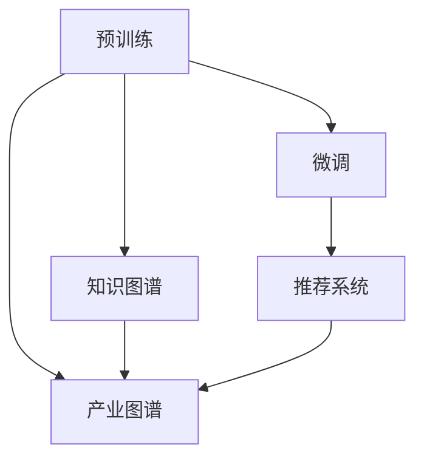

                 

# LLM产业图谱:智能经济的新蓝海

> 关键词：
- 大语言模型(LLM)
- 产业图谱
- 智能经济
- 自然语言处理(NLP)
- 微调(Fine-tuning)
- 知识图谱(KG)
- 推荐系统(Recommendation System)

## 1. 背景介绍

### 1.1 问题由来

随着人工智能技术的不断进步，特别是深度学习和大规模语言模型(LLM)的突破，全球经济正步入智能经济时代。智能经济不仅改变了企业的生产模式，也重塑了人类的社会交往方式。LLM作为智能经济的重要引擎，在各行各业中发挥着越来越重要的作用。

然而，LLM技术的复杂性和多样性也带来了诸多挑战，如模型性能的优化、跨领域的应用、数据隐私与安全等。如何更好地利用LLM技术，构建起更完善的产业生态，是当前智能经济领域亟待解决的重要问题。

### 1.2 问题核心关键点

为了更好地应对LLM带来的挑战和机遇，我们需要对LLM技术在智能经济中的应用进行深入研究，构建起一套系统性的产业图谱，指导开发者和从业者从技术、市场、应用等多个维度进行全方位布局。

产业图谱将帮助企业更好地了解LLM技术在各个领域的应用现状、优势与挑战，指引企业选择适合自身的技术和市场策略，推动产业的协同创新和健康发展。

## 2. 核心概念与联系

### 2.1 核心概念概述

在构建LLM产业图谱时，我们需要聚焦于以下几个核心概念：

- **大语言模型(LLM)**：基于Transformer等架构的深度学习模型，具有强大的语言理解和生成能力。常用的LLM包括GPT、BERT等。
- **微调(Fine-tuning)**：在预训练模型的基础上，使用下游任务的少量标注数据，通过有监督学习优化模型在特定任务上的性能。
- **知识图谱(KG)**：由实体、关系和属性构成的结构化知识表示，用于增强LLM对知识的应用能力。
- **推荐系统(Recommendation System)**：通过分析用户行为和偏好，为用户推荐个性化的信息和服务。
- **产业图谱**：一张描述LLM在各个产业领域应用现状、技术和市场的结构化图谱。

这些核心概念之间存在着紧密的联系，共同构成了LLM技术的产业应用生态：

1. **预训练与微调**：预训练使得模型学习到通用的语言表示，微调则在特定领域内进一步优化模型的性能。
2. **知识图谱与LLM**：知识图谱为LLM提供了丰富的背景知识，帮助其在复杂任务中做出更准确的推理。
3. **推荐系统与LLM**：推荐系统利用LLM的技术，增强个性化推荐的准确性和相关性。
4. **产业图谱与市场**：产业图谱揭示了LLM技术在各个产业领域的应用现状和趋势，指导企业进行市场定位和策略选择。

这些概念之间的联系可以用以下Mermaid流程图进行展示：



通过这张流程图，我们可以清晰地看到LLM技术在智能经济产业图谱中的位置和作用。

## 3. 核心算法原理 & 具体操作步骤

### 3.1 算法原理概述

LLM在智能经济中的应用主要围绕预训练与微调、知识图谱增强和推荐系统构建展开。其核心算法原理可概括如下：

1. **预训练与微调**：通过大规模无标签数据进行预训练，学习通用语言表示。然后在特定领域内，使用少量标注数据进行微调，优化模型性能。
2. **知识图谱增强**：将知识图谱与LLM结合，增强模型对知识的应用能力，支持复杂的推理和决策任务。
3. **推荐系统构建**：利用LLM对用户行为和偏好的理解，构建个性化推荐系统，提升用户体验和满意度。

### 3.2 算法步骤详解

#### 预训练与微调步骤：

1. **数据准备**：收集预训练和微调所需的语料数据，并进行清洗、分词等预处理。
2. **模型初始化**：选择合适的预训练模型（如BERT、GPT等）作为初始化参数。
3. **微调设置**：确定微调的超参数，如学习率、批次大小、迭代轮数等。
4. **数据加载**：将训练数据加载到模型中，进行前向传播和损失计算。
5. **参数更新**：根据损失函数的梯度，使用优化算法（如Adam、SGD等）更新模型参数。
6. **验证评估**：在验证集上评估模型性能，监控模型在微调过程中的损失变化。
7. **测试部署**：在测试集上评估微调后的模型性能，并在实际应用中部署和优化。

#### 知识图谱增强步骤：

1. **数据准备**：构建知识图谱，并对其进行分词、实体识别等预处理。
2. **模型初始化**：选择合适的知识图谱嵌入模型（如TransE、KB-Triples等）作为初始化参数。
3. **嵌入训练**：将知识图谱嵌入模型与LLM结合，进行联合训练。
4. **推理增强**：在LLM的推理过程中，引入知识图谱的实体和关系信息，增强推理能力。

#### 推荐系统构建步骤：

1. **用户行为分析**：收集和分析用户的历史行为数据，提取用户特征。
2. **模型初始化**：选择合适的推荐算法（如协同过滤、深度学习等）作为初始化参数。
3. **模型训练**：利用用户特征和行为数据，训练推荐模型。
4. **LLM辅助**：在推荐模型的基础上，引入LLM的技术，增强推荐准确性和个性化。
5. **实时推荐**：在用户交互过程中，实时生成推荐结果，提升用户体验。

### 3.3 算法优缺点

LLM在智能经济中的应用具有以下优点：

1. **泛化能力强**：LLM在预训练过程中学习到了通用语言知识，能够适应多种任务和领域。
2. **迁移能力强**：通过微调，LLM能够在特定领域内进一步优化性能，提升应用效果。
3. **知识增强**：结合知识图谱，LLM能够更好地理解复杂信息和推理决策。
4. **个性化推荐**：利用LLM对用户行为的理解，推荐系统能够生成更加个性化的推荐结果。

同时，LLM也存在一些局限性：

1. **数据依赖**：LLM的效果很大程度上依赖于数据质量，数据量和分布不均会影响模型性能。
2. **计算资源消耗**：预训练和微调过程需要大量计算资源，对硬件要求较高。
3. **解释性不足**：LLM模型通常作为"黑盒"使用，缺乏可解释性，难以理解和调试。
4. **隐私和安全问题**：在处理敏感数据时，LLM模型可能存在隐私泄露和安全风险。

### 3.4 算法应用领域

LLM在智能经济中的应用广泛，涵盖以下几个主要领域：

1. **金融领域**：利用LLM进行情感分析、信用评分、风险评估等任务，提升金融服务的智能化水平。
2. **医疗健康**：利用LLM进行病历分析、疾病预测、药品推荐等，支持医疗决策和个性化治疗。
3. **智能客服**：利用LLM构建智能客服系统，提供24小时不间断的客户服务，提升用户体验。
4. **智慧城市**：利用LLM进行城市事件监测、舆情分析、应急指挥等，提升城市治理智能化水平。
5. **电子商务**：利用LLM进行商品推荐、价格预测、客户分析等，优化电商运营效率。
6. **教育培训**：利用LLM进行学情分析、个性化推荐、智能答疑等，提升教育培训效果。

## 4. 数学模型和公式 & 详细讲解 & 举例说明

### 4.1 数学模型构建

在LLM产业图谱的构建过程中，我们通常需要构建多种数学模型，以描述预训练、微调、知识图谱增强和推荐系统的工作原理。

#### 预训练与微调模型：

1. **自监督预训练**：使用掩码语言模型（MLM）和下一句预测（NSP）等任务进行预训练。
2. **微调任务**：根据具体任务设计任务适配层和损失函数，如分类任务使用交叉熵损失函数。

#### 知识图谱嵌入模型：

1. **实体识别**：使用BERT等模型对知识图谱进行实体识别和关系抽取。
2. **知识图谱嵌入**：使用TransE等模型对知识图谱进行嵌入，学习实体和关系之间的向量表示。

#### 推荐系统模型：

1. **协同过滤模型**：利用用户-物品矩阵进行推荐。
2. **深度学习模型**：使用基于深度学习的推荐算法，如DNN、RNN等。

### 4.2 公式推导过程

#### 预训练与微调公式：

假设预训练模型为 $M_{\theta}$，微调任务为 $T$。在微调过程中，模型的损失函数 $\mathcal{L}$ 定义为：

$$
\mathcal{L}(\theta) = \frac{1}{N}\sum_{i=1}^N \ell(M_{\theta}(x_i),y_i)
$$

其中 $\ell$ 为任务的损失函数，$x_i$ 和 $y_i$ 分别为输入和标签。

微调模型的更新公式为：

$$
\theta \leftarrow \theta - \eta \nabla_{\theta}\mathcal{L}(\theta)
$$

其中 $\eta$ 为学习率，$\nabla_{\theta}\mathcal{L}(\theta)$ 为损失函数的梯度。

#### 知识图谱嵌入公式：

知识图谱嵌入模型通常采用三元组 $(\text{实体}_i, \text{关系}, \text{实体}_j)$ 作为输入，通过关系投影层和交叉层进行嵌入，生成实体和关系的向量表示。

假设实体嵌入为 $\text{E}_i$，关系嵌入为 $\text{R}$，向量表示为 $\text{S}_i$。则嵌入模型可表示为：

$$
\text{S}_i = \text{E}_i + \text{R} \times \text{E}_j
$$

#### 推荐系统公式：

协同过滤模型使用用户-物品矩阵 $R$，计算用户 $u$ 对物品 $i$ 的评分 $r_{ui}$。

$$
r_{ui} = \text{W}_u \times \text{I}_i + \text{b}_u
$$

其中 $\text{W}_u$ 和 $\text{b}_u$ 为用户的向量表示，$\text{I}_i$ 为物品的向量表示。

深度学习模型则使用神经网络对用户和物品进行特征提取，生成评分向量，并进行加权求和。

### 4.3 案例分析与讲解

以一个简单的情感分析任务为例，展示预训练与微调、知识图谱增强和推荐系统的综合应用。

1. **预训练与微调**：
   - **数据准备**：收集包含情感标签的文本数据，并进行预处理。
   - **模型初始化**：选择预训练的BERT模型作为初始化参数。
   - **微调设置**：设置微调的学习率、批次大小等超参数。
   - **模型训练**：使用微调后的模型在验证集上进行评估，调整超参数。
   - **测试部署**：在测试集上评估微调后的模型，部署到实际应用中。

2. **知识图谱增强**：
   - **数据准备**：构建包含情感词义和关系的知识图谱。
   - **模型初始化**：选择TransE模型作为知识图谱嵌入模型。
   - **嵌入训练**：将BERT和TransE结合，进行联合训练。
   - **推理增强**：在情感分析中，利用知识图谱的情感词义和关系，增强推理能力。

3. **推荐系统**：
   - **用户行为分析**：收集用户的评论、评分等行为数据，提取用户特征。
   - **模型初始化**：选择协同过滤或深度学习模型作为初始化参数。
   - **模型训练**：利用用户特征和行为数据，训练推荐模型。
   - **LLM辅助**：在推荐模型的基础上，引入BERT的技术，增强推荐准确性和个性化。
   - **实时推荐**：在用户交互过程中，实时生成推荐结果，提升用户体验。

## 5. 项目实践：代码实例和详细解释说明

### 5.1 开发环境搭建

在进行LLM产业图谱的构建和实践时，我们需要准备合适的开发环境。以下是使用Python和PyTorch进行开发的环境配置流程：

1. **安装Anaconda**：从官网下载并安装Anaconda，用于创建独立的Python环境。
2. **创建并激活虚拟环境**：
```bash
conda create -n llm-env python=3.8 
conda activate llm-env
```
3. **安装PyTorch**：根据CUDA版本，从官网获取对应的安装命令。例如：
```bash
conda install pytorch torchvision torchaudio cudatoolkit=11.1 -c pytorch -c conda-forge
```
4. **安装Transformers库**：
```bash
pip install transformers
```
5. **安装各类工具包**：
```bash
pip install numpy pandas scikit-learn matplotlib tqdm jupyter notebook ipython
```

完成上述步骤后，即可在`llm-env`环境中开始LLM产业图谱的构建和实践。

### 5.2 源代码详细实现

以一个简单的金融情感分析任务为例，给出使用Transformers库对BERT模型进行微调的PyTorch代码实现。

```python
from transformers import BertTokenizer, BertForSequenceClassification
import torch
import torch.nn.functional as F
from sklearn.metrics import accuracy_score

# 加载数据集
train_dataset = ...
train_loader = ...
val_dataset = ...
val_loader = ...
test_dataset = ...
test_loader = ...

# 加载模型和tokenizer
model = BertForSequenceClassification.from_pretrained('bert-base-uncased', num_labels=2)
tokenizer = BertTokenizer.from_pretrained('bert-base-uncased')

# 定义模型架构
class CustomModel(BertForSequenceClassification):
    def __init__(self, *args, **kwargs):
        super(CustomModel, self).__init__(*args, **kwargs)
        self.dropout = torch.nn.Dropout(0.5)

    def forward(self, input_ids, attention_mask=None, token_type_ids=None, labels=None):
        outputs = super().forward(input_ids, attention_mask=attention_mask, token_type_ids=token_type_ids)
        _, logits = outputs
        logits = self.dropout(logits)
        if labels is not None:
            loss = F.cross_entropy(logits.view(-1, logits.size(-1)), labels.view(-1))
            logits = logits.view(-1, logits.size(-1))
        return (loss, logits)

# 设置超参数
epochs = 5
batch_size = 16
learning_rate = 2e-5

# 初始化模型和优化器
model = CustomModel(model)
optimizer = torch.optim.Adam(model.parameters(), lr=learning_rate)

# 训练过程
def train_step(model, optimizer, loss_fn, data_loader):
    model.train()
    for batch in data_loader:
        input_ids = batch['input_ids'].to(device)
        attention_mask = batch['attention_mask'].to(device)
        labels = batch['labels'].to(device)
        outputs = model(input_ids, attention_mask=attention_mask)
        loss, logits = outputs
        optimizer.zero_grad()
        loss.backward()
        optimizer.step()
        return loss

# 评估过程
def evaluate_step(model, loss_fn, data_loader):
    model.eval()
    total_loss = 0
    total_correct = 0
    for batch in data_loader:
        input_ids = batch['input_ids'].to(device)
        attention_mask = batch['attention_mask'].to(device)
        labels = batch['labels'].to(device)
        with torch.no_grad():
            outputs = model(input_ids, attention_mask=attention_mask)
            loss, logits = outputs
        total_loss += loss.item()
        total_correct += accuracy_score(labels, logits.argmax(-1))
    return total_loss / len(data_loader), total_correct / len(data_loader)

# 训练循环
device = torch.device('cuda' if torch.cuda.is_available() else 'cpu')
model.to(device)

for epoch in range(epochs):
    train_loss = train_step(model, optimizer, F.cross_entropy, train_loader)
    val_loss, val_acc = evaluate_step(model, F.cross_entropy, val_loader)
    print(f'Epoch {epoch+1}, train loss: {train_loss:.3f}, val acc: {val_acc:.3f}')

# 测试过程
test_loss, test_acc = evaluate_step(model, F.cross_entropy, test_loader)
print(f'Test acc: {test_acc:.3f}')
```

### 5.3 代码解读与分析

**数据准备**：
- 数据集：包括训练集、验证集和测试集，需要预处理和分批加载。

**模型初始化**：
- 加载预训练的BERT模型和对应的tokenizer。

**模型架构**：
- 继承自BertForSequenceClassification，并在输出层前加入dropout层。

**超参数**：
- 定义训练轮数、批次大小和学习率。

**训练过程**：
- 定义训练函数train_step，使用Adam优化器更新模型参数。
- 在每个批次上计算损失并进行反向传播，更新模型。

**评估过程**：
- 定义评估函数evaluate_step，计算损失和准确率。
- 在每个批次上计算损失和准确率，最终返回平均损失和准确率。

**训练循环**：
- 在训练过程中，循环迭代，更新模型参数，并在验证集上评估模型性能。

**测试过程**：
- 在测试集上评估模型性能，输出最终准确率。

## 6. 实际应用场景

### 6.1 智能客服系统

智能客服系统利用LLM技术，构建自然语言理解与生成模型，提供24小时不间断的客户服务。系统可以通过语音识别技术获取用户语音输入，再利用LLM模型理解用户的意图和需求，自动回答常见问题，并引导用户进行下一步操作。

例如，在智能客服系统中，LLM模型可以用于以下任务：

- **意图识别**：识别用户的意图，自动转接至相关部门或提供相应解决方案。
- **实体抽取**：从用户输入中抽取关键实体，如账户号、订单号等，提高问题解决的准确性。
- **情感分析**：分析用户的情感倾向，判断用户的情绪状态，提供针对性的服务。

### 6.2 金融舆情监测

金融舆情监测系统利用LLM技术，实时监测市场舆论动向，防范金融风险。系统可以从新闻、社交媒体、论坛等网络数据中提取信息，利用LLM模型分析用户的情感倾向和舆论走向，及时发现负面信息，提前预警风险。

例如，在金融舆情监测系统中，LLM模型可以用于以下任务：

- **舆情分析**：利用情感分析技术，分析市场舆情，识别负面消息和潜在风险。
- **情感预测**：预测未来的市场情绪，提前调整投资策略和风险控制措施。
- **异常检测**：通过异常检测技术，识别异常的市场行为和舆情变化，及时响应。

### 6.3 个性化推荐系统

个性化推荐系统利用LLM技术，提升推荐系统的准确性和个性化程度。系统可以通过分析用户的浏览记录、评分行为等，利用LLM模型学习用户的兴趣和偏好，生成个性化的推荐结果。

例如，在个性化推荐系统中，LLM模型可以用于以下任务：

- **用户画像**：通过分析用户的行为数据，构建用户的兴趣模型。
- **商品推荐**：利用LLM模型，生成个性化的商品推荐列表。
- **内容推荐**：根据用户的阅读历史和兴趣，推荐相关的文章和视频。

## 7. 工具和资源推荐

### 7.1 学习资源推荐

为了帮助开发者系统掌握LLM技术及其在智能经济中的应用，这里推荐一些优质的学习资源：

1. **《深度学习》课程**：斯坦福大学开设的深度学习课程，涵盖深度学习的基础和高级应用，适合初学者和进阶开发者。

2. **《Transformers: From Linear Algebra to Deep Learning》书籍**：深度学习专家Ashish Vaswani所著，系统介绍了Transformer模型及其在NLP领域的应用。

3. **HuggingFace官方文档**：提供丰富的预训练语言模型和微调范式，是学习LLM技术的必备资料。

4. **TensorFlow官方文档**：提供深度学习框架的详细教程和实战案例，帮助开发者构建和部署LLM应用。

5. **NLPCompendium网站**：提供NLP领域的权威资料和最新研究动态，涵盖预训练、微调、知识图谱等多个方面。

通过对这些学习资源的系统学习，相信你一定能够掌握LLM技术在智能经济中的应用，实现产业图谱的构建和优化。

### 7.2 开发工具推荐

高效开发离不开优秀的工具支持。以下是几款用于LLM产业图谱开发的常用工具：

1. **PyTorch**：基于Python的开源深度学习框架，支持动态计算图，灵活性高。

2. **TensorFlow**：由Google主导开发的深度学习框架，生产部署方便，适用于大规模工程应用。

3. **HuggingFace Transformers库**：提供丰富的预训练语言模型和微调范式，便于快速构建LLM应用。

4. **TensorBoard**：TensorFlow配套的可视化工具，可实时监测模型训练状态，提供丰富的图表呈现方式。

5. **Weights & Biases**：模型训练的实验跟踪工具，记录和可视化模型训练过程中的各项指标，方便对比和调优。

6. **Kaggle**：数据科学和机器学习竞赛平台，提供丰富的数据集和实战项目，帮助开发者进行模型评估和优化。

这些工具将大大提高LLM产业图谱的构建效率和模型性能。

### 7.3 相关论文推荐

LLM技术的发展离不开学界的持续研究。以下是几篇奠基性的相关论文，推荐阅读：

1. **Attention is All You Need**：提出Transformer结构，开启了NLP领域的预训练大模型时代。

2. **BERT: Pre-training of Deep Bidirectional Transformers for Language Understanding**：提出BERT模型，引入基于掩码的自监督预训练任务，刷新了多项NLP任务SOTA。

3. **Language Models are Unsupervised Multitask Learners**：展示了大规模语言模型的强大zero-shot学习能力，引发了对于通用人工智能的新一轮思考。

4. **Fine-tuning Large Pretrained Language Models for Specific Tasks**：提出微调范式，指导开发者利用预训练模型进行特定任务优化。

5. **AdaLoRA: Adaptive Low-Rank Adaptation for Parameter-Efficient Fine-Tuning**：提出自适应低秩适应的微调方法，在参数效率和精度之间取得了新的平衡。

这些论文代表了大语言模型在智能经济领域的最新进展，阅读这些前沿成果，将帮助你更好地理解LLM技术的应用前景和潜在挑战。

## 8. 总结：未来发展趋势与挑战

### 8.1 研究成果总结

本文详细介绍了大语言模型在智能经济中的应用，包括预训练与微调、知识图谱增强和推荐系统构建等关键技术。通过系统梳理LLM产业图谱，帮助开发者从技术、市场、应用等多个维度进行全方位布局，提升LLM技术在智能经济中的实际应用效果。

### 8.2 未来发展趋势

未来，LLM技术将在智能经济中发挥越来越重要的作用，呈现出以下几个发展趋势：

1. **大模型化和通用化**：预训练模型将朝着更大规模、通用化的方向发展，涵盖更多的领域和任务。
2. **多模态融合**：LLM将与视觉、语音等多模态数据进行融合，构建更全面、准确的信息表示。
3. **知识增强**：利用知识图谱、逻辑规则等先验知识，增强LLM的推理能力和决策水平。
4. **实时计算**：通过优化计算图和模型结构，实现LLM的高效实时计算和推理。
5. **安全性与可解释性**：提升LLM模型的可解释性和安全性，确保其应用符合伦理道德标准。

### 8.3 面临的挑战

尽管LLM技术在智能经济中取得了显著进展，但仍面临诸多挑战：

1. **数据依赖**：数据质量不均、标注成本高昂，制约了LLM模型的应用效果。
2. **计算资源消耗**：大模型的预训练和微调需要大量的计算资源，硬件成本较高。
3. **模型复杂性**：模型结构复杂，难以解释和调试，缺乏可解释性。
4. **隐私和安全问题**：处理敏感数据时，存在隐私泄露和安全性风险。
5. **伦理道德问题**：模型的偏见和有害输出，可能带来伦理道德问题。

### 8.4 研究展望

面对LLM技术在智能经济中面临的挑战，未来的研究需要在以下几个方面寻求新的突破：

1. **无监督和半监督学习**：探索无需标注数据的微调方法，降低对标注数据的依赖。
2. **参数高效微调**：开发更加参数高效的微调方法，减少模型参数量，提高计算效率。
3. **因果推理**：引入因果推理方法，增强LLM的推理能力和稳定性。
4. **跨模态融合**：探索视觉、语音等多模态数据的融合方法，增强LLM的多模态应用能力。
5. **伦理和隐私保护**：引入伦理导向的评估指标，确保模型输出的安全性和伦理性。

通过这些研究方向的探索，LLM技术将在智能经济中发挥更大的作用，推动产业的智能化和数字化转型升级。

## 9. 附录：常见问题与解答

**Q1：大语言模型是否适用于所有智能经济领域？**

A: 大语言模型在智能经济中的适用性较强，但需要根据具体领域进行优化。例如，在金融领域，可以结合金融知识和情感分析，提高风险评估的准确性；在医疗领域，可以结合医疗知识图谱，提高病历分析的准确性。

**Q2：如何评估大语言模型的性能？**

A: 评估大语言模型的性能通常使用BLEU、ROUGE、METEOR等自动评估指标，也可以通过人工评估其应用效果。同时，在实际应用中，还需要结合业务场景进行综合评估。

**Q3：大语言模型在推荐系统中有哪些应用？**

A: 大语言模型可以用于用户画像构建、商品推荐、内容推荐等多个方面。通过分析用户行为数据，学习用户兴趣模型，生成个性化的推荐结果。

**Q4：如何避免大语言模型的偏见？**

A: 在训练过程中，引入多样化的数据和任务，避免数据偏差和任务偏差。同时，利用对抗训练、数据清洗等方法，减少模型偏见的影响。

**Q5：如何平衡大语言模型的效率和效果？**

A: 优化计算图，使用混合精度训练、剪枝等方法，减少计算资源消耗，提高模型推理速度。同时，通过参数高效微调，减少模型参数量，提高模型的效果和效率。

这些问题的解答，将帮助开发者更好地理解大语言模型在智能经济中的应用，指导其在实际项目中的优化和部署。通过不断的技术创新和应用实践，LLM技术将在智能经济中发挥更大的作用，推动产业的智能化和数字化转型升级。

