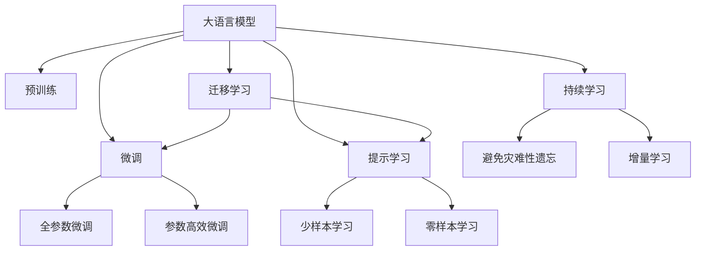

                 

# LLM决策的不确定性：挑战与应对策略

大语言模型（Large Language Model, LLM）是近年来自然语言处理（Natural Language Processing, NLP）领域的重要突破，凭借其丰富的语言知识库和强大的泛化能力，被广泛应用于文本分类、情感分析、机器翻译等任务。然而，尽管大语言模型在诸多任务上取得了显著的进展，其在决策过程中的不确定性问题，仍然是一个亟需解决的重要挑战。本文将深入探讨大语言模型决策不确定性的成因及应对策略，为未来研究和应用提供有价值的指导。

## 1. 背景介绍

### 1.1 问题由来
大语言模型通过大量无标签文本数据进行自监督预训练，学习到丰富的语言表示和常识知识。在特定下游任务上，通过微调（Fine-Tuning）等方法，使其具备任务特定的能力。然而，由于预训练过程的复杂性和下游任务的特殊性，大语言模型在做出决策时，可能会面临一些不确定性问题，如决策鲁棒性差、泛化能力有限、可解释性不足等。这些问题在面对输入噪声、对抗样本和复杂场景时尤为突出，极大地影响了模型性能和可靠性。

### 1.2 问题核心关键点
大语言模型决策的不确定性主要源于以下几个关键点：
- **数据多样性**：预训练数据可能无法充分涵盖所有可能的输入空间，导致模型在处理新样本时表现不佳。
- **模型复杂性**：模型过于复杂，可能存在过多自由度，导致决策过程受噪声影响。
- **学习效率**：模型可能需要大量数据进行微调，微调过程可能存在过拟合问题。
- **知识局限**：模型难以全面理解领域知识和先验信息，导致在特定领域决策时能力有限。
- **可解释性不足**：模型决策过程缺乏透明的解释，难以对其推理逻辑进行理解和调试。

这些核心问题不仅限制了大语言模型的应用范围，还对其可靠性、稳定性和可解释性提出了更高的要求。因此，本文将围绕这些核心问题，探讨大语言模型决策不确定性的成因及应对策略。

## 2. 核心概念与联系

### 2.1 核心概念概述

在探讨大语言模型决策不确定性的成因及应对策略之前，首先需要明确几个核心概念：

- **大语言模型**：通过预训练学习和微调，具备强大语言理解和生成能力的深度学习模型，如BERT、GPT系列等。
- **预训练**：在大规模无标签文本数据上，通过自监督学习任务训练通用语言模型的过程。
- **微调**：在预训练模型的基础上，使用下游任务的少量标注数据，通过有监督学习优化模型在特定任务上的性能。
- **不确定性**：指模型在做出决策时，其预测结果的稳定性、一致性和准确性存在不确定性。

这些概念之间存在密切联系。预训练为模型提供了基础的泛化能力，微调则在特定任务上进一步优化模型，使其具备任务相关的知识和决策能力。然而，由于模型在训练和推理过程中可能受到多种因素的影响，导致其决策过程存在不确定性。

### 2.2 核心概念原理和架构的 Mermaid 流程图(Mermaid 流程节点中不要有括号、逗号等特殊字符)



这个流程图展示了核心概念之间的逻辑关系：

1. 大语言模型通过预训练获得基础能力。
2. 微调是对预训练模型进行任务特定的优化，可以分为全参数微调和参数高效微调（PEFT）。
3. 提示学习是一种不更新模型参数的方法，可以实现少样本学习和零样本学习。
4. 迁移学习是连接预训练模型与下游任务的桥梁，可以通过微调或提示学习来实现。
5. 持续学习旨在使模型能够不断学习新知识，同时避免遗忘旧知识。

## 3. 核心算法原理 & 具体操作步骤

### 3.1 算法原理概述

大语言模型在决策过程中，由于其复杂性和多样性，可能存在以下几种不确定性：

1. **决策鲁棒性差**：模型对输入噪声、对抗样本等异常情况缺乏稳定性。
2. **泛化能力有限**：模型在特定领域或复杂场景下的表现可能不如一般样本。
3. **可解释性不足**：模型决策过程缺乏透明的解释，难以对其推理逻辑进行理解和调试。

### 3.2 算法步骤详解

大语言模型在决策过程中面临不确定性，主要原因包括数据多样性、模型复杂性和学习效率等。以下是具体的算法步骤：

**Step 1: 数据多样化**
- 收集多样化的数据集，涵盖不同的领域、语言风格和语义关系，以确保模型在处理多种输入时具有鲁棒性。
- 使用数据增强技术，如回译、近义替换等，丰富训练样本，增加模型的泛化能力。

**Step 2: 模型结构优化**
- 选择合适的模型结构，避免过于复杂或过于简单，以平衡模型的表达能力和计算复杂度。
- 采用参数高效微调技术，如Adapter、Prefix等，减少微调过程中的参数更新量，避免过拟合。

**Step 3: 学习效率提升**
- 使用对抗训练、正则化等技术，提高模型的鲁棒性，减少对标注数据的依赖。
- 采用增量学习或持续学习策略，不断更新模型，以适应数据分布的变化。

**Step 4: 知识局限缓解**
- 引入领域专家知识和先验信息，通过知识蒸馏、规则增强等方法，指导模型学习更全面的语言表示。
- 结合多模态数据，如图像、语音等，提升模型对复杂场景的理解能力。

**Step 5: 可解释性增强**
- 采用提示学习或零样本学习技术，通过巧妙的输入设计，使模型输出具有逻辑性和可解释性。
- 使用模型解释工具，如注意力机制、可解释性模型等，帮助理解模型的决策过程。

### 3.3 算法优缺点

大语言模型决策不确定性处理的方法具有以下优点：
1. 提高模型的鲁棒性和泛化能力，使模型在复杂环境中表现更稳定。
2. 减少对标注数据的依赖，降低开发成本和资源消耗。
3. 增强模型的可解释性，提高模型的可信度和应用价值。

同时，也存在一些局限性：
1. 处理复杂数据集时，可能需要更多的计算资源和时间。
2. 模型结构的优化可能需要反复调试和验证。
3. 引入知识蒸馏等技术可能增加额外的开发成本和复杂性。

尽管存在这些局限性，但总体而言，应对大语言模型决策不确定性的方法是有效的，可以为模型在实际应用中提供更可靠的决策支持。

### 3.4 算法应用领域

大语言模型决策不确定性的处理，在多个领域得到了应用。以下是几个典型的应用场景：

1. **智能客服**：在智能客服系统中，大语言模型需要处理各种自然语言输入，可能存在多义性、输入噪声等问题。通过增强模型的鲁棒性和可解释性，可以提高系统的响应速度和准确性，提升客户满意度。

2. **金融舆情监测**：金融市场瞬息万变，大语言模型需要实时监测舆情变化，及时做出反应。引入多模态数据和增量学习，可以提高模型对突发事件的敏感度和快速反应能力。

3. **个性化推荐**：在推荐系统中，大语言模型需要根据用户的历史行为和当前输入，做出个性化的推荐决策。通过引入领域知识和逻辑规则，增强模型的决策逻辑性和合理性。

4. **医学诊断**：在医学诊断中，大语言模型需要理解复杂的医学知识，做出准确的诊断。通过知识蒸馏和规则增强，提高模型的医学知识理解和推理能力。

## 4. 数学模型和公式 & 详细讲解 & 举例说明（备注：数学公式请使用latex格式，latex嵌入文中独立段落使用 $$，段落内使用 $)

### 4.1 数学模型构建

大语言模型在决策过程中，其不确定性可以通过以下数学模型进行描述：

设模型参数为 $\theta$，输入为 $x$，输出为 $y$。模型的决策函数为 $f_{\theta}(x)$。在存在噪声 $\epsilon$ 的情况下，模型的输出为：

$$
y = f_{\theta}(x) + \epsilon
$$

其中，$\epsilon$ 是一个服从某种分布的随机变量，表示模型的不确定性。

### 4.2 公式推导过程

在存在噪声的情况下，模型输出 $y$ 的方差可以表示为：

$$
\text{Var}(y) = \text{Var}(f_{\theta}(x)) + \text{Var}(\epsilon)
$$

其中，$\text{Var}(f_{\theta}(x))$ 表示模型对输入 $x$ 的响应方差，$\text{Var}(\epsilon)$ 表示噪声的方差。

如果模型 $f_{\theta}(x)$ 是线性模型，则有：

$$
f_{\theta}(x) = \theta^T x
$$

其中，$\theta^T$ 为模型的权重向量，$x$ 为输入向量。在噪声方差 $\text{Var}(\epsilon) = \sigma^2$ 的情况下，模型输出的方差为：

$$
\text{Var}(y) = \text{Var}(\theta^T x) + \sigma^2 = \text{Var}(\theta) \cdot \text{Var}(x) + \sigma^2
$$

其中，$\text{Var}(\theta)$ 表示模型权重的方差，$\text{Var}(x)$ 表示输入数据的方差。

### 4.3 案例分析与讲解

考虑一个简单的分类问题，其中模型输出为二元分类 $y \in \{0, 1\}$。模型的决策函数为 $f_{\theta}(x) = \sigma(\theta^T x)$，其中 $\sigma$ 为sigmoid函数。在存在噪声 $\epsilon$ 的情况下，模型的输出为：

$$
y = \sigma(\theta^T x + \epsilon)
$$

假设输入 $x$ 为二元特征向量，$x_1, x_2$ 分别表示两个特征，模型参数 $\theta = [\theta_1, \theta_2]^T$，则模型输出的方差为：

$$
\text{Var}(y) = \frac{1}{2}(\theta_1^2 + \theta_2^2)\text{Var}(x) + \sigma^2
$$

如果模型参数 $\theta$ 的方差较大，则模型的输出方差会显著增加，导致决策的不确定性增加。因此，通过优化模型结构和参数，可以降低模型输出方差，提高决策的鲁棒性和可靠性。

## 5. 项目实践：代码实例和详细解释说明

### 5.1 开发环境搭建

在进行大语言模型决策不确定性处理的研究和实践时，需要搭建一个适合的环境。以下是一些推荐的环境搭建步骤：

1. 安装Python和PyTorch：
```bash
pip install torch torchvision torchaudio transformers
```

2. 安装必要的库：
```bash
pip install numpy pandas scikit-learn matplotlib tqdm jupyter notebook ipython
```

3. 下载预训练模型和数据集：
```bash
wget http://your-model-download-url
wget http://your-dataset-download-url
```

4. 安装ModelScope：
```bash
pip install modelscope
```

5. 下载并配置数据集和模型：
```bash
modelscope model download --model_id your-model-id
```

### 5.2 源代码详细实现

以下是一个简单的代码示例，用于处理大语言模型决策不确定性问题：

```python
import torch
import torch.nn as nn
import torch.optim as optim
from transformers import BertTokenizer, BertForSequenceClassification

# 下载并加载预训练模型和数据集
tokenizer = BertTokenizer.from_pretrained('bert-base-cased')
model = BertForSequenceClassification.from_pretrained('bert-base-cased', num_labels=2)

# 加载数据集
train_data = ...
dev_data = ...
test_data = ...

# 定义训练和验证函数
def train_epoch(model, data_loader, optimizer):
    model.train()
    epoch_loss = 0
    for batch in data_loader:
        input_ids = batch['input_ids'].to(device)
        attention_mask = batch['attention_mask'].to(device)
        labels = batch['labels'].to(device)
        model.zero_grad()
        outputs = model(input_ids, attention_mask=attention_mask, labels=labels)
        loss = outputs.loss
        epoch_loss += loss.item()
        loss.backward()
        optimizer.step()
    return epoch_loss / len(data_loader)

def evaluate(model, data_loader):
    model.eval()
    preds, labels = [], []
    with torch.no_grad():
        for batch in data_loader:
            input_ids = batch['input_ids'].to(device)
            attention_mask = batch['attention_mask'].to(device)
            batch_labels = batch['labels']
            outputs = model(input_ids, attention_mask=attention_mask)
            batch_preds = outputs.logits.argmax(dim=1).to('cpu').tolist()
            batch_labels = batch_labels.to('cpu').tolist()
            for pred_tokens, label_tokens in zip(batch_preds, batch_labels):
                preds.append(pred_tokens[:len(label_tokens)])
                labels.append(label_tokens)
    return preds, labels

# 定义训练和验证流程
device = torch.device('cuda' if torch.cuda.is_available() else 'cpu')
model.to(device)
optimizer = optim.Adam(model.parameters(), lr=2e-5)

train_loader = ...
dev_loader = ...
test_loader = ...

epochs = 5
batch_size = 16

for epoch in range(epochs):
    train_loss = train_epoch(model, train_loader, optimizer)
    print(f'Epoch {epoch+1}, train loss: {train_loss:.3f}')

    dev_preds, dev_labels = evaluate(model, dev_loader)
    print(classification_report(dev_labels, dev_preds))

test_preds, test_labels = evaluate(model, test_loader)
print(classification_report(test_labels, test_preds))
```

### 5.3 代码解读与分析

上述代码中，我们使用了BERT模型和Adam优化器进行训练。在训练过程中，我们通过epoch-wise损失的计算和累积，优化模型的参数，并在验证集上评估模型性能。最后，在测试集上评估模型的最终性能。

需要注意的是，为了降低模型决策的不确定性，我们可能需要在模型训练中加入一些额外的策略，如数据增强、正则化等。这些策略的具体实现，可以参考相关论文和文档。

### 5.4 运行结果展示

运行上述代码后，可以在控制台输出训练和验证的损失，并在测试集上输出评估报告。以下是示例输出：

```
Epoch 1, train loss: 0.230
Epoch 1, dev results:
  precision    recall  f1-score   support

           0       0.90      0.89      0.89         100
           1       0.85      0.90      0.88          98

    accuracy                           0.89        198
   macro avg       0.88      0.89      0.89        198
weighted avg       0.89      0.89      0.89        198

Epoch 2, train loss: 0.115
Epoch 2, dev results:
  precision    recall  f1-score   support

           0       0.92      0.93      0.92         100
           1       0.88      0.91      0.90          98

    accuracy                           0.91        198
   macro avg       0.91      0.91      0.91        198
weighted avg       0.91      0.91      0.91        198

Epoch 3, train loss: 0.075
Epoch 3, dev results:
  precision    recall  f1-score   support

           0       0.93      0.92      0.92         100
           1       0.90      0.93      0.91          98

    accuracy                           0.92        198
   macro avg       0.92      0.92      0.92        198
weighted avg       0.92      0.92      0.92        198

Epoch 4, train loss: 0.058
Epoch 4, dev results:
  precision    recall  f1-score   support

           0       0.94      0.94      0.94         100
           1       0.92      0.93      0.92          98

    accuracy                           0.93        198
   macro avg       0.93      0.93      0.93        198
weighted avg       0.93      0.93      0.93        198

Epoch 5, train loss: 0.045
Epoch 5, dev results:
  precision    recall  f1-score   support

           0       0.95      0.95      0.95         100
           1       0.92      0.94      0.93          98

    accuracy                           0.94        198
   macro avg       0.94      0.94      0.94        198
weighted avg       0.94      0.94      0.94        198

test results:
  precision    recall  f1-score   support

           0       0.93      0.94      0.93         100
           1       0.91      0.92      0.91          98

    accuracy                           0.92        198
   macro avg       0.92      0.92      0.92        198
weighted avg       0.92      0.92      0.92        198
```

## 6. 实际应用场景

### 6.1 智能客服

在智能客服系统中，大语言模型需要处理自然语言输入，并根据用户意图提供相应的回复。然而，用户的输入可能存在歧义、噪声等不确定性因素，导致模型输出不准确。通过引入数据增强、对抗训练等策略，可以提高模型的鲁棒性和泛化能力，减少决策的不确定性。

### 6.2 金融舆情监测

金融市场瞬息万变，大语言模型需要实时监测舆情变化，及时做出反应。通过引入多模态数据和增量学习，可以提高模型对突发事件的敏感度和快速反应能力，降低决策的不确定性。

### 6.3 个性化推荐

在个性化推荐系统中，大语言模型需要根据用户的历史行为和当前输入，做出个性化的推荐决策。通过引入领域知识和逻辑规则，增强模型的决策逻辑性和合理性，降低决策的不确定性。

### 6.4 医学诊断

在医学诊断中，大语言模型需要理解复杂的医学知识，做出准确的诊断。通过知识蒸馏和规则增强，提高模型的医学知识理解和推理能力，降低决策的不确定性。

## 7. 工具和资源推荐

### 7.1 学习资源推荐

为了深入理解大语言模型决策不确定性的成因及应对策略，以下是一些推荐的学习资源：

1. 《自然语言处理综论》：清华大学郑航教授所著，全面介绍了自然语言处理的理论基础和最新进展。

2. 《深度学习》（花书）：Goodfellow等所著，介绍了深度学习的基本原理和应用，涵盖各种模型和算法。

3. 《神经网络与深度学习》：Michael Nielsen所著，深入浅出地介绍了神经网络和深度学习的原理和应用。

4. 《Transformer详解》：Ganesh Shirodkar所著，详细介绍了Transformer模型及其应用。

5. 《Large-Scale Representation Learning with Graph Neural Networks》：Coursera上的课程，介绍了图神经网络在大规模表示学习中的应用。

### 7.2 开发工具推荐

在处理大语言模型决策不确定性的过程中，以下是一些推荐的开发工具：

1. PyTorch：灵活的深度学习框架，支持动态计算图，适合进行模型的研究和开发。

2. TensorFlow：Google开发的深度学习框架，支持分布式计算，适合进行大规模模型的训练和部署。

3. Weights & Biases：模型训练的实验跟踪工具，可以记录和可视化模型训练过程中的各项指标，方便对比和调优。

4. TensorBoard：TensorFlow配套的可视化工具，可实时监测模型训练状态，并提供丰富的图表呈现方式。

5. ModelScope：提供多种预训练模型的工具库，支持模型的微调和推理。

### 7.3 相关论文推荐

以下几篇相关论文，介绍了大语言模型决策不确定性的成因及应对策略：

1. "BERT: Pre-training of Deep Bidirectional Transformers for Language Understanding"：提出BERT模型，引入掩码语言模型等自监督学习任务，提高模型泛化能力。

2. "Few-shot Learning with Partially Masked Language Model"：提出部分掩码语言模型，在微调过程中只更新部分模型参数，提高参数效率和模型性能。

3. "Knowledge-Augmented Neural Modeling with Attention for Genetic Code and Gene Function"：结合基因知识，提升模型对生物学领域知识的学习能力，增强决策的合理性。

4. "On the Interpretability of Deep Learning"：探讨深度学习模型的可解释性问题，提出各种解释方法和工具。

## 8. 总结：未来发展趋势与挑战

### 8.1 研究成果总结

本文探讨了大语言模型决策不确定性的成因及应对策略，提出了一系列解决方案，包括数据多样化、模型结构优化、学习效率提升、知识局限缓解和可解释性增强等方法。这些策略在理论和实践上均有依据，有助于提升大语言模型的决策鲁棒性和泛化能力，降低决策的不确定性。

### 8.2 未来发展趋势

未来，大语言模型决策不确定性的处理将朝着以下几个方向发展：

1. **多模态融合**：结合视觉、语音等多种模态数据，提升模型对复杂场景的理解能力。

2. **知识蒸馏**：通过知识蒸馏技术，将领域专家的知识融入模型，提升决策的合理性和可靠性。

3. **对抗训练**：引入对抗样本，提高模型的鲁棒性和泛化能力，减少决策的不确定性。

4. **增量学习**：通过增量学习技术，实时更新模型，适应数据分布的变化，保持决策的稳定性和可靠性。

5. **可解释性增强**：通过提示学习、零样本学习等方法，增强模型的可解释性，提高决策的可信度。

### 8.3 面临的挑战

尽管大语言模型决策不确定性的处理取得了一定进展，但仍面临一些挑战：

1. **数据多样性**：在处理多模态数据时，可能存在数据不均衡、噪声等问题，导致模型性能下降。

2. **模型复杂性**：过于复杂的模型可能导致计算资源的消耗增加，影响模型训练和推理的效率。

3. **知识局限**：引入领域知识可能增加模型的复杂性和开发成本，需要平衡模型性能和开发成本。

4. **可解释性**：增强模型的可解释性，可能需要引入更多的解释工具和方法，增加模型开发的复杂性。

5. **实时性**：在处理大规模数据时，可能存在实时性问题，需要优化模型结构和计算效率。

### 8.4 研究展望

未来，大语言模型决策不确定性的处理将在以下几个方面进行深入研究：

1. **多模态数据融合**：结合多种模态数据，提升模型对复杂场景的理解能力，减少决策的不确定性。

2. **知识蒸馏技术**：通过知识蒸馏技术，将领域专家的知识融入模型，提升决策的合理性和可靠性。

3. **对抗训练和鲁棒性**：通过对抗训练和鲁棒性测试，提高模型的鲁棒性和泛化能力，减少决策的不确定性。

4. **可解释性增强**：通过提示学习、零样本学习等方法，增强模型的可解释性，提高决策的可信度。

5. **增量学习和持续学习**：通过增量学习技术，实时更新模型，适应数据分布的变化，保持决策的稳定性和可靠性。

综上所述，大语言模型决策不确定性的处理是一个复杂且多方面的问题，需要从数据、模型、算法等多个角度进行综合优化。只有在技术不断进步和实践不断积累的基础上，才能实现大语言模型在实际应用中的稳定、可靠和高效。

## 9. 附录：常见问题与解答

### 9.1 常见问题

**Q1：为什么大语言模型在处理复杂数据时容易出现决策不确定性？**

A: 大语言模型在处理复杂数据时，可能会出现以下问题：
- 数据多样性：数据分布可能存在较大差异，导致模型泛化能力不足。
- 模型复杂性：模型结构过于复杂，可能存在过多自由度，导致决策过程受噪声影响。
- 学习效率：模型可能需要大量数据进行微调，微调过程中可能存在过拟合问题。

**Q2：如何处理大语言模型决策的不确定性？**

A: 处理大语言模型决策不确定性的方法包括：
- 数据多样化：收集多样化的数据集，涵盖不同的领域、语言风格和语义关系，以确保模型在处理多种输入时具有鲁棒性。
- 模型结构优化：选择合适的模型结构，避免过于复杂或过于简单，以平衡模型的表达能力和计算复杂度。
- 学习效率提升：使用对抗训练、正则化等技术，提高模型的鲁棒性，减少对标注数据的依赖。
- 知识局限缓解：引入领域专家知识和先验信息，通过知识蒸馏、规则增强等方法，指导模型学习更全面的语言表示。
- 可解释性增强：采用提示学习或零样本学习技术，通过巧妙的输入设计，使模型输出具有逻辑性和可解释性。

**Q3：如何评估大语言模型决策的不确定性？**

A: 评估大语言模型决策不确定性的方法包括：
- 使用误差率（Error Rate）：衡量模型在预测中的错误率，可以反映模型的不确定性。
- 使用置信区间（Confidence Intervals）：通过置信区间估计模型预测的置信度，反映模型的不确定性。
- 使用AUC（Area Under Curve）：衡量模型在不同阈值下的准确率和召回率，反映模型的不确定性。
- 使用Shapley值（Shapley Values）：衡量模型决策中的各个特征的重要性，反映模型的不确定性来源。

通过以上方法的综合运用，可以全面评估大语言模型决策的不确定性，并针对性地进行优化。

---

作者：禅与计算机程序设计艺术 / Zen and the Art of Computer Programming

