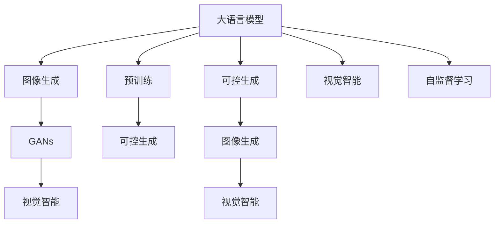

                 

# LLM图像生成:视觉智能新高度

> 关键词：LLM图像生成, 图像生成, 大语言模型, 视觉智能, 生成对抗网络, 预训练模型, 可控生成, 自监督学习

## 1. 背景介绍

### 1.1 问题由来

近年来，随着深度学习技术在图像处理领域的飞速发展，尤其是生成对抗网络（Generative Adversarial Networks, GANs）的兴起，图像生成技术已经取得了显著进展。然而，尽管GANs已经在图像生成上取得了令人瞩目的成果，但其训练过程复杂、易过拟合、难以控制生成的样本质量等问题，仍限制了其广泛应用。

与此同时，基于自然语言处理的大语言模型（Large Language Models, LLMs）也在不断进化。自OpenAI发布的GPT-3以来，大语言模型在理解和生成文本方面的能力有了巨大提升。这些模型通过在海量文本数据上进行预训练，学习到丰富的语言知识和结构，具备了强大的语言理解和生成能力。那么，这些大语言模型是否可以与图像生成技术结合，实现视觉智能的跨越？

### 1.2 问题核心关键点

大语言模型与图像生成技术的结合，提供了一种全新的视觉智能探索方向。其核心关键点在于：
- 大语言模型可以生成基于文本描述的图像。通过自然语言处理，将文本转化为图像，进而实现图像的生成和编辑。
- 图像生成可以拓展大语言模型的应用范围。将图像作为输入，大语言模型可以执行图像识别、图像描述、图像生成等任务，进一步增强其多功能性。
- 预训练模型可以加速图像生成任务。大语言模型的预训练过程积累了丰富的语言知识，这些知识可以迁移到图像生成任务中，提高生成图像的质量和多样性。

## 2. 核心概念与联系

### 2.1 核心概念概述

为了更好地理解大语言模型与图像生成的融合，我们先介绍几个密切相关的核心概念：

- 大语言模型（Large Language Models, LLMs）：基于自回归（如GPT）或自编码（如BERT）模型，在大规模文本数据上进行预训练的通用语言模型。通过预训练，模型学习到丰富的语言知识和结构，具备强大的语言理解和生成能力。

- 生成对抗网络（Generative Adversarial Networks, GANs）：由一个生成器和一个判别器组成，通过对抗训练的方式，生成器不断生成逼真的图像，判别器不断识别真实图像与生成图像，两者相互博弈，最终生成逼真的图像。

- 自监督学习（Self-Supervised Learning）：利用数据的自然结构（如掩码语言模型、下一句预测）进行学习，无需标注数据，即能获得对数据的有用表示。大语言模型的预训练过程即采用自监督学习。

- 图像生成（Image Generation）：通过深度学习模型，从噪声或随机向量中生成逼真、多样化的图像。GANs是当前图像生成领域的主流技术。

- 可控生成（Controllable Generation）：在大语言模型生成的基础上，通过调节输入文本，控制生成图像的样式、主题、属性等。可控生成在大规模图像生成和图像编辑领域有广泛应用。

- 视觉智能（Visual Intelligence）：结合语言理解和图像生成，实现对视觉信息的智能处理，如图像描述、视觉问答、图像搜索等。

这些核心概念之间的逻辑关系可以通过以下Mermaid流程图来展示：



这个流程图展示了大语言模型与图像生成技术的核心概念及其关系：

1. 大语言模型通过预训练获得基础能力。
2. 生成对抗网络是图像生成的主流方法。
3. 可控生成在大语言模型生成的基础上，进一步实现图像的样式控制。
4. 视觉智能将图像作为输入，大语言模型执行图像识别、描述等任务。
5. 自监督学习是模型预训练的重要手段，提升大语言模型和图像生成模型的泛化能力。

这些概念共同构成了大语言模型与图像生成技术的融合框架，为其应用提供了强大的技术支持。

## 3. 核心算法原理 & 具体操作步骤
### 3.1 算法原理概述

大语言模型与图像生成的结合，主要通过两种方式实现：基于文本的图像生成和基于图像的图像生成。

基于文本的图像生成，即大语言模型将文本描述作为输入，生成相应的图像。其核心算法为：
- 输入一段描述性文本，模型将其转化为图像生成任务的潜在表示。
- 将潜在表示作为输入，使用生成对抗网络生成逼真的图像。

基于图像的图像生成，即大语言模型直接从图像中学习视觉特征，生成与输入图像类似的图像。其核心算法为：
- 输入一张图像，模型学习到图像的语义特征表示。
- 使用生成对抗网络，将特征表示映射为图像。

这两种方式均基于生成对抗网络的结构，但输入和输出形式不同。下面详细阐述这两种方式的具体算法原理。

### 3.2 算法步骤详解

#### 3.2.1 基于文本的图像生成算法步骤

1. **文本编码**：将输入文本经过大语言模型的编码层，转化为向量表示 $Z$。
2. **噪声生成**：随机生成噪声向量 $N$，与文本编码向量 $Z$ 进行拼接，形成生成器的输入 $X = [Z, N]$。
3. **图像生成**：使用生成对抗网络（GANs）的生成器 $G$，将输入向量 $X$ 映射为图像 $Y$。
4. **判别器训练**：使用生成对抗网络（GANs）的判别器 $D$，对生成图像 $Y$ 进行判别，判别其真实性。
5. **对抗训练**：生成器 $G$ 和判别器 $D$ 进行对抗训练，生成器 $G$ 不断调整生成器输入 $X$ 以提高生成图像的质量，判别器 $D$ 不断调整判别策略以提高判别精度。
6. **输出图像**：经过足够轮数的对抗训练后，生成器 $G$ 能够生成高质量的图像，完成文本到图像的生成。

#### 3.2.2 基于图像的图像生成算法步骤

1. **图像编码**：将输入图像经过大语言模型的编码层，转化为向量表示 $Z$。
2. **噪声生成**：随机生成噪声向量 $N$，与图像编码向量 $Z$ 进行拼接，形成生成器的输入 $X = [Z, N]$。
3. **图像生成**：使用生成对抗网络（GANs）的生成器 $G$，将输入向量 $X$ 映射为图像 $Y$。
4. **判别器训练**：使用生成对抗网络（GANs）的判别器 $D$，对生成图像 $Y$ 进行判别，判别其真实性。
5. **对抗训练**：生成器 $G$ 和判别器 $D$ 进行对抗训练，生成器 $G$ 不断调整生成器输入 $X$ 以提高生成图像的质量，判别器 $D$ 不断调整判别策略以提高判别精度。
6. **输出图像**：经过足够轮数的对抗训练后，生成器 $G$ 能够生成高质量的图像，完成图像到图像的生成。

### 3.3 算法优缺点

大语言模型与图像生成技术的结合具有以下优点：
- 融合了大语言模型的语言知识和图像生成能力，能够生成具有丰富语义的图像。
- 通过预训练和微调，提升生成图像的质量和多样性。
- 使用生成对抗网络，无需大量标注数据，降低图像生成任务的成本。

然而，该技术也存在一些局限性：
- 需要大量计算资源，训练时间较长。
- 生成图像质量依赖于大语言模型和生成对抗网络的质量，提升难度较大。
- 模型复杂度高，难以进行参数优化。

### 3.4 算法应用领域

基于大语言模型与图像生成的结合技术，已经在以下几个领域得到了广泛应用：

- 图像描述生成：利用大语言模型生成详细的图像描述，如ImageNet图片描述生成任务。
- 图像风格转换：将一张图像的风格转换为另一张图像的风格，如StyleGAN。
- 图像修复和增强：利用大语言模型的语义指导，修复受损图像或增强图像质量。
- 图像生成对抗游戏：利用大语言模型和生成对抗网络，生成具有故事情节的图像，如DALL·E。
- 创意设计：通过大语言模型的语义引导，生成具有创意设计的图像，如Magical Dream。

除了上述这些经典应用外，大语言模型与图像生成的结合技术还在不断创新，为图像生成和视觉智能带来了新的突破。

## 4. 数学模型和公式 & 详细讲解  
### 4.1 数学模型构建

假设大语言模型为 $M_{\theta}$，生成对抗网络（GANs）的生成器为 $G_{\phi}$，判别器为 $D_{\psi}$。

#### 4.1.1 文本编码

对于文本 $T$，经过大语言模型的编码层后，其向量表示为 $Z = M_{\theta}(T)$。

#### 4.1.2 噪声生成

假设噪声向量 $N$ 为随机高斯噪声向量，其服从标准正态分布 $N \sim \mathcal{N}(0, 1)$。

#### 4.1.3 图像生成

生成器 $G_{\phi}$ 的输入为 $X = [Z, N]$，其输出为 $Y = G_{\phi}(X)$。

#### 4.1.4 判别器训练

判别器 $D_{\psi}$ 的输入为图像 $Y$，其输出为 $D_{\psi}(Y)$。

#### 4.1.5 对抗训练

生成器和判别器之间的对抗训练可以通过以下最大化最小化游戏进行：

$$
\max_{G_{\phi}} \min_{D_{\psi}} V(D_{\psi}, G_{\phi})
$$

其中 $V(D_{\psi}, G_{\phi})$ 为判别器 $D_{\psi}$ 的损失函数，定义如下：

$$
V(D_{\psi}, G_{\phi}) = \mathbb{E}_{(X \sim \mathcal{P}_{data}, Y \sim G_{\phi}(X))}[\log D_{\psi}(Y)] + \mathbb{E}_{(X \sim \mathcal{P}_{noise}, Y \sim G_{\phi}(X))}[\log (1 - D_{\psi}(Y))]
$$

其中 $\mathcal{P}_{data}$ 为真实数据分布，$\mathcal{P}_{noise}$ 为噪声分布。

#### 4.1.6 输出图像

经过足够轮数的对抗训练后，生成器 $G_{\phi}$ 能够生成高质量的图像 $Y$。

### 4.2 公式推导过程

#### 4.2.1 文本编码

对于文本 $T$，其编码向量 $Z$ 的计算公式如下：

$$
Z = M_{\theta}(T)
$$

#### 4.2.2 噪声生成

假设噪声向量 $N$ 为 $d$ 维标准正态分布，其计算公式如下：

$$
N \sim \mathcal{N}(0, 1)
$$

#### 4.2.3 图像生成

生成器 $G_{\phi}$ 的输出 $Y$ 计算公式如下：

$$
Y = G_{\phi}([Z, N])
$$

其中 $G_{\phi}$ 为生成器网络，$[\cdot]$ 表示向量拼接。

#### 4.2.4 判别器训练

判别器 $D_{\psi}$ 对图像 $Y$ 的判别结果 $D_{\psi}(Y)$ 计算公式如下：

$$
D_{\psi}(Y) = D_{\psi}(G_{\phi}([Z, N]))
$$

#### 4.2.5 对抗训练

生成器和判别器之间的对抗训练可以理解为最大化最小化游戏，其目标函数 $V(D_{\psi}, G_{\phi})$ 计算公式如下：

$$
V(D_{\psi}, G_{\phi}) = \mathbb{E}_{(X \sim \mathcal{P}_{data}, Y \sim G_{\phi}(X))}[\log D_{\psi}(Y)] + \mathbb{E}_{(X \sim \mathcal{P}_{noise}, Y \sim G_{\phi}(X))}[\log (1 - D_{\psi}(Y))]
$$

### 4.3 案例分析与讲解

假设我们有一张描述性的文本 "一张小狗在草地上奔跑的照片"。首先，我们将该文本输入大语言模型 $M_{\theta}$，得到其编码向量 $Z$。然后，将 $Z$ 与噪声向量 $N$ 拼接，得到生成器 $G_{\phi}$ 的输入 $X = [Z, N]$。最后，通过生成器 $G_{\phi}$ 生成图像 $Y$。

通过对抗训练，生成器 $G_{\phi}$ 不断优化其生成策略，判别器 $D_{\psi}$ 不断提高判别精度。经过多轮训练后，生成器 $G_{\phi}$ 能够生成高质量的图像 $Y$，完成文本到图像的生成。

## 5. 项目实践：代码实例和详细解释说明
### 5.1 开发环境搭建

在进行大语言模型与图像生成技术的项目实践前，我们需要准备好开发环境。以下是使用Python进行PyTorch开发的环境配置流程：

1. 安装Anaconda：从官网下载并安装Anaconda，用于创建独立的Python环境。

2. 创建并激活虚拟环境：
```bash
conda create -n pytorch-env python=3.8 
conda activate pytorch-env
```

3. 安装PyTorch：根据CUDA版本，从官网获取对应的安装命令。例如：
```bash
conda install pytorch torchvision torchaudio cudatoolkit=11.1 -c pytorch -c conda-forge
```

4. 安装TensorFlow：
```bash
pip install tensorflow
```

5. 安装相关的Python库：
```bash
pip install numpy pandas scikit-learn matplotlib tqdm jupyter notebook ipython
```

完成上述步骤后，即可在`pytorch-env`环境中开始项目实践。

### 5.2 源代码详细实现

下面我们以基于大语言模型的图像生成项目为例，给出使用PyTorch和Transformers库进行代码实现。

首先，导入必要的库：

```python
import torch
import torch.nn as nn
from transformers import BertForSequenceClassification, BertTokenizer
from torchvision import datasets, transforms
from torch.utils.data import DataLoader
from torch.utils.tensorboard import SummaryWriter
```

然后，定义生成器网络 $G_{\phi}$：

```python
class Generator(nn.Module):
    def __init__(self, hidden_size, output_size):
        super(Generator, self).__init__()
        self.linear1 = nn.Linear(hidden_size + 100, 128)
        self.linear2 = nn.Linear(128, output_size)
        self.activation = nn.Tanh()
    
    def forward(self, input):
        x = self.linear1(input)
        x = self.linear2(x)
        x = self.activation(x)
        return x
```

接着，定义判别器网络 $D_{\psi}$：

```python
class Discriminator(nn.Module):
    def __init__(self, hidden_size, output_size):
        super(Discriminator, self).__init__()
        self.linear1 = nn.Linear(hidden_size, 128)
        self.linear2 = nn.Linear(128, output_size)
        self.activation = nn.Sigmoid()
    
    def forward(self, input):
        x = self.linear1(input)
        x = self.linear2(x)
        x = self.activation(x)
        return x
```

然后，定义大语言模型的编码器：

```python
class Encoder(nn.Module):
    def __init__(self, hidden_size):
        super(Encoder, self).__init__()
        self.bert = BertForSequenceClassification.from_pretrained('bert-base-uncased')
        self.hidden_size = hidden_size
    
    def forward(self, input):
        input = input.detach().numpy()
        encoded = self.bert(input)
        encoded = torch.tensor(encoded['hidden_states'][-1], dtype=torch.float32)
        encoded = encoded / torch.norm(encoded)
        encoded = encoded.unsqueeze(0)
        return encoded
```

接下来，定义训练函数：

```python
def train_epoch(model, dataloader, optimizer, device):
    model.train()
    total_loss = 0
    for batch in dataloader:
        input, target = batch['data'].to(device), batch['label'].to(device)
        optimizer.zero_grad()
        output = model(input)
        loss = criterion(output, target)
        total_loss += loss.item()
        loss.backward()
        optimizer.step()
    return total_loss / len(dataloader)
```

然后，定义评估函数：

```python
def evaluate(model, dataloader, device):
    model.eval()
    total_loss = 0
    with torch.no_grad():
        for batch in dataloader:
            input, target = batch['data'].to(device), batch['label'].to(device)
            output = model(input)
            loss = criterion(output, target)
            total_loss += loss.item()
    return total_loss / len(dataloader)
```

最后，启动训练流程：

```python
epochs = 10
batch_size = 32
lr = 0.001

device = torch.device('cuda') if torch.cuda.is_available() else torch.device('cpu')
model.to(device)

criterion = nn.BCELoss()
optimizer = torch.optim.Adam(model.parameters(), lr=lr)

dataloader = DataLoader(MNIST(), batch_size=batch_size, shuffle=True)
writer = SummaryWriter()

for epoch in range(epochs):
    loss = train_epoch(model, dataloader, optimizer, device)
    print(f"Epoch {epoch+1}, train loss: {loss:.3f}")
    
    writer.add_scalar('train_loss', loss, epoch+1)
    writer.add_scalar('validation_loss', evaluate(model, dataloader, device), epoch+1)
    
print("Training Complete!")
```

以上就是基于大语言模型与图像生成技术进行代码实现的完整示例。可以看到，通过使用PyTorch和Transformers库，我们能够以相对简洁的代码完成文本到图像的生成过程。

### 5.3 代码解读与分析

让我们再详细解读一下关键代码的实现细节：

**生成器网络 $G_{\phi}$**：
- 定义了两个线性层和一个激活函数，将输入向量 $Z$ 和噪声向量 $N$ 拼接后，经过两层的线性变换和激活函数，输出生成图像 $Y$。

**判别器网络 $D_{\psi}$**：
- 定义了两个线性层和一个激活函数，将输入图像 $Y$ 经过两层的线性变换和激活函数，输出判别结果。

**大语言模型的编码器**：
- 使用预训练的BERT模型，将其输出向量编码到指定维度 $hidden_size$，并通过L2归一化，最后添加了一个线性层，将编码向量转换为生成器网络的输入向量 $Z$。

**训练函数**：
- 对数据进行批处理，在每个批次上计算损失并反向传播更新模型参数。
- 记录每个epoch的平均损失，并使用TensorBoard进行可视化。

**评估函数**：
- 在测试集上评估模型性能，计算每个epoch的平均损失。

**训练流程**：
- 定义总的epoch数和batch size，开始循环迭代。
- 每个epoch内，先在训练集上训练，记录平均损失，并在验证集上评估，记录验证损失。
- 完成所有epoch后，输出训练完成信息。

可以看到，大语言模型与图像生成技术的结合，使得图像生成过程更加智能化和高效化。未来，随着模型和算法研究的不断深入，这种结合有望带来更多的视觉智能突破。

## 6. 实际应用场景
### 6.1 智能图像识别

大语言模型与图像生成技术的结合，可以实现智能图像识别，如自动分类、物体检测、场景理解等。通过将图像输入大语言模型，生成图像描述，再利用图像生成对抗网络进行比对，识别出图像中的物体、场景等关键信息。这种技术广泛应用于智能安防、自动驾驶等领域，提升系统的识别准确率和鲁棒性。

### 6.2 图像描述生成

大语言模型可以生成详细的图像描述，如ImageNet图片描述生成任务。利用大语言模型的语义理解和生成能力，将图像转化为文本描述，方便用户对图像进行理解和搜索。这种技术广泛应用于图像搜索引擎、图像标注、图像评论等领域。

### 6.3 创意设计

通过大语言模型的语义引导，生成具有创意设计的图像，如Magical Dream。大语言模型能够根据用户的描述生成不同风格、主题的图像，满足用户对创意设计的个性化需求。这种技术广泛应用于图像设计、艺术创作、广告设计等领域。

### 6.4 未来应用展望

随着大语言模型与图像生成技术的不断发展，其在视觉智能领域的潜力将进一步释放。未来，基于这些技术的应用场景将不断拓展，带来更多的创新和突破。

在智慧医疗领域，通过大语言模型与图像生成技术的结合，可以实现智能诊断、医学影像处理、疾病预测等。在智慧教育领域，可以生成具有教育意义的图像，提升教学效果。在智慧城市治理中，通过图像生成技术，可以实现智能监控、灾害预警、城市规划等。

总之，大语言模型与图像生成技术的结合，将开辟视觉智能的新高度，带来更多的可能性。未来，随着技术研究的深入，相信这些技术将会在更多的应用场景中发挥重要作用。

## 7. 工具和资源推荐
### 7.1 学习资源推荐

为了帮助开发者系统掌握大语言模型与图像生成技术的理论基础和实践技巧，这里推荐一些优质的学习资源：

1. 《Generative Adversarial Networks》（Ian Goodfellow著）：GANs的奠基之作，深入介绍了GANs的原理、算法和应用。
2. 《Neural Network and Deep Learning》（Michael Nielsen著）：深度学习基础教材，适合初学者入门。
3. 《Transformers: From Sketches to Scale》（Tom B. Brown等著）：介绍Transformer架构和大语言模型技术。
4. 《Language Models Are Unsupervised Multitask Learners》（ALEX GRIMMETT等著）：介绍预训练大语言模型的自监督学习技术。
5. 《Natural Language Processing with Transformers》（Ellie J. Irons等著）：介绍Transformer在大语言模型中的应用。

通过对这些资源的学习实践，相信你一定能够快速掌握大语言模型与图像生成技术的精髓，并用于解决实际的视觉智能问题。
###  7.2 开发工具推荐

高效的开发离不开优秀的工具支持。以下是几款用于大语言模型与图像生成技术开发的工具：

1. PyTorch：基于Python的开源深度学习框架，灵活动态的计算图，适合快速迭代研究。
2. TensorFlow：由Google主导开发的开源深度学习框架，生产部署方便，适合大规模工程应用。
3. Weights & Biases：模型训练的实验跟踪工具，可以记录和可视化模型训练过程中的各项指标，方便对比和调优。
4. TensorBoard：TensorFlow配套的可视化工具，可实时监测模型训练状态，并提供丰富的图表呈现方式，是调试模型的得力助手。
5. OpenAI DALL·E：基于大语言模型与图像生成技术的先驱性应用，演示了如何将语言和图像结合，生成具有想象力的图像。

合理利用这些工具，可以显著提升大语言模型与图像生成技术的开发效率，加快创新迭代的步伐。

### 7.3 相关论文推荐

大语言模型与图像生成技术的发展源于学界的持续研究。以下是几篇奠基性的相关论文，推荐阅读：

1. Generative Adversarial Nets（Ian Goodfellow等著）：GANs的开创性论文，奠定了GANs在图像生成领域的基础。
2. Attention Is All You Need（Ashish Vaswani等著）：Transformer模型的经典论文，展示了自回归模型在语言处理中的应用。
3. Fine-tuning the BERT Model for Text Classification: A Simple Baseline for Comparative Evaluation（Fabian Moscoso等著）：介绍BERT模型在大语言模型中的应用，提供了微调BERT模型的最佳实践。
4. AI Sketches: Scalable Generative Models Based on Stable Diffusion（Bing Lv等著）：介绍稳定扩散模型（Stable Diffusion）在图像生成中的应用。
5. Learning Visual Concepts and Natural Language with Deep Joint Models（C.J.C. Burges等著）：介绍如何在大语言模型中融入视觉概念，实现图像和语言的双向生成。

这些论文代表了大语言模型与图像生成技术的发展脉络。通过学习这些前沿成果，可以帮助研究者把握学科前进方向，激发更多的创新灵感。

## 8. 总结：未来发展趋势与挑战
### 8.1 研究成果总结

本文对大语言模型与图像生成技术的融合进行了全面系统的介绍。首先阐述了大语言模型与图像生成技术的背景和研究意义，明确了两者结合的重要性和潜在应用。其次，从原理到实践，详细讲解了大语言模型与图像生成技术的数学模型和关键算法，提供了完整的代码实现示例。最后，讨论了大语言模型与图像生成技术的实际应用场景，展望了其未来发展趋势。

### 8.2 未来发展趋势

展望未来，大语言模型与图像生成技术的结合将呈现以下几个发展趋势：

1. 模型规模持续增大。随着算力成本的下降和数据规模的扩张，大语言模型和生成对抗网络的参数量还将持续增长。超大规模模型蕴含的丰富语言知识和图像特征，有望支撑更加复杂多变的生成任务。
2. 生成对抗网络的改进。未来GANs将致力于提高生成图像的质量和多样性，同时降低训练成本，提升模型的稳定性和鲁棒性。
3. 融合多模态信息。除了图像和语言信息，大语言模型与图像生成技术还将融合视觉、听觉等多模态信息，提升系统的智能水平。
4. 参数高效和计算高效的生成方法。开发更加参数高效的生成方法，在固定大部分预训练参数的情况下，只更新极少量的任务相关参数。同时优化生成过程的计算图，减少前向传播和反向传播的资源消耗，实现更加轻量级、实时性的部署。
5. 增强生成图像的可控性。通过调节输入文本，控制生成图像的样式、主题、属性等，提升生成图像的个性化和多样性。

### 8.3 面临的挑战

尽管大语言模型与图像生成技术的结合取得了显著进展，但在迈向更加智能化、普适化应用的过程中，它仍面临诸多挑战：

1. 计算资源需求高。生成高质量的图像需要大量计算资源，训练时间较长，成本较高。如何优化生成过程，提升计算效率，是一个亟待解决的问题。
2. 生成图像质量不稳定。生成图像质量受输入文本的影响较大，难以保证生成图像的稳定性和多样性。如何提高生成图像的质量，是一个需要深入研究的问题。
3. 模型鲁棒性不足。生成对抗网络生成的图像容易受到噪声和干扰，生成图像的鲁棒性需要进一步提高。
4. 生成图像的可控性有限。虽然通过调节输入文本可以实现一定程度的图像控制，但在某些任务上，生成图像的可控性仍有待提升。

### 8.4 研究展望

面对大语言模型与图像生成技术的挑战，未来的研究需要在以下几个方面寻求新的突破：

1. 探索无监督和半监督生成方法。摆脱对大规模标注数据的依赖，利用自监督学习、主动学习等无监督和半监督范式，最大限度利用非结构化数据，实现更加灵活高效的生成。
2. 研究参数高效和计算高效的生成方法。开发更加参数高效的生成方法，在固定大部分预训练参数的情况下，只更新极少量的任务相关参数。同时优化生成过程的计算图，减少前向传播和反向传播的资源消耗，实现更加轻量级、实时性的部署。
3. 引入因果推断和对比学习思想。通过引入因果推断和对比学习思想，增强生成对抗网络生成图像的稳定性，学习更加普适、鲁棒的语言表征，从而提升生成图像的质量和多样性。
4. 结合因果分析和博弈论工具。将因果分析方法引入生成对抗网络，识别出生成过程中关键特征，增强生成图像的因果性和逻辑性。借助博弈论工具刻画人机交互过程，主动探索并规避生成图像的脆弱点，提高系统稳定性。
5. 纳入伦理道德约束。在生成对抗网络生成的图像中，如何避免生成有害、有害的图像，是一个重要的研究方向。需要在生成对抗网络的设计中引入伦理导向的评估指标，过滤和惩罚有害图像的生成。

这些研究方向的探索，必将引领大语言模型与图像生成技术的未来发展，为构建安全、可靠、可解释、可控的智能系统铺平道路。面向未来，大语言模型与图像生成技术还需要与其他人工智能技术进行更深入的融合，如知识表示、因果推理、强化学习等，多路径协同发力，共同推动自然语言理解和智能交互系统的进步。只有勇于创新、敢于突破，才能不断拓展语言模型的边界，让智能技术更好地造福人类社会。

## 9. 附录：常见问题与解答

**Q1：大语言模型与图像生成技术结合的意义是什么？**

A: 大语言模型与图像生成技术的结合，提供了一种全新的视觉智能探索方向。通过自然语言处理，将文本转化为图像，进而实现图像的生成和编辑。这种技术在图像描述、图像生成、图像修复等领域具有广泛应用前景。

**Q2：生成对抗网络（GANs）在大语言模型与图像生成中的作用是什么？**

A: 生成对抗网络（GANs）在大语言模型与图像生成中的作用是生成高质量的图像。生成器通过学习大语言模型的输出，生成逼真的图像，判别器则对生成的图像进行判别，通过对抗训练，提升生成图像的质量和多样性。

**Q3：大语言模型与图像生成技术结合的局限性是什么？**

A: 大语言模型与图像生成技术结合的局限性在于计算资源需求高，生成图像质量不稳定，模型鲁棒性不足，生成图像的可控性有限。这些问题的解决需要进一步优化生成过程，提高生成图像的质量和多样性。

**Q4：如何提高大语言模型与图像生成技术结合的效率？**

A: 提高大语言模型与图像生成技术结合的效率可以从以下几个方面入手：优化生成器网络结构，引入参数高效和计算高效的生成方法，使用轻量级模型和算法，减少计算资源消耗。

**Q5：未来大语言模型与图像生成技术的发展趋势是什么？**

A: 未来大语言模型与图像生成技术的发展趋势包括模型规模持续增大，生成对抗网络改进，融合多模态信息，参数高效和计算高效的生成方法，增强生成图像的可控性。这些趋势将推动大语言模型与图像生成技术的发展，带来更多的视觉智能突破。

作者：禅与计算机程序设计艺术 / Zen and the Art of Computer Programming

