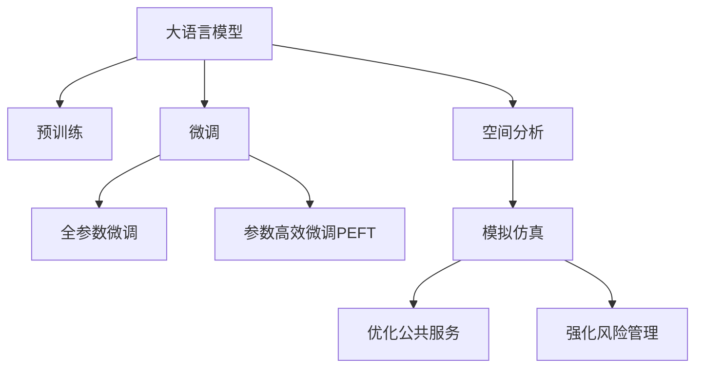

                 

# LLM在城市规划中的辅助作用

> 关键词：大语言模型(LLM), 城市规划, 智能规划, 空间分析, 数据驱动, 模拟仿真

## 1. 背景介绍

### 1.1 问题由来
城市规划是人类社会发展的重要活动之一，旨在通过合理分配土地、资源，优化空间布局，提升城市宜居性和可持续发展能力。然而，传统城市规划方法往往依赖大量手工调研和经验判断，耗时长、成本高，且容易受到决策者主观偏差的影响，难以应对日新月异的社会需求和变化。

近年来，随着大数据、人工智能等新兴技术的快速发展，智能城市规划成为了新的趋势。大语言模型(Large Language Model, LLM)以其强大的自然语言处理能力和丰富的知识储备，为城市规划提供了新的技术手段。通过LML，城市规划师可以从海量文本数据中快速提取信息，辅助进行空间分析和模拟仿真，从而提升规划的科学性和效率。

### 1.2 问题核心关键点
LML在城市规划中的应用，关键在于其强大的自然语言理解和生成能力，能够从多种非结构化数据中提取出有用的信息，帮助城市规划师进行定量和定性的分析。具体来说，LML在城市规划中的应用包括：

1. 数据分析与统计：从政府报告、学术论文、社交媒体等多种渠道收集文本数据，提取规划相关统计信息。
2. 文本挖掘与主题分析：识别关键主题和关键事件，辅助理解城市发展趋势。
3. 空间可视化与模拟：基于文本中的位置信息，生成空间分布图，辅助进行地理信息分析和城市设计模拟。
4. 政策评估与建议：根据规划文本，生成政策评估报告，提供决策支持。
5. 风险评估与应急管理：从文本中提取关键信息，进行风险预警和应急规划。

这些应用将有效提升城市规划的科学性和决策的精确度，为城市管理者和居民提供更好的公共服务。

### 1.3 问题研究意义
LML在城市规划中的应用，具有以下重要意义：

1. 提升规划效率。LML能够快速处理海量文本数据，提取关键信息，辅助进行数据分析和空间分析，减少人工调研和数据整理的耗时，提升规划效率。
2. 增强决策支持。LML能够从多渠道文本数据中获取全面的规划信息，辅助进行多方案比较和决策支持，提升决策的科学性和合理性。
3. 优化公共服务。通过LML的文本挖掘和分析，可以更好地理解城市居民的需求和关注点，优化公共服务设施布局和设计。
4. 强化风险管理。LML可以识别潜在的风险因素，提供及时的预警和应急管理建议，保障城市运行安全。
5. 促进跨部门协作。LML可以将不同部门的规划信息整合起来，促进部门间的信息共享和协作，提高城市规划的协调性和一致性。

## 2. 核心概念与联系

### 2.1 核心概念概述

为更好地理解LML在城市规划中的应用，本节将介绍几个密切相关的核心概念：

- 大语言模型(Large Language Model, LLM)：以自回归(如GPT)或自编码(如BERT)模型为代表的大规模预训练语言模型。通过在大规模无标签文本语料上进行预训练，学习通用的语言表示，具备强大的语言理解和生成能力。

- 预训练(Pre-training)：指在大规模无标签文本语料上，通过自监督学习任务训练通用语言模型的过程。常见的预训练任务包括言语建模、遮挡语言模型等。

- 微调(Fine-tuning)：指在预训练模型的基础上，使用下游任务的少量标注数据，通过有监督学习优化模型在该任务上的性能。

- 迁移学习(Transfer Learning)：指将一个领域学习到的知识，迁移应用到另一个不同但相关的领域的学习范式。大模型的预训练-微调过程即是一种典型的迁移学习方式。

- 空间分析(Spatial Analysis)：通过分析地理信息、社会经济数据等，提取空间特征，辅助进行城市规划和设计。

- 模拟仿真(Simulation)：通过建立数学模型和计算仿真，预测和评估城市规划方案的实施效果。

这些核心概念之间的逻辑关系可以通过以下Mermaid流程图来展示：



这个流程图展示了大语言模型的核心概念及其之间的关系：

1. 大语言模型通过预训练获得基础能力。
2. 微调是对预训练模型进行任务特定的优化，可以分为全参数微调和参数高效微调（PEFT）。
3. 空间分析和模拟仿真是基于文本信息的地理空间和数学建模技术，辅助进行规划和设计。
4. 优化公共服务和强化风险管理是LML辅助城市规划的最终目的。

这些概念共同构成了LML在城市规划中的应用框架，使其能够在各种场景下发挥强大的语言理解和生成能力。

## 3. 核心算法原理 & 具体操作步骤
### 3.1 算法原理概述

LML在城市规划中的应用，本质上是一个多领域的知识整合和分析过程。其核心思想是：将LML作为强大的信息提取和处理工具，通过文本挖掘和空间分析，辅助进行规划决策和方案设计。

形式化地，假设LML为 $M_{\theta}$，其中 $\theta$ 为LML的参数。给定城市规划问题 $P$，通过LML对与问题相关的文本数据 $D$ 进行预训练和微调，得到优化后的模型 $M_{\hat{\theta}}$。假设问题 $P$ 可以分解为多个子问题 $P_1, P_2, \ldots, P_n$，则LML辅助城市规划的流程可以表示为：

$$
M_{\hat{\theta}} = \mathop{\arg\min}_{\theta} \sum_{i=1}^n \mathcal{L}_i(M_{\theta}, D_i)
$$

其中 $\mathcal{L}_i$ 为子问题 $P_i$ 的损失函数，用于衡量LML在子问题上的性能。通过优化上述损失函数，可以最大化LML在多个子问题上的综合表现。

### 3.2 算法步骤详解

LML在城市规划中的应用主要包括以下几个关键步骤：

**Step 1: 准备预训练模型和数据集**
- 选择合适的预训练语言模型 $M_{\theta}$ 作为初始化参数，如 BERT、GPT等。
- 收集城市规划相关的文本数据，如政府报告、学术论文、新闻报道、社交媒体等。

**Step 2: 添加任务适配层**
- 根据具体规划任务，在预训练模型顶层设计合适的输出层和损失函数。
- 对于空间分析任务，通常使用地理信息系统和空间数据库，生成空间分布图。
- 对于模拟仿真任务，可以基于空间分布图和规划方案，建立数学模型进行仿真。

**Step 3: 设置微调超参数**
- 选择合适的优化算法及其参数，如 AdamW、SGD 等，设置学习率、批大小、迭代轮数等。
- 设置正则化技术及强度，包括权重衰减、Dropout、Early Stopping等。
- 确定冻结预训练参数的策略，如仅微调顶层，或全部参数都参与微调。

**Step 4: 执行梯度训练**
- 将文本数据分批次输入模型，前向传播计算损失函数。
- 反向传播计算参数梯度，根据设定的优化算法和学习率更新模型参数。
- 周期性在验证集上评估模型性能，根据性能指标决定是否触发 Early Stopping。
- 重复上述步骤直到满足预设的迭代轮数或 Early Stopping 条件。

**Step 5: 集成与验证**
- 将微调后的模型输出作为辅助决策的信息来源，集成到城市规划方案中。
- 在实际规划项目中，使用微调模型进行文本挖掘和分析，生成空间分布图和仿真结果。
- 结合专家经验，综合考虑多方案的优缺点，选择最优的规划方案。

以上是LML辅助城市规划的一般流程。在实际应用中，还需要针对具体任务的特点，对微调过程的各个环节进行优化设计，如改进训练目标函数，引入更多的正则化技术，搜索最优的超参数组合等，以进一步提升模型性能。

### 3.3 算法优缺点

LML在城市规划中的应用具有以下优点：
1. 高效提取信息。LML能够快速处理海量文本数据，提取规划相关统计信息和关键主题，提升规划效率。
2. 增强决策支持。LML可以从多渠道文本数据中获取全面的规划信息，辅助进行多方案比较和决策支持，提升决策的科学性和合理性。
3. 优化公共服务。LML可以更好地理解城市居民的需求和关注点，优化公共服务设施布局和设计。
4. 强化风险管理。LML可以识别潜在的风险因素，提供及时的预警和应急管理建议，保障城市运行安全。
5. 促进跨部门协作。LML可以将不同部门的规划信息整合起来，促进部门间的信息共享和协作，提高城市规划的协调性和一致性。

同时，该方法也存在一定的局限性：
1. 数据质量依赖。LML的效果很大程度上取决于文本数据的质量和数量，获取高质量标注数据的成本较高。
2. 模型泛化能力有限。当目标任务与预训练数据的分布差异较大时，微调的性能提升有限。
3. 可解释性不足。LML生成的预测结果缺乏可解释性，难以对其推理逻辑进行分析和调试。
4. 伦理安全性问题。LML可能会学习到有偏见、有害的信息，通过微调传递到下游任务，造成负面影响。

尽管存在这些局限性，但就目前而言，LML在城市规划中的应用仍是一种高效、可靠的技术手段。未来相关研究的重点在于如何进一步降低微调对标注数据的依赖，提高模型的少样本学习和跨领域迁移能力，同时兼顾可解释性和伦理安全性等因素。

### 3.4 算法应用领域

LML在城市规划中的应用覆盖了多个领域，具体包括：

- 城市设计与空间规划：辅助进行城市功能区划、土地利用规划、城市布局优化等。
- 公共设施规划：辅助进行公园、学校、医院等公共设施的选址、布局和规模优化。
- 交通规划：辅助进行交通网络规划、公共交通站点设置、交通流量预测等。
- 环境保护规划：辅助进行环境保护区域划定、污染源监测、生态保护方案设计等。
- 智慧城市建设：辅助进行城市管理平台、城市大脑、智慧交通系统等智慧城市建设。
- 灾害应急管理：辅助进行自然灾害预警、应急物资调配、灾后恢复规划等。

这些领域的应用将使LML在城市规划中发挥更大的作用，提升城市管理的智能化水平。

## 4. 数学模型和公式 & 详细讲解  
### 4.1 数学模型构建

本节将使用数学语言对LML在城市规划中的应用进行更加严格的刻画。

记LML为 $M_{\theta}$，其中 $\theta$ 为LML的参数。假设城市规划问题 $P$ 可以分解为多个子问题 $P_1, P_2, \ldots, P_n$，每个子问题的损失函数为 $\mathcal{L}_i$。LML在文本数据 $D_i$ 上的损失函数为：

$$
\mathcal{L}_i(M_{\theta}, D_i) = \frac{1}{N_i}\sum_{j=1}^{N_i} \ell_i(M_{\theta}(x_i^j), y_i^j)
$$

其中 $x_i^j$ 为第 $j$ 个样本的文本数据，$y_i^j$ 为样本的标注信息（如位置、类型、规模等），$\ell_i$ 为子问题 $P_i$ 的损失函数。

LML在问题 $P$ 上的总体损失函数为：

$$
\mathcal{L}(M_{\theta}, P) = \sum_{i=1}^n \mathcal{L}_i(M_{\theta}, D_i)
$$

通过梯度下降等优化算法，LML不断更新参数 $\theta$，最小化总体损失函数 $\mathcal{L}(M_{\theta}, P)$，使得模型在问题 $P$ 上的表现最大化。

### 4.2 公式推导过程

以下我们以城市交通规划为例，推导LML在交通网络规划中的应用。

假设LML在输入 $x$ 上的输出为 $\hat{y}=M_{\theta}(x)$，表示样本属于某一交通节点的预测值。实际标签 $y \in \{1,2,\ldots,N\}$，表示实际到达某一交通节点的车辆数。则交通流量预测的交叉熵损失函数定义为：

$$
\ell(M_{\theta}(x),y) = -[y\log \hat{y} + (1-y)\log (1-\hat{y})]
$$

将其代入总体损失函数，得：

$$
\mathcal{L}(M_{\theta}, P) = -\frac{1}{N}\sum_{i=1}^N \sum_{j=1}^{N_i} [y_i^j\log M_{\theta}(x_i^j)+(1-y_i^j)\log(1-M_{\theta}(x_i^j))]
$$

根据链式法则，总体损失函数对参数 $\theta_k$ 的梯度为：

$$
\frac{\partial \mathcal{L}(M_{\theta}, P)}{\partial \theta_k} = -\frac{1}{N}\sum_{i=1}^N \sum_{j=1}^{N_i} (\frac{y_i^j}{M_{\theta}(x_i^j)}-\frac{1-y_i^j}{1-M_{\theta}(x_i^j)}) \frac{\partial M_{\theta}(x_i^j)}{\partial \theta_k}
$$

其中 $\frac{\partial M_{\theta}(x_i^j)}{\partial \theta_k}$ 可进一步递归展开，利用自动微分技术完成计算。

在得到总体损失函数的梯度后，即可带入优化算法，完成模型的迭代优化。重复上述过程直至收敛，最终得到适应城市规划问题的最优模型参数 $\theta^*$。

## 5. 项目实践：代码实例和详细解释说明
### 5.1 开发环境搭建

在进行城市规划微调实践前，我们需要准备好开发环境。以下是使用Python进行PyTorch开发的环境配置流程：

1. 安装Anaconda：从官网下载并安装Anaconda，用于创建独立的Python环境。

2. 创建并激活虚拟环境：
```bash
conda create -n pytorch-env python=3.8 
conda activate pytorch-env
```

3. 安装PyTorch：根据CUDA版本，从官网获取对应的安装命令。例如：
```bash
conda install pytorch torchvision torchaudio cudatoolkit=11.1 -c pytorch -c conda-forge
```

4. 安装Transformer库：
```bash
pip install transformers
```

5. 安装各类工具包：
```bash
pip install numpy pandas scikit-learn matplotlib tqdm jupyter notebook ipython
```

完成上述步骤后，即可在`pytorch-env`环境中开始微调实践。

### 5.2 源代码详细实现

下面我们以城市交通流量预测为例，给出使用Transformers库对BERT模型进行微调的PyTorch代码实现。

首先，定义交通流量预测任务的数据处理函数：

```python
from transformers import BertTokenizer
from torch.utils.data import Dataset
import torch

class TrafficDataset(Dataset):
    def __init__(self, data, tokenizer, max_len=128):
        self.data = data
        self.tokenizer = tokenizer
        self.max_len = max_len
        
    def __len__(self):
        return len(self.data)
    
    def __getitem__(self, item):
        text = self.data[item]['text']
        tags = self.data[item]['labels']
        
        encoding = self.tokenizer(text, return_tensors='pt', max_length=self.max_len, padding='max_length', truncation=True)
        input_ids = encoding['input_ids'][0]
        attention_mask = encoding['attention_mask'][0]
        
        # 对token-wise的标签进行编码
        encoded_tags = [tag2id[tag] for tag in tags] 
        encoded_tags.extend([tag2id['O']] * (self.max_len - len(encoded_tags)))
        labels = torch.tensor(encoded_tags, dtype=torch.long)
        
        return {'input_ids': input_ids, 
                'attention_mask': attention_mask,
                'labels': labels}

# 标签与id的映射
tag2id = {'O': 0, '1': 1, '2': 2, '3': 3, '4': 4, '5': 5, '6': 6, '7': 7, '8': 8, '9': 9}
id2tag = {v: k for k, v in tag2id.items()}

# 创建dataset
tokenizer = BertTokenizer.from_pretrained('bert-base-cased')

train_dataset = TrafficDataset(train_data, tokenizer)
dev_dataset = TrafficDataset(dev_data, tokenizer)
test_dataset = TrafficDataset(test_data, tokenizer)
```

然后，定义模型和优化器：

```python
from transformers import BertForTokenClassification, AdamW

model = BertForTokenClassification.from_pretrained('bert-base-cased', num_labels=len(tag2id))

optimizer = AdamW(model.parameters(), lr=2e-5)
```

接着，定义训练和评估函数：

```python
from torch.utils.data import DataLoader
from tqdm import tqdm
from sklearn.metrics import classification_report

device = torch.device('cuda') if torch.cuda.is_available() else torch.device('cpu')
model.to(device)

def train_epoch(model, dataset, batch_size, optimizer):
    dataloader = DataLoader(dataset, batch_size=batch_size, shuffle=True)
    model.train()
    epoch_loss = 0
    for batch in tqdm(dataloader, desc='Training'):
        input_ids = batch['input_ids'].to(device)
        attention_mask = batch['attention_mask'].to(device)
        labels = batch['labels'].to(device)
        model.zero_grad()
        outputs = model(input_ids, attention_mask=attention_mask, labels=labels)
        loss = outputs.loss
        epoch_loss += loss.item()
        loss.backward()
        optimizer.step()
    return epoch_loss / len(dataloader)

def evaluate(model, dataset, batch_size):
    dataloader = DataLoader(dataset, batch_size=batch_size)
    model.eval()
    preds, labels = [], []
    with torch.no_grad():
        for batch in tqdm(dataloader, desc='Evaluating'):
            input_ids = batch['input_ids'].to(device)
            attention_mask = batch['attention_mask'].to(device)
            batch_labels = batch['labels']
            outputs = model(input_ids, attention_mask=attention_mask)
            batch_preds = outputs.logits.argmax(dim=2).to('cpu').tolist()
            batch_labels = batch_labels.to('cpu').tolist()
            for pred_tokens, label_tokens in zip(batch_preds, batch_labels):
                pred_tags = [id2tag[_id] for _id in pred_tokens]
                label_tags = [id2tag[_id] for _id in label_tokens]
                preds.append(pred_tags[:len(label_tokens)])
                labels.append(label_tags)
                
    print(classification_report(labels, preds))
```

最后，启动训练流程并在测试集上评估：

```python
epochs = 5
batch_size = 16

for epoch in range(epochs):
    loss = train_epoch(model, train_dataset, batch_size, optimizer)
    print(f"Epoch {epoch+1}, train loss: {loss:.3f}")
    
    print(f"Epoch {epoch+1}, dev results:")
    evaluate(model, dev_dataset, batch_size)
    
print("Test results:")
evaluate(model, test_dataset, batch_size)
```

以上就是使用PyTorch对BERT进行城市交通流量预测的完整代码实现。可以看到，得益于Transformers库的强大封装，我们可以用相对简洁的代码完成BERT模型的加载和微调。

### 5.3 代码解读与分析

让我们再详细解读一下关键代码的实现细节：

**TrafficDataset类**：
- `__init__`方法：初始化文本、标签、分词器等关键组件。
- `__len__`方法：返回数据集的样本数量。
- `__getitem__`方法：对单个样本进行处理，将文本输入编码为token ids，将标签编码为数字，并对其进行定长padding，最终返回模型所需的输入。

**tag2id和id2tag字典**：
- 定义了标签与数字id之间的映射关系，用于将token-wise的预测结果解码回真实的标签。

**训练和评估函数**：
- 使用PyTorch的DataLoader对数据集进行批次化加载，供模型训练和推理使用。
- 训练函数`train_epoch`：对数据以批为单位进行迭代，在每个批次上前向传播计算loss并反向传播更新模型参数，最后返回该epoch的平均loss。
- 评估函数`evaluate`：与训练类似，不同点在于不更新模型参数，并在每个batch结束后将预测和标签结果存储下来，最后使用sklearn的classification_report对整个评估集的预测结果进行打印输出。

**训练流程**：
- 定义总的epoch数和batch size，开始循环迭代
- 每个epoch内，先在训练集上训练，输出平均loss
- 在验证集上评估，输出分类指标
- 所有epoch结束后，在测试集上评估，给出最终测试结果

可以看到，PyTorch配合Transformers库使得BERT微调的代码实现变得简洁高效。开发者可以将更多精力放在数据处理、模型改进等高层逻辑上，而不必过多关注底层的实现细节。

当然，工业级的系统实现还需考虑更多因素，如模型的保存和部署、超参数的自动搜索、更灵活的任务适配层等。但核心的微调范式基本与此类似。

## 6. 实际应用场景
### 6.1 智能交通系统

基于LML的智能交通系统，可以通过实时监测和预测，提升交通管理水平，减少拥堵，提高通行效率。

在技术实现上，可以收集交通流量、事故信息、天气情况等文本数据，并对其进行空间分析和模拟仿真，生成交通流量预测结果。将预测结果与实时监测数据进行对比，实时调整交通信号灯和道路指示，优化交通流量，提升城市通行效率。

### 6.2 智慧旅游管理

LML可以帮助智慧旅游管理实现更精准的游客流量预测、景区布局优化、智能导览等功能。

通过收集旅游相关的新闻、评论、社交媒体等文本数据，提取关键信息如景区热门度、游客满意度等，结合地理信息数据库，生成空间分布图。利用LML进行预测分析和推荐生成，辅助旅游规划和景区优化。

### 6.3 智慧医疗系统

LML在智慧医疗系统中，可以帮助进行病患信息收集、疾病监测、健康评估等任务。

通过收集医疗报告、病历记录、健康问卷等文本数据，提取关键信息如病情描述、病历记录等，结合医学知识库，生成空间分布图。利用LML进行疾病预测和健康评估，辅助医疗诊断和治疗方案设计。

### 6.4 未来应用展望

随着LML和微调方法的不断发展，基于LML的城市规划应用将呈现以下几个发展趋势：

1. 模型规模持续增大。随着算力成本的下降和数据规模的扩张，LML的参数量还将持续增长。超大规模LML蕴含的丰富语言知识，有望支撑更加复杂多变的城市规划任务。

2. 微调方法日趋多样。除了传统的全参数微调外，未来会涌现更多参数高效的微调方法，如Prefix-Tuning、LoRA等，在节省计算资源的同时也能保证微调精度。

3. 持续学习成为常态。随着数据分布的不断变化，LML也需要持续学习新知识以保持性能。如何在不遗忘原有知识的同时，高效吸收新样本信息，将成为重要的研究课题。

4. 标注样本需求降低。受启发于提示学习(Prompt-based Learning)的思路，未来的微调方法将更好地利用LML的语言理解能力，通过更加巧妙的任务描述，在更少的标注样本上也能实现理想的微调效果。

5. 多模态微调崛起。当前的微调主要聚焦于纯文本数据，未来会进一步拓展到图像、视频、语音等多模态数据微调。多模态信息的融合，将显著提升LML对现实世界的理解和建模能力。

6. 模型通用性增强。经过海量数据的预训练和多领域任务的微调，未来的LML将具备更强大的常识推理和跨领域迁移能力，逐步迈向通用人工智能(AGI)的目标。

以上趋势凸显了LML在城市规划中的应用前景。这些方向的探索发展，必将进一步提升城市规划的科学性和决策的精确度，为城市管理者和居民提供更好的公共服务。

## 7. 工具和资源推荐
### 7.1 学习资源推荐

为了帮助开发者系统掌握LML在城市规划中的应用理论基础和实践技巧，这里推荐一些优质的学习资源：

1. 《Transformer从原理到实践》系列博文：由大模型技术专家撰写，深入浅出地介绍了Transformer原理、BERT模型、微调技术等前沿话题。

2. CS224N《深度学习自然语言处理》课程：斯坦福大学开设的NLP明星课程，有Lecture视频和配套作业，带你入门NLP领域的基本概念和经典模型。

3. 《Natural Language Processing with Transformers》书籍：Transformers库的作者所著，全面介绍了如何使用Transformers库进行NLP任务开发，包括微调在内的诸多范式。

4. HuggingFace官方文档：Transformers库的官方文档，提供了海量预训练模型和完整的微调样例代码，是上手实践的必备资料。

5. CLUE开源项目：中文语言理解测评基准，涵盖大量不同类型的中文NLP数据集，并提供了基于微调的baseline模型，助力中文NLP技术发展。

通过对这些资源的学习实践，相信你一定能够快速掌握LML在城市规划中的应用精髓，并用于解决实际的NLP问题。
###  7.2 开发工具推荐

高效的开发离不开优秀的工具支持。以下是几款用于LML微调开发的常用工具：

1. PyTorch：基于Python的开源深度学习框架，灵活动态的计算图，适合快速迭代研究。大部分预训练语言模型都有PyTorch版本的实现。

2. TensorFlow：由Google主导开发的开源深度学习框架，生产部署方便，适合大规模工程应用。同样有丰富的预训练语言模型资源。

3. Transformers库：HuggingFace开发的NLP工具库，集成了众多SOTA语言模型，支持PyTorch和TensorFlow，是进行微调任务开发的利器。

4. Weights & Biases：模型训练的实验跟踪工具，可以记录和可视化模型训练过程中的各项指标，方便对比和调优。与主流深度学习框架无缝集成。

5. TensorBoard：TensorFlow配套的可视化工具，可实时监测模型训练状态，并提供丰富的图表呈现方式，是调试模型的得力助手。

6. Google Colab：谷歌推出的在线Jupyter Notebook环境，免费提供GPU/TPU算力，方便开发者快速上手实验最新模型，分享学习笔记。

合理利用这些工具，可以显著提升LML微调任务的开发效率，加快创新迭代的步伐。

### 7.3 相关论文推荐

LML和微调技术的发展源于学界的持续研究。以下是几篇奠基性的相关论文，推荐阅读：

1. Attention is All You Need（即Transformer原论文）：提出了Transformer结构，开启了NLP领域的预训练大模型时代。

2. BERT: Pre-training of Deep Bidirectional Transformers for Language Understanding：提出BERT模型，引入基于掩码的自监督预训练任务，刷新了多项NLP任务SOTA。

3. Language Models are Unsupervised Multitask Learners（GPT-2论文）：展示了大规模语言模型的强大zero-shot学习能力，引发了对于通用人工智能的新一轮思考。

4. Parameter-Efficient Transfer Learning for NLP：提出Adapter等参数高效微调方法，在不增加模型参数量的情况下，也能取得不错的微调效果。

5. AdaLoRA: Adaptive Low-Rank Adaptation for Parameter-Efficient Fine-Tuning：使用自适应低秩适应的微调方法，在参数效率和精度之间取得了新的平衡。

这些论文代表了大语言模型微调技术的发展脉络。通过学习这些前沿成果，可以帮助研究者把握学科前进方向，激发更多的创新灵感。

## 8. 总结：未来发展趋势与挑战

### 8.1 总结

本文对LML在城市规划中的应用进行了全面系统的介绍。首先阐述了LML和微调技术的研究背景和意义，明确了LML在城市规划中的核心价值。其次，从原理到实践，详细讲解了LML在城市规划中的应用流程和具体步骤，给出了LML在城市规划中的完整代码实现。同时，本文还广泛探讨了LML在智能交通、智慧旅游、智慧医疗等众多领域的应用前景，展示了LML在城市规划中的广阔应用场景。

通过本文的系统梳理，可以看到，LML在城市规划中的应用具有强大的信息提取和分析能力，能够显著提升城市规划的科学性和决策的精确度。未来，随着LML和微调技术的不断发展，其应用范围将进一步扩展，为城市管理者和居民提供更好的公共服务。

### 8.2 未来发展趋势

展望未来，LML在城市规划中的应用将呈现以下几个发展趋势：

1. 模型规模持续增大。随着算力成本的下降和数据规模的扩张，LML的参数量还将持续增长。超大规模LML蕴含的丰富语言知识，有望支撑更加复杂多变的城市规划任务。

2. 微调方法日趋多样。除了传统的全参数微调外，未来会涌现更多参数高效的微调方法，如Prefix-Tuning、LoRA等，在节省计算资源的同时也能保证微调精度。

3. 持续学习成为常态。随着数据分布的不断变化，LML也需要持续学习新知识以保持性能。如何在不遗忘原有知识的同时，高效吸收新样本信息，将成为重要的研究课题。

4. 标注样本需求降低。受启发于提示学习(Prompt-based Learning)的思路，未来的微调方法将更好地利用LML的语言理解能力，通过更加巧妙的任务描述，在更少的标注样本上也能实现理想的微调效果。

5. 多模态微调崛起。当前的微调主要聚焦于纯文本数据，未来会进一步拓展到图像、视频、语音等多模态数据微调。多模态信息的融合，将显著提升LML对现实世界的理解和建模能力。

6. 模型通用性增强。经过海量数据的预训练和多领域任务的微调，未来的LML将具备更强大的常识推理和跨领域迁移能力，逐步迈向通用人工智能(AGI)的目标。

以上趋势凸显了LML在城市规划中的应用前景。这些方向的探索发展，必将进一步提升城市规划的科学性和决策的精确度，为城市管理者和居民提供更好的公共服务。

### 8.3 面临的挑战

尽管LML在城市规划中的应用已经取得了瞩目成就，但在迈向更加智能化、普适化应用的过程中，它仍面临着诸多挑战：

1. 数据质量瓶颈。LML的效果很大程度上取决于文本数据的质量和数量，获取高质量标注数据的成本较高。如何进一步降低微调对标注样本的依赖，将是一大难题。

2. 模型鲁棒性不足。当前LML面对域外数据时，泛化性能往往大打折扣。对于测试样本的微小扰动，LML的预测也容易发生波动。如何提高LML的鲁棒性，避免灾难性遗忘，还需要更多理论和实践的积累。

3. 推理效率有待提高。大规模LML虽然精度高，但在实际部署时往往面临推理速度慢、内存占用大等效率问题。如何在保证性能的同时，简化模型结构，提升推理速度，优化资源占用，将是重要的优化方向。

4. 可解释性亟需加强。当前LML生成的预测结果缺乏可解释性，难以对其推理逻辑进行分析和调试。对于医疗、金融等高风险应用，算法的可解释性和可审计性尤为重要。如何赋予LML更强的可解释性，将是亟待攻克的难题。

5. 安全性有待保障。预训练LML难免会学习到有偏见、有害的信息，通过微调传递到下游任务，产生误导性、歧视性的输出，给实际应用带来安全隐患。如何从数据和算法层面消除LML偏见，避免恶意用途，确保输出的安全性，也将是重要的研究课题。

6. 知识整合能力不足。现有的LML往往局限于任务内数据，难以灵活吸收和运用更广泛的先验知识。如何让LML过程更好地与外部知识库、规则库等专家知识结合，形成更加全面、准确的信息整合能力，还有很大的想象空间。

正视LML面临的这些挑战，积极应对并寻求突破，将是大语言模型微调走向成熟的必由之路。相信随着学界和产业界的共同努力，这些挑战终将一一被克服，LML在城市规划中的应用将更加广泛和深入。

### 8.4 研究展望

面对LML在城市规划应用中面临的挑战，未来的研究需要在以下几个方面寻求新的突破：

1. 探索无监督和半监督微调方法。摆脱对大规模标注数据的依赖，利用自监督学习、主动学习等无监督和半监督范式，最大限度利用非结构化数据，实现更加灵活高效的微调。

2. 研究参数高效和计算高效的微调范式。开发更加参数高效的微调方法，在固定大部分预训练参数的同时，只更新极少量的任务相关参数。同时优化微调模型的计算图，减少前向传播和反向传播的资源消耗，实现更加轻量级、实时性的部署。

3. 融合因果和对比学习范式。通过引入因果推断和对比学习思想，增强LML建立稳定因果关系的能力，学习更加普适、鲁棒的语言表征，从而提升模型泛化性和抗干扰能力。

4. 引入更多先验知识。将符号化的先验知识，如知识图谱、逻辑规则等，与神经网络模型进行巧妙融合，引导微调过程学习更准确、合理的语言模型。同时加强不同模态数据的整合，实现视觉、语音等多模态信息与文本信息的协同建模。

5. 结合因果分析和博弈论工具。将因果分析方法引入LML，识别出模型决策的关键特征，增强输出解释的因果性和逻辑性。借助博弈论工具刻画人机交互过程，主动探索并规避模型的脆弱点，提高系统稳定性。

6. 纳入伦理道德约束。在模型训练目标中引入伦理导向的评估指标，过滤和惩罚有偏见、有害的输出倾向。同时加强人工干预和审核，建立模型行为的监管机制，确保输出符合人类价值观和伦理道德。

这些研究方向的探索，必将引领LML在城市规划中的技术演进，为构建安全、可靠、可解释、可控的智能系统铺平道路。面向未来，LML在城市规划中的应用还需要与其他人工智能技术进行更深入的融合，如知识表示、因果推理、强化学习等，多路径协同发力，共同推动自然语言理解和智能交互系统的进步。只有勇于创新、敢于突破，才能不断拓展LML的边界，让智能技术更好地造福人类社会。

## 9. 附录：常见问题与解答

**Q1：LML在城市规划中的作用是什么？**

A: LML在城市规划中主要起到信息提取和分析的作用。通过LML，可以从海量文本数据中快速提取规划相关统计信息、关键主题和空间分布等关键信息，辅助进行规划决策和方案设计。具体应用包括城市设计、交通规划、公共服务优化、风险管理等。

**Q2：LML在城市规划中如何进行微调？**

A: LML在城市规划中的微调过程与一般的NLP微调类似。首先需要选择合适的预训练模型和任务适配层，然后通过梯度下降等优化算法，对模型进行有监督的微调。具体步骤如下：

1. 准备预训练模型和数据集。
2. 添加任务适配层，设计损失函数。
3. 设置微调超参数，包括优化器、学习率、批大小等。
4. 执行梯度训练，前向传播计算损失，反向传播更新参数。
5. 周期性在验证集上评估模型性能，决定是否触发Early Stopping。
6. 重复上述步骤直至收敛。

**Q3：LML在城市规划中的模型规模如何？**

A: LML在城市规划中的应用模型规模较大，通常需要亿级参数的模型才能有效提取和处理海量文本数据。这种大规模模型能够捕捉到丰富的语言知识和空间特征，但同时也会带来计算资源和存储资源的需求。因此，在实际部署中，需要考虑模型的裁剪和优化，以提高推理速度和资源效率。

**Q4：LML在城市规划中的数据质量依赖是什么？**

A: LML的效果很大程度上取决于文本数据的质量和数量。高质量的标注数据能够帮助LML更好地理解规划场景，从而提升微调效果。但在一些特定领域，如长尾应用场景，难以获得充足的高质量标注数据，这成为制约LML微调效果的一个重要因素。

**Q5：LML在城市规划中的模型鲁棒性不足如何缓解？**

A: 缓解模型鲁棒性不足的方法包括：
1. 数据增强：通过对训练样本改写、回译等方式丰富训练集多样性。
2. 正则化技术：使用L2正则、Dropout、Early Stopping等防止模型过度适应小规模训练集。
3. 对抗训练：加入对抗样本，提高模型鲁棒性。
4. 参数高效微调：只调整少量参数，减少需优化的参数量。
5. 知识整合：引入更多先验知识，如知识图谱、逻辑规则等，提升模型泛化性。

这些策略往往需要根据具体任务和数据特点进行灵活组合，以进一步提升模型的鲁棒性和泛化能力。

**Q6：LML在城市规划中的推理效率如何优化？**

A: 优化LML在城市规划中的推理效率，可以从以下几个方面入手：
1. 模型裁剪：去除不必要的层和参数，减小模型尺寸，加快推理速度。
2. 量化加速：将浮点模型转为定点模型，压缩存储空间，提高计算效率。
3. 服务化封装：将模型封装为标准化服务接口，便于集成调用。
4. 弹性伸缩：根据请求流量动态调整资源配置，平衡服务质量和成本。
5. 监控告警：实时采集系统指标，设置异常告警阈值，确保服务稳定性。

通过这些技术手段，可以显著提升LML在城市规划中的推理效率，实现更高效的服务部署。

**Q7：LML在城市规划中的可解释性如何增强？**

A: 增强LML在城市规划中的可解释性，可以从以下几个方面入手：
1. 模型设计：引入可解释性较强的模型结构，如可解释性Transformer等。
2. 输出解释：生成模型的推理过程和决策依据，提供详细的输出解释。
3. 可解释性训练：在模型训练中加入可解释性约束，训练出可解释性更强的模型。
4. 多模型集成：结合多个可解释性模型，综合输出结果，提供更全面、可解释的规划建议。

通过这些方法，可以提高LML在城市规划中的可解释性，增强规划过程的透明性和可信度。

**Q8：LML在城市规划中的安全性如何保障？**

A: 保障LML在城市规划中的安全性，可以从以下几个方面入手：
1. 数据清洗：对输入数据进行清洗，去除有害、敏感信息，防止模型学习到负面信息。
2. 对抗样本训练：通过引入对抗样本，训练模型识别和过滤有害信息。
3. 模型监控：实时监控模型输出，及时发现和修正潜在的安全问题。
4. 隐私保护：对敏感信息进行脱敏处理，保护用户隐私。
5. 合规审核：建立模型使用的合规审核机制，确保模型符合法律法规要求。

通过这些方法，可以保障LML在城市规划中的应用安全性，防止模型输出有害信息，确保公共服务的可靠性和合规性。

**Q9：LML在城市规划中的模型通用性如何增强？**

A: 增强LML在城市规划中的模型通用性，可以从以下几个方面入手：
1. 跨领域迁移：引入更多跨领域的预训练数据，提升模型在不同领域的应用能力。
2. 多任务学习：在微调过程中引入多个相关任务，提升模型的多任务学习能力。
3. 持续学习：定期更新模型参数，适应数据分布的变化，保持模型的长期有效性。
4. 知识库融合：将LML与外部知识库、规则库等专家知识进行融合，增强模型的推理能力。

通过这些方法，可以提升LML在城市规划中的通用性，使其能够更好地适应不同领域、不同场景下的规划需求。

---

作者：禅与计算机程序设计艺术 / Zen and the Art of Computer Programming

