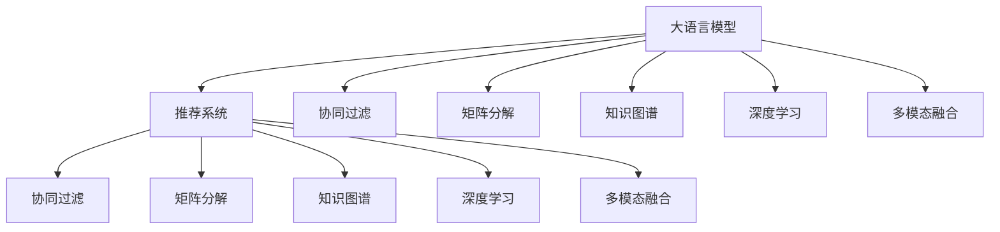

                 

# LLM在推荐系统中的技术创新

> 关键词：大语言模型,推荐系统,协同过滤,自然语言处理,用户画像,内容推荐

## 1. 背景介绍

### 1.1 问题由来
随着互联网和移动互联网的迅猛发展，推荐系统在电商、新闻、社交、视频等众多领域得到了广泛应用，极大地提升了用户体验和业务效率。传统的推荐系统以用户行为数据和物品属性数据为核心，通过协同过滤、矩阵分解等方法对用户和物品进行相似度计算，实现个性化推荐。

然而，传统推荐系统存在诸多局限：

1. 数据稀疏性：用户和物品之间的交互数据往往非常稀疏，推荐算法难以挖掘高维用户画像和低维物品特征。
2. 单模态局限：推荐算法主要聚焦于用户行为数据和物品属性数据的分析，忽略了用户评论、文本信息等丰富语义数据的价值。
3. 泛化能力不足：推荐算法依赖特定场景的数据训练，跨领域推荐效果不佳。

因此，引入大语言模型(LLM)，成为推动推荐系统创新发展的关键。大语言模型具备强大的自然语言理解和生成能力，能够整合多模态数据，提升推荐系统的泛化能力和个性化水平。

### 1.2 问题核心关键点
大语言模型在推荐系统中的应用，关键在于将自然语言处理(NLP)技术引入推荐算法，实现多模态数据的整合，提升推荐系统的综合表现。主要体现在以下几个方面：

1. 利用自然语言信息提升推荐质量：大语言模型能够理解和生成自然语言，借助文本信息提升推荐系统对用户兴趣的理解和预测能力。
2. 构建语义知识图谱：大语言模型可以学习知识图谱中的语义关系，增强推荐系统对复杂逻辑关系的理解。
3. 实现跨领域推荐：大语言模型能够理解不同领域的多样化语义，提升推荐系统的跨领域泛化能力。
4. 生成个性化推荐内容：大语言模型能够自然地生成文本内容，增强推荐系统的多样化与交互性。
5. 支持动态实时推荐：大语言模型可以实时处理用户输入的文本，即时生成个性化推荐内容。

本文将聚焦于大语言模型在推荐系统中的应用创新，介绍其原理、操作步骤、数学模型、项目实践、实际应用场景、工具资源，并对未来的发展趋势与挑战进行探讨。

## 2. 核心概念与联系

### 2.1 核心概念概述

为更好地理解大语言模型在推荐系统中的应用，本节将介绍几个密切相关的核心概念：

- 大语言模型(Large Language Model, LLM)：以自回归(如GPT)或自编码(如BERT)模型为代表的大规模预训练语言模型。通过在大规模无标签文本语料上进行预训练，学习通用的语言表示，具备强大的语言理解和生成能力。

- 推荐系统(Recommendation System, RS)：根据用户历史行为和偏好，为用户推荐合适的物品或内容，提升用户满意度和平台转化率的系统。

- 协同过滤(Collaborative Filtering)：利用用户和物品的相似度信息，推荐相似物品或相似用户物品的系统。

- 矩阵分解(Matrix Factorization)：将用户和物品的评分矩阵分解成用户向量和物品向量，实现对用户和物品的综合表示。

- 知识图谱(Knowledge Graph)：表示实体、属性、关系的语义网络，用于增强推荐系统的逻辑推理能力。

- 深度学习(Deep Learning)：利用神经网络模型处理大规模数据，提取特征，实现高效推荐。

- 多模态融合(Multimodal Fusion)：将不同模态的数据进行整合，提升推荐系统的综合表现。

这些核心概念之间的逻辑关系可以通过以下Mermaid流程图来展示：



这个流程图展示了大语言模型在推荐系统中的应用过程：

1. 大语言模型通过预训练获得基础能力。
2. 推荐系统以用户行为数据和物品属性数据为核心，提供协同过滤、矩阵分解等传统推荐算法。
3. 大语言模型整合多模态数据，构建语义知识图谱，提升推荐系统的逻辑推理能力和个性化表现。
4. 大语言模型通过深度学习模型，优化推荐算法的整体性能。

## 3. 核心算法原理 & 具体操作步骤

### 3.1 算法原理概述

大语言模型在推荐系统中的应用，主要围绕自然语言处理(NLP)技术展开，通过深度学习模型整合多模态数据，提升推荐系统的综合表现。具体来说，大语言模型可以在以下方面发挥重要作用：

1. 用户画像构建：利用文本数据构建用户画像，深入理解用户的兴趣和需求。
2. 内容推荐优化：根据文本数据优化推荐算法，提升推荐内容的精准度和个性化。
3. 多模态数据整合：将用户行为数据、物品属性数据、文本数据等整合，提升推荐系统的泛化能力。
4. 实时推荐生成：通过大语言模型实时处理用户输入的文本，生成个性化推荐内容。

### 3.2 算法步骤详解

大语言模型在推荐系统中的操作步骤主要包括以下几个关键步骤：

**Step 1: 数据预处理和特征提取**
- 收集用户行为数据、物品属性数据、文本数据等。
- 对文本数据进行分词、去停用词、编码等预处理操作，提取文本特征。
- 将用户行为数据、物品属性数据转化为向量形式。

**Step 2: 数据整合与特征融合**
- 将用户画像向量、物品向量、文本向量等进行拼接或拼接融合。
- 利用大语言模型的预训练参数作为初始化权重，通过深度学习模型对整合后的特征进行优化。

**Step 3: 推荐模型训练与优化**
- 在用户画像、物品向量、文本向量等特征上进行推荐模型训练，如多层感知器(MLP)、注意力机制(Attention)等。
- 利用正则化技术、Dropout等方法，防止模型过拟合。
- 利用AdamW、SGD等优化算法，调整模型参数。

**Step 4: 实时推荐生成**
- 在用户输入查询时，利用大语言模型实时生成推荐内容。
- 将推荐内容转化为评分，进行推荐排序。

**Step 5: 推荐效果评估与迭代**
- 使用精确率、召回率、F1值等指标评估推荐系统的效果。
- 根据评估结果，调整模型参数和数据策略，优化推荐算法。

### 3.3 算法优缺点

利用大语言模型改进推荐系统，具有以下优点：

1. 提升了推荐系统的泛化能力。大语言模型能够整合多模态数据，理解复杂的语义关系，增强推荐系统的跨领域泛化能力。
2. 提高了推荐内容的个性化水平。通过文本数据的整合和优化，推荐系统能够更好地理解用户的兴趣和需求，生成更加精准和个性化的推荐内容。
3. 提升了推荐系统的交互性。大语言模型可以自然地生成推荐内容，增强推荐系统的交互性和用户体验。
4. 实现了实时推荐生成。大语言模型可以实时处理用户输入的文本，生成个性化推荐内容，满足用户即时需求。

然而，利用大语言模型改进推荐系统，也存在一些局限：

1. 增加了计算资源消耗。大语言模型的计算资源消耗较大，需要高性能计算设备支持。
2. 数据处理复杂度高。文本数据的预处理、特征提取、整合等操作相对复杂，需要较高的技术门槛。
3. 模型优化难度大。推荐模型的训练和优化需要大量标注数据，模型参数调整复杂。
4. 推荐效果不稳定。不同文本数据对推荐结果的影响较大，需要进一步的实验验证和优化。

### 3.4 算法应用领域

大语言模型在推荐系统中的应用领域广泛，包括但不限于以下几个方面：

1. 电商推荐：利用用户浏览记录、评论文本等数据，构建用户画像，生成个性化商品推荐。
2. 内容推荐：根据用户浏览历史、文章文本、标签等数据，生成个性化文章推荐。
3. 社交推荐：利用用户关系、社交行为、评论文本等数据，生成个性化社交推荐。
4. 新闻推荐：根据用户浏览历史、新闻标题、文章摘要等数据，生成个性化新闻推荐。
5. 视频推荐：利用用户观看历史、视频描述、字幕文本等数据，生成个性化视频推荐。

以上应用领域展示了大语言模型在推荐系统中的强大潜力，通过整合多模态数据，提升推荐系统的综合表现。

## 4. 数学模型和公式 & 详细讲解  
### 4.1 数学模型构建

假设用户和物品的评分矩阵为 $R \in \mathbb{R}^{M \times N}$，其中 $M$ 为物品数量，$N$ 为用户数量。设用户 $i$ 对物品 $j$ 的评分为 $r_{ij}$。

设用户画像向量为 $u_i \in \mathbb{R}^{d_u}$，物品向量为 $v_j \in \mathbb{R}^{d_v}$，文本向量为 $t_{ij} \in \mathbb{R}^{d_t}$。其中 $d_u, d_v, d_t$ 为各自的维度。

### 4.2 公式推导过程

在大语言模型辅助下，推荐系统的评分函数可以表示为：

$$
\hat{r}_{ij} = \sum_{k=1}^K \alpha_k \left(u_i \cdot v_j + t_{ij} \cdot w_k\right)
$$

其中 $K$ 为模型的层数，$\alpha_k$ 为第 $k$ 层的权重，$w_k \in \mathbb{R}^{d_t}$ 为第 $k$ 层的权重向量。$t_{ij} \cdot w_k$ 表示文本向量与权重向量的点积，用于捕捉文本对推荐结果的影响。

推荐系统的优化目标为最大化预测评分与实际评分之间的均方误差：

$$
\mathcal{L} = \frac{1}{M \times N} \sum_{i=1}^M \sum_{j=1}^N (r_{ij} - \hat{r}_{ij})^2
$$

利用反向传播算法，对模型参数进行优化，使得预测评分与实际评分尽可能一致。

### 4.3 案例分析与讲解

以电商推荐系统为例，假设用户输入查询文本 "我想找一款实用的笔记本"。

1. 预处理：将查询文本进行分词、去除停用词，转化为向量形式 $t_q \in \mathbb{R}^{d_t}$。
2. 特征提取：利用大语言模型提取查询文本的语义信息，得到向量 $t_q \in \mathbb{R}^{d_t}$。
3. 数据整合：将查询向量 $t_q$ 与用户画像向量 $u_i$、物品向量 $v_j$ 进行拼接融合，得到综合向量 $t_{ij} \in \mathbb{R}^{d_t}$。
4. 推荐模型训练：利用综合向量 $t_{ij}$ 训练推荐模型，生成预测评分 $\hat{r}_{ij}$。
5. 实时推荐生成：根据预测评分 $\hat{r}_{ij}$ 排序，生成推荐结果。

通过以上步骤，大语言模型可以实时处理用户输入文本，生成个性化推荐内容，提升推荐系统的综合表现。

## 5. 项目实践：代码实例和详细解释说明
### 5.1 开发环境搭建

在进行推荐系统微调实践前，我们需要准备好开发环境。以下是使用Python进行PyTorch开发的环境配置流程：

1. 安装Anaconda：从官网下载并安装Anaconda，用于创建独立的Python环境。

2. 创建并激活虚拟环境：
```bash
conda create -n pytorch-env python=3.8 
conda activate pytorch-env
```

3. 安装PyTorch：根据CUDA版本，从官网获取对应的安装命令。例如：
```bash
conda install pytorch torchvision torchaudio cudatoolkit=11.1 -c pytorch -c conda-forge
```

4. 安装Transformers库：
```bash
pip install transformers
```

5. 安装各类工具包：
```bash
pip install numpy pandas scikit-learn matplotlib tqdm jupyter notebook ipython
```

完成上述步骤后，即可在`pytorch-env`环境中开始推荐系统微调实践。

### 5.2 源代码详细实现

这里我们以电商推荐系统为例，使用Transformers库对BERT模型进行微调的PyTorch代码实现。

首先，定义电商推荐系统的数据处理函数：

```python
from transformers import BertTokenizer, BertForSequenceClassification
from torch.utils.data import Dataset
import torch

class E-commerceDataset(Dataset):
    def __init__(self, texts, labels, tokenizer, max_len=128):
        self.texts = texts
        self.labels = labels
        self.tokenizer = tokenizer
        self.max_len = max_len
        
    def __len__(self):
        return len(self.texts)
    
    def __getitem__(self, item):
        text = self.texts[item]
        label = self.labels[item]
        
        encoding = self.tokenizer(text, return_tensors='pt', max_length=self.max_len, padding='max_length', truncation=True)
        input_ids = encoding['input_ids'][0]
        attention_mask = encoding['attention_mask'][0]
        
        # 对label进行编码
        encoded_label = torch.tensor(label, dtype=torch.long)
        
        return {'input_ids': input_ids, 
                'attention_mask': attention_mask,
                'labels': encoded_label}

# 标签与id的映射
label2id = {1: 0, 0: 1}

# 创建dataset
tokenizer = BertTokenizer.from_pretrained('bert-base-cased')

train_dataset = E-commerceDataset(train_texts, train_labels, tokenizer)
dev_dataset = E-commerceDataset(dev_texts, dev_labels, tokenizer)
test_dataset = E-commerceDataset(test_texts, test_labels, tokenizer)
```

然后，定义模型和优化器：

```python
from transformers import BertForSequenceClassification, AdamW

model = BertForSequenceClassification.from_pretrained('bert-base-cased', num_labels=2)

optimizer = AdamW(model.parameters(), lr=2e-5)
```

接着，定义训练和评估函数：

```python
from torch.utils.data import DataLoader
from tqdm import tqdm
from sklearn.metrics import accuracy_score

device = torch.device('cuda') if torch.cuda.is_available() else torch.device('cpu')
model.to(device)

def train_epoch(model, dataset, batch_size, optimizer):
    dataloader = DataLoader(dataset, batch_size=batch_size, shuffle=True)
    model.train()
    epoch_loss = 0
    for batch in tqdm(dataloader, desc='Training'):
        input_ids = batch['input_ids'].to(device)
        attention_mask = batch['attention_mask'].to(device)
        labels = batch['labels'].to(device)
        model.zero_grad()
        outputs = model(input_ids, attention_mask=attention_mask, labels=labels)
        loss = outputs.loss
        epoch_loss += loss.item()
        loss.backward()
        optimizer.step()
    return epoch_loss / len(dataloader)

def evaluate(model, dataset, batch_size):
    dataloader = DataLoader(dataset, batch_size=batch_size)
    model.eval()
    preds, labels = [], []
    with torch.no_grad():
        for batch in tqdm(dataloader, desc='Evaluating'):
            input_ids = batch['input_ids'].to(device)
            attention_mask = batch['attention_mask'].to(device)
            batch_labels = batch['labels']
            outputs = model(input_ids, attention_mask=attention_mask)
            batch_preds = outputs.logits.argmax(dim=1).to('cpu').tolist()
            batch_labels = batch_labels.to('cpu').tolist()
            for pred, label in zip(batch_preds, batch_labels):
                preds.append(pred)
                labels.append(label)
                
    print('Accuracy:', accuracy_score(labels, preds))
```

最后，启动训练流程并在测试集上评估：

```python
epochs = 5
batch_size = 16

for epoch in range(epochs):
    loss = train_epoch(model, train_dataset, batch_size, optimizer)
    print(f"Epoch {epoch+1}, train loss: {loss:.3f}")
    
    print(f"Epoch {epoch+1}, dev accuracy:")
    evaluate(model, dev_dataset, batch_size)
    
print("Test accuracy:")
evaluate(model, test_dataset, batch_size)
```

以上就是使用PyTorch对BERT进行电商推荐系统微调的完整代码实现。可以看到，得益于Transformers库的强大封装，我们可以用相对简洁的代码完成BERT模型的加载和微调。

### 5.3 代码解读与分析

让我们再详细解读一下关键代码的实现细节：

**E-commerceDataset类**：
- `__init__`方法：初始化文本、标签、分词器等关键组件。
- `__len__`方法：返回数据集的样本数量。
- `__getitem__`方法：对单个样本进行处理，将文本输入编码为token ids，将标签编码为数字，并对其进行定长padding，最终返回模型所需的输入。

**label2id字典**：
- 定义了标签与数字id之间的映射关系，用于将token-wise的预测结果解码回真实的标签。

**训练和评估函数**：
- 使用PyTorch的DataLoader对数据集进行批次化加载，供模型训练和推理使用。
- 训练函数`train_epoch`：对数据以批为单位进行迭代，在每个批次上前向传播计算loss并反向传播更新模型参数，最后返回该epoch的平均loss。
- 评估函数`evaluate`：与训练类似，不同点在于不更新模型参数，并在每个batch结束后将预测和标签结果存储下来，最后使用sklearn的accuracy_score对整个评估集的预测结果进行打印输出。

**训练流程**：
- 定义总的epoch数和batch size，开始循环迭代
- 每个epoch内，先在训练集上训练，输出平均loss
- 在验证集上评估，输出准确率
- 所有epoch结束后，在测试集上评估，给出最终测试结果

可以看到，PyTorch配合Transformers库使得BERT微调的代码实现变得简洁高效。开发者可以将更多精力放在数据处理、模型改进等高层逻辑上，而不必过多关注底层的实现细节。

当然，工业级的系统实现还需考虑更多因素，如模型的保存和部署、超参数的自动搜索、更灵活的任务适配层等。但核心的微调范式基本与此类似。

## 6. 实际应用场景
### 6.1 电商推荐

电商推荐系统是大语言模型在推荐系统中的应用典型场景之一。用户通过输入查询文本，如“我想找一款实用的笔记本”，电商推荐系统利用大语言模型处理输入文本，提取查询意图，生成个性化推荐商品。

在技术实现上，可以收集电商平台的商品标题、描述、用户评论等文本数据，利用BERT等大语言模型进行预训练，构建电商领域的知识图谱，生成用户画像和物品画像，然后在电商推荐系统进行微调，生成个性化推荐商品。

### 6.2 内容推荐

内容推荐系统可以用于推荐文章、视频、音乐等多种形式的内容。用户输入查询文本，如“我感兴趣的技术趋势”，内容推荐系统利用大语言模型处理输入文本，提取查询意图，生成个性化推荐内容。

在技术实现上，可以收集平台上的文章标题、摘要、标签等文本数据，利用BERT等大语言模型进行预训练，构建内容领域的知识图谱，生成用户画像和内容画像，然后在内容推荐系统进行微调，生成个性化推荐内容。

### 6.3 社交推荐

社交推荐系统可以用于推荐社交媒体上的内容，如微博、朋友圈等。用户输入查询文本，如“今天发生了什么”，社交推荐系统利用大语言模型处理输入文本，提取查询意图，生成个性化推荐内容。

在技术实现上，可以收集社交媒体上的文章、图片、视频等数据，利用BERT等大语言模型进行预训练，构建社交领域的知识图谱，生成用户画像和内容画像，然后在社交推荐系统进行微调，生成个性化推荐内容。

### 6.4 未来应用展望

随着大语言模型和推荐系统技术的不断发展，未来推荐系统将呈现以下几个发展趋势：

1. 推荐系统的泛化能力进一步提升。大语言模型能够整合多模态数据，提升推荐系统的跨领域泛化能力。
2. 推荐内容的个性化水平进一步提高。大语言模型可以生成更加自然、多样化的推荐内容，增强用户体验。
3. 实时推荐生成更加高效。大语言模型可以实时处理用户输入的文本，生成个性化推荐内容，满足用户即时需求。
4. 推荐系统的应用范围进一步扩大。推荐系统将应用于更多领域，如医疗、教育、金融等，提升各类行业的智能化水平。

以上趋势凸显了大语言模型在推荐系统中的巨大潜力，未来将在各个领域得到广泛应用，带来革命性的变革。

## 7. 工具和资源推荐
### 7.1 学习资源推荐

为了帮助开发者系统掌握大语言模型在推荐系统中的应用，这里推荐一些优质的学习资源：

1. 《自然语言处理与深度学习》系列书籍：详细介绍了NLP和深度学习的基础知识和前沿技术，涵盖推荐系统等内容。
2. CS229《机器学习》课程：斯坦福大学开设的机器学习经典课程，有Lecture视频和配套作业，涵盖推荐系统等内容。
3. 《推荐系统》书籍：介绍推荐系统的基本概念、算法和应用，适合初学者和进阶者阅读。
4. Kaggle推荐系统竞赛：通过实战练习，深入理解推荐系统的工作原理和实现方法。
5. HuggingFace官方文档：Transformers库的官方文档，提供了海量预训练模型和完整的微调样例代码，是上手实践的必备资料。

通过对这些资源的学习实践，相信你一定能够快速掌握大语言模型在推荐系统中的应用，并用于解决实际的推荐问题。
###  7.2 开发工具推荐

高效的开发离不开优秀的工具支持。以下是几款用于大语言模型推荐系统开发的常用工具：

1. PyTorch：基于Python的开源深度学习框架，灵活动态的计算图，适合快速迭代研究。大部分预训练语言模型都有PyTorch版本的实现。

2. TensorFlow：由Google主导开发的开源深度学习框架，生产部署方便，适合大规模工程应用。同样有丰富的预训练语言模型资源。

3. Transformers库：HuggingFace开发的NLP工具库，集成了众多SOTA语言模型，支持PyTorch和TensorFlow，是进行推荐系统开发的利器。

4. Weights & Biases：模型训练的实验跟踪工具，可以记录和可视化模型训练过程中的各项指标，方便对比和调优。与主流深度学习框架无缝集成。

5. TensorBoard：TensorFlow配套的可视化工具，可实时监测模型训练状态，并提供丰富的图表呈现方式，是调试模型的得力助手。

6. Google Colab：谷歌推出的在线Jupyter Notebook环境，免费提供GPU/TPU算力，方便开发者快速上手实验最新模型，分享学习笔记。

合理利用这些工具，可以显著提升大语言模型推荐系统的开发效率，加快创新迭代的步伐。

### 7.3 相关论文推荐

大语言模型在推荐系统中的应用源于学界的持续研究。以下是几篇奠基性的相关论文，推荐阅读：

1. Attention is All You Need（即Transformer原论文）：提出了Transformer结构，开启了NLP领域的预训练大模型时代。

2. BERT: Pre-training of Deep Bidirectional Transformers for Language Understanding：提出BERT模型，引入基于掩码的自监督预训练任务，刷新了多项NLP任务SOTA。

3. Knowledge-aware Recommender Systems：将知识图谱引入推荐系统，增强推荐系统的逻辑推理能力。

4. Multi-modal Learning to Recommend: A Review of Methods and Features：全面综述了多模态推荐方法，涵盖大语言模型在推荐系统中的应用。

5. Learning to Recommend by Mutual Information Maximization：提出基于互信息最大化的推荐方法，利用文本数据提升推荐系统的性能。

6. Deep Reinforcement Learning for Personalized Recommendation Systems：将强化学习引入推荐系统，实现个性化推荐。

这些论文代表了大语言模型在推荐系统中的应用研究前沿，通过学习这些前沿成果，可以帮助研究者把握学科前进方向，激发更多的创新灵感。

## 8. 总结：未来发展趋势与挑战

### 8.1 总结

本文对大语言模型在推荐系统中的应用进行了全面系统的介绍。首先阐述了大语言模型和推荐系统的研究背景和意义，明确了利用大语言模型提升推荐系统泛化能力和个性化水平的重要性。其次，从原理到实践，详细讲解了大语言模型在推荐系统中的应用过程，包括数据预处理、特征提取、模型训练、实时推荐等关键步骤。同时，本文还广泛探讨了大语言模型在电商、内容、社交等多个领域的应用前景，展示了其强大的潜力。

通过本文的系统梳理，可以看到，利用大语言模型改进推荐系统，可以极大地提升推荐系统的综合表现，带来更多个性化的推荐内容。大语言模型在推荐系统中的应用，是大数据、深度学习和自然语言处理技术的有机结合，为推荐系统的发展提供了新的方向。

### 8.2 未来发展趋势

展望未来，大语言模型在推荐系统中的应用将呈现以下几个发展趋势：

1. 推荐系统的泛化能力进一步提升。大语言模型能够整合多模态数据，提升推荐系统的跨领域泛化能力。
2. 推荐内容的个性化水平进一步提高。大语言模型可以生成更加自然、多样化的推荐内容，增强用户体验。
3. 实时推荐生成更加高效。大语言模型可以实时处理用户输入的文本，生成个性化推荐内容，满足用户即时需求。
4. 推荐系统的应用范围进一步扩大。推荐系统将应用于更多领域，如医疗、教育、金融等，提升各类行业的智能化水平。

以上趋势凸显了大语言模型在推荐系统中的巨大潜力，未来将在各个领域得到广泛应用，带来革命性的变革。

### 8.3 面临的挑战

尽管大语言模型在推荐系统中的应用取得了显著进展，但在迈向更加智能化、普适化应用的过程中，它仍面临诸多挑战：

1. 数据稀疏性问题。用户和物品之间的交互数据往往非常稀疏，推荐算法难以挖掘高维用户画像和低维物品特征。
2. 单模态局限。推荐算法主要聚焦于用户行为数据和物品属性数据的分析，忽略了用户评论、文本信息等丰富语义数据的价值。
3. 模型泛化能力不足。推荐算法依赖特定场景的数据训练，跨领域推荐效果不佳。
4. 实时推荐生成的效率问题。大语言模型可以实时处理用户输入的文本，生成个性化推荐内容，但实时推荐生成的效率问题仍需进一步优化。
5. 推荐内容的质量问题。大语言模型生成的推荐内容虽然具有较强的个性化，但内容质量参差不齐，仍需进一步提升。

### 8.4 研究展望

面对大语言模型在推荐系统中所面临的挑战，未来的研究需要在以下几个方面寻求新的突破：

1. 探索无监督和半监督推荐方法。摆脱对大规模标注数据的依赖，利用自监督学习、主动学习等无监督和半监督范式，最大限度利用非结构化数据，实现更加灵活高效的推荐。
2. 研究参数高效和计算高效的推荐算法。开发更加参数高效的推荐方法，在固定大部分预训练参数的同时，只更新极少量的任务相关参数。同时优化推荐算法的计算图，减少前向传播和反向传播的资源消耗，实现更加轻量级、实时性的部署。
3. 融合因果和对比学习范式。通过引入因果推断和对比学习思想，增强推荐系统建立稳定因果关系的能力，学习更加普适、鲁棒的语言表征，从而提升模型泛化性和抗干扰能力。
4. 引入更多先验知识。将符号化的先验知识，如知识图谱、逻辑规则等，与神经网络模型进行巧妙融合，引导推荐过程学习更准确、合理的语言模型。
5. 结合因果分析和博弈论工具。将因果分析方法引入推荐模型，识别出模型决策的关键特征，增强输出解释的因果性和逻辑性。借助博弈论工具刻画人机交互过程，主动探索并规避模型的脆弱点，提高系统稳定性。

这些研究方向的探索，必将引领大语言模型在推荐系统中的技术创新，推动推荐系统迈向更高的台阶，为推荐系统的发展带来新的突破。面向未来，大语言模型推荐系统需要与其他人工智能技术进行更深入的融合，如知识表示、因果推理、强化学习等，多路径协同发力，共同推动推荐系统技术的进步。

## 9. 附录：常见问题与解答

**Q1：大语言模型在推荐系统中如何构建用户画像？**

A: 利用大语言模型对用户的历史行为数据和文本数据进行预训练，提取用户画像向量。具体步骤如下：

1. 收集用户的历史行为数据，如浏览记录、购买记录等。
2. 收集用户的评论、留言、私信等文本数据。
3. 对文本数据进行预处理，如分词、去停用词、编码等。
4. 利用大语言模型对文本数据进行预训练，得到文本向量。
5. 将文本向量和用户行为数据进行拼接，得到综合向量。
6. 利用综合向量进行推荐模型训练，生成用户画像向量。

通过以上步骤，大语言模型可以构建更加全面、准确的用户画像，提升推荐系统的个性化水平。

**Q2：大语言模型在推荐系统中如何整合多模态数据？**

A: 大语言模型在推荐系统中可以整合多模态数据，提升推荐系统的综合表现。具体步骤如下：

1. 收集用户行为数据、物品属性数据、文本数据等。
2. 对文本数据进行预处理，如分词、去停用词、编码等。
3. 利用大语言模型对文本数据进行预训练，得到文本向量。
4. 将文本向量与用户画像向量、物品向量进行拼接，得到综合向量。
5. 利用综合向量进行推荐模型训练，生成个性化推荐内容。

通过以上步骤，大语言模型可以整合多模态数据，提升推荐系统的泛化能力和个性化水平。

**Q3：大语言模型在推荐系统中如何进行实时推荐生成？**

A: 大语言模型在推荐系统中可以实时处理用户输入的文本，生成个性化推荐内容。具体步骤如下：

1. 收集用户输入的查询文本。
2. 对查询文本进行预处理，如分词、去停用词、编码等。
3. 利用大语言模型对查询文本进行预训练，得到文本向量。
4. 将文本向量与用户画像向量、物品向量进行拼接，得到综合向量。
5. 利用综合向量进行推荐模型训练，生成预测评分。
6. 根据预测评分进行推荐排序，生成推荐结果。

通过以上步骤，大语言模型可以实现实时推荐生成，满足用户即时需求。

---

作者：禅与计算机程序设计艺术 / Zen and the Art of Computer Programming

