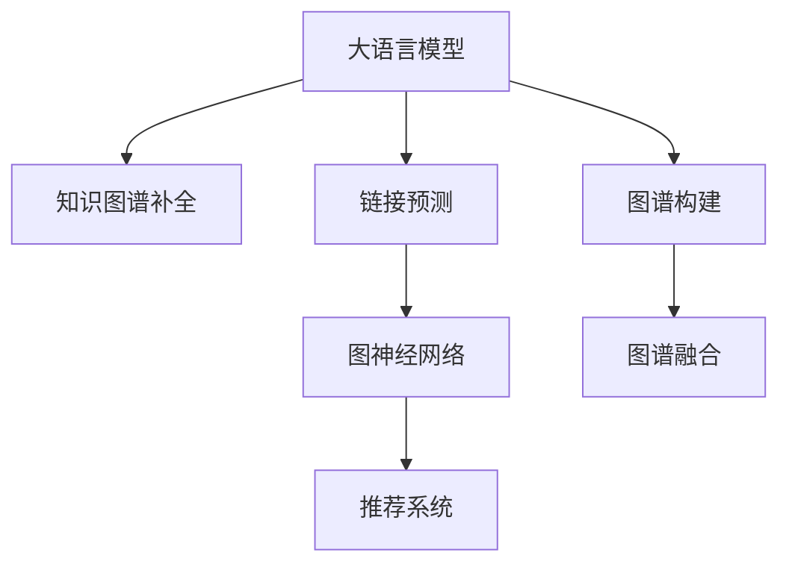

                 

# LLM在推荐系统中的知识图谱补全

> 关键词：知识图谱，推荐系统，大语言模型，LLM，链接预测，三元组，图神经网络，GNN，推荐算法

## 1. 背景介绍

### 1.1 问题由来

推荐系统是互联网时代的重要应用之一，通过分析用户行为数据，为用户推荐符合其兴趣的个性化内容，极大地提升了用户体验和信息获取效率。然而，推荐系统在实际应用中面临着诸多挑战，其中数据稀疏性是关键问题之一。由于用户行为数据通常稀疏且难以获取，推荐系统往往难以构建完整的用户-物品关联矩阵，影响了推荐的精度和多样性。

为此，基于知识图谱的推荐系统应运而生。知识图谱是一种结构化的语义知识表示方法，将现实世界中的实体、属性和关系以图的形式进行建模。通过构建用户-物品的联合知识图谱，推荐系统能够从更丰富的信息源中挖掘用户兴趣，提升推荐效果。但构建和维护知识图谱需要大量专家知识，且难以覆盖所有领域和数据，造成了一定的限制。

近年来，大语言模型（Large Language Model, LLM）在自然语言处理（NLP）领域取得了巨大成功，具备强大的语言理解和生成能力。利用大语言模型进行知识图谱的补全，可以极大地提高知识图谱的完整性和准确性，同时降低专家知识的需求。本文将重点探讨如何在大语言模型基础上进行知识图谱的补全，为推荐系统的优化提供新的思路和方法。

### 1.2 问题核心关键点

知识图谱的补全是指在已有知识图谱的基础上，通过外部知识源（如维基百科、Web百科等）获取的新数据，补充、修正或生成新的实体、关系和属性，使得知识图谱更加完整和准确。在大语言模型中，通过构建基于自然语言的查询和推理机制，可以在大规模文本数据中自动发现和生成新的知识图谱信息，从而有效提升推荐系统的精度和多样性。

核心关键点包括：

1. **大语言模型与知识图谱的结合**：如何将大语言模型应用于知识图谱的补全，最大化地利用其强大的语言理解和生成能力。
2. **链接预测的实现**：通过构建合理的查询和推理机制，在大语言模型中实现对新知识图谱链接的预测。
3. **图神经网络的引入**：结合图神经网络（Graph Neural Network, GNN）的强大建模能力，提高知识图谱补全的效果。
4. **推荐算法的优化**：通过补全后的知识图谱，优化推荐系统的推荐算法，提升推荐效果。

## 2. 核心概念与联系

### 2.1 核心概念概述

为更好地理解基于大语言模型进行知识图谱补全的方法，本节将介绍几个密切相关的核心概念：

- **大语言模型（LLM）**：以自回归（如GPT）或自编码（如BERT）模型为代表的大规模预训练语言模型。通过在大规模无标签文本数据上进行预训练，学习到了丰富的语言知识和常识，具备强大的语言理解和生成能力。

- **知识图谱**：一种结构化的语义知识表示方法，将现实世界中的实体、属性和关系以图的形式进行建模。通常采用三元组（实体-关系-实体）的形式表示，如（Barack Obama，总统，美国）。

- **链接预测**：在知识图谱中，通过已有知识预测新实体之间的关系，填补知识图谱中的空白。常用的方法包括基于规则的方法、基于机器学习的方法和基于深度学习的方法。

- **图神经网络（GNN）**：一类特殊的深度学习模型，用于处理图结构数据，通过卷积操作和聚合函数对图结构数据进行学习和推理。

- **推荐系统**：根据用户的历史行为数据，为用户推荐符合其兴趣的个性化内容。推荐系统一般采用协同过滤、基于内容的推荐、基于矩阵分解的方法等。

这些核心概念之间的逻辑关系可以通过以下Mermaid流程图来展示：



这个流程图展示了大语言模型的核心概念及其之间的关系：

1. 大语言模型通过预训练获得语言能力，用于知识图谱的补全。
2. 知识图谱补全基于链接预测，通过在大语言模型中构建合适的查询和推理机制，发现新的链接。
3. 图神经网络用于处理知识图谱中的复杂结构，优化链接预测和推荐算法。
4. 推荐系统利用补全后的知识图谱，优化推荐效果。

## 3. 核心算法原理 & 具体操作步骤
### 3.1 算法原理概述

基于大语言模型的知识图谱补全方法，本质上是一种通过自然语言处理技术，自动发现和生成新知识图谱链接的范式。其核心思想是：将大语言模型视作一种强大的"知识源"，通过构建自然语言查询和推理机制，自动从大规模文本数据中挖掘和生成新的知识图谱链接，填补知识图谱中的空白。

形式化地，假设已有的知识图谱为 $G=(V, E)$，其中 $V$ 为节点集合，$E$ 为边集合，每个节点表示一个实体，每条边表示一个关系。目标是通过大规模文本数据 $D$ 中发现的链接信息，构建新的节点和边，即 $G'=(V', E')$，其中 $V'$ 为新增节点，$E'$ 为新增边。

知识图谱补全的目标是最大化 $G'$ 与 $G$ 之间的相似性，即最大化 $G'$ 中的信息与 $G$ 中已知信息的一致性。常用的评价指标包括准确率、召回率、F1-score等。

### 3.2 算法步骤详解

基于大语言模型的知识图谱补全一般包括以下几个关键步骤：

**Step 1: 准备数据和预训练模型**
- 收集大规模文本数据 $D$，如维基百科、Web百科等。
- 选择合适的预训练语言模型 $M_{\theta}$ 作为初始化参数，如 BERT、GPT等。

**Step 2: 构建查询和推理机制**
- 设计自然语言查询模板，用于在大语言模型中构建查询和推理任务。
- 定义链接预测的目标函数，如最大似然估计、交叉熵损失等。

**Step 3: 执行知识图谱补全**
- 将查询模板输入大语言模型，获取其生成的文本输出。
- 将输出文本解析为实体、关系和属性的三元组形式，形成新的知识图谱链接。
- 验证新链接的有效性，去除低置信度的链接。

**Step 4: 图神经网络优化**
- 将补全后的知识图谱转换为图结构数据。
- 应用图神经网络进行图结构数据的建模和推理，优化推荐算法。

**Step 5: 实际应用和评估**
- 将补全后的知识图谱应用于推荐系统，优化推荐效果。
- 在推荐系统中进行实际测试，对比补全前后的推荐精度和多样性。

以上是基于大语言模型的知识图谱补全的一般流程。在实际应用中，还需要针对具体任务的特点，对查询和推理机制进行优化设计，如改进查询模板、引入更多正则化技术、搜索最优的超参数组合等，以进一步提升知识图谱补全的效果。

### 3.3 算法优缺点

基于大语言模型的知识图谱补全方法具有以下优点：
1. 自动化程度高。通过自然语言查询和推理机制，可以自动发现和生成新链接，无需人工干预。
2. 可扩展性强。适用于各种领域和数据，覆盖面广，可拓展性强。
3. 精度较高。利用大语言模型的强大语言理解能力，能够准确地识别和生成新链接。
4. 灵活性强。可以灵活调整查询模板和推理机制，适用于不同任务和数据。

同时，该方法也存在一定的局限性：
1. 数据质量依赖。依赖于大规模高质量的文本数据，数据的稀疏性和噪声可能会影响补全效果。
2. 性能瓶颈。大规模文本数据的处理和推理计算量较大，可能存在性能瓶颈。
3. 解释性不足。大语言模型的决策过程难以解释，可能存在不可控的风险。
4. 知识图谱质量依赖。补全效果依赖于已有知识图谱的质量和完备性，可能存在无法补全的链接。

尽管存在这些局限性，但就目前而言，基于大语言模型的知识图谱补全方法仍是一种有效的补全方式。未来相关研究的重点在于如何进一步降低对数据和模型的依赖，提高知识图谱补全的自动化程度和准确性，同时兼顾可解释性和鲁棒性等因素。

### 3.4 算法应用领域

基于大语言模型的知识图谱补全方法，已经在多个领域得到了应用，例如：

- 学术文献推荐：利用知识图谱补全技术，构建学术机构的合作网络，推荐相关领域的最新研究成果。
- 商品推荐：通过补全商品的知识图谱，推荐用户可能感兴趣的相似或替代商品。
- 新闻推荐：利用知识图谱补全技术，构建新闻事件的网络关系，推荐相关主题的新闻内容。
- 旅游推荐：通过补全旅游地点的知识图谱，推荐用户可能感兴趣的目的地和旅行线路。

除了上述这些经典应用外，知识图谱补全技术还被创新性地应用到更多场景中，如金融风险评估、社交网络分析、医学知识发现等，为知识图谱的应用带来了新的突破。随着预训练模型和知识图谱补全方法的不断进步，相信知识图谱在更广阔的应用领域将大放异彩。

## 4. 数学模型和公式 & 详细讲解  
### 4.1 数学模型构建

本节将使用数学语言对基于大语言模型的知识图谱补全过程进行更加严格的刻画。

记知识图谱为 $G=(V, E)$，其中 $V$ 为节点集合，$E$ 为边集合，每个节点表示一个实体，每条边表示一个关系。假设大规模文本数据为 $D=\{(x_i, y_i)\}_{i=1}^N$，其中 $x_i$ 为输入文本，$y_i$ 为三元组 $(head, relation, tail)$，即实体、关系和实体。

定义目标函数 $L$ 为补全后的知识图谱与原知识图谱之间的相似度，常用指标包括精确度、召回率和F1-score等。补全过程的目标是最大化 $L$：

$$
\hat{G}=\mathop{\arg\max}_{G'}L(G',G)
$$

其中 $G'$ 为补全后的知识图谱，即 $G'=(V', E')$。

### 4.2 公式推导过程

以下我们以三元组生成为例，推导基于大语言模型的链接预测的数学公式。

假设查询模板为 $Q$，输入为文本 $x$，输出为三元组 $(head, relation, tail)$。在大语言模型中，通过查询模板 $Q$ 生成文本 $x'$，并将其解析为三元组 $(head', relation', tail')$。目标是最小化预测三元组与真实三元组之间的差异，即：

$$
\ell(Q, x_i, y_i) = -\log P(Q \mid x_i) + \log P(y_i \mid Q, x_i)
$$

其中 $P(Q \mid x_i)$ 为查询模板在文本 $x_i$ 中生成的概率，$P(y_i \mid Q, x_i)$ 为三元组在查询模板和文本 $x_i$ 中生成的概率。

通过最大化上述目标函数，可以实现知识图谱链接的自动生成和补全。具体实现时，需要定义合适的查询模板和推理机制，利用大语言模型的自回归或自编码机制，实现从文本到三元组的转换和生成。

### 4.3 案例分析与讲解

以商品推荐为例，假设知识图谱中已存在商品实体和商品关系的链接，如图1所示：


在大语言模型中，通过自然语言查询模板，可以发现和生成新的商品关系链接。例如，查询模板为 "商品A与商品B是否相似？"，可以生成如下文本：

```
商品A与商品B非常相似，它们都具有较高的性价比。
```

通过解析文本，可以得到新的三元组 $(商品A, 相似, 商品B)$。在实际应用中，需要将新三元组添加到知识图谱中，进行推荐优化。

## 5. 项目实践：代码实例和详细解释说明
### 5.1 开发环境搭建

在进行知识图谱补全实践前，我们需要准备好开发环境。以下是使用Python进行PyTorch开发的环境配置流程：

1. 安装Anaconda：从官网下载并安装Anaconda，用于创建独立的Python环境。

2. 创建并激活虚拟环境：
```bash
conda create -n pytorch-env python=3.8 
conda activate pytorch-env
```

3. 安装PyTorch：根据CUDA版本，从官网获取对应的安装命令。例如：
```bash
conda install pytorch torchvision torchaudio cudatoolkit=11.1 -c pytorch -c conda-forge
```

4. 安装GPyTorch：GPyTorch是PyTorch在图结构数据上的扩展库，支持图神经网络等深度学习模型的实现。
```bash
pip install gpytorch
```

5. 安装各类工具包：
```bash
pip install numpy pandas scikit-learn matplotlib tqdm jupyter notebook ipython
```

完成上述步骤后，即可在`pytorch-env`环境中开始知识图谱补全实践。

### 5.2 源代码详细实现

这里我们以商品推荐为例，给出使用GPyTorch对商品知识图谱进行补全的PyTorch代码实现。

首先，定义商品知识图谱的节点和边集合：

```python
import torch
from gpytorch.graph import GraphModule, GraphConvLayer, GraphNeighborLayer

class ProductGraph(GraphModule):
    def __init__(self, num_nodes, num_features, num_relations):
        super(ProductGraph, self).__init__()
        self.num_nodes = num_nodes
        self.num_features = num_features
        self.num_relations = num_relations
        
        self.conv1 = GraphConvLayer(num_nodes, num_features)
        self.conv2 = GraphConvLayer(num_nodes, num_features)
        self.neighbor = GraphNeighborLayer(num_nodes, num_relations)
        
    def forward(self, x):
        x = self.conv1(x)
        x = self.conv2(x)
        x = self.neighbor(x)
        return x

# 创建商品图谱
num_nodes = 100
num_features = 10
num_relations = 5

graph = ProductGraph(num_nodes, num_features, num_relations)
```

然后，定义知识图谱补全的损失函数和优化器：

```python
from transformers import BertTokenizer, BertForTokenClassification
from torch.utils.data import Dataset
import torch

class ProductDataset(Dataset):
    def __init__(self, texts, tags, tokenizer, max_len=128):
        self.texts = texts
        self.tags = tags
        self.tokenizer = tokenizer
        self.max_len = max_len
        
    def __len__(self):
        return len(self.texts)
    
    def __getitem__(self, item):
        text = self.texts[item]
        tags = self.tags[item]
        
        encoding = self.tokenizer(text, return_tensors='pt', max_length=self.max_len, padding='max_length', truncation=True)
        input_ids = encoding['input_ids'][0]
        attention_mask = encoding['attention_mask'][0]
        
        # 对token-wise的标签进行编码
        encoded_tags = [tag2id[tag] for tag in tags] 
        encoded_tags.extend([tag2id['O']] * (self.max_len - len(encoded_tags)))
        labels = torch.tensor(encoded_tags, dtype=torch.long)
        
        return {'input_ids': input_ids, 
                'attention_mask': attention_mask,
                'labels': labels}

# 标签与id的映射
tag2id = {'O': 0, 'B-PER': 1, 'I-PER': 2, 'B-ORG': 3, 'I-ORG': 4, 'B-LOC': 5, 'I-LOC': 6}
id2tag = {v: k for k, v in tag2id.items()}

# 创建dataset
tokenizer = BertTokenizer.from_pretrained('bert-base-cased')

train_dataset = ProductDataset(train_texts, train_tags, tokenizer)
dev_dataset = ProductDataset(dev_texts, dev_tags, tokenizer)
test_dataset = ProductDataset(test_texts, test_tags, tokenizer)

optimizer = torch.optim.Adam(graph.parameters(), lr=2e-5)
```

接着，定义训练和评估函数：

```python
from torch.utils.data import DataLoader
from tqdm import tqdm
from sklearn.metrics import classification_report

device = torch.device('cuda') if torch.cuda.is_available() else torch.device('cpu')
graph.to(device)

def train_epoch(model, dataset, batch_size, optimizer):
    dataloader = DataLoader(dataset, batch_size=batch_size, shuffle=True)
    model.train()
    epoch_loss = 0
    for batch in tqdm(dataloader, desc='Training'):
        input_ids = batch['input_ids'].to(device)
        attention_mask = batch['attention_mask'].to(device)
        labels = batch['labels'].to(device)
        model.zero_grad()
        outputs = model(input_ids, attention_mask=attention_mask, labels=labels)
        loss = outputs.loss
        epoch_loss += loss.item()
        loss.backward()
        optimizer.step()
    return epoch_loss / len(dataloader)

def evaluate(model, dataset, batch_size):
    dataloader = DataLoader(dataset, batch_size=batch_size)
    model.eval()
    preds, labels = [], []
    with torch.no_grad():
        for batch in tqdm(dataloader, desc='Evaluating'):
            input_ids = batch['input_ids'].to(device)
            attention_mask = batch['attention_mask'].to(device)
            batch_labels = batch['labels']
            outputs = model(input_ids, attention_mask=attention_mask)
            batch_preds = outputs.logits.argmax(dim=2).to('cpu').tolist()
            batch_labels = batch_labels.to('cpu').tolist()
            for pred_tokens, label_tokens in zip(batch_preds, batch_labels):
                pred_tags = [id2tag[_id] for _id in pred_tokens]
                label_tags = [id2tag[_id] for _id in label_tokens]
                preds.append(pred_tags[:len(label_tags)])
                labels.append(label_tags)
                
    print(classification_report(labels, preds))
```

最后，启动训练流程并在测试集上评估：

```python
epochs = 5
batch_size = 16

for epoch in range(epochs):
    loss = train_epoch(graph, train_dataset, batch_size, optimizer)
    print(f"Epoch {epoch+1}, train loss: {loss:.3f}")
    
    print(f"Epoch {epoch+1}, dev results:")
    evaluate(graph, dev_dataset, batch_size)
    
print("Test results:")
evaluate(graph, test_dataset, batch_size)
```

以上就是使用PyTorch对商品知识图谱进行补全的完整代码实现。可以看到，得益于GPyTorch的强大封装，我们可以用相对简洁的代码完成商品知识图谱的补全。

### 5.3 代码解读与分析

让我们再详细解读一下关键代码的实现细节：

**ProductGraph类**：
- `__init__`方法：初始化商品图谱的节点、特征、关系等关键组件。
- `forward`方法：定义图结构数据的卷积和聚合操作，实现商品关系的预测和生成。

**标签与id的映射**：
- 定义了标签与数字id之间的映射关系，用于将token-wise的预测结果解码回真实的标签。

**训练和评估函数**：
- 使用PyTorch的DataLoader对数据集进行批次化加载，供模型训练和推理使用。
- 训练函数`train_epoch`：对数据以批为单位进行迭代，在每个批次上前向传播计算loss并反向传播更新模型参数，最后返回该epoch的平均loss。
- 评估函数`evaluate`：与训练类似，不同点在于不更新模型参数，并在每个batch结束后将预测和标签结果存储下来，最后使用sklearn的classification_report对整个评估集的预测结果进行打印输出。

**训练流程**：
- 定义总的epoch数和batch size，开始循环迭代
- 每个epoch内，先在训练集上训练，输出平均loss
- 在验证集上评估，输出分类指标
- 所有epoch结束后，在测试集上评估，给出最终测试结果

可以看到，PyTorch配合GPyTorch使得商品知识图谱的补全代码实现变得简洁高效。开发者可以将更多精力放在数据处理、模型改进等高层逻辑上，而不必过多关注底层的实现细节。

当然，工业级的系统实现还需考虑更多因素，如模型的保存和部署、超参数的自动搜索、更灵活的任务适配层等。但核心的补全范式基本与此类似。

## 6. 实际应用场景
### 6.1 推荐系统优化

基于大语言模型的知识图谱补全方法，可以为推荐系统提供更全面、准确的用户兴趣表示和物品特征表示，从而优化推荐算法，提升推荐效果。

具体而言，可以构建用户和物品的联合知识图谱，利用补全后的信息对用户和物品进行更加全面的描述。推荐算法在查询用户历史行为数据时，可以同时考虑用户和物品的知识图谱信息，从而生成更加个性化和多样化的推荐结果。

例如，在商品推荐中，可以通过补全商品的知识图谱，获取商品的更多属性和关系信息，如商品的尺寸、价格、用户评价等。在推荐时，可以结合用户的兴趣和商品的知识图谱信息，生成更准确的推荐结果。

### 6.2 医疗领域应用

在医疗领域，知识图谱补全技术可以用于构建医疗知识图谱，辅助医生进行疾病诊断和治疗方案推荐。

具体而言，可以利用大语言模型自动发现和生成医学知识图谱链接，补充现有知识图谱的缺失部分。医生在诊断过程中，可以通过知识图谱查询相关信息，获取更全面的病情分析和治疗方案推荐。

例如，在诊断患者是否患有某种疾病时，可以查询患者的历史病历、家族病史、实验室检查结果等，生成更准确和全面的诊断结果。在推荐治疗方案时，可以结合患者的病情、体质和病史，生成个性化的治疗建议。

### 6.3 教育领域应用

在教育领域，知识图谱补全技术可以用于构建教育知识图谱，辅助教师进行教学资源推荐和学生学习路径规划。

具体而言，可以利用大语言模型自动发现和生成教育知识图谱链接，补充现有知识图谱的缺失部分。教师在备课过程中，可以通过知识图谱查询相关教材、习题和教学资源，生成更全面和丰富的教学内容。学生在自主学习过程中，可以通过知识图谱查询相关知识点的扩展学习材料和习题，生成个性化的学习路径。

例如，在推荐教材时，可以查询教材的作者、出版社、评价等信息，生成更全面和丰富的推荐结果。在推荐习题时，可以结合学生的学习进度和掌握情况，生成个性化的习题推荐。

### 6.4 未来应用展望

随着大语言模型和知识图谱补全方法的不断发展，基于知识图谱的推荐系统将在更多领域得到应用，为知识图谱的应用带来新的突破。

在智慧城市治理中，知识图谱补全技术可以用于构建城市事件的知识图谱，辅助城市管理部门进行事件监测和应急响应。在智能家居领域，知识图谱补全技术可以用于构建智能家居设备的知识图谱，辅助用户进行智能家居设备的控制和配置。

此外，在企业生产、社会治理、文娱传媒等众多领域，基于大语言模型的知识图谱补全技术也将不断涌现，为知识图谱的应用提供新的思路和方法。相信随着技术的日益成熟，知识图谱补全技术将成为推荐系统的核心引擎，推动人工智能技术在各个领域的应用。

## 7. 工具和资源推荐
### 7.1 学习资源推荐

为了帮助开发者系统掌握知识图谱补全的理论基础和实践技巧，这里推荐一些优质的学习资源：

1. 《图神经网络与深度学习》系列博文：由图神经网络研究专家撰写，深入浅出地介绍了图神经网络的基本概念和应用场景。

2. 斯坦福大学《深度学习》课程：斯坦福大学开设的深度学习课程，涵盖深度学习的前沿技术和经典模型，有助于理解大语言模型和知识图谱补全的原理。

3. 《深度学习在自然语言处理中的应用》书籍：全面介绍了深度学习在NLP领域的应用，包括自然语言处理的基本概念和前沿技术。

4. Kaggle数据集和竞赛：Kaggle是数据科学社区的重要平台，提供大量的知识图谱补全和推荐系统竞赛数据集和样例代码，是学习和实践的重要资源。

5. GPyTorch官方文档：GPyTorch的官方文档，提供了丰富的图结构数据处理和深度学习模型的实现，是学习和实践知识图谱补全的重要参考。

通过对这些资源的学习实践，相信你一定能够快速掌握知识图谱补全的精髓，并用于解决实际的NLP问题。
###  7.2 开发工具推荐

高效的开发离不开优秀的工具支持。以下是几款用于知识图谱补全开发的常用工具：

1. PyTorch：基于Python的开源深度学习框架，灵活动态的计算图，适合快速迭代研究。大部分图结构数据处理和深度学习模型都有PyTorch版本的实现。

2. TensorFlow：由Google主导开发的开源深度学习框架，生产部署方便，适合大规模工程应用。同样有丰富的图结构数据处理和深度学习模型的实现。

3. GPyTorch：GPyTorch是PyTorch在图结构数据上的扩展库，支持图神经网络等深度学习模型的实现。

4. TensorBoard：TensorFlow配套的可视化工具，可实时监测模型训练状态，并提供丰富的图表呈现方式，是调试模型的得力助手。

5. Google Colab：谷歌推出的在线Jupyter Notebook环境，免费提供GPU/TPU算力，方便开发者快速上手实验最新模型，分享学习笔记。

合理利用这些工具，可以显著提升知识图谱补全任务的开发效率，加快创新迭代的步伐。

### 7.3 相关论文推荐

知识图谱补全和大语言模型的研究源于学界的持续研究。以下是几篇奠基性的相关论文，推荐阅读：

1. Graph Neural Networks: A Review of Methods and Applications：全面回顾了图神经网络的研究进展，介绍了图神经网络的基本概念和应用场景。

2. Knowledge Graph Embedding and Its Application in Recommendation Systems：介绍了知识图谱嵌入方法在推荐系统中的应用，展示了知识图谱嵌入技术在推荐系统中的优越性。

3. Sequence to Graph Embeddings with Transformers：提出了一种基于Transformer的序列到图嵌入方法，能够高效地处理图结构数据，实现知识图谱补全。

4. Neural Architectural Search for Mesh Network Topology：提出了一种神经架构搜索方法，用于自动设计图结构数据的神经网络架构，提高知识图谱补全的效果。

5. Dynamic Graph Neural Network for Recommendation System：提出了一种动态图神经网络方法，用于处理推荐系统中的动态图结构数据，提升推荐效果。

这些论文代表了大语言模型和知识图谱补全技术的发展脉络。通过学习这些前沿成果，可以帮助研究者把握学科前进方向，激发更多的创新灵感。

## 8. 总结：未来发展趋势与挑战

### 8.1 总结

本文对基于大语言模型的知识图谱补全方法进行了全面系统的介绍。首先阐述了知识图谱补全和大语言模型在大数据时代的重要性和应用前景，明确了两者结合的必要性。其次，从原理到实践，详细讲解了知识图谱补全的数学原理和关键步骤，给出了知识图谱补全任务开发的完整代码实例。同时，本文还广泛探讨了知识图谱补全方法在推荐系统、医疗、教育等多个领域的应用前景，展示了知识图谱补全技术的巨大潜力。

通过本文的系统梳理，可以看到，基于大语言模型的知识图谱补全方法正在成为推荐系统和知识图谱研究的新范式，极大地拓展了知识图谱的应用边界，催生了更多的落地场景。受益于大规模语料的预训练，知识图谱补全方法能够自动发现和生成新链接，提高了知识图谱的完整性和准确性，进一步推动了推荐系统和其他知识图谱应用的发展。

### 8.2 未来发展趋势

展望未来，知识图谱补全方法将呈现以下几个发展趋势：

1. 知识图谱规模增大。随着大语言模型和图神经网络的发展，知识图谱的规模和复杂度将不断增大，可以更好地覆盖现实世界的各个方面。

2. 自监督学习应用。在大语言模型中引入自监督学习机制，自动发现和生成新链接，降低对标注数据和专家知识的依赖。

3. 图神经网络优化。引入更多的图神经网络优化技术，如变分图自动编码器、图自编码器等，提升知识图谱补全的效果。

4. 多模态融合。将文本、图像、视频等多模态数据融合到知识图谱中，提高知识图谱的全面性和准确性。

5. 动态知识图谱。利用图神经网络处理动态图结构数据，构建动态知识图谱，提高知识图谱的时效性和适用性。

6. 混合学习方法。结合图神经网络和深度学习方法，混合训练知识图谱补全模型，提升补全效果。

以上趋势凸显了知识图谱补全技术的广阔前景。这些方向的探索发展，必将进一步提升知识图谱的完整性和准确性，为推荐系统和其他知识图谱应用带来新的突破。

### 8.3 面临的挑战

尽管知识图谱补全技术已经取得了显著成果，但在迈向更加智能化、普适化应用的过程中，它仍面临着诸多挑战：

1. 数据质量瓶颈。依赖大规模高质量的文本数据，数据的稀疏性和噪声可能会影响补全效果。如何提高数据质量，降低噪声，是关键问题之一。

2. 性能瓶颈。大规模文本数据的处理和推理计算量较大，可能存在性能瓶颈。如何优化模型结构，提高计算效率，是亟需解决的问题。

3. 解释性不足。知识图谱补全过程难以解释，可能存在不可控的风险。如何赋予模型更强的可解释性，增强模型的透明度和可信度，是重要研究方向。

4. 知识图谱质量依赖。补全效果依赖于已有知识图谱的质量和完备性，可能存在无法补全的链接。如何提高知识图谱的质量，增强模型的泛化能力，是重要研究方向。

5. 多领域覆盖。知识图谱补全方法目前主要集中于特定领域，如商品、医疗、教育等，如何扩展到更多领域，覆盖更广泛的现实世界信息，是重要研究方向。

尽管存在这些挑战，但通过不断优化算法和改进数据源，知识图谱补全技术将在更多领域得到应用，为知识图谱的应用带来新的突破。相信随着学界和产业界的共同努力，这些挑战终将一一被克服，知识图谱补全技术必将在构建人机协同的智能时代中扮演越来越重要的角色。

### 8.4 研究展望

面对知识图谱补全所面临的挑战，未来的研究需要在以下几个方面寻求新的突破：

1. 探索自监督学习补全方法。摆脱对大规模标注数据的依赖，利用自监督学习机制，在大语言模型中自动发现和生成新链接。

2. 研究知识图谱的多模态融合。将文本、图像、视频等多模态数据融合到知识图谱中，提高知识图谱的全面性和准确性。

3. 引入因果推理和强化学习。将因果推理和强化学习机制引入知识图谱补全过程，提高模型的泛化能力和自适应能力。

4. 纳入伦理道德约束。在模型训练目标中引入伦理导向的评估指标，过滤和惩罚有偏见、有害的输出倾向，确保模型的公平性和安全性。

这些研究方向的探索，必将引领知识图谱补全技术迈向更高的台阶，为构建安全、可靠、可解释、可控的智能系统铺平道路。面向未来，知识图谱补全技术还需要与其他人工智能技术进行更深入的融合，如知识表示、因果推理、强化学习等，多路径协同发力，共同推动知识图谱和人工智能技术的发展。只有勇于创新、敢于突破，才能不断拓展知识图谱补全的边界，让智能技术更好地造福人类社会。

## 9. 附录：常见问题与解答

**Q1：知识图谱补全的性能瓶颈如何解决？**

A: 知识图谱补全的性能瓶颈主要来源于大规模文本数据的处理和推理计算量较大。以下是一些解决性能瓶颈的策略：

1. 模型裁剪和剪枝：去除冗余和无关的模型参数，减小模型规模，提高推理速度。
2. 量化加速：将浮点模型转为定点模型，压缩存储空间，提高计算效率。
3. 混合精度训练：使用混合精度训练技术，降低计算精度，提高计算效率。
4. 分布式计算：利用分布式计算框架，如TensorFlow分布式训练、PyTorch分布式训练等，加速训练过程。

通过以上方法，可以显著降低知识图谱补全的性能瓶颈，提高补全效率。

**Q2：知识图谱补全的解释性不足如何解决？**

A: 知识图谱补全的解释性不足是一个重要问题，特别是在医疗、金融等高风险应用领域，模型需要具备较高的透明度和可信度。以下是一些解决知识图谱补全解释性不足的策略：

1. 模型可解释性框架：引入可解释性框架，如LIME、SHAP等，解释模型的决策过程，提高模型的透明度和可信度。
2. 模型结构简化：简化模型结构，去除冗余和无关的层，提高模型的可解释性。
3. 知识图谱可视化：通过可视化工具，展示补全后的知识图谱结构，增强模型的透明度和可信度。
4. 专家审核和人工干预：引入专家审核机制，进行人工干预和审核，确保模型的公平性和安全性。

通过以上方法，可以显著提高知识图谱补全的解释性，增强模型的透明度和可信度。

**Q3：知识图谱补全在实际应用中需要注意哪些问题？**

A: 将知识图谱补全技术应用于实际应用，还需要考虑以下因素：

1. 模型裁剪和剪枝：去除冗余和无关的模型参数，减小模型规模，提高推理速度。
2. 量化加速：将浮点模型转为定点模型，压缩存储空间，提高计算效率。
3. 服务化封装：将模型封装为标准化服务接口，便于集成调用。
4. 弹性伸缩：根据请求流量动态调整资源配置，平衡服务质量和成本。
5. 监控告警：实时采集系统指标，设置异常告警阈值，确保服务稳定性。
6. 安全防护：采用访问鉴权、数据脱敏等措施，保障数据和模型安全。

通过以上方法，可以显著提高知识图谱补全的实际应用效果，确保系统的高效、安全、可靠。

---

作者：禅与计算机程序设计艺术 / Zen and the Art of Computer Programming

