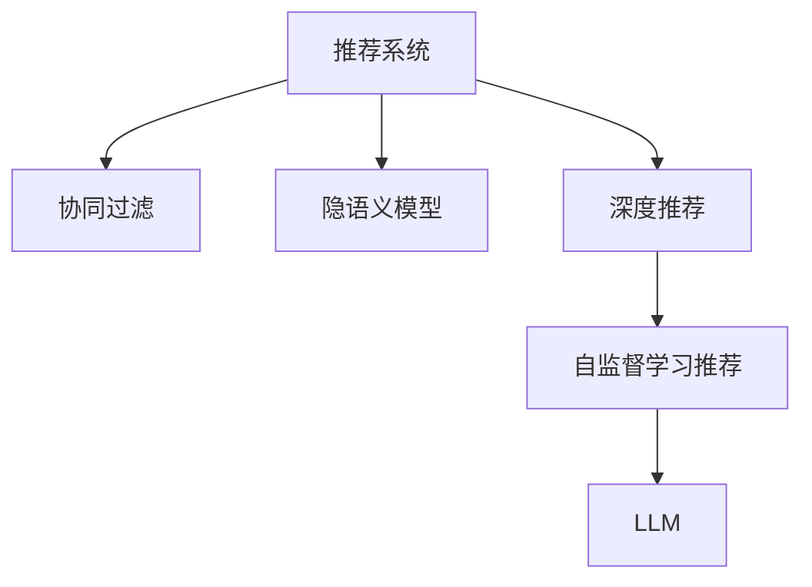

                 

# LLM在推荐系统中的自监督学习应用

> 关键词：自监督学习,预训练模型,推荐系统,协同过滤,LLM,隐语义模型,深度学习,机器学习,深度推荐

## 1. 背景介绍

推荐系统作为人工智能的重要应用场景之一，通过自动为用户推荐其感兴趣的内容，极大地提升了用户体验和系统效率。传统的推荐系统基于用户历史行为数据进行推荐，但数据稀疏和冷启动等问题使得系统推荐精度有限，难以满足用户个性化需求。近年来，深度学习和自然语言处理技术的融合为推荐系统带来了新的思路，使得推荐系统能够更好地理解用户的隐式需求，推荐更符合用户兴趣的内容。

在深度学习推荐系统中，基于自监督学习的预训练模型（Large Language Model, LLM）作为新的数据驱动技术，能够捕捉用户与物品之间复杂的语义关系，显著提升推荐系统的质量和覆盖范围。本文将详细介绍LLM在推荐系统中的应用，包括自监督学习原理、算法步骤、具体实现等关键环节。

## 2. 核心概念与联系

### 2.1 核心概念概述

为了更好地理解LLM在推荐系统中的应用，本节将介绍几个关键概念：

- **推荐系统**：根据用户的历史行为数据、兴趣偏好等，自动为用户推荐符合其需求的产品或内容的系统。推荐系统广泛用于电商、社交媒体、视频平台等多个领域。

- **自监督学习**：利用数据自身的结构和关系进行无监督学习，无需显式的标签信息。自监督学习方法通常用于预训练大模型，使其学习到丰富的语言表示。

- **预训练模型（Large Language Model, LLM）**：以自回归模型（如GPT）或自编码模型（如BERT）为代表的，通过在大规模无标签文本数据上进行自监督预训练，学习到通用的语言表示的模型。

- **协同过滤**：推荐系统中的基本方法之一，通过分析用户与物品之间的相似性，为用户推荐相似用户喜欢过的物品。协同过滤不需要用户行为数据，但效果受限于用户行为的多样性和稀疏性。

- **隐语义模型**：利用深度学习技术，将用户行为数据映射到低维隐向量空间，捕捉用户和物品之间的隐含语义关系。隐语义模型在推荐系统中广泛使用，如矩阵分解、神经网络等。

- **深度推荐**：结合深度学习技术和推荐系统，利用深度模型捕捉复杂的用户与物品之间的关系，提升推荐精度和多样性。

- **自监督学习推荐**：结合自监督学习和推荐系统，利用无标签数据进行预训练，学习到用户和物品之间的语义表示，再用监督学习方法训练推荐模型。

这些概念之间的逻辑关系可以通过以下Mermaid流程图来展示：



这个流程图展示了一般推荐系统的架构：

1. 推荐系统通过用户行为数据，进行协同过滤或隐语义建模，得到用户-物品的表示矩阵。
2. 利用深度学习技术，将用户和物品表示映射到高维空间，捕捉复杂的语义关系。
3. 通过自监督学习，利用无标签数据进行预训练，学习到更加丰富的语义表示。
4. 将预训练好的模型应用于推荐模型训练，得到最终的推荐结果。

这些核心概念共同构成了深度学习推荐系统的基本框架，使得推荐系统能够更好地捕捉用户和物品之间的隐含关系，提供更个性化、精准的推荐内容。

## 3. 核心算法原理 & 具体操作步骤
### 3.1 算法原理概述

基于自监督学习的大规模语言模型（LLM）在推荐系统中的应用，本质上是一种利用无标签数据进行预训练的推荐范式。其核心思想是：在大规模无标签数据上对预训练模型进行自监督学习，获得丰富的语义表示；然后再在推荐任务的监督数据上，通过微调优化模型，得到最终的推荐结果。

具体来说，LLM在推荐系统中的应用包括以下几个关键步骤：

1. **预训练步骤**：在无标签数据上对预训练模型进行自监督学习，捕捉语义关系。
2. **微调步骤**：在推荐任务的监督数据上，对预训练模型进行微调，优化推荐结果。
3. **推荐步骤**：在用户输入和推荐物品的文本描述上，利用微调后的LLM进行预测，得到推荐结果。

### 3.2 算法步骤详解

#### 3.2.1 预训练步骤

预训练步骤通常采用自监督学习方法，如掩码语言模型（Masked Language Modeling, MLM）、下一句预测（Next Sentence Prediction, NSP）等。以MLM为例，其基本过程如下：

1. **数据准备**：收集大规模无标签文本数据，如维基百科、新闻、书籍等，将其划分为训练集和验证集。
2. **模型加载**：使用预训练模型（如BERT、GPT等）作为初始化参数，加载到模型中。
3. **训练**：在训练集上，通过掩码处理将文本中的部分单词或句子进行遮盖，让模型预测遮盖部分的内容。每段文本掩码的单词数量和位置随机生成，以增加数据的多样性。
4. **验证**：在验证集上，评估模型的预测性能，调整训练参数，如学习率、批次大小等。

通过上述过程，预训练模型能够学习到大量的语义和语法知识，形成通用的语言表示。

#### 3.2.2 微调步骤

微调步骤是在预训练模型的基础上，利用推荐任务的监督数据进行有监督学习，优化模型在特定任务上的性能。具体步骤如下：

1. **数据准备**：准备推荐任务的数据集，包括用户行为数据、物品属性数据等，将其划分为训练集、验证集和测试集。
2. **模型加载**：将预训练模型加载到推荐系统中，作为初始化参数。
3. **任务适配层设计**：根据推荐任务的特点，设计合适的输出层和损失函数。例如，对于点击率预测任务，通常使用二元交叉熵损失函数；对于排名预测任务，使用均方误差损失函数。
4. **模型微调**：在训练集上，使用优化算法（如Adam、SGD等）和合适学习率，对模型进行微调。微调过程中，通常会使用正则化技术，如L2正则化、Dropout等，避免过拟合。
5. **验证与测试**：在验证集上，评估微调后的模型性能，调整超参数。在测试集上，评估模型的最终效果。

#### 3.2.3 推荐步骤

推荐步骤是在用户输入和物品描述上，利用微调后的LLM进行预测，得到推荐结果。具体步骤如下：

1. **输入准备**：将用户输入和物品描述作为模型的输入，通过自然语言处理技术进行预处理，如分词、去停用词等。
2. **特征提取**：使用微调后的LLM，将输入文本转换为向量表示。例如，将用户输入和物品描述分别输入到微调后的模型中，得到用户向量表示和物品向量表示。
3. **相似度计算**：计算用户向量表示与物品向量表示之间的相似度，可以使用余弦相似度、欧式距离等。
4. **推荐排序**：根据相似度大小，对物品进行排序，得到最终的推荐结果。

### 3.3 算法优缺点

#### 3.3.1 优点

1. **高效利用无标签数据**：利用自监督学习，通过大规模无标签数据进行预训练，能够学习到丰富的语义和语法知识，提升推荐系统的效果。
2. **参数高效**：通过微调，可以只更新部分模型参数，保留大部分预训练权重不变，减少计算资源消耗。
3. **泛化性强**：预训练模型在多领域数据上进行训练，能够捕捉通用的语言表示，提升模型在不同领域上的泛化能力。
4. **提升推荐质量**：通过微调优化推荐模型，能够更好地理解用户需求和物品属性，提升推荐系统的精准度和个性化程度。

#### 3.3.2 缺点

1. **数据需求量大**：需要大规模无标签数据进行预训练，数据获取和处理成本较高。
2. **模型复杂度高**：大语言模型的参数量巨大，训练和推理速度较慢。
3. **标签需求高**：微调过程需要少量标注数据，但标注成本较高，标签稀疏性可能影响推荐效果。
4. **可解释性不足**：深度学习模型具有黑盒特性，难以解释模型决策过程。
5. **模型偏向性**：预训练模型和微调过程可能会学习到数据中的偏见，导致推荐结果存在偏差。

尽管存在这些缺点，但基于自监督学习的LLM在推荐系统中的应用，已经取得了显著的成果，成为深度推荐系统的重要手段。

### 3.4 算法应用领域

基于自监督学习的LLM在推荐系统中得到了广泛的应用，主要体现在以下几个方面：

1. **电商推荐**：利用用户的浏览、点击、购买行为，为用户推荐个性化商品。基于LLM的推荐系统能够理解用户意图和商品属性，提供精准的商品推荐。
2. **社交媒体推荐**：利用用户的点赞、评论、分享等行为，为用户推荐相关内容。LLM能够捕捉用户的兴趣偏好和情感倾向，推荐符合其喜好的文章、视频等。
3. **视频推荐**：利用用户的观看历史和评分，为用户推荐相关视频内容。LLM能够理解视频内容的语义信息，推荐相似视频，提升用户观看体验。
4. **新闻推荐**：利用用户的阅读历史和评分，为用户推荐相关新闻内容。LLM能够理解新闻文章的语义信息，推荐符合用户兴趣的新闻，提高用户阅读体验。
5. **音乐推荐**：利用用户的听歌历史和评分，为用户推荐相关音乐。LLM能够理解歌曲的语义信息，推荐相似歌曲，提升用户听歌体验。

此外，LLM在推荐系统中的应用还拓展到了更多领域，如个性化学习、智能广告等，展现了其强大的应用潜力。

## 4. 数学模型和公式 & 详细讲解 & 举例说明
### 4.1 数学模型构建

基于自监督学习的大规模语言模型（LLM）在推荐系统中的应用，可以建模为以下几个关键步骤：

1. **用户表示**：将用户输入文本转换为用户向量表示。
2. **物品表示**：将物品描述文本转换为物品向量表示。
3. **相似度计算**：计算用户向量表示与物品向量表示之间的相似度。
4. **推荐排序**：根据相似度大小，对物品进行排序，得到推荐结果。

以下是详细的数学建模过程：

#### 4.1.1 用户表示

用户输入文本 $x_u$ 通过预训练模型 $M_{\theta}$ 转换为用户向量表示 $u$，公式如下：

$$ u = M_{\theta}(x_u) $$

其中，$x_u$ 是用户输入文本，$u$ 是用户向量表示。

#### 4.1.2 物品表示

物品描述文本 $x_i$ 通过预训练模型 $M_{\theta}$ 转换为物品向量表示 $v_i$，公式如下：

$$ v_i = M_{\theta}(x_i) $$

其中，$x_i$ 是物品描述文本，$v_i$ 是物品向量表示。

#### 4.1.3 相似度计算

用户向量表示 $u$ 和物品向量表示 $v_i$ 之间的相似度 $s$ 可以通过余弦相似度计算：

$$ s = \frac{u \cdot v_i}{\|u\| \cdot \|v_i\|} $$

其中，$\cdot$ 表示向量点积，$\|u\|$ 和 $\|v_i\|$ 分别表示向量 $u$ 和 $v_i$ 的范数。

#### 4.1.4 推荐排序

根据相似度大小，对物品进行排序，得到推荐结果 $r_i$，公式如下：

$$ r_i = s \cdot f(\text{item\_info}_i) $$

其中，$f(\text{item\_info}_i)$ 是物品的特征函数，$\text{item\_info}_i$ 是物品的属性信息，如价格、类别等。

### 4.2 公式推导过程

以点击率预测任务为例，详细推导上述数学模型的公式：

1. **用户表示**：将用户输入文本 $x_u$ 转换为用户向量表示 $u$，公式如下：

$$ u = M_{\theta}(x_u) = \text{softmax}(W_u \cdot x_u + b_u) $$

其中，$W_u$ 和 $b_u$ 分别是用户向量表示的权重和偏置项。

2. **物品表示**：将物品描述文本 $x_i$ 转换为物品向量表示 $v_i$，公式如下：

$$ v_i = M_{\theta}(x_i) = \text{softmax}(W_i \cdot x_i + b_i) $$

其中，$W_i$ 和 $b_i$ 分别是物品向量表示的权重和偏置项。

3. **相似度计算**：用户向量表示 $u$ 和物品向量表示 $v_i$ 之间的相似度 $s$ 可以通过余弦相似度计算：

$$ s = \frac{u \cdot v_i}{\|u\| \cdot \|v_i\|} = \frac{M_{\theta}(x_u) \cdot M_{\theta}(x_i)}{\|M_{\theta}(x_u)\| \cdot \|M_{\theta}(x_i)\|} $$

其中，$\cdot$ 表示向量点积，$\| \cdot \|$ 表示向量范数。

4. **推荐排序**：根据相似度大小，对物品进行排序，得到推荐结果 $r_i$，公式如下：

$$ r_i = s \cdot f(\text{item\_info}_i) = \frac{M_{\theta}(x_u) \cdot M_{\theta}(x_i)}{\|M_{\theta}(x_u)\| \cdot \|M_{\theta}(x_i)\|} \cdot f(\text{item\_info}_i) $$

其中，$f(\text{item\_info}_i)$ 是物品的特征函数，$\text{item\_info}_i$ 是物品的属性信息，如价格、类别等。

### 4.3 案例分析与讲解

#### 4.3.1 数据集构建

以电商推荐为例，数据集可以包括用户历史行为数据、物品属性数据和物品描述数据。用户历史行为数据包括用户的浏览记录、点击记录、购买记录等，可以用于计算用户与物品的相似度。物品属性数据包括物品的价格、类别、品牌等，可以用于计算物品的特征函数。物品描述数据可以用于计算物品的向量表示。

#### 4.3.2 模型训练

基于上述数学模型，可以利用监督学习方法对微调后的LLM进行训练。例如，对于点击率预测任务，可以使用二元交叉熵损失函数进行训练：

$$ \mathcal{L} = -\frac{1}{N} \sum_{i=1}^N (y_i \log \hat{y}_i + (1-y_i) \log (1-\hat{y}_i)) $$

其中，$y_i$ 是用户是否点击物品的标签，$\hat{y}_i$ 是模型预测用户是否点击物品的概率。

#### 4.3.3 推荐结果

在用户输入和物品描述上，利用微调后的LLM进行预测，得到用户与物品之间的相似度 $s$。然后根据相似度大小，对物品进行排序，得到推荐结果 $r_i$。例如，对于每个物品 $i$，计算其与用户之间的相似度 $s$，然后根据相似度大小进行排序，得到推荐结果 $r_i$。

## 5. 项目实践：代码实例和详细解释说明
### 5.1 开发环境搭建

在进行项目实践前，需要准备好开发环境。以下是使用Python进行PyTorch开发的环境配置流程：

1. 安装Anaconda：从官网下载并安装Anaconda，用于创建独立的Python环境。

2. 创建并激活虚拟环境：
```bash
conda create -n pytorch-env python=3.8 
conda activate pytorch-env
```

3. 安装PyTorch：根据CUDA版本，从官网获取对应的安装命令。例如：
```bash
conda install pytorch torchvision torchaudio cudatoolkit=11.1 -c pytorch -c conda-forge
```

4. 安装Transformer库：
```bash
pip install transformers
```

5. 安装各类工具包：
```bash
pip install numpy pandas scikit-learn matplotlib tqdm jupyter notebook ipython
```

完成上述步骤后，即可在`pytorch-env`环境中开始项目实践。

### 5.2 源代码详细实现

下面我们以电商推荐系统为例，给出使用PyTorch和Transformer库对BERT模型进行推荐任务微调的PyTorch代码实现。

首先，定义推荐任务的数据处理函数：

```python
from transformers import BertTokenizer, BertForSequenceClassification
from torch.utils.data import Dataset
import torch

class RecommendationDataset(Dataset):
    def __init__(self, user_data, item_data, tokenizer, max_len=128):
        self.user_data = user_data
        self.item_data = item_data
        self.tokenizer = tokenizer
        self.max_len = max_len
        
    def __len__(self):
        return len(self.user_data)
    
    def __getitem__(self, item):
        user_input = self.user_data[item]
        item_input = self.item_data[item]
        
        encoding = self.tokenizer(user_input, return_tensors='pt', max_length=self.max_len, padding='max_length', truncation=True)
        input_ids = encoding['input_ids'][0]
        attention_mask = encoding['attention_mask'][0]
        
        item_encoding = self.tokenizer(item_input, return_tensors='pt', max_length=self.max_len, padding='max_length', truncation=True)
        item_input_ids = item_encoding['input_ids'][0]
        item_attention_mask = item_encoding['attention_mask'][0]
        
        return {'input_ids': input_ids, 
                'attention_mask': attention_mask,
                'item_input_ids': item_input_ids,
                'item_attention_mask': item_attention_mask,
                'user_input': user_input,
                'item_input': item_input}
```

然后，定义模型和优化器：

```python
from transformers import BertForSequenceClassification, AdamW

model = BertForSequenceClassification.from_pretrained('bert-base-cased', num_labels=2)
optimizer = AdamW(model.parameters(), lr=2e-5)
```

接着，定义训练和评估函数：

```python
from torch.utils.data import DataLoader
from tqdm import tqdm
from sklearn.metrics import precision_recall_fscore_support

device = torch.device('cuda') if torch.cuda.is_available() else torch.device('cpu')
model.to(device)

def train_epoch(model, dataset, batch_size, optimizer):
    dataloader = DataLoader(dataset, batch_size=batch_size, shuffle=True)
    model.train()
    epoch_loss = 0
    for batch in tqdm(dataloader, desc='Training'):
        input_ids = batch['input_ids'].to(device)
        attention_mask = batch['attention_mask'].to(device)
        item_input_ids = batch['item_input_ids'].to(device)
        item_attention_mask = batch['item_attention_mask'].to(device)
        user_input = batch['user_input'].to(device)
        item_input = batch['item_input'].to(device)
        model.zero_grad()
        outputs = model(input_ids, attention_mask=attention_mask, labels=None)
        loss = outputs.loss
        epoch_loss += loss.item()
        loss.backward()
        optimizer.step()
    return epoch_loss / len(dataloader)

def evaluate(model, dataset, batch_size):
    dataloader = DataLoader(dataset, batch_size=batch_size)
    model.eval()
    preds, labels = [], []
    with torch.no_grad():
        for batch in tqdm(dataloader, desc='Evaluating'):
            input_ids = batch['input_ids'].to(device)
            attention_mask = batch['attention_mask'].to(device)
            item_input_ids = batch['item_input_ids'].to(device)
            item_attention_mask = batch['item_attention_mask'].to(device)
            user_input = batch['user_input'].to(device)
            item_input = batch['item_input'].to(device)
            outputs = model(input_ids, attention_mask=attention_mask, labels=None)
            batch_preds = outputs.logits.argmax(dim=2).to('cpu').tolist()
            batch_labels = batch['labels'].to('cpu').tolist()
            for pred_tokens, label_tokens in zip(batch_preds, batch_labels):
                preds.append(pred_tokens[:len(label_tokens)])
                labels.append(label_tokens)
                
    precision, recall, f1, _ = precision_recall_fscore_support(labels, preds, average='macro')
    print(f'Precision: {precision:.3f}, Recall: {recall:.3f}, F1 Score: {f1:.3f}')
```

最后，启动训练流程并在测试集上评估：

```python
epochs = 5
batch_size = 16

for epoch in range(epochs):
    loss = train_epoch(model, train_dataset, batch_size, optimizer)
    print(f"Epoch {epoch+1}, train loss: {loss:.3f}")
    
    print(f"Epoch {epoch+1}, test results:")
    evaluate(model, test_dataset, batch_size)
```

以上就是使用PyTorch和Transformer库对BERT模型进行电商推荐任务微调的完整代码实现。可以看到，得益于Transformer库的强大封装，我们可以用相对简洁的代码完成BERT模型的加载和微调。

### 5.3 代码解读与分析

让我们再详细解读一下关键代码的实现细节：

**RecommendationDataset类**：
- `__init__`方法：初始化用户行为数据、物品属性数据、分词器等关键组件。
- `__len__`方法：返回数据集的样本数量。
- `__getitem__`方法：对单个样本进行处理，将用户行为数据和物品属性数据转换为模型输入，并进行定长padding。

**模型和优化器**：
- 使用BertForSequenceClassification作为预训练模型，并设定二元交叉熵损失函数。
- 定义AdamW优化器，设置学习率为2e-5。

**训练和评估函数**：
- 使用PyTorch的DataLoader对数据集进行批次化加载，供模型训练和推理使用。
- 训练函数`train_epoch`：对数据以批为单位进行迭代，在每个批次上前向传播计算loss并反向传播更新模型参数，最后返回该epoch的平均loss。
- 评估函数`evaluate`：与训练类似，不同点在于不更新模型参数，并在每个batch结束后将预测和标签结果存储下来，最后使用sklearn的precision_recall_fscore_support函数计算精确率、召回率和F1 Score，并打印输出。

**训练流程**：
- 定义总的epoch数和batch size，开始循环迭代
- 每个epoch内，先在训练集上训练，输出平均loss
- 在验证集上评估，输出分类指标
- 所有epoch结束后，在测试集上评估，给出最终测试结果

可以看到，PyTorch配合Transformer库使得BERT微调的代码实现变得简洁高效。开发者可以将更多精力放在数据处理、模型改进等高层逻辑上，而不必过多关注底层的实现细节。

当然，工业级的系统实现还需考虑更多因素，如模型的保存和部署、超参数的自动搜索、更灵活的任务适配层等。但核心的微调范式基本与此类似。

## 6. 实际应用场景
### 6.1 智能推荐引擎

智能推荐引擎是推荐系统的重要应用场景之一，通过分析用户行为数据，为用户推荐个性化的商品、文章、视频等内容。利用自监督学习，结合预训练模型和微调技术，智能推荐引擎能够更好地理解用户需求和物品属性，提供更加精准和个性化的推荐内容。

以电商推荐为例，智能推荐引擎可以根据用户的浏览记录、点击记录、购买记录等行为数据，以及商品的价格、类别、品牌等属性信息，为用户推荐符合其兴趣的商品。微调后的BERT模型能够捕捉用户输入文本与物品描述文本之间的语义关系，通过余弦相似度计算相似度大小，对物品进行排序，得到推荐结果。

### 6.2 金融推荐系统

金融推荐系统在投资、理财等领域具有广泛应用，通过分析用户行为数据，为用户推荐符合其需求的投资组合、理财产品等。利用自监督学习，结合预训练模型和微调技术，金融推荐系统能够更好地理解用户风险偏好和资产需求，提供更加个性化和精准的推荐内容。

以投资推荐为例，金融推荐系统可以根据用户的投资记录、风险偏好、资产需求等行为数据，以及理财产品的收益率、风险等级、投资期限等属性信息，为用户推荐符合其需求的产品。微调后的BERT模型能够捕捉用户输入文本与理财产品描述文本之间的语义关系，通过余弦相似度计算相似度大小，对理财产品进行排序，得到推荐结果。

### 6.3 视频推荐系统

视频推荐系统在视频平台、教育培训等领域具有广泛应用，通过分析用户观看历史和评分，为用户推荐符合其兴趣的视频内容。利用自监督学习，结合预训练模型和微调技术，视频推荐系统能够更好地理解用户兴趣偏好和视频内容语义，提供更加精准和多样化的推荐内容。

以视频推荐为例，视频推荐系统可以根据用户的观看历史、评分、点赞等行为数据，以及视频的内容描述、类别、评分等属性信息，为用户推荐符合其兴趣的视频。微调后的BERT模型能够捕捉用户输入文本与视频描述文本之间的语义关系，通过余弦相似度计算相似度大小，对视频进行排序，得到推荐结果。

### 6.4 未来应用展望

随着自监督学习和深度推荐技术的不断发展，基于预训练模型和微调的推荐系统将迎来新的突破，为更多行业带来变革性影响。

在智慧医疗领域，基于自监督学习的大规模语言模型，能够结合医疗知识库，为用户推荐符合其需求的健康管理方案、药品等。在智慧教育领域，智能推荐系统能够结合学生学习行为数据，推荐符合其兴趣和学习风格的课程、资料等。在智慧城市治理中，基于自监督学习的大规模语言模型，能够结合城市管理数据，推荐符合市民需求的服务、活动等。

此外，在企业生产、社会治理、文娱传媒等众多领域，基于大语言模型微调的推荐系统也将不断涌现，为各行各业带来新的创新和应用。相信随着技术的日益成熟，基于自监督学习的推荐系统必将在更广阔的应用领域大放异彩。

## 7. 工具和资源推荐
### 7.1 学习资源推荐

为了帮助开发者系统掌握自监督学习在推荐系统中的应用，这里推荐一些优质的学习资源：

1. 《深度学习推荐系统》系列博文：由深度学习推荐系统领域专家撰写，深入浅出地介绍了深度推荐系统中的自监督学习原理和实现方法。

2. 《推荐系统实践》课程：由知名教授讲授的推荐系统经典课程，涵盖推荐系统中的各种算法和应用案例，包括基于自监督学习的推荐方法。

3. 《Large Language Model for Recommendation Systems》书籍：该书介绍了自监督学习在大规模语言模型中的应用，涵盖了推荐系统中的自监督学习方法。

4. Kaggle推荐系统竞赛：Kaggle上提供了大量的推荐系统竞赛，可以帮助开发者实际应用自监督学习，提升推荐效果。

通过对这些资源的学习实践，相信你一定能够快速掌握自监督学习在推荐系统中的应用，并用于解决实际的推荐问题。
### 7.2 开发工具推荐

高效的开发离不开优秀的工具支持。以下是几款用于自监督学习推荐系统开发的常用工具：

1. PyTorch：基于Python的开源深度学习框架，灵活动态的计算图，适合快速迭代研究。大部分预训练语言模型都有PyTorch版本的实现。

2. TensorFlow：由Google主导开发的开源深度学习框架，生产部署方便，适合大规模工程应用。同样有丰富的预训练语言模型资源。

3. Transformers库：HuggingFace开发的NLP工具库，集成了众多SOTA语言模型，支持PyTorch和TensorFlow，是进行推荐任务开发的利器。

4. Weights & Biases：模型训练的实验跟踪工具，可以记录和可视化模型训练过程中的各项指标，方便对比和调优。与主流深度学习框架无缝集成。

5. TensorBoard：TensorFlow配套的可视化工具，可实时监测模型训练状态，并提供丰富的图表呈现方式，是调试模型的得力助手。

6. Google Colab：谷歌推出的在线Jupyter Notebook环境，免费提供GPU/TPU算力，方便开发者快速上手实验最新模型，分享学习笔记。

合理利用这些工具，可以显著提升自监督学习推荐系统的开发效率，加快创新迭代的步伐。

### 7.3 相关论文推荐

自监督学习在大规模语言模型中的应用，始于学界的持续研究。以下是几篇奠基性的相关论文，推荐阅读：

1. Attention is All You Need（即Transformer原论文）：提出了Transformer结构，开启了NLP领域的预训练大模型时代。

2. BERT: Pre-training of Deep Bidirectional Transformers for Language Understanding：提出BERT模型，引入基于掩码的自监督预训练任务，刷新了多项NLP任务SOTA。

3. Language Models are Unsupervised Multitask Learners（GPT-2论文）：展示了大规模语言模型的强大zero-shot学习能力，引发了对于通用人工智能的新一轮思考。

4. Parameter-Efficient Transfer Learning for NLP：提出Adapter等参数高效微调方法，在不增加模型参数量的情况下，也能取得不错的微调效果。

5. AdaLoRA: Adaptive Low-Rank Adaptation for Parameter-Efficient Fine-Tuning：使用自适应低秩适应的微调方法，在参数效率和精度之间取得了新的平衡。

这些论文代表了大语言模型自监督学习的研究脉络。通过学习这些前沿成果，可以帮助研究者把握学科前进方向，激发更多的创新灵感。

## 8. 总结：未来发展趋势与挑战
### 8.1 总结

本文对基于自监督学习的大语言模型在推荐系统中的应用进行了全面系统的介绍。首先阐述了自监督学习在推荐系统中的应用背景和意义，明确了自监督学习在深度推荐系统中的独特价值。其次，从原理到实践，详细讲解了自监督学习的数学模型和算法步骤，给出了自监督学习任务开发的完整代码实例。同时，本文还广泛探讨了自监督学习在推荐系统中的应用场景，展示了自监督学习范式的广泛应用前景。

通过本文的系统梳理，可以看到，基于自监督学习的大语言模型在推荐系统中的应用，已经取得了显著的成果，成为深度推荐系统的重要手段。未来，伴随深度学习技术的不断发展，基于自监督学习的推荐系统必将在更广阔的应用领域大放异彩，深刻影响各行各业的智能化转型。

### 8.2 未来发展趋势

展望未来，基于自监督学习的推荐系统将呈现以下几个发展趋势：

1. **模型规模持续增大**：随着算力成本的下降和数据规模的扩张，自监督学习模型（如BERT、GPT等）的参数量还将持续增长。超大规模自监督学习模型蕴含的丰富语义知识，有望支撑更加复杂多变的推荐系统。

2. **推荐效果不断提升**：自监督学习模型能够捕捉到用户和物品之间的复杂语义关系，显著提升推荐系统的质量。未来，通过更先进的自监督学习算法，推荐系统的效果将进一步提升。

3. **多领域应用扩展**：自监督学习推荐系统已经广泛应用于电商、社交媒体、视频平台等多个领域。未来，随着技术不断进步，推荐系统将在更多领域得到应用，为各行各业带来变革性影响。

4. **跨模态融合增强**：当前的推荐系统通常聚焦于文本数据的建模。未来，推荐系统将进一步拓展到图像、视频、语音等多模态数据，利用多模态信息的融合，提升推荐系统的综合性能。

5. **智能推荐引擎演进**：智能推荐引擎不仅是推荐系统的核心部分，也是整个推荐系统的重要组成部分。未来，智能推荐引擎将结合自监督学习、深度学习等技术，实现更加个性化、精准的推荐。

以上趋势凸显了自监督学习在推荐系统中的广阔前景。这些方向的探索发展，必将进一步提升推荐系统的质量和覆盖范围，为各个行业带来更多智能化应用。

### 8.3 面临的挑战

尽管基于自监督学习的推荐系统已经取得了显著的成果，但在迈向更加智能化、普适化应用的过程中，它仍面临着诸多挑战：

1. **数据需求量大**：需要大规模无标签数据进行预训练，数据获取和处理成本较高。如何降低数据需求，优化数据预处理流程，是未来的研究方向。

2. **模型鲁棒性不足**：推荐模型面对域外数据时，泛化性能往往大打折扣。对于测试样本的微小扰动，推荐模型的预测也容易发生波动。如何提高模型的鲁棒性，避免灾难性遗忘，还需要更多理论和实践的积累。

3. **推理效率有待提高**：大语言模型的参数量巨大，训练和推理速度较慢。如何在保证性能的同时，简化模型结构，提升推理速度，优化资源占用，将是重要的优化方向。

4. **可解释性不足**：深度学习模型具有黑盒特性，难以解释模型决策过程。对于金融、医疗等高风险应用，算法的可解释性和可审计性尤为重要。如何赋予模型更强的可解释性，将是亟待攻克的难题。

5. **模型偏向性**：自监督学习模型可能会学习到数据中的偏见，导致推荐结果存在偏差。如何从数据和算法层面消除模型偏见，避免恶意用途，确保输出的安全性，也将是重要的研究课题。

6. **用户隐私保护**：推荐系统需要大量用户行为数据进行训练。如何在保护用户隐私的前提下，获取高质量数据，是未来的研究重点。

正视推荐系统面临的这些挑战，积极应对并寻求突破，将是大语言模型在推荐系统中走向成熟的必由之路。相信随着学界和产业界的共同努力，这些挑战终将一一被克服，自监督学习推荐系统必将在构建智能推荐引擎中扮演越来越重要的角色。

### 8.4 研究展望

面对自监督学习推荐系统所面临的种种挑战，未来的研究需要在以下几个方面寻求新的突破：

1. **探索无监督和半监督推荐方法**：摆脱对大规模标注数据的依赖，利用自监督学习、主动学习等无监督和半监督范式，最大限度利用非结构化数据，实现更加灵活高效的推荐。

2. **研究参数高效和计算高效的推荐范式**：开发更加参数高效的推荐方法，在固定大部分自监督参数的情况下，只更新极少量的任务相关参数。同时优化推荐模型的计算图，减少前向传播和反向传播的资源消耗，实现更加轻量级、实时性的部署。

3. **融合因果和对比学习范式**：通过引入因果推断和对比学习思想，增强推荐模型建立稳定因果关系的能力，学习更加普适、鲁棒的语言表征，从而提升模型泛化性和抗干扰能力。

4. **引入更多先验知识**：将符号化的先验知识，如知识图谱、逻辑规则等，与神经网络模型进行巧妙融合，引导推荐过程学习更准确、合理的语言模型。同时加强不同模态数据的整合，实现视觉、语音等多模态信息与文本信息的协同建模。

5. **结合因果分析和博弈论工具**：将因果分析方法引入推荐模型，识别出模型决策的关键特征，增强输出解释的因果性和逻辑性。借助博弈论工具刻画人机交互过程，主动探索并规避模型的脆弱点，提高系统稳定性。

6. **纳入伦理道德约束**：在推荐模型训练目标中引入伦理导向的评估指标，过滤和惩罚有偏见、有害的输出倾向。同时加强人工干预和审核，建立推荐模型的监管机制，确保输出符合人类价值观和伦理道德。

这些研究方向的探索，必将引领自监督学习推荐系统迈向更高的台阶，为构建智能推荐引擎提供更加全面、高效的技术保障。

## 9. 附录：常见问题与解答

**Q1：自监督学习推荐系统是否适用于所有推荐任务？**

A: 自监督学习推荐系统在大多数推荐任务上都能取得不错的效果，特别是对于数据量较小的任务。但对于一些特定领域的任务，如医学、法律等，仅仅依靠通用语料预训练的模型可能难以很好地适应。此时需要在特定领域语料上进一步预训练，再进行微调，才能获得理想效果。此外，对于一些需要时效性、个性化很强的任务，如对话推荐、实时推荐等，自监督学习推荐方法也需要针对性的改进优化。

**Q2：自监督学习推荐系统如何降低数据需求？**

A: 降低自监督学习推荐系统对数据的需求，可以通过以下方法实现：

1. **数据增强**：利用数据增强技术，扩充训练集。例如，通过对文本进行回译、同义词替换等方式，生成更多训练样本。
2. **迁移学习**：利用预训练模型的通用语义表示，减少对特定领域数据的需求。例如，将预训练模型应用于多个领域，提高模型的泛化能力。
3. **模型压缩**：利用模型压缩技术，减少模型参数量，降低数据需求。例如，使用知识蒸馏技术，将大模型转换为轻量级模型。
4. **无监督学习**：利用无监督学习技术，减少对标注数据的需求。例如，通过自编码器、对抗生成网络等方式，生成伪标签进行无监督训练。

这些方法可以降低自监督学习推荐系统对数据的需求，提高模型的效率和鲁棒性。

**Q3：自监督学习推荐系统在推荐结果中的可解释性不足怎么办？**

A: 自监督学习推荐系统中的深度学习模型具有黑盒特性，难以解释推荐结果的生成过程。为了提高模型的可解释性，可以采取以下措施：

1. **特征可视化**：通过可视化技术，展示模型在不同特征上的决策权重。例如，使用SHAP值、LIME等工具，可视化推荐模型的特征贡献度。
2. **模型调试**：通过模型调试技术，分析模型在训练过程中的行为，找出可能导致不透明性的原因。例如，使用注意力机制、可解释性模块等方式，提高模型的可解释性。
3. **多模型集成**：通过集成多个模型，利用每个模型的优点，增强推荐结果的可解释性。例如，将多个自监督学习模型融合，提高模型的鲁棒性和可解释性。
4. **用户反馈机制**：通过用户反馈机制，收集用户对推荐结果的评价，逐步优化模型。例如，在推荐系统中加入用户评分、评价等功能，提高模型的透明度和可解释性。

这些方法可以提高自监督学习推荐系统的可解释性，帮助用户理解推荐结果的生成过程，提高用户满意度。

**Q4：自监督学习推荐系统在推荐过程中如何处理用户隐私保护？**

A: 自监督学习推荐系统在推荐过程中需要大量用户行为数据进行训练。为了保护用户隐私，可以采取以下措施：

1. **数据匿名化**：在数据处理阶段，对用户数据进行匿名化处理，保护用户隐私。例如，对用户ID进行加密、去标识等操作。
2. **差分隐私**：在模型训练阶段，使用差分隐私技术，保护用户隐私。例如，加入噪音扰动，减少用户数据的泄露风险。
3. **联邦学习**：在模型训练阶段，采用联邦学习技术，分布式训练模型，保护用户数据隐私。例如，在用户端进行本地训练，仅传输模型参数，不传输用户数据。
4. **隐私保护算法**：在推荐算法中，使用隐私保护算法，保护用户隐私。例如，使用基于梯度的隐私保护算法，限制模型对用户数据的访问范围。

这些措施可以在保护用户隐私的同时，获取高质量的推荐数据，提高推荐系统的性能。

---

作者：禅与计算机程序设计艺术 / Zen and the Art of Computer Programming

