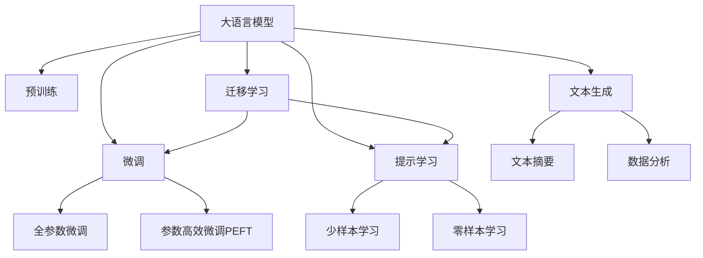

                 

# 大语言模型在智能新闻生成中的潜力

> 关键词：大语言模型,新闻生成,文本生成,自然语言处理(NLP),Transformer,预训练,迁移学习,提示学习,Prompt Engineering,文本摘要,数据分析

## 1. 背景介绍

随着人工智能技术在各个领域的不断深入，新闻行业的自动化转型已经成为了一大趋势。传统的编辑和记者需要面对海量的数据和复杂的新闻信息，其工作负担和工作效率都面临着巨大的挑战。如何利用人工智能技术，自动化地生成高质量的新闻报道，成为了一个热门的研究方向。大语言模型（Large Language Models，LLMs）作为近年来在自然语言处理（Natural Language Processing，NLP）领域取得突破的模型，通过预训练和微调，已经在新闻生成任务中展现出了巨大的潜力。

本文将深入探讨基于大语言模型的新闻生成技术，重点介绍其在文本生成、摘要生成、数据分析等方面的应用，以及面临的挑战和未来发展的趋势。

## 2. 核心概念与联系

### 2.1 核心概念概述

为更好地理解基于大语言模型的智能新闻生成技术，本节将介绍几个密切相关的核心概念：

- **大语言模型**：以Transformer架构为代表的大规模预训练语言模型，如BERT、GPT等。通过在海量无标签文本数据上进行预训练，学习通用的语言表示，具备强大的语言理解和生成能力。

- **预训练**：指在大规模无标签文本数据上，通过自监督学习任务训练通用语言模型的过程。常见的预训练任务包括语言模型（如masked language modeling）、文本分类、命名实体识别等。

- **微调**：指在预训练模型的基础上，使用下游任务的少量标注数据，通过有监督学习优化模型在特定任务上的性能。通常在顶层添加任务适配层，如分类器或解码器，并以较小的学习率更新全部或部分的模型参数。

- **迁移学习**：指将一个领域学习到的知识，迁移应用到另一个不同但相关的领域的学习范式。大模型的预训练-微调过程即是一种典型的迁移学习方式。

- **提示学习（Prompt Engineering）**：通过在输入文本中添加提示模板（Prompt Template），引导大语言模型进行特定任务的推理和生成。可以在不更新模型参数的情况下，实现零样本或少样本学习。

- **文本生成**：指根据特定的输入（如问题、话题、摘要等），生成连贯且语义通顺的文本。

- **文本摘要**：指将长文本压缩成简短摘要，同时保留关键信息。

- **数据分析**：指利用大语言模型对新闻数据进行自动化分析和信息提取，提供新闻背景信息、关键词提取等功能。

这些核心概念之间的逻辑关系可以通过以下Mermaid流程图来展示：



这个流程图展示了大语言模型的核心概念及其之间的关系：

1. 大语言模型通过预训练获得基础能力。
2. 微调是对预训练模型进行任务特定的优化，可以分为全参数微调和参数高效微调（PEFT）。
3. 提示学习是一种不更新模型参数的方法，可以实现少样本学习和零样本学习。
4. 迁移学习是连接预训练模型与下游任务的桥梁，可以通过微调或提示学习来实现。
5. 文本生成、摘要生成和数据分析等任务都可以基于大语言模型的微调技术来实现。

这些概念共同构成了大语言模型的学习和应用框架，使其能够在各种场景下发挥强大的语言理解和生成能力。通过理解这些核心概念，我们可以更好地把握大语言模型的工作原理和优化方向。

## 3. 核心算法原理 & 具体操作步骤
### 3.1 算法原理概述

基于大语言模型的智能新闻生成，本质上是一个有监督的文本生成过程。其核心思想是：将大语言模型视作一个强大的"特征提取器"，通过在新闻生成任务上进行有监督微调，使得模型能够生成符合新闻报道风格和格式的文本。

形式化地，假设大语言模型为 $M_{\theta}$，其中 $\theta$ 为预训练得到的模型参数。给定新闻生成任务 $T$ 的训练数据集 $D=\{(x_i,y_i)\}_{i=1}^N$，其中 $x_i$ 为输入（如问题、话题），$y_i$ 为生成的新闻报道。微调的目标是找到新的模型参数 $\hat{\theta}$，使得：

$$
\hat{\theta}=\mathop{\arg\min}_{\theta} \mathcal{L}(M_{\theta},D)
$$

其中 $\mathcal{L}$ 为针对新闻生成任务设计的损失函数，用于衡量模型生成的文本与真实文本之间的差异。常见的损失函数包括交叉熵损失、BLEU分数、Rouge分数等。

通过梯度下降等优化算法，微调过程不断更新模型参数 $\theta$，最小化损失函数 $\mathcal{L}$，使得模型生成的文本逼近真实新闻报道。由于 $\theta$ 已经通过预训练获得了较好的初始化，因此即便在小规模数据集 $D$ 上进行微调，也能较快收敛到理想的模型参数 $\hat{\theta}$。

### 3.2 算法步骤详解

基于大语言模型的智能新闻生成一般包括以下几个关键步骤：

**Step 1: 准备预训练模型和数据集**
- 选择合适的预训练语言模型 $M_{\theta}$ 作为初始化参数，如 GPT、BERT 等。
- 准备新闻生成任务的训练数据集 $D$，划分为训练集、验证集和测试集。一般要求训练数据与预训练数据的分布不要差异过大。

**Step 2: 添加任务适配层**
- 根据新闻生成任务类型，在预训练模型顶层设计合适的输出层和损失函数。
- 对于新闻生成任务，通常在顶层添加语言模型解码器，并以BLEU分数或Rouge分数为损失函数。

**Step 3: 设置微调超参数**
- 选择合适的优化算法及其参数，如 AdamW、SGD 等，设置学习率、批大小、迭代轮数等。
- 设置正则化技术及强度，包括权重衰减、Dropout、Early Stopping 等。
- 确定冻结预训练参数的策略，如仅微调顶层，或全部参数都参与微调。

**Step 4: 执行梯度训练**
- 将训练集数据分批次输入模型，前向传播计算损失函数。
- 反向传播计算参数梯度，根据设定的优化算法和学习率更新模型参数。
- 周期性在验证集上评估模型性能，根据性能指标决定是否触发 Early Stopping。
- 重复上述步骤直到满足预设的迭代轮数或 Early Stopping 条件。

**Step 5: 测试和部署**
- 在测试集上评估微调后模型 $M_{\hat{\theta}}$ 的性能，对比微调前后的生成效果。
- 使用微调后的模型对新的新闻题目进行生成，集成到实际的新闻系统中。

以上是基于大语言模型的智能新闻生成的完整流程。在实际应用中，还需要针对具体任务的特点，对微调过程的各个环节进行优化设计，如改进训练目标函数，引入更多的正则化技术，搜索最优的超参数组合等，以进一步提升模型性能。

### 3.3 算法优缺点

基于大语言模型的智能新闻生成方法具有以下优点：
1. 自动化高效。自动化的文本生成和摘要生成，大幅减少了人工编辑的工作量。
2. 风格一致。通过微调，模型可以学习到新闻报道的风格和格式，生成的文本与真实报道风格相似。
3. 跨领域适用。预训练模型通过迁移学习，可以适应不同领域的新闻生成任务。
4. 精度较高。通过微调优化，模型能够生成高质量的新闻报道，满足新闻行业的标准。

同时，该方法也存在一定的局限性：
1. 依赖高质量标注数据。新闻生成任务的标注数据获取成本较高，且质量要求高。
2. 模型训练成本高。大规模预训练和微调需要大量的计算资源。
3. 生成内容的可控性。生成内容可能存在失实、偏见等风险，需要人工审核。
4. 内容的原创性。部分模型可能生成内容与现有报道过于相似，缺乏原创性。

尽管存在这些局限性，但就目前而言，基于大语言模型的智能新闻生成方法仍是大规模新闻报道自动化生成的重要手段。未来相关研究的重点在于如何进一步降低微调对标注数据的依赖，提高模型的少样本学习和跨领域迁移能力，同时兼顾内容的原创性和可控性等因素。

### 3.4 算法应用领域

基于大语言模型的智能新闻生成技术已经在新闻报道、新闻摘要生成、新闻分析等多个领域得到了应用，例如：

- **新闻报道生成**：根据新闻题目或关键词，自动生成完整的新闻报道。
- **新闻摘要生成**：对长新闻报道自动压缩生成简短摘要，帮助用户快速了解新闻内容。
- **新闻分析**：自动分析新闻数据，提取关键事件、人物、地点等信息，辅助新闻编辑。

除了上述这些经典应用外，大语言模型智能新闻生成还被创新性地应用到更多场景中，如新闻推荐、舆情分析、数据可视化等，为新闻行业的智能化和自动化提供了新的解决方案。

## 4. 数学模型和公式 & 详细讲解  
### 4.1 数学模型构建

本节将使用数学语言对基于大语言模型的智能新闻生成过程进行更加严格的刻画。

记大语言模型为 $M_{\theta}$，其中 $\theta$ 为预训练得到的模型参数。假设新闻生成任务为 $T$，训练集为 $D=\{(x_i,y_i)\}_{i=1}^N$，其中 $x_i$ 为输入，$y_i$ 为生成的新闻报道。

定义模型 $M_{\theta}$ 在输入 $x$ 上的损失函数为 $\ell(M_{\theta}(x),y)$，则在数据集 $D$ 上的经验风险为：

$$
\mathcal{L}(\theta) = \frac{1}{N} \sum_{i=1}^N \ell(M_{\theta}(x_i),y_i)
$$

其中 $\ell$ 为针对新闻生成任务设计的损失函数，用于衡量模型生成的文本与真实文本之间的差异。常见的损失函数包括交叉熵损失、BLEU分数、Rouge分数等。

微调的优化目标是最小化经验风险，即找到最优参数：

$$
\theta^* = \mathop{\arg\min}_{\theta} \mathcal{L}(\theta)
$$

在实践中，我们通常使用基于梯度的优化算法（如SGD、Adam等）来近似求解上述最优化问题。设 $\eta$ 为学习率，$\lambda$ 为正则化系数，则参数的更新公式为：

$$
\theta \leftarrow \theta - \eta \nabla_{\theta}\mathcal{L}(\theta) - \eta\lambda\theta
$$

其中 $\nabla_{\theta}\mathcal{L}(\theta)$ 为损失函数对参数 $\theta$ 的梯度，可通过反向传播算法高效计算。

### 4.2 公式推导过程

以下我们以BLEU分数为例，推导基于BLEU损失函数的新闻生成模型的训练过程。

假设模型 $M_{\theta}$ 在输入 $x$ 上的生成文本为 $\hat{y}=M_{\theta}(x)$。假设目标文本为 $y$，则BLEU分数定义为：

$$
BLEU(y,\hat{y}) = \max_{\sigma} \prod_{i=1}^n \text{BLEU}_{(i)}(y,\hat{y}_{\sigma})
$$

其中 $n$ 为文本长度，$\sigma$ 为 $\hat{y}$ 的排列顺序，$\text{BLEU}_{(i)}$ 为BLEU子分数，用于衡量第 $i$ 个位置上单词对齐的精确度。

将BLEU分数作为损失函数，我们可得：

$$
\mathcal{L}_{BLEU}(\theta) = -\frac{1}{N}\sum_{i=1}^N BLEU(y_i,\hat{y}_i)
$$

基于BLEU分数的损失函数梯度计算较为复杂，但可以借助BLEU算法的计算结果，进行反向传播。具体推导过程可参考相关论文，这里不再赘述。

## 5. 项目实践：代码实例和详细解释说明
### 5.1 开发环境搭建

在进行智能新闻生成实践前，我们需要准备好开发环境。以下是使用Python进行PyTorch开发的环境配置流程：

1. 安装Anaconda：从官网下载并安装Anaconda，用于创建独立的Python环境。

2. 创建并激活虚拟环境：
```bash
conda create -n pytorch-env python=3.8 
conda activate pytorch-env
```

3. 安装PyTorch：根据CUDA版本，从官网获取对应的安装命令。例如：
```bash
conda install pytorch torchvision torchaudio cudatoolkit=11.1 -c pytorch -c conda-forge
```

4. 安装Transformers库：
```bash
pip install transformers
```

5. 安装各类工具包：
```bash
pip install numpy pandas scikit-learn matplotlib tqdm jupyter notebook ipython
```

完成上述步骤后，即可在`pytorch-env`环境中开始智能新闻生成的实践。

### 5.2 源代码详细实现

下面我们以新闻摘要生成为例，给出使用Transformers库对GPT模型进行新闻摘要生成的PyTorch代码实现。

首先，定义摘要任务的数据处理函数：

```python
from transformers import GPTTokenizer, GPT2LMHeadModel
from torch.utils.data import Dataset
import torch

class NewsSummarizationDataset(Dataset):
    def __init__(self, texts, summaries, tokenizer, max_len=128):
        self.texts = texts
        self.summaries = summaries
        self.tokenizer = tokenizer
        self.max_len = max_len
        
    def __len__(self):
        return len(self.texts)
    
    def __getitem__(self, item):
        text = self.texts[item]
        summary = self.summaries[item]
        
        encoding = self.tokenizer(text, return_tensors='pt', max_length=self.max_len, padding='max_length', truncation=True)
        input_ids = encoding['input_ids'][0]
        attention_mask = encoding['attention_mask'][0]
        
        # 对摘要文本进行编码
        encoded_summary = self.tokenizer(summary, return_tensors='pt', max_length=self.max_len, padding='max_length', truncation=True)
        target_ids = encoded_summary['input_ids'][0]
        
        return {'input_ids': input_ids, 
                'attention_mask': attention_mask,
                'target_ids': target_ids}

# 初始化tokenizer和模型
tokenizer = GPTTokenizer.from_pretrained('gpt2')
model = GPT2LMHeadModel.from_pretrained('gpt2', pad_token_id=tokenizer.eos_token_id)
model.eval()

# 加载数据集
news_dataset = NewsSummarizationDataset(news_data, news_summaries, tokenizer)
```

然后，定义训练和评估函数：

```python
from torch.utils.data import DataLoader
from tqdm import tqdm

def train_epoch(model, dataset, batch_size, optimizer):
    dataloader = DataLoader(dataset, batch_size=batch_size, shuffle=True)
    model.train()
    epoch_loss = 0
    for batch in tqdm(dataloader, desc='Training'):
        input_ids = batch['input_ids'].to(device)
        attention_mask = batch['attention_mask'].to(device)
        target_ids = batch['target_ids'].to(device)
        model.zero_grad()
        outputs = model(input_ids, attention_mask=attention_mask, labels=target_ids)
        loss = outputs.loss
        epoch_loss += loss.item()
        loss.backward()
        optimizer.step()
    return epoch_loss / len(dataloader)

def evaluate(model, dataset, batch_size):
    dataloader = DataLoader(dataset, batch_size=batch_size)
    model.eval()
    preds, labels = [], []
    with torch.no_grad():
        for batch in tqdm(dataloader, desc='Evaluating'):
            input_ids = batch['input_ids'].to(device)
            attention_mask = batch['attention_mask'].to(device)
            batch_labels = batch['target_ids'].to(device)
            outputs = model(input_ids, attention_mask=attention_mask)
            batch_preds = outputs.logits.argmax(dim=2).to('cpu').tolist()
            batch_labels = batch_labels.to('cpu').tolist()
            for pred_tokens, label_tokens in zip(batch_preds, batch_labels):
                pred_summaries = [tokenizer.decode(pred, skip_special_tokens=True) for pred in pred_tokens]
                label_summaries = [tokenizer.decode(label, skip_special_tokens=True) for label in label_tokens]
                preds.append(pred_summaries)
                labels.append(label_summaries)
                
    print(classification_report(labels, preds))
```

最后，启动训练流程并在测试集上评估：

```python
epochs = 5
batch_size = 16

for epoch in range(epochs):
    loss = train_epoch(model, news_dataset, batch_size, optimizer)
    print(f"Epoch {epoch+1}, train loss: {loss:.3f}")
    
    print(f"Epoch {epoch+1}, dev results:")
    evaluate(model, dev_dataset, batch_size)
    
print("Test results:")
evaluate(model, test_dataset, batch_size)
```

以上就是使用PyTorch对GPT模型进行新闻摘要生成的完整代码实现。可以看到，得益于Transformers库的强大封装，我们可以用相对简洁的代码完成GPT模型的加载和训练。

### 5.3 代码解读与分析

让我们再详细解读一下关键代码的实现细节：

**NewsSummarizationDataset类**：
- `__init__`方法：初始化新闻文本和摘要，分词器等关键组件。
- `__len__`方法：返回数据集的样本数量。
- `__getitem__`方法：对单个样本进行处理，将文本和摘要输入编码为token ids，并对其进行定长padding，最终返回模型所需的输入。

**初始化tokenizer和模型**：
- `tokenizer`：初始化分词器，用于将文本和摘要转换为token ids。
- `model`：初始化预训练GPT模型，设置`pad_token_id`为分词器的EOS token。

**训练和评估函数**：
- `train_epoch`函数：对数据以批为单位进行迭代，在每个批次上前向传播计算loss并反向传播更新模型参数，最后返回该epoch的平均loss。
- `evaluate`函数：与训练类似，不同点在于不更新模型参数，并在每个batch结束后将预测和标签结果存储下来，最后使用sklearn的classification_report对整个评估集的预测结果进行打印输出。

**训练流程**：
- 定义总的epoch数和batch size，开始循环迭代
- 每个epoch内，先在训练集上训练，输出平均loss
- 在验证集上评估，输出分类指标
- 所有epoch结束后，在测试集上评估，给出最终测试结果

可以看到，PyTorch配合Transformers库使得GPT模型的新闻摘要生成代码实现变得简洁高效。开发者可以将更多精力放在数据处理、模型改进等高层逻辑上，而不必过多关注底层的实现细节。

当然，工业级的系统实现还需考虑更多因素，如模型的保存和部署、超参数的自动搜索、更灵活的任务适配层等。但核心的微调范式基本与此类似。

## 6. 实际应用场景
### 6.1 智能新闻聚合

基于大语言模型的智能新闻生成技术，可以广泛应用于智能新闻聚合系统的构建。传统新闻聚合往往需要大量人工编辑，工作量巨大且一致性难以保证。使用智能新闻生成模型，可以自动抓取新闻网站的新闻标题和正文，生成精炼的摘要，并以自然流畅的语言呈现给用户。

在技术实现上，可以收集各主流新闻网站的新闻数据，利用预训练大模型进行微调，使其能够自动生成新闻摘要。微调后的模型能够在新闻聚合平台上自动抓取新新闻，自动生成摘要，节省了大量人力成本，同时保持内容的时效性和多样性。

### 6.2 智能新闻推荐

新闻推荐系统能够根据用户的浏览行为，推荐用户感兴趣的新闻报道。传统的推荐系统依赖用户的历史点击数据进行推荐，难以捕捉用户最新的兴趣点。基于大语言模型的智能新闻生成模型，可以自动分析新闻报道的关键信息和语言特征，提取用户可能感兴趣的主题和内容，从而提高推荐的准确性和个性化程度。

在具体实践中，可以构建智能新闻推荐系统，利用新闻生成模型自动抽取新闻摘要和关键词，与用户的历史行为数据结合，构建新闻推荐模型。通过微调优化，模型能够学习到用户的多样化兴趣，并进行推荐，提升用户体验。

### 6.3 新闻自动写作

对于一些特定场景的新闻报道，如体育赛事报道、天气预报等，基于大语言模型的智能新闻生成技术可以进一步拓展其应用。在这些场景中，新闻报道的内容相对固定，但表达方式可以灵活变化。使用智能新闻生成模型，可以自动生成具有个性化的新闻报道，满足不同用户的需求。

例如，针对某次体育赛事，智能新闻生成模型可以根据赛事结果，自动生成多篇文章，风格和语言形式丰富多样，满足不同类型用户的阅读需求。

### 6.4 未来应用展望

随着大语言模型和智能新闻生成技术的不断发展，基于微调范式将在更多领域得到应用，为新闻行业带来变革性影响。

在智慧城市治理中，智能新闻生成技术可以用于自动化生成城市新闻，实时监测城市事件，提供更加及时和精准的信息服务。在智慧医疗领域，智能新闻生成技术可以用于自动化生成健康报道，提供医学信息和疾病预防建议。在智慧教育领域，智能新闻生成技术可以用于自动生成教育新闻，提供教育动态和学科知识。

此外，在智慧金融、智慧旅游、智慧农业等多个领域，基于大语言模型的智能新闻生成技术也将不断涌现，为传统行业数字化转型升级提供新的技术路径。相信随着技术的日益成熟，智能新闻生成技术必将成为新闻行业的重要工具，加速新闻行业的智能化和自动化进程。

## 7. 工具和资源推荐
### 7.1 学习资源推荐

为了帮助开发者系统掌握大语言模型智能新闻生成技术，这里推荐一些优质的学习资源：

1. 《Natural Language Processing with Transformers》书籍：Transformers库的作者所著，全面介绍了如何使用Transformers库进行NLP任务开发，包括智能新闻生成在内的诸多范式。

2. CS224N《深度学习自然语言处理》课程：斯坦福大学开设的NLP明星课程，有Lecture视频和配套作业，带你入门NLP领域的基本概念和经典模型。

3. 《Transformer from the Inside Out》系列博文：大模型技术专家撰写，深入浅出地介绍了Transformer原理、BERT模型、微调技术等前沿话题。

4. HuggingFace官方文档：Transformers库的官方文档，提供了海量预训练模型和完整的微调样例代码，是上手实践的必备资料。

5. Arxiv和Google Scholar：深度学习领域的权威论文库，可以找到最新的智能新闻生成研究论文，保持前沿技术进展。

通过对这些资源的学习实践，相信你一定能够快速掌握大语言模型智能新闻生成的精髓，并用于解决实际的新闻生成问题。

### 7.2 开发工具推荐

高效的开发离不开优秀的工具支持。以下是几款用于大语言模型智能新闻生成开发的常用工具：

1. PyTorch：基于Python的开源深度学习框架，灵活动态的计算图，适合快速迭代研究。大部分预训练语言模型都有PyTorch版本的实现。

2. TensorFlow：由Google主导开发的开源深度学习框架，生产部署方便，适合大规模工程应用。同样有丰富的预训练语言模型资源。

3. Transformers库：HuggingFace开发的NLP工具库，集成了众多SOTA语言模型，支持PyTorch和TensorFlow，是进行智能新闻生成开发的利器。

4. Weights & Biases：模型训练的实验跟踪工具，可以记录和可视化模型训练过程中的各项指标，方便对比和调优。与主流深度学习框架无缝集成。

5. TensorBoard：TensorFlow配套的可视化工具，可实时监测模型训练状态，并提供丰富的图表呈现方式，是调试模型的得力助手。

6. Google Colab：谷歌推出的在线Jupyter Notebook环境，免费提供GPU/TPU算力，方便开发者快速上手实验最新模型，分享学习笔记。

合理利用这些工具，可以显著提升大语言模型智能新闻生成的开发效率，加快创新迭代的步伐。

### 7.3 相关论文推荐

大语言模型和智能新闻生成技术的发展源于学界的持续研究。以下是几篇奠基性的相关论文，推荐阅读：

1. Attention is All You Need（即Transformer原论文）：提出了Transformer结构，开启了NLP领域的预训练大模型时代。

2. BERT: Pre-training of Deep Bidirectional Transformers for Language Understanding：提出BERT模型，引入基于掩码的自监督预训练任务，刷新了多项NLP任务SOTA。

3. Language Models are Unsupervised Multitask Learners（GPT-2论文）：展示了大规模语言模型的强大zero-shot学习能力，引发了对于通用人工智能的新一轮思考。

4. Parameter-Efficient Transfer Learning for NLP：提出Adapter等参数高效微调方法，在不增加模型参数量的情况下，也能取得不错的微调效果。

5. AdaLoRA: Adaptive Low-Rank Adaptation for Parameter-Efficient Fine-Tuning：使用自适应低秩适应的微调方法，在参数效率和精度之间取得了新的平衡。

这些论文代表了大语言模型智能新闻生成技术的发展脉络。通过学习这些前沿成果，可以帮助研究者把握学科前进方向，激发更多的创新灵感。

## 8. 总结：未来发展趋势与挑战

### 8.1 总结

本文对基于大语言模型的智能新闻生成技术进行了全面系统的介绍。首先阐述了智能新闻生成的研究背景和意义，明确了智能新闻生成技术在自动化新闻生产、新闻推荐、新闻写作等方面的独特价值。其次，从原理到实践，详细讲解了智能新闻生成的数学原理和关键步骤，给出了智能新闻生成任务开发的完整代码实例。同时，本文还广泛探讨了智能新闻生成在智能新闻聚合、新闻推荐、新闻自动写作等各个领域的应用前景，展示了智能新闻生成技术的巨大潜力。

通过本文的系统梳理，可以看到，基于大语言模型的智能新闻生成技术正在成为新闻行业的重要工具，极大地提升了新闻报道的自动化和智能化水平。智能新闻生成技术有望在未来的新闻媒体行业中发挥更大的作用，为新闻业的数字化转型升级提供新的动力。

### 8.2 未来发展趋势

展望未来，智能新闻生成技术将呈现以下几个发展趋势：

1. 模型规模持续增大。随着算力成本的下降和数据规模的扩张，预训练语言模型的参数量还将持续增长。超大规模语言模型蕴含的丰富语言知识，有望支撑更加复杂多变的智能新闻生成任务。

2. 智能新闻生成技术的进一步普及。随着技术的成熟和应用场景的扩大，智能新闻生成技术将更广泛地应用于各类新闻媒体平台，从传统纸媒到新兴的互联网新闻平台。

3. 智能新闻生成技术与更多AI技术的融合。智能新闻生成技术将与其他AI技术（如自然语言理解、知识图谱、智能推荐等）进行深入融合，提升新闻内容的丰富性和个性化程度。

4. 智能新闻生成技术的跨领域应用。智能新闻生成技术将在更多垂直领域得到应用，如金融、医疗、教育等，为这些行业的数字化转型提供新的动力。

5. 智能新闻生成技术的持续优化。模型架构、训练策略、优化方法等各个环节都将不断优化，提升生成效果，降低生成成本。

以上趋势凸显了智能新闻生成技术的广阔前景。这些方向的探索发展，必将进一步提升智能新闻生成技术的性能和应用范围，为新闻行业带来新的变革。

### 8.3 面临的挑战

尽管智能新闻生成技术已经取得了瞩目成就，但在迈向更加智能化、普适化应用的过程中，它仍面临着诸多挑战：

1. 数据隐私和安全。智能新闻生成技术需要大量新闻数据进行训练，涉及到用户隐私保护和数据安全问题。如何在保证数据隐私和安全的同时，获取足够的训练数据，是一个重要挑战。

2. 生成内容的真实性和可信度。智能新闻生成模型可能生成虚假信息或具有误导性的内容，给用户带来误导。如何提升生成内容的真实性和可信度，需要更多的算法和模型优化。

3. 内容的个性化和多样性。智能新闻生成模型需要考虑不同用户的个性化需求，同时避免内容同质化。如何在保证个性化需求的前提下，保持内容的丰富多样性，还需要更多的技术优化。

4. 技术的公平性和透明性。智能新闻生成技术需要保证不同用户之间的公平性，避免数据偏见和算法歧视。如何提升技术的公平性和透明性，还需要更多的研究探索。

5. 技术的兼容性和可扩展性。智能新闻生成技术需要兼容不同类型的新闻内容，同时具备良好的可扩展性，支持更多的新闻生成任务。如何在保证兼容性的前提下，提高可扩展性，还需要更多的技术优化。

6. 技术的可解释性和可维护性。智能新闻生成模型需要具备较高的可解释性和可维护性，方便开发者进行模型调整和优化。如何在保证模型效果的前提下，提高可解释性和可维护性，还需要更多的研究探索。

这些挑战凸显了智能新闻生成技术在实际应用中的复杂性和多样性。只有不断解决这些挑战，智能新闻生成技术才能更好地服务于新闻行业，推动新闻业的数字化转型升级。

### 8.4 研究展望

面对智能新闻生成技术所面临的诸多挑战，未来的研究需要在以下几个方面寻求新的突破：

1. 研究如何利用小样本学习和迁移学习，提高智能新闻生成模型的泛化能力，减少对大规模标注数据的依赖。

2. 研究如何提升智能新闻生成模型的可解释性和可控性，保证内容的真实性和可信度，避免生成虚假信息。

3. 研究如何提升智能新闻生成模型的个性化和多样化生成能力，满足不同用户的需求。

4. 研究如何提升智能新闻生成模型的公平性和透明性，避免数据偏见和算法歧视。

5. 研究如何提升智能新闻生成模型的兼容性和可扩展性，支持更多的新闻生成任务。

6. 研究如何提升智能新闻生成模型的可解释性和可维护性，方便开发者进行模型调整和优化。

这些研究方向的探索，必将引领智能新闻生成技术迈向更高的台阶，为新闻行业带来新的动力和变革。面向未来，智能新闻生成技术还需要与其他AI技术进行更深入的融合，共同推动新闻业的智能化和自动化进程。

## 9. 附录：常见问题与解答

**Q1：智能新闻生成模型是否适用于所有新闻类型？**

A: 智能新闻生成模型在处理结构化新闻（如体育赛事、天气预报等）时，效果较为理想。但对于需要深度背景知识的新闻（如复杂事件分析、深度报道等），模型效果可能受到影响。因此，对于复杂新闻报道，可能需要先由人工编辑提供背景信息，再由模型生成相关内容。

**Q2：智能新闻生成模型的训练成本是否较高？**

A: 智能新闻生成模型的训练成本确实较高，尤其是在大规模语言模型的预训练和微调过程中。为此，可以考虑利用云计算平台（如AWS、Google Cloud等）提供的深度学习资源进行分布式训练，或者利用模型压缩和优化技术，减少计算资源消耗。

**Q3：智能新闻生成模型的生成内容是否具有多样性？**

A: 智能新闻生成模型的生成内容在一定程度上具有多样性，但仍然受到训练数据和模型的限制。为了提高内容的丰富性和多样性，可以引入更多的数据来源和领域，并结合用户的个性化需求，进行更加灵活的生成。

**Q4：智能新闻生成模型在实际应用中是否需要人工干预？**

A: 智能新闻生成模型在实际应用中确实需要一定的人工干预，特别是在新闻报道的真实性、可信度和公平性方面。为了提高生成内容的质量，可以考虑引入人工审核机制，对生成内容进行二次审核和修正。

**Q5：智能新闻生成模型的应用前景如何？**

A: 智能新闻生成模型在新闻行业的自动化转型中具有广泛的应用前景。无论是智能新闻聚合、新闻推荐、新闻自动写作，还是智慧城市、智慧医疗等领域的智能化应用，智能新闻生成技术都将发挥重要的作用。未来，随着技术的不断进步和应用的深入，智能新闻生成技术将进一步拓展其应用边界，推动新闻业的数字化转型升级。

作者：禅与计算机程序设计艺术 / Zen and the Art of Computer Programming

