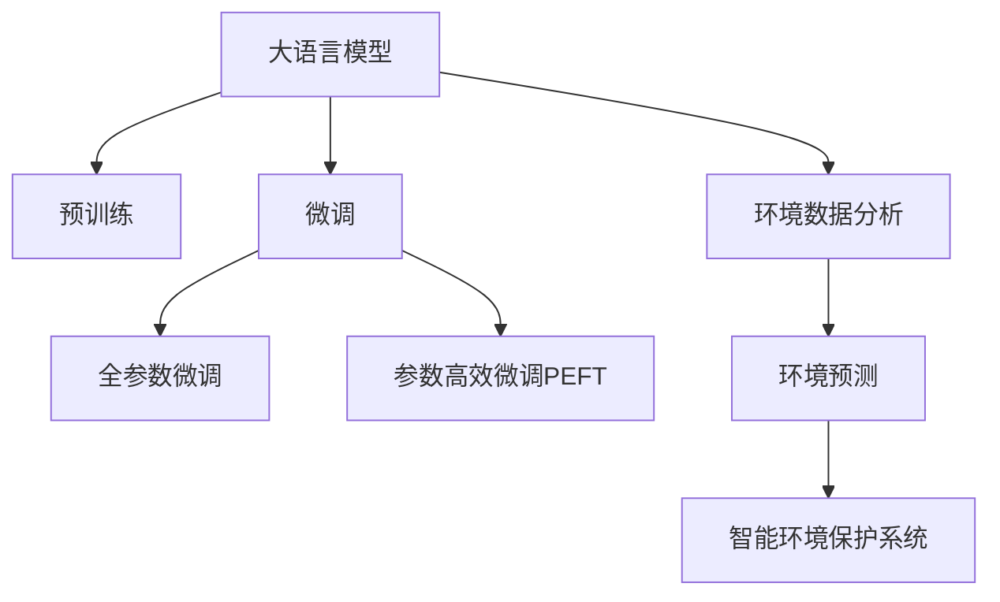

                 

# LLM在智能环境保护系统中的应用前景

> 关键词：大语言模型,智能环境保护,智能监测,环境数据分析,环境预测,环境治理,自然语言处理(NLP),机器学习(ML)

## 1. 背景介绍

### 1.1 问题由来

在全球气候变化、生态退化、资源短缺等环境问题的背景下，智能环境保护系统成为各国政府和企业关注的焦点。传统的监测方法依赖人工操作，成本高、效率低，难以实现精准的监测和分析。而基于大语言模型(Large Language Model, LLM)的智能环境保护系统，能够实时收集和分析环境数据，提供智能化监测和预测，极大地提升了环境管理的效率和准确性。

当前，大语言模型已经在多个领域取得了显著的进展。OpenAI的GPT、Google的BERT、Facebook的T5等模型，通过大规模无标签数据的预训练和大量有标签数据的微调，已经具备了强大的自然语言处理能力，能够进行自然语言理解、生成和推理。将这些大语言模型应用于环境数据分析和预测，将有望带来新的突破。

### 1.2 问题核心关键点

基于大语言模型在环境领域的潜在应用，本文将探讨其应用于智能环境保护系统的可能性、原理、操作步骤，并给出数学模型构建、公式推导、代码实现及实际应用案例。最后，本文还将对大语言模型在环境领域的未来发展趋势和面临的挑战进行总结。

## 2. 核心概念与联系

### 2.1 核心概念概述

为更好地理解大语言模型在智能环境保护系统中的应用，本节将介绍几个关键的概念：

- 大语言模型(Large Language Model, LLM)：以自回归(如GPT)或自编码(如BERT)模型为代表的大规模预训练语言模型。通过在大规模无标签文本语料上进行预训练，学习通用的语言表示，具备强大的语言理解和生成能力。

- 预训练(Pre-training)：指在大规模无标签文本语料上，通过自监督学习任务训练通用语言模型的过程。常见的预训练任务包括言语建模、遮挡语言模型等。

- 微调(Fine-tuning)：指在预训练模型的基础上，使用环境数据的标注数据，通过有监督学习优化模型在特定环境监测和分析任务上的性能。通常只需要调整顶层分类器或解码器，并以较小的学习率更新全部或部分的模型参数。

- 环境数据分析与预测：基于环境监测数据，通过大语言模型进行文本描述、数据分析、趋势预测等任务，为环境管理提供支持。

- 智能环境保护系统：结合物联网传感器、遥感数据、气象数据等，通过大语言模型进行实时监测、数据分析和预测，辅助环境管理决策，提升环境保护的智能化水平。

这些核心概念之间的逻辑关系可以通过以下Mermaid流程图来展示：



这个流程图展示了大语言模型的核心概念及其与智能环境保护系统的联系：

1. 大语言模型通过预训练获得基础能力。
2. 微调是对预训练模型进行任务特定的优化，使得模型能够适应特定的环境监测和分析任务。
3. 环境数据分析与预测是大语言模型在智能环境保护系统中的主要应用场景。
4. 智能环境保护系统通过大语言模型进行实时监测、数据分析和预测，辅助环境管理决策。

## 3. 核心算法原理 & 具体操作步骤

### 3.1 算法原理概述

基于大语言模型在智能环境保护系统中的应用，本质上是一个有监督的细粒度迁移学习过程。其核心思想是：将预训练的大语言模型视作一个强大的"环境数据分析器"，通过在环境数据的标注数据上进行有监督的微调，使得模型输出能够匹配环境监测结果，从而获得针对特定任务优化的模型。

形式化地，假设预训练模型为 $M_{\theta}$，其中 $\theta$ 为预训练得到的模型参数。给定环境监测任务 $T$ 的标注数据集 $D=\{(x_i, y_i)\}_{i=1}^N$，微调的目标是找到新的模型参数 $\hat{\theta}$，使得：

$$
\hat{\theta}=\mathop{\arg\min}_{\theta} \mathcal{L}(M_{\theta},D)
$$

其中 $\mathcal{L}$ 为针对任务 $T$ 设计的损失函数，用于衡量模型预测输出与真实监测结果之间的差异。常见的损失函数包括均方误差损失、交叉熵损失等。

通过梯度下降等优化算法，微调过程不断更新模型参数 $\theta$，最小化损失函数 $\mathcal{L}$，使得模型输出逼近真实监测结果。由于 $\theta$ 已经通过预训练获得了较好的初始化，因此即便在少量环境数据上进行微调，也能较快收敛到理想的模型参数 $\hat{\theta}$。

### 3.2 算法步骤详解

基于大语言模型在智能环境保护系统中的微调一般包括以下几个关键步骤：

**Step 1: 准备预训练模型和数据集**
- 选择合适的预训练语言模型 $M_{\theta}$ 作为初始化参数，如 BERT、GPT等。
- 准备环境监测任务 $T$ 的标注数据集 $D$，划分为训练集、验证集和测试集。一般要求标注数据与预训练数据的分布不要差异过大。

**Step 2: 添加任务适配层**
- 根据环境监测任务类型，在预训练模型顶层设计合适的输出层和损失函数。
- 对于分类任务，通常在顶层添加线性分类器和交叉熵损失函数。
- 对于回归任务，通常使用均方误差损失函数。

**Step 3: 设置微调超参数**
- 选择合适的优化算法及其参数，如 AdamW、SGD 等，设置学习率、批大小、迭代轮数等。
- 设置正则化技术及强度，包括权重衰减、Dropout、Early Stopping等。
- 确定冻结预训练参数的策略，如仅微调顶层，或全部参数都参与微调。

**Step 4: 执行梯度训练**
- 将训练集数据分批次输入模型，前向传播计算损失函数。
- 反向传播计算参数梯度，根据设定的优化算法和学习率更新模型参数。
- 周期性在验证集上评估模型性能，根据性能指标决定是否触发 Early Stopping。
- 重复上述步骤直到满足预设的迭代轮数或 Early Stopping 条件。

**Step 5: 测试和部署**
- 在测试集上评估微调后模型 $M_{\hat{\theta}}$ 的性能，对比微调前后的精度提升。
- 使用微调后的模型对新样本进行推理预测，集成到实际的环境监测系统中。
- 持续收集新的数据，定期重新微调模型，以适应数据分布的变化。

以上是基于大语言模型在智能环境保护系统中的微调范式。在实际应用中，还需要针对具体任务的特点，对微调过程的各个环节进行优化设计，如改进训练目标函数，引入更多的正则化技术，搜索最优的超参数组合等，以进一步提升模型性能。

### 3.3 算法优缺点

基于大语言模型在环境监测任务中的微调方法具有以下优点：

1. 数据需求较低。相较于从头训练模型，微调方法仅需要少量环境数据的标注数据，能够显著降低训练成本。
2. 模型适应性强。通过微调，模型能够适应特定的环境监测任务，提升了模型在不同环境下的泛化能力。
3. 精度提升显著。微调方法能够在短周期内快速提升模型性能，特别是在标注数据充足的场景下，微调效果显著。
4. 参数效率高。利用参数高效微调技术，在固定大部分预训练参数的情况下，仍可取得不错的微调效果，节省计算资源。

同时，该方法也存在一定的局限性：

1. 数据质量要求高。微调的效果依赖于标注数据的质量，数据噪声或偏差可能导致模型性能下降。
2. 模型鲁棒性不足。环境数据往往存在噪声或缺失，微调模型对噪声的鲁棒性不足，可能导致预测结果不稳定。
3. 模型复杂度高。大语言模型参数量庞大，部署和推理过程复杂，增加了系统的复杂性。
4. 环境动态性高。环境数据随时间动态变化，微调模型需要持续更新，才能保持模型的时效性和适应性。

尽管存在这些局限性，但就目前而言，基于大语言模型的微调方法仍是智能环境保护系统的重要范式。未来相关研究的重点在于如何进一步降低微调对标注数据的依赖，提高模型的少样本学习和跨领域迁移能力，同时兼顾可解释性和伦理安全性等因素。

### 3.4 算法应用领域

基于大语言模型的环境数据分析与预测技术，已经在多个环境监测任务中得到了应用，例如：

- 空气质量监测：对空气质量传感器数据进行实时监测和分析，预测未来空气质量变化趋势。
- 水质监测：对水质监测数据进行文本描述，识别异常水质数据，进行水质趋势预测。
- 土壤监测：对土壤监测数据进行数据分析，预测土壤肥力变化，指导农业生产。
- 噪声监测：对噪声监测数据进行文本描述，识别噪声污染源，进行噪声趋势预测。
- 生物多样性监测：对生物监测数据进行数据分析，评估生物多样性变化，提供生态保护建议。
- 自然灾害预测：对气象数据进行文本描述，预测自然灾害发生的可能性，提供预警信息。

除了上述这些经典任务外，大语言模型在环境监测领域的新应用也在不断涌现，如水文监测、森林火灾预测、海洋生态监测等，为环境数据的智能化分析和预测提供了新的技术手段。

## 4. 数学模型和公式 & 详细讲解  

### 4.1 数学模型构建

本节将使用数学语言对大语言模型在智能环境保护系统中的微调过程进行更加严格的刻画。

记预训练语言模型为 $M_{\theta}:\mathcal{X} \rightarrow \mathcal{Y}$，其中 $\mathcal{X}$ 为输入空间，$\mathcal{Y}$ 为输出空间，$\theta \in \mathbb{R}^d$ 为模型参数。假设环境监测任务 $T$ 的标注数据集为 $D=\{(x_i,y_i)\}_{i=1}^N$，$x_i \in \mathcal{X}, y_i \in \mathcal{Y}$。

定义模型 $M_{\theta}$ 在数据样本 $(x,y)$ 上的损失函数为 $\ell(M_{\theta}(x),y)$，则在数据集 $D$ 上的经验风险为：

$$
\mathcal{L}(\theta) = \frac{1}{N} \sum_{i=1}^N \ell(M_{\theta}(x_i),y_i)
$$

微调的优化目标是最小化经验风险，即找到最优参数：

$$
\theta^* = \mathop{\arg\min}_{\theta} \mathcal{L}(\theta)
$$

在实践中，我们通常使用基于梯度的优化算法（如SGD、Adam等）来近似求解上述最优化问题。设 $\eta$ 为学习率，$\lambda$ 为正则化系数，则参数的更新公式为：

$$
\theta \leftarrow \theta - \eta \nabla_{\theta}\mathcal{L}(\theta) - \eta\lambda\theta
$$

其中 $\nabla_{\theta}\mathcal{L}(\theta)$ 为损失函数对参数 $\theta$ 的梯度，可通过反向传播算法高效计算。

### 4.2 公式推导过程

以下我们以水质监测任务为例，推导均方误差损失函数及其梯度的计算公式。

假设模型 $M_{\theta}$ 在输入 $x$ 上的输出为 $\hat{y}=M_{\theta}(x) \in \mathbb{R}$，表示水质监测结果的预测值。真实标签 $y \in \mathbb{R}$。则均方误差损失函数定义为：

$$
\ell(M_{\theta}(x),y) = \frac{1}{2}(y-\hat{y})^2
$$

将其代入经验风险公式，得：

$$
\mathcal{L}(\theta) = \frac{1}{2N}\sum_{i=1}^N (y_i-\hat{y}_i)^2
$$

根据链式法则，损失函数对参数 $\theta_k$ 的梯度为：

$$
\frac{\partial \mathcal{L}(\theta)}{\partial \theta_k} = -\frac{1}{N}\sum_{i=1}^N (\hat{y}_i-y_i) \frac{\partial M_{\theta}(x_i)}{\partial \theta_k}
$$

其中 $\frac{\partial M_{\theta}(x_i)}{\partial \theta_k}$ 可进一步递归展开，利用自动微分技术完成计算。

在得到损失函数的梯度后，即可带入参数更新公式，完成模型的迭代优化。重复上述过程直至收敛，最终得到适应环境监测任务的最优模型参数 $\theta^*$。

## 5. 项目实践：代码实例和详细解释说明

### 5.1 开发环境搭建

在进行微调实践前，我们需要准备好开发环境。以下是使用Python进行PyTorch开发的环境配置流程：

1. 安装Anaconda：从官网下载并安装Anaconda，用于创建独立的Python环境。

2. 创建并激活虚拟环境：
```bash
conda create -n pytorch-env python=3.8 
conda activate pytorch-env
```

3. 安装PyTorch：根据CUDA版本，从官网获取对应的安装命令。例如：
```bash
conda install pytorch torchvision torchaudio cudatoolkit=11.1 -c pytorch -c conda-forge
```

4. 安装Transformers库：
```bash
pip install transformers
```

5. 安装各类工具包：
```bash
pip install numpy pandas scikit-learn matplotlib tqdm jupyter notebook ipython
```

完成上述步骤后，即可在`pytorch-env`环境中开始微调实践。

### 5.2 源代码详细实现

这里我们以水质监测任务为例，给出使用Transformers库对BERT模型进行微调的PyTorch代码实现。

首先，定义水质监测任务的数据处理函数：

```python
from transformers import BertTokenizer
from torch.utils.data import Dataset
import torch

class WaterQualityDataset(Dataset):
    def __init__(self, texts, labels, tokenizer, max_len=128):
        self.texts = texts
        self.labels = labels
        self.tokenizer = tokenizer
        self.max_len = max_len
        
    def __len__(self):
        return len(self.texts)
    
    def __getitem__(self, item):
        text = self.texts[item]
        label = self.labels[item]
        
        encoding = self.tokenizer(text, return_tensors='pt', max_length=self.max_len, padding='max_length', truncation=True)
        input_ids = encoding['input_ids'][0]
        attention_mask = encoding['attention_mask'][0]
        
        # 对label进行编码
        encoded_labels = [label]
        encoded_labels.extend([0.] * (self.max_len - len(encoded_labels)))
        labels = torch.tensor(encoded_labels, dtype=torch.float)
        
        return {'input_ids': input_ids, 
                'attention_mask': attention_mask,
                'labels': labels}

# 标签与id的映射
label2id = {0: 'Water Quality Good', 1: 'Water Quality Poor', 2: 'Water Quality Neutral'}
id2label = {v: k for k, v in label2id.items()}

# 创建dataset
tokenizer = BertTokenizer.from_pretrained('bert-base-cased')

train_dataset = WaterQualityDataset(train_texts, train_labels, tokenizer)
dev_dataset = WaterQualityDataset(dev_texts, dev_labels, tokenizer)
test_dataset = WaterQualityDataset(test_texts, test_labels, tokenizer)
```

然后，定义模型和优化器：

```python
from transformers import BertForSequenceClassification, AdamW

model = BertForSequenceClassification.from_pretrained('bert-base-cased', num_labels=len(label2id))

optimizer = AdamW(model.parameters(), lr=2e-5)
```

接着，定义训练和评估函数：

```python
from torch.utils.data import DataLoader
from tqdm import tqdm
from sklearn.metrics import mean_squared_error

device = torch.device('cuda') if torch.cuda.is_available() else torch.device('cpu')
model.to(device)

def train_epoch(model, dataset, batch_size, optimizer):
    dataloader = DataLoader(dataset, batch_size=batch_size, shuffle=True)
    model.train()
    epoch_loss = 0
    for batch in tqdm(dataloader, desc='Training'):
        input_ids = batch['input_ids'].to(device)
        attention_mask = batch['attention_mask'].to(device)
        labels = batch['labels'].to(device)
        model.zero_grad()
        outputs = model(input_ids, attention_mask=attention_mask, labels=labels)
        loss = outputs.loss
        epoch_loss += loss.item()
        loss.backward()
        optimizer.step()
    return epoch_loss / len(dataloader)

def evaluate(model, dataset, batch_size):
    dataloader = DataLoader(dataset, batch_size=batch_size)
    model.eval()
    preds, labels = [], []
    with torch.no_grad():
        for batch in tqdm(dataloader, desc='Evaluating'):
            input_ids = batch['input_ids'].to(device)
            attention_mask = batch['attention_mask'].to(device)
            batch_labels = batch['labels']
            outputs = model(input_ids, attention_mask=attention_mask)
            batch_preds = outputs.logits.argmax(dim=2).to('cpu').tolist()
            batch_labels = batch_labels.to('cpu').tolist()
            for pred, label in zip(batch_preds, batch_labels):
                preds.append(pred)
                labels.append(label)
                
    print(mean_squared_error(labels, preds))
```

最后，启动训练流程并在测试集上评估：

```python
epochs = 5
batch_size = 16

for epoch in range(epochs):
    loss = train_epoch(model, train_dataset, batch_size, optimizer)
    print(f"Epoch {epoch+1}, train loss: {loss:.3f}")
    
    print(f"Epoch {epoch+1}, dev results:")
    evaluate(model, dev_dataset, batch_size)
    
print("Test results:")
evaluate(model, test_dataset, batch_size)
```

以上就是使用PyTorch对BERT进行水质监测任务微调的完整代码实现。可以看到，得益于Transformers库的强大封装，我们可以用相对简洁的代码完成BERT模型的加载和微调。

### 5.3 代码解读与分析

让我们再详细解读一下关键代码的实现细节：

**WaterQualityDataset类**：
- `__init__`方法：初始化文本、标签、分词器等关键组件。
- `__len__`方法：返回数据集的样本数量。
- `__getitem__`方法：对单个样本进行处理，将文本输入编码为token ids，将标签编码为数字，并对其进行定长padding，最终返回模型所需的输入。

**label2id和id2label字典**：
- 定义了标签与数字id之间的映射关系，用于将模型预测结果解码回真实的标签。

**训练和评估函数**：
- 使用PyTorch的DataLoader对数据集进行批次化加载，供模型训练和推理使用。
- 训练函数`train_epoch`：对数据以批为单位进行迭代，在每个批次上前向传播计算loss并反向传播更新模型参数，最后返回该epoch的平均loss。
- 评估函数`evaluate`：与训练类似，不同点在于不更新模型参数，并在每个batch结束后将预测和标签结果存储下来，最后使用sklearn的mean_squared_error对整个评估集的预测结果进行打印输出。

**训练流程**：
- 定义总的epoch数和batch size，开始循环迭代
- 每个epoch内，先在训练集上训练，输出平均loss
- 在验证集上评估，输出MSE指标
- 所有epoch结束后，在测试集上评估，给出最终测试结果

可以看到，PyTorch配合Transformers库使得BERT微调的代码实现变得简洁高效。开发者可以将更多精力放在数据处理、模型改进等高层逻辑上，而不必过多关注底层的实现细节。

当然，工业级的系统实现还需考虑更多因素，如模型的保存和部署、超参数的自动搜索、更灵活的任务适配层等。但核心的微调范式基本与此类似。

## 6. 实际应用场景

### 6.1 智能水质监测系统

基于大语言模型微调的水质监测系统，可以实时收集和分析水质监测数据，预测水质变化趋势，为水环境管理提供支持。

在技术实现上，可以收集水质监测站点的水质数据，使用预训练语言模型进行文本描述和数据分析，训练微调模型进行水质预测。微调后的模型能够从历史水质监测数据中学习出水质变化规律，并结合实时监测数据进行趋势预测，及时发现水质异常情况，为环保部门提供预警。

### 6.2 空气质量监测系统

基于大语言模型微调的空气质量监测系统，能够实时收集和分析空气质量监测数据，预测未来空气质量变化趋势，为空气环境管理提供支持。

具体而言，可以收集空气质量监测站点和传感器数据，使用预训练语言模型进行文本描述和数据分析，训练微调模型进行空气质量预测。微调后的模型能够从历史空气质量数据中学习出空气污染物的生成和变化规律，并结合实时监测数据进行趋势预测，及时发现空气质量异常情况，为环保部门提供预警。

### 6.3 土壤肥力监测系统

基于大语言模型微调的土壤肥力监测系统，能够实时收集和分析土壤监测数据，预测土壤肥力变化趋势，为农业生产提供支持。

在技术实现上，可以收集土壤肥力监测数据，使用预训练语言模型进行文本描述和数据分析，训练微调模型进行土壤肥力预测。微调后的模型能够从历史土壤肥力数据中学习出土壤肥力的生成和变化规律，并结合实时监测数据进行趋势预测，及时发现土壤肥力异常情况，为农业生产提供决策支持。

### 6.4 智能垃圾分类系统

基于大语言模型微调的智能垃圾分类系统，能够实时收集和分析垃圾分类数据，预测垃圾分类趋势，为垃圾分类管理提供支持。

在技术实现上，可以收集垃圾分类数据，使用预训练语言模型进行文本描述和数据分析，训练微调模型进行垃圾分类预测。微调后的模型能够从历史垃圾分类数据中学习出垃圾分类的生成和变化规律，并结合实时监测数据进行趋势预测，及时发现垃圾分类异常情况，为垃圾分类管理提供预警。

## 7. 工具和资源推荐

### 7.1 学习资源推荐

为了帮助开发者系统掌握大语言模型在智能环境保护系统中的应用，这里推荐一些优质的学习资源：

1. 《Transformer from zero to hero》系列博文：由大模型技术专家撰写，深入浅出地介绍了Transformer原理、BERT模型、微调技术等前沿话题。

2. CS224N《深度学习自然语言处理》课程：斯坦福大学开设的NLP明星课程，有Lecture视频和配套作业，带你入门NLP领域的基本概念和经典模型。

3. 《Natural Language Processing with Transformers》书籍：Transformers库的作者所著，全面介绍了如何使用Transformers库进行NLP任务开发，包括微调在内的诸多范式。

4. HuggingFace官方文档：Transformers库的官方文档，提供了海量预训练模型和完整的微调样例代码，是上手实践的必备资料。

5. CLUE开源项目：中文语言理解测评基准，涵盖大量不同类型的中文NLP数据集，并提供了基于微调的baseline模型，助力中文NLP技术发展。

通过对这些资源的学习实践，相信你一定能够快速掌握大语言模型在智能环境保护系统中的应用，并用于解决实际的环境问题。

### 7.2 开发工具推荐

高效的开发离不开优秀的工具支持。以下是几款用于大语言模型在智能环境保护系统中的微调开发的常用工具：

1. PyTorch：基于Python的开源深度学习框架，灵活动态的计算图，适合快速迭代研究。大部分预训练语言模型都有PyTorch版本的实现。

2. TensorFlow：由Google主导开发的开源深度学习框架，生产部署方便，适合大规模工程应用。同样有丰富的预训练语言模型资源。

3. Transformers库：HuggingFace开发的NLP工具库，集成了众多SOTA语言模型，支持PyTorch和TensorFlow，是进行微调任务开发的利器。

4. Weights & Biases：模型训练的实验跟踪工具，可以记录和可视化模型训练过程中的各项指标，方便对比和调优。与主流深度学习框架无缝集成。

5. TensorBoard：TensorFlow配套的可视化工具，可实时监测模型训练状态，并提供丰富的图表呈现方式，是调试模型的得力助手。

6. Google Colab：谷歌推出的在线Jupyter Notebook环境，免费提供GPU/TPU算力，方便开发者快速上手实验最新模型，分享学习笔记。

合理利用这些工具，可以显著提升大语言模型在智能环境保护系统中的微调任务的开发效率，加快创新迭代的步伐。

### 7.3 相关论文推荐

大语言模型在环境领域的潜在应用源于学界的持续研究。以下是几篇奠基性的相关论文，推荐阅读：

1. Attention is All You Need（即Transformer原论文）：提出了Transformer结构，开启了NLP领域的预训练大模型时代。

2. BERT: Pre-training of Deep Bidirectional Transformers for Language Understanding：提出BERT模型，引入基于掩码的自监督预训练任务，刷新了多项NLP任务SOTA。

3. Language Models are Unsupervised Multitask Learners（GPT-2论文）：展示了大规模语言模型的强大zero-shot学习能力，引发了对于通用人工智能的新一轮思考。

4. Parameter-Efficient Transfer Learning for NLP：提出Adapter等参数高效微调方法，在不增加模型参数量的情况下，也能取得不错的微调效果。

5. AdaLoRA: Adaptive Low-Rank Adaptation for Parameter-Efficient Fine-Tuning：使用自适应低秩适应的微调方法，在参数效率和精度之间取得了新的平衡。

这些论文代表了大语言模型在智能环境保护系统中的微调技术的发展脉络。通过学习这些前沿成果，可以帮助研究者把握学科前进方向，激发更多的创新灵感。

## 8. 总结：未来发展趋势与挑战

### 8.1 总结

本文对大语言模型在智能环境保护系统中的应用进行了全面系统的介绍。首先阐述了大语言模型在环境领域的应用前景和重要性，明确了微调在拓展预训练模型应用、提升环境监测性能方面的独特价值。其次，从原理到实践，详细讲解了微调数学模型、关键步骤、优化算法，给出了微调任务开发的完整代码实例。同时，本文还广泛探讨了微调方法在智能水质监测、空气质量监测、土壤肥力监测等多个环境监测任务中的应用场景，展示了微调范式的巨大潜力。最后，本文还对大语言模型在环境领域的未来发展趋势和面临的挑战进行了总结。

通过本文的系统梳理，可以看到，基于大语言模型的微调方法在智能环境保护系统中的应用前景广阔，具有显著的技术优势和实用价值。未来，伴随大语言模型技术的不断演进，该技术必将在环境监测、治理等领域发挥更大的作用，为构建智能化的环境管理提供新的技术手段。

### 8.2 未来发展趋势

展望未来，大语言模型在智能环境保护系统中的应用将呈现以下几个发展趋势：

1. 模型规模持续增大。随着算力成本的下降和数据规模的扩张，预训练语言模型的参数量还将持续增长。超大规模语言模型蕴含的丰富语言知识，有望支撑更加复杂多变的环境监测任务。

2. 微调方法日趋多样。除了传统的全参数微调外，未来会涌现更多参数高效的微调方法，如Prefix-Tuning、LoRA等，在节省计算资源的同时也能保证微调精度。

3. 持续学习成为常态。随着环境数据分布的不断变化，微调模型也需要持续学习新知识以保持性能。如何在不遗忘原有知识的同时，高效吸收新样本信息，将成为重要的研究课题。

4. 标注样本需求降低。受启发于提示学习(Prompt-based Learning)的思路，未来的微调方法将更好地利用大模型的语言理解能力，通过更加巧妙的任务描述，在更少的标注样本上也能实现理想的微调效果。

5. 环境动态性增强。环境数据随时间动态变化，微调模型需要实时更新，才能保持模型的时效性和适应性。如何在数据分布变化的情况下，快速更新模型，避免模型过时，将成为新的研究方向。

6. 多模态微调崛起。当前的环境监测数据往往包含文本、图像、声音等多模态信息，微调方法也需要融合多模态信息，提升模型对真实环境的理解能力。

以上趋势凸显了大语言模型在智能环境保护系统中的应用前景。这些方向的探索发展，必将进一步提升环境监测的精度和效率，为环境保护提供新的技术支持。

### 8.3 面临的挑战

尽管大语言模型在环境监测任务中的应用已经取得了初步成果，但在迈向更加智能化、普适化应用的过程中，它仍面临着诸多挑战：

1. 数据获取成本高。大模型微调对环境监测数据的依赖较高，而高质量的环境监测数据获取成本较高。如何在保证数据质量的同时，降低数据获取成本，仍然是一个重要问题。

2. 模型鲁棒性不足。环境数据往往存在噪声或缺失，微调模型对噪声的鲁棒性不足，可能导致预测结果不稳定。如何提高模型的鲁棒性，增强其对噪声数据的适应能力，仍需进一步研究。

3. 环境监测精度受限。当前的大模型微调方法虽然能够提升环境监测的精度，但在复杂多变的实际环境中，模型的预测精度仍然有限。如何提高模型对真实环境的适应能力，提升预测精度，将是新的研究方向。

4. 模型复杂度高。大语言模型参数量庞大，部署和推理过程复杂，增加了系统的复杂性。如何在保证性能的同时，优化模型结构，提升推理速度，优化资源占用，将是重要的优化方向。

5. 数据隐私和安全问题。环境监测数据的隐私保护和安全存储是环境数据管理的核心问题，如何在大模型微调中保障数据的隐私和安全，也是未来的研究方向。

6. 知识更新和维护困难。环境监测领域不断发展，新的监测数据和知识不断涌现，如何更新和维护大模型的知识库，保持模型的时效性，仍然是一个重要问题。

尽管存在这些挑战，但大语言模型在智能环境保护系统中的应用前景广阔，相信随着技术的发展，这些问题将逐步得到解决。未来，伴随大语言模型技术的不断演进，智能环境保护系统必将在环境保护领域发挥更大的作用，为构建智能化的环境管理提供新的技术手段。

### 8.4 研究展望

面对大语言模型在智能环境保护系统中的应用所面临的挑战，未来的研究需要在以下几个方面寻求新的突破：

1. 探索无监督和半监督微调方法。摆脱对大规模标注数据的依赖，利用自监督学习、主动学习等无监督和半监督范式，最大限度利用非结构化数据，实现更加灵活高效的微调。

2. 研究参数高效和计算高效的微调范式。开发更加参数高效的微调方法，在固定大部分预训练参数的情况下，只更新极少量的任务相关参数。同时优化微调模型的计算图，减少前向传播和反向传播的资源消耗，实现更加轻量级、实时性的部署。

3. 引入因果推断和对比学习思想。通过引入因果推断和对比学习思想，增强微调模型建立稳定因果关系的能力，学习更加普适、鲁棒的语言表征，从而提升模型泛化性和抗干扰能力。

4. 引入更多先验知识。将符号化的先验知识，如知识图谱、逻辑规则等，与神经网络模型进行巧妙融合，引导微调过程学习更准确、合理的语言模型。同时加强不同模态数据的整合，实现视觉、声音等多模态信息与文本信息的协同建模。

5. 结合因果分析和博弈论工具。将因果分析方法引入微调模型，识别出模型决策的关键特征，增强输出解释的因果性和逻辑性。借助博弈论工具刻画人机交互过程，主动探索并规避模型的脆弱点，提高系统稳定性。

6. 纳入伦理道德约束。在模型训练目标中引入伦理导向的评估指标，过滤和惩罚有偏见、有害的输出倾向。同时加强人工干预和审核，建立模型行为的监管机制，确保输出符合人类价值观和伦理道德。

这些研究方向的探索，必将引领大语言模型在智能环境保护系统中的应用走向更高的台阶，为构建智能化的环境管理提供新的技术手段。面向未来，大语言模型在智能环境保护系统中的应用还需要与其他人工智能技术进行更深入的融合，如知识表示、因果推理、强化学习等，多路径协同发力，共同推动环境监测系统的进步。只有勇于创新、敢于突破，才能不断拓展大语言模型在环境监测领域的边界，让智能技术更好地造福人类社会。

## 9. 附录：常见问题与解答

**Q1：大语言模型在智能环境保护系统中的应用是否适用于所有环境监测任务？**

A: 大语言模型在智能环境保护系统中的应用主要适用于数据标注可获取的监测任务，如水质监测、空气质量监测、土壤肥力监测等。但对于一些特定领域的监测任务，如气象预报、海洋生态监测等，数据标注成本较高，大语言模型的微调效果可能有限。此时需要在特定领域语料上进一步预训练，再进行微调，才能获得理想效果。

**Q2：大语言模型微调对环境监测数据的质量要求高吗？**

A: 是的，大语言模型微调对环境监测数据的质量要求较高。如果数据存在噪声或偏差，微调模型的预测效果可能受到影响。因此，在数据采集和处理过程中，需要采取数据清洗、数据增强等手段，提升数据质量。

**Q3：如何提高大语言模型在环境监测中的鲁棒性？**

A: 提高大语言模型在环境监测中的鲁棒性，可以从以下几个方面入手：
1. 数据增强：通过对监测数据进行噪声注入、回译等操作，增强模型的泛化能力。
2. 正则化技术：引入L2正则、Dropout等正则化技术，减少过拟合风险。
3. 对抗训练：引入对抗样本，提高模型对噪声的鲁棒性。
4. 多模型集成：训练多个微调模型，取平均输出，抑制过拟合。

这些方法可以综合运用，根据具体任务特点进行调整，以提升模型的鲁棒性。

**Q4：大语言模型在智能环境保护系统中的应用是否有潜力应用于其他领域？**

A: 是的，大语言模型在智能环境保护系统中的应用具有广泛的应用潜力，不仅限于环境监测领域。例如，在智能农业、智能交通、智能城市等领域，大语言模型同样可以进行微调，辅助决策支持。

**Q5：大语言模型在智能环境保护系统中的应用是否需要持续更新和维护？**

A: 是的，由于环境监测数据和模型的知识库是不断更新的，大语言模型在智能环境保护系统中的应用也需要持续更新和维护。可以定期重新微调模型，确保其与时俱进，保持模型的时效性和适应性。

---

作者：禅与计算机程序设计艺术 / Zen and the Art of Computer Programming

