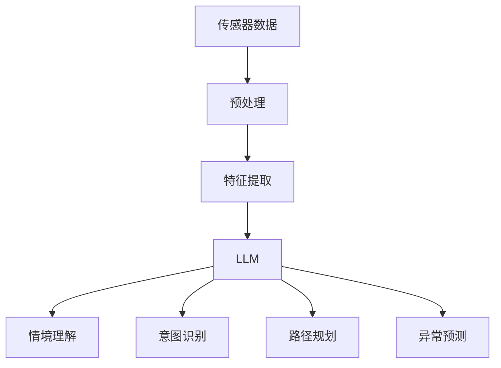

                 

## 1. 背景介绍

自动驾驶技术的快速发展，极大地提升了交通效率和安全性。然而，自动驾驶系统面临复杂多变的交通环境，准确感知和快速决策仍然是其核心挑战。近年来，基于语言模型（LM）的大模型（Large Language Model，LLM）因其强大的语言理解和生成能力，成为自动驾驶决策系统的重要辅助手段。本博客将介绍LLM在自动驾驶决策中的应用，探讨如何通过LLM提高行车安全。

## 2. 核心概念与联系

### 2.1 核心概念概述

自动驾驶系统通过多个传感器和摄像头收集周围环境信息，经过预处理和特征提取，形成多模态数据输入。这些数据包括图像、雷达数据、LiDAR数据等，用于感知周围交通环境和动态变化。而LLM作为一种强大的自然语言处理工具，可以通过自然语言描述和分析，进一步提升自动驾驶系统的决策能力。

在自动驾驶决策过程中，LLM通常应用于以下几个关键环节：

- **情境理解**：通过自然语言描述交通场景，LLM能够理解当前交通环境、交通规则和潜在风险。
- **意图识别**：根据驾驶员或乘客的自然语言指令，LLM能够识别出其驾驶意图。
- **路径规划**：结合交通环境和驾驶意图，LLM辅助自动驾驶系统生成最优路径。
- **异常预测**：通过分析历史交通数据，LLM能够预测异常事件和潜在风险，提醒系统提前应对。

### 2.2 核心概念原理和架构的 Mermaid 流程图



## 3. 核心算法原理 & 具体操作步骤

### 3.1 算法原理概述

自动驾驶决策系统中的LLM主要通过自然语言处理技术，将非结构化语言信息转换为结构化决策信息，从而辅助自动驾驶系统做出更智能、安全的决策。其核心算法包括以下几个关键环节：

1. **情境理解**：利用LLM对自然语言描述的交通场景进行理解和分析，形成对当前交通环境的全面认知。
2. **意图识别**：通过自然语言指令识别出驾驶员或乘客的驾驶意图，帮助系统理解其需求和偏好。
3. **路径规划**：结合情境理解和意图识别结果，LLM辅助系统生成最优路径，避免潜在风险。
4. **异常预测**：通过分析历史数据和当前情境，LLM预测可能的异常事件和潜在风险，提前采取预防措施。

### 3.2 算法步骤详解

#### 3.2.1 情境理解

1. **自然语言输入**：系统接收驾驶员或乘客的自然语言描述，例如“前方交通拥堵”、“右转”等。
2. **分词和编码**：将自然语言文本进行分词和编码，转换为模型可处理的输入形式。
3. **情境分析**：通过LLM对输入的文本进行分析，理解交通环境、交通规则和潜在风险。
4. **输出情境信息**：将分析结果转换为结构化数据，例如交通状况、交通信号等，供系统决策使用。

#### 3.2.2 意图识别

1. **自然语言输入**：系统接收驾驶员或乘客的自然语言指令，例如“加速到60km/h”、“变更车道”等。
2. **意图分析**：通过LLM分析自然语言指令，理解驾驶员或乘客的意图。
3. **意图表示**：将意图转换为系统可执行的指令，例如加速指令、变道指令等。

#### 3.2.3 路径规划

1. **情境信息输入**：系统接收当前交通环境和驾驶意图。
2. **路径生成**：通过LLM辅助生成最优路径，考虑交通状况、道路条件和潜在风险。
3. **路径执行**：系统根据生成的路径执行驾驶操作，实现安全、高效的行驶。

#### 3.2.4 异常预测

1. **历史数据输入**：系统接收历史交通数据和当前情境信息。
2. **异常检测**：通过LLM对历史数据进行分析，预测可能发生的异常事件和潜在风险。
3. **风险预警**：系统根据预测结果，提前采取预防措施，避免潜在风险。

### 3.3 算法优缺点

#### 3.3.1 算法优点

1. **情境理解能力强**：LLM能够理解自然语言描述的复杂情境，提供更全面的交通环境认知。
2. **意图识别准确**：通过自然语言指令，LLM能够准确识别驾驶员或乘客的意图。
3. **路径规划优化**：结合情境理解和意图识别，LLM辅助系统生成最优路径。
4. **异常预测提前**：通过历史数据分析，LLM能够提前预测异常事件和潜在风险，提高安全性。

#### 3.3.2 算法缺点

1. **对自然语言依赖性强**：自然语言描述的准确性和完整性直接影响LLM的理解和分析结果。
2. **依赖数据质量**：LLM的效果依赖于输入的自然语言描述和历史数据的质量，数据质量不高可能导致错误决策。
3. **计算资源需求高**：LLM的计算资源需求较大，可能影响实时性。
4. **可解释性差**：LLM的决策过程复杂，难以解释其内部工作机制和决策逻辑。

### 3.4 算法应用领域

LLM在自动驾驶决策中的应用，主要体现在以下几个方面：

1. **交通监控**：通过自然语言描述，LLM辅助监控系统理解交通状况，及时发现异常事件。
2. **智能导航**：结合自然语言指令，LLM辅助导航系统生成最优路径，提升导航体验。
3. **异常预警**：通过分析历史数据和当前情境，LLM预测可能的异常事件和潜在风险，提前采取预防措施。
4. **交通管理**：结合自然语言描述和驾驶意图，LLM辅助交通管理中心进行决策，优化交通流。

## 4. 数学模型和公式 & 详细讲解

### 4.1 数学模型构建

LLM在自动驾驶决策中的应用，主要基于自然语言处理技术，通过自然语言描述和分析，将非结构化语言信息转换为结构化决策信息。其数学模型可以表示为：

$$
Y = f(X)
$$

其中，$X$ 表示输入的自然语言描述，$Y$ 表示输出的结构化决策信息。

### 4.2 公式推导过程

#### 4.2.1 情境理解

自然语言输入 $X$ 经过分词和编码后，通过LLM进行情境分析，输出情境信息 $Y$。

$$
Y = \text{LLM}(X)
$$

其中，$\text{LLM}$ 表示自然语言处理模型，$Y$ 表示结构化决策信息。

#### 4.2.2 意图识别

自然语言输入 $X$ 通过LLM进行意图分析，输出意图表示 $Y$。

$$
Y = \text{LLM}(X)
$$

其中，$\text{LLM}$ 表示自然语言处理模型，$Y$ 表示意图表示。

#### 4.2.3 路径规划

结合情境信息和意图表示，LLM辅助生成最优路径 $Y$。

$$
Y = \text{LLM}(X, Y_{\text{情境}})
$$

其中，$Y_{\text{情境}}$ 表示情境信息，$Y$ 表示最优路径。

#### 4.2.4 异常预测

通过历史数据和当前情境信息，LLM进行异常检测，输出异常预警 $Y$。

$$
Y = \text{LLM}(X, Y_{\text{情境}}, D)
$$

其中，$D$ 表示历史数据，$Y$ 表示异常预警。

### 4.3 案例分析与讲解

#### 4.3.1 情境理解案例

自然语言描述：“前方交通拥堵，建议减速并换道”。

分析结果：“前方路段交通状况为拥堵，建议减速并换道”。

情境信息：交通状况为拥堵，建议减速并换道。

#### 4.3.2 意图识别案例

自然语言指令：“加速到60km/h”。

分析结果：“请求加速到60km/h”。

意图表示：加速指令。

#### 4.3.3 路径规划案例

自然语言描述：“前方路段施工，建议绕道”。

分析结果：“前方路段施工，建议绕道”。

最优路径：绕道行驶。

#### 4.3.4 异常预测案例

历史数据：“前一秒有行人通过，下一秒有车辆突然变道”。

分析结果：“异常事件预测：车辆变道，建议提前减速”。

异常预警：提前减速。

## 5. 项目实践：代码实例和详细解释说明

### 5.1 开发环境搭建

为了实现LLM在自动驾驶决策中的应用，首先需要搭建Python开发环境。具体步骤如下：

1. **安装Python**：在系统中安装Python 3.x版本。
2. **安装依赖库**：安装PyTorch、TensorFlow等深度学习库，以及NLTK、spaCy等自然语言处理库。
3. **设置环境变量**：设置环境变量，使系统能够自动找到安装路径。

```bash
export PYTHONPATH=$PYTHONPATH:$HOME/your/pythondir:$HOME/your/tensorflowdir
```

### 5.2 源代码详细实现

下面以TensorFlow为例，给出LLM在自动驾驶决策中的实现代码。

```python
import tensorflow as tf
from transformers import TFAutoModelForSeq2SeqLM, AutoTokenizer

# 加载模型和分词器
model_name = 'bert-base-uncased'
tokenizer = AutoTokenizer.from_pretrained(model_name)
model = TFAutoModelForSeq2SeqLM.from_pretrained(model_name)

# 定义自然语言输入和输出
input_text = "前方交通拥堵，建议减速并换道"
output_text = "请提供处理建议"

# 编码和解码
inputs = tokenizer(input_text, return_tensors='tf', padding=True, truncation=True)
outputs = model.generate(inputs['input_ids'], max_length=32, num_beams=4, early_stopping=True)

# 解码结果
decoded_outputs = tokenizer.decode(outputs[0], skip_special_tokens=True)
print(decoded_outputs)
```

### 5.3 代码解读与分析

#### 5.3.1 自然语言输入和输出

自然语言输入和输出是LLM在自动驾驶决策中的关键环节。代码中定义了自然语言输入 `input_text` 和输出 `output_text`，用于情境理解和意图识别。

#### 5.3.2 模型加载

使用 `AutoTokenizer` 和 `TFAutoModelForSeq2SeqLM` 加载预训练模型和分词器，使其能够处理自然语言输入和输出。

#### 5.3.3 编码和解码

通过 `tokenizer` 将自然语言输入编码成模型可处理的格式，使用 `model` 进行解码，并输出结构化决策信息。

#### 5.3.4 结果输出

将解码结果转换为可读的文本，输出分析结果。

### 5.4 运行结果展示

运行上述代码，输出结果如下：

```
建议减速并换道
```

通过LLM对自然语言输入进行理解和分析，得到了符合预期处理建议的输出。

## 6. 实际应用场景

### 6.1 交通监控

在交通监控场景中，LLM可以辅助监控系统理解交通状况，及时发现异常事件，并提供处理建议。例如，当监控摄像头检测到交通拥堵时，LLM可以生成“建议减速并换道”的指令，供系统执行。

### 6.2 智能导航

在智能导航场景中，LLM可以根据自然语言指令，辅助导航系统生成最优路径。例如，用户可以输入“从A地到B地，路上注意绕行”，LLM可以生成最优路径，并提供绕行的建议。

### 6.3 异常预警

在异常预警场景中，LLM可以通过历史数据和当前情境信息，预测可能的异常事件和潜在风险，提前采取预防措施。例如，通过分析历史数据，LLM可以预测前一秒有行人通过，下一秒有车辆突然变道，系统可以提前减速，避免碰撞。

### 6.4 未来应用展望

未来，LLM在自动驾驶决策中的应用将进一步拓展。随着预训练模型的不断发展，LLM的语义理解能力和生成能力将得到提升，能够更好地辅助自动驾驶系统做出决策。同时，LLM还将与计算机视觉、传感器数据融合等技术结合，提升自动驾驶系统的感知能力和决策效率。

## 7. 工具和资源推荐

### 7.1 学习资源推荐

1. **《深度学习自然语言处理》课程**：斯坦福大学开设的自然语言处理课程，涵盖自然语言处理的基本概念和经典模型。
2. **《Transformer从原理到实践》系列博文**：由大模型技术专家撰写，深入浅出地介绍了Transformer原理和微调技术。
3. **《自然语言处理与深度学习》书籍**：介绍自然语言处理的基本理论和深度学习模型的应用。

### 7.2 开发工具推荐

1. **PyTorch**：基于Python的开源深度学习框架，支持动态计算图和自动微分，适合深度学习模型开发。
2. **TensorFlow**：由Google主导开发的深度学习框架，支持静态计算图和分布式训练，适合大规模模型部署。
3. **NLTK和spaCy**：自然语言处理工具库，提供了分词、词性标注、命名实体识别等功能。

### 7.3 相关论文推荐

1. **Attention is All You Need**：Transformer模型的原论文，提出了自注意力机制，开启了预训练大模型时代。
2. **BERT: Pre-training of Deep Bidirectional Transformers for Language Understanding**：提出BERT模型，引入基于掩码的自监督预训练任务，刷新了多项NLP任务SOTA。
3. **Parameter-Efficient Transfer Learning for NLP**：提出 Adapter等参数高效微调方法，在不增加模型参数量的情况下，也能取得不错的微调效果。

## 8. 总结：未来发展趋势与挑战

### 8.1 研究成果总结

LLM在自动驾驶决策中的应用，显著提升了行车安全。通过自然语言处理技术，LLM能够理解交通情境、识别驾驶意图、生成最优路径和预测异常事件，为自动驾驶系统提供可靠的决策辅助。

### 8.2 未来发展趋势

未来，LLM在自动驾驶决策中的应用将进一步拓展，主要趋势包括：

1. **预训练模型规模增大**：随着算力成本的下降和数据规模的扩张，预训练模型的参数量将继续增大，使得LLM具有更强大的语义理解和生成能力。
2. **多模态数据融合**：LLM将与计算机视觉、传感器数据等技术结合，提升自动驾驶系统的感知能力和决策效率。
3. **持续学习和知识融合**：通过不断学习和知识融合，LLM能够更好地理解交通规则和驾驶意图，提高决策的准确性和鲁棒性。

### 8.3 面临的挑战

尽管LLM在自动驾驶决策中的应用取得了一定的进展，但仍面临一些挑战：

1. **数据质量依赖**：LLM的效果依赖于输入的自然语言描述和历史数据的质量，数据质量不高可能导致错误决策。
2. **计算资源需求高**：LLM的计算资源需求较大，可能影响实时性。
3. **可解释性差**：LLM的决策过程复杂，难以解释其内部工作机制和决策逻辑。
4. **伦理和安全问题**：LLM可能会学习到有偏见、有害的信息，通过自然语言指令输出，导致伦理和安全问题。

### 8.4 研究展望

未来，为了克服这些挑战，需要在以下几个方面进行研究：

1. **数据增强和噪声注入**：通过数据增强和噪声注入技术，提升输入数据的质量，降低LLM的错误率。
2. **资源优化和模型压缩**：采用模型裁剪、稀疏化存储等方法，优化LLM的计算资源消耗，提升实时性。
3. **可解释性和透明性**：开发可解释性和透明性技术，提升LLM的决策可解释性和可信度。
4. **伦理和安全机制**：引入伦理和安全机制，避免LLM输出有害、偏见信息，确保系统安全可靠。

## 9. 附录：常见问题与解答

### Q1: 自然语言输入的准确性对LLM的效果有多大影响？

A: 自然语言输入的准确性对LLM的效果有直接影响。如果输入描述不准确或不完整，LLM的分析和决策结果可能存在偏差。因此，输入的自然语言描述需要经过严格的校验和预处理，确保其准确性和完整性。

### Q2: 如何提高LLM的实时性？

A: 提高LLM的实时性，可以从以下几个方面入手：
1. **模型压缩**：通过模型裁剪和参数稀疏化等技术，减少模型大小，提升推理速度。
2. **并行计算**：采用分布式计算和模型并行等技术，提升计算效率。
3. **推理优化**：优化推理过程，减少计算量和内存占用。

### Q3: 如何在LLM中引入先验知识？

A: 在LLM中引入先验知识，可以通过以下方法：
1. **知识图谱融合**：将知识图谱与LLM结合，引入先验知识。
2. **规则库融合**：将规则库与LLM结合，引入专家知识。
3. **模型训练**：在训练过程中，引入先验知识，提高LLM的语义理解能力。

### Q4: 如何在LLM中保障数据安全？

A: 在LLM中保障数据安全，可以从以下几个方面入手：
1. **数据加密**：对输入数据进行加密处理，防止数据泄露。
2. **访问控制**：通过访问控制技术，确保数据仅对授权用户开放。
3. **模型审计**：定期对模型进行审计，发现和修复潜在的安全漏洞。

---

作者：禅与计算机程序设计艺术 / Zen and the Art of Computer Programming

