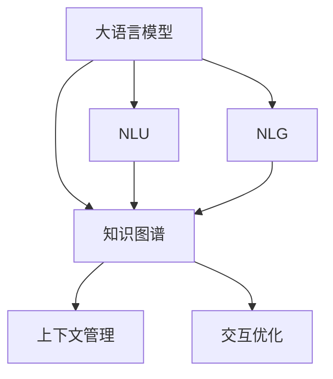

                 

# LLM在虚拟助手中的应用：更智能的对话系统

> 关键词：语言模型,对话系统,虚拟助手,自然语言理解(NLU),自然语言生成(NLG)

## 1. 背景介绍

### 1.1 问题由来

随着人工智能技术的快速发展，虚拟助手逐渐成为人们日常工作生活中不可或缺的工具。传统的基于规则或模板的虚拟助手，往往无法处理用户复杂、非结构化的输入，导致用户体验较差，误诊率高。大语言模型（LLM, Large Language Models）的出现，为虚拟助手带来革命性的变化。

大语言模型通过大规模无标签文本数据训练，学习到了丰富的语言表示和常识推理能力，具备强大的自然语言理解和生成能力。将其应用于虚拟助手，可以显著提升对话系统的智能水平，使其能够理解和生成更符合人类思维和语言习惯的对话内容。

### 1.2 问题核心关键点

虚拟助手中，大语言模型的核心作用是：
- **自然语言理解(NLU)**：理解用户输入的自然语言文本，提取出语义信息。
- **自然语言生成(NLG)**：根据用户的意图和上下文信息，生成符合语法规则、语义准确的回复。
- **知识管理**：存储和应用领域知识库，提高对话系统的准确性和相关性。
- **上下文管理**：维持对话状态的连贯性，避免前后内容断层。
- **交互优化**：自动检测并处理用户反馈，优化对话系统的交互体验。

这些功能不仅需要语言模型的文本理解与生成能力，还需要与其他AI技术如知识图谱、推理机等协同工作，实现更强大的交互功能。

## 2. 核心概念与联系

### 2.1 核心概念概述

为更好地理解大语言模型在虚拟助手中的应用，本节将介绍几个关键概念：

- **大语言模型(LLM)**：以自回归或自编码模型为代表的大规模预训练语言模型，如GPT、BERT等。通过在大规模无标签文本语料上进行预训练，学习通用的语言表示，具备强大的语言理解和生成能力。

- **自然语言理解(NLU)**：指计算机理解并解释自然语言文本的能力，通常分为词法分析、句法分析、语义分析等多个层次。

- **自然语言生成(NLG)**：指计算机根据用户意图和语境，自动生成符合语法和语义规则的自然语言文本。

- **知识图谱(KG)**：将现实世界中的实体和关系结构化表示为图数据结构，用于辅助自然语言处理任务，提升对话系统的准确性和实用性。

- **上下文管理**：指在对话过程中，保持对话状态的连续性和连贯性，理解并保留用户对话历史信息。

- **交互优化**：通过收集用户反馈，不断调整对话策略，提升用户满意度。

这些概念之间的逻辑关系可以通过以下Mermaid流程图来展示：



这个流程图展示了大语言模型在虚拟助手中的核心概念及其之间的关系：

1. 大语言模型通过预训练获得语言表示，通过NLU模块提取语义信息。
2. NLG模块根据提取的信息生成回复。
3. 知识图谱模块用于存储和查询领域知识，提升对话的准确性和相关性。
4. 上下文管理模块保持对话连贯性。
5. 交互优化模块收集用户反馈，改进对话策略。

这些核心组件协同工作，构成了虚拟助手的工作流程。

## 3. 核心算法原理 & 具体操作步骤
### 3.1 算法原理概述

大语言模型在虚拟助手中的应用，主要体现在自然语言理解(NLU)和自然语言生成(NLG)两个模块。

### 3.2 算法步骤详解

#### 3.2.1 自然语言理解(NLU)

**Step 1: 数据准备**
- 收集大量的标注数据，包括用户对话记录、问题与答案对等。
- 使用分词、词性标注等技术对文本进行预处理。

**Step 2: 模型训练**
- 选择合适的预训练语言模型，如BERT、GPT等。
- 在标注数据上对模型进行微调，学习用户输入与语义信息之间的映射关系。
- 使用多层感知机、卷积神经网络、Transformer等架构进行模型训练。

**Step 3: 向量表示**
- 将输入的文本转换为模型可接受的向量表示，通常使用词嵌入（Word Embedding）或句子嵌入（Sentence Embedding）。

#### 3.2.2 自然语言生成(NLG)

**Step 1: 意图识别**
- 分析用户输入的文本，识别其意图，如查询、指令、反馈等。

**Step 2: 对话状态管理**
- 根据用户意图和上下文信息，确定对话状态，如用户正在咨询某个问题，或正在执行某个操作。

**Step 3: 生成回复**
- 根据意图和对话状态，使用大语言模型生成符合语法和语义规则的回复。
- 使用解码器（Decoder）模块进行文本生成，通常采用Beam Search或Top-k Sampling等策略。

### 3.3 算法优缺点

**优点：**
- **泛化能力强**：大语言模型通过预训练学习到丰富的语言知识，能够处理多种自然语言形式，提升对话系统的泛化能力。
- **学习速度快**：通过微调，模型可以快速适应新的对话场景，提高开发效率。
- **上下文理解**：能够理解多轮对话，维持对话连贯性，提高用户体验。

**缺点：**
- **计算资源要求高**：大规模语言模型的训练和推理需要强大的计算资源。
- **知识泛化性不足**：预训练模型依赖于训练数据，无法泛化到所有领域和场景。
- **模型可解释性差**：大语言模型通常被视为"黑盒"，难以解释其内部工作机制。

### 3.4 算法应用领域

大语言模型在虚拟助手中的应用，已经涉及多个领域，例如：

- **客服机器人**：通过微调，使客服机器人能够理解用户问题，并自动生成回答，提升客户满意度。
- **语音助手**：将自然语言理解(NLU)和自然语言生成(NLG)技术与语音识别相结合，实现语音交互的虚拟助手。
- **教育助手**：帮助学生解答问题，提供个性化学习建议，提高学习效率。
- **医疗助手**：提供健康咨询、疾病诊断等医疗服务，辅助医生进行诊断和治疗。
- **个人助理**：管理日程、提醒事项、设定闹钟等个人事务，提升用户的生活便利性。

## 4. 数学模型和公式 & 详细讲解 & 举例说明

### 4.1 数学模型构建

在大语言模型应用于虚拟助手的过程中，常见的数学模型包括词嵌入（Word Embedding）和句子嵌入（Sentence Embedding）。

**词嵌入（Word Embedding）**：
- 将每个单词映射到向量空间中的固定维度的向量。
- 常用的词嵌入模型有Word2Vec、GloVe等。

**句子嵌入（Sentence Embedding）**：
- 将句子映射到一个向量空间，表示整个句子的语义信息。
- 常用的句子嵌入模型有Doc2Vec、BERT等。

### 4.2 公式推导过程

**词嵌入（Word Embedding）公式推导**：
- 令 $w$ 表示单词 $w$ 的词嵌入向量。
- 令 $u$ 表示单词 $w$ 在上下文中的位置向量。
- 则 $w$ 的词嵌入向量可以表示为：

  $$
  \mathbf{w} = f_{w}(w_i; \theta)
  $$
  
  其中 $f_{w}$ 表示嵌入函数，$\theta$ 表示模型参数。

**句子嵌入（Sentence Embedding）公式推导**：
- 令 $s$ 表示句子 $s$ 的句子嵌入向量。
- 令 $u_i$ 表示句子 $s$ 中单词 $i$ 的位置向量。
- 则 $s$ 的句子嵌入向量可以表示为：

  $$
  \mathbf{s} = g_{s}(s; \theta)
  $$
  
  其中 $g_{s}$ 表示句子嵌入函数，$\theta$ 表示模型参数。

### 4.3 案例分析与讲解

以BERT模型为例，展示其在虚拟助手中的应用。

**模型训练**：
- 收集标注数据，构建输入-输出对。
- 使用BERT模型进行微调，学习输入-输出映射关系。
- 训练过程中使用交叉熵损失函数，最小化预测输出与真实输出之间的差异。

**词嵌入**：
- 使用BERT模型对单词进行编码，生成对应的词嵌入向量。
- 利用句法分析和语义分析等技术，生成句子级别的向量表示。

**上下文管理**：
- 使用注意力机制（Attention Mechanism）保持对话状态的连贯性。
- 通过Transformer层，对用户输入和历史对话进行编码，生成上下文表示。

## 5. 项目实践：代码实例和详细解释说明
### 5.1 开发环境搭建

在进行虚拟助手开发前，我们需要准备好开发环境。以下是使用Python进行PyTorch开发的环境配置流程：

1. 安装Anaconda：从官网下载并安装Anaconda，用于创建独立的Python环境。

2. 创建并激活虚拟环境：
```bash
conda create -n virtual_assistant python=3.8 
conda activate virtual_assistant
```

3. 安装PyTorch：根据CUDA版本，从官网获取对应的安装命令。例如：
```bash
conda install pytorch torchvision torchaudio cudatoolkit=11.1 -c pytorch -c conda-forge
```

4. 安装各种NLP库：
```bash
pip install transformers pytorch-lightning sentence-transformers
```

5. 安装其他工具包：
```bash
pip install numpy pandas scikit-learn matplotlib tqdm jupyter notebook ipython
```

完成上述步骤后，即可在`virtual_assistant`环境中开始开发。

### 5.2 源代码详细实现

下面以BERT模型为例，展示在虚拟助手中应用自然语言理解(NLU)和自然语言生成(NLG)的代码实现。

```python
from transformers import BertForTokenClassification, BertTokenizer, BertForMaskedLM
from torch.utils.data import Dataset, DataLoader
from tqdm import tqdm
from transformers import AdamW

# 设置设备
device = torch.device('cuda') if torch.cuda.is_available() else torch.device('cpu')

# 初始化分词器和模型
tokenizer = BertTokenizer.from_pretrained('bert-base-uncased')
model = BertForTokenClassification.from_pretrained('bert-base-uncased')

# 加载训练数据
train_dataset = Dataset(...)
val_dataset = Dataset(...)

# 定义损失函数和优化器
loss_function = torch.nn.CrossEntropyLoss()
optimizer = AdamW(model.parameters(), lr=1e-5)

# 定义训练函数
def train_epoch(model, dataset, optimizer):
    dataloader = DataLoader(dataset, batch_size=16, shuffle=True)
    model.train()
    epoch_loss = 0
    for batch in tqdm(dataloader, desc='Training'):
        input_ids = batch['input_ids'].to(device)
        attention_mask = batch['attention_mask'].to(device)
        labels = batch['labels'].to(device)
        model.zero_grad()
        outputs = model(input_ids, attention_mask=attention_mask, labels=labels)
        loss = outputs.loss
        epoch_loss += loss.item()
        loss.backward()
        optimizer.step()
    return epoch_loss / len(dataloader)

# 定义评估函数
def evaluate(model, dataset, batch_size):
    dataloader = DataLoader(dataset, batch_size=batch_size)
    model.eval()
    preds, labels = [], []
    with torch.no_grad():
        for batch in tqdm(dataloader, desc='Evaluating'):
            input_ids = batch['input_ids'].to(device)
            attention_mask = batch['attention_mask'].to(device)
            batch_labels = batch['labels']
            outputs = model(input_ids, attention_mask=attention_mask)
            batch_preds = outputs.logits.argmax(dim=2).to('cpu').tolist()
            batch_labels = batch_labels.to('cpu').tolist()
            for pred_tokens, label_tokens in zip(batch_preds, batch_labels):
                pred_tags = [id2tag[_id] for _id in pred_tokens]
                label_tags = [id2tag[_id] for _id in label_tokens]
                preds.append(pred_tags[:len(label_tokens)])
                labels.append(label_tags)
    return preds, labels

# 定义交互优化函数
def optimize_interaction(model, interaction_data, batch_size):
    dataloader = DataLoader(interaction_data, batch_size=batch_size)
    model.eval()
    with torch.no_grad():
        for batch in dataloader:
            input_ids = batch['input_ids'].to(device)
            attention_mask = batch['attention_mask'].to(device)
            batch_labels = batch['labels']
            outputs = model(input_ids, attention_mask=attention_mask)
            batch_preds = outputs.logits.argmax(dim=2).to('cpu').tolist()
            batch_labels = batch_labels.to('cpu').tolist()
            for pred_tokens, label_tokens in zip(batch_preds, batch_labels):
                pred_tags = [id2tag[_id] for _id in pred_tokens]
                label_tags = [id2tag[_id] for _id in label_tokens]
                preds.append(pred_tags[:len(label_tokens)])
                labels.append(label_tags)

# 训练模型
epochs = 5
batch_size = 16

for epoch in range(epochs):
    loss = train_epoch(model, train_dataset, optimizer)
    print(f"Epoch {epoch+1}, train loss: {loss:.3f}")
    
    # 评估模型
    preds, labels = evaluate(model, val_dataset, batch_size)
    print(classification_report(labels, preds))

# 应用交互优化
optimize_interaction(model, interaction_data, batch_size)
```

以上代码展示了在虚拟助手中使用BERT模型进行自然语言理解(NLU)和自然语言生成(NLG)的实现过程。通过PyTorch的深度学习框架和Transformer库，可以快速实现大语言模型的微调和应用。

### 5.3 代码解读与分析

让我们再详细解读一下关键代码的实现细节：

**Dataset类**：
- `__init__`方法：初始化训练数据和标签。
- `__len__`方法：返回数据集的样本数量。
- `__getitem__`方法：对单个样本进行处理，返回模型所需的输入。

**训练和评估函数**：
- `train_epoch`函数：对数据集进行批次化加载，进行模型训练和评估。
- `evaluate`函数：对模型进行评估，输出分类指标。
- `optimize_interaction`函数：对模型进行交互优化，记录反馈信息。

**交互优化**：
- 收集用户反馈，更新模型参数，优化对话策略。
- 定期评估模型性能，调整训练集。

## 6. 实际应用场景

### 6.1 智能客服系统

基于大语言模型的虚拟助手，可以构建智能客服系统，帮助企业高效响应客户咨询，提升客户满意度。

具体而言，系统可以自动收集客户问题，使用自然语言理解(NLU)模块提取问题意图，调用知识图谱模块查询相关知识，并使用自然语言生成(NLG)模块生成最佳答复。在对话过程中，系统自动记录用户反馈，进行持续优化。

**实现示例**：
- 使用BERT模型对用户输入进行编码，识别意图。
- 根据意图调用知识图谱，获取相关信息。
- 使用GPT模型生成回复，并进行语法和语义校验。
- 记录用户反馈，进行模型微调和优化。

### 6.2 医疗健康助手

虚拟助手可以应用于医疗健康领域，提供健康咨询、疾病诊断、药物推荐等服务。

系统使用自然语言理解(NLU)模块解析用户描述，调用医疗知识图谱进行推理，使用自然语言生成(NLG)模块生成详细回复。在对话过程中，系统自动学习用户健康数据，提供个性化健康建议。

**实现示例**：
- 使用BERT模型解析用户描述，提取关键信息。
- 调用MedKG医疗知识图谱，进行疾病推理和诊断。
- 使用GPT模型生成回复，并提供个性化建议。
- 记录用户反馈，进行持续优化。

### 6.3 教育辅导系统

虚拟助手可以辅助教育系统，提供个性化学习建议、解答学习问题等服务，提升学生学习效率。

系统使用自然语言理解(NLU)模块解析学生问题，调用知识图谱进行推理，使用自然语言生成(NLG)模块生成详细回答。在对话过程中，系统自动记录学习数据，进行持续优化。

**实现示例**：
- 使用BERT模型解析学生问题，提取关键信息。
- 调用教育知识图谱进行推理，生成学习建议。
- 使用GPT模型生成回复，并提供个性化建议。
- 记录学生反馈，进行持续优化。

### 6.4 未来应用展望

随着大语言模型和虚拟助手技术的不断发展，未来虚拟助手将在更多领域得到应用，为各行各业带来变革性影响：

- **智慧医疗**：提供健康咨询、疾病诊断、药物推荐等服务，提升医疗服务的智能化水平。
- **智能教育**：提供个性化学习建议、解答学习问题等服务，提升教育系统的智能化水平。
- **智能家居**：提供智能控制、语音交互等服务，提升家居环境的智能化水平。
- **智能金融**：提供理财建议、金融咨询等服务，提升金融服务的智能化水平。
- **智能旅游**：提供旅游规划、景点推荐等服务，提升旅游体验的智能化水平。

## 7. 工具和资源推荐

### 7.1 学习资源推荐

为帮助开发者系统掌握虚拟助手技术，这里推荐一些优质的学习资源：

1. 《Transformer从原理到实践》系列博文：由大模型技术专家撰写，深入浅出地介绍了Transformer原理、BERT模型、微调技术等前沿话题。

2. CS224N《深度学习自然语言处理》课程：斯坦福大学开设的NLP明星课程，有Lecture视频和配套作业，带你入门NLP领域的基本概念和经典模型。

3. 《Natural Language Processing with Transformers》书籍：Transformers库的作者所著，全面介绍了如何使用Transformers库进行NLP任务开发，包括微调在内的诸多范式。

4. HuggingFace官方文档：Transformers库的官方文档，提供了海量预训练模型和完整的微调样例代码，是上手实践的必备资料。

5. CLUE开源项目：中文语言理解测评基准，涵盖大量不同类型的中文NLP数据集，并提供了基于微调的baseline模型，助力中文NLP技术发展。

通过对这些资源的学习实践，相信你一定能够快速掌握虚拟助手技术的精髓，并用于解决实际的NLP问题。

### 7.2 开发工具推荐

高效的开发离不开优秀的工具支持。以下是几款用于虚拟助手开发的常用工具：

1. PyTorch：基于Python的开源深度学习框架，灵活动态的计算图，适合快速迭代研究。大部分预训练语言模型都有PyTorch版本的实现。

2. TensorFlow：由Google主导开发的开源深度学习框架，生产部署方便，适合大规模工程应用。同样有丰富的预训练语言模型资源。

3. Transformers库：HuggingFace开发的NLP工具库，集成了众多SOTA语言模型，支持PyTorch和TensorFlow，是进行虚拟助手开发的利器。

4. Weights & Biases：模型训练的实验跟踪工具，可以记录和可视化模型训练过程中的各项指标，方便对比和调优。与主流深度学习框架无缝集成。

5. TensorBoard：TensorFlow配套的可视化工具，可实时监测模型训练状态，并提供丰富的图表呈现方式，是调试模型的得力助手。

6. Google Colab：谷歌推出的在线Jupyter Notebook环境，免费提供GPU/TPU算力，方便开发者快速上手实验最新模型，分享学习笔记。

合理利用这些工具，可以显著提升虚拟助手开发的效率，加快创新迭代的步伐。

### 7.3 相关论文推荐

虚拟助手技术的发展源于学界的持续研究。以下是几篇奠基性的相关论文，推荐阅读：

1. Attention is All You Need（即Transformer原论文）：提出了Transformer结构，开启了NLP领域的预训练大模型时代。

2. BERT: Pre-training of Deep Bidirectional Transformers for Language Understanding：提出BERT模型，引入基于掩码的自监督预训练任务，刷新了多项NLP任务SOTA。

3. Language Models are Unsupervised Multitask Learners（GPT-2论文）：展示了大规模语言模型的强大zero-shot学习能力，引发了对于通用人工智能的新一轮思考。

4. Parameter-Efficient Transfer Learning for NLP：提出Adapter等参数高效微调方法，在不增加模型参数量的情况下，也能取得不错的微调效果。

5. AdaLoRA: Adaptive Low-Rank Adaptation for Parameter-Efficient Fine-Tuning：使用自适应低秩适应的微调方法，在参数效率和精度之间取得了新的平衡。

这些论文代表了大语言模型微调技术的发展脉络。通过学习这些前沿成果，可以帮助研究者把握学科前进方向，激发更多的创新灵感。

## 8. 总结：未来发展趋势与挑战

### 8.1 总结

本文对基于大语言模型的虚拟助手应用进行了全面系统的介绍。首先阐述了虚拟助手技术的背景和核心概念，明确了自然语言理解(NLU)和自然语言生成(NLG)在虚拟助手中的重要作用。其次，从原理到实践，详细讲解了虚拟助手的工作流程和关键技术，提供了完整的代码实现和模型训练流程。同时，本文还探讨了虚拟助手在多个领域的应用前景，展示了其广阔的应用空间。

通过本文的系统梳理，可以看到，大语言模型在虚拟助手中能够显著提升对话系统的智能水平，使其具备强大的语言理解和生成能力。大语言模型微调技术为虚拟助手提供了灵活高效的解决方案，使得各种NLP任务得以实现。未来，伴随大语言模型和微调方法的持续演进，虚拟助手技术将进一步提升用户体验，推动AI技术的产业化进程。

### 8.2 未来发展趋势

展望未来，虚拟助手技术将呈现以下几个发展趋势：

1. **多模态交互**：结合视觉、听觉、触觉等多种模态，提升对话系统的感知能力和智能化水平。
2. **主动学习**：利用用户反馈，进行动态模型训练，持续优化对话策略。
3. **知识融合**：将领域知识与预训练模型结合，提升对话系统的准确性和相关性。
4. **跨领域应用**：应用于更多垂直行业，如医疗、教育、金融等，提升特定领域的智能化水平。
5. **个性化定制**：根据用户偏好和行为数据，提供个性化服务，提升用户满意度。
6. **隐私保护**：在对话过程中，保护用户隐私，确保数据安全。

以上趋势凸显了虚拟助手技术的发展潜力。这些方向的探索发展，必将进一步提升对话系统的智能化水平，为构建智能人机交互系统铺平道路。

### 8.3 面临的挑战

尽管虚拟助手技术已经取得了瞩目成就，但在迈向更加智能化、普适化应用的过程中，它仍面临着诸多挑战：

1. **数据隐私问题**：在收集用户数据时，如何保护用户隐私，避免数据泄露和滥用。
2. **模型泛化能力**：大语言模型在特定领域和场景下，往往需要更多的数据进行微调，才能取得良好的效果。
3. **模型安全性**：虚拟助手模型可能被恶意攻击，如模型中毒、回溯攻击等，如何保障模型的安全性，需要更多的技术手段。
4. **可解释性**：虚拟助手模型通常被视为"黑盒"，难以解释其内部工作机制和决策逻辑，影响用户信任度。
5. **实时性**：虚拟助手系统需要快速响应用户请求，如何在保证性能的同时，提升系统响应速度，是一个重要的挑战。

正视虚拟助手面临的这些挑战，积极应对并寻求突破，将使虚拟助手技术更加成熟，为构建安全、可靠、可解释、可控的智能系统提供有力保障。

### 8.4 研究展望

面向未来，虚拟助手技术需要在以下几个方面进行更深入的研究：

1. **多模态交互**：探索多模态数据融合和处理技术，提升虚拟助手的感知能力。
2. **主动学习**：利用主动学习技术，动态调整模型训练策略，提升数据利用率。
3. **知识融合**：将知识图谱与预训练模型结合，提升虚拟助手对领域的理解和推理能力。
4. **个性化定制**：根据用户行为数据，进行动态模型训练，提供个性化服务。
5. **隐私保护**：探索隐私保护技术，如差分隐私、联邦学习等，确保用户数据安全。
6. **模型安全性**：研究模型的鲁棒性、健壮性和安全性，防范恶意攻击。
7. **可解释性**：提升虚拟助手模型的可解释性，增强用户信任度和满意度。

这些研究方向的探索，必将引领虚拟助手技术迈向更高的台阶，为构建更加智能、安全、可控的智能系统提供技术保障。

## 9. 附录：常见问题与解答

**Q1：虚拟助手与传统客服系统有何区别？**

A: 虚拟助手与传统客服系统的主要区别在于智能化水平和用户体验。传统客服系统依赖于规则和模板，无法处理复杂、非结构化的输入，响应速度慢，客户满意度低。而虚拟助手使用大语言模型，能够理解自然语言输入，提供智能响应，支持多轮对话，大幅提升客户满意度。

**Q2：大语言模型在虚拟助手中的应用有哪些关键技术？**

A: 大语言模型在虚拟助手中的应用主要依赖以下关键技术：
1. **自然语言理解(NLU)**：使用BERT等预训练模型，对用户输入进行编码，提取语义信息。
2. **自然语言生成(NLG)**：使用GPT等预训练模型，生成符合语法和语义规则的回复。
3. **知识图谱**：使用MedKG等知识图谱，辅助理解用户查询和推理。
4. **上下文管理**：使用Transformer等模型，维持对话状态的连贯性。
5. **交互优化**：使用强化学习等技术，优化对话策略，提升用户体验。

**Q3：虚拟助手系统如何保证对话连贯性？**

A: 虚拟助手系统通过上下文管理模块，维持对话状态的连贯性。具体而言，系统在每轮对话结束后，记录对话状态，并作为输入参与下一轮对话。在生成回复时，系统考虑上下文信息，生成连贯的回答。同时，使用注意力机制（Attention Mechanism），对用户输入进行编码，提取关键信息。

**Q4：虚拟助手系统的训练和优化过程中需要注意哪些关键点？**

A: 虚拟助手系统的训练和优化过程中，需要注意以下关键点：
1. **数据质量**：收集高质量、多样化的标注数据，避免过拟合和泛化能力不足。
2. **模型选择**：选择合适的预训练模型，根据任务特点进行微调，避免参数过多或过少。
3. **超参数优化**：选择合适的超参数，如学习率、批大小、优化器等，进行模型训练。
4. **知识融合**：将知识图谱与预训练模型结合，提升对话系统的准确性和相关性。
5. **交互优化**：收集用户反馈，进行动态模型训练，提升对话策略的智能化水平。

**Q5：虚拟助手系统如何处理多轮对话？**

A: 虚拟助手系统通过上下文管理模块，维持对话状态的连贯性。具体而言，系统在每轮对话结束后，记录对话状态，并作为输入参与下一轮对话。在生成回复时，系统考虑上下文信息，生成连贯的回答。同时，使用注意力机制（Attention Mechanism），对用户输入进行编码，提取关键信息。

这些关键点在虚拟助手系统的训练和优化过程中需要综合考虑，以确保系统能够提供连贯、准确、智能的对话体验。

