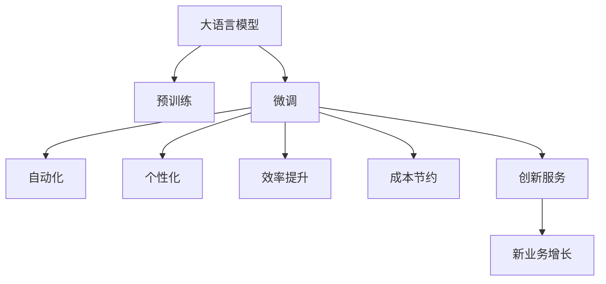

                 

# LLM对传统商业模式的颠覆与创新

> 关键词：大语言模型(LLM),商业模型颠覆,创新,人工智能(AI),深度学习,自然语言处理(NLP),客户服务,个性化推荐,供应链优化,自动化,数字化转型

## 1. 背景介绍

### 1.1 问题由来
在互联网时代，传统的商业模式受到了前所未有的冲击。商业环境瞬息万变，市场竞争日益激烈。如何利用技术手段提升商业决策的精准性，优化运营效率，提高客户满意度，成为企业普遍关注的问题。其中，深度学习和大语言模型(Large Language Model, LLM)技术的迅速发展，为传统商业模式的颠覆和创新提供了新的契机。

近年来，基于Transformer架构的预训练语言模型如BERT、GPT-3、T5等，通过在大规模无标签文本数据上进行预训练，获得了强大的语言理解和生成能力。这些模型已经在文本分类、命名实体识别、问答系统、情感分析、机器翻译等NLP任务上取得了显著的突破，被广泛应用于各种商业场景。但与此同时，传统的商业模型和流程也面临着巨大的变革压力。本文将探讨LLM对传统商业模式的颠覆与创新，以及其带来的新机遇。

### 1.2 问题核心关键点
LLM对传统商业模式的颠覆与创新，主要体现在以下几个关键点：

1. **自动化**：LLM能够自动处理和分析海量数据，自动生成高质量的文本和推荐内容，大幅提升商业决策和运营的自动化水平。
2. **个性化**：基于用户的兴趣和行为数据，LLM可以提供个性化的客户服务和产品推荐，增强客户体验和满意度。
3. **效率提升**：通过自动化和智能化操作，LLM能够优化供应链、库存管理、客服响应等环节，提高企业运营效率。
4. **成本节约**：LLM能够减少对人工处理的依赖，降低人力成本和运营成本，提升企业的盈利能力。
5. **创新服务**：LLM能够生成新的内容和服务形式，如智能客服、虚拟助手等，为企业带来新的业务增长点。

这些关键点展示了LLM如何通过技术手段，提升商业决策和运营的精准性、效率和创新性，从而对传统商业模式造成颠覆性影响。

## 2. 核心概念与联系

### 2.1 核心概念概述

为更好地理解LLM对传统商业模式的颠覆与创新，本节将介绍几个关键概念及其相互联系：

- **大语言模型(Large Language Model, LLM)**：通过大规模数据预训练得到的深度神经网络模型，具备强大的语言理解和生成能力。
- **预训练(Pre-training)**：在大规模无标签数据上，通过自监督学习任务训练通用语言模型，学习通用的语言表示。
- **微调(Fine-tuning)**：将预训练模型在特定任务上进行有监督训练，优化模型在该任务上的性能。
- **商业模型(Business Model)**：企业在运营和市场竞争中的策略、流程和资源配置方式，涵盖产品、服务、渠道、客户等各个方面。
- **自动化(Automation)**：利用技术手段，自动执行某些商业活动，减少对人力的依赖。
- **个性化(Personalization)**：根据用户的特点和行为，提供定制化的产品和服务，提升用户体验。
- **效率(Efficiency)**：以最小的资源投入，实现最大的产出和效益。
- **成本(Cost)**：企业运营和生产过程中所需的各种投入和支出。

这些核心概念之间的逻辑关系可以通过以下Mermaid流程图来展示：



这个流程图展示了大语言模型的核心概念及其对商业模型的影响：

1. 大语言模型通过预训练获得基础能力。
2. 微调使得通用大模型更好地适应特定任务，提升模型性能。
3. 自动化和个性化通过微调后的模型实现，提升运营效率和客户满意度。
4. 效率提升和成本节约通过自动化和个性化操作实现，提高企业的盈利能力。
5. 创新服务基于大语言模型的能力生成，为企业带来新的业务增长点。

这些概念共同构成了大语言模型的学习和应用框架，使其能够在各种商业场景下发挥强大的商业价值。

## 3. 核心算法原理 & 具体操作步骤

### 3.1 算法原理概述

LLM对传统商业模式的颠覆与创新，主要基于以下几个算法原理：

1. **自动文本处理**：LLM能够自动处理和分析文本数据，提取关键信息，生成高质量的文本内容。通过文本分析，LLM可以提升市场分析、趋势预测等商业决策的精准性。
2. **个性化推荐**：LLM可以基于用户的历史行为数据，生成个性化的产品和服务推荐，提高客户满意度和忠诚度。
3. **智能客服**：LLM能够生成自然流畅的对话，替代部分人工客服，提升客户服务效率和体验。
4. **供应链优化**：LLM能够通过分析市场和供应链数据，优化库存管理、物流调度和生产计划，降低运营成本，提高供应链效率。
5. **客户反馈分析**：LLM能够自动分析和处理客户反馈和评价，优化产品和服务质量。

这些算法原理展示了LLM如何通过技术手段，提升商业运营的自动化、个性化和效率，从而对传统商业模式造成颠覆性影响。

### 3.2 算法步骤详解

基于LLM的商业模型颠覆与创新，一般包括以下几个关键步骤：

**Step 1: 数据准备**
- 收集和清洗商业相关的数据，如客户行为数据、市场分析数据、供应链数据等。
- 将数据分为训练集、验证集和测试集，用于模型训练、验证和测试。

**Step 2: 预训练模型选择**
- 选择适合商业场景的预训练语言模型，如BERT、GPT-3、T5等。
- 确定模型的上下文长度、模型大小等参数。

**Step 3: 微调模型**
- 在特定商业任务上对预训练模型进行微调，优化模型在该任务上的性能。
- 设置微调的目标函数和优化器，选择合适的学习率和批大小。

**Step 4: 商业模型集成**
- 将微调后的模型集成到商业模型中，提升商业决策、运营和客户服务的自动化和智能化水平。
- 应用LLM生成自动化报告、推荐、客服对话等。

**Step 5: 评估与优化**
- 在测试集上评估模型性能，分析其对商业指标的影响。
- 根据评估结果，优化模型参数和商业流程，持续改进商业模型。

### 3.3 算法优缺点

基于LLM的商业模型颠覆与创新，具有以下优点：

1. **高效性**：LLM能够自动处理海量数据，快速生成商业洞察和决策，提升运营效率。
2. **精准性**：基于机器学习，LLM能够提升商业决策的准确性和可解释性，降低人为错误。
3. **灵活性**：LLM可以通过微调快速适应不同的商业场景和任务，灵活应对市场变化。
4. **成本效益**：减少对人工操作的依赖，降低人力和运营成本，提高企业盈利能力。

同时，该方法也存在一些局限性：

1. **数据依赖**：LLM的效果依赖于数据的质量和量，需要获取高质量的商业数据。
2. **模型复杂性**：预训练模型和微调过程复杂，需要较高的技术门槛。
3. **隐私和安全**：商业数据涉及用户隐私，需要采取措施保障数据安全。
4. **解释性不足**：LLM的决策过程难以解释，缺乏可解释性。

尽管存在这些局限性，但LLM在提升商业运营效率和客户满意度方面展现出强大的潜力，成为企业转型升级的重要工具。

### 3.4 算法应用领域

基于LLM的商业模型颠覆与创新，已经在多个领域得到了广泛应用：

1. **客户服务**：智能客服系统通过LLM自动处理客户咨询，提供快速、准确的服务。
2. **个性化推荐**：电商平台通过LLM生成个性化商品推荐，提升用户购买转化率。
3. **市场分析**：LLM能够自动分析市场数据，生成市场趋势报告和预测。
4. **供应链管理**：通过LLM优化库存管理、物流调度和生产计划，提升供应链效率。
5. **客户反馈分析**：LLM能够自动处理和分析客户反馈，优化产品和服务质量。

除了上述这些应用领域外，LLM还在广告投放、风险控制、金融交易等诸多领域展现出其商业价值，为企业提供了新的运营思路和增长点。

## 4. 数学模型和公式 & 详细讲解  
### 4.1 数学模型构建

本节将使用数学语言对基于LLM的商业模型颠覆与创新进行更加严格的刻画。

记商业数据集为 $D=\{(x_i,y_i)\}_{i=1}^N, x_i \in X, y_i \in Y$，其中 $X$ 为输入空间， $Y$ 为输出空间。假设预训练模型为 $M_{\theta}:\mathcal{X} \rightarrow \mathcal{Y}$，其中 $\theta$ 为预训练得到的模型参数。

定义模型 $M_{\theta}$ 在输入 $x$ 上的损失函数为 $\ell(M_{\theta}(x),y)$，则在数据集 $D$ 上的经验风险为：

$$
\mathcal{L}(\theta) = \frac{1}{N}\sum_{i=1}^N \ell(M_{\theta}(x_i),y_i)
$$

在特定商业任务上，通过微调优化模型参数 $\theta$，使得模型输出逼近真实标签。微调的优化目标是最小化经验风险，即：

$$
\theta^* = \mathop{\arg\min}_{\theta} \mathcal{L}(\theta)
$$

在实践中，我们通常使用基于梯度的优化算法（如SGD、Adam等）来近似求解上述最优化问题。设 $\eta$ 为学习率，$\lambda$ 为正则化系数，则参数的更新公式为：

$$
\theta \leftarrow \theta - \eta \nabla_{\theta}\mathcal{L}(\theta) - \eta\lambda\theta
$$

其中 $\nabla_{\theta}\mathcal{L}(\theta)$ 为损失函数对参数 $\theta$ 的梯度，可通过反向传播算法高效计算。

### 4.2 公式推导过程

以下我们以个性化推荐系统为例，推导LLM在推荐任务上的数学模型和公式。

假设用户 $u$ 的兴趣向量为 $w_u$，商品 $i$ 的特征向量为 $v_i$，模型的预测函数为 $M_{\theta}(x) = f(\theta, x)$，则个性化推荐的任务可以转化为优化问题：

$$
\max_u \min_i \frac{M_{\theta}(u)}{v_i}
$$

其中 $M_{\theta}(u) = f(\theta, w_u)$ 为用户兴趣与模型输出的匹配度。优化目标是通过微调模型参数，使得匹配度尽可能大，即用户越感兴趣的商品，模型的输出越高。

通过引入优化算法，可以不断更新模型参数 $\theta$，直到达到最优状态。最终得到的匹配度函数 $M_{\theta}(u)$ 可以应用于推荐系统，生成个性化的商品推荐。

## 5. 项目实践：代码实例和详细解释说明
### 5.1 开发环境搭建

在进行LLM商业模型颠覆与创新实践前，我们需要准备好开发环境。以下是使用Python进行PyTorch开发的环境配置流程：

1. 安装Anaconda：从官网下载并安装Anaconda，用于创建独立的Python环境。

2. 创建并激活虚拟环境：
```bash
conda create -n llm-env python=3.8 
conda activate llm-env
```

3. 安装PyTorch：根据CUDA版本，从官网获取对应的安装命令。例如：
```bash
conda install pytorch torchvision torchaudio cudatoolkit=11.1 -c pytorch -c conda-forge
```

4. 安装TensorFlow：由Google主导开发的开源深度学习框架，生产部署方便，适合大规模工程应用。同样有丰富的预训练语言模型资源。

5. 安装Transformers库：HuggingFace开发的NLP工具库，集成了众多SOTA语言模型，支持PyTorch和TensorFlow，是进行商业模型开发的利器。

6. 安装各类工具包：
```bash
pip install numpy pandas scikit-learn matplotlib tqdm jupyter notebook ipython
```

完成上述步骤后，即可在`llm-env`环境中开始商业模型颠覆与创新实践。

### 5.2 源代码详细实现

下面我们以个性化推荐系统为例，给出使用Transformers库对BERT模型进行个性化推荐微调的PyTorch代码实现。

首先，定义推荐任务的数据处理函数：

```python
from transformers import BertTokenizer
from torch.utils.data import Dataset
import torch

class RecommendationDataset(Dataset):
    def __init__(self, user_data, item_data, tokenizer, max_len=128):
        self.user_data = user_data
        self.item_data = item_data
        self.tokenizer = tokenizer
        self.max_len = max_len
        
    def __len__(self):
        return len(self.user_data)
    
    def __getitem__(self, item):
        user = self.user_data[item]
        item = self.item_data[item]
        
        encoding = self.tokenizer(user, return_tensors='pt', max_length=self.max_len, padding='max_length', truncation=True)
        input_ids = encoding['input_ids'][0]
        attention_mask = encoding['attention_mask'][0]
        
        # 对token-wise的兴趣向量进行编码
        encoded_interest = [item2id[item] for item in item_data] 
        encoded_interest.extend([item2id['O']] * (self.max_len - len(encoded_interest)))
        labels = torch.tensor(encoded_interest, dtype=torch.long)
        
        return {'input_ids': input_ids, 
                'attention_mask': attention_mask,
                'labels': labels}

# 兴趣向量与id的映射
item2id = {'O': 0, 'Item1': 1, 'Item2': 2, 'Item3': 3, 'Item4': 4, 'Item5': 5, 'Item6': 6, 'Item7': 7, 'Item8': 8, 'Item9': 9, 'Item10': 10}
id2item = {v: k for k, v in item2id.items()}

# 创建dataset
tokenizer = BertTokenizer.from_pretrained('bert-base-cased')

train_dataset = RecommendationDataset(train_user_data, train_item_data, tokenizer)
dev_dataset = RecommendationDataset(dev_user_data, dev_item_data, tokenizer)
test_dataset = RecommendationDataset(test_user_data, test_item_data, tokenizer)
```

然后，定义模型和优化器：

```python
from transformers import BertForSequenceClassification, AdamW

model = BertForSequenceClassification.from_pretrained('bert-base-cased', num_labels=len(item2id))

optimizer = AdamW(model.parameters(), lr=2e-5)
```

接着，定义训练和评估函数：

```python
from torch.utils.data import DataLoader
from tqdm import tqdm
from sklearn.metrics import classification_report

device = torch.device('cuda') if torch.cuda.is_available() else torch.device('cpu')
model.to(device)

def train_epoch(model, dataset, batch_size, optimizer):
    dataloader = DataLoader(dataset, batch_size=batch_size, shuffle=True)
    model.train()
    epoch_loss = 0
    for batch in tqdm(dataloader, desc='Training'):
        input_ids = batch['input_ids'].to(device)
        attention_mask = batch['attention_mask'].to(device)
        labels = batch['labels'].to(device)
        model.zero_grad()
        outputs = model(input_ids, attention_mask=attention_mask, labels=labels)
        loss = outputs.loss
        epoch_loss += loss.item()
        loss.backward()
        optimizer.step()
    return epoch_loss / len(dataloader)

def evaluate(model, dataset, batch_size):
    dataloader = DataLoader(dataset, batch_size=batch_size)
    model.eval()
    preds, labels = [], []
    with torch.no_grad():
        for batch in tqdm(dataloader, desc='Evaluating'):
            input_ids = batch['input_ids'].to(device)
            attention_mask = batch['attention_mask'].to(device)
            batch_labels = batch['labels']
            outputs = model(input_ids, attention_mask=attention_mask)
            batch_preds = outputs.logits.argmax(dim=2).to('cpu').tolist()
            batch_labels = batch_labels.to('cpu').tolist()
            for pred_tokens, label_tokens in zip(batch_preds, batch_labels):
                pred_items = [id2item[_id] for _id in pred_tokens]
                label_items = [id2item[_id] for _id in label_tokens]
                preds.append(pred_items[:len(label_items)])
                labels.append(label_items)
                
    print(classification_report(labels, preds))
```

最后，启动训练流程并在测试集上评估：

```python
epochs = 5
batch_size = 16

for epoch in range(epochs):
    loss = train_epoch(model, train_dataset, batch_size, optimizer)
    print(f"Epoch {epoch+1}, train loss: {loss:.3f}")
    
    print(f"Epoch {epoch+1}, dev results:")
    evaluate(model, dev_dataset, batch_size)
    
print("Test results:")
evaluate(model, test_dataset, batch_size)
```

以上就是使用PyTorch对BERT进行个性化推荐系统微调的完整代码实现。可以看到，得益于Transformers库的强大封装，我们可以用相对简洁的代码完成BERT模型的加载和微调。

### 5.3 代码解读与分析

让我们再详细解读一下关键代码的实现细节：

**RecommendationDataset类**：
- `__init__`方法：初始化用户数据、商品数据、分词器等关键组件。
- `__len__`方法：返回数据集的样本数量。
- `__getitem__`方法：对单个样本进行处理，将用户数据输入编码为token ids，将商品标签编码为数字，并对其进行定长padding，最终返回模型所需的输入。

**item2id和id2item字典**：
- 定义了商品与数字id之间的映射关系，用于将token-wise的预测结果解码回真实的商品标签。

**训练和评估函数**：
- 使用PyTorch的DataLoader对数据集进行批次化加载，供模型训练和推理使用。
- 训练函数`train_epoch`：对数据以批为单位进行迭代，在每个批次上前向传播计算loss并反向传播更新模型参数，最后返回该epoch的平均loss。
- 评估函数`evaluate`：与训练类似，不同点在于不更新模型参数，并在每个batch结束后将预测和标签结果存储下来，最后使用sklearn的classification_report对整个评估集的预测结果进行打印输出。

**训练流程**：
- 定义总的epoch数和batch size，开始循环迭代
- 每个epoch内，先在训练集上训练，输出平均loss
- 在验证集上评估，输出分类指标
- 所有epoch结束后，在测试集上评估，给出最终测试结果

可以看到，PyTorch配合Transformers库使得BERT微调的代码实现变得简洁高效。开发者可以将更多精力放在数据处理、模型改进等高层逻辑上，而不必过多关注底层的实现细节。

当然，工业级的系统实现还需考虑更多因素，如模型的保存和部署、超参数的自动搜索、更灵活的任务适配层等。但核心的微调范式基本与此类似。

## 6. 实际应用场景
### 6.1 智能客服系统

基于LLM的智能客服系统，可以广泛应用于智能客服系统的构建。传统客服往往需要配备大量人力，高峰期响应缓慢，且一致性和专业性难以保证。而使用LLM的智能客服系统，可以7x24小时不间断服务，快速响应客户咨询，用自然流畅的语言解答各类常见问题。

在技术实现上，可以收集企业内部的历史客服对话记录，将问题和最佳答复构建成监督数据，在此基础上对预训练对话模型进行微调。微调后的对话模型能够自动理解用户意图，匹配最合适的答案模板进行回复。对于客户提出的新问题，还可以接入检索系统实时搜索相关内容，动态组织生成回答。如此构建的智能客服系统，能大幅提升客户咨询体验和问题解决效率。

### 6.2 金融舆情监测

金融机构需要实时监测市场舆论动向，以便及时应对负面信息传播，规避金融风险。传统的人工监测方式成本高、效率低，难以应对网络时代海量信息爆发的挑战。基于LLM的文本分类和情感分析技术，为金融舆情监测提供了新的解决方案。

具体而言，可以收集金融领域相关的新闻、报道、评论等文本数据，并对其进行主题标注和情感标注。在此基础上对预训练语言模型进行微调，使其能够自动判断文本属于何种主题，情感倾向是正面、中性还是负面。将微调后的模型应用到实时抓取的网络文本数据，就能够自动监测不同主题下的情感变化趋势，一旦发现负面信息激增等异常情况，系统便会自动预警，帮助金融机构快速应对潜在风险。

### 6.3 个性化推荐系统

当前的推荐系统往往只依赖用户的历史行为数据进行物品推荐，无法深入理解用户的真实兴趣偏好。基于LLM的个性化推荐系统可以更好地挖掘用户行为背后的语义信息，从而提供更精准、多样的推荐内容。

在实践中，可以收集用户浏览、点击、评论、分享等行为数据，提取和用户交互的物品标题、描述、标签等文本内容。将文本内容作为模型输入，用户的后续行为（如是否点击、购买等）作为监督信号，在此基础上微调预训练语言模型。微调后的模型能够从文本内容中准确把握用户的兴趣点。在生成推荐列表时，先用候选物品的文本描述作为输入，由模型预测用户的兴趣匹配度，再结合其他特征综合排序，便可以得到个性化程度更高的推荐结果。

### 6.4 未来应用展望

随着LLM和微调方法的不断发展，基于微调范式将在更多领域得到应用，为传统行业带来变革性影响。

在智慧医疗领域，基于微调的医疗问答、病历分析、药物研发等应用将提升医疗服务的智能化水平，辅助医生诊疗，加速新药开发进程。

在智能教育领域，微调技术可应用于作业批改、学情分析、知识推荐等方面，因材施教，促进教育公平，提高教学质量。

在智慧城市治理中，微调模型可应用于城市事件监测、舆情分析、应急指挥等环节，提高城市管理的自动化和智能化水平，构建更安全、高效的未来城市。

此外，在企业生产、社会治理、文娱传媒等众多领域，基于LLM的微调方法也将不断涌现，为经济社会发展注入新的动力。相信随着技术的日益成熟，LLM的微调技术将成为人工智能落地应用的重要范式，推动人工智能技术在垂直行业的规模化落地。

## 7. 工具和资源推荐
### 7.1 学习资源推荐

为了帮助开发者系统掌握LLM的微调理论和实践技巧，这里推荐一些优质的学习资源：

1. 《Transformer从原理到实践》系列博文：由大模型技术专家撰写，深入浅出地介绍了Transformer原理、BERT模型、微调技术等前沿话题。

2. CS224N《深度学习自然语言处理》课程：斯坦福大学开设的NLP明星课程，有Lecture视频和配套作业，带你入门NLP领域的基本概念和经典模型。

3. 《Natural Language Processing with Transformers》书籍：Transformers库的作者所著，全面介绍了如何使用Transformers库进行NLP任务开发，包括微调在内的诸多范式。

4. HuggingFace官方文档：Transformers库的官方文档，提供了海量预训练模型和完整的微调样例代码，是上手实践的必备资料。

5. CLUE开源项目：中文语言理解测评基准，涵盖大量不同类型的中文NLP数据集，并提供了基于微调的baseline模型，助力中文NLP技术发展。

通过对这些资源的学习实践，相信你一定能够快速掌握LLM的微调精髓，并用于解决实际的NLP问题。
###  7.2 开发工具推荐

高效的开发离不开优秀的工具支持。以下是几款用于LLM微调开发的常用工具：

1. PyTorch：基于Python的开源深度学习框架，灵活动态的计算图，适合快速迭代研究。大部分预训练语言模型都有PyTorch版本的实现。

2. TensorFlow：由Google主导开发的开源深度学习框架，生产部署方便，适合大规模工程应用。同样有丰富的预训练语言模型资源。

3. Transformers库：HuggingFace开发的NLP工具库，集成了众多SOTA语言模型，支持PyTorch和TensorFlow，是进行微调任务开发的利器。

4. Weights & Biases：模型训练的实验跟踪工具，可以记录和可视化模型训练过程中的各项指标，方便对比和调优。与主流深度学习框架无缝集成。

5. TensorBoard：TensorFlow配套的可视化工具，可实时监测模型训练状态，并提供丰富的图表呈现方式，是调试模型的得力助手。

6. Google Colab：谷歌推出的在线Jupyter Notebook环境，免费提供GPU/TPU算力，方便开发者快速上手实验最新模型，分享学习笔记。

合理利用这些工具，可以显著提升LLM微调任务的开发效率，加快创新迭代的步伐。

### 7.3 相关论文推荐

LLM的微调技术的发展源于学界的持续研究。以下是几篇奠基性的相关论文，推荐阅读：

1. Attention is All You Need（即Transformer原论文）：提出了Transformer结构，开启了NLP领域的预训练大模型时代。

2. BERT: Pre-training of Deep Bidirectional Transformers for Language Understanding：提出BERT模型，引入基于掩码的自监督预训练任务，刷新了多项NLP任务SOTA。

3. Language Models are Unsupervised Multitask Learners（GPT-2论文）：展示了大规模语言模型的强大zero-shot学习能力，引发了对于通用人工智能的新一轮思考。

4. Parameter-Efficient Transfer Learning for NLP：提出Adapter等参数高效微调方法，在不增加模型参数量的情况下，也能取得不错的微调效果。

5. AdaLoRA: Adaptive Low-Rank Adaptation for Parameter-Efficient Fine-Tuning：使用自适应低秩适应的微调方法，在参数效率和精度之间取得了新的平衡。

这些论文代表了大语言模型微调技术的发展脉络。通过学习这些前沿成果，可以帮助研究者把握学科前进方向，激发更多的创新灵感。

## 8. 总结：未来发展趋势与挑战

### 8.1 总结

本文对基于LLM的商业模型颠覆与创新进行了全面系统的介绍。首先阐述了LLM和微调技术的研究背景和意义，明确了其在提升商业决策和运营精准性、效率和创新性方面的独特价值。其次，从原理到实践，详细讲解了LLM在自动化、个性化、效率提升、成本节约和创新服务等方面的应用，展示了其对传统商业模型的颠覆性影响。最后，本文还广泛探讨了LLM在客户服务、金融舆情、个性化推荐等多个行业领域的应用前景，展示了其商业价值。

通过本文的系统梳理，可以看到，基于LLM的微调技术正在成为商业运营智能化、高效化和创新化的重要工具。LLM通过技术手段提升了商业决策和运营的精准性、效率和创新性，推动了商业模式的变革，展现了其在提升客户体验、优化运营效率、降低成本等方面的巨大潜力。

### 8.2 未来发展趋势

展望未来，LLM的商业模型颠覆与创新将呈现以下几个发展趋势：

1. **自动化程度提高**：随着技术的发展，LLM将进一步提升商业决策和运营的自动化水平，减少人工干预，提升效率。
2. **个性化服务深入**：基于用户行为数据的深度学习，LLM将更好地挖掘用户兴趣和需求，提供更加个性化的服务。
3. **智能协同增强**：LLM与其他智能技术如知识图谱、强化学习等相结合，将推动商业模型的智能化和协同化，提升决策质量和效率。
4. **跨领域应用拓展**：LLM将在更多领域得到应用，如医疗、教育、城市治理等，拓展商业模型在垂直行业的覆盖范围。
5. **数据智能融合**：LLM将更好地融合多模态数据，提升商业决策的全面性和准确性。
6. **伦理道德重视**：LLM的应用将更加重视数据隐私、算法公平性等伦理道德问题，保障技术应用的合法合规。

以上趋势展示了LLM在提升商业运营智能化、高效化和创新性方面的广阔前景。这些方向的探索发展，必将进一步推动商业模式的变革，为各行各业带来新的机遇和挑战。

### 8.3 面临的挑战

尽管LLM在提升商业运营智能化方面展现出巨大的潜力，但在实际应用中也面临诸多挑战：

1. **数据依赖**：LLM的效果依赖于高质量的数据，数据的获取和处理成本较高，尤其是在小规模企业中。
2. **模型复杂性**：预训练模型和微调过程复杂，需要较高的技术门槛，对企业的技术能力提出了挑战。
3. **隐私和安全**：商业数据涉及用户隐私，需要采取措施保障数据安全。
4. **解释性不足**：LLM的决策过程难以解释，缺乏可解释性，不利于算法的审查和调试。
5. **技术壁垒**：商业模型的应用需要跨学科的知识，包括NLP、数据科学、商业分析等，技术壁垒较高。

尽管存在这些挑战，但LLM在提升商业运营智能化、高效化和创新性方面展现出巨大的潜力，成为企业转型升级的重要工具。未来，通过技术进步和政策支持，这些挑战有望逐步克服。

### 8.4 研究展望

面对LLM面临的挑战，未来的研究需要在以下几个方面寻求新的突破：

1. **无监督学习技术**：探索无监督学习范式，减少对标注数据的依赖，提高LLM在小型企业的应用可行性。
2. **模型压缩与优化**：开发轻量级模型架构，优化LLM的计算和存储需求，提升模型的实时性。
3. **解释性增强**：研究可解释性模型，提高LLM决策的透明性和可信度。
4. **跨学科整合**：推动NLP与商业分析、市场研究等领域的融合，提升商业模型的决策能力。
5. **伦理与合规**：重视LLM的伦理道德问题，制定数据隐私保护和安全防范措施，确保技术应用的合法合规。

这些研究方向将为LLM在商业领域的应用提供更多可能的解决方案，推动商业模式的全面转型和升级。

## 9. 附录：常见问题与解答

**Q1：LLM在商业应用中是否适用于所有行业？**

A: LLM在许多行业中都展现出其商业价值，但不同行业的应用场景和需求各异，需要根据具体情况进行优化。例如，在医疗领域，LLM需要处理复杂的多模态数据，进行深度学习和临床决策支持；在金融领域，LLM需要处理大量的市场数据，进行风险评估和投资建议；在零售领域，LLM需要处理消费者的行为数据，进行个性化推荐和市场分析。因此，LLM在商业应用中需要根据具体行业和场景进行定制化开发。

**Q2：如何在LLM微调过程中优化模型参数？**

A: 优化模型参数是LLM微调的核心步骤。常用的优化方法包括：
1. 选择合适的优化算法，如Adam、SGD等。
2. 设置合适的学习率和批大小，一般建议从小值开始，逐步增大。
3. 引入正则化技术，如L2正则、Dropout等，防止过拟合。
4. 利用梯度累积技术，提升模型训练的效率和稳定性。
5. 应用早停策略，防止模型过度拟合训练数据。
6. 进行超参数调优，找到最佳的模型配置。

**Q3：LLM在商业应用中如何确保数据安全？**

A: 数据安全是LLM商业应用的重要问题。为保障数据安全，可以采取以下措施：
1. 数据加密：对敏感数据进行加密处理，防止数据泄露。
2. 访问控制：设置严格的访问权限，限制对数据的访问。
3. 数据匿名化：对数据进行匿名化处理，保护用户隐私。
4. 安全监控：实时监控系统安全状态，及时发现和应对安全威胁。
5. 数据备份：定期备份数据，防止数据丢失和损坏。

**Q4：LLM在商业应用中如何处理多模态数据？**

A: 多模态数据在商业应用中越来越常见，如文本、图像、语音等。LLM可以处理文本数据，但处理图像和语音数据需要其他技术的支持。为了处理多模态数据，可以采用以下方法：
1. 特征提取：使用深度学习模型提取多模态数据的特征，如图像特征提取器、语音特征提取器等。
2. 融合技术：将多模态数据进行融合，生成综合性的特征向量。
3. 联合训练：将LLM与其他深度学习模型联合训练，提升模型的多模态处理能力。
4. 迁移学习：利用预训练模型在多模态数据上的知识，进行迁移学习，提升模型的泛化能力。

**Q5：LLM在商业应用中如何提升可解释性？**

A: 提升LLM的决策过程的可解释性是商业应用中亟需解决的问题。以下是一些提升可解释性的方法：
1. 解释模型：使用可解释性强的模型结构，如线性模型、决策树等。
2. 特征可视化：使用特征可视化工具，展示模型的特征权重和重要特征。
3. 推理过程记录：记录模型的推理过程，提供决策依据。
4. 用户反馈：通过用户反馈，了解模型决策的合理性。
5. 模型验证：通过人工验证，确保模型的决策逻辑正确。

---

作者：禅与计算机程序设计艺术 / Zen and the Art of Computer Programming

