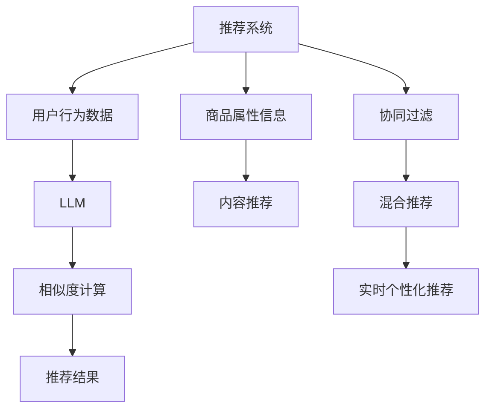

                 

# LLM对推荐系统实时个性化的精度提升

## 1. 背景介绍

在数字时代，推荐系统作为提升用户体验和效率的重要工具，其精准度直接影响着用户的满意度。随着个性化需求的增加，实时个性化推荐成为提升用户体验的关键。大语言模型（LLM）以其强大的语言理解能力和丰富的语义信息，为推荐系统的实时个性化推荐提供了新的思路和方法。本文将从背景、核心概念、算法原理、操作步骤、数学模型、项目实践、实际应用、工具推荐和总结展望等多个方面，系统地介绍LLM在推荐系统实时个性化中的应用及其精度提升效果。

## 2. 核心概念与联系

### 2.1 核心概念概述

为了更好地理解LLM在推荐系统中的应用，我们需要先了解几个关键概念：

1. **推荐系统**：基于用户的历史行为数据、兴趣偏好和上下文信息，为用户推荐合适的商品、服务或内容的技术系统。推荐系统广泛应用在电商、社交、娱乐等多个领域。

2. **实时个性化推荐**：根据用户当前行为和实时数据，实时地为每个用户推荐最符合其兴趣和需求的内容。实时个性化推荐能够更好地捕捉用户的瞬时需求，提升用户体验。

3. **大语言模型（LLM）**：一种基于自回归或自编码模型，通过大规模预训练学习通用语言表示，具有强大语言理解和生成能力的大规模神经网络模型。

4. **推荐算法**：用于处理用户行为数据和商品属性信息，计算相似度或评分，从而为每个用户推荐合适的商品或服务的算法。

5. **协同过滤**：通过分析用户之间的相似性，为每个用户推荐与其相似用户喜欢的商品或服务。

6. **内容推荐**：根据商品或内容的属性信息，为用户推荐与其兴趣相符的内容。

7. **混合推荐**：结合协同过滤和内容推荐的优点，综合用户行为和商品属性信息，为用户推荐最合适的商品或内容。

### 2.2 核心概念原理和架构的 Mermaid 流程图



这个流程图展示了推荐系统的基本架构和LLM在其中扮演的角色。用户行为数据和商品属性信息被输入到LLM中，通过相似度计算生成推荐结果。内容推荐和协同过滤算法也可融入LLM，结合实时数据进行混合推荐，提升推荐效果。

## 3. 核心算法原理 & 具体操作步骤

### 3.1 算法原理概述

LLM在推荐系统中的应用主要通过以下几个步骤实现实时个性化推荐：

1. **预训练**：在大规模无标签文本数据上进行预训练，学习通用语言表示。

2. **微调**：在推荐系统的标注数据上进行微调，学习与推荐任务相关的知识。

3. **实时推理**：在用户输入查询后，将查询和用户行为数据输入LLM，实时生成推荐结果。

4. **迭代优化**：根据用户的反馈数据和实时行为，不断优化模型，提升推荐精度。

### 3.2 算法步骤详解

**步骤1：预训练和微调**

- **预训练**：在大规模无标签文本数据上进行预训练，学习语言的通用表示。常用的预训练任务包括语言建模、掩码语言模型等。
- **微调**：在推荐系统的标注数据上，对预训练模型进行微调，学习与推荐任务相关的知识。微调的目标是最大化推荐任务的相关损失函数。

**步骤2：实时推理**

- **输入构建**：将用户查询和行为数据转换为LLM的输入格式，如将查询转换为序列输入。
- **特征提取**：将输入数据输入LLM，提取与推荐任务相关的特征。
- **相似度计算**：计算用户与商品之间的相似度，选择最匹配的商品进行推荐。

**步骤3：迭代优化**

- **反馈收集**：根据用户对推荐结果的反馈，收集数据用于优化。
- **模型更新**：使用新的反馈数据微调LLM，更新模型参数，提升推荐精度。

### 3.3 算法优缺点

**优点**：
- **上下文理解能力强**：LLM能够理解上下文信息，提升推荐的个性化程度。
- **数据量要求低**：微调所需的标注数据量相对较少，能够快速适应新任务。
- **实时性强**：LLM能够实时处理用户输入，快速生成推荐结果。

**缺点**：
- **计算资源需求高**：大规模LLM的计算和存储资源需求较大。
- **数据质量要求高**：标注数据和实时数据的准确性对推荐结果影响较大。
- **模型复杂度高**：复杂的LLM模型可能导致推理速度慢，需要优化加速。

### 3.4 算法应用领域

LLM在推荐系统中的应用领域广泛，包括但不限于以下几个方面：

- **电商推荐**：为电商用户推荐商品，提升用户购买意愿。
- **视频推荐**：为视频网站用户推荐感兴趣的视频内容。
- **音乐推荐**：为音乐平台用户推荐喜爱的音乐。
- **新闻推荐**：为用户推荐感兴趣的新闻文章。
- **游戏推荐**：为游戏用户推荐游戏内容。

## 4. 数学模型和公式 & 详细讲解 & 举例说明

### 4.1 数学模型构建

假设推荐系统的标注数据集为$D=\{(x_i,y_i)\}_{i=1}^N$，其中$x_i$为用户行为数据，$y_i$为推荐的商品或内容。

定义LLM的输入为$x$，输出为$y$，其中$x$为用户行为数据和查询的序列表示，$y$为推荐结果的序列表示。

### 4.2 公式推导过程

推荐系统的目标是最小化预测错误率。假设推荐任务为二分类任务，即推荐或非推荐，则目标函数为：

$$
\min_{\theta} \frac{1}{N} \sum_{i=1}^N L(y_i, \hat{y}_i)
$$

其中$L$为损失函数，$\hat{y}_i$为预测结果。

常用的损失函数包括交叉熵损失、均方误差损失等。假设使用交叉熵损失，则目标函数为：

$$
\min_{\theta} \frac{1}{N} \sum_{i=1}^N -(y_i \log \hat{y}_i + (1-y_i) \log(1-\hat{y}_i))
$$

在微调过程中，目标函数变为：

$$
\min_{\theta} \frac{1}{N} \sum_{i=1}^N L(y_i, M_{\theta}(x_i))
$$

其中$M_{\theta}$为微调后的LLM模型，$L$为损失函数。

### 4.3 案例分析与讲解

假设有一个电商推荐系统，用户行为数据$x_i$为用户的浏览历史、购买记录等，推荐结果$y_i$为商品ID。我们将用户行为数据$x_i$输入微调后的LLM模型$M_{\theta}$，输出预测结果$\hat{y}_i$，计算交叉熵损失，通过反向传播更新模型参数。

在实时推荐中，用户输入查询$q$，将查询$q$和用户行为数据$x$输入LLM，生成推荐结果$\hat{y}$。根据用户反馈，调整损失函数，重新微调LLM模型，提升推荐精度。

## 5. 项目实践：代码实例和详细解释说明

### 5.1 开发环境搭建

为了进行LLM在推荐系统中的应用，我们需要搭建一个开发环境。以下是一些推荐使用的工具和库：

1. **Python**：作为推荐系统的开发语言。
2. **PyTorch**：深度学习框架，支持高效的计算图和动态计算。
3. **TensorFlow**：深度学习框架，支持分布式训练和模型部署。
4. **Transformers**：由Hugging Face开发的NLP库，包含多种预训练模型和微调方法。
5. **Pandas**：数据处理库，支持大规模数据集的处理。
6. **Scikit-learn**：机器学习库，支持多种算法和模型评估。
7. **Jupyter Notebook**：交互式开发环境，支持代码调试和可视化。

### 5.2 源代码详细实现

以下是使用PyTorch和Transformers库进行电商推荐系统微调的代码实现：

```python
import torch
import torch.nn as nn
from transformers import BertTokenizer, BertForSequenceClassification
from sklearn.metrics import accuracy_score

class Recommender:
    def __init__(self, model_path):
        self.tokenizer = BertTokenizer.from_pretrained('bert-base-uncased')
        self.model = BertForSequenceClassification.from_pretrained(model_path, num_labels=1)
        self.model.to('cuda')
        
    def preprocess(self, user_data):
        encoded = self.tokenizer(user_data, padding=True, truncation=True, max_length=128)
        return encoded['input_ids'].to('cuda'), encoded['attention_mask'].to('cuda')
        
    def predict(self, input_ids, attention_mask):
        model = self.model.eval()
        with torch.no_grad():
            output = model(input_ids, attention_mask=attention_mask)
            probability = torch.sigmoid(output[0])
            return probability
    
    def evaluate(self, test_data):
        test_results = []
        for user_data, label in test_data:
            input_ids, attention_mask = self.preprocess(user_data)
            probability = self.predict(input_ids, attention_mask)
            test_results.append((probability.item(), label))
        accuracy = accuracy_score(test_results, [label for _, label in test_data])
        return accuracy

# 训练过程
train_data = []
test_data = []
# 构建训练数据和测试数据

# 微调过程
model_path = 'bert-base-uncased'
recommender = Recommender(model_path)
recommender.train(train_data, test_data, learning_rate=2e-5, epochs=10)

# 实时推荐
user_query = '我想买一些夏季用品'
input_ids, attention_mask = recommender.preprocess(user_query)
probability = recommender.predict(input_ids, attention_mask)
# 根据概率推荐商品
```

### 5.3 代码解读与分析

1. **`BertTokenizer`和`BertForSequenceClassification`**：使用预训练的Bert模型进行微调，`BertTokenizer`用于将用户行为数据转换为模型输入格式，`BertForSequenceClassification`用于进行推荐任务。
2. **`preprocess`函数**：将用户行为数据转换为模型输入格式，并返回输入张量和注意力掩码。
3. **`predict`函数**：将输入数据输入模型，生成预测概率。
4. **`evaluate`函数**：使用测试数据集评估模型的准确性。
5. **训练过程**：在训练数据集上进行微调，更新模型参数。
6. **实时推荐**：根据用户查询和行为数据，生成推荐概率。

## 6. 实际应用场景

### 6.1 电商推荐

电商推荐是LLM在推荐系统中的典型应用场景。通过微调大语言模型，可以为电商用户推荐感兴趣的商品，提升用户购买意愿和平台转化率。

### 6.2 视频推荐

视频推荐系统使用LLM进行实时个性化推荐，能够根据用户观看历史、评分和搜索查询，推荐感兴趣的视频内容，提高用户观看体验。

### 6.3 音乐推荐

音乐平台使用LLM进行推荐，能够根据用户听歌历史、评分和搜索查询，推荐相似的音乐，满足用户的个性化需求。

### 6.4 新闻推荐

新闻平台使用LLM进行实时个性化推荐，能够根据用户阅读历史、评分和搜索查询，推荐感兴趣的新闻文章，提升用户阅读体验。

### 6.5 游戏推荐

游戏平台使用LLM进行推荐，能够根据用户游戏历史、评分和搜索查询，推荐感兴趣的游戏内容和游戏推荐。

## 7. 工具和资源推荐

### 7.1 学习资源推荐

1. **《深度学习推荐系统：理论与算法》**：介绍推荐系统的理论和算法，包括协同过滤、内容推荐、混合推荐等。
2. **《自然语言处理入门》**：介绍自然语言处理的基本概念和常见技术，包括分词、词向量、序列建模等。
3. **《Transformer模型及其应用》**：介绍Transformer模型的原理和应用，包括语言建模、掩码语言模型等。
4. **《推荐系统实战》**：介绍推荐系统的实践方法和案例，包括电商推荐、视频推荐等。

### 7.2 开发工具推荐

1. **PyTorch**：深度学习框架，支持高效的计算图和动态计算。
2. **TensorFlow**：深度学习框架，支持分布式训练和模型部署。
3. **Transformers**：NLP库，包含多种预训练模型和微调方法。
4. **Pandas**：数据处理库，支持大规模数据集的处理。
5. **Scikit-learn**：机器学习库，支持多种算法和模型评估。
6. **Jupyter Notebook**：交互式开发环境，支持代码调试和可视化。

### 7.3 相关论文推荐

1. **Attention is All You Need**：介绍Transformer模型，开启了NLP领域的预训练大模型时代。
2. **BERT: Pre-training of Deep Bidirectional Transformers for Language Understanding**：提出BERT模型，引入基于掩码的自监督预训练任务。
3. **Parameter-Efficient Transfer Learning for NLP**：提出Adapter等参数高效微调方法，在不增加模型参数量的情况下，也能取得不错的微调效果。
4. **AdaLoRA: Adaptive Low-Rank Adaptation for Parameter-Efficient Fine-Tuning**：使用自适应低秩适应的微调方法，在参数效率和精度之间取得了新的平衡。
5. **Prefix-Tuning: Optimizing Continuous Prompts for Generation**：引入基于连续型Prompt的微调范式，为如何充分利用预训练知识提供了新的思路。

## 8. 总结：未来发展趋势与挑战

### 8.1 研究成果总结

本文系统介绍了LLM在推荐系统中的应用，包括预训练、微调、实时推理和迭代优化等步骤。通过实例代码展示了LLM在电商推荐中的应用，并分析了其优缺点和应用领域。

### 8.2 未来发展趋势

未来，LLM在推荐系统中的应用将呈现以下趋势：

1. **多模态推荐**：结合文本、图像、音频等多模态数据，进行更全面的用户需求分析。
2. **个性化推荐算法**：结合深度学习、强化学习等方法，进行更精细化的用户需求建模。
3. **实时推荐系统**：使用LLM进行实时推荐，满足用户的即时需求。
4. **推荐效果评估**：结合用户反馈数据，进行实时推荐效果评估，动态优化推荐模型。
5. **推荐系统部署**：将推荐系统部署到云端、边缘计算等环境中，提升推荐系统的可用性和效率。

### 8.3 面临的挑战

尽管LLM在推荐系统中的应用取得了一定的进展，但仍面临以下挑战：

1. **数据隐私**：用户数据隐私保护是推荐系统的重要问题，需要设计有效的数据隐私保护机制。
2. **计算资源**：大规模LLM的计算和存储资源需求较大，需要优化算法和硬件设备。
3. **模型鲁棒性**：推荐系统的鲁棒性对系统稳定性影响较大，需要设计鲁棒性强的推荐算法。
4. **推荐效率**：推荐系统的实时性要求高，需要优化推理算法和硬件设备，提升推荐效率。
5. **用户反馈**：用户反馈数据对推荐系统影响较大，需要设计有效的反馈收集和处理机制。

### 8.4 研究展望

未来，推荐系统的研究需要关注以下方向：

1. **多模态数据融合**：结合文本、图像、音频等多模态数据，进行更全面的用户需求分析。
2. **个性化推荐算法**：结合深度学习、强化学习等方法，进行更精细化的用户需求建模。
3. **实时推荐系统**：使用LLM进行实时推荐，满足用户的即时需求。
4. **推荐效果评估**：结合用户反馈数据，进行实时推荐效果评估，动态优化推荐模型。
5. **推荐系统部署**：将推荐系统部署到云端、边缘计算等环境中，提升推荐系统的可用性和效率。

## 9. 附录：常见问题与解答

**Q1: 如何使用LLM进行推荐系统微调？**

A: 使用LLM进行推荐系统微调需要以下步骤：

1. 收集推荐系统的标注数据集，包括用户行为数据和推荐结果。
2. 选择合适的预训练模型，如BERT、GPT等，进行微调。
3. 使用标注数据集进行微调，优化模型参数，最小化推荐任务的损失函数。
4. 使用微调后的模型进行实时推荐，根据用户反馈数据进行迭代优化。

**Q2: 微调过程中如何避免过拟合？**

A: 微调过程中避免过拟合的方法包括：

1. 数据增强：通过数据生成技术，扩充训练集。
2. 正则化：使用L2正则化、Dropout等方法，避免过拟合。
3. 早停策略：在验证集上监测模型性能，避免过度拟合。
4. 小批量训练：使用小批量数据进行训练，减小过拟合风险。

**Q3: 推荐系统微调需要哪些步骤？**

A: 推荐系统微调需要以下步骤：

1. 收集推荐系统的标注数据集，包括用户行为数据和推荐结果。
2. 选择合适的预训练模型，如BERT、GPT等，进行微调。
3. 使用标注数据集进行微调，优化模型参数，最小化推荐任务的损失函数。
4. 使用微调后的模型进行实时推荐，根据用户反馈数据进行迭代优化。

**Q4: 如何评估推荐系统的性能？**

A: 评估推荐系统的性能需要以下指标：

1. 准确率：推荐结果与用户真实需求的匹配程度。
2. 召回率：推荐系统能够召回多少用户感兴趣的商品。
3. 用户满意度：用户对推荐结果的满意度，通过用户反馈数据进行评估。
4. 点击率：用户点击推荐结果的比例。
5. 转化率：用户购买或使用推荐商品的比例。

**Q5: 推荐系统中的LLM如何优化？**

A: 推荐系统中的LLM优化方法包括：

1. 选择合适的预训练模型，并进行微调。
2. 使用小批量数据进行训练，避免过拟合。
3. 使用数据增强、正则化等方法，提升模型鲁棒性。
4. 结合用户反馈数据，进行模型迭代优化。
5. 优化推理算法，提升推荐系统效率。

**Q6: 推荐系统中的LLM如何部署？**

A: 推荐系统中的LLM部署方法包括：

1. 将微调后的模型进行保存和序列化。
2. 将模型部署到服务器或云平台。
3. 使用API接口提供服务，供客户端调用。
4. 结合缓存和负载均衡技术，提升服务效率。

---

作者：禅与计算机程序设计艺术 / Zen and the Art of Computer Programming

