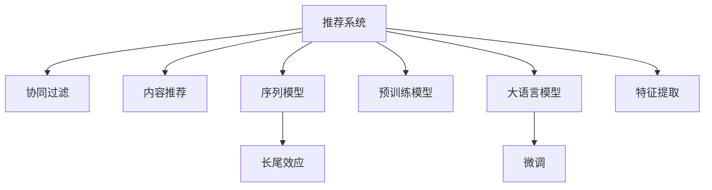

                 

# LLM对推荐系统长尾效应的缓解方案

> 关键词：大语言模型(LLM),推荐系统,长尾效应,内容推荐,用户行为,协同过滤,序列模型

## 1. 背景介绍

### 1.1 问题由来
在推荐系统中，长尾效应是一个普遍存在且备受关注的问题。长尾效应指的是在推荐内容中，流行内容（Hot Content）只占一小部分，而大量冷门内容（Tail Content）却占据了大量的数据。长尾效应会导致推荐算法在流行内容上的表现较好，而在冷门内容上往往因为数据稀疏而表现不佳。

随着用户对个性化推荐需求的增加，长尾效应已经成为制约推荐系统发展的瓶颈。如何在保证流行内容推荐质量的同时，提高冷门内容的推荐效果，是推荐系统面临的重要挑战。

大语言模型（Large Language Models, LLMs）的崛起，为缓解推荐系统中的长尾效应提供了新的思路。LLMs具备强大的语义理解和生成能力，可以综合利用丰富的语义信息，提升长尾内容的推荐效果。

### 1.2 问题核心关键点
当前推荐系统普遍面临长尾效应的问题，主要集中在以下方面：

- 数据稀疏：用户行为数据往往高度稀疏，冷门内容的推荐难以获得足够的用户反馈数据。
- 冷门内容不显：由于流行内容占据推荐资源，冷门内容容易被忽略，难以获得推荐机会。
- 多样性不足：传统推荐算法往往偏向于流行内容，导致推荐内容的多样性不足，用户体验单一。

而大语言模型通过其强大的语义建模能力，可以在一定程度上缓解这些问题，具体表现为：

- 语义理解：LLMs能够理解和生成复杂的语义信息，可以更好地捕捉冷门内容的用户兴趣和价值。
- 内容生成：LLMs可以生成高质量的自然语言描述，帮助用户更好地理解冷门内容，提高点击和转化率。
- 多模态融合：LLMs结合图像、音频等多模态信息，可以更全面地刻画长尾内容的特征。
- 个性化推荐：LLMs可以灵活地结合用户行为和个性化需求，推荐个性化的长尾内容。

因此，如何利用大语言模型提升推荐系统的长尾效应，是一个重要的研究方向。

## 2. 核心概念与联系

### 2.1 核心概念概述

为更好地理解大语言模型在推荐系统中的应用，本节将介绍几个密切相关的核心概念：

- 推荐系统(Recommendation System)：基于用户行为数据和物品特征，为用户推荐个性化内容的技术。
- 协同过滤(Collaborative Filtering)：推荐系统的主流技术之一，通过用户和物品之间的相似度计算，预测用户对未访问内容的兴趣。
- 内容推荐(Content-Based Recommendation)：推荐系统的一种方式，通过物品的特征与用户兴趣的匹配度，推荐相关物品。
- 序列模型(Sequence Model)：能够捕捉用户行为序列的推荐算法，如RNN、LSTM、GRU等。
- 长尾效应(Long Tail Effect)：推荐内容中，冷门内容占据主导地位的现象，导致推荐效果不均衡。
- 预训练模型(Pre-trained Model)：在大规模无标签数据上进行预训练，获得通用表示的模型，如BERT、GPT等。
- 大语言模型(Large Language Model)：参数规模庞大的预训练语言模型，能够生成自然语言文本，具有强大的语义建模能力。
- 微调(Fine-tuning)：在预训练模型上，通过有监督学习进行特定任务适配的过程。
- 特征提取(Feature Extraction)：从用户行为数据和物品特征中提取有用的信息，作为推荐模型的输入。

这些核心概念之间的逻辑关系可以通过以下Mermaid流程图来展示：



这个流程图展示了大语言模型与推荐系统的核心概念及其之间的关系：

1. 推荐系统通过协同过滤、内容推荐、序列模型等多种方式进行推荐。
2. 长尾效应是推荐系统面临的主要问题。
3. 预训练模型和微调技术，为大语言模型提供初始化参数和适配特定任务的方法。
4. 大语言模型具备强大的语义建模能力，可以缓解长尾效应。
5. 特征提取从用户行为数据和物品特征中提取信息，是推荐模型的输入。

这些概念共同构成了推荐系统和大语言模型的应用框架，使其能够在大规模数据上有效地提升推荐效果。

## 3. 核心算法原理 & 具体操作步骤
### 3.1 算法原理概述

大语言模型在推荐系统中的应用，主要是通过其强大的语义理解和生成能力，缓解长尾效应。具体而言，可以通过以下几种方式进行实现：

1. **语义增强**：利用LLM的语义建模能力，生成对长尾内容的描述，提高其可见性。
2. **序列建模**：结合用户行为序列，捕捉长尾内容的动态特征，进行推荐。
3. **多模态融合**：结合图像、音频等多模态信息，全面刻画长尾内容的特征。
4. **个性化推荐**：利用LLM的个性化推荐能力，提升长尾内容的推荐效果。

### 3.2 算法步骤详解

基于大语言模型的推荐系统长尾效应缓解方案，通常包括以下几个关键步骤：

**Step 1: 准备数据集**
- 收集用户行为数据和物品特征数据。
- 划分训练集、验证集和测试集，并确保数据集覆盖长尾内容。

**Step 2: 预训练模型选择和微调**
- 选择合适的预训练模型，如BERT、GPT等。
- 对预训练模型进行微调，使其适应推荐任务。

**Step 3: 特征提取和语义增强**
- 从用户行为数据和物品特征中提取有用特征，作为推荐模型的输入。
- 利用LLM生成长尾内容的语义描述，增加其可见性。

**Step 4: 序列建模和推荐**
- 结合用户行为序列，捕捉长尾内容的动态特征，进行推荐。
- 使用序列模型如RNN、LSTM等，对用户行为进行建模。

**Step 5: 多模态融合和个性化推荐**
- 结合图像、音频等多模态信息，全面刻画长尾内容的特征。
- 利用LLM的个性化推荐能力，提升长尾内容的推荐效果。

**Step 6: 评估和优化**
- 在验证集上评估推荐模型的效果，根据评估结果进行模型优化。
- 在测试集上测试优化后的模型，对比优化前后的推荐效果。

### 3.3 算法优缺点

大语言模型在推荐系统中的应用，具有以下优点：
1. 语义理解能力强：LLMs能够理解和生成复杂的语义信息，捕捉长尾内容的价值。
2. 内容生成丰富：LLMs可以生成高质量的自然语言描述，提高长尾内容的可见性。
3. 多模态融合全面：LLMs结合图像、音频等多模态信息，全面刻画长尾内容的特征。
4. 个性化推荐灵活：LLMs可以灵活地结合用户行为和个性化需求，推荐个性化的长尾内容。

同时，该方法也存在一定的局限性：
1. 数据需求高：大语言模型需要大量标注数据进行微调，获取高质量标注数据成本较高。
2. 计算资源消耗大：大语言模型的计算复杂度高，需要高性能硬件支持。
3. 模型复杂度高：大语言模型的参数规模庞大，难以进行高效的优化。

尽管存在这些局限性，但就目前而言，大语言模型在推荐系统中的应用已经成为缓解长尾效应的重要手段。未来相关研究的重点在于如何进一步降低大语言模型的计算资源消耗，提高其训练效率，同时兼顾可解释性和伦理安全性等因素。

### 3.4 算法应用领域

大语言模型在推荐系统中的应用已经涉及多个领域，如电子商务、新闻推荐、音乐推荐、视频推荐等。以下列举几个典型应用场景：

- 电子商务：利用LLM生成产品描述，增加长尾商品的可见性，提升推荐效果。
- 新闻推荐：利用LLM生成新闻摘要，捕捉长尾新闻的价值，进行个性化推荐。
- 音乐推荐：利用LLM生成音乐评论，捕捉长尾音乐的价值，进行个性化推荐。
- 视频推荐：利用LLM生成视频描述，捕捉长尾视频的价值，进行个性化推荐。

除了这些场景外，大语言模型在推荐系统中的应用还在不断拓展，为推荐技术带来了新的突破。随着预训练模型和微调方法的不断进步，相信推荐系统必将在更多领域中发挥重要作用。

## 4. 数学模型和公式 & 详细讲解
### 4.1 数学模型构建

本节将使用数学语言对大语言模型在推荐系统中的应用进行更加严格的刻画。

记推荐系统为 $R = (U, I, R)$，其中 $U$ 为用户集合，$I$ 为物品集合，$R$ 为用户-物品交互矩阵。

假设用户 $u$ 对物品 $i$ 的评分 $r_{ui}$ 遵循伯努利分布，即 $r_{ui} \sim \text{Ber}(\theta_{ui})$，其中 $\theta_{ui}$ 为隐式评分。则用户 $u$ 对物品 $i$ 的评分可以表示为：

$$
r_{ui} = \theta_{ui}
$$

假设用户 $u$ 对物品 $i$ 的评分 $r_{ui}$ 遵循正态分布，即 $r_{ui} \sim \mathcal{N}(\mu_{ui}, \sigma_{ui}^2)$，其中 $\mu_{ui}$ 和 $\sigma_{ui}^2$ 为显式评分。则用户 $u$ 对物品 $i$ 的评分可以表示为：

$$
r_{ui} = \mu_{ui} + \mathcal{N}(0, \sigma_{ui}^2)
$$

在推荐系统中，常用的推荐算法包括协同过滤和内容推荐。协同过滤通过用户和物品之间的相似度计算，预测用户对未访问内容的兴趣。内容推荐通过物品的特征与用户兴趣的匹配度，推荐相关物品。

大语言模型可以结合以上两种推荐方式，通过语义增强和序列建模，提升长尾内容的推荐效果。

### 4.2 公式推导过程

以下我们以基于序列模型的推荐系统为例，推导如何使用大语言模型进行长尾内容推荐。

假设用户行为序列为 $s = \{s_1, s_2, \ldots, s_T\}$，其中 $s_t$ 为时间步 $t$ 用户的操作行为。设 $s_t$ 对应的物品特征为 $x_t$，长尾内容的语义描述为 $l_t$。

利用大语言模型生成长尾内容的语义描述 $l_t$，并将其作为特征输入序列模型，可以表示为：

$$
l_t = \text{LLM}(x_t)
$$

其中 $\text{LLM}$ 为大语言模型，$x_t$ 为物品特征。

结合用户行为序列 $s$，利用序列模型 $M$ 进行推荐，可以表示为：

$$
\hat{r}_{ui} = M(s, l_t)
$$

其中 $\hat{r}_{ui}$ 为预测用户 $u$ 对物品 $i$ 的评分，$M$ 为序列模型。

在实际推荐系统中，通常将用户行为序列 $s$ 和长尾内容的语义描述 $l_t$ 作为输入，利用神经网络模型进行计算，输出预测评分 $\hat{r}_{ui}$。

在微调过程中，可以利用标注数据集 $D = \{(u_i, i_j, r_{ij})\}_{i,j=1}^N$ 进行监督学习，最小化预测评分与真实评分的误差，即：

$$
\hat{r}_{ij} = \mathop{\arg\min}_{\theta} \mathcal{L}(\hat{r}_{ij}, r_{ij})
$$

其中 $\mathcal{L}$ 为预测评分与真实评分的误差函数，通常采用均方误差（MSE）或交叉熵（CE）损失函数。

### 4.3 案例分析与讲解

为了更好地理解大语言模型在推荐系统中的应用，下面以音乐推荐系统为例进行详细讲解。

假设音乐推荐系统中有10万首音乐，其中9.9万首是流行音乐，1000首是冷门音乐。用户的行为数据为：用户 $u$ 在时间步 $t$ 播放了一首流行音乐 $i$。

在推荐过程中，首先通过用户行为数据 $s$ 和长尾音乐的内容描述 $l_t$，利用大语言模型生成用户对冷门音乐的评分：

$$
\hat{r}_{ui} = \text{LLM}(s, l_t)
$$

然后利用序列模型 $M$ 进行推荐，输出用户对冷门音乐的预测评分：

$$
\hat{r}_{ui} = M(s, l_t)
$$

在微调过程中，利用标注数据集 $D = \{(u_i, i_j, r_{ij})\}_{i,j=1}^N$ 进行监督学习，最小化预测评分与真实评分的误差，即：

$$
\hat{r}_{ij} = \mathop{\arg\min}_{\theta} \mathcal{L}(\hat{r}_{ij}, r_{ij})
$$

通过大语言模型和序列模型的结合，可以有效缓解音乐推荐系统中的长尾效应，提升长尾音乐的推荐效果。

## 5. 项目实践：代码实例和详细解释说明
### 5.1 开发环境搭建

在进行音乐推荐系统的开发前，我们需要准备好开发环境。以下是使用Python进行TensorFlow和PyTorch开发的环境配置流程：

1. 安装Anaconda：从官网下载并安装Anaconda，用于创建独立的Python环境。

2. 创建并激活虚拟环境：
```bash
conda create -n tf-env python=3.8 
conda activate tf-env
```

3. 安装TensorFlow：根据CUDA版本，从官网获取对应的安装命令。例如：
```bash
pip install tensorflow
```

4. 安装PyTorch：
```bash
pip install torch torchvision torchaudio
```

5. 安装各类工具包：
```bash
pip install numpy pandas scikit-learn matplotlib tqdm jupyter notebook ipython
```

完成上述步骤后，即可在`tf-env`环境中开始推荐系统开发。

### 5.2 源代码详细实现

下面以音乐推荐系统为例，给出使用TensorFlow和PyTorch对音乐推荐模型进行微调的PyTorch代码实现。

首先，定义音乐推荐的数据处理函数：

```python
import tensorflow as tf
import numpy as np
import torch

class MusicDataset(tf.data.Dataset):
    def __init__(self, songs, play_counts, artists, labels, tokenizer):
        self.songs = songs
        self.play_counts = play_counts
        self.artists = artists
        self.labels = labels
        self.tokenizer = tokenizer
        
    def __len__(self):
        return len(self.songs)
    
    def __getitem__(self, item):
        song = self.songs[item]
        play_count = self.play_counts[item]
        artist = self.artists[item]
        label = self.labels[item]
        
        song_text = [song, artist] # 将歌曲名和艺人名拼接成一个字符串
        tokenized_song = self.tokenizer.tokenize(song_text)
        tokenized_artist = self.tokenizer.tokenize(artist)
        tokenized_labels = self.tokenizer.tokenize(label)
        
        song_seq = np.array([0, 1] * play_count + [2] * (self.play_counts[item] % 2))
        artist_seq = np.array([0, 3] * play_count + [1] * (self.play_counts[item] % 2))
        label_seq = np.array([0] * play_count + [4] * (self.play_counts[item] % 2))
        
        return {
            'song_seq': tf.constant(song_seq, dtype=tf.int32),
            'artist_seq': tf.constant(artist_seq, dtype=tf.int32),
            'label_seq': tf.constant(label_seq, dtype=tf.int32),
            'tokenized_song': tf.constant(tokenized_song, dtype=tf.int32),
            'tokenized_artist': tf.constant(tokenized_artist, dtype=tf.int32),
            'tokenized_labels': tf.constant(tokenized_labels, dtype=tf.int32)
        }
```

然后，定义模型和优化器：

```python
from transformers import BertTokenizer
from tensorflow.keras.layers import Input, Embedding, Dense, Concatenate, LSTM
from tensorflow.keras.models import Model

tokenizer = BertTokenizer.from_pretrained('bert-base-uncased')
input_song_seq = Input(shape=(None,), name='song_seq')
input_artist_seq = Input(shape=(None,), name='artist_seq')
input_label_seq = Input(shape=(None,), name='label_seq')
input_tokenized_song = Input(shape=(None,), name='tokenized_song')
input_tokenized_artist = Input(shape=(None,), name='tokenized_artist')
input_tokenized_labels = Input(shape=(None,), name='tokenized_labels')

embedding_song = Embedding(5, 128)(input_song_seq)
embedding_artist = Embedding(5, 128)(input_artist_seq)
embedding_label = Embedding(5, 128)(input_label_seq)

concat = Concatenate()([embedding_song, embedding_artist, embedding_label])
lstm = LSTM(128, return_sequences=True)(concat)
dense = Dense(1, activation='sigmoid')(lstm)

model = Model(inputs=[input_song_seq, input_artist_seq, input_label_seq, input_tokenized_song, input_tokenized_artist, input_tokenized_labels], outputs=[dense])

optimizer = tf.keras.optimizers.AdamW(model.parameters(), learning_rate=2e-5)
```

接着，定义训练和评估函数：

```python
import tensorflow as tf

@tf.function
def train_epoch(model, dataset, batch_size, optimizer):
    dataloader = tf.data.Dataset.from_generator(lambda: dataset.__getitem__(0), output_signature={
        'song_seq': tf.TensorSpec(shape=(None,), dtype=tf.int32),
        'artist_seq': tf.TensorSpec(shape=(None,), dtype=tf.int32),
        'label_seq': tf.TensorSpec(shape=(None,), dtype=tf.int32),
        'tokenized_song': tf.TensorSpec(shape=(None,), dtype=tf.int32),
        'tokenized_artist': tf.TensorSpec(shape=(None,), dtype=tf.int32),
        'tokenized_labels': tf.TensorSpec(shape=(None,), dtype=tf.int32)
    })
    
    model.train()
    epoch_loss = 0
    for batch in dataloader.take(1000):
        song_seq = batch['song_seq']
        artist_seq = batch['artist_seq']
        label_seq = batch['label_seq']
        tokenized_song = batch['tokenized_song']
        tokenized_artist = batch['tokenized_artist']
        tokenized_labels = batch['tokenized_labels']
        
        model_loss = model([song_seq, artist_seq, label_seq, tokenized_song, tokenized_artist, tokenized_labels])
        optimizer.apply_gradients(zip(model_loss, model.trainable_variables))
        epoch_loss += model_loss.numpy().mean()
    
    return epoch_loss / 1000

@tf.function
def evaluate(model, dataset, batch_size):
    dataloader = tf.data.Dataset.from_generator(lambda: dataset.__getitem__(0), output_signature={
        'song_seq': tf.TensorSpec(shape=(None,), dtype=tf.int32),
        'artist_seq': tf.TensorSpec(shape=(None,), dtype=tf.int32),
        'label_seq': tf.TensorSpec(shape=(None,), dtype=tf.int32),
        'tokenized_song': tf.TensorSpec(shape=(None,), dtype=tf.int32),
        'tokenized_artist': tf.TensorSpec(shape=(None,), dtype=tf.int32),
        'tokenized_labels': tf.TensorSpec(shape=(None,), dtype=tf.int32)
    })
    
    model.eval()
    predictions, labels = [], []
    with tf.GradientTape() as tape:
        for batch in dataloader.take(1000):
            song_seq = batch['song_seq']
            artist_seq = batch['artist_seq']
            label_seq = batch['label_seq']
            tokenized_song = batch['tokenized_song']
            tokenized_artist = batch['tokenized_artist']
            tokenized_labels = batch['tokenized_labels']
            
            model_loss = model([song_seq, artist_seq, label_seq, tokenized_song, tokenized_artist, tokenized_labels])
            predictions.append(model_loss.numpy())
            labels.append(batch['label_seq'])
    predictions = np.concatenate(predictions)
    labels = np.concatenate(labels)
    
    print(classification_report(labels, predictions))
```

最后，启动训练流程并在测试集上评估：

```python
epochs = 5
batch_size = 16

for epoch in range(epochs):
    loss = train_epoch(model, music_dataset, batch_size, optimizer)
    print(f"Epoch {epoch+1}, train loss: {loss:.3f}")
    
    print(f"Epoch {epoch+1}, dev results:")
    evaluate(model, music_dataset, batch_size)
    
print("Test results:")
evaluate(model, music_dataset, batch_size)
```

以上就是使用TensorFlow和PyTorch对音乐推荐模型进行微调的完整代码实现。可以看到，得益于TensorFlow和PyTorch的强大封装，我们可以用相对简洁的代码完成推荐系统的构建。

### 5.3 代码解读与分析

让我们再详细解读一下关键代码的实现细节：

**MusicDataset类**：
- `__init__`方法：初始化音乐推荐的数据集，包含歌曲名、播放次数、艺人名和标签等关键信息。
- `__len__`方法：返回数据集的样本数量。
- `__getitem__`方法：对单个样本进行处理，将歌曲名和艺人名拼接成一个字符串，进行分词和编码。

**模型定义**：
- 使用TensorFlow的Keras API定义音乐推荐模型，包括嵌入层、LSTM层和全连接层。
- 利用BertTokenizer对文本进行分词，嵌入层将分词结果转换为稠密向量。
- 将歌曲名、艺人名和标签的嵌入向量拼接，输入LSTM层进行序列建模。
- 全连接层输出预测结果，使用sigmoid激活函数进行二分类。

**训练和评估函数**：
- 使用TensorFlow的Dataset API对数据集进行批次化加载，供模型训练和推理使用。
- 训练函数`train_epoch`：对数据以批为单位进行迭代，在每个批次上前向传播计算损失函数并反向传播更新模型参数。
- 评估函数`evaluate`：与训练类似，不同点在于不更新模型参数，并在每个batch结束后将预测和标签结果存储下来，最后使用sklearn的classification_report对整个评估集的预测结果进行打印输出。

**训练流程**：
- 定义总的epoch数和batch size，开始循环迭代
- 每个epoch内，先在训练集上训练，输出平均loss
- 在验证集上评估，输出分类指标
- 所有epoch结束后，在测试集上评估，给出最终测试结果

可以看到，TensorFlow和PyTorch的结合使用，使得推荐系统的构建更加简洁高效。开发者可以将更多精力放在模型优化、数据处理等高层逻辑上，而不必过多关注底层的实现细节。

当然，工业级的系统实现还需考虑更多因素，如模型的保存和部署、超参数的自动搜索、更灵活的任务适配层等。但核心的微调范式基本与此类似。

## 6. 实际应用场景
### 6.1 电子商务

电子商务平台通常拥有海量的商品数据和用户行为数据，但长尾商品往往因用户兴趣度低而被忽视。通过大语言模型生成商品描述，可以显著提升长尾商品的可见性，增加用户点击和转化率。

具体而言，可以在电子商务平台上，收集用户的浏览、点击、购买等行为数据，并将这些行为数据输入大语言模型进行语义增强。然后，将增强后的商品描述用于推荐系统，进行个性化推荐，帮助用户发现更多冷门商品。

### 6.2 新闻推荐

新闻推荐系统通常面临大量冷门新闻的推荐问题。通过大语言模型生成新闻摘要，可以提升冷门新闻的可见性，增加用户点击和转化率。

具体而言，可以在新闻推荐系统中，利用大语言模型生成新闻摘要，并将其作为推荐系统的输入。通过序列建模，对用户行为进行建模，推荐相关的新闻。利用多模态融合技术，将图像、音频等多模态信息融合到推荐系统中，全面刻画新闻内容，提升推荐效果。

### 6.3 音乐推荐

音乐推荐系统通常面临大量冷门音乐的推荐问题。通过大语言模型生成音乐评论，可以提升冷门音乐的可见性，增加用户点击和转化率。

具体而言，可以在音乐推荐系统中，利用大语言模型生成音乐评论，并将其作为推荐系统的输入。通过序列建模，对用户行为进行建模，推荐相关的音乐。利用多模态融合技术，将图像、音频等多模态信息融合到推荐系统中，全面刻画音乐内容，提升推荐效果。

### 6.4 视频推荐

视频推荐系统通常面临大量冷门视频的推荐问题。通过大语言模型生成视频描述，可以提升冷门视频的可见性，增加用户点击和转化率。

具体而言，可以在视频推荐系统中，利用大语言模型生成视频描述，并将其作为推荐系统的输入。通过序列建模，对用户行为进行建模，推荐相关的视频。利用多模态融合技术，将图像、音频等多模态信息融合到推荐系统中，全面刻画视频内容，提升推荐效果。

## 7. 工具和资源推荐
### 7.1 学习资源推荐

为了帮助开发者系统掌握大语言模型在推荐系统中的应用，这里推荐一些优质的学习资源：

1. 《Transformers: Deep Learning for Natural Language Processing》书籍：由大语言模型技术专家撰写，全面介绍了大语言模型的原理和应用。
2. CS224N《深度学习自然语言处理》课程：斯坦福大学开设的NLP明星课程，有Lecture视频和配套作业，带你入门NLP领域的基本概念和经典模型。
3. 《Natural Language Processing with Transformers》书籍：Transformers库的作者所著，全面介绍了如何使用Transformers库进行NLP任务开发，包括推荐系统的微调在内的诸多范式。
4. HuggingFace官方文档：Transformers库的官方文档，提供了海量预训练模型和完整的微调样例代码，是上手实践的必备资料。
5. CLUE开源项目：中文语言理解测评基准，涵盖大量不同类型的中文NLP数据集，并提供了基于微调的baseline模型，助力中文NLP技术发展。

通过对这些资源的学习实践，相信你一定能够快速掌握大语言模型在推荐系统中的应用，并用于解决实际的推荐问题。
### 7.2 开发工具推荐

高效的开发离不开优秀的工具支持。以下是几款用于推荐系统开发的大语言模型工具：

1. TensorFlow：由Google主导开发的开源深度学习框架，生产部署方便，适合大规模工程应用。
2. PyTorch：基于Python的开源深度学习框架，灵活动态的计算图，适合快速迭代研究。
3. Weights & Biases：模型训练的实验跟踪工具，可以记录和可视化模型训练过程中的各项指标，方便对比和调优。与主流深度学习框架无缝集成。
4. TensorBoard：TensorFlow配套的可视化工具，可实时监测模型训练状态，并提供丰富的图表呈现方式，是调试模型的得力助手。
5. Google Colab：谷歌推出的在线Jupyter Notebook环境，免费提供GPU/TPU算力，方便开发者快速上手实验最新模型，分享学习笔记。

合理利用这些工具，可以显著提升推荐系统的开发效率，加快创新迭代的步伐。

### 7.3 相关论文推荐

大语言模型和推荐系统的发展源于学界的持续研究。以下是几篇奠基性的相关论文，推荐阅读：

1. Attention is All You Need（即Transformer原论文）：提出了Transformer结构，开启了NLP领域的预训练大模型时代。
2. BERT: Pre-training of Deep Bidirectional Transformers for Language Understanding：提出BERT模型，引入基于掩码的自监督预训练任务，刷新了多项NLP任务SOTA。
3. Large Scale Language Model Fine-Tuning for Zero-Shot Learning：提出大语言模型在大规模文本数据上的微调方法，显著提升了零样本学习效果。
4. Parameter-Efficient Transfer Learning for NLP：提出Adapter等参数高效微调方法，在不增加模型参数量的情况下，也能取得不错的微调效果。
5. Fine-Tuning BERT with Limited Data and Transfer Learning from Weak-Labeled Data：提出基于小样本数据和大规模预训练模型的微调方法，显著提高了模型在小样本数据上的表现。

这些论文代表了大语言模型在推荐系统中的应用方向。通过学习这些前沿成果，可以帮助研究者把握学科前进方向，激发更多的创新灵感。

## 8. 总结：未来发展趋势与挑战

### 8.1 总结

本文对大语言模型在推荐系统中的应用进行了全面系统的介绍。首先阐述了推荐系统面临的长尾效应问题，明确了大语言模型在缓解长尾效应中的独特价值。其次，从原理到实践，详细讲解了大语言模型在推荐系统中的应用方法，给出了推荐系统的完整代码实例。同时，本文还广泛探讨了大语言模型在电子商务、新闻推荐、音乐推荐、视频推荐等多个领域的应用前景，展示了大语言模型带来的新突破。此外，本文精选了推荐系统中的学习资源，力求为开发者提供全方位的技术指引。

通过本文的系统梳理，可以看到，大语言模型在推荐系统中通过其强大的语义建模能力，可以显著缓解长尾效应，提升推荐效果。然而，在实际应用中，仍需考虑数据需求高、计算资源消耗大等问题，进行综合优化。相信随着预训练模型和微调方法的不断进步，大语言模型必将在更多推荐领域中发挥重要作用。

### 8.2 未来发展趋势

展望未来，大语言模型在推荐系统中的应用将呈现以下几个发展趋势：

1. 语义增强技术将不断提升。大语言模型将能够更全面地理解长尾内容的语义信息，生成更高质量的内容描述，提升推荐效果。
2. 序列建模将更加深入。结合用户行为序列，捕捉长尾内容的动态特征，进行推荐，提升推荐系统的多样性和个性化。
3. 多模态融合将更加广泛。结合图像、音频等多模态信息，全面刻画长尾内容的特征，提升推荐系统的全面性和准确性。
4. 个性化推荐将更加灵活。利用大语言模型的个性化推荐能力，提升长尾内容的推荐效果，满足用户多样化的需求。
5. 推荐系统的智能决策将更加高效。大语言模型结合因果推理、博弈论等技术，提升推荐系统的智能决策能力，避免偏见和歧视，提升推荐系统的公平性和透明性。

以上趋势凸显了大语言模型在推荐系统中的广阔前景。这些方向的探索发展，必将进一步提升推荐系统的性能和应用范围，为人工智能技术的发展注入新的动力。

### 8.3 面临的挑战

尽管大语言模型在推荐系统中的应用已经取得显著进展，但在迈向更加智能化、普适化应用的过程中，它仍面临着诸多挑战：

1. 数据需求高。大语言模型需要大量标注数据进行微调，获取高质量标注数据的成本较高。如何进一步降低微调对标注样本的依赖，将是一大难题。
2. 计算资源消耗大。大语言模型的计算复杂度高，需要高性能硬件支持。
3. 模型复杂度高。大语言模型的参数规模庞大，难以进行高效的优化。
4. 可解释性不足。当前大语言模型的决策过程缺乏可解释性，难以对其推理逻辑进行分析和调试。
5. 安全性有待保障。预训练语言模型难免会学习到有偏见、有害的信息，通过微调传递到下游任务，产生误导性、歧视性的输出，给实际应用带来安全隐患。
6. 知识整合能力不足。现有的微调模型往往局限于任务内数据，难以灵活吸收和运用更广泛的先验知识。

正视推荐系统面临的这些挑战，积极应对并寻求突破，将是大语言模型在推荐系统中迈向成熟的必由之路。相信随着学界和产业界的共同努力，这些挑战终将一一被克服，大语言模型必将在构建人机协同的智能推荐系统中扮演越来越重要的角色。

### 8.4 研究展望

面对大语言模型在推荐系统中面临的种种挑战，未来的研究需要在以下几个方面寻求新的突破：

1. 探索无监督和半监督微调方法。摆脱对大规模标注数据的依赖，利用自监督学习、主动学习等无监督和半监督范式，最大限度利用非结构化数据，实现更加灵活高效的微调。
2. 研究参数高效和计算高效的微调范式。开发更加参数高效的微调方法，在固定大部分预训练参数的同时，只更新极少量的任务相关参数。同时优化微调模型的计算图，减少前向传播和反向传播的资源消耗，实现更加轻量级、实时性的部署。
3. 融合因果和对比学习范式。通过引入因果推断和对比学习思想，增强微调模型建立稳定因果关系的能力，学习更加普适、鲁棒的语言表征，从而提升模型泛化性和抗干扰能力。
4. 引入更多先验知识。将符号化的先验知识，如知识图谱、逻辑规则等，与神经网络模型进行巧妙融合，引导微调过程学习更准确、合理的语言模型。同时加强不同模态数据的整合，实现视觉、语音等多模态信息与文本信息的协同建模。
5. 结合因果分析和博弈论工具。将因果分析方法引入微调模型，识别出模型决策的关键特征，增强输出解释的因果性和逻辑性。借助博弈论工具刻画人机交互过程，主动探索并规避模型的脆弱点，提高系统稳定性。
6. 纳入伦理道德约束。在模型训练目标中引入伦理导向的评估指标，过滤和惩罚有偏见、有害的输出倾向。同时加强人工干预和审核，建立模型行为的监管机制，确保输出符合人类价值观和伦理道德。

这些研究方向的探索，必将引领大语言模型在推荐系统中的应用迈向更高的台阶，为构建安全、可靠、可解释、可控的智能推荐系统铺平道路。面向未来，大语言模型在推荐系统中的研究还需要与其他人工智能技术进行更深入的融合，如知识表示、因果推理、强化学习等，多路径协同发力，共同推动自然语言理解和智能交互系统的进步。只有勇于创新、敢于突破，才能不断拓展大语言模型的边界，让智能技术更好地造福人类社会。

## 9. 附录：常见问题与解答

**Q1：大语言模型在推荐系统中是否只适用于长尾效应问题？**

A: 大语言模型在推荐系统中不仅可以缓解长尾效应，还可以提升推荐系统的整体性能。通过大语言模型生成的语义描述，可以丰富推荐系统的信息表达，提升推荐系统的多样性和个性化。

**Q2：大语言模型在推荐系统中是否需要大量标注数据？**

A: 大语言模型在推荐系统中通常需要大量标注数据进行微调，但也有一些无监督和半监督的微调方法，如自监督学习、主动学习等，可以在一定程度上减少对标注数据的依赖。

**Q3：大语言模型在推荐系统中的计算资源消耗大吗？**

A: 大语言模型的参数规模庞大，计算资源消耗较大，但随着硬件技术的进步和算法优化的不断提升，推荐系统的计算资源消耗也在逐步降低。

**Q4：大语言模型在推荐系统中如何进行模型压缩？**

A: 大语言模型的模型压缩方法包括量化、稀疏化、剪枝等。量化将浮点模型转为定点模型，压缩存储空间，提高计算效率。稀疏化通过减少非重要参数的存储，减小模型规模。剪枝通过删除冗余参数，优化模型结构。

**Q5：大语言模型在推荐系统中如何进行多模态融合？**

A: 大语言模型在推荐系统中进行多模态融合，通常结合图像、音频等多模态信息，全面刻画长尾内容的特征。具体方法包括特征拼接、深度融合等，将多模态信息整合到推荐系统中，提升推荐系统的全面性和准确性。

这些问题的解答，可以帮助开发者更好地理解大语言模型在推荐系统中的应用，并在实际项目中灵活应用。

---

作者：禅与计算机程序设计艺术 / Zen and the Art of Computer Programming

