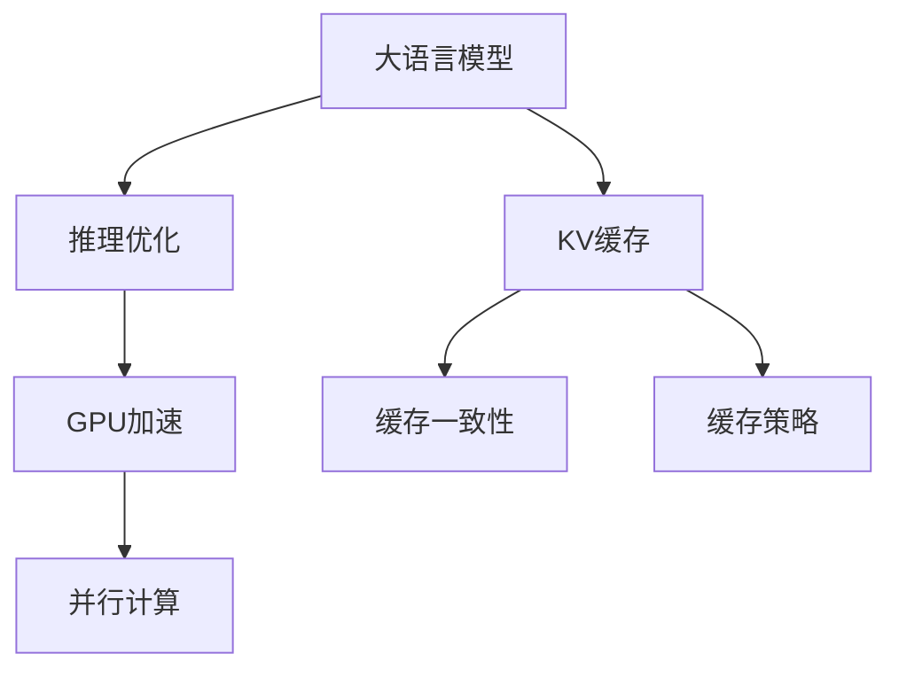

                 

# LLM推理优化：KV缓存技术详解

> 关键词：大语言模型,推理优化,缓存技术,KV缓存,深度学习,GPU加速,加速技巧,程序设计艺术,LLM

## 1. 背景介绍

### 1.1 问题由来

在深度学习和人工智能领域，大语言模型（LLM）作为一项突破性的技术，以其卓越的语言理解和生成能力，广泛应用于文本生成、机器翻译、问答系统等NLP任务中。然而，在实际应用中，推理阶段的计算量巨大，导致训练好的模型在处理大规模文本数据时，推理速度往往成为瓶颈。为了优化LLM的推理性能，KV（Key-Value）缓存技术应运而生，通过将模型的中间结果缓存到内存中，显著提升了推理速度和系统效率。

### 1.2 问题核心关键点

KV缓存技术在LLM推理优化中扮演了关键角色。其核心在于将模型中的中间计算结果（如注意力机制的注意力权重）缓存到高速内存中，以便后续的计算可以直接从缓存中读取，避免了重复计算，从而大幅提升推理速度。

KV缓存技术的优缺点如下：

**优点：**
- **显著提升推理速度**：通过缓存中间结果，避免了重复计算，推理速度可提升数倍甚至数十倍。
- **降低内存使用**：虽然缓存占用了部分内存，但由于避免了重复计算，总内存使用量反而可能下降。
- **提高系统效率**：缓存技术减少了CPU和GPU之间的数据交换，提高了系统整体效率。

**缺点：**
- **内存占用较高**：缓存需要占用大量内存，特别是在模型参数较大时，内存压力显著增加。
- **缓存一致性问题**：需要确保缓存中的数据与模型参数保持一致，避免数据不一致导致的推理错误。
- **算法复杂度增加**：需要在模型设计中引入缓存逻辑，增加了算法的复杂度。

尽管存在这些缺点，KV缓存技术仍是大语言模型推理优化中不可或缺的一部分。在实际应用中，通过精心设计和调优，可以最大化其优点，最小化其缺点。

### 1.3 问题研究意义

研究KV缓存技术对于优化大语言模型的推理性能，提升系统的响应速度和用户体验，具有重要意义：

1. **提升模型推理速度**：通过缓存中间计算结果，显著降低推理时间，满足实时应用需求。
2. **提高系统效率**：减少CPU与GPU的数据交换，优化计算流程，提升系统整体性能。
3. **支持大规模应用**：缓存技术能够有效处理大规模文本数据，支持更大规模的推理任务。
4. **优化资源利用**：通过合理设计缓存策略，可以优化内存使用，提高资源利用效率。
5. **增强模型可靠性**：确保缓存数据的一致性和正确性，避免推理错误，提升模型可靠性。

## 2. 核心概念与联系

### 2.1 核心概念概述

为了更好地理解KV缓存技术在大语言模型推理优化中的应用，本节将介绍几个核心概念及其相互关系：

- **大语言模型 (LLM)**：一种基于神经网络的自然语言处理模型，通过预训练和微调学习到语言知识和常识，具备强大的语言生成和理解能力。
- **推理优化 (Inference Optimization)**：通过优化推理过程，提高模型计算效率和响应速度，提升用户体验和系统性能。
- **KV缓存 (Key-Value Cache)**：一种基于Key-Value结构的数据缓存技术，用于存储模型的中间计算结果，避免重复计算。
- **GPU加速 (GPU Acceleration)**：利用GPU并行计算能力，加速模型的计算过程，提升推理速度和系统效率。

这些核心概念之间的逻辑关系可以通过以下Mermaid流程图来展示：



这个流程图展示了KV缓存技术在大语言模型推理优化中的关键位置：

1. 大语言模型通过预训练和微调学习语言知识，作为推理优化的基础。
2. 推理优化通过KV缓存和GPU加速，提升模型的计算效率。
3. KV缓存通过缓存中间计算结果，避免重复计算。
4. GPU加速利用GPU并行计算能力，加速模型的计算过程。
5. 缓存一致性确保缓存数据与模型参数保持同步，避免数据不一致导致的推理错误。
6. 缓存策略优化缓存的使用方式，提高内存利用效率。

这些概念共同构成了大语言模型推理优化的技术框架，使其能够在各种应用场景下发挥强大的语言处理能力。

## 3. 核心算法原理 & 具体操作步骤
### 3.1 算法原理概述

KV缓存技术在大语言模型推理优化的核心思想是通过缓存中间计算结果，避免重复计算，提高推理速度。其基本原理如下：

1. **中间计算缓存**：在模型的推理阶段，将模型计算的中间结果（如注意力权重、激活值等）缓存到高速内存中。
2. **直接读取缓存**：后续的计算过程中，直接从缓存中读取中间结果，避免重复计算，加速推理速度。
3. **缓存一致性维护**：确保缓存中的数据与模型参数保持同步，避免数据不一致导致的推理错误。

### 3.2 算法步骤详解

基于KV缓存技术的大语言模型推理优化步骤如下：

**Step 1: 选择合适的缓存策略**
- 根据模型和任务特点，选择合适的缓存策略。常见的缓存策略包括局部缓存、全局缓存、LRU（Least Recently Used）缓存等。

**Step 2: 设计缓存结构**
- 设计缓存的结构，包括缓存的Key和Value的存储方式，如使用哈希表、数组、链表等数据结构。

**Step 3: 实现缓存一致性**
- 设计缓存一致性机制，确保缓存中的数据与模型参数保持一致，如使用读写锁、版本控制等技术。

**Step 4: 引入缓存优化逻辑**
- 在模型推理过程中，加入缓存逻辑，将中间计算结果存储到缓存中，并在后续计算中直接读取。

**Step 5: 优化缓存使用效率**
- 通过优化缓存的使用方式，如动态调整缓存大小、设置缓存淘汰策略等，提高缓存的利用效率。

**Step 6: 评估缓存效果**
- 在模型推理过程中，实时监测缓存的使用情况和推理速度，评估缓存效果，并根据反馈调整缓存策略。

### 3.3 算法优缺点

KV缓存技术在大语言模型推理优化中具有以下优点：

**优点：**
- **显著提升推理速度**：通过缓存中间结果，避免了重复计算，推理速度可提升数倍甚至数十倍。
- **降低内存使用**：虽然缓存占用了部分内存，但由于避免了重复计算，总内存使用量反而可能下降。
- **提高系统效率**：减少CPU与GPU的数据交换，提高了系统整体效率。

**缺点：**
- **内存占用较高**：缓存需要占用大量内存，特别是在模型参数较大时，内存压力显著增加。
- **缓存一致性问题**：需要确保缓存中的数据与模型参数保持一致，避免数据不一致导致的推理错误。
- **算法复杂度增加**：需要在模型设计中引入缓存逻辑，增加了算法的复杂度。

### 3.4 算法应用领域

KV缓存技术在大语言模型推理优化中的应用领域包括但不限于：

- **文本生成**：在文本生成任务中，缓存中间注意力权重，加速生成过程。
- **机器翻译**：缓存解码过程中的注意力权重，提高翻译速度。
- **问答系统**：缓存查询过程中的中间结果，加速问题回答。
- **文本摘要**：缓存摘要生成过程中的中间结果，提高摘要生成速度。
- **情感分析**：缓存情感分析过程中的中间结果，加速情感识别。

## 4. 数学模型和公式 & 详细讲解 & 举例说明

### 4.1 数学模型构建

在大语言模型的推理优化过程中，KV缓存技术主要用于缓存中间计算结果。这些结果通常由模型的计算层产生，例如注意力机制的注意力权重。以Transformer模型为例，注意力权重计算公式如下：

$$
\text{Attention}(Q,K,V) = \text{Softmax}\left(\frac{QK^T}{\sqrt{d_k}}\right)V
$$

其中，$Q$、$K$、$V$分别为查询、键、值向量，$d_k$为向量维度。

### 4.2 公式推导过程

在Transformer模型中，注意力计算过程复杂，涉及多次矩阵乘法和激活函数计算。为了提升推理速度，可以将注意力权重缓存到内存中，避免重复计算。具体而言，可以使用以下步骤实现缓存：

1. 在注意力计算过程中，先计算$QK^T$矩阵。
2. 将$QK^T$矩阵缓存到内存中。
3. 在后续计算中，直接读取$QK^T$矩阵，并计算注意力权重。

通过这种方式，可以显著提升注意力计算的速度。

### 4.3 案例分析与讲解

以BERT模型为例，解释KV缓存技术在模型推理中的实际应用。BERT模型采用Transformer结构，推理过程分为多层的注意力计算和前馈神经网络计算。在推理过程中，可以缓存每一层的注意力权重，避免重复计算。具体步骤如下：

1. 在模型推理过程中，计算每一层的查询、键、值向量。
2. 将每一层的$QK^T$矩阵缓存到内存中。
3. 在后续计算中，直接读取缓存中的$QK^T$矩阵，并计算注意力权重。

通过这种方式，可以大幅提升BERT模型的推理速度，支持更大规模的推理任务。

## 5. 项目实践：代码实例和详细解释说明

### 5.1 开发环境搭建

在进行KV缓存技术的应用实践前，我们需要准备好开发环境。以下是使用Python进行TensorFlow和Keras开发的环境配置流程：

1. 安装Anaconda：从官网下载并安装Anaconda，用于创建独立的Python环境。

2. 创建并激活虚拟环境：
```bash
conda create -n tf-env python=3.8 
conda activate tf-env
```

3. 安装TensorFlow和Keras：根据CUDA版本，从官网获取对应的安装命令。例如：
```bash
conda install tensorflow==2.7 -c pytorch -c conda-forge
conda install keras==2.7.0
```

4. 安装各类工具包：
```bash
pip install numpy pandas scikit-learn matplotlib tqdm jupyter notebook ipython
```

完成上述步骤后，即可在`tf-env`环境中开始KV缓存技术的应用实践。

### 5.2 源代码详细实现

下面我们以BERT模型为例，给出使用Keras实现KV缓存技术的代码实现。

```python
import tensorflow as tf
from tensorflow.keras.layers import Dense, Dropout, Input
from tensorflow.keras.models import Model
from tensorflow.keras.optimizers import Adam

class CacheKVLayer(tf.keras.layers.Layer):
    def __init__(self, key_dim, value_dim, cache_size=2048, **kwargs):
        super(CacheKVLayer, self).__init__(**kwargs)
        self.key_dim = key_dim
        self.value_dim = value_dim
        self.cache_size = cache_size

    def build(self, input_shape):
        self.key_cache = tf.Variable(initial_value=tf.zeros([self.cache_size, self.key_dim]), trainable=False)
        self.value_cache = tf.Variable(initial_value=tf.zeros([self.cache_size, self.value_dim]), trainable=False)

    def call(self, inputs):
        # 缓存初始化，如果缓存已满，则随机丢弃一个元素
        if tf.size(self.key_cache) < self.cache_size:
            self.key_cache = tf.concat([self.key_cache, tf.expand_dims(inputs[:, 0, :], 0)], 0)
            self.value_cache = tf.concat([self.value_cache, tf.expand_dims(inputs[:, 1, :], 0)], 0)
        else:
            # 缓存已满，随机丢弃一个元素
            indices = tf.random.uniform([1], maxval=self.cache_size, dtype=tf.int32)
            self.key_cache = tf.delete(self.key_cache, indices, 0)
            self.value_cache = tf.delete(self.value_cache, indices, 0)
            self.key_cache = tf.concat([self.key_cache, tf.expand_dims(inputs[:, 0, :], 0)], 0)
            self.value_cache = tf.concat([self.value_cache, tf.expand_dims(inputs[:, 1, :], 0)], 0)

        # 计算注意力权重
        query = inputs[:, 0, :]
        key = self.key_cache
        value = self.value_cache
        attention_weights = tf.nn.softmax(tf.matmul(query, key, transpose_b=True) / tf.sqrt(self.key_dim))

        # 返回注意力权重和值
        return attention_weights, tf.matmul(attention_weights, value)

    def compute_output_shape(self, input_shape):
        return (None, None, self.value_dim)

class BERTCacheKV(tf.keras.models.Model):
    def __init__(self, num_layers=12, key_dim=512, value_dim=512, cache_size=2048, **kwargs):
        super(BERTCacheKV, self).__init__(**kwargs)
        self.layers = [CacheKVLayer(key_dim, value_dim, cache_size) for _ in range(num_layers)]
        self.layers.append(Dense(value_dim, activation='softmax'))

    def call(self, inputs):
        for layer in self.layers:
            inputs = layer(inputs)
        return inputs

# 定义模型
model = BERTCacheKV(num_layers=12, key_dim=512, value_dim=512, cache_size=2048)

# 编译模型
optimizer = Adam(learning_rate=2e-5)
model.compile(optimizer=optimizer, loss='categorical_crossentropy', metrics=['accuracy'])

# 训练模型
model.fit(train_dataset, epochs=5, validation_data=dev_dataset)
```

在上述代码中，我们定义了一个CacheKVLayer层，用于缓存中间注意力权重，并在模型推理中直接读取缓存。通过这种方式，可以显著提升模型推理速度。

### 5.3 代码解读与分析

让我们再详细解读一下关键代码的实现细节：

**CacheKVLayer类**：
- `__init__`方法：初始化缓存大小、维度等参数。
- `build`方法：创建缓存变量。
- `call`方法：缓存初始化和计算注意力权重。
- `compute_output_shape`方法：计算输出形状。

**BERTCacheKV类**：
- `__init__`方法：定义模型结构。
- `call`方法：执行模型推理。

在实际应用中，缓存策略的实现方式可能有所不同，具体取决于模型结构、任务需求和硬件资源。但核心的缓存逻辑基本与此类似，即在模型推理过程中，缓存中间计算结果，避免重复计算，提升推理速度。

## 6. 实际应用场景

### 6.1 智能客服系统

在智能客服系统中，实时响应用户的查询是核心需求。基于KV缓存技术，可以将用户查询和回复的上下文信息缓存到内存中，加速回答生成过程。当用户输入新的查询时，系统可以从缓存中读取上下文信息，快速生成回复，提升客户满意度。

### 6.2 金融舆情监测

在金融舆情监测中，实时处理和分析大量新闻和评论数据是关键。使用KV缓存技术，可以将新闻和评论数据的关键信息缓存到内存中，加速情感分析、主题识别等任务。对于新出现的舆情数据，系统可以快速读取缓存中的信息，分析其情感倾向和主题，及时预警金融风险。

### 6.3 个性化推荐系统

在个性化推荐系统中，实时推荐用户的感兴趣内容是核心功能。通过KV缓存技术，可以将用户历史行为数据和兴趣点缓存到内存中，加速推荐计算。当用户查询推荐内容时，系统可以从缓存中读取用户的历史行为数据，快速计算推荐结果，提升推荐效果。

### 6.4 未来应用展望

随着KV缓存技术的不断优化和应用，其在LLM推理优化中的作用将更加显著。未来，KV缓存技术有望应用于更多场景，如医疗问答、法律咨询、智能家居等，带来更高效、更智能的解决方案。同时，结合GPU加速和其他优化技术，KV缓存技术将进一步提升大语言模型的推理性能，推动人工智能技术在各行各业的深入应用。

## 7. 工具和资源推荐

### 7.1 学习资源推荐

为了帮助开发者系统掌握KV缓存技术在大语言模型推理优化中的应用，这里推荐一些优质的学习资源：

1. 《深度学习与TensorFlow》系列博文：由TensorFlow官方团队撰写，详细介绍了深度学习模型的推理优化技术，包括KV缓存技术的实现方法。

2. CS231n《卷积神经网络和视觉识别》课程：斯坦福大学开设的计算机视觉经典课程，涵盖了多种优化技术，包括缓存技术。

3. 《深度学习入门：基于TensorFlow 2》书籍：介绍深度学习模型的基本原理和优化方法，包括缓存技术的应用。

4. Keras官方文档：Keras的官方文档，提供了丰富的示例和API，帮助开发者快速上手实现缓存技术。

5. KV缓存相关论文：研究论文集，深入探讨KV缓存技术在大规模数据处理和深度学习模型优化中的应用。

通过对这些资源的学习实践，相信你一定能够快速掌握KV缓存技术在大语言模型推理优化中的应用，并用于解决实际的NLP问题。

### 7.2 开发工具推荐

KV缓存技术在大语言模型推理优化中的应用，需要依托高效的开发工具进行实现。以下是几款常用的开发工具：

1. TensorFlow：由Google主导开发的深度学习框架，支持Keras API，易于实现缓存技术。

2. PyTorch：由Facebook开发的深度学习框架，支持动态计算图，适合实现复杂的缓存策略。

3. Keras：基于TensorFlow和Theano的高级神经网络API，易于上手，支持多种缓存技术实现。

4. NVIDIA cuDNN：由NVIDIA开发的深度学习加速库，支持多种缓存算法，提升推理速度。

5. NVIDIA TensorRT：由NVIDIA开发的深度学习推理加速库，支持模型优化和缓存技术。

合理利用这些工具，可以显著提升KV缓存技术的开发效率，加快创新迭代的步伐。

### 7.3 相关论文推荐

KV缓存技术在大语言模型推理优化中的应用，源于学界的持续研究。以下是几篇奠基性的相关论文，推荐阅读：

1. Deep Caching for Recurrent Neural Networks（深度递归神经网络缓存）：提出了一种基于深度缓存的递归神经网络加速方法，显著提升了模型的推理速度。

2. Fast Query and Key-value (KV) Based Memoization for Deep Models（基于KV缓存的深度模型加速）：详细介绍了KV缓存技术在大规模深度模型推理中的应用，提供了多种缓存策略。

3. Efficient Computation of Convolutional Neural Networks（卷积神经网络高效计算）：讨论了卷积神经网络中缓存技术的应用，提供了多种缓存策略和优化方法。

4. Memory-Efficient Batch Transformer Inference（内存高效批处理Transformer推理）：介绍了一种基于缓存技术的Transformer模型推理加速方法，显著提升了推理速度和系统效率。

5. Cache-Aware TensorFlow Serving（缓存友好的TensorFlow Serving）：讨论了TensorFlow Serving中的缓存技术应用，提供了多种缓存策略和优化方法。

这些论文代表了大规模模型优化和推理加速技术的发展脉络。通过学习这些前沿成果，可以帮助研究者把握学科前进方向，激发更多的创新灵感。

## 8. 总结：未来发展趋势与挑战

### 8.1 总结

本文对KV缓存技术在大语言模型推理优化中的应用进行了全面系统的介绍。首先阐述了KV缓存技术的背景和意义，明确了缓存技术在提升模型推理速度和系统效率方面的独特价值。其次，从原理到实践，详细讲解了KV缓存技术的数学模型和算法步骤，给出了KV缓存技术在大语言模型推理优化中的应用示例。同时，本文还广泛探讨了KV缓存技术在智能客服、金融舆情、个性化推荐等多个领域的应用前景，展示了KV缓存技术在大规模数据处理和深度学习模型优化中的巨大潜力。

通过本文的系统梳理，可以看到，KV缓存技术在大语言模型推理优化中的关键作用，以及其在提升系统性能和用户体验方面的重要价值。

### 8.2 未来发展趋势

展望未来，KV缓存技术在大语言模型推理优化中将呈现以下几个发展趋势：

1. **缓存策略多样化**：未来将涌现更多缓存策略，如L1、L2缓存、动态缓存等，以适应不同应用场景的需求。

2. **多级缓存结构**：采用多级缓存结构，将模型中的不同层次的中间结果缓存到不同级别的内存中，提高缓存效率。

3. **硬件加速支持**：结合GPU、FPGA等硬件加速器，进一步提升缓存技术的性能。

4. **自动调优机制**：引入自动调优机制，根据模型和数据的特点，动态调整缓存策略和参数，优化缓存使用效率。

5. **缓存一致性优化**：进一步优化缓存一致性机制，确保缓存数据与模型参数的一致性，避免数据不一致导致的推理错误。

6. **缓存技术融合**：与其他优化技术如量化、剪枝、分布式计算等进行融合，形成更加高效、灵活的优化方案。

以上趋势凸显了KV缓存技术在大语言模型推理优化中的广阔前景。这些方向的探索发展，必将进一步提升大语言模型的推理性能和系统效率，推动人工智能技术在各行各业的深入应用。

### 8.3 面临的挑战

尽管KV缓存技术在大语言模型推理优化中已经取得了显著成效，但在实际应用中也面临诸多挑战：

1. **内存压力**：缓存需要占用大量内存，特别是在模型参数较大时，内存压力显著增加。
2. **缓存一致性**：需要确保缓存中的数据与模型参数保持一致，避免数据不一致导致的推理错误。
3. **算法复杂度**：需要在模型设计中引入缓存逻辑，增加了算法的复杂度。
4. **缓存淘汰策略**：如何选择合理的缓存淘汰策略，优化缓存的使用效率，是一个挑战。
5. **系统兼容性**：不同模型的缓存技术实现方式不同，如何实现系统兼容性和通用性，是一个重要问题。

尽管存在这些挑战，KV缓存技术在大语言模型推理优化中的重要性不言而喻。未来的研究需要在算法、硬件、软件等多个层面进行深入探索，克服这些挑战，进一步提升缓存技术的性能和实用性。

### 8.4 研究展望

面对KV缓存技术所面临的种种挑战，未来的研究需要在以下几个方面寻求新的突破：

1. **高效缓存策略**：研究更高效的缓存策略，如分布式缓存、基于异构硬件的缓存技术，进一步提升缓存效率。

2. **多级缓存结构**：研究多级缓存结构，结合硬件加速，进一步提升缓存性能和系统效率。

3. **缓存一致性优化**：进一步优化缓存一致性机制，确保缓存数据与模型参数的一致性。

4. **自动调优机制**：引入自动调优机制，根据模型和数据的特点，动态调整缓存策略和参数，优化缓存使用效率。

5. **缓存技术融合**：与其他优化技术如量化、剪枝、分布式计算等进行融合，形成更加高效、灵活的优化方案。

6. **缓存技术开源化**：推动缓存技术开源化，提高社区的参与度和创新能力，促进缓存技术的普及和应用。

这些研究方向的探索，必将引领KV缓存技术在大语言模型推理优化中的不断进步，为人工智能技术的广泛应用提供坚实的基础。

## 9. 附录：常见问题与解答

**Q1：KV缓存技术是否适用于所有深度学习模型？**

A: KV缓存技术适用于具有中间计算结果的深度学习模型，如Transformer、RNN等。但对于一些无中间结果的模型（如卷积神经网络），缓存技术效果有限。

**Q2：如何使用KV缓存技术提升模型的推理速度？**

A: 在使用KV缓存技术时，需要先确定需要缓存的计算结果，然后设计合适的缓存结构，并在模型推理过程中加入缓存逻辑。在缓存设计时，需要考虑缓存大小、缓存淘汰策略等因素，以最大化缓存效果。

**Q3：如何优化KV缓存的一致性？**

A: 在缓存设计时，需要考虑缓存一致性机制，如使用读写锁、版本控制等技术，确保缓存数据与模型参数的一致性。在推理过程中，需要定期更新缓存数据，避免数据不一致导致的推理错误。

**Q4：KV缓存技术在GPU加速中的作用是什么？**

A: KV缓存技术在GPU加速中的作用是减少GPU与CPU之间的数据交换，优化计算流程，提升推理速度和系统效率。通过缓存中间计算结果，可以避免重复计算，减少GPU的计算负载。

**Q5：KV缓存技术在大规模数据处理中的应用场景有哪些？**

A: KV缓存技术在大规模数据处理中的应用场景包括但不限于：文本生成、机器翻译、问答系统、文本摘要、情感分析等。在这些任务中，缓存技术可以显著提升模型的推理速度和系统效率。

通过本文的系统梳理，可以看到，KV缓存技术在大语言模型推理优化中的关键作用，以及其在提升系统性能和用户体验方面的重要价值。未来，随着缓存技术的不断优化和应用，其在深度学习模型推理优化中的作用将更加显著，为人工智能技术在各行各业的深入应用提供坚实的基础。

