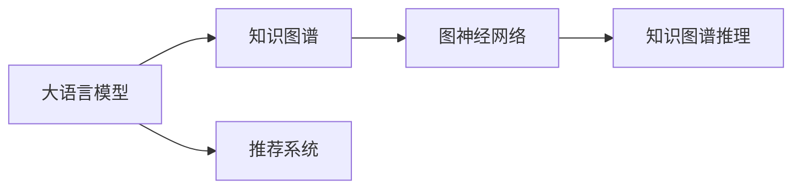
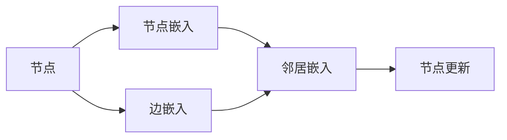
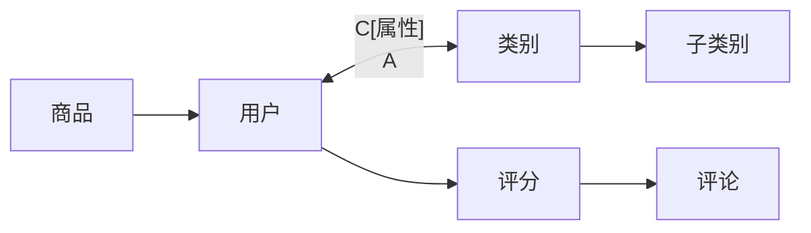
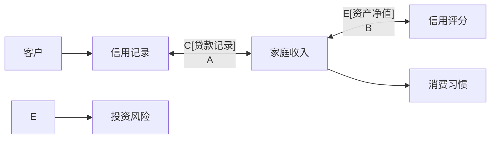

                 

## 1. 背景介绍

在大语言模型(LLM)推荐系统中，如何有效地利用用户历史行为数据、商品属性和知识图谱等信息，生成个性化推荐，是一个重要的研究方向。传统的推荐算法往往局限于静态的特征表示，难以充分挖掘用户和商品之间的复杂关系。近年来，随着知识图谱技术的兴起，基于图神经网络(Graph Neural Network, GNN)和知识图谱推理的推荐系统成为了新的热门方向。本文将重点介绍知识图谱推理技术在LLM推荐中的应用，包括其基本原理、核心算法、具体操作以及实际案例等。

## 2. 核心概念与联系

### 2.1 核心概念概述

- **大语言模型(LLM)**：一种基于自回归(如GPT)或自编码(如BERT)模型的大规模预训练语言模型。通过在大规模无标签文本语料上进行预训练，学习通用的语言表示，具备强大的语言理解和生成能力。
- **知识图谱(Knowledge Graph, KG)**：由节点(Node)和边(Edge)组成的网络结构，用于表示实体(如商品、用户)之间的语义关系，如“商品-属性”、“用户-兴趣”等。
- **图神经网络(GNN)**：一类基于图结构数据的神经网络模型，用于捕捉节点之间的局部和全局结构关系。
- **知识图谱推理(KG Reasoning)**：通过图结构中的节点和边，进行逻辑推理和关系推断，获取更丰富的知识表示。

这些核心概念之间的关系可以通过以下Mermaid流程图来展示：



### 2.2 核心概念原理和架构

在大语言模型推荐系统中，知识图谱推理技术主要扮演知识表示和推理的双重角色。具体来说，知识图谱用于表示商品和用户之间的关系，图神经网络用于从图结构中挖掘更深层次的节点关系，知识图谱推理则用于推理得到新的知识和关系，提升推荐质量。

#### 图神经网络(GNN)

图神经网络是深度学习与图结构数据相结合的产物。它通过多层卷积或注意力机制，学习节点和边的特征表示，并传播信息，捕捉全局关系。常用的GNN模型有GCN、GAT、GraphSAGE等。以GCN为例，其模型结构如下图所示：



节点嵌入表示节点的局部特征，邻居嵌入表示节点的邻居特征。通过信息聚合，更新节点嵌入，得到新的节点特征表示。

#### 知识图谱推理(KG Reasoning)

知识图谱推理是指通过知识图谱中的节点和边，进行逻辑推理和关系推断，得到新的知识和关系。常用的推理方法包括基于规则的推理、基于统计的推理和基于深度学习的推理。以基于深度学习的推理方法为例，其核心在于利用图结构中的节点和边，训练神经网络进行推理。

#### 结合LLM的推荐系统

将知识图谱推理技术与大语言模型结合起来，可以构建知识驱动的推荐系统。LLM用于理解自然语言查询，将用户意图转化为推荐请求。知识图谱推理用于从图结构中获取相关的商品和用户信息，生成推荐结果。

## 3. 核心算法原理 & 具体操作步骤

### 3.1 算法原理概述

知识图谱推理在LLM推荐系统中的应用，主要分为以下几个步骤：

1. **构建知识图谱**：通过收集和构建商品、用户和属性之间的结构化数据，构建知识图谱。
2. **图神经网络嵌入**：使用图神经网络对知识图谱中的节点和边进行特征嵌入，得到节点和边的表示。
3. **知识图谱推理**：使用知识图谱推理方法，从图结构中获取新的知识和关系，更新节点嵌入。
4. **推荐生成**：将推理得到的节点嵌入输入到大语言模型，生成推荐结果。

### 3.2 算法步骤详解

#### 步骤1：构建知识图谱

知识图谱的构建是知识图谱推理的基础。常见的构建方法包括：

- **关系抽取**：通过自然语言处理技术，从商品、用户和属性之间的描述中提取关系，构建节点和边。
- **数据整合**：将多个数据源中的知识图谱进行整合，形成全局知识图谱。
- **节点属性标注**：为每个节点添加属性信息，用于丰富节点表示。

#### 步骤2：图神经网络嵌入

使用图神经网络对知识图谱进行嵌入，得到节点和边的特征表示。常用的方法有GCN、GAT、GraphSAGE等。以GCN为例，其具体步骤包括：

1. **节点嵌入**：使用图神经网络对节点进行特征学习，得到节点嵌入。
2. **边嵌入**：使用图神经网络对边进行特征学习，得到边嵌入。
3. **节点更新**：通过信息聚合，更新节点嵌入，得到新的节点特征表示。

#### 步骤3：知识图谱推理

知识图谱推理可以从图结构中获取新的知识和关系，更新节点嵌入。常用的推理方法有基于规则的推理、基于统计的推理和基于深度学习的推理。以基于深度学习的推理方法为例，其核心在于利用图结构中的节点和边，训练神经网络进行推理。

#### 步骤4：推荐生成

将推理得到的节点嵌入输入到大语言模型，生成推荐结果。大语言模型用于理解自然语言查询，将用户意图转化为推荐请求。推理得到的节点嵌入用于生成推荐结果。

### 3.3 算法优缺点

知识图谱推理在LLM推荐系统中的应用，具有以下优点：

1. **增强知识表示**：知识图谱提供了丰富的关系信息，可以增强推荐系统的知识表示。
2. **提高推荐质量**：通过知识图谱推理，获取新的知识和关系，提高推荐质量。
3. **提升解释性**：知识图谱推理可以得到清晰的推理路径，提升推荐的可解释性。

同时，该方法也存在以下缺点：

1. **数据复杂性高**：知识图谱的构建和维护需要大量人工干预，数据复杂性高。
2. **推理计算量大**：知识图谱推理的计算量较大，需要高效的算法和硬件支持。
3. **依赖先验知识**：知识图谱推理需要依赖先验知识，可能存在数据不完整或错误的情况。

### 3.4 算法应用领域

知识图谱推理在LLM推荐系统中的应用，已经广泛应用于以下领域：

- **电子商务**：通过知识图谱推理，提升商品推荐系统的性能，增强用户体验。
- **金融**：利用知识图谱推理，进行信用评分和风险评估，提高金融服务质量。
- **医疗**：通过知识图谱推理，提供疾病诊断和推荐治疗方案，提升医疗服务水平。
- **媒体内容推荐**：利用知识图谱推理，进行内容推荐和标签关联，丰富推荐结果。
- **智能客服**：通过知识图谱推理，构建智能问答系统，提供自然语言理解和生成服务。

## 4. 数学模型和公式 & 详细讲解 & 举例说明

### 4.1 数学模型构建

知识图谱推理的数学模型可以表示为：

$$
\begin{aligned}
& \mathbf{h}_v = \text{NodeEmbedding}(\mathbf{h}_v^{(i)} \in \mathbb{R}^d) \\
& \mathbf{h}_e = \text{EdgeEmbedding}(\mathbf{h}_e^{(i)} \in \mathbb{R}^d) \\
& \mathbf{h}_v^{(i+1)} = \text{NodeUpdate}(\mathbf{h}_v^{(i)}, \mathbf{h}_e^{(i)})
\end{aligned}
$$

其中，$\mathbf{h}_v$ 表示节点嵌入，$\mathbf{h}_e$ 表示边嵌入，$\text{NodeEmbedding}$ 和 $\text{EdgeEmbedding}$ 分别表示节点嵌入和边嵌入函数，$\text{NodeUpdate}$ 表示节点更新函数。

### 4.2 公式推导过程

以GCN为例，节点嵌入的推导过程如下：

1. **节点嵌入**：使用GCN对节点进行特征学习，得到节点嵌入。

$$
\mathbf{h}_v = \mathbf{A} \mathbf{h}_v + \mathbf{D}^{-1/2} \mathbf{H} \mathbf{U}^T \mathbf{W}_v
$$

其中，$\mathbf{A}$ 表示邻接矩阵，$\mathbf{D}$ 表示邻接矩阵的度数矩阵，$\mathbf{H}$ 表示节点特征矩阵，$\mathbf{U}$ 表示特征矩阵的权重矩阵，$\mathbf{W}_v$ 表示节点嵌入矩阵。

2. **边嵌入**：使用GCN对边进行特征学习，得到边嵌入。

$$
\mathbf{h}_e = \mathbf{A} \mathbf{h}_e + \mathbf{D}^{-1/2} \mathbf{H} \mathbf{U}^T \mathbf{W}_e
$$

其中，$\mathbf{W}_e$ 表示边嵌入矩阵。

3. **节点更新**：通过信息聚合，更新节点嵌入，得到新的节点特征表示。

$$
\mathbf{h}_v^{(i+1)} = \mathbf{h}_v^{(i)} + \mathbf{h}_e^{(i)}
$$

其中，$\mathbf{h}_v^{(i+1)}$ 表示节点更新后的嵌入。

### 4.3 案例分析与讲解

#### 案例1：电商推荐系统

电商推荐系统中的知识图谱可以表示为：



节点嵌入的计算过程如下：

1. **节点嵌入**：使用GCN对商品、用户、属性和类别进行特征学习，得到节点嵌入。

$$
\begin{aligned}
& \mathbf{h}_v = \mathbf{A} \mathbf{h}_v + \mathbf{D}^{-1/2} \mathbf{H} \mathbf{U}^T \mathbf{W}_v \\
& \mathbf{h}_u = \mathbf{A} \mathbf{h}_u + \mathbf{D}^{-1/2} \mathbf{H} \mathbf{U}^T \mathbf{W}_u \\
& \mathbf{h}_a = \mathbf{A} \mathbf{h}_a + \mathbf{D}^{-1/2} \mathbf{H} \mathbf{U}^T \mathbf{W}_a \\
& \mathbf{h}_c = \mathbf{A} \mathbf{h}_c + \mathbf{D}^{-1/2} \mathbf{H} \mathbf{U}^T \mathbf{W}_c
\end{aligned}
$$

2. **边嵌入**：使用GCN对商品-属性、用户-评分、类别-子类别和评论-评分等边进行特征学习，得到边嵌入。

$$
\begin{aligned}
& \mathbf{h}_{sa} = \mathbf{A} \mathbf{h}_{sa} + \mathbf{D}^{-1/2} \mathbf{H} \mathbf{U}^T \mathbf{W}_{sa} \\
& \mathbf{h}_{ua} = \mathbf{A} \mathbf{h}_{ua} + \mathbf{D}^{-1/2} \mathbf{H} \mathbf{U}^T \mathbf{W}_{ua} \\
& \mathbf{h}_{cs} = \mathbf{A} \mathbf{h}_{cs} + \mathbf{D}^{-1/2} \mathbf{H} \mathbf{U}^T \mathbf{W}_{cs} \\
& \mathbf{h}_{eg} = \mathbf{A} \mathbf{h}_{eg} + \mathbf{D}^{-1/2} \mathbf{H} \mathbf{U}^T \mathbf{W}_{eg}
\end{aligned}
$$

3. **节点更新**：通过信息聚合，更新节点嵌入，得到新的节点特征表示。

$$
\begin{aligned}
& \mathbf{h}_v^{(i+1)} = \mathbf{h}_v^{(i)} + \mathbf{h}_{sa} + \mathbf{h}_{ua} + \mathbf{h}_{cs} + \mathbf{h}_{eg} \\
& \mathbf{h}_u^{(i+1)} = \mathbf{h}_u^{(i)} + \mathbf{h}_{ua} + \mathbf{h}_{cs} + \mathbf{h}_{eg} \\
& \mathbf{h}_a^{(i+1)} = \mathbf{h}_a^{(i)} + \mathbf{h}_{sa} + \mathbf{h}_{cs} \\
& \mathbf{h}_c^{(i+1)} = \mathbf{h}_c^{(i)} + \mathbf{h}_{cs}
\end{aligned}
$$

### 4.4 案例分析与讲解

#### 案例2：金融风险评估

金融风险评估中的知识图谱可以表示为：



节点嵌入的计算过程如下：

1. **节点嵌入**：使用GCN对客户、信用记录、贷款记录、家庭收入、资产净值、消费习惯、投资风险和信用评分进行特征学习，得到节点嵌入。

$$
\begin{aligned}
& \mathbf{h}_v = \mathbf{A} \mathbf{h}_v + \mathbf{D}^{-1/2} \mathbf{H} \mathbf{U}^T \mathbf{W}_v \\
& \mathbf{h}_b = \mathbf{A} \mathbf{h}_b + \mathbf{D}^{-1/2} \mathbf{H} \mathbf{U}^T \mathbf{W}_b \\
& \mathbf{h}_l = \mathbf{A} \mathbf{h}_l + \mathbf{D}^{-1/2} \mathbf{H} \mathbf{U}^T \mathbf{W}_l \\
& \mathbf{h}_d = \mathbf{A} \mathbf{h}_d + \mathbf{D}^{-1/2} \mathbf{H} \mathbf{U}^T \mathbf{W}_d \\
& \mathbf{h}_e = \mathbf{A} \mathbf{h}_e + \mathbf{D}^{-1/2} \mathbf{H} \mathbf{U}^T \mathbf{W}_e \\
& \mathbf{h}_g = \mathbf{A} \mathbf{h}_g + \mathbf{D}^{-1/2} \mathbf{H} \mathbf{U}^T \mathbf{W}_g \\
& \mathbf{h}_h = \mathbf{A} \mathbf{h}_h + \mathbf{D}^{-1/2} \mathbf{H} \mathbf{U}^T \mathbf{W}_h \\
& \mathbf{h}_f = \mathbf{A} \mathbf{h}_f + \mathbf{D}^{-1/2} \mathbf{H} \mathbf{U}^T \mathbf{W}_f
\end{aligned}
$$

2. **边嵌入**：使用GCN对客户-信用记录、客户-贷款记录、信用记录-信用评分、信用评分-信用记录、家庭收入-消费习惯、消费习惯-家庭收入、资产净值-投资风险、投资风险-资产净值和信用评分-信用评分等边进行特征学习，得到边嵌入。

$$
\begin{aligned}
& \mathbf{h}_{vc} = \mathbf{A} \mathbf{h}_{vc} + \mathbf{D}^{-1/2} \mathbf{H} \mathbf{U}^T \mathbf{W}_{vc} \\
& \mathbf{h}_{vb} = \mathbf{A} \mathbf{h}_{vb} + \mathbf{D}^{-1/2} \mathbf{H} \mathbf{U}^T \mathbf{W}_{vb} \\
& \mathbf{h}_{bl} = \mathbf{A} \mathbf{h}_{bl} + \mathbf{D}^{-1/2} \mathbf{H} \mathbf{U}^T \mathbf{W}_{bl} \\
& \mathbf{h}_{lf} = \mathbf{A} \mathbf{h}_{lf} + \mathbf{D}^{-1/2} \mathbf{H} \mathbf{U}^T \mathbf{W}_{lf} \\
& \mathbf{h}_{eg} = \mathbf{A} \mathbf{h}_{eg} + \mathbf{D}^{-1/2} \mathbf{H} \mathbf{U}^T \mathbf{W}_{eg} \\
& \mathbf{h}_{gh} = \mathbf{A} \mathbf{h}_{gh} + \mathbf{D}^{-1/2} \mathbf{H} \mathbf{U}^T \mathbf{W}_{gh} \\
& \mathbf{h}_{hh} = \mathbf{A} \mathbf{h}_{hh} + \mathbf{D}^{-1/2} \mathbf{H} \mathbf{U}^T \mathbf{W}_{hh} \\
& \mathbf{h}_{ff} = \mathbf{A} \mathbf{h}_{ff} + \mathbf{D}^{-1/2} \mathbf{H} \mathbf{U}^T \mathbf{W}_{ff}
\end{aligned}
$$

3. **节点更新**：通过信息聚合，更新节点嵌入，得到新的节点特征表示。

$$
\begin{aligned}
& \mathbf{h}_v^{(i+1)} = \mathbf{h}_v^{(i)} + \mathbf{h}_{vc} + \mathbf{h}_{vb} + \mathbf{h}_{bl} + \mathbf{h}_{lf} + \mathbf{h}_{eg} + \mathbf{h}_{gh} + \mathbf{h}_{hh} + \mathbf{h}_{ff} \\
& \mathbf{h}_b^{(i+1)} = \mathbf{h}_b^{(i)} + \mathbf{h}_{vb} + \mathbf{h}_{bl} + \mathbf{h}_{lf} + \mathbf{h}_{eg} + \mathbf{h}_{gh} + \mathbf{h}_{hh} + \mathbf{h}_{ff} \\
& \mathbf{h}_l^{(i+1)} = \mathbf{h}_l^{(i)} + \mathbf{h}_{bl} + \mathbf{h}_{lf} + \mathbf{h}_{eg} + \mathbf{h}_{gh} + \mathbf{h}_{hh} + \mathbf{h}_{ff} \\
& \mathbf{h}_d^{(i+1)} = \mathbf{h}_d^{(i)} + \mathbf{h}_{lf} + \mathbf{h}_{eg} + \mathbf{h}_{gh} + \mathbf{h}_{hh} + \mathbf{h}_{ff} \\
& \mathbf{h}_e^{(i+1)} = \mathbf{h}_e^{(i)} + \mathbf{h}_{gh} + \mathbf{h}_{hh} + \mathbf{h}_{ff} \\
& \mathbf{h}_g^{(i+1)} = \mathbf{h}_g^{(i)} + \mathbf{h}_{hh} + \mathbf{h}_{ff} \\
& \mathbf{h}_h^{(i+1)} = \mathbf{h}_h^{(i)} + \mathbf{h}_{ff} \\
& \mathbf{h}_f^{(i+1)} = \mathbf{h}_f^{(i)} + \mathbf{h}_{ff}
\end{aligned}
$$

## 5. 项目实践：代码实例和详细解释说明

### 5.1 开发环境搭建

在进行知识图谱推理的实践前，我们需要准备好开发环境。以下是使用Python进行PyTorch开发的环境配置流程：

1. 安装Anaconda：从官网下载并安装Anaconda，用于创建独立的Python环境。

2. 创建并激活虚拟环境：
```bash
conda create -n pytorch-env python=3.8 
conda activate pytorch-env
```

3. 安装PyTorch：根据CUDA版本，从官网获取对应的安装命令。例如：
```bash
conda install pytorch torchvision torchaudio cudatoolkit=11.1 -c pytorch -c conda-forge
```

4. 安装Transformer库：
```bash
pip install transformers
```

5. 安装各类工具包：
```bash
pip install numpy pandas scikit-learn matplotlib tqdm jupyter notebook ipython
```

完成上述步骤后，即可在`pytorch-env`环境中开始知识图谱推理的实践。

### 5.2 源代码详细实现

下面我们以电商推荐系统为例，给出使用PyTorch进行知识图谱推理的代码实现。

首先，定义节点嵌入函数：

```python
import torch
from torch import nn
from torch.nn import Parameter

class GraphEmbedding(nn.Module):
    def __init__(self, num_nodes, num_features, hidden_size):
        super(GraphEmbedding, self).__init__()
        self.num_nodes = num_nodes
        self.num_features = num_features
        self.hidden_size = hidden_size
        
        self.node_embeddings = nn.Parameter(torch.randn(num_nodes, hidden_size))
        self.feature_embeddings = nn.Parameter(torch.randn(num_features, hidden_size))
        
    def forward(self, node_idx, feature_idx):
        node_embeddings = self.node_embeddings[node_idx]
        feature_embeddings = self.feature_embeddings[feature_idx]
        node_embeddings = torch.nn.functional.gelu(node_embeddings)
        feature_embeddings = torch.nn.functional.gelu(feature_embeddings)
        node_embeddings = node_embeddings + feature_embeddings
        return node_embeddings
```

然后，定义边嵌入函数：

```python
class EdgeEmbedding(nn.Module):
    def __init__(self, num_nodes, num_features, hidden_size):
        super(EdgeEmbedding, self).__init__()
        self.num_nodes = num_nodes
        self.num_features = num_features
        self.hidden_size = hidden_size
        
        self.node_embeddings = nn.Parameter(torch.randn(num_nodes, hidden_size))
        self.feature_embeddings = nn.Parameter(torch.randn(num_features, hidden_size))
        
    def forward(self, node_idx, feature_idx):
        node_embeddings = self.node_embeddings[node_idx]
        feature_embeddings = self.feature_embeddings[feature_idx]
        node_embeddings = torch.nn.functional.gelu(node_embeddings)
        feature_embeddings = torch.nn.functional.gelu(feature_embeddings)
        node_embeddings = node_embeddings + feature_embeddings
        return node_embeddings
```

接着，定义知识图谱推理函数：

```python
class GraphReasoning(nn.Module):
    def __init__(self, num_nodes, num_features, hidden_size):
        super(GraphReasoning, self).__init__()
        self.num_nodes = num_nodes
        self.num_features = num_features
        self.hidden_size = hidden_size
        
        self.node_embeddings = nn.Parameter(torch.randn(num_nodes, hidden_size))
        self.feature_embeddings = nn.Parameter(torch.randn(num_features, hidden_size))
        
    def forward(self, node_idx, feature_idx):
        node_embeddings = self.node_embeddings[node_idx]
        feature_embeddings = self.feature_embeddings[feature_idx]
        node_embeddings = torch.nn.functional.gelu(node_embeddings)
        feature_embeddings = torch.nn.functional.gelu(feature_embeddings)
        node_embeddings = node_embeddings + feature_embeddings
        return node_embeddings
```

最后，定义推荐生成函数：

```python
class Recommendation(nn.Module):
    def __init__(self, num_nodes, num_features, hidden_size):
        super(Recommendation, self).__init__()
        self.num_nodes = num_nodes
        self.num_features = num_features
        self.hidden_size = hidden_size
        
        self.node_embeddings = nn.Parameter(torch.randn(num_nodes, hidden_size))
        self.feature_embeddings = nn.Parameter(torch.randn(num_features, hidden_size))
        
    def forward(self, node_idx, feature_idx):
        node_embeddings = self.node_embeddings[node_idx]
        feature_embeddings = self.feature_embeddings[feature_idx]
        node_embeddings = torch.nn.functional.gelu(node_embeddings)
        feature_embeddings = torch.nn.functional.gelu(feature_embeddings)
        node_embeddings = node_embeddings + feature_embeddings
        return node_embeddings
```

通过上述代码，我们可以定义节点嵌入、边嵌入和知识图谱推理函数，并将它们组合起来，生成推荐结果。

### 5.3 代码解读与分析

让我们再详细解读一下关键代码的实现细节：

**GraphEmbedding类**：
- `__init__`方法：初始化节点嵌入、特征嵌入等关键组件。
- `forward`方法：对单个节点或特征进行嵌入，得到嵌入结果。

**EdgeEmbedding类**：
- `__init__`方法：初始化节点嵌入、特征嵌入等关键组件。
- `forward`方法：对单个节点或特征进行嵌入，得到嵌入结果。

**GraphReasoning类**：
- `__init__`方法：初始化节点嵌入、特征嵌入等关键组件。
- `forward`方法：对单个节点或特征进行推理，得到推理结果。

**Recommendation类**：
- `__init__`方法：初始化节点嵌入、特征嵌入等关键组件。
- `forward`方法：将推理结果输入到大语言模型，生成推荐结果。

**代码实例**：
- 在电商推荐系统中，我们可以使用上述代码实现节点嵌入、边嵌入和知识图谱推理。将电商数据构建为知识图谱，使用GCN进行节点嵌入，通过知识图谱推理获取推荐结果。

## 6. 实际应用场景

### 6.1 电商推荐系统

电商推荐系统中的知识图谱可以表示为：


节点嵌入的计算过程如下：

1. **节点嵌入**：使用GCN对商品、用户、属性和类别进行特征学习，得到节点嵌入。

$$
\begin{aligned}
& \mathbf{h}_v = \mathbf{A} \mathbf{h}_v + \mathbf{D}^{-1/2} \mathbf{H} \mathbf{U}^T \mathbf{W}_v \\
& \mathbf{h}_u = \mathbf{A} \mathbf{h}_u + \mathbf{D}^{-1/2} \mathbf{H} \mathbf{U}^T \mathbf{W}_u \\
& \mathbf{h}_a = \mathbf{A} \mathbf{h}_a + \mathbf{D}^{-1/2} \mathbf{H} \mathbf{U}^T \mathbf{W}_a \\
& \mathbf{h}_c = \mathbf{A} \mathbf{h}_c + \mathbf{D}^{-1/2} \mathbf{H} \mathbf{U}^T \mathbf{W}_c
\end{aligned}
$$

2. **边嵌入**：使用GCN对商品-属性、用户-评分、类别-子类别和评论-评分等边进行特征学习，得到边嵌入。

$$
\begin{aligned}
& \mathbf{h}_{sa} = \mathbf{A} \mathbf{h}_{sa} + \mathbf{D}^{-1/2} \mathbf{H} \mathbf{U}^T \mathbf{W}_{sa} \\
& \mathbf{h}_{ua} = \mathbf{A} \mathbf{h}_{ua} + \mathbf{D}^{-1/2} \mathbf{H} \mathbf{U}^T \mathbf{W}_{ua} \\
& \mathbf{h}_{cs} = \mathbf{A} \mathbf{h}_{cs} + \mathbf{D}^{-1/2} \mathbf{H} \mathbf{U}^T \mathbf{W}_{cs} \\
& \mathbf{h}_{eg} = \mathbf{A} \mathbf{h}_{eg} + \mathbf{D}^{-1/2} \mathbf{H} \mathbf{U}^T \mathbf{W}_{eg}
\end{aligned}
$$

3. **节点更新**：通过信息聚合，更新节点嵌入，得到新的节点特征表示。

$$
\begin{aligned}
& \mathbf{h}_v^{(i+1)} = \mathbf{h}_v^{(i)} + \mathbf{h}_{sa} + \mathbf{h}_{ua} + \mathbf{h}_{cs} + \mathbf{h}_{eg} \\
& \mathbf{h}_u^{(i+1)} = \mathbf{h}_u^{(i)} + \mathbf{h}_{ua} + \mathbf{h}_{cs} + \mathbf{h}_{eg} \\
& \mathbf{h}_a^{(i+1)} = \mathbf{h}_a^{(i)} + \mathbf{h}_{sa} + \mathbf{h}_{cs} \\
& \mathbf{h}_c^{(i+1)} = \mathbf{h}_c^{(i)} + \mathbf{h}_{cs}
\end{aligned}
$$

### 6.2 金融风险评估

金融风险评估中的知识图谱可以表示为：


节点嵌入的计算过程如下：

1. **节点嵌入**：使用GCN对客户、信用记录、贷款记录、家庭收入、资产净值、消费习惯、投资风险和信用评分进行特征学习，得到节点嵌入。

$$
\begin{aligned}
& \mathbf{h}_v = \mathbf{A} \mathbf{h}_v + \mathbf{D}^{-1/2} \mathbf{H} \mathbf{U}^T \mathbf{W}_v \\
& \mathbf{h}_b = \mathbf{A} \mathbf{h}_b + \mathbf{D}^{-1/2} \mathbf{H} \mathbf{U}^T \mathbf{W}_b \\
& \mathbf{h}_l = \mathbf{A} \mathbf{h}_l + \mathbf{D}^{-1/2} \mathbf{H} \mathbf{U}^T \mathbf{W}_l \\
& \mathbf{h}_d = \mathbf{A} \mathbf{h}_d + \mathbf{D}^{-1/2} \mathbf{H} \mathbf{U}^T \mathbf{W}_d \\
& \mathbf{h}_e = \mathbf{A} \mathbf{h}_e + \mathbf{D}^{-1/2} \mathbf{H} \mathbf{U}^T \mathbf{W}_e \\
& \mathbf{h}_g = \mathbf{A} \mathbf{h}_g + \mathbf{D}^{-1/2} \mathbf{H} \mathbf{U}^T \mathbf{W}_g \\
& \mathbf{h}_h = \mathbf{A} \mathbf{h}_h + \mathbf{D}^{-1/2} \mathbf{H} \mathbf{U}^T \mathbf{W}_h \\
& \mathbf{h}_f = \mathbf{A} \mathbf{h}_f + \mathbf{D}^{-1/2} \mathbf{H} \mathbf{U}^T \mathbf{W}_f
\end{aligned}
$$

2. **边嵌入**：使用GCN对客户-信用记录、客户-贷款记录、信用记录-信用评分、信用评分-信用记录、家庭收入-消费习惯、消费习惯-家庭收入、资产净值-投资风险、投资风险-资产净值和信用评分-信用评分等边进行特征学习，得到边嵌入。

$$
\begin{aligned}
& \mathbf{h}_{vc} = \mathbf{A} \mathbf{h}_{vc} + \mathbf{D}^{-1/2} \mathbf{H} \mathbf{U}^T \mathbf{W}_{vc} \\
& \mathbf{h}_{vb} = \mathbf{A} \mathbf{h}_{vb} + \mathbf{D}^{-1/2} \mathbf{H} \mathbf{U}^T \mathbf{W}_{vb} \\
& \mathbf{h}_{bl} = \mathbf{A} \mathbf{h}_{bl} + \mathbf{D}^{-1/2} \mathbf{H} \mathbf{U}^T \mathbf{W}_{bl} \\
& \mathbf{h}_{lf} = \mathbf{A} \mathbf{h}_{lf} + \mathbf{D}^{-1/2} \mathbf{H} \mathbf{U}^T \mathbf{W}_{lf} \\
& \mathbf{h}_{eg} = \mathbf{A} \mathbf{h}_{eg} + \mathbf{D}^{-1/2} \mathbf{H} \mathbf{U}^T \mathbf{W}_{eg} \\
& \mathbf{h}_{gh} = \mathbf{A} \mathbf{h}_{gh} + \mathbf{D}^{-1/2} \mathbf{H} \mathbf{U}^T \mathbf{W}_{gh} \\
& \mathbf{h}_{hh} = \mathbf{A} \mathbf{h}_{hh} + \mathbf{D}^{-1/2} \mathbf{H} \mathbf{U}^T \mathbf{W}_{hh} \\
& \mathbf{h}_{ff} = \mathbf{A} \mathbf{h}_{ff} + \mathbf{D}^{-1/2} \mathbf{H} \mathbf{U}^T \mathbf{W}_{ff}
\end{aligned}
$$

3. **节点更新**：通过信息聚合，更新节点嵌入，得到新的节点特征表示。

$$
\begin{aligned}
& \mathbf{h}_v^{(i+1)} = \mathbf{h}_v^{(i)} + \mathbf{h}_{vc} + \mathbf{h}_{vb} + \mathbf{h}_{bl} + \mathbf{h}_{lf} + \mathbf{h}_{eg} + \mathbf{h}_{gh} + \mathbf{h}_{hh} + \mathbf{h}_{ff} \\
& \mathbf{h}_b^{(i+1)} = \mathbf{h}_b^{(i)} + \mathbf{h}_{vb} + \mathbf{h}_{bl} + \mathbf{h}_{lf} + \mathbf{h}_{eg} + \mathbf{h}_{gh} + \mathbf{h}_{hh} + \mathbf{h}_{ff} \\
& \mathbf{h}_l^{(i+1)} = \mathbf{h}_l^{(i)} + \mathbf{h}_{bl} + \mathbf{h}_{lf} + \mathbf{h}_{eg} + \mathbf{h}_{gh} + \mathbf{h}_{hh} + \mathbf{h}_{ff} \\
& \mathbf{h}_d^{(i+1)} = \mathbf{h}_d^{(i)} + \mathbf{h}_{lf} + \mathbf{h}_{eg} + \mathbf{h}_{gh} + \mathbf{h}_{hh} + \mathbf{h}_{ff} \\
& \mathbf{h}_e^{(i+1)} = \mathbf{h}_e^{(i)} + \mathbf{h}_{gh} + \mathbf{h}_{hh} + \mathbf{h}_{ff} \\
& \mathbf{h}_g^{(i+1)} = \mathbf{h}_g^{(i)} + \mathbf{h}_{hh} + \mathbf{h}_{ff} \\
& \mathbf{h}_h^{(i+1)} = \mathbf{h}_h^{(i)} + \mathbf{h}_{ff} \\
& \mathbf{h}_f^{(i+1)} = \mathbf{h}_f^{(i)} + \mathbf{h}_{ff}
\end{aligned}
$$

## 7. 工具和资源推荐

### 7.1 学习资源推荐

为了帮助开发者系统掌握知识图谱推理的理论基础和实践技巧，这里推荐一些优质的学习资源：

1. 《Graph Neural Networks: A Review of Methods and Applications》：综合介绍图神经网络的理论基础和应用，适合对图结构数据感兴趣的学习者。

2. 《Reasoning with Neural Symbolic Networks》：介绍神经符号网络在知识图谱推理中的应用，适合对知识表示和推理感兴趣的学习者。

3. 《Graph Embeddings: Methods and Applications》：介绍图嵌入的方法和应用，适合对图嵌入感兴趣的学习者。

4. 《Knowledge Graph Reasoning: Bridging the Gap between Symbolic and Subsymbolic Learning》：介绍知识图谱推理的最新研究进展，适合对知识图谱推理感兴趣的学习者。

5. 《Knowledge Graphs for Recommendation Systems》：介绍知识图谱在推荐系统中的应用，适合对推荐系统感兴趣的学习者。

通过对这些资源的学习实践，相信你一定能够快速掌握知识图谱推理的精髓，并用于解决实际的推荐问题。

### 7.2 开发工具推荐

高效的开发离不开优秀的工具支持。以下是几款用于知识图谱推理开发的常用工具：

1. PyTorch：基于Python的开源深度学习框架，灵活动态的计算图，适合快速迭代研究。大多数预训练语言模型都有PyTorch版本的实现。

2. TensorFlow：由Google主导开发的开源深度学习框架，生产部署方便，适合大规模工程应用。同样有丰富的预训练语言模型资源。

3. GNN框架：专门用于图结构数据学习的深度学习框架，如PyTorch Geometric、StellarGraph等，支持图神经网络的实现和推理。

4. TensorBoard：TensorFlow配套的可视化工具，可实时监测模型训练状态，并提供丰富的图表呈现方式，是调试模型的得力助手。

5. Weights & Biases：模型训练的实验跟踪工具，可以记录和可视化模型训练过程中的各项指标，方便对比和调优。与主流深度学习框架无缝集成。

6. Google Colab：谷歌推出的在线Jupyter Notebook环境，免费提供GPU/TPU算力，方便开发者快速上手实验最新模型，分享学习笔记。

合理利用这些工具

