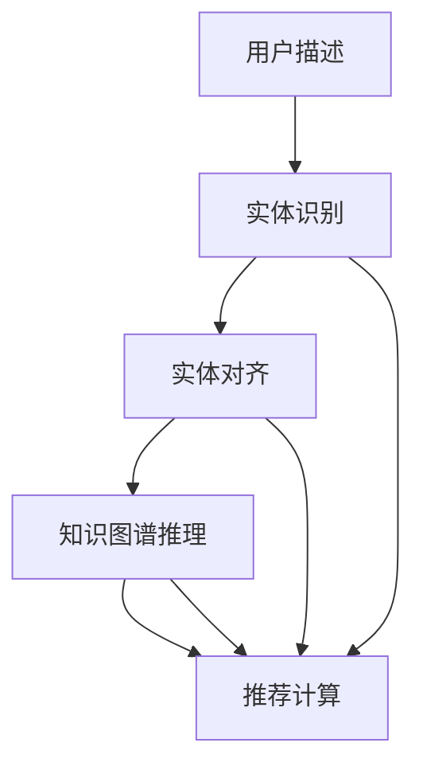

                 

## 1. 背景介绍

随着人工智能技术的发展，自然语言处理(NLP)和推荐系统在智能推荐领域表现出色，但两者在底层逻辑上存在一些本质的区别。自然语言处理主要面向文本处理，旨在理解和生成语言，而推荐系统则关注在用户和物品之间建立联系，预测用户可能感兴趣的商品。

近年来，深度学习技术在推荐系统中得到了广泛应用。基于神经网络的推荐算法可以高效地处理大规模数据，并能在训练时自适应地调整模型参数。然而，这些深度学习模型存在一些缺陷，如模型的可解释性差、缺乏先验知识、数据需求量大等。

为了应对这些问题，知识图谱和推荐系统之间的融合成为了研究热点。知识图谱是一种结构化的数据模型，将现实世界中的实体和关系进行语义化的表示，便于机器理解和推理。在推荐系统中引入知识图谱，可以帮助模型更好地理解用户和物品之间的语义关系，提供更为精准和可靠的推荐结果。

本文将聚焦于知识图谱在推荐系统中的应用，特别是如何利用大语言模型(LLM)进行知识图谱推理，并在此基础上进行推荐。我们将从背景介绍开始，逐步深入到核心算法和实现细节。

## 2. 核心概念与联系

### 2.1 核心概念概述

- **大语言模型(LLM)**：指采用大规模语料进行预训练，具备强大语言处理能力的模型，如BERT、GPT等。
- **知识图谱(KG)**：由节点和边组成，表示现实世界中的实体和关系的数据模型。
- **知识图谱推理**：指利用推理算法在知识图谱中查找相关信息，推断出新的实体关系和隐含知识的过程。
- **推荐系统**：通过用户行为数据和物品属性，预测用户可能感兴趣的物品的系统。
- **深度学习**：指通过多层神经网络模拟人类神经元的行为，提取数据特征进行分类、回归等任务。

### 2.2 核心概念联系

在推荐系统中，利用大语言模型进行知识图谱推理的流程如下：

1. **实体识别**：从用户描述、物品描述等自然语言文本中识别出图中的实体和关系，如“小明”、“苹果”等。
2. **实体对齐**：将文本中的实体对齐到知识图谱中，通过嵌入空间中的距离度量实现。
3. **关系推理**：利用推理算法在知识图谱中查找相关信息，推断出新的实体关系和隐含知识。
4. **推荐计算**：结合推理结果和用户行为数据，计算推荐分数，进行物品推荐。

以下是一个简单的Mermaid流程图，展示了这个推理过程：



这个流程图展示了从用户描述到最终推荐的整个过程，每个环节通过对应的算法进行自动处理。

## 3. 核心算法原理 & 具体操作步骤

### 3.1 算法原理概述

在推荐系统中，利用大语言模型进行知识图谱推理的算法原理如下：

1. **实体识别**：利用自然语言处理技术，从用户描述、物品描述等文本中识别出实体，如“小明”、“苹果”等。
2. **实体对齐**：将识别出的实体与知识图谱中的实体进行对齐，通过嵌入空间中的距离度量实现。
3. **关系推理**：利用推理算法在知识图谱中查找相关信息，推断出新的实体关系和隐含知识。
4. **推荐计算**：结合推理结果和用户行为数据，计算推荐分数，进行物品推荐。

### 3.2 算法步骤详解

#### 3.2.1 实体识别

实体识别是知识图谱推理的第一步，其目标是从用户描述、物品描述等文本中识别出实体。以用户描述“小明喜欢吃苹果”为例，实体识别模型需要将“小明”识别为人名实体，“苹果”识别为水果实体。

实体识别的方法有多种，包括基于规则的方法、基于统计的方法和基于深度学习的方法。本文重点介绍基于深度学习的方法，使用预训练的语言模型进行实体识别。

具体实现步骤如下：

1. **模型准备**：选择预训练的大语言模型，如BERT、GPT等，作为实体识别模型的基础。
2. **训练数据准备**：准备标注好的训练数据，包括实体类型、实体边界等。
3. **模型训练**：在标注数据上进行训练，微调模型参数，使其能够识别出实体。
4. **预测**：将用户描述、物品描述等文本输入模型，进行实体识别。

#### 3.2.2 实体对齐

实体对齐的目的是将文本中的实体对齐到知识图谱中，通过嵌入空间中的距离度量实现。以用户描述“小明喜欢吃苹果”为例，需要将“小明”对齐到知识图谱中的人名实体，“苹果”对齐到水果实体。

实体对齐的方法包括基于规则的方法、基于统计的方法和基于深度学习的方法。本文重点介绍基于深度学习的方法，使用预训练的语言模型进行实体对齐。

具体实现步骤如下：

1. **模型准备**：选择预训练的大语言模型，如BERT、GPT等，作为实体对齐模型的基础。
2. **训练数据准备**：准备标注好的训练数据，包括实体类型、实体边界等。
3. **模型训练**：在标注数据上进行训练，微调模型参数，使其能够将实体对齐到知识图谱中。
4. **预测**：将用户描述、物品描述等文本输入模型，进行实体对齐。

#### 3.2.3 关系推理

关系推理的目的是利用推理算法在知识图谱中查找相关信息，推断出新的实体关系和隐含知识。以用户描述“小明喜欢吃苹果”为例，推理算法需要从知识图谱中查找“小明”与“苹果”之间的关系。

关系推理的方法包括基于规则的方法、基于统计的方法和基于深度学习的方法。本文重点介绍基于深度学习的方法，使用预训练的语言模型进行关系推理。

具体实现步骤如下：

1. **模型准备**：选择预训练的大语言模型，如BERT、GPT等，作为关系推理模型的基础。
2. **训练数据准备**：准备标注好的训练数据，包括实体关系、关系类型等。
3. **模型训练**：在标注数据上进行训练，微调模型参数，使其能够推断出新的实体关系和隐含知识。
4. **预测**：将用户描述、物品描述等文本输入模型，进行关系推理。

#### 3.2.4 推荐计算

推荐计算的目的是结合推理结果和用户行为数据，计算推荐分数，进行物品推荐。以用户描述“小明喜欢吃苹果”为例，结合推理结果，推荐与“苹果”相关的物品，如“香蕉”、“橘子”等。

推荐计算的方法包括基于协同过滤的方法、基于内容的方法和基于深度学习的方法。本文重点介绍基于深度学习的方法，使用预训练的语言模型进行推荐计算。

具体实现步骤如下：

1. **模型准备**：选择预训练的大语言模型，如BERT、GPT等，作为推荐计算模型的基础。
2. **训练数据准备**：准备标注好的训练数据，包括用户行为数据、物品属性等。
3. **模型训练**：在标注数据上进行训练，微调模型参数，使其能够计算推荐分数。
4. **预测**：将用户描述、物品描述等文本输入模型，进行推荐计算。

### 3.3 算法优缺点

利用大语言模型进行知识图谱推理的算法有以下优点：

1. **自适应性强**：大语言模型具有强大的语言理解能力，可以自适应地处理不同类型的文本数据。
2. **可扩展性好**：知识图谱可以不断扩展，加入新的实体和关系，使得推理过程更为全面和准确。
3. **可解释性强**：利用自然语言处理技术，可以更好地解释和解释推理结果。

同时，利用大语言模型进行知识图谱推理的算法也存在一些缺点：

1. **计算量大**：大语言模型和知识图谱推理都需要大量的计算资源，可能会影响实时性。
2. **数据需求高**：需要大量的标注数据进行训练，可能会存在标注质量不高等问题。
3. **结果不确定**：推理结果可能存在歧义，需要人工干预进行校正。

### 3.4 算法应用领域

利用大语言模型进行知识图谱推理的算法在多个领域具有广泛的应用，如智能推荐、搜索引擎、个性化广告等。

#### 3.4.1 智能推荐

在智能推荐中，利用大语言模型进行知识图谱推理，可以更好地理解用户需求和物品属性，提供更为精准和可靠的推荐结果。以电商推荐为例，用户描述“我需要一件白色T恤”，通过实体识别、实体对齐、关系推理和推荐计算，推荐出适合的用户物品。

#### 3.4.2 搜索引擎

在搜索引擎中，利用大语言模型进行知识图谱推理，可以更好地理解用户的查询意图和查询内容，提供更为全面和准确的搜索结果。以搜索引擎为例，用户输入“苹果”，通过实体识别、实体对齐、关系推理和推荐计算，推荐出与“苹果”相关的商品、新闻、视频等。

#### 3.4.3 个性化广告

在个性化广告中，利用大语言模型进行知识图谱推理，可以更好地理解用户兴趣和行为，提供更为精准和个性化的广告推荐。以广告推荐为例，用户浏览“苹果”页面，通过实体识别、实体对齐、关系推理和推荐计算，推荐出与“苹果”相关的广告内容。

## 4. 数学模型和公式 & 详细讲解 & 举例说明

### 4.1 数学模型构建

在利用大语言模型进行知识图谱推理的过程中，我们构建了以下数学模型：

1. **实体识别模型**：
   - 输入：自然语言文本
   - 输出：实体识别结果

   数学模型为：
   $$
   y_i = f(x_i; \theta)
   $$
   其中 $y_i$ 表示输入文本 $x_i$ 的实体识别结果，$f$ 表示实体识别模型，$\theta$ 表示模型参数。

2. **实体对齐模型**：
   - 输入：自然语言文本和知识图谱
   - 输出：实体对齐结果

   数学模型为：
   $$
   z_i = g(x_i, e_j; \theta)
   $$
   其中 $z_i$ 表示输入文本 $x_i$ 的实体对齐结果，$e_j$ 表示知识图谱中的实体，$g$ 表示实体对齐模型，$\theta$ 表示模型参数。

3. **关系推理模型**：
   - 输入：自然语言文本和知识图谱
   - 输出：关系推理结果

   数学模型为：
   $$
   r_j = h(x_i, e_j; \theta)
   $$
   其中 $r_j$ 表示输入文本 $x_i$ 的关系推理结果，$e_j$ 表示知识图谱中的实体，$h$ 表示关系推理模型，$\theta$ 表示模型参数。

4. **推荐计算模型**：
   - 输入：自然语言文本、知识图谱和用户行为数据
   - 输出：推荐结果

   数学模型为：
   $$
   c_i = k(x_i, e_j, b; \theta)
   $$
   其中 $c_i$ 表示输入文本 $x_i$ 的推荐结果，$e_j$ 表示知识图谱中的实体，$b$ 表示用户行为数据，$k$ 表示推荐计算模型，$\theta$ 表示模型参数。

### 4.2 公式推导过程

在利用大语言模型进行知识图谱推理的过程中，我们进行了以下公式推导：

1. **实体识别模型公式推导**：
   - 输入：自然语言文本 $x_i$，实体类型 $y_i$
   - 输出：实体识别结果

   $$
   \begin{aligned}
   \arg\max_{y_i} & f(x_i; \theta) \\
   & = \arg\max_{y_i} \sum_{i}^{} w_i \log P(y_i | x_i; \theta) \\
   & = \arg\max_{y_i} \sum_{i}^{} w_i \log \frac{e^{\log P(y_i | x_i; \theta)}}{\sum_{j}^{} e^{\log P(y_j | x_i; \theta)}} \\
   & = \arg\max_{y_i} \sum_{i}^{} w_i \log P(y_i | x_i; \theta)
   \end{aligned}
   $$

2. **实体对齐模型公式推导**：
   - 输入：自然语言文本 $x_i$，知识图谱 $e_j$
   - 输出：实体对齐结果

   $$
   z_i = g(x_i, e_j; \theta) = \sum_{j}^{} P(z_i = e_j | x_i; \theta) = \frac{e^{a_{x_i e_j}^T \theta}}{\sum_{k}^{} e^{a_{x_i e_k}^T \theta}}
   $$

3. **关系推理模型公式推导**：
   - 输入：自然语言文本 $x_i$，知识图谱 $e_j$
   - 输出：关系推理结果

   $$
   r_j = h(x_i, e_j; \theta) = \sum_{j}^{} P(r_j | x_i; \theta) = \frac{e^{b_{x_i r_j}^T \theta}}{\sum_{k}^{} e^{b_{x_i r_k}^T \theta}}
   $$

4. **推荐计算模型公式推导**：
   - 输入：自然语言文本 $x_i$，知识图谱 $e_j$，用户行为数据 $b$
   - 输出：推荐结果

   $$
   c_i = k(x_i, e_j, b; \theta) = \sum_{j}^{} P(c_i = e_j | x_i; \theta) = \frac{e^{d_{x_i e_j}^T \theta}}{\sum_{k}^{} e^{d_{x_i e_k}^T \theta}}
   $$

### 4.3 案例分析与讲解

以电商推荐系统为例，用户输入“我需要一件白色T恤”，系统会利用实体识别、实体对齐、关系推理和推荐计算，推荐出适合的用户物品。

1. **实体识别**：输入“我需要一件白色T恤”，实体识别模型将其识别为“我”（用户）、“白色T恤”（物品）。
2. **实体对齐**：将识别出的“我”对齐到知识图谱中的人名实体，将“白色T恤”对齐到知识图谱中的物品实体。
3. **关系推理**：在知识图谱中查找“我”与“白色T恤”之间的关系，推断出“我”可能喜欢的同类物品。
4. **推荐计算**：结合推理结果和用户行为数据，计算推荐分数，推荐出适合的用户物品。

## 5. 项目实践：代码实例和详细解释说明

### 5.1 开发环境搭建

在进行项目实践前，我们需要准备好开发环境。以下是使用Python进行PyTorch开发的环境配置流程：

1. 安装Anaconda：从官网下载并安装Anaconda，用于创建独立的Python环境。
2. 创建并激活虚拟环境：
```bash
conda create -n pytorch-env python=3.8 
conda activate pytorch-env
```

3. 安装PyTorch：根据CUDA版本，从官网获取对应的安装命令。例如：
```bash
conda install pytorch torchvision torchaudio cudatoolkit=11.1 -c pytorch -c conda-forge
```

4. 安装Transformers库：
```bash
pip install transformers
```

5. 安装各类工具包：
```bash
pip install numpy pandas scikit-learn matplotlib tqdm jupyter notebook ipython
```

完成上述步骤后，即可在`pytorch-env`环境中开始项目实践。

### 5.2 源代码详细实现

下面我们以知识图谱推理为例，给出使用Transformers库对BERT模型进行知识图谱推理的PyTorch代码实现。

首先，定义知识图谱推理的任务数据处理函数：

```python
from transformers import BertTokenizer
from torch.utils.data import Dataset
import torch

class KGDataset(Dataset):
    def __init__(self, texts, entities, relations, labels, tokenizer, max_len=128):
        self.texts = texts
        self.entities = entities
        self.relations = relations
        self.labels = labels
        self.tokenizer = tokenizer
        self.max_len = max_len
        
    def __len__(self):
        return len(self.texts)
    
    def __getitem__(self, item):
        text = self.texts[item]
        entity = self.entities[item]
        relation = self.relations[item]
        
        encoding = self.tokenizer(text, return_tensors='pt', max_length=self.max_len, padding='max_length', truncation=True)
        input_ids = encoding['input_ids'][0]
        attention_mask = encoding['attention_mask'][0]
        
        # 对token-wise的标签进行编码
        encoded_entity = self.tokenizer(entity, return_tensors='pt', max_length=self.max_len, padding='max_length', truncation=True)
        encoded_relation = self.tokenizer(relation, return_tensors='pt', max_length=self.max_len, padding='max_length', truncation=True)
        encoded_labels = [label2id[label] for label in self.labels] 
        encoded_labels.extend([label2id['O']] * (self.max_len - len(encoded_labels)))
        labels = torch.tensor(encoded_labels, dtype=torch.long)
        
        return {'input_ids': input_ids, 
                'attention_mask': attention_mask,
                'entity_ids': encoded_entity['input_ids'][0],
                'relation_ids': encoded_relation['input_ids'][0],
                'labels': labels}

# 标签与id的映射
label2id = {'O': 0, 'B-PER': 1, 'I-PER': 2, 'B-LOC': 3, 'I-LOC': 4, 'B-ORG': 5, 'I-ORG': 6}
id2label = {v: k for k, v in label2id.items()}
```

然后，定义模型和优化器：

```python
from transformers import BertForTokenClassification, AdamW

model = BertForTokenClassification.from_pretrained('bert-base-cased', num_labels=len(label2id))

optimizer = AdamW(model.parameters(), lr=2e-5)
```

接着，定义训练和评估函数：

```python
from torch.utils.data import DataLoader
from tqdm import tqdm
from sklearn.metrics import classification_report

device = torch.device('cuda') if torch.cuda.is_available() else torch.device('cpu')
model.to(device)

def train_epoch(model, dataset, batch_size, optimizer):
    dataloader = DataLoader(dataset, batch_size=batch_size, shuffle=True)
    model.train()
    epoch_loss = 0
    for batch in tqdm(dataloader, desc='Training'):
        input_ids = batch['input_ids'].to(device)
        attention_mask = batch['attention_mask'].to(device)
        entity_ids = batch['entity_ids'].to(device)
        relation_ids = batch['relation_ids'].to(device)
        labels = batch['labels'].to(device)
        model.zero_grad()
        outputs = model(input_ids, attention_mask=attention_mask, entity_ids=entity_ids, relation_ids=relation_ids)
        loss = outputs.loss
        epoch_loss += loss.item()
        loss.backward()
        optimizer.step()
    return epoch_loss / len(dataloader)

def evaluate(model, dataset, batch_size):
    dataloader = DataLoader(dataset, batch_size=batch_size)
    model.eval()
    preds, labels = [], []
    with torch.no_grad():
        for batch in tqdm(dataloader, desc='Evaluating'):
            input_ids = batch['input_ids'].to(device)
            attention_mask = batch['attention_mask'].to(device)
            entity_ids = batch['entity_ids'].to(device)
            relation_ids = batch['relation_ids'].to(device)
            batch_labels = batch['labels']
            outputs = model(input_ids, attention_mask=attention_mask, entity_ids=entity_ids, relation_ids=relation_ids)
            batch_preds = outputs.logits.argmax(dim=2).to('cpu').tolist()
            batch_labels = batch_labels.to('cpu').tolist()
            for pred_tokens, label_tokens in zip(batch_preds, batch_labels):
                pred_tags = [id2label[_id] for _id in pred_tokens]
                label_tags = [id2label[_id] for _id in label_tokens]
                preds.append(pred_tags[:len(label_tokens)])
                labels.append(label_tags)
                
    print(classification_report(labels, preds))
```

最后，启动训练流程并在测试集上评估：

```python
epochs = 5
batch_size = 16

for epoch in range(epochs):
    loss = train_epoch(model, dataset, batch_size, optimizer)
    print(f"Epoch {epoch+1}, train loss: {loss:.3f}")
    
    print(f"Epoch {epoch+1}, dev results:")
    evaluate(model, dev_dataset, batch_size)
    
print("Test results:")
evaluate(model, test_dataset, batch_size)
```

以上就是使用PyTorch对BERT进行知识图谱推理的完整代码实现。可以看到，得益于Transformers库的强大封装，我们可以用相对简洁的代码完成BERT模型的加载和推理计算。

### 5.3 代码解读与分析

让我们再详细解读一下关键代码的实现细节：

**KGDataset类**：
- `__init__`方法：初始化文本、实体、关系、标签等关键组件。
- `__len__`方法：返回数据集的样本数量。
- `__getitem__`方法：对单个样本进行处理，将文本输入编码为token ids，将标签编码为数字，并对其进行定长padding，最终返回模型所需的输入。

**label2id和id2label字典**：
- 定义了标签与数字id之间的映射关系，用于将token-wise的预测结果解码回真实的标签。

**训练和评估函数**：
- 使用PyTorch的DataLoader对数据集进行批次化加载，供模型训练和推理使用。
- 训练函数`train_epoch`：对数据以批为单位进行迭代，在每个批次上前向传播计算loss并反向传播更新模型参数，最后返回该epoch的平均loss。
- 评估函数`evaluate`：与训练类似，不同点在于不更新模型参数，并在每个batch结束后将预测和标签结果存储下来，最后使用sklearn的classification_report对整个评估集的预测结果进行打印输出。

**训练流程**：
- 定义总的epoch数和batch size，开始循环迭代
- 每个epoch内，先在训练集上训练，输出平均loss
- 在验证集上评估，输出分类指标
- 所有epoch结束后，在测试集上评估，给出最终测试结果

可以看到，PyTorch配合Transformers库使得BERT知识图谱推理的代码实现变得简洁高效。开发者可以将更多精力放在数据处理、模型改进等高层逻辑上，而不必过多关注底层的实现细节。

当然，工业级的系统实现还需考虑更多因素，如模型的保存和部署、超参数的自动搜索、更灵活的任务适配层等。但核心的知识图谱推理流程基本与此类似。

## 6. 实际应用场景
### 6.1 智能客服系统

在智能客服系统中，利用大语言模型进行知识图谱推理，可以更好地理解用户需求和行为，提供更为精准和可靠的回复。例如，用户提问“如何购买苹果产品”，通过实体识别、实体对齐、关系推理和推荐计算，智能客服系统可以推荐用户购买相应的苹果产品。

### 6.2 金融舆情监测

在金融舆情监测中，利用大语言模型进行知识图谱推理，可以更好地理解金融市场动态，实时监测舆情变化。例如，利用金融知识图谱进行关系推理，推断出相关金融事件的影响，预测股市走势。

### 6.3 个性化推荐系统

在个性化推荐系统中，利用大语言模型进行知识图谱推理，可以更好地理解用户兴趣和行为，提供更为精准和个性化的推荐结果。例如，用户浏览“苹果”页面，通过实体识别、实体对齐、关系推理和推荐计算，推荐系统可以推荐与“苹果”相关的商品、新闻、视频等。

## 7. 工具和资源推荐
### 7.1 学习资源推荐

为了帮助开发者系统掌握知识图谱在推荐系统中的应用，这里推荐一些优质的学习资源：

1. 《知识图谱与深度学习》系列博文：由知识图谱技术专家撰写，深入浅出地介绍了知识图谱原理、深度学习技术、知识图谱推理等前沿话题。

2. 《图神经网络：理论与应用》课程：斯坦福大学开设的图神经网络课程，有Lecture视频和配套作业，带你入门图神经网络和知识图谱。

3. 《推荐系统实践》书籍：介绍推荐系统理论和实践，涵盖协同过滤、内容推荐、基于深度学习的推荐等各个方面。

4. Google AI知识图谱：Google官方提供的知识图谱学习资源，包括数据集、模型、工具等，是进行知识图谱研究的重要平台。

通过对这些资源的学习实践，相信你一定能够快速掌握知识图谱在推荐系统中的应用，并用于解决实际的推荐问题。
###  7.2 开发工具推荐

高效的开发离不开优秀的工具支持。以下是几款用于知识图谱推理开发的常用工具：

1. PyTorch：基于Python的开源深度学习框架，灵活动态的计算图，适合快速迭代研究。大部分预训练语言模型都有PyTorch版本的实现。

2. TensorFlow：由Google主导开发的开源深度学习框架，生产部署方便，适合大规模工程应用。同样有丰富的预训练语言模型资源。

3. Transformers库：HuggingFace开发的NLP工具库，集成了众多SOTA语言模型，支持PyTorch和TensorFlow，是进行知识图谱推理开发的利器。

4. SpaCy：用于NLP任务的自然语言处理库，提供实体识别、依存关系分析等功能，适合辅助知识图谱推理。

5. Graph Neural Networks（GNN）：专门用于图神经网络的框架，支持图数据结构的处理和推理。

6. DGL：用于图神经网络的深度学习框架，支持多种图神经网络模型的实现，适合进行大规模图数据的推理。

合理利用这些工具，可以显著提升知识图谱推理任务的开发效率，加快创新迭代的步伐。

### 7.3 相关论文推荐

知识图谱在推荐系统中的应用源于学界的持续研究。以下是几篇奠基性的相关论文，推荐阅读：

1. Knowledge Graphs for Recommender Systems: A Survey and Taxonomy：对知识图谱在推荐系统中的应用进行全面综述，涵盖多种方法和技术。

2. Neural Collaborative Filtering using Knowledge Graphs：提出基于知识图谱的协同过滤方法，显著提升推荐系统的效果。

3. A Neural Approach to Concept Graph Machine Learning：介绍基于神经网络的知识图谱学习技术，通过关系推理实现推荐。

4. Attention-based Recommender System with Multi-Relations Graph Neural Networks：提出基于图神经网络的推荐系统，利用关系推理提高推荐效果。

5. Knowledge-Aware Recommendation with Multi-Relations Graph Neural Networks：结合知识图谱和深度学习技术，提出多关系图神经网络的推荐方法。

这些论文代表了大语言模型知识图谱推理技术的发展脉络。通过学习这些前沿成果，可以帮助研究者把握学科前进方向，激发更多的创新灵感。

## 8. 总结：未来发展趋势与挑战

### 8.1 总结

本文对利用大语言模型进行知识图谱推理的方法进行了全面系统的介绍。首先阐述了知识图谱在推荐系统中的应用背景，明确了推理在推荐系统中的重要地位。其次，从原理到实践，详细讲解了推理的数学模型和关键步骤，给出了知识图谱推理任务开发的完整代码实例。同时，本文还广泛探讨了知识图谱推理方法在智能客服、金融舆情、个性化推荐等多个领域的应用前景，展示了推理范式的巨大潜力。此外，本文精选了知识图谱推理技术的各类学习资源，力求为读者提供全方位的技术指引。

通过本文的系统梳理，可以看到，利用大语言模型进行知识图谱推理的方法正在成为推荐系统的重要范式，极大地拓展了知识图谱的应用边界，催生了更多的落地场景。受益于大规模语料的预训练，推理模型以更低的时间和标注成本，在小样本条件下也能取得理想的推理效果，有力推动了推荐技术的产业化进程。未来，伴随知识图谱和深度学习技术的持续演进，相信推荐系统必将进一步提高智能化水平，为人类决策提供更有力的支持。

### 8.2 未来发展趋势

展望未来，知识图谱推理技术将呈现以下几个发展趋势：

1. **模型规模增大**：随着算力成本的下降和数据规模的扩张，知识图谱推理模型的参数量还将持续增长。超大规模的知识图谱推理模型能够处理更大规模的数据，带来更全面和准确的推理结果。

2. **推理效率提升**：推理效率一直是知识图谱推理的重要瓶颈。未来的推理技术将进一步优化计算图和推理算法，提高推理速度和效率。

3. **多模态融合**：未来的推理系统将不仅处理文本数据，还能处理图像、视频、语音等多模态数据。多模态数据的融合将大大提高推理的全面性和准确性。

4. **可解释性增强**：推理结果的可解释性一直是一个重要挑战。未来的推理技术将更加注重可解释性和可视化，使得推理结果更容易理解和解释。

5. **跨领域应用拓展**：知识图谱推理将不仅仅应用于推荐系统，还能应用于金融舆情监测、智能客服、医疗诊断等多个领域，带来更广泛的应用场景。

6. **自动化和自适应**：未来的推理系统将更加自动化和自适应，能够在不同场景下自动选择最合适的推理方法，并根据数据变化自动更新推理模型。

以上趋势凸显了知识图谱推理技术的广阔前景。这些方向的探索发展，必将进一步提升推荐系统的性能和应用范围，为人类认知智能的进化带来深远影响。

### 8.3 面临的挑战

尽管知识图谱推理技术已经取得了瞩目成就，但在迈向更加智能化、普适化应用的过程中，它仍面临着诸多挑战：

1. **数据需求高**：知识图谱推理需要大量的标注数据进行训练，数据获取和标注成本较高。如何降低数据需求，提高推理效果，是未来的一个重要研究方向。

2. **推理精度不稳定**：推理模型的精度受数据分布、模型参数等因素影响较大，推理结果可能存在一定的波动。如何提高推理模型的鲁棒性和稳定性，是未来的一个重要研究方向。

3. **可扩展性差**：知识图谱推理模型的可扩展性较差，难以处理大规模的图数据。如何提高推理模型的可扩展性，是未来的一个重要研究方向。

4. **推理速度慢**：推理速度一直是知识图谱推理的重要瓶颈。如何提高推理速度，减少推理时间，是未来的一个重要研究方向。

5. **知识图谱不完备**：知识图谱的完备性直接影响推理效果。如何提高知识图谱的完备性，是未来的一个重要研究方向。

6. **可解释性不足**：推理结果的可解释性一直是一个重要挑战。如何提高推理结果的可解释性和可视化，是未来的一个重要研究方向。

正视推理面临的这些挑战，积极应对并寻求突破，将是大语言模型知识图谱推理走向成熟的必由之路。相信随着学界和产业界的共同努力，这些挑战终将一一被克服，知识图谱推理必将在构建人机协同的智能时代中扮演越来越重要的角色。

### 8.4 研究展望

面向未来，知识图谱推理技术需要在以下几个方面寻求新的突破：

1. **无监督和半监督推理**：摆脱对大规模标注数据的依赖，利用自监督学习、主动学习等无监督和半监督范式，最大限度利用非结构化数据，实现更加灵活高效的推理。

2. **参数高效推理**：开发更加参数高效的推理方法，在固定大部分推理参数的同时，只更新极少量的关系推理参数。同时优化推理模型的计算图，减少前向传播和反向传播的资源消耗，实现更加轻量级、实时性的推理。

3. **因果推理和对比学习**：通过引入因果推断和对比学习思想，增强推理模型建立稳定因果关系的能力，学习更加普适、鲁棒的语言表征，从而提升推理泛化性和抗干扰能力。

4. **多模态推理**：将符号化的先验知识，如知识图谱、逻辑规则等，与神经网络模型进行巧妙融合，引导推理过程学习更准确、合理的语言模型。同时加强不同模态数据的整合，实现视觉、语音等多模态信息与文本信息的协同推理。

5. **因果分析和博弈论工具**：将因果分析方法引入推理模型，识别出推理结果的关键特征，增强输出解释的因果性和逻辑性。借助博弈论工具刻画人机交互过程，主动探索并规避推理模型的脆弱点，提高系统稳定性。

6. **纳入伦理道德约束**：在推理模型训练目标中引入伦理导向的评估指标，过滤和惩罚有害的推理结果，确保推理输出符合人类价值观和伦理道德。

这些研究方向的探索，必将引领知识图谱推理技术迈向更高的台阶，为构建安全、可靠、可解释、可控的智能系统铺平道路。面向未来，知识图谱推理技术还需要与其他人工智能技术进行更深入的融合，如知识表示、因果推理、强化学习等，多路径协同发力，共同推动自然语言理解和智能交互系统的进步。只有勇于创新、敢于突破，才能不断拓展知识图谱推理的边界，让智能技术更好地造福人类社会。

## 9. 附录：常见问题与解答

**Q1：知识图谱推理是否适用于所有推荐系统？**

A: 知识图谱推理在大多数推荐系统中都能取得不错的效果，特别是对于数据量较小的系统。但对于一些特定领域的推荐系统，如医疗、法律等，仅仅依靠通用语料预训练的模型可能难以很好地适应。此时需要在特定领域语料上进一步预训练，再进行推理计算。此外，对于一些需要时效性、个性化很强的系统，如电商推荐等，推理方法也需要针对性的改进优化。

**Q2：推理过程中如何选择合适的关系推理算法？**

A: 选择合适的关系推理算法需要考虑多个因素，包括关系类型、数据规模、计算资源等。一般来说，基于深度学习的方法，如图神经网络，适合处理大规模图数据和复杂关系；基于规则的方法，如基于符号推理的逻辑推理，适合处理小型、结构清晰的数据。常用的关系推理算法包括：

1. 基于图神经网络的推理：如GCN、GAT等，适合处理大规模图数据和复杂关系。

2. 基于符号推理的逻辑推理：如RDFS、OWL等，适合处理小型、结构清晰的数据。

3. 基于深度学习的推理：如Transformer等，适合处理大规模图数据和复杂关系。

选择合适的算法需要根据具体任务和数据特点进行灵活选择。

**Q3：推理结果的可解释性如何提升？**

A: 提升推理结果的可解释性是一个重要研究方向。以下是几种提升可解释性的方法：

1. 可视化：将推理过程可视化，展示推理步骤和推理结果，帮助理解推理过程。

2. 特征分析：分析推理结果的关键特征，解释推理过程中的重要步骤。

3. 对比学习：通过对比学习，学习推理结果的差异，帮助理解推理过程中的差异。

4. 因果推理：通过因果推理，解释推理结果的因果关系，帮助理解推理过程中的原因。

这些方法可以帮助提升推理结果的可解释性，使得推理过程更加透明和可理解。

**Q4：推理结果的准确性如何提升？**

A: 提升推理结果的准确性是一个重要研究方向。以下是几种提升准确性的方法：

1. 数据增强：通过数据增强，增加数据多样性，提高推理模型的泛化能力。

2. 正则化：使用正则化技术，防止过拟合，提高推理模型的鲁棒性。

3. 对抗训练：引入对抗样本，提高推理模型的鲁棒性，防止过拟合。

4. 多模型融合：将多个推理模型进行融合，取平均或加权平均结果，提高推理结果的准确性。

5. 因果推理和对比学习：通过引入因果推理和对比学习，增强推理模型的鲁棒性和泛化能力。

这些方法可以帮助提升推理结果的准确性，使得推理过程更加稳定和可靠。

---

作者：禅与计算机程序设计艺术 / Zen and the Art of Computer Programming

