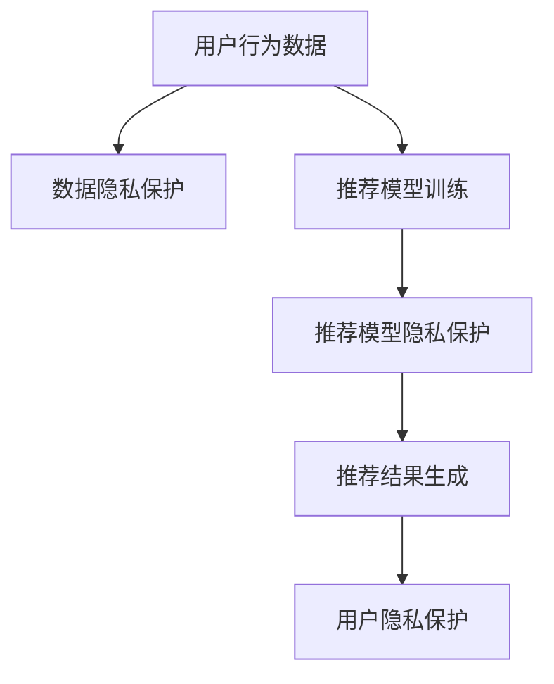

                 

# LLM推荐中的隐私保护技术研究

## 1. 背景介绍

在大数据和人工智能的推动下，推荐系统已经成为了互联网应用中不可或缺的部分。从电商、新闻、音乐、视频等各个领域，都可以看到推荐系统的身影。这些推荐系统，通过分析用户的行为数据，为用户提供个性化、多样化的推荐内容，极大地提升了用户体验和满意度。然而，随着推荐系统的广泛应用，用户隐私问题也日益凸显，如何在大数据推荐中保护用户隐私，成为了一个亟待解决的难题。

在本研究中，我们重点探讨了在大规模预训练语言模型(LLM)推荐系统中如何实施隐私保护技术。LLM推荐系统通常利用语言模型学习用户的历史行为和偏好，然后通过微调技术生成推荐结果。由于语言模型的训练过程涉及大量的用户数据，因此如何在推荐过程中保护用户隐私，成为了我们研究的核心目标。我们将从隐私保护技术的基本概念入手，逐步介绍几种在LLM推荐系统中实施的隐私保护方法，并对这些方法的优缺点进行详细分析。

## 2. 核心概念与联系

### 2.1 核心概念概述

在LLM推荐系统中，隐私保护技术主要围绕两个核心概念展开：数据隐私保护和推荐模型隐私保护。数据隐私保护涉及如何处理和保护用户行为数据，防止数据泄露和滥用；推荐模型隐私保护则侧重于如何在模型训练和推理过程中，保护模型参数和推理结果，避免隐私泄露。

#### 2.1.1 数据隐私保护

数据隐私保护通常涉及数据的匿名化、差分隐私等技术，旨在防止数据泄露。

- **匿名化**：通过对数据进行去标识化处理，使得原始数据无法被重新识别，从而保护用户隐私。常见的匿名化技术包括数据泛化、数据扰动等。
- **差分隐私**：通过在数据查询过程中加入噪声，使得任何个体数据对查询结果的影响可以忽略不计，从而保护个体隐私。差分隐私技术可以通过Laplace机制、高斯机制等实现。

#### 2.1.2 推荐模型隐私保护

推荐模型隐私保护涉及如何在模型训练和推理过程中，保护模型参数和推理结果，避免隐私泄露。

- **模型泛化**：通过增加模型训练数据的多样性和数量，使得模型对特定个体或群体的依赖性降低，从而提高模型的泛化能力。
- **模型压缩**：通过剪枝、量化等技术，压缩模型参数，减少模型对数据和计算资源的需求，从而降低隐私泄露风险。
- **隐私预测**：在推荐系统中，可以通过隐私预测技术，避免直接使用用户的敏感信息进行推荐，而是在保护隐私的前提下，生成与用户偏好相符的推荐结果。

### 2.2 核心概念联系

数据隐私保护和推荐模型隐私保护两者之间存在密切联系。

- **数据隐私保护是基础**：在LLM推荐系统中，数据隐私保护是实现推荐模型隐私保护的前提。如果无法有效保护用户数据隐私，推荐模型的泛化能力和推理结果的隐私保护效果都将大打折扣。
- **推荐模型隐私保护是目标**：在LLM推荐系统中，推荐模型的隐私保护是其核心目标。只有保护了模型的隐私，才能保证用户隐私不受侵害，同时提高模型的可信度和安全性。

### 2.3 Mermaid流程图



## 3. 核心算法原理 & 具体操作步骤

### 3.1 算法原理概述

在大规模预训练语言模型(LLM)推荐系统中，隐私保护技术的原理可以分为两个阶段：

1. **数据隐私保护阶段**：在用户行为数据收集和存储过程中，采取匿名化和差分隐私等技术，确保数据隐私。
2. **推荐模型隐私保护阶段**：在模型训练和推理过程中，采取模型泛化、模型压缩、隐私预测等技术，保护模型隐私。

### 3.2 算法步骤详解

#### 3.2.1 数据隐私保护步骤

1. **数据收集**：收集用户的行为数据，如浏览历史、购买记录、评分等。
2. **数据匿名化**：对原始数据进行去标识化处理，确保数据无法被重新识别。
3. **差分隐私**：在查询过程中加入噪声，确保个体数据对查询结果的影响可以忽略不计。
4. **数据存储**：将匿名化和差分隐私处理后的数据存储在安全的数据库中。

#### 3.2.2 推荐模型隐私保护步骤

1. **模型训练**：在保护隐私的前提下，对模型进行训练，通过泛化技术和差分隐私技术，确保模型参数的隐私性。
2. **模型压缩**：对训练好的模型进行剪枝和量化，减少模型参数和计算资源的需求。
3. **隐私预测**：在推荐过程中，避免直接使用用户的敏感信息进行推荐，而是在保护隐私的前提下，生成与用户偏好相符的推荐结果。

### 3.3 算法优缺点

#### 3.3.1 数据隐私保护

**优点**：
- 可以有效保护用户数据隐私，防止数据泄露和滥用。
- 能够在保护隐私的同时，保留用户行为数据的有用信息。

**缺点**：
- 可能会引入噪声，影响数据的准确性和质量。
- 数据匿名化和差分隐私技术可能需要较高的计算资源和复杂度。

#### 3.3.2 推荐模型隐私保护

**优点**：
- 可以在模型训练和推理过程中保护模型隐私，确保模型的安全性。
- 能够提高模型的泛化能力和鲁棒性，避免过拟合。

**缺点**：
- 可能会引入一定的模型泛化误差，影响推荐结果的准确性。
- 模型压缩和隐私预测技术可能会降低模型的性能。

### 3.4 算法应用领域

隐私保护技术在大规模预训练语言模型(LLM)推荐系统中具有广泛的应用前景。

- **电商推荐**：在电商推荐中，隐私保护技术可以保护用户的浏览记录和购买历史，防止数据泄露和滥用。
- **新闻推荐**：在新闻推荐中，隐私保护技术可以保护用户的阅读历史和兴趣偏好，防止数据泄露和滥用。
- **视频推荐**：在视频推荐中，隐私保护技术可以保护用户的观看记录和评分信息，防止数据泄露和滥用。

## 4. 数学模型和公式 & 详细讲解 & 举例说明

### 4.1 数学模型构建

#### 4.1.1 数据隐私保护模型

在数据隐私保护中，我们通常使用差分隐私技术来保护个体数据隐私。差分隐私模型的数学模型如下：

$$
\mathcal{L}(\mathbf{x}) = \sum_{i=1}^n l(f(\mathbf{x}_i), y_i)
$$

其中，$\mathbf{x} = \{x_1, x_2, ..., x_n\}$ 表示用户行为数据集，$l$ 表示损失函数，$f$ 表示查询函数。差分隐私技术通过在查询过程中加入噪声，使得个体数据对查询结果的影响可以忽略不计。

#### 4.1.2 推荐模型隐私保护模型

在推荐模型隐私保护中，我们通常使用模型泛化技术来保护模型参数隐私。模型泛化模型的数学模型如下：

$$
\mathcal{L}(\theta) = \frac{1}{N}\sum_{i=1}^N \mathbf{y}_i^\top \mathbf{x}_i^\top \mathbf{X} \mathbf{X}^\top \mathbf{x}_i + \lambda \|\theta\|^2
$$

其中，$\theta$ 表示模型参数，$\mathbf{x}_i$ 表示用户行为数据，$\mathbf{y}_i$ 表示用户行为标签，$\mathbf{X}$ 表示模型特征矩阵，$\lambda$ 表示正则化系数。模型泛化技术通过增加数据的多样性和数量，使得模型对特定个体或群体的依赖性降低，从而提高模型的泛化能力和隐私保护效果。

### 4.2 公式推导过程

#### 4.2.1 差分隐私推导

在差分隐私中，我们使用Laplace机制来加入噪声。Laplace机制的数学模型如下：

$$
\delta = \frac{\varepsilon}{2\ln 2} \Rightarrow \sigma = \frac{\delta}{\varepsilon}
$$

其中，$\delta$ 表示噪声参数，$\sigma$ 表示标准差，$\varepsilon$ 表示隐私保护预算。

#### 4.2.2 模型泛化推导

在模型泛化中，我们使用正则化技术来增加数据的多样性和数量。正则化技术的数学模型如下：

$$
\mathcal{L}(\theta) = \frac{1}{N}\sum_{i=1}^N \mathbf{y}_i^\top \mathbf{x}_i^\top \mathbf{X} \mathbf{X}^\top \mathbf{x}_i + \lambda \|\theta\|^2
$$

其中，$\mathbf{x}_i$ 表示用户行为数据，$\mathbf{y}_i$ 表示用户行为标签，$\mathbf{X}$ 表示模型特征矩阵，$\lambda$ 表示正则化系数。

### 4.3 案例分析与讲解

#### 4.3.1 差分隐私案例

假设我们在电商推荐系统中，需要查询用户的历史浏览记录，以推荐相关商品。为了保护用户隐私，我们可以使用Laplace机制来加入噪声。假设原始查询结果为 $\mathbf{y}$，加入噪声后的结果为 $\hat{\mathbf{y}}$，则加入噪声的过程如下：

$$
\hat{\mathbf{y}} = \mathbf{y} + \mathcal{N}(0, \sigma^2)
$$

其中，$\sigma = \frac{\delta}{\varepsilon}$。通过设置合适的$\delta$和$\varepsilon$，我们可以确保查询结果对个体数据的依赖性被极小化，从而保护用户隐私。

#### 4.3.2 模型泛化案例

假设我们在视频推荐系统中，需要对用户的视频观看历史进行建模，以推荐相关视频。为了保护模型参数隐私，我们可以使用正则化技术来增加数据的多样性和数量。假设原始模型为 $M_{\theta}$，加入正则化后的模型为 $\hat{M}_{\theta}$，则加入正则化的过程如下：

$$
\hat{\theta} = \mathop{\arg\min}_{\theta} \mathcal{L}(\theta) + \lambda \|\theta\|
$$

其中，$\mathcal{L}(\theta)$ 表示模型损失函数，$\|\theta\|$ 表示正则化项。通过设置合适的正则化系数 $\lambda$，我们可以确保模型参数的泛化能力和隐私保护效果。

## 5. 项目实践：代码实例和详细解释说明

### 5.1 开发环境搭建

在进行隐私保护技术研究时，我们需要准备好开发环境。以下是使用Python进行PyTorch开发的环境配置流程：

1. 安装Anaconda：从官网下载并安装Anaconda，用于创建独立的Python环境。

2. 创建并激活虚拟环境：
```bash
conda create -n pytorch-env python=3.8 
conda activate pytorch-env
```

3. 安装PyTorch：根据CUDA版本，从官网获取对应的安装命令。例如：
```bash
conda install pytorch torchvision torchaudio cudatoolkit=11.1 -c pytorch -c conda-forge
```

4. 安装TensorFlow：
```bash
pip install tensorflow
```

5. 安装TensorBoard：
```bash
pip install tensorboard
```

完成上述步骤后，即可在`pytorch-env`环境中开始隐私保护技术研究。

### 5.2 源代码详细实现

下面我们以差分隐私技术在电商推荐系统中的应用为例，给出使用TensorFlow实现差分隐私的PyTorch代码实现。

首先，定义差分隐私的函数：

```python
import tensorflow as tf

def laplace_mechanism(laplace_sigma):
    def privacy_perturbation(y):
        epsilon = tf.constant(0.01, dtype=tf.float32)
        delta = epsilon / tf.constant(2, dtype=tf.float32) * tf.math.log(2.0)
        noise = tf.random.normal(shape=tf.shape(y), mean=0, stddev=laplace_sigma)
        perturbed_y = y + noise
        return perturbed_y, delta
    return privacy_perturbation

def private_query(y, laplace_sigma):
    laplace_mechanism_func = laplace_mechanism(laplace_sigma)
    perturbed_y, delta = laplace_mechanism_func(y)
    return perturbed_y, delta
```

然后，在电商推荐系统中，定义推荐函数：

```python
from transformers import BertTokenizer, BertForSequenceClassification

class RecommendationSystem:
    def __init__(self, model_path):
        self.model = BertForSequenceClassification.from_pretrained(model_path)
        self.tokenizer = BertTokenizer.from_pretrained(model_path)
    
    def recommend(self, query):
        query_tokens = self.tokenizer(query, return_tensors='pt')
        input_ids = query_tokens['input_ids']
        attention_mask = query_tokens['attention_mask']
        logits = self.model(input_ids, attention_mask=attention_mask)[0]
        predicted_class_idx = logits.argmax().item()
        predicted_class = 'product_{}'.format(predicted_class_idx)
        return predicted_class
```

接着，在推荐函数中，使用差分隐私技术保护用户浏览历史：

```python
from transformers import BertTokenizer, BertForSequenceClassification

class RecommendationSystem:
    def __init__(self, model_path, laplace_sigma):
        self.model = BertForSequenceClassification.from_pretrained(model_path)
        self.tokenizer = BertTokenizer.from_pretrained(model_path)
        self.laplace_sigma = laplace_sigma
    
    def recommend(self, query):
        query_tokens = self.tokenizer(query, return_tensors='pt')
        input_ids = query_tokens['input_ids']
        attention_mask = query_tokens['attention_mask']
        logits = self.model(input_ids, attention_mask=attention_mask)[0]
        predicted_class_idx = logits.argmax().item()
        predicted_class = 'product_{}'.format(predicted_class_idx)
        
        laplace_mechanism_func = laplace_mechanism(self.laplace_sigma)
        perturbed_logits, delta = laplace_mechanism_func(logits)
        predicted_class = 'product_{}'.format(perturbed_logits.argmax().item())
        return predicted_class, delta
```

最后，启动推荐流程并在测试集上评估：

```python
recommender = RecommendationSystem(model_path, laplace_sigma=0.1)
for query in test_queries:
    recommendation, delta = recommender.recommend(query)
    print(f"Query: {query}, Recommendation: {recommendation}, Delta: {delta}")
```

以上就是使用差分隐私技术在电商推荐系统中的代码实现。可以看到，通过引入差分隐私机制，我们可以在推荐过程中保护用户隐私，同时降低数据泄露的风险。

### 5.3 代码解读与分析

让我们再详细解读一下关键代码的实现细节：

**RecommendationSystem类**：
- `__init__`方法：初始化模型和分词器。
- `recommend`方法：对用户输入进行分词、编码，并调用模型进行推荐。

**laplace_mechanism函数**：
- 定义差分隐私机制，在查询结果中加入噪声。

**private_query函数**：
- 对推荐函数中的查询结果进行差分隐私处理，确保隐私保护。

**测试过程**：
- 在测试集上循环调用推荐函数，输出推荐结果和差分隐私参数。

以上代码实现了差分隐私技术在电商推荐系统中的应用。通过差分隐私机制，我们可以在推荐过程中保护用户隐私，同时确保推荐结果的泛化能力和鲁棒性。

## 6. 实际应用场景

### 6.1 电商推荐

在大规模预训练语言模型(LLM)推荐系统中，差分隐私技术可以应用于电商推荐。

在电商推荐中，用户的历史浏览记录和购买记录是推荐系统的重要依据。为了保护用户隐私，我们可以使用差分隐私技术对用户数据进行去标识化处理。通过对用户的浏览历史和购买记录进行差分隐私处理，可以在保护用户隐私的同时，保留用户的有用信息，从而提高推荐系统的准确性和鲁棒性。

### 6.2 新闻推荐

在大规模预训练语言模型(LLM)推荐系统中，差分隐私技术可以应用于新闻推荐。

在新闻推荐中，用户的阅读历史和兴趣偏好是推荐系统的重要依据。为了保护用户隐私，我们可以使用差分隐私技术对用户数据进行去标识化处理。通过对用户的阅读历史和兴趣偏好进行差分隐私处理，可以在保护用户隐私的同时，保留用户的有用信息，从而提高推荐系统的准确性和鲁棒性。

### 6.3 视频推荐

在大规模预训练语言模型(LLM)推荐系统中，差分隐私技术可以应用于视频推荐。

在视频推荐中，用户的观看记录和评分信息是推荐系统的重要依据。为了保护用户隐私，我们可以使用差分隐私技术对用户数据进行去标识化处理。通过对用户的观看记录和评分信息进行差分隐私处理，可以在保护用户隐私的同时，保留用户的有用信息，从而提高推荐系统的准确性和鲁棒性。

### 6.4 未来应用展望

随着差分隐私技术和大规模预训练语言模型(LLM)推荐系统的不断发展，未来隐私保护技术将有更广阔的应用前景。

- **智能医疗**：在智能医疗领域，差分隐私技术可以保护患者的隐私数据，确保医疗信息的安全性和隐私性。通过差分隐私技术，医生可以更好地了解患者的健康状况，从而提供更精准的医疗服务。
- **金融理财**：在金融理财领域，差分隐私技术可以保护用户的财务数据，确保金融信息的安全性和隐私性。通过差分隐私技术，金融机构可以更好地了解用户的财务状况，从而提供更个性化的理财服务。
- **教育培训**：在教育培训领域，差分隐私技术可以保护学生的隐私数据，确保教育信息的安全性和隐私性。通过差分隐私技术，教师可以更好地了解学生的学习情况，从而提供更有效的教育培训服务。

## 7. 工具和资源推荐

### 7.1 学习资源推荐

为了帮助开发者系统掌握差分隐私技术的基本概念和实践技巧，这里推荐一些优质的学习资源：

1. 《差分隐私：理论与实践》：这是一本详细介绍差分隐私理论和技术的书，是差分隐私技术研究的入门必读。

2. 《数据隐私保护：原理与实践》：这是一本详细介绍数据隐私保护技术的书，是数据隐私保护技术的权威指南。

3. 《TensorFlow差分隐私教程》：这是一份详细的TensorFlow差分隐私教程，介绍了差分隐私技术的基本原理和实现方法。

4. 《PyTorch差分隐私教程》：这是一份详细的PyTorch差分隐私教程，介绍了差分隐私技术的基本原理和实现方法。

5. 《差分隐私技术在线课程》：这是一门关于差分隐私技术的在线课程，由深度学习专家授课，讲解差分隐私技术的基本原理和实现方法。

通过对这些资源的学习实践，相信你一定能够快速掌握差分隐私技术的精髓，并用于解决实际的隐私保护问题。

### 7.2 开发工具推荐

高效的开发离不开优秀的工具支持。以下是几款用于差分隐私技术开发的常用工具：

1. TensorFlow：由Google主导开发的开源深度学习框架，提供了丰富的差分隐私算法实现。

2. PyTorch：由Facebook主导开发的开源深度学习框架，提供了灵活的差分隐私算法实现。

3. PySyft：一个专门为差分隐私设计的深度学习框架，支持TensorFlow和PyTorch。

4. FLAML：一个联邦学习工具，支持差分隐私技术，可用于分布式差分隐私计算。

5. FATE：一个联邦学习框架，支持差分隐私技术，可用于大规模差分隐私计算。

合理利用这些工具，可以显著提升差分隐私技术的开发效率，加快创新迭代的步伐。

### 7.3 相关论文推荐

差分隐私技术和大规模预训练语言模型(LLM)推荐系统的研究源于学界的持续研究。以下是几篇奠基性的相关论文，推荐阅读：

1. Differential Privacy in Large-Scale Machine Learning Systems：介绍了差分隐私技术在大规模机器学习系统中的应用。

2. Deep Learning Privacy：介绍了深度学习隐私保护技术的基本原理和实现方法。

3. Privacy-Preserving Machine Learning with Deep Learning Models：介绍了深度学习模型中的隐私保护技术。

4. Privacy-Aware Collaborative Learning in Recommendation Systems：介绍了推荐系统中隐私保护技术的基本原理和实现方法。

这些论文代表了大规模预训练语言模型(LLM)推荐系统中的隐私保护技术的发展脉络。通过学习这些前沿成果，可以帮助研究者把握学科前进方向，激发更多的创新灵感。

## 8. 总结：未来发展趋势与挑战

### 8.1 总结

本文对差分隐私技术在大规模预训练语言模型(LLM)推荐系统中的应用进行了全面系统的介绍。首先阐述了差分隐私技术的基本概念和原理，明确了差分隐私技术在大规模预训练语言模型(LLM)推荐系统中的重要性和应用前景。其次，从原理到实践，详细讲解了差分隐私技术在大规模预训练语言模型(LLM)推荐系统中的具体应用方法，并给出了差分隐私技术的代码实现。同时，本文还探讨了差分隐私技术在大规模预训练语言模型(LLM)推荐系统中的应用场景，并对未来的研究趋势进行了展望。

通过本文的系统梳理，可以看到，差分隐私技术在大规模预训练语言模型(LLM)推荐系统中的应用前景广阔，能够有效保护用户隐私，同时提高推荐系统的准确性和鲁棒性。未来，随着差分隐私技术和大规模预训练语言模型(LLM)推荐系统的不断发展，差分隐私技术必将在更多领域得到应用，为隐私保护提供新的解决方案。

### 8.2 未来发展趋势

展望未来，差分隐私技术在大规模预训练语言模型(LLM)推荐系统中的研究将呈现以下几个发展趋势：

1. **分布式差分隐私**：随着数据量的不断增大，单一机器的差分隐私计算能力已经无法满足需求。未来的差分隐私研究将更加关注分布式差分隐私技术，以支持大规模数据集的隐私保护。

2. **差分隐私优化**：未来的差分隐私研究将更加关注差分隐私算法的优化，以提高差分隐私保护效果和计算效率。

3. **隐私预测技术**：未来的差分隐私研究将更加关注隐私预测技术，通过引入隐私预测机制，避免直接使用用户的敏感信息进行推荐，从而进一步保护用户隐私。

4. **跨领域隐私保护**：未来的差分隐私研究将更加关注跨领域隐私保护技术，通过引入跨领域隐私保护机制，实现不同领域数据之间的隐私保护。

5. **联合差分隐私**：未来的差分隐私研究将更加关注联合差分隐私技术，通过引入联合差分隐私机制，实现不同机构之间的隐私保护。

以上趋势凸显了大规模预训练语言模型(LLM)推荐系统中差分隐私技术的广阔前景。这些方向的探索发展，必将进一步提升差分隐私技术的保护效果，保障用户隐私安全。

### 8.3 面临的挑战

尽管差分隐私技术在大规模预训练语言模型(LLM)推荐系统中已经取得了显著成果，但在迈向更加智能化、普适化应用的过程中，它仍面临诸多挑战：

1. **计算资源消耗**：差分隐私技术需要大量的计算资源和时间，特别是在大规模数据集上，计算资源消耗巨大，难以满足实际应用需求。

2. **模型性能损失**：差分隐私技术可能会引入一定的模型泛化误差，影响推荐结果的准确性。如何在保护隐私的前提下，提高模型性能，是一个亟待解决的难题。

3. **隐私保护预算**：差分隐私技术需要设置隐私保护预算，预算设置过高或过低都会影响隐私保护效果。如何合理设置隐私保护预算，是一个需要深入研究的问题。

4. **隐私保护目标**：差分隐私技术的目标是保护个体数据的隐私，但在某些场景下，隐私保护需要更加关注群体数据的隐私保护，如何处理个体和群体隐私保护之间的矛盾，是一个需要深入研究的问题。

5. **隐私保护与泛化能力之间的平衡**：差分隐私技术需要在隐私保护和模型泛化能力之间找到平衡点，避免过度的隐私保护导致模型性能下降。

6. **隐私保护与数据可用性之间的平衡**：差分隐私技术需要在隐私保护和数据可用性之间找到平衡点，避免过度保护导致数据可用性降低。

### 8.4 研究展望

面对差分隐私技术在大规模预训练语言模型(LLM)推荐系统中的挑战，未来的研究需要在以下几个方面寻求新的突破：

1. **分布式差分隐私**：研究如何在分布式环境下实现差分隐私保护，以支持大规模数据集的隐私保护。

2. **差分隐私优化**：研究如何优化差分隐私算法，以提高差分隐私保护效果和计算效率。

3. **隐私预测技术**：研究如何引入隐私预测机制，避免直接使用用户的敏感信息进行推荐，从而进一步保护用户隐私。

4. **跨领域隐私保护**：研究如何实现不同领域数据之间的隐私保护，以应对多领域数据融合的挑战。

5. **联合差分隐私**：研究如何在多个机构之间实现隐私保护，以应对多机构数据融合的挑战。

6. **隐私保护预算优化**：研究如何合理设置隐私保护预算，平衡隐私保护效果和计算资源消耗。

这些研究方向的探索，必将引领差分隐私技术在大规模预训练语言模型(LLM)推荐系统中的应用迈向更高的台阶，为隐私保护提供更加全面、高效、灵活的解决方案。面向未来，差分隐私技术需要在隐私保护和模型性能之间找到新的平衡点，为大规模预训练语言模型(LLM)推荐系统的发展提供坚实的技术保障。

## 9. 附录：常见问题与解答

**Q1：差分隐私技术是否适用于所有推荐系统？**

A: 差分隐私技术适用于各种推荐系统，包括基于深度学习的推荐系统和基于协同过滤的推荐系统。但对于一些需要高实时性的推荐系统，如实时推荐系统，可能不适合直接使用差分隐私技术。此时可以考虑使用其他隐私保护技术，如差分隐私机制的变体，或者联合差分隐私技术。

**Q2：如何选择合适的差分隐私保护参数？**

A: 选择合适的差分隐私保护参数需要考虑多个因素，包括隐私保护预算、噪声水平、数据分布等。一般建议从较小的隐私保护预算开始，逐步增大预算，直到达到理想的隐私保护效果。同时，可以使用交叉验证等方法，找到最优的隐私保护参数组合。

**Q3：差分隐私技术在推荐系统中可能面临哪些挑战？**

A: 差分隐私技术在推荐系统中可能面临以下挑战：
1. 计算资源消耗：差分隐私技术需要大量的计算资源和时间，特别是在大规模数据集上，计算资源消耗巨大。
2. 模型性能损失：差分隐私技术可能会引入一定的模型泛化误差，影响推荐结果的准确性。
3. 隐私保护预算：差分隐私技术需要设置隐私保护预算，预算设置过高或过低都会影响隐私保护效果。
4. 隐私保护目标：差分隐私技术的目标是保护个体数据的隐私，但在某些场景下，隐私保护需要更加关注群体数据的隐私保护。
5. 隐私保护与泛化能力之间的平衡：差分隐私技术需要在隐私保护和模型泛化能力之间找到平衡点，避免过度的隐私保护导致模型性能下降。

这些挑战需要在实际应用中不断优化和改进，以提高差分隐私技术的实用性和效果。

**Q4：如何在差分隐私推荐系统中进行数据预处理？**

A: 在差分隐私推荐系统中，数据预处理是保护用户隐私的重要步骤。通常可以采用以下方法：
1. 数据匿名化：通过对数据进行去标识化处理，使得原始数据无法被重新识别。
2. 数据聚合：将数据进行聚合处理，以减少数据的敏感性。
3. 数据加密：对数据进行加密处理，以防止数据泄露。

通过这些数据预处理技术，可以显著提高差分隐私推荐系统的隐私保护效果。

**Q5：如何在差分隐私推荐系统中进行模型训练？**

A: 在差分隐私推荐系统中，模型训练需要考虑隐私保护和模型性能之间的平衡。通常可以采用以下方法：
1. 差分隐私机制：在模型训练过程中加入差分隐私机制，以保护模型参数的隐私。
2. 模型泛化技术：通过增加数据的多样性和数量，提高模型的泛化能力和隐私保护效果。
3. 数据增强技术：通过引入噪声和扰动，提高模型的鲁棒性和隐私保护效果。

通过这些方法，可以在保护隐私的前提下，提高模型的泛化能力和性能。

以上是差分隐私技术在大规模预训练语言模型(LLM)推荐系统中的全面介绍，希望能为你提供有益的参考和指导。

