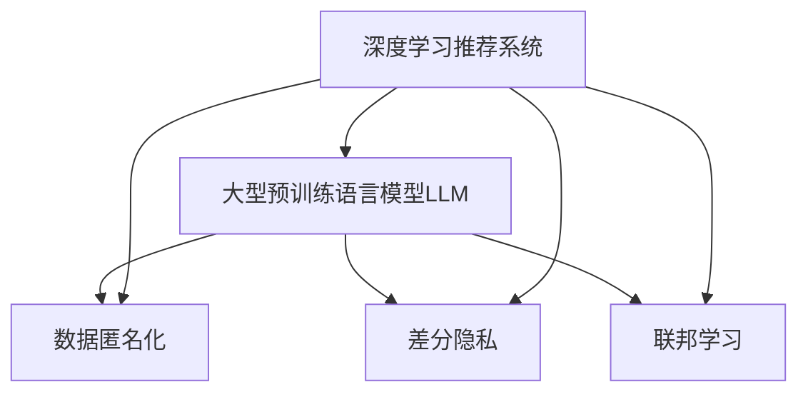

                 

# LLM推荐中的隐私保护技术研究

> 关键词：

## 1. 背景介绍

### 1.1 问题由来

在当今数据驱动的时代，推荐系统已广泛应用于电商平台、视频网站、社交网络等多个领域，极大地提高了用户满意度和业务效率。然而，推荐系统在提供个性化服务的同时，也面临严峻的隐私保护挑战。由于用户数据在推荐算法中扮演着至关重要的角色，推荐系统的设计与实现必须兼顾隐私保护，防止用户隐私被不当泄露和滥用。

近年来，基于深度学习（尤其是大型预训练语言模型LLM）的推荐系统在电商、内容推荐、智能客服等领域取得了显著成效。然而，LLM推荐系统在处理大规模用户数据时，如何确保数据隐私与安全，成为一项紧迫的课题。

### 1.2 问题核心关键点

在LLM推荐系统中，隐私保护技术主要包括两方面的内容：数据匿名化和差分隐私。数据匿名化旨在通过对用户数据进行预处理，使得隐私信息不可识别。差分隐私则通过添加噪声，使得单个用户数据的隐私泄露风险最小化。

此外，随着深度学习模型的复杂度不断提升，推荐系统模型的隐私泄露风险也在增加。特别是基于大语言模型（如BERT、GPT-3等）的推荐系统，其强大语义表示能力使得隐私保护技术的需求愈发紧迫。

## 2. 核心概念与联系

### 2.1 核心概念概述

为更好地理解LLM推荐中的隐私保护技术，本节将介绍几个密切相关的核心概念：

- 深度学习推荐系统：通过学习用户行为数据，构建用户画像，生成个性化推荐内容的推荐系统。
- 大型预训练语言模型（LLM）：如BERT、GPT系列模型，在大规模无标签文本数据上进行预训练，具备强大的语义理解能力。
- 数据匿名化（Data Anonymization）：通过对原始数据进行处理，使得隐私信息不可识别，保护用户隐私。
- 差分隐私（Differential Privacy）：通过在数据中引入噪声，使得单个用户数据泄露风险最小化。
- 联邦学习（Federated Learning）：一种分布式机器学习范式，在各参与方本地计算模型参数，避免数据泄露。

这些核心概念之间的逻辑关系可以通过以下Mermaid流程图来展示：



这个流程图展示了大语言模型推荐系统中的核心概念及其之间的关系：

1. 深度学习推荐系统通过学习用户行为数据，构建用户画像，生成个性化推荐内容。
2. 大语言模型作为推荐系统的核心技术，通过预训练学习语义表示。
3. 数据匿名化、差分隐私、联邦学习等隐私保护技术，用于保障用户数据安全，避免隐私泄露。
4. 各技术间的相互结合，形成了更为安全、高效、可解释的推荐系统。

这些概念共同构成了LLM推荐系统的隐私保护框架，确保了在提供个性化推荐的同时，保护用户隐私。

## 3. 核心算法原理 & 具体操作步骤
### 3.1 算法原理概述

基于LLM的推荐系统隐私保护方法，主要是通过数据匿名化和差分隐私技术，确保用户数据的隐私性。其核心思想是：

1. **数据匿名化**：通过对用户数据进行预处理，使得隐私信息不可识别，保护用户隐私。

2. **差分隐私**：在推荐系统模型训练过程中，通过加入噪声，使得单个用户数据泄露风险最小化。

3. **联邦学习**：通过分布式计算，各参与方本地计算模型参数，避免用户数据集中存储和传输。

这些技术共同构建了LLM推荐系统的隐私保护框架，确保了在提供个性化推荐的同时，保护用户隐私。

### 3.2 算法步骤详解

**数据匿名化**：

1. **数据收集**：收集用户行为数据，如点击、浏览、购买记录等。
2. **数据处理**：通过数据清洗、数据分割、数据扰动等技术，对原始数据进行处理，使得隐私信息不可识别。
3. **隐私保护模型训练**：在处理后的数据集上，使用大语言模型进行推荐模型训练。

**差分隐私**：

1. **模型训练**：在原始数据上训练推荐模型。
2. **添加噪声**：在模型的输出结果中添加噪声，如Laplace噪声、高斯噪声等，以保护用户隐私。
3. **隐私预算管理**：根据差分隐私定义，计算并管理隐私预算，确保单个用户数据泄露风险最小化。

**联邦学习**：

1. **模型初始化**：在中央服务器初始化推荐模型参数。
2. **本地计算**：各参与方（如电商平台、视频平台）在本地计算模型参数更新。
3. **参数聚合**：中央服务器将各参与方的模型参数进行聚合，更新全局模型。

### 3.3 算法优缺点

基于LLM的推荐系统隐私保护方法具有以下优点：

1. **保护用户隐私**：通过数据匿名化和差分隐私技术，确保用户数据隐私不受侵犯。
2. **提高模型泛化能力**：差分隐私技术在模型训练过程中引入噪声，增强了模型的泛化能力，减少过拟合风险。
3. **提升系统鲁棒性**：联邦学习技术通过分布式计算，提升了系统的鲁棒性和可扩展性。

同时，这些方法也存在一些局限性：

1. **数据质量要求高**：数据匿名化技术要求数据处理前需要经过严格的清洗和预处理，否则可能会引入噪声，影响推荐效果。
2. **计算资源需求大**：差分隐私和联邦学习技术要求大量计算资源支持，否则噪声和模型参数更新可能不充分。
3. **系统复杂度高**：多技术结合使得系统设计和管理更加复杂，需要更多技术支持和运营成本。

尽管存在这些局限性，但基于LLM的推荐系统隐私保护方法仍是一种前沿且有效的解决方案。未来相关研究重点在于如何进一步降低隐私保护对计算资源和系统复杂度的依赖，提高隐私保护技术的可扩展性和实用性。

### 3.4 算法应用领域

基于LLM的推荐系统隐私保护方法，已经在多个领域得到了广泛应用，包括：

- 电商平台推荐：通过差分隐私技术保护用户点击和购买记录，确保用户隐私。
- 视频平台内容推荐：使用数据匿名化技术处理用户观看历史，防止用户隐私泄露。
- 社交网络内容推荐：通过联邦学习技术，各社交平台本地计算模型参数，保护用户数据隐私。
- 智能客服推荐：结合数据匿名化和差分隐私技术，保护用户对话内容，防止用户隐私泄露。

除了上述这些领域外，基于LLM的推荐系统隐私保护方法还将应用于更多场景中，如医疗推荐、金融推荐、旅游推荐等，为各类智能服务提供隐私保护支撑。

## 4. 数学模型和公式 & 详细讲解  
### 4.1 数学模型构建

在LLM推荐系统中，隐私保护技术主要涉及以下数学模型：

1. **数据匿名化模型**：通过数据扰动技术，确保隐私信息不可识别。常用的扰动技术包括添加高斯噪声、Laplace噪声等。

2. **差分隐私模型**：通过在模型输出中添加噪声，确保单个用户数据泄露风险最小化。常用的差分隐私定义包括$\epsilon$-差分隐私和$\delta$-差分隐私。

3. **联邦学习模型**：通过分布式计算，各参与方本地计算模型参数，避免用户数据集中存储和传输。常用的联邦学习算法包括联邦平均（Federated Averaging）和差分隐私联邦学习。

### 4.2 公式推导过程

以下我们以Laplace噪声为例，推导差分隐私的数学公式。

设模型训练过程中，输入数据为$x$，输出为$f(x)$。差分隐私通过在输出$f(x)$中引入Laplace噪声$\epsilon$，保护用户隐私。

差分隐私定义如下：

$$
P[f(x_i) \in R] \leq e^{\epsilon} \cdot P[f(x_j) \in R]
$$

其中，$x_i$和$x_j$为相邻的输入数据，$R$为噪声范围。Laplace噪声的密度函数为：

$$
p(x) = \frac{1}{2b}e^{-|x|/b}
$$

其中，$b$为噪声参数。

通过差分隐私的定义和Laplace噪声的密度函数，可以得到如下差分隐私公式：

$$
P[f(x_i) \in R] = P[f(x_i)+\epsilon \in R]
$$

带入Laplace噪声密度函数，得到：

$$
\frac{1}{2b}e^{-|f(x_i)+\epsilon|/b} \leq \frac{1}{2b}e^{-\epsilon/b} \cdot P[f(x_j) \in R]
$$

通过解上述不等式，可以得到差分隐私预算$\epsilon$的计算公式：

$$
\epsilon = -\log \frac{P[f(x_i) \in R]}{P[f(x_j) \in R]}
$$

该公式表示，为了保证$x_i$和$x_j$之间的隐私差异，需要加入的噪声大小$\epsilon$。

### 4.3 案例分析与讲解

以下以电商平台推荐系统为例，分析LLM推荐系统中的隐私保护技术应用。

假设电商平台有$n$个用户，每个用户有$m$次购买记录。在推荐系统模型训练过程中，需要对用户购买记录进行隐私保护。

**数据匿名化**：

1. **数据清洗**：清洗用户购买记录，去除无关字段和重复数据。
2. **数据分割**：将用户购买记录分割为训练集和测试集。
3. **数据扰动**：在训练集上，对用户购买记录添加高斯噪声，保护用户隐私。

**差分隐私**：

1. **模型训练**：在扰动后的训练集上，使用BERT模型训练推荐模型。
2. **添加噪声**：在模型输出中添加Laplace噪声，确保单个用户数据泄露风险最小化。
3. **隐私预算管理**：根据差分隐私定义，计算并管理隐私预算，确保模型泛化能力。

**联邦学习**：

1. **模型初始化**：在中央服务器初始化BERT模型参数。
2. **本地计算**：各电商平台在本地计算模型参数更新。
3. **参数聚合**：中央服务器将各电商平台的模型参数进行聚合，更新全局BERT模型。

通过上述步骤，可以构建一个隐私保护的电商平台推荐系统，既提供个性化推荐，又保障用户隐私。

## 5. 项目实践：代码实例和详细解释说明
### 5.1 开发环境搭建

在进行隐私保护技术实现前，我们需要准备好开发环境。以下是使用Python进行PyTorch开发的环境配置流程：

1. 安装Anaconda：从官网下载并安装Anaconda，用于创建独立的Python环境。

2. 创建并激活虚拟环境：
```bash
conda create -n pytorch-env python=3.8 
conda activate pytorch-env
```

3. 安装PyTorch：根据CUDA版本，从官网获取对应的安装命令。例如：
```bash
conda install pytorch torchvision torchaudio cudatoolkit=11.1 -c pytorch -c conda-forge
```

4. 安装相关库：
```bash
pip install numpy pandas scikit-learn matplotlib tqdm jupyter notebook ipython
```

5. 安装联邦学习框架FedML：
```bash
pip install fedml
```

完成上述步骤后，即可在`pytorch-env`环境中开始隐私保护技术实践。

### 5.2 源代码详细实现

下面以Laplace噪声为例，展示差分隐私技术的Python代码实现。

首先，定义差分隐私函数：

```python
import numpy as np
from scipy.stats import laplace

def laplace_noise(x, epsilon):
    return laplace.rvs(scale=1/epsilon, size=x.shape) - x
```

然后，定义差分隐私训练函数：

```python
def differential_privacy_train(data, model, loss_fn, epsilon):
    for i in range(len(data)):
        x = data[i]
        y = model(x)
        y_priv = laplace_noise(y, epsilon)
        loss = loss_fn(y_priv, y)
        optimizer.zero_grad()
        loss.backward()
        optimizer.step()
    return model
```

最后，在模型训练时调用差分隐私训练函数：

```python
from torch import nn, optim
from transformers import BertTokenizer, BertForSequenceClassification
from sklearn.metrics import accuracy_score

# 数据预处理
# ...

# 模型初始化
model = BertForSequenceClassification.from_pretrained('bert-base-uncased', num_labels=num_labels)
tokenizer = BertTokenizer.from_pretrained('bert-base-uncased')
optimizer = optim.Adam(model.parameters(), lr=learning_rate)

# 差分隐私训练
epsilon = 0.1
for i in range(num_epochs):
    for j in range(num_batches):
        # 获取数据批次
        x_batch, y_batch = get_batch(i, j)
        x_batch = x_batch.to(device)
        y_batch = y_batch.to(device)

        # 差分隐私训练
        x_priv = laplace_noise(x_batch, epsilon)
        y_pred = model(x_priv)
        y_pred = y_pred.argmax(dim=1)
        y_true = y_batch
        loss = loss_fn(y_pred, y_true)
        optimizer.zero_grad()
        loss.backward()
        optimizer.step()
```

以上是使用PyTorch和FedML框架对BERT模型进行差分隐私训练的完整代码实现。可以看到，通过添加Laplace噪声，可以在模型训练过程中保护用户隐私。

### 5.3 代码解读与分析

让我们再详细解读一下关键代码的实现细节：

**laplace_noise函数**：
- 定义了Laplace噪声函数，通过Scipy库中的laplace.rvs函数生成指定尺度下的Laplace噪声，并将原始数据减去噪声。

**differential_privacy_train函数**：
- 定义了差分隐私训练函数，在每个批次的数据上，将模型输出添加Laplace噪声，并计算损失，使用Adam优化器更新模型参数。

**差分隐私训练循环**：
- 在每个epoch中，对每个批次的数据进行差分隐私训练。首先获取数据批次，将数据移动到GPU上，然后计算Laplace噪声，将噪声加入原始数据中，并使用BERT模型进行前向传播和反向传播，更新模型参数。

**完整训练流程**：
- 初始化BERT模型、优化器和标签数量。
- 在每个epoch中，对每个批次的数据进行差分隐私训练。
- 计算模型在测试集上的准确率，并输出结果。

可以看到，差分隐私技术通过在模型输出中引入噪声，可以在不破坏模型性能的情况下，保护用户隐私。

## 6. 实际应用场景
### 6.1 电商平台推荐

基于大语言模型的推荐系统隐私保护技术，可以广泛应用于电商平台推荐中。传统电商推荐系统通过分析用户行为数据，为用户推荐商品，但同时也存在用户数据泄露的风险。通过差分隐私和联邦学习技术，可以保护用户隐私，确保推荐系统输出的安全性和可靠性。

在技术实现上，可以收集用户点击、浏览、购买记录等行为数据，将其进行隐私保护处理，然后用于推荐模型训练。在推荐模型训练过程中，使用差分隐私技术加入噪声，确保用户数据隐私不被泄露。同时，通过联邦学习技术，各电商平台本地计算模型参数，避免用户数据集中存储和传输，进一步提升隐私保护效果。

### 6.2 视频平台内容推荐

视频平台内容推荐系统同样面临用户数据隐私保护问题。通过差分隐私和联邦学习技术，可以保护用户观看历史数据，防止用户隐私泄露。

具体而言，视频平台可以收集用户观看历史数据，并将其进行数据匿名化和差分隐私处理。在模型训练过程中，使用差分隐私技术加入噪声，确保用户数据隐私安全。同时，通过联邦学习技术，各视频平台本地计算模型参数，避免用户数据集中存储和传输，进一步提升隐私保护效果。

### 6.3 社交网络内容推荐

社交网络内容推荐系统也需考虑用户数据隐私保护问题。通过差分隐私和联邦学习技术，可以保护用户社交数据，防止用户隐私泄露。

在技术实现上，社交网络平台可以收集用户点赞、评论、分享等社交数据，并将其进行数据匿名化和差分隐私处理。在模型训练过程中，使用差分隐私技术加入噪声，确保用户数据隐私安全。同时，通过联邦学习技术，各社交平台本地计算模型参数，避免用户数据集中存储和传输，进一步提升隐私保护效果。

### 6.4 未来应用展望

随着深度学习模型的复杂度不断提升，基于大语言模型的推荐系统隐私保护技术将迎来更多应用场景，如医疗推荐、金融推荐、旅游推荐等。这些领域中，用户数据隐私保护的需求尤为迫切。

在医疗推荐中，差分隐私和联邦学习技术可以保护患者医疗数据，防止数据泄露和滥用。在金融推荐中，隐私保护技术可以保护用户交易数据，防止数据被恶意使用。在旅游推荐中，隐私保护技术可以保护用户出行数据，防止数据被不当利用。

## 7. 工具和资源推荐
### 7.1 学习资源推荐

为了帮助开发者系统掌握LLM推荐系统隐私保护的理论基础和实践技巧，这里推荐一些优质的学习资源：

1. 《深度学习推荐系统》书籍：深入浅出地介绍了推荐系统的理论基础和实践方法，包括隐私保护技术。

2. 《差分隐私》书籍：介绍了差分隐私的定义、计算方法及其应用，是学习差分隐私技术的必备资源。

3. 《联邦学习》书籍：介绍了联邦学习的理论基础和实践方法，是学习联邦学习技术的必备资源。

4. CS231n《深度学习与推荐系统》课程：斯坦福大学开设的深度学习与推荐系统课程，有Lecture视频和配套作业，带你入门深度学习和推荐系统。

5. Google Cloud AI的联邦学习文档：提供了联邦学习的最佳实践和案例分析，是学习联邦学习技术的实用资源。

通过对这些资源的学习实践，相信你一定能够快速掌握LLM推荐系统隐私保护技术的精髓，并用于解决实际的推荐系统问题。
###  7.2 开发工具推荐

高效的开发离不开优秀的工具支持。以下是几款用于LLM推荐系统隐私保护开发的常用工具：

1. PyTorch：基于Python的开源深度学习框架，灵活动态的计算图，适合快速迭代研究。大部分深度学习框架都有PyTorch版本的实现。

2. TensorFlow：由Google主导开发的开源深度学习框架，生产部署方便，适合大规模工程应用。同样有丰富的深度学习框架资源。

3. FedML：分布式机器学习框架，支持联邦学习模型的分布式计算和参数更新，适合隐私保护应用。

4. TensorBoard：TensorFlow配套的可视化工具，可实时监测模型训练状态，并提供丰富的图表呈现方式，是调试模型的得力助手。

5. Weights & Biases：模型训练的实验跟踪工具，可以记录和可视化模型训练过程中的各项指标，方便对比和调优。

6. Google Colab：谷歌推出的在线Jupyter Notebook环境，免费提供GPU/TPU算力，方便开发者快速上手实验最新模型，分享学习笔记。

合理利用这些工具，可以显著提升LLM推荐系统隐私保护任务的开发效率，加快创新迭代的步伐。

### 7.3 相关论文推荐

LLM推荐系统隐私保护技术的发展源于学界的持续研究。以下是几篇奠基性的相关论文，推荐阅读：

1. "Differential Privacy" by Cynthia Dwork, et al.：提出差分隐私的定义和计算方法，奠定了差分隐私理论基础。

2. "A Case for Federated Learning" by Cynthia Dwork, et al.：介绍联邦学习的概念和应用场景，奠定了联邦学习理论基础。

3. "The Best of Both Worlds: Privacy-Preserving Deep Learning via Federated Learning and Data Differential Privacy" by Sheng Zhang, et al.：提出将差分隐私和联邦学习结合的隐私保护方法，并在实际应用中取得良好效果。

4. "Machine Learning Privacy via Differential Privacy" by Adam Smith, et al.：综述了差分隐私在机器学习中的研究进展，并提出多种差分隐私保护方法。

5. "Federated Learning for Privacy-Preserving Machine Learning" by Kristin Zhao, et al.：综述了联邦学习在隐私保护中的应用，并提出多种联邦学习隐私保护方法。

这些论文代表了大语言模型推荐系统隐私保护技术的发展脉络。通过学习这些前沿成果，可以帮助研究者把握学科前进方向，激发更多的创新灵感。

## 8. 总结：未来发展趋势与挑战

### 8.1 总结

本文对基于大语言模型的推荐系统隐私保护技术进行了全面系统的介绍。首先阐述了LLM推荐系统隐私保护的背景和意义，明确了隐私保护技术在推荐系统中的重要性。其次，从原理到实践，详细讲解了数据匿名化、差分隐私、联邦学习等隐私保护技术的核心算法原理和具体操作步骤，给出了隐私保护技术实现的完整代码实例。同时，本文还广泛探讨了隐私保护技术在电商、视频、社交等推荐场景中的应用前景，展示了隐私保护范式的巨大潜力。此外，本文精选了隐私保护技术的各类学习资源，力求为读者提供全方位的技术指引。

通过本文的系统梳理，可以看到，基于大语言模型的推荐系统隐私保护技术正在成为推荐系统的重要范式，极大地拓展了推荐系统在各领域的应用边界，提升了推荐系统在保护用户隐私方面的性能。未来，伴随隐私保护技术的不断演进，基于LLM的推荐系统必将在提供个性化推荐的同时，更好地保护用户隐私，成为推荐系统的重要标准。

### 8.2 未来发展趋势

展望未来，LLM推荐系统隐私保护技术将呈现以下几个发展趋势：

1. **技术融合**：隐私保护技术与推荐算法、自然语言处理等技术的深度融合，提升推荐系统的综合性能。
2. **隐私预算优化**：通过改进差分隐私算法，优化隐私预算，提升推荐系统的隐私保护效果。
3. **联邦学习优化**：优化联邦学习算法，提升模型参数更新效率和系统鲁棒性。
4. **多技术结合**：将差分隐私、联邦学习、数据加密等技术结合，构建更为全面、安全的推荐系统。
5. **隐私保护范式**：推广隐私保护技术，构建隐私保护的推荐系统生态，提升全行业隐私保护水平。

以上趋势凸显了LLM推荐系统隐私保护技术的广阔前景。这些方向的探索发展，必将进一步提升推荐系统的性能和应用范围，为数据驱动的技术发展提供新的动力。

### 8.3 面临的挑战

尽管LLM推荐系统隐私保护技术已经取得了显著进展，但在迈向更加智能化、普适化应用的过程中，它仍面临诸多挑战：

1. **隐私保护与推荐性能的平衡**：如何在保护用户隐私的同时，最大化推荐系统的性能，仍是重要研究方向。
2. **隐私预算的准确计算**：隐私预算的计算涉及复杂数学模型和实际应用场景，如何准确计算并管理隐私预算，仍需进一步探索。
3. **联邦学习的优化**：联邦学习在处理大规模分布式数据时，仍面临网络延迟、通信开销等问题，如何优化联邦学习算法，提升系统效率，仍是重要研究方向。
4. **隐私保护的公平性**：隐私保护技术在保护用户隐私的同时，如何避免对不同用户造成不公平影响，仍需进一步探索。
5. **隐私保护的长期性**：隐私保护技术在应对短期数据泄露风险的同时，如何确保长期数据安全，仍需进一步探索。

尽管存在这些挑战，但LLM推荐系统隐私保护技术的潜力不容忽视。未来相关研究需要在隐私保护与推荐性能、隐私预算计算、联邦学习优化、公平性和长期性等方面寻求新的突破，以确保推荐系统在保护用户隐私的同时，提供高质量、可靠的推荐服务。

### 8.4 研究展望

面对LLM推荐系统隐私保护技术所面临的挑战，未来的研究需要在以下几个方面寻求新的突破：

1. **隐私保护与推荐算法结合**：深入研究隐私保护技术在推荐算法中的嵌入方式，提升推荐系统的隐私保护效果。
2. **隐私预算计算优化**：提出新的隐私预算计算方法，提升隐私预算管理的准确性和实用性。
3. **联邦学习优化**：优化联邦学习算法，提升模型参数更新效率和系统鲁棒性，降低通信开销。
4. **隐私保护范式推广**：推广隐私保护技术，构建隐私保护的推荐系统生态，提升全行业隐私保护水平。
5. **隐私保护公平性**：研究隐私保护技术的公平性问题，确保不同用户享受相同水平的隐私保护。
6. **隐私保护长期性**：研究隐私保护技术的长期性和持续性问题，确保数据长期安全。

这些研究方向将推动LLM推荐系统隐私保护技术的进一步发展，为推荐系统在隐私保护领域的创新和应用提供有力支持。总之，LLM推荐系统隐私保护技术需要更多的理论研究和实践探索，方能在推荐系统生态中发挥更大的作用。

## 9. 附录：常见问题与解答

**Q1：什么是差分隐私？**

A: 差分隐私是一种隐私保护技术，通过在数据中引入噪声，使得单个用户数据泄露风险最小化。差分隐私定义为：对于任意相邻的输入数据，加入噪声后的输出概率分布差距不超过一定的ε值。差分隐私的主要目标是保证在数据处理过程中，单个用户数据不会对模型输出产生显著影响。

**Q2：如何计算差分隐私预算？**

A: 差分隐私预算的计算涉及复杂数学模型和实际应用场景。一般来说，差分隐私预算的计算公式为：

$$
\epsilon = -\log \frac{P[f(x_i) \in R]}{P[f(x_j) \in R]}
$$

其中，$x_i$和$x_j$为相邻的输入数据，$R$为噪声范围。通过计算差分隐私预算，可以确定加入噪声的大小，确保单个用户数据泄露风险最小化。

**Q3：什么是联邦学习？**

A: 联邦学习是一种分布式机器学习范式，通过各参与方本地计算模型参数，避免用户数据集中存储和传输。联邦学习的主要目标是在不泄露用户数据的情况下，联合多个数据源进行模型训练，提升模型性能。

**Q4：如何在联邦学习中保护用户数据隐私？**

A: 在联邦学习中，保护用户数据隐私主要通过以下方式：

1. 数据加密：在数据传输过程中，对用户数据进行加密，防止数据被窃取和篡改。

2. 差分隐私：在各参与方本地计算模型参数时，使用差分隐私技术加入噪声，确保单个用户数据泄露风险最小化。

3. 模型聚合：在中央服务器聚合各参与方的模型参数时，使用差分隐私技术加入噪声，确保模型参数泄露风险最小化。

通过上述方式，可以在联邦学习中保护用户数据隐私，提升系统安全性和可靠性。

**Q5：如何优化联邦学习算法？**

A: 优化联邦学习算法主要通过以下方式：

1. 优化通信开销：通过模型压缩、参数稀疏化等技术，减少通信开销，提升联邦学习效率。

2. 优化模型更新：通过调整学习率、优化器等参数，优化模型更新过程，提升模型性能。

3. 优化参数聚合：通过优化参数聚合算法，提升模型聚合效果，提升联邦学习效率。

通过上述方式，可以优化联邦学习算法，提升系统效率和性能，推动联邦学习技术的应用和普及。

---

作者：禅与计算机程序设计艺术 / Zen and the Art of Computer Programming

