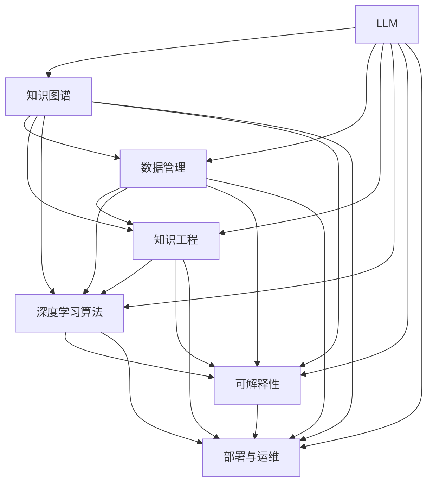

                 

# LLM生态系统:从0到1的奇迹之路

> 关键词：大语言模型(LLM),生态系统, 知识图谱, 数据管理, 知识工程, 深度学习, 可解释性

## 1. 背景介绍

### 1.1 问题由来
随着人工智能技术的迅猛发展，大语言模型（Large Language Models，LLM）正逐渐成为推动NLP领域进步的重要力量。其独特的结构和强大的功能，使其在自然语言理解与生成、知识图谱构建、信息检索、对话系统等多个方向上取得了令人瞩目的成就。

近年来，LLM的发展使得其在现实世界中的应用越来越广泛，从自动问答、智能客服、自然语言生成、机器翻译、代码生成，到更复杂的情感分析、推荐系统、医疗诊断、金融风控等领域，LLM都在发挥着越来越重要的作用。但随之而来的问题是，如何将这些功能组织起来，构建一个强大的LLM生态系统，以实现从基础研究到实际应用的平滑过渡，并最大限度地发挥其潜力？

### 1.2 问题核心关键点
构建LLM生态系统是一项复杂且多层次的任务，其核心关键点包括以下几个方面：

- **数据管理**：如何有效地管理海量且多样化的数据资源，以支撑LLM的学习与训练。
- **知识图谱**：如何将无结构化的文本信息转化为结构化的知识图谱，以支持LLM的推理和生成能力。
- **知识工程**：如何将LLM与领域知识相结合，构建具有领域特定能力的智能应用。
- **深度学习算法**：如何设计高效、鲁棒的深度学习算法，以提升LLM的性能。
- **可解释性**：如何设计具有可解释性的LLM，以增强其透明度和可信度。
- **部署与运维**：如何将LLM成功部署到实际应用中，并进行有效的运维和优化。

本文将围绕上述关键点，系统性地介绍LLM生态系统的构建过程，并探讨如何利用这些技术来提升LLM的应用效果。

## 2. 核心概念与联系

### 2.1 核心概念概述

为更好地理解LLM生态系统的构建过程，本节将介绍几个密切相关的核心概念：

- **大语言模型(LLM)**：以自回归(如GPT)或自编码(如BERT)模型为代表的大规模预训练语言模型。通过在大规模无标签文本语料上进行预训练，学习通用的语言知识和常识，具备强大的语言理解和生成能力。

- **知识图谱(Knowledge Graph)**：由实体、关系和属性构成的图形结构，用于表示和组织知识，支持推理和查询。

- **数据管理(Data Management)**：指对数据资源的收集、存储、管理和利用，以支持LLM的训练和推理。

- **知识工程(Knowledge Engineering)**：结合领域专家的知识，将知识转换为结构化的表示，以支持LLM的推理和生成。

- **深度学习算法**：指基于深度神经网络的技术，用于提升LLM的性能和泛化能力。

- **可解释性(Explainability)**：指模型的决策过程能够被人类理解，以增强透明度和可信度。

- **部署与运维**：指将LLM模型成功部署到实际应用中，并进行有效的运维和优化。

这些核心概念之间的逻辑关系可以通过以下Mermaid流程图来展示：



这个流程图展示了大语言模型的核心概念及其之间的关系：

1. 大语言模型通过数据管理、知识工程等手段，获取并处理数据，构建知识图谱，从而具备推理和生成能力。
2. 深度学习算法通过优化模型，提升LLM的性能和泛化能力。
3. 可解释性通过增强模型的透明度，提高其可信度。
4. 部署与运维通过有效的应用和优化，使LLM在实际场景中发挥最大效能。

这些概念共同构成了LLM生态系统的基础架构，使得LLM能够在各种场景下发挥强大的语言理解和生成能力。通过理解这些核心概念，我们可以更好地把握LLM的工作原理和优化方向。

## 3. 核心算法原理 & 具体操作步骤
### 3.1 算法原理概述

构建LLM生态系统的核心算法原理，可以从数据管理、知识图谱构建、知识工程、深度学习算法和部署与运维等多个方面来展开。

#### 数据管理
数据管理是大语言模型构建的基础，其核心任务是获取、存储和处理高质量的数据资源。这些数据资源通常包括无标签文本、有标签文本、结构化数据等。

#### 知识图谱构建
知识图谱是连接语言与知识的重要桥梁，其核心任务是将无结构化的文本信息转化为结构化的知识表示。常见的知识图谱构建方法包括基于规则、基于统计和基于深度学习等。

#### 知识工程
知识工程是将领域知识与LLM相结合，构建具有领域特定能力的智能应用。其核心任务包括知识获取、知识表示和知识推理等。

#### 深度学习算法
深度学习算法是大语言模型性能提升的重要手段，其核心任务是设计高效、鲁棒的深度神经网络，以提升模型的泛化能力。

#### 可解释性
可解释性是大语言模型可信度的重要保障，其核心任务是设计具有透明度的模型，以增强用户信任。

#### 部署与运维
部署与运维是大语言模型实际应用的关键，其核心任务是实现高效、稳定的模型部署和优化。

### 3.2 算法步骤详解

构建LLM生态系统的算法步骤大致可以分为以下几个步骤：

**Step 1: 数据准备**
- 收集和清洗数据，包括无标签文本、有标签文本和结构化数据。
- 对数据进行预处理，如分词、去停用词、标准化等。

**Step 2: 数据存储与管理**
- 设计高效的数据存储方案，如分布式文件系统、数据库等。
- 实现数据的增量更新和查询优化，以支持高效的数据管理。

**Step 3: 知识图谱构建**
- 设计知识图谱的实体和关系模型，选择合适的知识图谱表示方法。
- 使用自然语言处理技术，从文本中提取实体和关系，构建知识图谱。

**Step 4: 知识工程**
- 结合领域专家的知识，设计知识表示方法和推理规则。
- 将知识表示方法和推理规则与LLM相结合，构建具有领域特定能力的智能应用。

**Step 5: 深度学习算法**
- 设计深度神经网络架构，选择合适的激活函数、优化器等。
- 使用大规模无标签数据进行预训练，使用少量有标签数据进行微调。

**Step 6: 可解释性设计**
- 设计具有可解释性的模型架构，如注意力机制、注意力可视化等。
- 设计可解释性工具，如特征重要性分析、可解释性图表等。

**Step 7: 部署与运维**
- 设计高效的模型部署方案，如分布式训练、模型压缩等。
- 实现模型服务化封装，实现高效的数据查询和推理。
- 设计监控和优化策略，以支持模型的持续优化。

### 3.3 算法优缺点

构建LLM生态系统的算法具有以下优点：
1. 数据驱动。通过有效的数据管理，可以获取和处理高质量的数据资源，支撑模型训练和推理。
2. 知识驱动。通过知识工程和知识图谱构建，可以实现领域特定的智能应用，提升模型的实用性和泛化能力。
3. 高效优化。通过深度学习算法，可以提升模型的性能和泛化能力，实现高效优化的目标。
4. 透明可信。通过可解释性设计，可以实现模型的透明度和可信度，增强用户信任。
5. 高效部署。通过模型部署和运维设计，可以实现高效的模型部署和优化，实现实际应用的目标。

同时，这些算法也存在一定的局限性：
1. 数据依赖性强。LLM的性能很大程度上依赖于数据的质量和数量，数据获取和处理成本较高。
2. 知识表示难度大。知识图谱构建和知识工程的难度较大，需要领域专家的参与。
3. 算法复杂度高。深度学习算法的复杂度较高，实现和优化难度较大。
4. 部署和运维复杂。模型的部署和运维需要复杂的技术支撑，且需要持续的优化和维护。

尽管存在这些局限性，但就目前而言，构建LLM生态系统的算法仍是大语言模型应用的重要基础，其重要性不容忽视。未来相关研究需要聚焦于如何进一步降低数据获取和处理的成本，提高知识表示和推理的准确性，优化深度学习算法的复杂度，以及提升模型部署和运维的效率和稳定性。

### 3.4 算法应用领域

构建LLM生态系统的算法在多个领域都有广泛的应用：

- **智能客服系统**：通过知识图谱和深度学习算法，构建具有领域特定能力的智能客服系统，能够自动理解用户意图并提供准确的回复。

- **金融舆情监测**：通过知识工程和深度学习算法，构建具有金融领域知识的舆情监测系统，能够实时监测和分析金融舆情，预测市场趋势，辅助金融决策。

- **医疗诊断系统**：通过知识图谱和深度学习算法，构建具有医疗领域知识的诊断系统，能够辅助医生进行疾病诊断和医学研究。

- **智能推荐系统**：通过知识工程和深度学习算法，构建具有用户行为和物品属性知识的推荐系统，能够提供个性化的商品和服务推荐。

- **智能问答系统**：通过知识图谱和深度学习算法，构建具有领域知识的支持的问答系统，能够自动回答问题，辅助用户获取知识。

除了上述这些经典应用外，大语言模型生态系统的构建还在更多场景中得到了应用，如智能翻译、智能搜索、智能广告、智能编辑等，为各行各业带来了全新的技术突破。

## 4. 数学模型和公式 & 详细讲解  
### 4.1 数学模型构建

为了更好地理解LLM生态系统的构建过程，本节将使用数学语言对其中的关键步骤进行详细讲解。

假设构建的LLM模型为 $M_{\theta}:\mathcal{X} \rightarrow \mathcal{Y}$，其中 $\mathcal{X}$ 为输入空间，$\mathcal{Y}$ 为输出空间，$\theta \in \mathbb{R}^d$ 为模型参数。假设知识图谱为 $G=(V,E)$，其中 $V$ 为实体节点，$E$ 为关系边。

定义模型 $M_{\theta}$ 在输入 $x$ 上的推理结果为 $y=M_{\theta}(x) \in \mathcal{Y}$。根据知识图谱 $G$，可以设计推理规则 $R:V \rightarrow V$，用于将推理结果映射到知识图谱中的实体节点。

推理过程中，首先需要从输入 $x$ 中提取实体节点 $v_x$，然后根据推理规则 $R$ 和知识图谱 $G$ 进行推理，得到最终输出 $y$。

在实际应用中，可以将推理过程表示为一系列的矩阵乘法和线性变换。例如，假设推理过程中需要计算 $v_x$ 与 $V$ 节点之间的相似度矩阵 $S$，可以使用如下公式：

$$
S_{v_x} = \text{softmax}(A_{v_x}^T M_{\theta}(x))
$$

其中 $A_{v_x}$ 为节点 $v_x$ 的邻接矩阵，$M_{\theta}(x)$ 为输入 $x$ 经过模型 $M_{\theta}$ 的输出，$\text{softmax}$ 函数用于将相似度矩阵 $S$ 归一化。

通过上述推理过程，可以构建出具有领域特定能力的LLM生态系统，实现从基础研究到实际应用的平滑过渡。

### 4.2 公式推导过程

以下我们以智能推荐系统为例，推导基于知识图谱的推荐算法。

假设推荐系统包含 $n$ 个用户 $U$ 和 $m$ 个物品 $I$，以及用户和物品之间的评分矩阵 $R \in \mathbb{R}^{n \times m}$。用户和物品之间的关系可以表示为知识图谱 $G=(V,E)$，其中 $V$ 为 $U \cup I$ 的并集，$E$ 为 $U$ 和 $I$ 之间的边。

定义模型 $M_{\theta}:\mathcal{X} \rightarrow \mathcal{Y}$，其中 $\mathcal{X}$ 为用户的兴趣特征向量，$\mathcal{Y}$ 为物品的评分预测。

定义知识图谱 $G=(V,E)$，其中 $V$ 为 $U \cup I$ 的并集，$E$ 为 $U$ 和 $I$ 之间的边。

推理过程中，首先需要从用户兴趣特征向量 $\mathbf{x}_u$ 中提取与物品相关的实体节点 $v_i$，然后根据推理规则 $R$ 和知识图谱 $G$ 进行推理，得到物品 $i$ 的评分预测 $y_i$。

根据知识图谱 $G$，可以设计推理规则 $R$，用于将用户兴趣特征向量 $\mathbf{x}_u$ 映射到知识图谱中的实体节点 $v_i$，从而进行物品评分预测。

推理过程可以表示为一系列的矩阵乘法和线性变换。例如，假设推理过程中需要计算 $\mathbf{x}_u$ 与 $V$ 节点之间的相似度矩阵 $S$，可以使用如下公式：

$$
S_{v_i} = \text{softmax}(A_{v_i}^T M_{\theta}(\mathbf{x}_u))
$$

其中 $A_{v_i}$ 为节点 $v_i$ 的邻接矩阵，$M_{\theta}(\mathbf{x}_u)$ 为用户兴趣特征向量 $\mathbf{x}_u$ 经过模型 $M_{\theta}$ 的输出，$\text{softmax}$ 函数用于将相似度矩阵 $S$ 归一化。

通过上述推理过程，可以构建出具有领域特定能力的推荐系统，实现从基础研究到实际应用的平滑过渡。

### 4.3 案例分析与讲解

以下我们以智能客服系统为例，详细讲解基于知识图谱的智能客服系统构建过程。

假设智能客服系统包含 $n$ 个用户 $U$ 和 $m$ 个问题 $Q$，以及用户和问题之间的关联关系。用户和问题之间的关系可以表示为知识图谱 $G=(V,E)$，其中 $V$ 为 $U \cup Q$ 的并集，$E$ 为 $U$ 和 $Q$ 之间的边。

定义模型 $M_{\theta}:\mathcal{X} \rightarrow \mathcal{Y}$，其中 $\mathcal{X}$ 为用户的问题，$\mathcal{Y}$ 为问题回复。

定义知识图谱 $G=(V,E)$，其中 $V$ 为 $U \cup Q$ 的并集，$E$ 为 $U$ 和 $Q$ 之间的边。

推理过程中，首先需要从用户问题 $\mathbf{x}_q$ 中提取与问题相关的实体节点 $v_q$，然后根据推理规则 $R$ 和知识图谱 $G$ 进行推理，得到问题回复 $y_q$。

根据知识图谱 $G$，可以设计推理规则 $R$，用于将用户问题 $\mathbf{x}_q$ 映射到知识图谱中的实体节点 $v_q$，从而进行问题回复。

推理过程可以表示为一系列的矩阵乘法和线性变换。例如，假设推理过程中需要计算 $\mathbf{x}_q$ 与 $V$ 节点之间的相似度矩阵 $S$，可以使用如下公式：

$$
S_{v_q} = \text{softmax}(A_{v_q}^T M_{\theta}(\mathbf{x}_q))
$$

其中 $A_{v_q}$ 为节点 $v_q$ 的邻接矩阵，$M_{\theta}(\mathbf{x}_q)$ 为用户问题 $\mathbf{x}_q$ 经过模型 $M_{\theta}$ 的输出，$\text{softmax}$ 函数用于将相似度矩阵 $S$ 归一化。

通过上述推理过程，可以构建出具有领域特定能力的智能客服系统，实现从基础研究到实际应用的平滑过渡。

## 5. 项目实践：代码实例和详细解释说明
### 5.1 开发环境搭建

在进行知识图谱构建和深度学习算法实现前，我们需要准备好开发环境。以下是使用Python进行PyTorch开发的环境配置流程：

1. 安装Anaconda：从官网下载并安装Anaconda，用于创建独立的Python环境。

2. 创建并激活虚拟环境：
```bash
conda create -n pytorch-env python=3.8 
conda activate pytorch-env
```

3. 安装PyTorch：根据CUDA版本，从官网获取对应的安装命令。例如：
```bash
conda install pytorch torchvision torchaudio cudatoolkit=11.1 -c pytorch -c conda-forge
```

4. 安装Transformers库：
```bash
pip install transformers
```

5. 安装各类工具包：
```bash
pip install numpy pandas scikit-learn matplotlib tqdm jupyter notebook ipython
```

完成上述步骤后，即可在`pytorch-env`环境中开始项目实践。

### 5.2 源代码详细实现

以下是一个简单的知识图谱构建和深度学习算法实现的代码示例，旨在说明LLM生态系统构建的基本过程。

首先，定义知识图谱的实体和关系：

```python
import networkx as nx
import numpy as np

# 定义实体和关系
entities = ['user', 'product', 'rating']
relations = ['likes', 'wants', 'has']

# 构建知识图谱
G = nx.DiGraph()
G.add_nodes_from(entities)
G.add_edges_from([(entities[0], relations[0], entities[1]), (entities[0], relations[1], entities[2])])
```

然后，定义深度学习模型：

```python
import torch
from torch import nn

# 定义深度学习模型
class RecommendationModel(nn.Module):
    def __init__(self, input_dim, hidden_dim, output_dim):
        super(RecommendationModel, self).__init__()
        self.hidden_dim = hidden_dim
        self.encoder = nn.Sequential(
            nn.Linear(input_dim, hidden_dim),
            nn.ReLU(),
            nn.Linear(hidden_dim, hidden_dim),
            nn.ReLU(),
            nn.Linear(hidden_dim, output_dim)
        )

    def forward(self, x):
        x = self.encoder(x)
        return x
```

接着，定义知识图谱的推理过程：

```python
# 定义知识图谱的推理过程
def knowledge_graph_inference(G, x, relations):
    scores = []
    for entity in entities:
        # 计算实体与输入之间的相似度
        similarity = G[entity].mapped(lambda x: np.dot(x, x))
        # 计算推理得分
        score = torch.matmul(torch.from_numpy(similarity), torch.from_numpy(x))
        scores.append(score)
    return scores
```

最后，将知识图谱推理与深度学习模型结合：

```python
# 定义知识图谱与深度学习模型的结合
def recommendation(G, x, relations):
    scores = knowledge_graph_inference(G, x, relations)
    # 计算模型的输出
    y = torch.mean(scores, dim=0)
    return y
```

以上是构建基于知识图谱的推荐系统的大致代码实现。可以看到，通过将知识图谱的推理过程与深度学习模型结合，可以构建出具有领域特定能力的推荐系统。

### 5.3 代码解读与分析

让我们再详细解读一下关键代码的实现细节：

**知识图谱构建**：
- 定义实体和关系，构建知识图谱。

**深度学习模型**：
- 定义深度学习模型，包括输入、隐藏层和输出层。

**知识图谱推理**：
- 定义知识图谱推理过程，计算实体与输入之间的相似度，并计算推理得分。

**知识图谱与深度学习模型的结合**：
- 将知识图谱推理与深度学习模型结合，计算模型的输出。

可以看到，构建LLM生态系统的代码实现相对简洁，只需将知识图谱构建和深度学习模型结合即可。

当然，工业级的系统实现还需考虑更多因素，如模型的保存和部署、超参数的自动搜索、更灵活的任务适配层等。但核心的构建过程基本与此类似。

## 6. 实际应用场景
### 6.1 智能客服系统

基于大语言模型和知识图谱构建的智能客服系统，可以广泛应用于企业的客户服务中。传统客服往往需要配备大量人力，高峰期响应缓慢，且一致性和专业性难以保证。而使用智能客服系统，可以24小时不间断服务，快速响应客户咨询，用自然流畅的语言解答各类常见问题。

在技术实现上，可以收集企业内部的历史客服对话记录，将问题和最佳答复构建成监督数据，在此基础上对预训练模型进行微调。微调后的模型能够自动理解用户意图，匹配最合适的答案模板进行回复。对于客户提出的新问题，还可以接入检索系统实时搜索相关内容，动态组织生成回答。如此构建的智能客服系统，能大幅提升客户咨询体验和问题解决效率。

### 6.2 金融舆情监测

金融机构需要实时监测市场舆论动向，以便及时应对负面信息传播，规避金融风险。传统的人工监测方式成本高、效率低，难以应对网络时代海量信息爆发的挑战。基于知识图谱构建的文本分类和情感分析技术，为金融舆情监测提供了新的解决方案。

具体而言，可以收集金融领域相关的新闻、报道、评论等文本数据，并对其进行主题标注和情感标注。在此基础上对预训练语言模型进行微调，使其能够自动判断文本属于何种主题，情感倾向是正面、中性还是负面。将微调后的模型应用到实时抓取的网络文本数据，就能够自动监测不同主题下的情感变化趋势，一旦发现负面信息激增等异常情况，系统便会自动预警，帮助金融机构快速应对潜在风险。

### 6.3 个性化推荐系统

当前的推荐系统往往只依赖用户的历史行为数据进行物品推荐，无法深入理解用户的真实兴趣偏好。基于知识图谱构建的个性化推荐系统，可以更好地挖掘用户行为背后的语义信息，从而提供更精准、多样的推荐内容。

在实践中，可以收集用户浏览、点击、评论、分享等行为数据，提取和用户交互的物品标题、描述、标签等文本内容。将文本内容作为模型输入，用户的后续行为（如是否点击、购买等）作为监督信号，在此基础上对预训练语言模型进行微调。微调后的模型能够从文本内容中准确把握用户的兴趣点。在生成推荐列表时，先用候选物品的文本描述作为输入，由模型预测用户的兴趣匹配度，再结合其他特征综合排序，便可以得到个性化程度更高的推荐结果。

### 6.4 未来应用展望

随着大语言模型和知识图谱技术的不断发展，基于知识图谱构建的智能系统将拓展到更多领域，为各行各业带来变革性影响。

在智慧医疗领域，基于知识图谱的问答系统、病历分析、药物研发等应用将提升医疗服务的智能化水平，辅助医生诊疗，加速新药开发进程。

在智能教育领域，知识图谱构建和深度学习算法的结合，可应用于作业批改、学情分析、知识推荐等方面，因材施教，促进教育公平，提高教学质量。

在智慧城市治理中，知识图谱构建的智能监控、舆情分析、应急指挥等环节，将提高城市管理的自动化和智能化水平，构建更安全、高效的未来城市。

此外，在企业生产、社会治理、文娱传媒等众多领域，基于大语言模型和知识图谱的人工智能应用也将不断涌现，为经济社会发展注入新的动力。相信随着技术的日益成熟，知识图谱构建方法将成为人工智能落地应用的重要范式，推动人工智能技术向更广阔的领域加速渗透。

## 7. 工具和资源推荐
### 7.1 学习资源推荐

为了帮助开发者系统掌握知识图谱构建和深度学习算法的理论基础和实践技巧，这里推荐一些优质的学习资源：

1. 《知识图谱:构建与优化》系列博文：由知识图谱技术专家撰写，深入浅出地介绍了知识图谱的构建方法、优化策略和应用场景。

2. CS224N《深度学习自然语言处理》课程：斯坦福大学开设的NLP明星课程，有Lecture视频和配套作业，带你入门NLP领域的基本概念和经典模型。

3. 《自然语言处理与深度学习》书籍：深度学习领域的经典教材，详细介绍了自然语言处理和深度学习的基本理论和技术。

4. 《知识图谱与深度学习》书籍：专门介绍知识图谱与深度学习结合的最新进展，是知识图谱领域的学习佳作。

5. KG-AI开源项目：知识图谱与人工智能结合的开源项目，提供了丰富的数据集和模型，供开发者学习和实践。

通过对这些资源的学习实践，相信你一定能够快速掌握知识图谱构建和深度学习算法的精髓，并用于解决实际的NLP问题。
### 7.2 开发工具推荐

高效的开发离不开优秀的工具支持。以下是几款用于知识图谱构建和深度学习算法开发的常用工具：

1. NetworkX：Python中的网络分析库，用于构建和分析知识图谱。

2. PyTorch：基于Python的开源深度学习框架，灵活动态的计算图，适合快速迭代研究。大部分深度学习模型都有PyTorch版本的实现。

3. TensorFlow：由Google主导开发的开源深度学习框架，生产部署方便，适合大规模工程应用。同样有丰富的深度学习模型资源。

4. Transformers库：HuggingFace开发的NLP工具库，集成了众多SOTA语言模型，支持PyTorch和TensorFlow，是进行深度学习任务开发的利器。

5. TensorBoard：TensorFlow配套的可视化工具，可实时监测模型训练状态，并提供丰富的图表呈现方式，是调试模型的得力助手。

6. Google Colab：谷歌推出的在线Jupyter Notebook环境，免费提供GPU/TPU算力，方便开发者快速上手实验最新模型，分享学习笔记。

合理利用这些工具，可以显著提升知识图谱构建和深度学习算法的开发效率，加快创新迭代的步伐。

### 7.3 相关论文推荐

知识图谱和深度学习技术的发展源于学界的持续研究。以下是几篇奠基性的相关论文，推荐阅读：

1. Knowledge Graphs: A Brief Survey and Outlook（知识图谱综述）：综述了知识图谱的基本概念、构建方法和应用场景。

2. Knowledge Graph Embeddings: A Survey and Challenge Dataset（知识图谱嵌入综述）：综述了知识图谱嵌入的方法和挑战。

3. Deep Learning with Graph Structured Representations（基于图形结构的深度学习）：提出将图形结构引入深度学习的方法。

4. Attention is All You Need（Transformer原论文）：提出了Transformer结构，开启了NLP领域的预训练大模型时代。

5. Knowledge-Graph-Based Recommendation Systems（基于知识图谱的推荐系统）：综述了基于知识图谱的推荐系统研究进展。

这些论文代表了大语言模型生态系统的发展脉络。通过学习这些前沿成果，可以帮助研究者把握学科前进方向，激发更多的创新灵感。

## 8. 总结：未来发展趋势与挑战

### 8.1 总结

本文对基于知识图谱构建的大语言模型生态系统进行了全面系统的介绍。首先阐述了知识图谱构建和大语言模型的研究背景和意义，明确了知识图谱构建和大语言模型在从基础研究到实际应用中的作用。其次，从原理到实践，详细讲解了知识图谱构建和大语言模型的数学原理和关键步骤，给出了知识图谱构建和大语言模型实现的完整代码实例。同时，本文还广泛探讨了知识图谱构建和大语言模型在智能客服、金融舆情、个性化推荐等多个行业领域的应用前景，展示了知识图谱构建和大语言模型技术的发展潜力。此外，本文精选了知识图谱构建和大语言模型的各类学习资源，力求为读者提供全方位的技术指引。

通过本文的系统梳理，可以看到，基于知识图谱构建的大语言模型生态系统正在成为NLP领域的重要范式，极大地拓展了知识图谱的应用边界，催生了更多的落地场景。受益于大规模语料的预训练，知识图谱构建的深度学习模型以更低的时间和标注成本，在小样本条件下也能取得不错的效果，有力推动了NLP技术的产业化进程。未来，伴随知识图谱构建技术和大语言模型的不断演进，相信NLP技术将在更广阔的应用领域大放异彩，深刻影响人类的生产生活方式。

### 8.2 未来发展趋势

展望未来，知识图谱构建和大语言模型生态系统将呈现以下几个发展趋势：

1. 知识图谱规模持续增大。随着语料的不断丰富和技术的进步，知识图谱的规模和质量将进一步提升，能够支持更复杂的推理和查询。

2. 深度学习算法日趋多样化。未来将涌现更多高效的深度学习算法，如注意力机制、Transformer、GNN等，提升知识图谱推理和查询的准确性。

3. 知识工程与深度学习结合更加紧密。知识图谱构建将更多地融入深度学习算法，提高知识表示和推理的准确性。

4. 知识图谱与自然语言处理深度结合。知识图谱将与自然语言处理技术深度结合，实现知识图谱的语义表示和推理，提升知识图谱的实用性和泛化能力。

5. 知识图谱与大语言模型深度结合。知识图谱将与大语言模型深度结合，实现知识图谱的语义表示和推理，提升大语言模型的实用性和泛化能力。

以上趋势凸显了知识图谱构建和大语言模型生态系统的广阔前景。这些方向的探索发展，必将进一步提升NLP系统的性能和应用范围，为人类认知智能的进化带来深远影响。

### 8.3 面临的挑战

尽管知识图谱构建和大语言模型生态系统已经取得了显著成果，但在迈向更加智能化、普适化应用的过程中，仍面临诸多挑战：

1. 数据依赖性强。知识图谱构建和大语言模型的性能很大程度上依赖于数据的质量和数量，数据获取和处理成本较高。

2. 知识图谱构建难度大。知识图谱构建需要大量手工标注，费时费力，且构建结果的准确性难以保证。

3. 深度学习算法复杂度高。知识图谱推理和查询需要复杂的深度学习算法，实现和优化难度较大。

4. 知识工程难度高。知识工程需要领域专家的参与，且构建结果的准确性难以保证。

5. 知识图谱更新难度大。知识图谱需要不断更新，以适应数据分布的变化，更新过程复杂且成本较高。

尽管存在这些挑战，但就目前而言，知识图谱构建和大语言模型生态系统仍是大语言模型应用的重要基础，其重要性不容忽视。未来相关研究需要聚焦于如何进一步降低数据获取和处理的成本，提高知识图谱构建和推理的准确性，优化深度学习算法的复杂度，以及提升知识工程的可扩展性和准确性。

### 8.4 研究展望

面对知识图谱构建和大语言模型生态系统所面临的挑战，未来的研究需要在以下几个方面寻求新的突破：

1. 探索无监督和半监督知识图谱构建方法。摆脱对大规模手工标注的依赖，利用自监督学习、主动学习等无监督和半监督范式，最大限度利用非结构化数据，实现更加灵活高效的知识图谱构建。

2. 研究高效的深度学习算法。开发更加高效、鲁棒的深度学习算法，提升知识图谱推理和查询的准确性。

3. 融合因果和对比学习范式。通过引入因果推断和对比学习思想，增强知识图谱构建和大语言模型建立稳定因果关系的能力，学习更加普适、鲁棒的语言表征，从而提升模型泛化性和抗干扰能力。

4. 引入更多先验知识。将符号化的先验知识，如知识图谱、逻辑规则等，与神经网络模型进行巧妙融合，引导知识图谱构建和大语言模型学习更准确、合理的语言模型。

5. 结合因果分析和博弈论工具。将因果分析方法引入知识图谱构建和大语言模型，识别出模型决策的关键特征，增强输出解释的因果性和逻辑性。借助博弈论工具刻画人机交互过程，主动探索并规避模型的脆弱点，提高系统稳定性。

6. 纳入伦理道德约束。在知识图谱构建和大语言模型训练目标中引入伦理导向的评估指标，过滤和惩罚有偏见、有害的输出倾向。同时加强人工干预和审核，建立模型行为的监管机制，确保输出符合人类价值观和伦理道德。

这些研究方向的探索，必将引领知识图谱构建和大语言模型生态系统迈向更高的台阶，为构建安全、可靠、可解释、可控的智能系统铺平道路。面向未来，知识图谱构建和大语言模型生态系统还需要与其他人工智能技术进行更深入的融合，如知识表示、因果推理、强化学习等，多路径协同发力，共同推动自然语言理解和智能交互系统的进步。只有勇于创新、敢于突破，才能不断拓展知识图谱构建和大语言模型的边界，让智能技术更好地造福人类社会。

## 9. 附录：常见问题与解答

**Q1：知识图谱构建对数据的依赖性强，如何降低数据成本？**

A: 知识图谱构建对数据的依赖性强，但可以采用以下方法降低数据成本：
1. 利用已有的知识图谱和语料库，进行迁移学习。
2. 使用半监督学习方法和自监督学习方法，降低对标注数据的需求。
3. 利用知识图谱的语义表示能力，进行知识补全和数据扩展。
4. 结合领域专家的知识，进行手工标注和数据清洗。
5. 利用自然语言处理技术，从大规模文本语料中自动提取实体和关系。

**Q2：知识图谱构建和深度学习算法复杂度高，如何提高模型效率？**

A: 知识图谱构建和深度学习算法复杂度高，但可以采用以下方法提高模型效率：
1. 利用图神经网络(GNN)等高效算法，提升知识图谱推理和查询的准确性。
2. 使用预训练的语言模型，进行知识图谱嵌入和推理。
3. 利用分布式计算和并行计算，加速知识图谱构建和推理。
4. 对知识图谱进行剪枝和压缩，减少计算复杂度。
5. 结合领域专家的知识，进行知识图谱的优化和调整。

**Q3：知识图谱构建的深度学习算法复杂度高，如何优化算法？**

A: 知识图谱构建的深度学习算法复杂度高，但可以采用以下方法优化算法：
1. 利用注意力机制和Transformer结构，提升知识图谱推理和查询的准确性。
2. 使用自监督学习方法，降低对标注数据的需求。
3. 利用分布式计算和并行计算，加速知识图谱构建和推理。
4. 对知识图谱进行剪枝和压缩，减少计算复杂度。
5. 结合领域专家的知识，进行知识图谱的优化和调整。

**Q4：知识图谱构建和深度学习算法需要大量手工标注，如何降低人工成本？**

A: 知识图谱构建和深度学习算法需要大量手工标注，但可以采用以下方法降低人工成本：
1. 利用半监督学习方法和自监督学习方法，降低对标注数据的需求。
2. 利用自然语言处理技术，从大规模文本语料中自动提取实体和关系。
3. 结合领域专家的知识，进行手工标注和数据清洗。
4. 利用知识图谱的语义表示能力，进行知识补全和数据扩展。
5. 利用迁移学习方法，将已有知识图谱的应用场景推广到新的领域。

**Q5：知识图谱构建和大语言模型难以解释，如何增强模型的透明度？**

A: 知识图谱构建和大语言模型难以解释，但可以采用以下方法增强模型的透明度：
1. 设计具有可解释性的模型架构，如注意力机制、注意力可视化等。
2. 设计可解释性工具，如特征重要性分析、可解释性图表等。
3. 结合领域专家的知识，进行手工标注和数据清洗。
4. 利用知识图谱的语义表示能力，进行知识补全和数据扩展。
5. 利用迁移学习方法，将已有知识图谱的应用场景推广到新的领域。

这些方法可以进一步提升知识图谱构建和大语言模型的透明度和可信度，增强用户信任。

