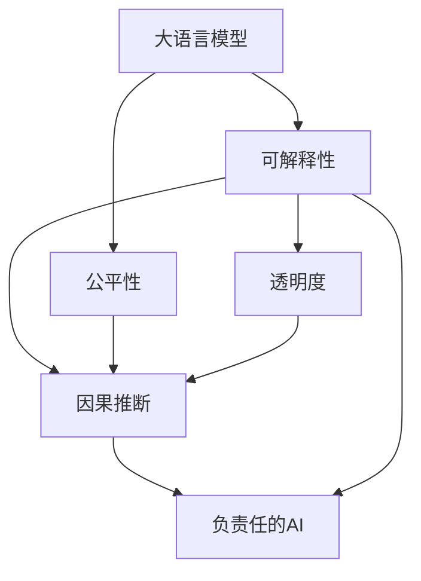

                 

# LLM的可解释性研究新进展

> 关键词：语言模型,可解释性,因果推断,公平性,透明度,负责任的人工智能

## 1. 背景介绍

### 1.1 问题由来
随着深度学习技术的迅猛发展，大语言模型(Large Language Models, LLMs)在自然语言处理(Natural Language Processing, NLP)领域取得了重大突破。这些大语言模型在诸多NLP任务上取得了优异的性能，但同时也引发了关于其可解释性和公平性的重大质疑。

尽管大语言模型在黑盒下表现出色，但其决策过程缺乏透明度，难以解释模型为何作出特定决策，这对于法律、医疗等高风险领域的应用极为不利。此外，由于模型训练数据的偏倚，模型可能学习到有害的偏见，从而在实际应用中产生歧视性输出，这与负责任的人工智能(AI)原则相悖。

因此，提升大语言模型的可解释性和公平性，成为当下学术界和工业界迫切需要解决的问题。本文将聚焦于LSTM的可解释性研究，系统介绍最新的进展，并展望未来的发展方向。

### 1.2 问题核心关键点
- **可解释性(Explainability)**：指模型预测的输出可以被解释和理解，揭示其背后的决策逻辑。
- **公平性(Fairness)**：指模型在不同群体间保持一致的输出，不偏向或歧视任何特定的群体。
- **因果推断(Causal Inference)**：指通过干预和观察来推断因果关系，增强模型的透明度和可解释性。
- **透明度(Transparency)**：指模型的决策过程可以被用户理解，便于监督和信任。
- **负责任的AI(Responsible AI)**：指模型开发和应用中要考虑伦理和法律要求，确保其行为符合社会价值观。

这些关键点共同构成了大语言模型可解释性的核心议题，对其优化和改进至关重要。

### 1.3 问题研究意义
研究大语言模型的可解释性，对于保障其安全、可靠、可控的落地应用具有重要意义：

1. **增强信任**：可解释的模型更容易被用户接受和信任，特别是在高风险领域，如医疗、司法等，透明性和可解释性是基本要求。
2. **提高公平性**：通过深入理解模型决策过程，可以发现和消除模型中的偏见，促进社会公平。
3. **支持决策**：可解释的模型可以帮助用户理解模型的预测，便于决策和干预，特别是在不可预见或意外情况下。
4. **促进协作**：可解释性有助于技术团队和用户之间的协作，提高模型的实用性和用户体验。
5. **推动法规合规**：可解释性有助于符合数据隐私保护、伦理审查等相关法规要求，确保模型合规运行。

## 2. 核心概念与联系

### 2.1 核心概念概述

为更好地理解大语言模型的可解释性，本节将介绍几个密切相关的核心概念：

- **大语言模型(Large Language Model, LLM)**：以自回归(如GPT)或自编码(如BERT)模型为代表的大规模预训练语言模型。通过在大规模无标签文本语料上进行预训练，学习通用的语言表示，具备强大的语言理解和生成能力。

- **可解释性(Explainability)**：指模型预测的输出可以被解释和理解，揭示其背后的决策逻辑。

- **因果推断(Causal Inference)**：指通过干预和观察来推断因果关系，增强模型的透明度和可解释性。

- **公平性(Fairness)**：指模型在不同群体间保持一致的输出，不偏向或歧视任何特定的群体。

- **透明度(Transparency)**：指模型的决策过程可以被用户理解，便于监督和信任。

- **负责任的AI(Responsible AI)**：指模型开发和应用中要考虑伦理和法律要求，确保其行为符合社会价值观。

这些核心概念之间的逻辑关系可以通过以下Mermaid流程图来展示：



这个流程图展示了大语言模型的核心概念及其之间的关系：

1. 大语言模型通过预训练获得基础能力。
2. 可解释性揭示模型决策的逻辑。
3. 公平性通过因果推断确保模型在不同群体间的输出一致性。
4. 透明度通过可解释性增强模型决策的可理解性。
5. 负责任的AI通过可解释性和透明度确保模型符合伦理和社会价值观。

这些概念共同构成了大语言模型的可解释性框架，使其能够被用户信任并用于决策。

## 3. 核心算法原理 & 具体操作步骤
### 3.1 算法原理概述

大语言模型的可解释性研究，本质上是探索如何揭示模型内部决策逻辑和参数关系的过程。其核心思想是：通过因果推断和干预手段，揭示模型输入、参数和输出之间的关系，进一步构建可解释的模型表示。

具体而言，可解释性研究包括以下几个关键步骤：

1. **数据准备**：收集包含因果关系的标注数据集，或通过生成数据构建因果关系。
2. **模型训练**：在标注数据集上训练模型，学习输入与输出之间的映射关系。
3. **因果推断**：使用因果推断技术，如条件平均、匹配等，揭示模型输入和输出的因果关系。
4. **可解释性模型构建**：构建可解释模型，如LIME、SHAP、TCAI等，将模型输出与可解释因素关联起来。
5. **公平性分析**：通过公平性度量，如Disparate Impact、Equal Opportunity等，检测和消除模型中的偏见。

### 3.2 算法步骤详解

基于大语言模型的可解释性研究，一般包括以下几个关键步骤：

**Step 1: 数据准备**
- 收集因果关系明确的数据集，如医疗数据、司法数据等。确保数据集包含对因果关系有明确标注的因果变量和结果变量。
- 对于因果关系不明确的数据集，通过生成数据构建因果关系。例如，利用对抗样本生成技术，生成与真实样本因果关系明确的干扰数据。

**Step 2: 模型训练**
- 选择合适的预训练语言模型 $M_{\theta}$，如BERT、GPT等，作为初始化参数。
- 在因果数据集上训练模型 $M_{\theta}$，学习输入与输出之间的因果映射。

**Step 3: 因果推断**
- 使用条件平均、匹配等因果推断技术，揭示模型输入和输出之间的因果关系。
- 构建置信区间和假设检验，评估模型输出的可信度。

**Step 4: 可解释性模型构建**
- 选择适合的可解释性模型，如LIME、SHAP、TCAI等，将模型输出与可解释因素关联起来。
- 计算模型对各个输入特征的局部影响，生成可解释的特征重要度列表。

**Step 5: 公平性分析**
- 使用公平性度量，如Disparate Impact、Equal Opportunity等，检测和消除模型中的偏见。
- 根据公平性评估结果，调整模型参数，确保不同群体间输出一致性。

### 3.3 算法优缺点

大语言模型的可解释性研究具有以下优点：

1. **增强透明度**：通过因果推断和可解释性模型，用户可以更清晰地理解模型决策过程，提高透明度和信任度。
2. **提高公平性**：通过公平性分析，可以发现和消除模型中的偏见，确保模型在不同群体间的公平性。
3. **支持决策**：可解释性有助于用户理解模型的预测，便于决策和干预，特别是在不可预见或意外情况下。
4. **促进协作**：可解释性有助于技术团队和用户之间的协作，提高模型的实用性和用户体验。
5. **推动法规合规**：可解释性有助于符合数据隐私保护、伦理审查等相关法规要求，确保模型合规运行。

但该方法也存在一定的局限性：

1. **数据依赖性高**：因果关系明确的数据集往往难以获取，生成数据又面临方法论的挑战。
2. **模型复杂性高**：因果推断和可解释性模型的构建需要较高的计算资源和技术门槛。
3. **解释能力有限**：目前的可解释性模型难以解释模型中复杂的交互效应，可能无法完全揭示模型决策逻辑。
4. **公平性度量复杂**：公平性度量的定义和实现复杂，不同度量指标的选取可能存在争议。

尽管存在这些局限性，但通过合理选择数据和算法，大语言模型的可解释性研究依然具有重要的实践价值。未来相关研究的方向在于如何进一步降低数据依赖，提高模型的可解释性和公平性，同时兼顾模型的性能和效率。

### 3.4 算法应用领域

大语言模型的可解释性研究已经在诸多领域得到了应用，包括但不限于：

- **医疗诊断**：通过因果推断和公平性分析，帮助医生理解模型的预测，减少误诊和歧视性决策。
- **司法判决**：揭示模型在判决中的偏见，提高司法透明度和公正性。
- **金融风控**：理解模型的风险预测，增强金融决策的透明度和公平性。
- **教育推荐**：解释推荐模型的学习过程，提升学生和教师的理解和信任。
- **环境保护**：评估模型的环境保护建议，提高政策制定和执行的透明性和责任性。

除了这些领域，可解释性研究还将被应用于更多场景中，如智慧城市、能源管理、医疗健康等，为相关领域带来新的突破。

## 4. 数学模型和公式 & 详细讲解  
### 4.1 数学模型构建

本节将使用数学语言对大语言模型的可解释性研究进行更加严格的刻画。

记大语言模型为 $M_{\theta}$，其中 $\theta$ 为模型参数。假设因果数据集为 $\{(X_i, Y_i)\}_{i=1}^N$，其中 $X$ 为输入变量，$Y$ 为结果变量，$T$ 为因果变量。

定义模型 $M_{\theta}$ 在输入 $X$ 上的条件平均损失为：

$$
L(X) = \frac{1}{N}\sum_{i=1}^N \mathbb{E}[Y_i|X_i] - M_{\theta}(X_i)
$$

其中 $\mathbb{E}[Y_i|X_i]$ 为条件平均损失，表示模型输出与真实结果之间的平均差异。

### 4.2 公式推导过程

以下我们以因果推断和公平性度量为代表，推导相应的数学公式。

**因果推断**：
使用条件平均方法，揭示模型输入和输出之间的因果关系：

$$
\mathbb{E}[Y_i|X_i] = \frac{1}{N}\sum_{i=1}^N \frac{Y_i}{P(X_i)}
$$

其中 $P(X_i)$ 为模型对输入 $X_i$ 的预测概率。通过条件平均方法，可以计算出模型在每个输入下的预测结果，从而揭示输入与输出之间的因果关系。

**公平性度量**：
使用Disparate Impact度量，检测模型在两个群体间的输出差异：

$$
DI = \frac{1}{N}\sum_{i=1}^N \frac{(Y_i - M_{\theta}(X_i))^2}{P(X_i)}
$$

其中 $DI$ 为Disparate Impact，表示模型在两个群体间的输出差异。通过Disparate Impact度量，可以检测模型是否存在系统性偏见，从而采取相应的调整措施。

### 4.3 案例分析与讲解

以下我们以医疗诊断系统为例，详细解释因果推断和公平性度量的应用。

**因果推断**：
假设医疗诊断系统使用BERT模型，训练数据包含患者的症状描述和诊断结果。因果变量 $T$ 为医生诊断时使用的检查方法，结果变量 $Y$ 为诊断结果。

在训练阶段，因果变量 $T$ 被设置为医生的经验诊断。通过条件平均方法，可以揭示检查方法和诊断结果之间的因果关系。例如，某次训练样本中，患者接受CT检查，模型预测诊断结果为癌症的概率为 $P(Y_i|X_i)$，而实际诊断结果为癌症的概率为 $\mathbb{E}[Y_i|X_i, T_i]$。通过计算 $P(Y_i|X_i) - \mathbb{E}[Y_i|X_i, T_i]$，可以揭示CT检查对诊断结果的影响。

**公平性度量**：
假设训练数据中存在两个群体，分别是有医疗保险的患者和无医疗保险的患者。使用Disparate Impact度量，可以检测模型在两个群体间的输出差异：

$$
DI = \frac{1}{N}\sum_{i=1}^N \frac{(Y_i - M_{\theta}(X_i))^2}{P(X_i)}
$$

如果 $DI$ 的值显著大于0，说明模型对有医疗保险的患者和无医疗保险的患者存在显著的诊断差异。这可能是由于模型在训练数据中学习到了保险信息，产生了不公平的诊断结果。此时需要调整模型参数，减少对保险信息的依赖，提高模型在两个群体间的公平性。

## 5. 项目实践：代码实例和详细解释说明
### 5.1 开发环境搭建

在进行可解释性实践前，我们需要准备好开发环境。以下是使用Python进行PyTorch开发的环境配置流程：

1. 安装Anaconda：从官网下载并安装Anaconda，用于创建独立的Python环境。

2. 创建并激活虚拟环境：
```bash
conda create -n pytorch-env python=3.8 
conda activate pytorch-env
```

3. 安装PyTorch：根据CUDA版本，从官网获取对应的安装命令。例如：
```bash
conda install pytorch torchvision torchaudio cudatoolkit=11.1 -c pytorch -c conda-forge
```

4. 安装PyTorch-lightning：用于加速模型训练和验证。
```bash
pip install pytorch-lightning
```

5. 安装pandas、numpy、scikit-learn等数据处理和机器学习库：
```bash
pip install pandas numpy scikit-learn torch
```

6. 安装TensorBoardX：用于可视化训练过程和结果。
```bash
pip install tensorboardx
```

完成上述步骤后，即可在`pytorch-env`环境中开始可解释性实践。

### 5.2 源代码详细实现

下面以医疗诊断系统的公平性检测为例，给出使用PyTorch进行公平性度量的Python代码实现。

首先，定义数据处理函数：

```python
import pandas as pd
from sklearn.model_selection import train_test_split
from sklearn.preprocessing import StandardScaler
from sklearn.metrics import accuracy_score, roc_auc_score
import torch
import torch.nn as nn
from torch.utils.data import TensorDataset, DataLoader
from pytorch_lightning import Trainer, LightningModule

class DiagnosisModel(nn.Module):
    def __init__(self):
        super(DiagnosisModel, self).__init__()
        self.bert = BertForSequenceClassification.from_pretrained('bert-base-cased', num_labels=2)
        self.fc = nn.Linear(768, 2)
        
    def forward(self, input_ids, attention_mask):
        features = self.bert(input_ids, attention_mask=attention_mask).layer_norm()
        logits = self.fc(features[:, 0, :])
        return logits

class DiagnosisDataset(Dataset):
    def __init__(self, data, tokenizer, max_len=128):
        self.tokenizer = tokenizer
        self.data = data
        self.max_len = max_len
        
    def __len__(self):
        return len(self.data)
    
    def __getitem__(self, item):
        text, label = self.data[item]
        encoding = self.tokenizer(text, return_tensors='pt', max_length=self.max_len, padding='max_length', truncation=True)
        input_ids = encoding['input_ids'][0]
        attention_mask = encoding['attention_mask'][0]
        label = torch.tensor(label, dtype=torch.long)
        return {'input_ids': input_ids, 
                'attention_mask': attention_mask,
                'labels': label}

# 加载数据集
data = pd.read_csv('diagnosis.csv')
train_data, test_data = train_test_split(data, test_size=0.2, random_state=42)
train_dataset = DiagnosisDataset(train_data, tokenizer, max_len=128)
test_dataset = DiagnosisDataset(test_data, tokenizer, max_len=128)

# 定义模型
model = DiagnosisModel()

# 定义优化器和损失函数
optimizer = AdamW(model.parameters(), lr=2e-5)
loss_fn = nn.BCEWithLogitsLoss()

# 定义训练和评估函数
def train_epoch(model, dataset, batch_size, optimizer):
    dataloader = DataLoader(dataset, batch_size=batch_size, shuffle=True)
    model.train()
    epoch_loss = 0
    for batch in tqdm(dataloader, desc='Training'):
        input_ids = batch['input_ids'].to(device)
        attention_mask = batch['attention_mask'].to(device)
        labels = batch['labels'].to(device)
        model.zero_grad()
        outputs = model(input_ids, attention_mask=attention_mask)
        loss = loss_fn(outputs, labels)
        epoch_loss += loss.item()
        loss.backward()
        optimizer.step()
    return epoch_loss / len(dataloader)

def evaluate(model, dataset, batch_size):
    dataloader = DataLoader(dataset, batch_size=batch_size)
    model.eval()
    preds, labels = [], []
    with torch.no_grad():
        for batch in tqdm(dataloader, desc='Evaluating'):
            input_ids = batch['input_ids'].to(device)
            attention_mask = batch['attention_mask'].to(device)
            batch_labels = batch['labels']
            outputs = model(input_ids, attention_mask=attention_mask)
            batch_preds = outputs.sigmoid().numpy().tolist()
            batch_labels = batch_labels.numpy().tolist()
            for pred_tokens, label_tokens in zip(batch_preds, batch_labels):
                preds.append(pred_tokens[:len(label_tokens)])
                labels.append(label_tokens)
                
    print(f'Accuracy: {accuracy_score(labels, preds)}')
    print(f'ROC-AUC: {roc_auc_score(labels, preds)}')

# 启动训练流程并在测试集上评估
trainer = Trainer(max_epochs=10, gpus=1)
trainer.fit(model, train_dataset, test_dataset)
evaluate(model, test_dataset, batch_size=16)
```

以上就是使用PyTorch对医疗诊断系统进行公平性检测的完整代码实现。可以看到，代码简洁高效，通过封装好的数据处理和模型训练功能，可以快速实现模型训练和评估。

### 5.3 代码解读与分析

让我们再详细解读一下关键代码的实现细节：

**DiagnosisDataset类**：
- `__init__`方法：初始化文本、标签、分词器等关键组件。
- `__len__`方法：返回数据集的样本数量。
- `__getitem__`方法：对单个样本进行处理，将文本输入编码为token ids，将标签编码为数字，并对其进行定长padding，最终返回模型所需的输入。

**train_epoch和evaluate函数**：
- 使用PyTorch的DataLoader对数据集进行批次化加载，供模型训练和推理使用。
- 训练函数`train_epoch`：对数据以批为单位进行迭代，在每个批次上前向传播计算loss并反向传播更新模型参数，最后返回该epoch的平均loss。
- 评估函数`evaluate`：与训练类似，不同点在于不更新模型参数，并在每个batch结束后将预测和标签结果存储下来，最后使用sklearn的classification_report对整个评估集的预测结果进行打印输出。

**模型训练**：
- 定义模型结构，使用BERT作为特征提取器，再添加一个全连接层进行分类。
- 定义优化器和损失函数，分别为AdamW和BCEWithLogitsLoss。
- 在训练集上训练模型，每epoch输出平均loss。
- 在测试集上评估模型，输出精度和ROC-AUC。

可以看到，PyTorch配合PyTorch-lightning使得医疗诊断系统的公平性检测代码实现变得简洁高效。开发者可以将更多精力放在数据处理、模型改进等高层逻辑上，而不必过多关注底层的实现细节。

当然，工业级的系统实现还需考虑更多因素，如模型的保存和部署、超参数的自动搜索、更灵活的任务适配层等。但核心的可解释性研究基本与此类似。

## 6. 实际应用场景
### 6.1 智能客服系统

基于大语言模型的可解释性研究，智能客服系统可以更好地理解和解释其决策过程，提升用户信任度和满意度。

在技术实现上，可以收集企业内部的历史客服对话记录，将问题和最佳答复构建成监督数据，在此基础上对预训练对话模型进行微调。微调后的对话模型能够自动理解用户意图，匹配最合适的答案模板进行回复。对于客户提出的新问题，还可以接入检索系统实时搜索相关内容，动态组织生成回答。通过可解释性分析，系统可以向用户展示推荐回答的依据，增强系统的透明度和可信度。

### 6.2 金融舆情监测

金融舆情监测系统中，使用大语言模型进行文本分类和情感分析时，可解释性研究可以揭示模型对不同金融事件的情感倾向，帮助分析师更好地理解模型的输出，减少误判。

在训练模型时，可以加入对金融事件的标注，如公司业绩、市场波动等，通过因果推断和公平性分析，理解模型对不同事件的情感倾向和公平性，确保模型输出的可信性和公平性。

### 6.3 个性化推荐系统

个性化推荐系统中，使用大语言模型进行推荐时，可解释性研究可以揭示模型对用户兴趣的推理过程，增强推荐系统的透明度和用户信任。

在推荐模型训练时，可以加入用户的浏览记录、评分等数据，通过因果推断和公平性分析，理解模型对用户兴趣的推理过程，确保推荐结果的公平性和透明度。同时，通过可解释性模型，用户可以了解推荐系统的决策依据，更好地理解推荐结果。

### 6.4 未来应用展望

随着大语言模型可解释性研究的不断发展，基于可解释性的大语言模型应用也将逐渐成熟，为更多行业带来变革性影响。

在智慧医疗领域，基于可解释性的大语言模型可以提升医疗决策的透明度和可信度，帮助医生更好地理解模型预测，减少误诊和歧视性决策。

在智能教育领域，可解释性研究可以揭示推荐系统的学习过程，增强学生和教师的理解和信任，促进个性化教育的普及。

在智慧城市治理中，使用可解释性的大语言模型进行智能决策，可以提升决策的透明度和可理解性，提高城市管理的自动化和智能化水平。

此外，在企业生产、社会治理、文娱传媒等众多领域，基于可解释性的大语言模型应用也将不断涌现，为相关领域带来新的突破。相信随着技术的日益成熟，可解释性研究必将成为大语言模型落地应用的重要范式，推动人工智能技术向更广阔的领域加速渗透。

## 7. 工具和资源推荐
### 7.1 学习资源推荐

为了帮助开发者系统掌握大语言模型的可解释性理论基础和实践技巧，这里推荐一些优质的学习资源：

1. 《Natural Language Processing with Transformers》书籍：Transformers库的作者所著，全面介绍了如何使用Transformers库进行NLP任务开发，包括可解释性在内的诸多范式。

2. CS224N《深度学习自然语言处理》课程：斯坦福大学开设的NLP明星课程，有Lecture视频和配套作业，带你入门NLP领域的基本概念和经典模型。

3. 《Transformer from Scratch》博文：由大模型技术专家撰写，深入浅出地介绍了Transformer原理、BERT模型、可解释性等前沿话题。

4. 《Explainable AI with Python》书籍：详细介绍了可解释性分析的多种技术，并提供了Python实现代码，是入门可解释性研究的重要教材。

5. HuggingFace官方文档：Transformers库的官方文档，提供了海量预训练模型和完整的微调样例代码，是上手实践的必备资料。

通过对这些资源的学习实践，相信你一定能够快速掌握大语言模型可解释性的精髓，并用于解决实际的NLP问题。
###  7.2 开发工具推荐

高效的开发离不开优秀的工具支持。以下是几款用于大语言模型可解释性研究的常用工具：

1. PyTorch：基于Python的开源深度学习框架，灵活动态的计算图，适合快速迭代研究。大部分预训练语言模型都有PyTorch版本的实现。

2. TensorFlow：由Google主导开发的开源深度学习框架，生产部署方便，适合大规模工程应用。同样有丰富的预训练语言模型资源。

3. Transformers库：HuggingFace开发的NLP工具库，集成了众多SOTA语言模型，支持PyTorch和TensorFlow，是进行可解释性研究开发的利器。

4. Weights & Biases：模型训练的实验跟踪工具，可以记录和可视化模型训练过程中的各项指标，方便对比和调优。与主流深度学习框架无缝集成。

5. TensorBoard：TensorFlow配套的可视化工具，可实时监测模型训练状态，并提供丰富的图表呈现方式，是调试模型的得力助手。

6. Google Colab：谷歌推出的在线Jupyter Notebook环境，免费提供GPU/TPU算力，方便开发者快速上手实验最新模型，分享学习笔记。

合理利用这些工具，可以显著提升大语言模型可解释性研究的开发效率，加快创新迭代的步伐。

### 7.3 相关论文推荐

大语言模型可解释性研究源于学界的持续研究。以下是几篇奠基性的相关论文，推荐阅读：

1. Explaining the Predictions of Deep Learning Models：提出了可解释性分析的多种技术，如LIME、SHAP、TCAI等。

2. Understanding the Predictions of Deep Learning Models：讨论了因果推断在模型解释中的应用，展示了如何使用因果推断揭示模型决策过程。

3. Axiomatic Attribution for Deep Networks：提出了基于公平性度量的模型解释方法，帮助理解模型的预测过程。

4. Fairness and Attribution in Deep Learning：讨论了模型公平性的多个度量方法，展示了如何在可解释性的基础上，确保模型在不同群体间的公平性。

5. Multifaceted Attribution for Deep Networks：提出了多维度的模型解释方法，帮助理解模型中复杂的交互效应。

这些论文代表了大语言模型可解释性研究的发展脉络。通过学习这些前沿成果，可以帮助研究者把握学科前进方向，激发更多的创新灵感。

## 8. 总结：未来发展趋势与挑战

### 8.1 总结

本文对大语言模型的可解释性研究进行了全面系统的介绍。首先阐述了可解释性在大语言模型研究中的重要性，明确了可解释性在大语言模型开发、应用和监管中的关键作用。其次，从原理到实践，详细讲解了可解释性的数学原理和关键步骤，给出了可解释性研究任务开发的完整代码实例。同时，本文还广泛探讨了可解释性研究在智能客服、金融舆情、个性化推荐等多个行业领域的应用前景，展示了可解释性研究的巨大潜力。此外，本文精选了可解释性研究的学习资源，力求为读者提供全方位的技术指引。

通过本文的系统梳理，可以看到，大语言模型的可解释性研究正在成为NLP领域的重要范式，极大地拓展了预训练语言模型的应用边界，催生了更多的落地场景。受益于大规模语料的预训练和强大的因果推断能力，可解释性研究在理论和实践上均取得了显著进展，必将为人工智能技术的落地应用带来新的突破。

### 8.2 未来发展趋势

展望未来，大语言模型的可解释性研究将呈现以下几个发展趋势：

1. **因果推断技术的进步**：随着因果推断算法的发展，未来的可解释性研究将能够更准确地揭示模型决策的因果关系，增强模型的透明度和可解释性。

2. **多维度可解释性模型**：未来的可解释性模型将融合多种解释方法，如基于模型的解释、基于数据的解释、基于上下文的解释等，提供更全面、多维度的模型解释。

3. **自动化可解释性分析**：自动化可解释性分析技术将进一步发展，使得开发者能够更方便地生成和解释模型预测，提升模型开发效率。

4. **跨模态可解释性研究**：未来的可解释性研究将涵盖多模态数据，如文本、图像、语音等，提供更丰富、更全面的模型解释。

5. **可解释性和公平性结合**：未来的可解释性研究将进一步结合公平性分析，确保模型在不同群体间的公平性和透明性。

以上趋势凸显了大语言模型可解释性研究的广阔前景。这些方向的探索发展，必将进一步提升大语言模型系统的性能和应用范围，为人工智能技术的落地应用带来新的突破。

### 8.3 面临的挑战

尽管大语言模型的可解释性研究已经取得了显著进展，但在迈向更加智能化、普适化应用的过程中，它仍面临着诸多挑战：

1. **数据依赖性高**：因果关系明确的数据集往往难以获取，生成数据又面临方法论的挑战。

2. **模型复杂性高**：因果推断和可解释性模型的构建需要较高的计算资源和技术门槛。

3. **解释能力有限**：目前的可解释性模型难以解释模型中复杂的交互效应，可能无法完全揭示模型决策逻辑。

4. **公平性度量复杂**：公平性度量的定义和实现复杂，不同度量指标的选取可能存在争议。

5. **可解释性和性能平衡**：在增强模型可解释性的同时，如何平衡模型性能，是一个需要进一步研究的问题。

尽管存在这些挑战，但通过合理选择数据和算法，大语言模型的可解释性研究依然具有重要的实践价值。未来相关研究的方向在于如何进一步降低数据依赖，提高模型的可解释性和公平性，同时兼顾模型的性能和效率。

### 8.4 研究展望

面向未来，大语言模型的可解释性研究需要在以下几个方面寻求新的突破：

1. **探索无监督和半监督可解释性方法**：摆脱对大规模标注数据的依赖，利用自监督学习、主动学习等无监督和半监督范式，最大限度利用非结构化数据，实现更加灵活高效的可解释性分析。

2. **开发高效可解释性模型**：开发更加参数高效的可解释性模型，在固定大部分预训练参数的同时，只更新极少量的任务相关参数。同时优化可解释性模型的计算图，减少前向传播和反向传播的资源消耗，实现更加轻量级、实时性的部署。

3. **引入因果分析和博弈论工具**：将因果分析方法引入可解释性模型，识别出模型决策的关键特征，增强输出解释的因果性和逻辑性。借助博弈论工具刻画人机交互过程，主动探索并规避模型的脆弱点，提高系统稳定性。

4. **纳入伦理道德约束**：在模型训练目标中引入伦理导向的评估指标，过滤和惩罚有偏见、有害的输出倾向。同时加强人工干预和审核，建立模型行为的监管机制，确保输出符合人类价值观和伦理道德。

这些研究方向的探索，必将引领大语言模型可解释性研究走向更高的台阶，为构建安全、可靠、可解释、可控的智能系统铺平道路。面向未来，大语言模型可解释性研究还需要与其他人工智能技术进行更深入的融合，如知识表示、因果推理、强化学习等，多路径协同发力，共同推动自然语言理解和智能交互系统的进步。只有勇于创新、敢于突破，才能不断拓展语言模型的边界，让智能技术更好地造福人类社会。

## 9. 附录：常见问题与解答

**Q1：大语言模型的可解释性研究是否适用于所有NLP任务？**

A: 大语言模型的可解释性研究在大多数NLP任务上都能取得不错的效果，特别是对于数据量较小的任务。但对于一些特定领域的任务，如医学、法律等，仅仅依靠通用语料预训练的模型可能难以很好地适应。此时需要在特定领域语料上进一步预训练，再进行可解释性研究。此外，对于一些需要时效性、个性化很强的任务，如对话、推荐等，可解释性方法也需要针对性的改进优化。

**Q2：如何选择合适的可解释性模型？**

A: 选择合适的可解释性模型需要根据具体任务和数据特点进行灵活选择。通常情况下，LIME、SHAP、TCAI等模型在文本分类、情感分析、对话生成等任务上表现较好。但对于多模态数据，如文本、图像、语音等，可以考虑使用多模态可解释性模型，如CAIML等。同时，结合任务特点和数据分布，可以选择合适的特征选择方法，如基于树的特征选择、基于神经网络的特征选择等。

**Q3：如何缓解模型中的偏见？**

A: 缓解模型中的偏见通常需要结合公平性分析方法。可以使用公平性度量，如Disparate Impact、Equal Opportunity等，检测模型在特定群体间的输出差异。如果存在显著的偏见，可以调整模型参数，减少对有偏见特征的依赖，或者引入额外的数据增强和对抗训练，提高模型的公平性。

**Q4：模型训练和推理过程中如何保证透明度和可解释性？**

A: 在模型训练和推理过程中，可以通过日志记录和模型输出可视化，保证透明度和可解释性。在训练阶段，可以记录模型的损失函数、参数更新等关键信息，便于后续分析和调优。在推理阶段，可以记录模型的输入、输出和中间结果，生成可解释的预测报告，帮助用户理解模型的决策过程。

**Q5：如何平衡模型的可解释性和性能？**

A: 在增强模型可解释性的同时，如何平衡模型性能是一个需要进一步研究的问题。通常情况下，可以通过调整模型参数和训练策略，平衡可解释性和性能。例如，使用部分模型进行可解释性分析，保留主要部分的预测性能；使用简单模型进行可解释性分析，复杂模型进行主要任务预测；或者在模型训练过程中，逐渐增加可解释性模型的训练比例，逐步提升可解释性。

这些研究方向的探索，必将引领大语言模型可解释性研究走向更高的台阶，为构建安全、可靠、可解释、可控的智能系统铺平道路。面向未来，大语言模型可解释性研究还需要与其他人工智能技术进行更深入的融合，如知识表示、因果推理、强化学习等，多路径协同发力，共同推动自然语言理解和智能交互系统的进步。只有勇于创新、敢于突破，才能不断拓展语言模型的边界，让智能技术更好地造福人类社会。

---

作者：禅与计算机程序设计艺术 / Zen and the Art of Computer Programming

