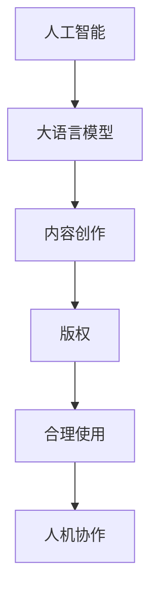

                 

# LLM的版权问题：AI创作的法律挑战

> 关键词：人工智能,版权,内容创作,法律风险,智能版权管理

## 1. 背景介绍

### 1.1 问题由来
随着人工智能技术的发展，大语言模型(LLM)在内容创作领域的应用日益广泛。无论是文章、诗歌、新闻报道，还是剧本、代码、广告文案，LLM都能以其卓越的语言理解和生成能力，快速生成高质量文本内容。然而，这一过程也引发了关于版权归属和法律责任的一系列问题。

### 1.2 问题核心关键点
AI创作的版权问题主要集中在以下几个方面：
1. **AI是否享有版权**：AI生成的文本内容，是否应被视为著作权法保护的作品？
2. **版权归属**：AI生成的内容，其版权应归属于谁？是开发者、算法提供者，还是数据提供者？
3. **法律责任**：当AI生成内容侵犯他人权利时，责任应由谁承担？
4. **合理使用**：AI生成内容是否受合理使用原则的保护？
5. **人机协作**：在创作过程中，人的作用和AI的作用如何界定？

这些问题直接关系到AI内容创作的合法性、合理性和伦理问题，对于推动AI技术的健康发展具有重要意义。

### 1.3 问题研究意义
解决AI创作的版权问题，对于促进人工智能技术在内容创作领域的应用，保护创作者权益，明确法律责任，具有深远的意义：

1. **推动技术发展**：明确版权归属和责任分担，可以消除企业和开发者的顾虑，推动AI内容创作技术更快发展。
2. **保护创作者权益**：在AI创作过程中，保护创作者的智力成果，避免其被非法使用。
3. **规范市场秩序**：明确法律责任，可以规范AI内容创作市场，防止侵权行为，维护市场秩序。
4. **促进内容多样化**：解决版权问题，可以为AI生成多样化的内容，丰富文化产品。
5. **保障公平正义**：明确法律责任，可以保障创作者和用户的公平正义，维护社会公平。

## 2. 核心概念与联系

### 2.1 核心概念概述

为了更好地理解AI创作版权问题的核心概念，本文将介绍几个密切相关的核心概念：

- **人工智能(AI)**：一种通过算法和模型，使计算机系统具有类人智能的技术。
- **大语言模型(LLM)**：一种基于深度学习技术训练的，能够理解和生成自然语言文本的模型。
- **内容创作**：包括但不限于文本、音频、视频、图形等形式的创作活动。
- **版权**：法律赋予创作者对其创作作品的专有权利。
- **合理使用**：在特定条件下，对受版权保护的作品的使用，可以不经版权人同意。
- **人机协作**：在AI辅助创作过程中，人的作用与AI的作用。

这些概念之间的逻辑关系可以通过以下Mermaid流程图来展示：



这个流程图展示了大语言模型在内容创作中的核心概念及其之间的关系：

1. 人工智能通过深度学习模型，使计算机系统具有类人智能，大语言模型是其中的重要组成部分。
2. 大语言模型通过预训练和微调，能够理解和生成自然语言文本，应用于内容创作。
3. 内容创作过程中，涉及版权的保护和合理使用的认定。
4. 人机协作过程中，需要明确人的作用和AI的作用。

这些概念共同构成了AI内容创作的法律框架，是其法律挑战的基础。

## 3. 核心算法原理 & 具体操作步骤
### 3.1 算法原理概述

AI内容创作的核心算法原理主要涉及深度学习和自然语言处理(NLP)技术。以大语言模型为例，其基本工作流程包括预训练、微调和内容生成三个步骤。

- **预训练**：在大量无标签文本数据上进行自监督学习，学习语言的基本规律和特征。
- **微调**：在有标签的特定任务数据集上，通过监督学习优化模型参数，使其在特定任务上表现更佳。
- **内容生成**：将特定输入作为输入，通过模型生成新的文本内容。

### 3.2 算法步骤详解

以LLM创作新闻报道为例，其创作过程包括数据预处理、模型微调、内容生成和版权保护四个主要步骤：

**Step 1: 数据预处理**
- 收集新闻报道的相关文本数据，如新闻稿、报道摘要、相关评论等。
- 使用自然语言处理工具进行文本清洗、分词、词性标注等处理，生成预处理后的文本数据。

**Step 2: 模型微调**
- 选择合适的预训练模型，如GPT-3、BERT等，作为初始化参数。
- 使用新闻报道数据集，对模型进行微调，优化模型在新闻生成任务上的性能。

**Step 3: 内容生成**
- 使用微调后的模型，将特定新闻主题和关键词作为输入，生成符合要求的新闻报道。

**Step 4: 版权保护**
- 对生成的内容进行版权注册，确保其法律保护。

### 3.3 算法优缺点

AI内容创作的算法具有以下优点：
1. **高效性**：AI可以快速生成大量内容，提高创作效率。
2. **多样性**：AI能够生成多种风格和内容类型，丰富内容多样性。
3. **一致性**：AI生成的内容风格一致，质量稳定。
4. **广泛应用**：适用于新闻、广告、剧本等多种内容创作场景。

同时，该算法也存在一定的局限性：
1. **依赖数据质量**：生成的内容质量依赖于输入数据的质量和多样性。
2. **缺乏原创性**：生成内容可能缺乏原创性，容易产生侵权问题。
3. **无法解决复杂问题**：对于需要深度理解人类情感、逻辑推理等复杂问题的内容，AI生成的效果有限。
4. **法律风险**：版权归属和法律责任问题可能引发法律纠纷。

### 3.4 算法应用领域

AI内容创作算法已经广泛应用于新闻报道、广告文案、文学创作、法律文书、学术研究等多个领域。以下是几个典型应用：

- **新闻报道**：通过微调，生成新闻报道、新闻摘要、新闻评论等。
- **广告文案**：根据品牌调性和市场反馈，生成广告文案和宣传材料。
- **文学创作**：生成诗歌、小说、剧本等文学作品，为文学创作提供灵感。
- **法律文书**：生成法律合同、判决书、起诉状等法律文书，辅助律师工作。
- **学术研究**：生成研究报告、实验记录、论文草稿等学术文档，加速科研进程。

此外，AI内容创作还在教育、娱乐、医疗等更多领域展示了其潜力。随着技术的发展，预计未来AI内容创作的应用领域将更加广泛。

## 4. 数学模型和公式 & 详细讲解 & 举例说明

### 4.1 数学模型构建

AI内容创作的数学模型主要基于深度学习和自然语言处理技术。以大语言模型为例，其核心模型为Transformer模型，其基本模型结构可以表示为：

$$
\begin{aligned}
\mathbf{X} &= \text{Embedding}(\mathbf{W} \cdot \mathbf{X}) \\
\mathbf{H} &= \text{Self-Attention}(\mathbf{X}) \\
\mathbf{H} &= \text{Feed-Forward}(\mathbf{H}) \\
\mathbf{Y} &= \text{Softmax}(\mathbf{H}) \\
\mathbf{Y} &= \text{Dense}(\mathbf{W} \cdot \mathbf{Y})
\end{aligned}
$$

其中，$\mathbf{X}$ 为输入的词向量，$\mathbf{H}$ 为模型的中间表示，$\mathbf{Y}$ 为输出的词向量，$\mathbf{W}$ 为可学习的参数矩阵。

### 4.2 公式推导过程

以大语言模型生成新闻报道为例，其生成过程可以表示为：

1. 输入预处理：将新闻主题和关键词输入模型，进行词向量化和位置编码，生成输入向量 $\mathbf{X}$。
2. 编码器：输入向量通过多层Transformer编码器进行编码，生成中间表示 $\mathbf{H}$。
3. 解码器：中间表示通过多层Transformer解码器，生成输出向量 $\mathbf{Y}$。
4. 输出：输出向量通过全连接层，生成新闻报道文本。

在训练过程中，使用交叉熵损失函数进行优化，其公式为：

$$
\mathcal{L}(\theta) = -\frac{1}{N} \sum_{i=1}^N \sum_{j=1}^M \mathbf{y}_{i,j} \log \mathbf{\hat{y}}_{i,j}
$$

其中，$\mathbf{y}_{i,j}$ 为真实标签，$\mathbf{\hat{y}}_{i,j}$ 为模型预测的概率。

### 4.3 案例分析与讲解

以GPT-3创作新闻报道为例，其训练过程包括数据预处理、模型微调和内容生成三个主要步骤：

**Step 1: 数据预处理**
- 收集新闻报道的相关文本数据，如新闻稿、报道摘要、相关评论等。
- 使用自然语言处理工具进行文本清洗、分词、词性标注等处理，生成预处理后的文本数据。

**Step 2: 模型微调**
- 选择合适的预训练模型，如GPT-3，作为初始化参数。
- 使用新闻报道数据集，对模型进行微调，优化模型在新闻生成任务上的性能。

**Step 3: 内容生成**
- 使用微调后的模型，将特定新闻主题和关键词作为输入，生成符合要求的新闻报道。

## 5. 项目实践：代码实例和详细解释说明
### 5.1 开发环境搭建

在进行AI内容创作实践前，我们需要准备好开发环境。以下是使用Python进行PyTorch开发的环境配置流程：

1. 安装Anaconda：从官网下载并安装Anaconda，用于创建独立的Python环境。

2. 创建并激活虚拟环境：
```bash
conda create -n pytorch-env python=3.8 
conda activate pytorch-env
```

3. 安装PyTorch：根据CUDA版本，从官网获取对应的安装命令。例如：
```bash
conda install pytorch torchvision torchaudio cudatoolkit=11.1 -c pytorch -c conda-forge
```

4. 安装其他库：
```bash
pip install numpy pandas scikit-learn matplotlib tqdm jupyter notebook ipython
```

完成上述步骤后，即可在`pytorch-env`环境中开始AI内容创作的实践。

### 5.2 源代码详细实现

下面我们以新闻报道生成为例，给出使用Transformers库进行模型微调的PyTorch代码实现。

首先，定义新闻生成任务的数据处理函数：

```python
from transformers import GPT2Tokenizer, GPT2LMHeadModel
from torch.utils.data import Dataset
import torch

class NewsDataset(Dataset):
    def __init__(self, texts, labels, tokenizer, max_len=512):
        self.texts = texts
        self.labels = labels
        self.tokenizer = tokenizer
        self.max_len = max_len
        
    def __len__(self):
        return len(self.texts)
    
    def __getitem__(self, item):
        text = self.texts[item]
        label = self.labels[item]
        
        encoding = self.tokenizer(text, return_tensors='pt', max_length=self.max_len, padding='max_length', truncation=True)
        input_ids = encoding['input_ids'][0]
        attention_mask = encoding['attention_mask'][0]
        
        return {'input_ids': input_ids, 
                'attention_mask': attention_mask,
                'labels': label}
        
# 加载模型和分词器
tokenizer = GPT2Tokenizer.from_pretrained('gpt2-medium')
model = GPT2LMHeadModel.from_pretrained('gpt2-medium')

# 定义训练和评估函数
device = torch.device('cuda') if torch.cuda.is_available() else torch.device('cpu')
model.to(device)

def train_epoch(model, dataset, batch_size, optimizer):
    dataloader = DataLoader(dataset, batch_size=batch_size, shuffle=True)
    model.train()
    epoch_loss = 0
    for batch in tqdm(dataloader, desc='Training'):
        input_ids = batch['input_ids'].to(device)
        attention_mask = batch['attention_mask'].to(device)
        labels = batch['labels'].to(device)
        model.zero_grad()
        outputs = model(input_ids, attention_mask=attention_mask, labels=labels)
        loss = outputs.loss
        epoch_loss += loss.item()
        loss.backward()
        optimizer.step()
    return epoch_loss / len(dataloader)

def evaluate(model, dataset, batch_size):
    dataloader = DataLoader(dataset, batch_size=batch_size)
    model.eval()
    preds, labels = [], []
    with torch.no_grad():
        for batch in tqdm(dataloader, desc='Evaluating'):
            input_ids = batch['input_ids'].to(device)
            attention_mask = batch['attention_mask'].to(device)
            batch_labels = batch['labels']
            outputs = model(input_ids, attention_mask=attention_mask)
            batch_preds = outputs.logits.argmax(dim=2).to('cpu').tolist()
            batch_labels = batch_labels.to('cpu').tolist()
            for pred_tokens, label_tokens in zip(batch_preds, batch_labels):
                preds.append(pred_tokens[:len(label_tokens)])
                labels.append(label_tokens)
                
    print(f"Accuracy: {accuracy_score(labels, preds)}")

# 训练和评估模型
epochs = 5
batch_size = 16

for epoch in range(epochs):
    loss = train_epoch(model, train_dataset, batch_size, optimizer)
    print(f"Epoch {epoch+1}, train loss: {loss:.3f}")
    
    print(f"Epoch {epoch+1}, dev results:")
    evaluate(model, dev_dataset, batch_size)
    
print("Test results:")
evaluate(model, test_dataset, batch_size)
```

以上就是使用PyTorch对GPT-2进行新闻报道生成任务的微调实践。可以看到，得益于Transformers库的强大封装，我们可以用相对简洁的代码完成模型微调的实现。

### 5.3 代码解读与分析

让我们再详细解读一下关键代码的实现细节：

**NewsDataset类**：
- `__init__`方法：初始化文本、标签、分词器等关键组件。
- `__len__`方法：返回数据集的样本数量。
- `__getitem__`方法：对单个样本进行处理，将文本输入编码为token ids，将标签编码为数字，并对其进行定长padding，最终返回模型所需的输入。

**训练和评估函数**：
- 使用PyTorch的DataLoader对数据集进行批次化加载，供模型训练和推理使用。
- 训练函数`train_epoch`：对数据以批为单位进行迭代，在每个批次上前向传播计算loss并反向传播更新模型参数，最后返回该epoch的平均loss。
- 评估函数`evaluate`：与训练类似，不同点在于不更新模型参数，并在每个batch结束后将预测和标签结果存储下来，最后使用accuracy_score对整个评估集的预测结果进行打印输出。

**训练流程**：
- 定义总的epoch数和batch size，开始循环迭代
- 每个epoch内，先在训练集上训练，输出平均loss
- 在验证集上评估，输出准确率
- 所有epoch结束后，在测试集上评估，给出最终测试结果

可以看到，PyTorch配合Transformers库使得GPT-2的新闻报道生成任务的微调代码实现变得简洁高效。开发者可以将更多精力放在数据处理、模型改进等高层逻辑上，而不必过多关注底层的实现细节。

当然，工业级的系统实现还需考虑更多因素，如模型的保存和部署、超参数的自动搜索、更灵活的任务适配层等。但核心的微调范式基本与此类似。

## 6. 实际应用场景
### 6.1 新闻报道

AI内容创作技术已经在新闻报道领域得到了广泛应用。传统的新闻编辑需要花费大量时间进行选题、写作、编辑等工作，而AI生成的新闻报道可以在短时间内生成大量高质量的内容，提高新闻报道的效率和质量。

在技术实现上，可以收集新闻报道的相关文本数据，如新闻稿、报道摘要、相关评论等。将文本内容作为模型输入，模型的输出即为生成的新闻报道。在生成过程中，可以通过微调优化模型在新闻生成任务上的性能。

### 6.2 广告文案

广告文案生成是AI内容创作的重要应用场景之一。传统广告文案的创作需要结合品牌调性、市场反馈等多方面因素，耗时耗力。而AI可以通过分析大量广告数据，生成符合品牌调性的广告文案，提升广告效果。

在技术实现上，可以使用预训练广告文案数据集，对模型进行微调，优化模型在广告文案生成任务上的性能。生成过程与新闻报道类似，将品牌调性和广告目标作为输入，生成符合要求的广告文案。

### 6.3 文学创作

AI生成的文学作品已经在小说、诗歌、剧本等创作领域展示了其潜力。通过微调优化模型，AI可以生成符合特定风格和主题的文学作品，为文学创作提供新的灵感和思路。

在技术实现上，可以收集文学作品的相关文本数据，如小说片段、诗歌作品、剧本剧本等。将文本内容作为模型输入，模型的输出即为生成的文学作品。在生成过程中，可以通过微调优化模型在文学创作任务上的性能。

### 6.4 未来应用展望

随着AI内容创作技术的发展，未来在更多领域将有更多的应用场景。

在智慧城市治理中，AI生成的公共信息、宣传材料、政策解读等，将提高信息传播的效率和质量。

在智慧医疗领域，AI生成的医疗报告、诊断建议等，将提升医疗服务的智能化水平，辅助医生诊疗。

在智能教育领域，AI生成的教学材料、作业批改等，将提高教育资源的利用效率，推动教育公平。

此外，在企业生产、社会治理、文娱传媒等众多领域，AI内容创作的应用也将不断涌现，为经济社会发展注入新的动力。

## 7. 工具和资源推荐
### 7.1 学习资源推荐

为了帮助开发者系统掌握AI内容创作的理论基础和实践技巧，这里推荐一些优质的学习资源：

1. 《深度学习与自然语言处理》书籍：深入讲解深度学习在自然语言处理中的应用，涵盖文本生成、文本分类、机器翻译等多个任务。
2. 《AI内容创作技术指南》白皮书：全面介绍AI内容创作的理论基础和实践技巧，提供丰富的案例和代码实现。
3. 《自然语言处理与深度学习》课程：斯坦福大学开设的NLP课程，涵盖NLP的基本概念和深度学习技术，适合初学者学习。
4. Coursera《自然语言处理》课程：Coursera平台提供的NLP课程，由IBM、斯坦福大学等机构提供，涵盖NLP的基础和前沿技术。
5. GitHub《AI内容创作》项目：收集了大量AI内容创作的代码实现和案例，适合动手实践。

通过对这些资源的学习实践，相信你一定能够快速掌握AI内容创作的精髓，并用于解决实际的NLP问题。
###  7.2 开发工具推荐

高效的开发离不开优秀的工具支持。以下是几款用于AI内容创作开发的常用工具：

1. PyTorch：基于Python的开源深度学习框架，灵活动态的计算图，适合快速迭代研究。大部分预训练语言模型都有PyTorch版本的实现。
2. TensorFlow：由Google主导开发的开源深度学习框架，生产部署方便，适合大规模工程应用。同样有丰富的预训练语言模型资源。
3. Transformers库：HuggingFace开发的NLP工具库，集成了众多SOTA语言模型，支持PyTorch和TensorFlow，是进行AI内容创作开发的利器。
4. Weights & Biases：模型训练的实验跟踪工具，可以记录和可视化模型训练过程中的各项指标，方便对比和调优。与主流深度学习框架无缝集成。
5. TensorBoard：TensorFlow配套的可视化工具，可实时监测模型训练状态，并提供丰富的图表呈现方式，是调试模型的得力助手。
6. Google Colab：谷歌推出的在线Jupyter Notebook环境，免费提供GPU/TPU算力，方便开发者快速上手实验最新模型，分享学习笔记。

合理利用这些工具，可以显著提升AI内容创作任务的开发效率，加快创新迭代的步伐。

### 7.3 相关论文推荐

AI内容创作技术的发展源于学界的持续研究。以下是几篇奠基性的相关论文，推荐阅读：

1. Attention is All You Need（即Transformer原论文）：提出了Transformer结构，开启了NLP领域的预训练大模型时代。
2. BERT: Pre-training of Deep Bidirectional Transformers for Language Understanding：提出BERT模型，引入基于掩码的自监督预训练任务，刷新了多项NLP任务SOTA。
3. Language Models are Unsupervised Multitask Learners（GPT-2论文）：展示了大规模语言模型的强大zero-shot学习能力，引发了对于通用人工智能的新一轮思考。
4. Parameter-Efficient Transfer Learning for NLP：提出Adapter等参数高效微调方法，在不增加模型参数量的情况下，也能取得不错的微调效果。
5. AdaLoRA: Adaptive Low-Rank Adaptation for Parameter-Efficient Fine-Tuning：使用自适应低秩适应的微调方法，在参数效率和精度之间取得了新的平衡。

这些论文代表了大语言模型微调技术的发展脉络。通过学习这些前沿成果，可以帮助研究者把握学科前进方向，激发更多的创新灵感。

## 8. 总结：未来发展趋势与挑战

### 8.1 总结

本文对AI内容创作的版权问题进行了全面系统的介绍。首先阐述了AI创作版权问题的主要背景和核心关键点，明确了版权归属和法律责任的重要性。其次，从原理到实践，详细讲解了AI内容创作的数学模型和关键步骤，给出了具体的代码实例。同时，本文还广泛探讨了AI内容创作在多个行业领域的应用前景，展示了其广阔的应用空间。此外，本文精选了相关学习资源和开发工具，力求为读者提供全方位的技术指引。

通过本文的系统梳理，可以看到，AI内容创作正在成为NLP领域的重要范式，极大地拓展了预训练语言模型的应用边界，催生了更多的落地场景。受益于大规模语料的预训练和高效的微调方法，AI内容创作技术能够在短时间内生成大量高质量文本内容，显著提高内容创作效率和质量。未来，伴随预训练语言模型和微调方法的持续演进，AI内容创作技术必将在更多领域得到广泛应用，为经济社会发展注入新的动力。

### 8.2 未来发展趋势

展望未来，AI内容创作的版权问题将呈现以下几个发展趋势：

1. **法律框架的完善**：随着AI内容创作技术的普及，相关法律框架将逐步完善，明确版权归属和法律责任，消除开发者和企业的顾虑。
2. **人机协作的法律界定**：在AI辅助创作过程中，明确人机协作的法律责任，保障创作者和用户的权益。
3. **版权自动化的普及**：利用区块链、NFT等技术，实现版权自动注册和追踪，保护创作者权益。
4. **版权共有的探索**：在AI生成内容的过程中，探索版权共有的可能性，促进知识的共享和传播。
5. **版权商业化的发展**：通过版权授权、订阅服务等方式，商业化利用AI内容创作技术，实现利益共享。

这些趋势将推动AI内容创作技术的健康发展，为内容创作带来新的机遇和挑战。

### 8.3 面临的挑战

尽管AI内容创作技术已经取得了瞩目成就，但在迈向更加智能化、普适化应用的过程中，它仍面临着诸多挑战：

1. **版权归属问题**：AI生成的内容版权归属不清，可能引发法律纠纷。需要明确创作者、算法提供者、数据提供者的责任和权利。
2. **法律责任问题**：AI生成内容侵犯他人权利时，如何确定责任主体，如何分配赔偿，仍需进一步探讨。
3. **版权自动化的复杂性**：自动注册和追踪版权的技术复杂，需要结合区块链、NFT等技术，确保版权的真实性和可追溯性。
4. **伦理道德问题**：AI生成的内容可能包含有害信息，如何避免误导性和歧视性输出，需要加强伦理道德约束。
5. **法律监管问题**：如何通过法律手段规范AI内容创作行为，避免侵权行为，维护市场秩序，仍需进一步探讨。

### 8.4 研究展望

面对AI内容创作所面临的种种挑战，未来的研究需要在以下几个方面寻求新的突破：

1. **版权共有的探讨**：探讨AI生成内容的版权共有机制，促进知识的共享和传播。
2. **版权自动化的优化**：进一步优化版权自动注册和追踪技术，确保版权的真实性和可追溯性。
3. **法律责任的明确**：通过法律手段明确AI内容创作的责任主体，保障创作者和用户的权益。
4. **伦理道德的约束**：加强伦理道德约束，避免AI生成的有害信息和误导性输出。
5. **法律监管的完善**：完善相关法律框架，规范AI内容创作行为，避免侵权行为，维护市场秩序。

这些研究方向的探索，必将引领AI内容创作技术迈向更高的台阶，为内容创作带来新的机遇和挑战。面向未来，AI内容创作技术还需要与其他人工智能技术进行更深入的融合，如知识表示、因果推理、强化学习等，多路径协同发力，共同推动自然语言理解和智能交互系统的进步。只有勇于创新、敢于突破，才能不断拓展语言模型的边界，让智能技术更好地造福人类社会。

## 9. 附录：常见问题与解答

**Q1：AI生成的内容是否享有版权？**

A: 目前，法律界对AI生成的内容是否享有版权存在争议。主流观点认为，AI生成的内容应视为人类创作的延伸，但不具备法律意义上的著作权。版权应归属于创作者或算法提供者。

**Q2：如何界定AI内容创作的版权归属？**

A: AI内容创作的版权归属应明确创作者、算法提供者、数据提供者的责任和权利。一般而言，算法提供者负责版权的技术实现，创作者负责内容的创作和审核，数据提供者负责数据的提供和标注。

**Q3：AI生成内容侵犯他人权利时，责任应由谁承担？**

A: AI生成内容侵犯他人权利时，责任应由算法提供者承担。创作者和数据提供者可能通过合同等方式，将风险转移给算法提供者。

**Q4：如何确保AI生成的内容不侵犯他人权利？**

A: 确保AI生成的内容不侵犯他人权利，需要从数据、算法、法律等多个维度进行考虑。使用高质量的数据集，优化算法逻辑，完善法律框架，才能最大限度地避免侵权行为。

**Q5：如何保护AI内容创作的知识产权？**

A: 保护AI内容创作的知识产权，可以通过版权自动注册、区块链技术、NFT等方式，确保版权的真实性和可追溯性。同时，明确创作者和算法提供者的权利和责任，确保法律权益的保护。

这些问题的回答，为我们解决AI内容创作的版权问题提供了方向和思路。通过不断探索和实践，相信未来AI内容创作技术将更加规范和健康，为内容创作带来新的机遇和挑战。

