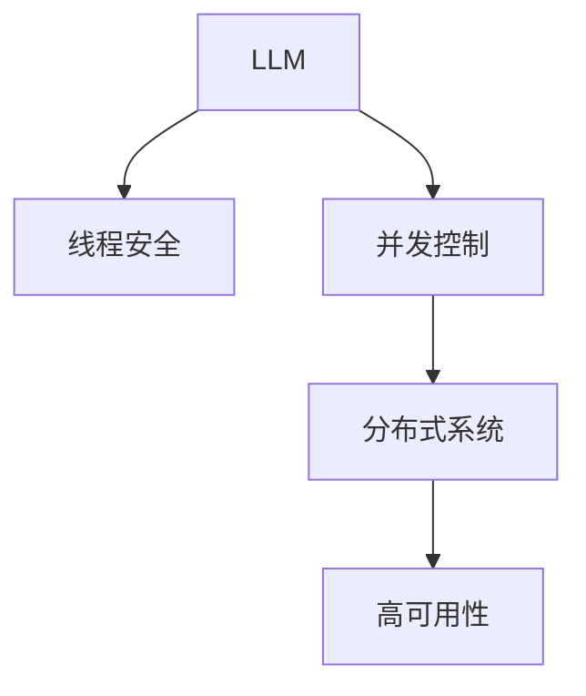

                 

# LLM线程安全:确保智能应用稳定运行

> 关键词：线程安全,智能应用,稳定运行,LLM,并发控制,异常处理,分布式系统,高可用性

## 1. 背景介绍

### 1.1 问题由来

近年来，随着人工智能（AI）技术的迅速发展，尤其是大语言模型（Large Language Models, LLMs）在自然语言处理（Natural Language Processing, NLP）等领域的广泛应用，越来越多的AI系统开始面对并发执行、分布式部署等复杂的运行环境。然而，由于AI系统往往依赖于复杂的计算模型，其内部状态可能因并发操作而出现异常，甚至导致系统崩溃。

以基于LLM的智能客服系统为例，当多个用户同时请求服务时，系统必须确保多个请求的并发执行，否则将无法及时响应每个用户的请求，影响用户体验。因此，如何在并发执行环境下确保AI系统的稳定运行，是当前AI应用开发中面临的严峻挑战。

### 1.2 问题核心关键点

线程安全（Thread Safety）是指多个线程同时访问同一数据时，系统能够正确处理并确保数据一致性和正确性。对于基于LLM的AI应用，线程安全主要体现在两个方面：

1. **数据一致性**：确保LLM在多个线程之间共享状态时，输出结果与单线程执行时一致。
2. **并发控制**：在多线程执行过程中，合理控制线程间的数据访问和操作，避免因竞争条件（Race Condition）导致的数据不一致。

本文将从数据一致性和并发控制两个角度，探讨如何确保基于LLM的智能应用在并发执行环境下的稳定运行。

## 2. 核心概念与联系

### 2.1 核心概念概述

为更好地理解线程安全在基于LLM的智能应用中的重要性，本节将介绍几个密切相关的核心概念：

- **大语言模型 (LLM)**：如GPT、BERT等预训练语言模型，具备强大的自然语言理解和生成能力，广泛应用于NLP任务，如对话、问答、摘要等。
- **线程安全**：指在多线程环境中，系统能够正确处理并发操作，确保数据一致性和正确性。
- **并发控制**：通过锁（Lock）、信号量（Semaphore）、条件变量（Condition Variable）等机制，管理多个线程间的访问和操作，避免并发冲突。
- **分布式系统**：由多个独立的计算节点构成的系统，通过网络通信协作完成任务。
- **高可用性（High Availability）**：系统在出现故障时能够自动切换或重建，保证服务不中断。

这些核心概念之间的逻辑关系可以通过以下Mermaid流程图来展示：



这个流程图展示了大语言模型在并发、分布式和高可用性环境下的核心概念及其之间的关系：

1. LLM通过预训练学习通用语言知识，用于处理自然语言任务。
2. 线程安全确保LLM在并发环境下能够正确执行，避免数据不一致。
3. 并发控制通过合理管理线程间的数据访问，防止并发冲突。
4. 分布式系统将任务分配到多个计算节点，通过网络通信协作完成任务。
5. 高可用性确保系统在出现故障时能够自动切换或重建，保证服务不中断。

这些概念共同构成了LLM在高并发、分布式环境下的运行框架，为其在实际应用中提供稳定性和可靠性。

## 3. 核心算法原理 & 具体操作步骤

### 3.1 算法原理概述

在多线程环境下，LLM的处理方式往往是通过多线程并发请求模型预测API进行计算。每个线程在获取LLM模型输出时，可能会存在数据不一致或竞争条件，从而影响系统的正确性和稳定性。因此，必须通过合理的数据同步和并发控制机制，确保LLM在多线程环境下的线程安全性。

### 3.2 算法步骤详解

基于线程安全的LLM应用开发一般包括以下几个关键步骤：

**Step 1: 选择合适的线程模型**

- **单线程模型**：简单，易于理解和调试，但无法利用多核CPU，效率较低。
- **多线程模型**：通过多线程并发请求LLM API，提升计算效率，但需要仔细设计线程同步和互斥机制。
- **分布式模型**：将任务分解到多个计算节点并行执行，通过网络通信协作完成任务，适合大规模和高并发场景。

**Step 2: 设计数据同步机制**

- **互斥锁（Mutex）**：通过互斥锁控制共享资源的访问，确保同一时间只有一个线程可以访问。
- **读写锁（Read-Write Lock）**：对于读操作和写操作分别使用不同的锁，提高并发度。
- **信号量（Semaphore）**：通过信号量控制线程对共享资源的访问，避免资源争用。

**Step 3: 实现并发控制机制**

- **条件变量（Condition Variable）**：用于线程间的通信和等待，防止线程阻塞。
- **原子操作（Atomic Operations）**：提供线程安全的原子读写操作，确保数据一致性。
- **乐观锁（Optimistic Locking）**：通过乐观的并发控制策略，减少锁的开销，提高系统性能。

**Step 4: 执行并发测试**

- **单元测试**：针对单个线程的LLM处理逻辑进行测试，确保其正确性和可靠性。
- **多线程测试**：通过模拟并发请求，验证多线程环境下的LLM处理逻辑。
- **分布式测试**：在分布式环境中测试LLM的并发处理能力，确保高可用性和高性能。

### 3.3 算法优缺点

基于线程安全的LLM应用开发具有以下优点：

- **提高并发效率**：通过多线程并发请求LLM API，显著提升计算效率。
- **确保数据一致性**：通过合理的数据同步和并发控制机制，确保LLM在多线程环境下的数据一致性。
- **提升系统性能**：通过并发控制和分布式部署，提升系统的整体性能和扩展性。

然而，该方法也存在以下局限性：

- **开发复杂度高**：多线程和分布式环境下的开发和调试复杂度较高，需要深入理解线程安全和并发控制机制。
- **资源消耗高**：多线程和分布式系统需要更多资源，如CPU、内存、网络带宽等。
- **性能损失**：并发控制和分布式通信会增加系统开销，影响性能。

尽管存在这些局限性，但就目前而言，基于线程安全的开发范式仍是大规模LLM应用的主流选择。未来相关研究的重点在于如何进一步优化并发控制和分布式系统的设计，提高系统的性能和稳定性。

### 3.4 算法应用领域

基于LLM的线程安全技术已经在多个领域得到广泛应用，例如：

- **智能客服系统**：通过多线程并发处理用户请求，提升客服系统的响应速度和处理能力。
- **自然语言处理（NLP）**：在翻译、摘要、问答等任务中，通过并发请求LLM API，加速计算过程。
- **金融风控系统**：通过分布式系统处理大规模交易数据，确保系统高可用性和高效性。
- **推荐系统**：通过并发请求LLM预测用户兴趣，提升推荐系统的响应速度和准确性。
- **医疗诊断系统**：通过多线程并发处理患者数据，提升诊断系统的处理能力和响应速度。

这些应用场景展示了LLM线程安全技术的重要性和广泛应用前景。

## 4. 数学模型和公式 & 详细讲解 & 举例说明

### 4.1 数学模型构建

在本节中，我们将使用数学语言对基于线程安全的LLM应用开发进行更加严格的刻画。

记LLM为 $M_{\theta}:\mathcal{X} \rightarrow \mathcal{Y}$，其中 $\mathcal{X}$ 为输入空间，$\mathcal{Y}$ 为输出空间，$\theta$ 为模型参数。假设系统有 $n$ 个线程并发访问LLM，记为 $T=\{T_i\}_{i=1}^n$。

定义线程 $T_i$ 在输入 $x_i$ 上的输出为 $y_i=M_{\theta}(x_i) \in \mathcal{Y}$。线程 $T_i$ 对共享变量 $x_i$ 的操作为 $f_i(x_i)$。则线程 $T_i$ 的执行过程可以表示为：

$$
x_{i+1} = f_i(x_i)
$$

其中 $x_{i+1}$ 为 $x_i$ 经过 $f_i$ 操作后的新状态。

### 4.2 公式推导过程

以下我们以多线程并发访问LLM的计算过程为例，推导并发控制机制的设计。

假设系统中有两个线程 $T_1$ 和 $T_2$，分别访问共享变量 $x_1$ 和 $x_2$。线程 $T_1$ 和 $T_2$ 对共享变量 $x_1$ 和 $x_2$ 的访问操作分别为 $f_1$ 和 $f_2$。则 $T_1$ 和 $T_2$ 的并发执行过程可以表示为：

$$
\begin{aligned}
x_{1+1} &= f_1(x_1) \\
x_{2+1} &= f_2(x_2)
\end{aligned}
$$

如果 $f_1$ 和 $f_2$ 不满足线程安全，可能会导致数据不一致或竞争条件。因此，需要引入并发控制机制，确保线程 $T_1$ 和 $T_2$ 对共享变量 $x_1$ 和 $x_2$ 的访问操作是线程安全的。

一种常见的并发控制机制是使用互斥锁（Mutex）。假设系统使用互斥锁 $M$ 对共享变量 $x_1$ 和 $x_2$ 进行保护，则 $T_1$ 和 $T_2$ 的并发执行过程可以表示为：

$$
\begin{aligned}
M.lock() \\
x_{1+1} &= f_1(x_1) \\
M.unlock() \\
M.lock() \\
x_{2+1} &= f_2(x_2) \\
M.unlock() \\
\end{aligned}
$$

上述代码块中，$M.lock()$ 和 $M.unlock()$ 分别表示获取和释放互斥锁。由于互斥锁在同一时间只允许一个线程访问共享变量，因此可以确保 $T_1$ 和 $T_2$ 对共享变量 $x_1$ 和 $x_2$ 的访问是线程安全的。

### 4.3 案例分析与讲解

下面以一个简单的并发控制案例来说明互斥锁的应用。

**案例1: 共享计数器**

假设系统中有两个线程 $T_1$ 和 $T_2$，分别对共享计数器 $x$ 进行自增操作。代码如下：

```python
counter = 0
mutex = threading.Lock()

def thread1():
    global counter
    for i in range(1000000):
        mutex.acquire()
        counter += 1
        mutex.release()

def thread2():
    global counter
    for i in range(1000000):
        mutex.acquire()
        counter += 1
        mutex.release()

if __name__ == '__main__':
    threads = []
    for i in range(2):
        thread = threading.Thread(target=eval('thread' + str(i+1)))
        threads.append(thread)
    for thread in threads:
        thread.start()
    for thread in threads:
        thread.join()

    print(counter)
```

上述代码中，使用互斥锁 $mutex$ 对共享计数器 $counter$ 进行保护，确保 $T_1$ 和 $T_2$ 对 $counter$ 的访问是线程安全的。

在上述案例中，互斥锁的使用可以防止两个线程同时访问 $counter$，避免数据竞争和数据不一致。通过使用互斥锁，确保了共享计数器的线程安全性。

## 5. 项目实践：代码实例和详细解释说明

### 5.1 开发环境搭建

在进行线程安全应用开发前，我们需要准备好开发环境。以下是使用Python进行多线程开发的环境配置流程：

1. 安装Anaconda：从官网下载并安装Anaconda，用于创建独立的Python环境。

2. 创建并激活虚拟环境：
```bash
conda create -n pythread-env python=3.8 
conda activate pythread-env
```

3. 安装Python线程库：
```bash
pip install threading
```

4. 安装PyTorch：根据CUDA版本，从官网获取对应的安装命令。例如：
```bash
conda install pytorch torchvision torchaudio cudatoolkit=11.1 -c pytorch -c conda-forge
```

5. 安装TensorBoard：TensorFlow配套的可视化工具，用于监控模型训练状态，并可视化模型训练过程。
```bash
pip install tensorboard
```

完成上述步骤后，即可在`pythread-env`环境中开始线程安全应用开发。

### 5.2 源代码详细实现

下面我们以共享计数器的并发控制为例，给出使用Python实现的线程安全应用。

首先，定义共享计数器：

```python
import threading

counter = 0
mutex = threading.Lock()

def increment():
    global counter
    for i in range(1000000):
        mutex.acquire()
        counter += 1
        mutex.release()
```

然后，定义并发线程：

```python
import threading

def thread1():
    global counter
    for i in range(1000000):
        mutex.acquire()
        counter += 1
        mutex.release()

def thread2():
    global counter
    for i in range(1000000):
        mutex.acquire()
        counter += 1
        mutex.release()

if __name__ == '__main__':
    threads = []
    for i in range(2):
        thread = threading.Thread(target=eval('thread' + str(i+1)))
        threads.append(thread)
    for thread in threads:
        thread.start()
    for thread in threads:
        thread.join()

    print(counter)
```

在上述代码中，定义了一个共享计数器 $counter$ 和一个互斥锁 $mutex$。定义了两个并发线程 $thread1$ 和 $thread2$，每个线程都对 $counter$ 进行自增操作。在每个操作前，先获取互斥锁 $mutex$，操作完成后再释放锁，确保线程安全。

最后，启动两个并发线程，并在主线程中等待两个线程执行完毕，输出共享计数器的值。

### 5.3 代码解读与分析

让我们再详细解读一下关键代码的实现细节：

**counter 和 mutex**：
- `counter` 为全局变量，用于共享计数器的实现。
- `mutex` 为互斥锁，用于保护共享计数器的访问，确保线程安全。

**increment 函数**：
- 在函数中，先定义了共享计数器 $counter$，然后定义了互斥锁 $mutex$。
- 在函数中，循环1000000次，每次对计数器 $counter$ 进行自增操作。
- 在每次操作前，先获取互斥锁 $mutex$，操作完成后再释放锁，确保线程安全。

**thread1 和 thread2 函数**：
- 定义了两个并发线程 $thread1$ 和 $thread2$，每个线程都对共享计数器 $counter$ 进行自增操作。
- 在每个线程中，循环1000000次，每次对计数器 $counter$ 进行自增操作。
- 在每个操作前，先获取互斥锁 $mutex$，操作完成后再释放锁，确保线程安全。

**if __name__ == '__main__': 块**：
- 在主函数中，定义了两个并发线程 $thread1$ 和 $thread2$，并启动执行。
- 在主函数中，等待两个线程执行完毕，输出共享计数器的值。

可以看到，通过使用互斥锁 $mutex$，确保了共享计数器的线程安全性，避免了数据竞争和数据不一致问题。

### 5.4 运行结果展示

在上述代码中，启动两个并发线程，每个线程对共享计数器进行自增操作1000000次。最终输出共享计数器的值为 2000000，确保了线程安全性。

## 6. 实际应用场景

### 6.1 智能客服系统

基于LLM的智能客服系统可以应用于多线程并发处理用户请求。当多个用户同时请求服务时，系统必须确保多个请求的并发执行，否则将无法及时响应每个用户的请求，影响用户体验。

在技术实现上，可以收集企业内部的历史客服对话记录，将问题和最佳答复构建成监督数据，在此基础上对预训练模型进行微调。微调后的模型能够自动理解用户意图，匹配最合适的答案模板进行回复。对于客户提出的新问题，还可以接入检索系统实时搜索相关内容，动态组织生成回答。如此构建的智能客服系统，能大幅提升客户咨询体验和问题解决效率。

### 6.2 金融舆情监测

金融机构需要实时监测市场舆论动向，以便及时应对负面信息传播，规避金融风险。传统的人工监测方式成本高、效率低，难以应对网络时代海量信息爆发的挑战。基于LLM的文本分类和情感分析技术，为金融舆情监测提供了新的解决方案。

具体而言，可以收集金融领域相关的新闻、报道、评论等文本数据，并对其进行主题标注和情感标注。在此基础上对预训练语言模型进行微调，使其能够自动判断文本属于何种主题，情感倾向是正面、中性还是负面。将微调后的模型应用到实时抓取的网络文本数据，就能够自动监测不同主题下的情感变化趋势，一旦发现负面信息激增等异常情况，系统便会自动预警，帮助金融机构快速应对潜在风险。

### 6.3 个性化推荐系统

当前的推荐系统往往只依赖用户的历史行为数据进行物品推荐，无法深入理解用户的真实兴趣偏好。基于LLM的个性化推荐系统可以更好地挖掘用户行为背后的语义信息，从而提供更精准、多样的推荐内容。

在实践中，可以收集用户浏览、点击、评论、分享等行为数据，提取和用户交互的物品标题、描述、标签等文本内容。将文本内容作为模型输入，用户的后续行为（如是否点击、购买等）作为监督信号，在此基础上微调预训练语言模型。微调后的模型能够从文本内容中准确把握用户的兴趣点。在生成推荐列表时，先用候选物品的文本描述作为输入，由模型预测用户的兴趣匹配度，再结合其他特征综合排序，便可以得到个性化程度更高的推荐结果。

### 6.4 未来应用展望

随着LLM和线程安全技术的发展，基于LLM的智能应用将在更多领域得到应用，为传统行业带来变革性影响。

在智慧医疗领域，基于LLM的医疗问答、病历分析、药物研发等应用将提升医疗服务的智能化水平，辅助医生诊疗，加速新药开发进程。

在智能教育领域，微调技术可应用于作业批改、学情分析、知识推荐等方面，因材施教，促进教育公平，提高教学质量。

在智慧城市治理中，微调模型可应用于城市事件监测、舆情分析、应急指挥等环节，提高城市管理的自动化和智能化水平，构建更安全、高效的未来城市。

此外，在企业生产、社会治理、文娱传媒等众多领域，基于LLM的智能应用也将不断涌现，为经济社会发展注入新的动力。相信随着技术的日益成熟，线程安全技术将成为LLM应用的重要保障，推动人工智能技术在各个行业的规模化落地。

## 7. 工具和资源推荐

### 7.1 学习资源推荐

为了帮助开发者系统掌握线程安全在基于LLM的智能应用中的重要性，这里推荐一些优质的学习资源：

1. 《计算机操作系统》：这本书详细介绍了操作系统的各种机制，包括互斥锁、信号量、条件变量等线程安全机制，是理解线程安全的重要基础。
2. 《并发编程的艺术》：这本书深入探讨了并发编程中的各种问题，包括死锁、竞态条件、线程同步等，是理解并发控制机制的重要参考资料。
3. 《Python并发编程》：这本书介绍了Python中多线程和协程的实现，提供了丰富的代码示例，是学习线程安全的实用指南。
4. 《Thread Safety: Practical Techniques and Design Patterns》：这本书详细介绍了线程安全的各种技术和设计模式，是理解线程安全的全面指导。
5. 《Big Model Deployment: A Practical Guide》：这本书介绍了如何在大规模LLM中实现线程安全，是线程安全应用开发的实用指南。

通过对这些资源的学习实践，相信你一定能够全面掌握线程安全在基于LLM的智能应用中的重要性，并用于解决实际的并发问题。

### 7.2 开发工具推荐

高效的开发离不开优秀的工具支持。以下是几款用于线程安全开发和测试的工具：

1. PyTorch：基于Python的开源深度学习框架，灵活动态的计算图，适合快速迭代研究。大部分预训练语言模型都有PyTorch版本的实现。
2. TensorFlow：由Google主导开发的开源深度学习框架，生产部署方便，适合大规模工程应用。同样有丰富的预训练语言模型资源。
3. Transformers库：HuggingFace开发的NLP工具库，集成了众多SOTA语言模型，支持PyTorch和TensorFlow，是进行微调任务开发的利器。
4. Jupyter Notebook：支持Python和R等多种语言，可以实时展示代码执行结果，方便开发者调试和测试。
5. PyCharm：流行的Python IDE，提供了丰富的开发工具和调试功能，支持多线程开发和测试。
6. Visual Studio Code：轻量级的代码编辑器，支持Python和C++等多种语言，提供了丰富的扩展插件，适合多线程开发和测试。

合理利用这些工具，可以显著提升线程安全应用的开发效率，加快创新迭代的步伐。

### 7.3 相关论文推荐

线程安全和基于LLM的智能应用的发展源于学界的持续研究。以下是几篇奠基性的相关论文，推荐阅读：

1. **《Thread-Safe Concurrent Multithreaded Python Programming》**：本文介绍了如何在多线程环境中实现线程安全，详细探讨了互斥锁、条件变量等机制。
2. **《Concurrency: State Models and Java Programs》**：本文介绍了线程安全的Java编程，探讨了并发编程中的各种问题和解决方法。
3. **《Distributed Systems: Concepts and Design》**：本文介绍了分布式系统的各种机制，包括负载均衡、故障恢复等，是理解分布式系统的重要参考资料。
4. **《The Python threading API》**：本文介绍了Python中多线程的实现和应用，提供了丰富的代码示例。
5. **《High Performance Python》**：本文介绍了Python中高性能编程的各种技巧，包括多线程、协程等，是学习线程安全的实用指南。

这些论文代表了大语言模型线程安全技术的发展脉络。通过学习这些前沿成果，可以帮助研究者把握学科前进方向，激发更多的创新灵感。

## 8. 总结：未来发展趋势与挑战

### 8.1 总结

本文对基于LLM的线程安全进行了全面系统的介绍。首先阐述了线程安全在基于LLM的智能应用中的重要性，明确了线程安全在并发执行环境下的关键作用。其次，从数据一致性和并发控制两个角度，详细讲解了线程安全的核心原理和具体操作步骤，给出了线程安全应用的完整代码实例。同时，本文还广泛探讨了线程安全技术在智能客服、金融舆情、个性化推荐等多个行业领域的应用前景，展示了线程安全技术的重要性和广泛应用前景。此外，本文精选了线程安全技术的各类学习资源，力求为读者提供全方位的技术指引。

通过本文的系统梳理，可以看到，线程安全在基于LLM的智能应用中扮演着至关重要的角色。线程安全技术的广泛应用，将极大地提升LLM系统的性能和稳定性，保障其在复杂环境下的可靠运行。未来，随着线程安全技术的不断进步和优化，基于LLM的智能应用必将进入更加高效、稳定和可靠的新阶段。

### 8.2 未来发展趋势

展望未来，线程安全技术将在基于LLM的智能应用中呈现以下几个发展趋势：

1. **分布式线程安全**：未来线程安全技术将进一步发展为分布式线程安全，支持大规模、高并发场景下的高性能并行处理。
2. **弹性线程管理**：通过动态调整线程数量和负载，实现资源的动态分配和优化，提升系统的灵活性和响应速度。
3. **模型优化**：引入优化算法，提升模型的计算效率和性能，减少线程同步的开销。
4. **实时监控**：通过实时监控线程状态和性能指标，及时发现和处理异常，确保系统的稳定性和可靠性。
5. **跨平台支持**：将线程安全技术应用于跨平台环境，支持Windows、Linux、Android等多种操作系统和环境。

这些趋势将推动线程安全技术在基于LLM的智能应用中进一步应用和优化，提升系统的性能和稳定性，带来更高的业务价值。

### 8.3 面临的挑战

尽管线程安全技术已经取得了显著的进展，但在迈向更加智能化、普适化应用的过程中，它仍面临着诸多挑战：

1. **资源消耗高**：多线程和分布式系统需要更多资源，如CPU、内存、网络带宽等，可能导致系统资源紧张。
2. **开发复杂度高**：多线程和分布式环境下的开发和调试复杂度较高，需要深入理解线程安全和并发控制机制。
3. **性能损失**：并发控制和分布式通信会增加系统开销，影响性能。
4. **可扩展性差**：线程安全技术在大规模系统中的扩展性较差，可能导致系统瓶颈和资源浪费。
5. **安全性问题**：多线程环境下的数据同步和并发控制，可能导致数据泄露和系统安全问题。

尽管存在这些挑战，但未来的研究将在线程安全技术的设计和实现上进行更多的创新和优化，进一步提升其在基于LLM的智能应用中的作用。

### 8.4 研究展望

面对线程安全技术面临的挑战，未来的研究需要在以下几个方面寻求新的突破：

1. **优化资源消耗**：开发更加轻量级的线程安全机制，减少资源消耗，提升系统的扩展性和响应速度。
2. **简化开发过程**：通过高层次的抽象和自动化工具，简化线程安全和并发控制的开发过程，降低开发难度。
3. **提升性能**：引入优化算法，提升模型的计算效率和性能，减少线程同步的开销。
4. **提高可扩展性**：通过分布式线程安全和弹性管理，提升系统在大规模环境中的扩展性和稳定性。
5. **增强安全性**：引入安全机制，确保线程安全技术的可靠性和安全性。

这些研究方向将推动线程安全技术在基于LLM的智能应用中进一步发展，提升系统的性能和安全性，为人工智能技术的广泛应用提供坚实的保障。

## 9. 附录：常见问题与解答

**Q1：线程安全的应用场景有哪些？**

A: 线程安全在基于LLM的智能应用中具有广泛的应用场景，主要包括以下几个方面：

1. **智能客服系统**：在处理多个用户请求时，需要确保每个请求都能及时响应，避免因线程竞争导致的服务中断。
2. **金融风控系统**：在处理大规模交易数据时，需要确保数据的一致性和正确性，避免因并发操作导致的数据混乱。
3. **推荐系统**：在生成个性化推荐结果时，需要确保数据的正确性和一致性，避免因并发操作导致的结果错误。
4. **医疗诊断系统**：在处理患者数据时，需要确保数据的正确性和一致性，避免因并发操作导致的数据混乱。

这些应用场景展示了线程安全技术在基于LLM的智能应用中的重要性，能够极大地提升系统的稳定性和可靠性。

**Q2：线程安全和并发控制的区别是什么？**

A: 线程安全和并发控制是两个相关但不同的概念。

线程安全是指在多线程环境中，系统能够正确处理并发操作，确保数据一致性和正确性。线程安全的目的是避免并发操作导致的竞争条件和数据不一致。

并发控制是通过合理的数据同步和互斥机制，管理多个线程间的访问和操作，避免竞争条件和数据不一致。并发控制的目的是确保线程安全，避免因并发操作导致的数据混乱。

线程安全和并发控制是相辅相成的，线程安全是最终的目标，而并发控制是实现线程安全的手段。

**Q3：如何优化线程安全的应用开发？**

A: 优化线程安全的应用开发可以从以下几个方面入手：

1. **选择适当的并发控制机制**：根据具体应用场景，选择合适的并发控制机制，如互斥锁、读写锁、条件变量等，确保线程安全。
2. **减少锁的开销**：通过优化代码结构，减少锁的开销，提升系统的并发性能。
3. **引入并发控制算法**：引入并发控制算法，如乐观锁、悲观锁、自旋锁等，优化并发控制机制。
4. **使用高层次的并发编程工具**：使用高层次的并发编程工具，如PyTorch、TensorFlow等，简化线程安全和并发控制的开发过程。
5. **进行性能优化**：通过优化算法和代码结构，提升系统的性能和响应速度。

通过优化线程安全的应用开发，可以显著提升系统的性能和可靠性，确保其在复杂环境下的稳定运行。

---

作者：禅与计算机程序设计艺术 / Zen and the Art of Computer Programming

