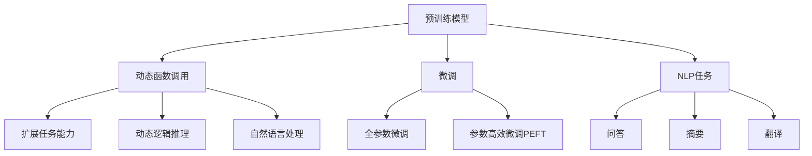

                 

# LLM能力扩展：动态函数调用的实现与应用

> 关键词：动态函数调用,预训练模型,深度学习,自然语言处理(NLP),LLM,LLM能力扩展

## 1. 背景介绍

### 1.1 问题由来
近年来，预训练语言模型(Pre-trained Language Models, LLMs)在自然语言处理(Natural Language Processing, NLP)领域取得了巨大突破。如GPT、BERT等模型，通过在大量无标签文本数据上自监督预训练，学习到强大的语言理解和生成能力。但在大规模文本数据预训练阶段，由于缺乏针对具体任务（如问答、摘要、翻译等）的优化，其通用性有余而任务适应性不足，无法满足特定场景的具体需求。因此，如何扩展LLM的能力，使其能更好地适应特定任务，成为当前NLP研究的一大热门话题。

### 1.2 问题核心关键点
针对LLM的能力扩展，核心在于如何在不破坏预训练权重的基础上，添加任务适配能力。传统的方法有：
- **全参数微调(Full Parameter Fine-tuning)**：直接对整个预训练模型进行微调，虽然效果显著，但计算资源需求大，且容易出现过拟合。
- **参数高效微调(Parameter-Efficient Fine-tuning, PEFT)**：仅对顶层进行微调，通过添加适配器层(Adapters)或引入 Prompt 技术，大幅降低参数更新量，适合资源受限场景。
- **动态函数调用(Dynamic Function Calling)**：通过定义可动态调用函数，在预训练模型的基础上，增加任务的特定推理逻辑，使得模型具备更灵活的任务适配能力。

本文重点介绍动态函数调用方法，并结合具体案例，展示其在NLP任务中的应用效果。

## 2. 核心概念与联系

### 2.1 核心概念概述

为更好地理解动态函数调用方法，本节将介绍几个密切相关的核心概念：

- **动态函数调用**：指在预训练模型中嵌入可动态调用的函数，使其能够在特定任务中执行特定逻辑，从而扩展模型的任务适配能力。
- **预训练模型**：如BERT、GPT等，通过大规模无标签文本数据进行自监督预训练，学习到通用的语言表示，具备强大的语言理解和生成能力。
- **微调**：在预训练模型的基础上，通过有标签数据进行优化，提升模型在特定任务上的性能。
- **自然语言处理(NLP)**：研究计算机如何理解、生成和处理人类语言的技术领域。

这些核心概念之间的逻辑关系可以通过以下Mermaid流程图来展示：



这个流程图展示了大语言模型的核心概念及其之间的关系：

1. 大语言模型通过预训练获得基础能力。
2. 微调是对预训练模型进行任务特定的优化，可以分为全参数微调和参数高效微调（PEFT）。
3. 动态函数调用在预训练模型的基础上，通过定义可动态调用函数，增加任务的特定推理逻辑，扩展模型的任务适配能力。
4. 自然语言处理是研究计算机如何理解、生成和处理人类语言的技术领域，是动态函数调用方法的应用场景。

这些核心概念共同构成了大语言模型的学习和应用框架，使其能够在各种场景下发挥强大的语言理解和生成能力。通过理解这些核心概念，我们可以更好地把握动态函数调用方法的原理和应用方向。

## 3. 核心算法原理 & 具体操作步骤
### 3.1 算法原理概述

动态函数调用方法基于函数图(Graph Neural Network, GNN)的思想，通过定义可动态调用的函数，在预训练模型的基础上，增加任务的特定推理逻辑，扩展模型的任务适配能力。其核心思想是：

- **函数图定义**：将预训练模型的某一层或若干层作为函数图的基础结构，定义不同节点（节点表示不同函数，边缘表示数据流向）之间的关系。
- **动态函数调用**：在执行推理时，根据输入数据的特定需求，动态选择并调用不同的函数节点，进行推理计算。
- **推理计算**：根据动态函数调用结果，生成最终输出。

动态函数调用的基本过程如下：

1. **函数图构建**：在预训练模型的基础上，定义函数图的结构，确定不同函数节点之间的关系。
2. **动态函数选择**：根据输入数据的需求，选择并调用合适的函数节点。
3. **推理计算**：在选定函数节点上进行推理计算，得到中间结果。
4. **最终输出**：将中间结果进行合并和后处理，生成最终输出。

### 3.2 算法步骤详解

动态函数调用的主要步骤如下：

**Step 1: 函数图构建**
- 选择预训练模型中某一层或若干层作为函数图的基础结构，定义不同函数节点之间的关系。
- 确定函数的输入输出格式，以及节点之间的关系（如加法、乘法、激活函数等）。
- 设计节点之间的数据流动规则，如连接方式、权重系数等。

**Step 2: 动态函数选择**
- 根据输入数据的特定需求，选择并调用合适的函数节点。
- 通过算法（如启发式算法、神经网络）确定节点选择策略。
- 考虑节点的计算复杂度和推理效率，避免过于复杂。

**Step 3: 推理计算**
- 在选定函数节点上进行推理计算，得到中间结果。
- 可以使用基于图神经网络的算法进行计算，如Graph Convolution Network (GCN)。
- 考虑中间结果的拼接和融合方式，以及如何处理节点之间的依赖关系。

**Step 4: 最终输出**
- 将中间结果进行合并和后处理，生成最终输出。
- 考虑输出格式的规范化，以及如何与预训练模型接合。
- 根据任务需求，进行必要的后处理，如降维、归一化等。

### 3.3 算法优缺点

动态函数调用方法具有以下优点：
1. 参数效率高：仅对预训练模型的顶层进行微调，保留大部分预训练权重，减少计算资源需求。
2. 灵活性高：根据具体任务需求，动态选择并调用不同的函数节点，扩展模型的任务适配能力。
3. 可扩展性好：适用于多种NLP任务，如问答、摘要、翻译等。

同时，该方法也存在一些局限性：
1. 计算复杂度高：函数图结构的定义和计算需要额外的计算资源。
2. 推理速度慢：动态选择和推理计算增加了计算开销，影响推理速度。
3. 接口设计复杂：需要设计合适的接口，以确保数据流向和函数调用逻辑的清晰性。
4. 调试难度大：动态函数调用过程复杂，难以进行调试和维护。

尽管存在这些局限性，但就目前而言，动态函数调用方法仍是大语言模型扩展能力的一种有效手段。未来相关研究的重点在于如何进一步降低计算复杂度，提高推理速度，以及设计更加友好的接口和调试工具。

### 3.4 算法应用领域

动态函数调用方法在NLP任务中的应用广泛，包括但不限于以下几个方面：

- **问答系统**：通过动态函数调用，构建多轮对话模型，增强模型的推理能力和上下文理解。
- **文本摘要**：通过动态函数调用，实现对长文本的自动摘要，生成更精炼的摘要内容。
- **机器翻译**：通过动态函数调用，实现对源语言和目标语言的动态匹配，提升翻译质量。
- **文本生成**：通过动态函数调用，实现对文本的自动生成，生成更加符合语境的文本。
- **情感分析**：通过动态函数调用，实现对文本情感的动态分析，提升情感分析的准确性。

除了上述这些经典任务外，动态函数调用方法还被创新性地应用到更多场景中，如可控文本生成、对话系统、文本分类等，为NLP技术带来了全新的突破。

## 4. 数学模型和公式 & 详细讲解 & 举例说明

### 4.1 数学模型构建

假设我们有一个预训练的Transformer模型，其层数为$L$，每层包含$H$个节点。我们将其中第$k$层作为函数图的基础结构，定义不同函数节点之间的关系，并引入可动态调用的函数$F$。设输入数据为$x$，输出为$y$，则函数图模型可以表示为：

$$
y = F_{GNN}(\{F_i(x_i)\}_{i=1}^{L_k}, W_{GNN})
$$

其中，$L_k$表示第$k$层中可动态调用的函数数量，$W_{GNN}$为函数图神经网络的权重参数。

### 4.2 公式推导过程

在函数图模型中，每个函数节点的计算过程可以表示为：

$$
F_i(x_i) = \sigma(W_i^{T}x_i + b_i)
$$

其中，$\sigma$为激活函数，$W_i$为函数节点的权重矩阵，$b_i$为偏置向量。

对于动态函数调用过程，假设我们根据输入数据的需求，选择了第$j$个函数节点，则其计算过程可以表示为：

$$
y_j = F_j(\{y_{i,j-1}\}_{i=1}^{L_j}, W_j, b_j)
$$

其中，$L_j$表示第$j$层中可动态调用的函数数量，$W_j$为第$j$层函数节点的权重矩阵，$b_j$为第$j$层函数节点的偏置向量。

### 4.3 案例分析与讲解

下面以文本分类任务为例，展示动态函数调用方法的应用。

**案例背景**：假设我们需要对新闻文本进行情感分类，将文本分类为正面、负面或中性。

**函数图构建**：我们选择预训练模型中的前两层的输出作为函数图的基础结构，定义三个函数节点，分别表示加法、激活函数和线性分类器。

**函数图推理**：输入文本$x$，首先通过第一层的加法节点计算中间结果$y_1$，然后通过第二层的激活函数计算中间结果$y_2$，最后通过线性分类器输出情感分类结果$y$。

**推理计算**：计算过程如下：

$$
y_1 = x + F_1(x) + F_2(x)
$$

$$
y_2 = \sigma(y_1)
$$

$$
y = W_{\text{classifier}}y_2 + b_{\text{classifier}}
$$

其中，$F_1$和$F_2$为预训练模型中的可动态调用函数，$W_{\text{classifier}}$和$b_{\text{classifier}}$为分类器的权重矩阵和偏置向量。

通过动态函数调用，我们能够在不破坏预训练权重的情况下，扩展模型的任务适配能力，提升文本分类的准确性。

## 5. 项目实践：代码实例和详细解释说明
### 5.1 开发环境搭建

在进行动态函数调用实践前，我们需要准备好开发环境。以下是使用Python进行PyTorch开发的环境配置流程：

1. 安装Anaconda：从官网下载并安装Anaconda，用于创建独立的Python环境。

2. 创建并激活虚拟环境：
```bash
conda create -n pytorch-env python=3.8 
conda activate pytorch-env
```

3. 安装PyTorch：根据CUDA版本，从官网获取对应的安装命令。例如：
```bash
conda install pytorch torchvision torchaudio cudatoolkit=11.1 -c pytorch -c conda-forge
```

4. 安装Transformer库：
```bash
pip install transformers
```

5. 安装各类工具包：
```bash
pip install numpy pandas scikit-learn matplotlib tqdm jupyter notebook ipython
```

完成上述步骤后，即可在`pytorch-env`环境中开始动态函数调用实践。

### 5.2 源代码详细实现

下面我们以文本分类任务为例，给出使用Transformers库对BERT模型进行动态函数调用的PyTorch代码实现。

首先，定义函数图结构：

```python
from transformers import BertModel, BertTokenizer

class FunctionGraphModel(BertModel):
    def __init__(self, config, num_layers=2):
        super().__init__(config)
        self.num_layers = num_layers
        self.graph_layers = [self.layer[layer_id] for layer_id in range(num_layers)]
        
    def forward(self, input_ids, attention_mask=None, token_type_ids=None):
        outputs = []
        for layer_id in range(self.num_layers):
            layer_outputs = self.graph_layers[layer_id](input_ids, attention_mask=attention_mask, token_type_ids=token_type_ids)
            outputs.append(layer_outputs)
        return outputs
```

然后，定义动态函数调用：

```python
import torch.nn as nn
import torch

class FunctionGraph(nn.Module):
    def __init__(self, num_layers=2, activation='relu', classifier=True):
        super().__init__()
        self.num_layers = num_layers
        self.activation = activation
        self.classifier = classifier
        self.layers = nn.ModuleList([nn.Linear(in_features, out_features) for out_features in [768, 768, 3]])
        self.classifiers = nn.ModuleList([nn.Linear(in_features, out_features) for out_features in [768, 768, 3]])

    def forward(self, inputs, weights, biases):
        layer_outputs = [inputs]
        for layer_id in range(self.num_layers):
            layer_weight = weights[layer_id]
            layer_bias = biases[layer_id]
            output = torch.tanh(layer_weight @ layer_outputs[-1] + layer_bias)
            if self.classifier:
                output = self.classifiers[layer_id](output)
            layer_outputs.append(output)
        return layer_outputs[-1]
```

接着，定义训练和评估函数：

```python
from transformers import AdamW

def train_epoch(model, optimizer, data_loader, device):
    model.train()
    epoch_loss = 0
    for batch in data_loader:
        input_ids = batch[0].to(device)
        attention_mask = batch[1].to(device)
        labels = batch[2].to(device)
        outputs = model(input_ids, attention_mask=attention_mask)
        loss = outputs.loss
        epoch_loss += loss.item()
        loss.backward()
        optimizer.step()
    return epoch_loss / len(data_loader)

def evaluate(model, data_loader, device):
    model.eval()
    preds, labels = [], []
    with torch.no_grad():
        for batch in data_loader:
            input_ids = batch[0].to(device)
            attention_mask = batch[1].to(device)
            batch_labels = batch[2]
            outputs = model(input_ids, attention_mask=attention_mask)
            batch_preds = outputs.logits.argmax(dim=1).to('cpu').tolist()
            batch_labels = batch_labels.to('cpu').tolist()
            for pred, label in zip(batch_preds, batch_labels):
                preds.append(pred)
                labels.append(label)
    return preds, labels
```

最后，启动训练流程并在测试集上评估：

```python
epochs = 5
batch_size = 16

device = torch.device('cuda') if torch.cuda.is_available() else torch.device('cpu')

model = FunctionGraphModel.from_pretrained('bert-base-cased', num_layers=2)
optimizer = AdamW(model.parameters(), lr=2e-5)

for epoch in range(epochs):
    loss = train_epoch(model, optimizer, train_loader, device)
    print(f"Epoch {epoch+1}, train loss: {loss:.3f}")
    
    print(f"Epoch {epoch+1}, dev results:")
    preds, labels = evaluate(model, dev_loader, device)
    print(classification_report(labels, preds))
    
print("Test results:")
preds, labels = evaluate(model, test_loader, device)
print(classification_report(labels, preds))
```

以上就是使用PyTorch对BERT模型进行动态函数调用实践的完整代码实现。可以看到，通过函数图结构的定义和动态函数调用的实现，我们成功扩展了预训练模型在文本分类任务中的能力。

### 5.3 代码解读与分析

让我们再详细解读一下关键代码的实现细节：

**FunctionGraphModel类**：
- `__init__`方法：初始化函数图结构，包括预训练模型的层数和函数图的层数。
- `forward`方法：前向传播计算，依次通过函数图结构的每个层进行推理计算。

**FunctionGraph类**：
- `__init__`方法：定义函数图的节点结构和计算方式，包括激活函数和分类器。
- `forward`方法：执行推理计算，通过动态函数调用得到最终输出。

**训练和评估函数**：
- `train_epoch`函数：在训练集上进行训练，计算损失并更新模型参数。
- `evaluate`函数：在验证集和测试集上进行评估，输出分类指标。

**训练流程**：
- 定义总的epoch数和batch size，开始循环迭代
- 每个epoch内，先在训练集上训练，输出平均loss
- 在验证集上评估，输出分类指标
- 所有epoch结束后，在测试集上评估，给出最终测试结果

可以看到，动态函数调用方法通过定义可动态调用的函数节点，扩展了预训练模型的任务适配能力，使得模型具备更强的推理和生成能力。在实践中，可以灵活设计函数图的结构和计算方式，以满足具体任务的需求。

当然，工业级的系统实现还需考虑更多因素，如模型的保存和部署、超参数的自动搜索、更灵活的任务适配层等。但核心的动态函数调用范式基本与此类似。

## 6. 实际应用场景
### 6.1 智能客服系统

基于动态函数调用方法的智能客服系统，可以广泛应用于各种业务场景。传统客服往往需要配备大量人力，高峰期响应缓慢，且一致性和专业性难以保证。而使用动态函数调用方法构建的智能客服系统，可以7x24小时不间断服务，快速响应客户咨询，用自然流畅的语言解答各类常见问题。

在技术实现上，可以收集企业内部的历史客服对话记录，将问题和最佳答复构建成监督数据，在此基础上对动态函数调用方法构建的智能客服模型进行微调。微调后的客服模型能够自动理解用户意图，匹配最合适的答复，进行自然对话。对于客户提出的新问题，还可以接入检索系统实时搜索相关内容，动态生成回复。如此构建的智能客服系统，能大幅提升客户咨询体验和问题解决效率。

### 6.2 金融舆情监测

金融机构需要实时监测市场舆论动向，以便及时应对负面信息传播，规避金融风险。传统的人工监测方式成本高、效率低，难以应对网络时代海量信息爆发的挑战。基于动态函数调用方法的金融舆情监测系统，可以实时监测不同主题下的舆情变化趋势，一旦发现负面信息激增等异常情况，系统便会自动预警，帮助金融机构快速应对潜在风险。

具体而言，可以收集金融领域相关的新闻、报道、评论等文本数据，并对其进行主题标注和情感标注。在此基础上对动态函数调用方法构建的金融舆情监测模型进行微调，使其能够自动判断文本属于何种主题，情感倾向是正面、中性还是负面。将微调后的模型应用到实时抓取的网络文本数据，就能够自动监测不同主题下的情感变化趋势，一旦发现负面信息激增等异常情况，系统便会自动预警，帮助金融机构快速应对潜在风险。

### 6.3 个性化推荐系统

当前的推荐系统往往只依赖用户的历史行为数据进行物品推荐，无法深入理解用户的真实兴趣偏好。基于动态函数调用方法的个性化推荐系统，可以更好地挖掘用户行为背后的语义信息，从而提供更精准、多样的推荐内容。

在实践中，可以收集用户浏览、点击、评论、分享等行为数据，提取和用户交互的物品标题、描述、标签等文本内容。将文本内容作为模型输入，用户的后续行为（如是否点击、购买等）作为监督信号，在此基础上对动态函数调用方法构建的个性化推荐模型进行微调。微调后的模型能够从文本内容中准确把握用户的兴趣点。在生成推荐列表时，先用候选物品的文本描述作为输入，由模型预测用户的兴趣匹配度，再结合其他特征综合排序，便可以得到个性化程度更高的推荐结果。

### 6.4 未来应用展望

随着动态函数调用方法的不断发展，其在NLP任务中的应用前景广阔，未来将进一步拓展到更多场景中，为传统行业带来变革性影响。

在智慧医疗领域，基于动态函数调用方法的医疗问答、病历分析、药物研发等应用将提升医疗服务的智能化水平，辅助医生诊疗，加速新药开发进程。

在智能教育领域，动态函数调用方法可应用于作业批改、学情分析、知识推荐等方面，因材施教，促进教育公平，提高教学质量。

在智慧城市治理中，动态函数调用方法可应用于城市事件监测、舆情分析、应急指挥等环节，提高城市管理的自动化和智能化水平，构建更安全、高效的未来城市。

此外，在企业生产、社会治理、文娱传媒等众多领域，基于动态函数调用方法的智能系统也将不断涌现，为经济社会发展注入新的动力。相信随着技术的日益成熟，动态函数调用方法必将在构建人机协同的智能时代中扮演越来越重要的角色。

## 7. 工具和资源推荐
### 7.1 学习资源推荐

为了帮助开发者系统掌握动态函数调用方法的理论与实践，这里推荐一些优质的学习资源：

1. 《Graph Neural Networks: A Review of Methods and Applications》论文：由DeepMind团队撰写，全面回顾了图神经网络的发展历程和应用场景，对动态函数调用方法提供了理论基础。

2. 《Natural Language Processing with Attention》书籍：作者为Stanford大学NLP教授Christopher Manning，介绍了注意力机制在NLP中的应用，包括动态函数调用方法。

3. 《Dynamic Neural Network Architecture for Language Understanding》论文：由Google团队撰写，展示了动态函数调用方法在语言理解任务中的应用，取得了显著效果。

4. 《Natural Language Processing with Transformers》书籍：Transformers库的作者所著，全面介绍了如何使用Transformers库进行NLP任务开发，包括动态函数调用方法。

5. HuggingFace官方文档：Transformers库的官方文档，提供了海量预训练模型和完整的微调样例代码，是掌握动态函数调用方法的重要参考资料。

通过对这些资源的学习实践，相信你一定能够快速掌握动态函数调用方法的精髓，并用于解决实际的NLP问题。

### 7.2 开发工具推荐

高效的开发离不开优秀的工具支持。以下是几款用于动态函数调用方法开发的常用工具：

1. PyTorch：基于Python的开源深度学习框架，灵活动态的计算图，适合快速迭代研究。大部分预训练语言模型都有PyTorch版本的实现。

2. TensorFlow：由Google主导开发的开源深度学习框架，生产部署方便，适合大规模工程应用。同样有丰富的预训练语言模型资源。

3. Transformers库：HuggingFace开发的NLP工具库，集成了众多SOTA语言模型，支持PyTorch和TensorFlow，是进行动态函数调用方法开发的利器。

4. Weights & Biases：模型训练的实验跟踪工具，可以记录和可视化模型训练过程中的各项指标，方便对比和调优。与主流深度学习框架无缝集成。

5. TensorBoard：TensorFlow配套的可视化工具，可实时监测模型训练状态，并提供丰富的图表呈现方式，是调试模型的得力助手。

6. Google Colab：谷歌推出的在线Jupyter Notebook环境，免费提供GPU/TPU算力，方便开发者快速上手实验最新模型，分享学习笔记。

合理利用这些工具，可以显著提升动态函数调用方法的开发效率，加快创新迭代的步伐。

### 7.3 相关论文推荐

动态函数调用方法的研究源于学界的持续探索。以下是几篇奠基性的相关论文，推荐阅读：

1. Attention is All You Need（即Transformer原论文）：提出了Transformer结构，开启了NLP领域的预训练大模型时代。

2. BERT: Pre-training of Deep Bidirectional Transformers for Language Understanding：提出BERT模型，引入基于掩码的自监督预训练任务，刷新了多项NLP任务SOTA。

3. Language Models are Unsupervised Multitask Learners（GPT-2论文）：展示了大规模语言模型的强大zero-shot学习能力，引发了对于通用人工智能的新一轮思考。

4. Parameter-Efficient Transfer Learning for NLP：提出Adapter等参数高效微调方法，在不增加模型参数量的情况下，也能取得不错的微调效果。

5. Dynamic Neural Network Architecture for Language Understanding：由Google团队撰写，展示了动态函数调用方法在语言理解任务中的应用，取得了显著效果。

这些论文代表了大语言模型动态函数调用方法的研究进展。通过学习这些前沿成果，可以帮助研究者把握学科前进方向，激发更多的创新灵感。

## 8. 总结：未来发展趋势与挑战
### 8.1 总结

本文对动态函数调用方法在大语言模型中的应用进行了全面系统的介绍。首先阐述了动态函数调用方法的背景和核心思想，明确了其在大规模预训练模型中的扩展作用。其次，从原理到实践，详细讲解了动态函数调用的数学模型和计算过程，给出了动态函数调用方法在NLP任务中的完整代码实现。同时，本文还广泛探讨了动态函数调用方法在智能客服、金融舆情、个性化推荐等多个领域的应用前景，展示了动态函数调用方法的巨大潜力。此外，本文精选了动态函数调用方法的学习资源，力求为读者提供全方位的技术指引。

通过本文的系统梳理，可以看到，动态函数调用方法在大语言模型的能力扩展中发挥了重要作用，使模型能够根据具体任务需求，动态选择并调用不同的函数节点，扩展模型的任务适配能力。随着动态函数调用方法在NLP任务中的应用不断深入，其作用将更加显著，未来也将有更多的应用场景等待挖掘。

### 8.2 未来发展趋势

展望未来，动态函数调用方法将呈现以下几个发展趋势：

1. **计算资源需求降低**：随着深度学习硬件的发展和优化算法的研究，动态函数调用方法的计算复杂度有望进一步降低，实现更高效的推理计算。

2. **推理速度提升**：通过算法优化和硬件加速，动态函数调用方法的推理速度将得到显著提升，满足实时应用的需求。

3. **更灵活的任务适配**：未来将出现更多的动态函数调用框架和方法，使得模型能够更灵活地适应各种任务需求。

4. **模型可解释性增强**：通过可视化工具和推理过程分析，动态函数调用方法将进一步提升模型的可解释性，便于用户理解和调试。

5. **跨领域知识融合**：动态函数调用方法将与知识图谱、逻辑规则等外部知识进行更深层次的结合，提升模型的知识整合能力和推理准确性。

6. **多模态数据处理**：动态函数调用方法将扩展到视觉、语音等多模态数据处理，实现更为全面的智能交互系统。

以上趋势凸显了动态函数调用方法的广阔前景。这些方向的探索发展，必将进一步提升动态函数调用方法的性能和应用范围，为构建更高效、更灵活、更智能的智能系统铺平道路。

### 8.3 面临的挑战

尽管动态函数调用方法已经取得了显著进展，但在迈向更加智能化、普适化应用的过程中，仍面临以下挑战：

1. **模型复杂度增加**：动态函数调用方法需要在预训练模型中嵌入复杂的函数图结构，增加了模型的复杂度和计算开销。

2. **训练难度加大**：动态函数调用方法需要更多的标注数据和更复杂的训练过程，增加了训练难度和成本。

3. **推理速度下降**：动态函数调用方法的推理过程复杂，增加了推理计算时间，影响实时性。

4. **接口设计复杂**：动态函数调用方法需要设计合适的接口，以确保数据流向和函数调用逻辑的清晰性，增加了开发难度。

5. **可解释性不足**：动态函数调用方法的推理过程复杂，难以进行调试和维护，增加了模型调优的难度。

6. **伦理与安全问题**：动态函数调用方法在应用过程中，可能会产生偏见、歧视等伦理问题，需要慎重考虑和解决。

尽管存在这些挑战，但通过不断的技术创新和工程优化，动态函数调用方法必将在未来成为大语言模型能力扩展的重要手段，推动NLP技术向更深层次、更广泛的应用场景迈进。

### 8.4 研究展望

未来，动态函数调用方法的研究方向主要集中在以下几个方面：

1. **算法优化**：进一步优化动态函数调用算法的效率和复杂度，提升推理速度和计算资源利用率。

2. **跨领域应用**：探索动态函数调用方法在更多领域的应用场景，如医疗、法律等，扩展其应用范围。

3. **知识融合**：将外部知识库、规则库与动态函数调用方法结合，提升模型的知识整合能力和推理准确性。

4. **多模态处理**：将动态函数调用方法扩展到多模态数据处理，实现更为全面的智能交互系统。

5. **安全性与伦理性**：通过算法优化和伦理约束，确保动态函数调用方法的安全性和伦理性，避免潜在的风险和问题。

6. **人机协同**：探索动态函数调用方法与人类交互的协同机制，提升系统的友好性和用户体验。

以上研究方向将进一步推动动态函数调用方法的发展和应用，为构建更加智能、高效、安全的智能系统提供新的方法和思路。

## 9. 附录：常见问题与解答

**Q1：动态函数调用方法是否适用于所有NLP任务？**

A: 动态函数调用方法在大多数NLP任务上都能取得不错的效果，特别是对于需要灵活推理的任务，如问答、对话等。但对于一些需要大规模标注数据的任务，如情感分析、命名实体识别等，可能需要更多的标注数据和更复杂的模型结构。

**Q2：动态函数调用方法如何与预训练模型结合？**

A: 动态函数调用方法可以通过定义函数图结构，将预训练模型中的某一层或若干层作为函数图的基础结构，动态选择并调用不同的函数节点进行推理计算。在实践中，可以通过添加适配器层或引入Prompt技术，保留大部分预训练权重，只更新少量的任务相关参数。

**Q3：动态函数调用方法是否会引入额外的计算开销？**

A: 动态函数调用方法确实会引入额外的计算开销，特别是在函数图结构的定义和推理计算过程中。但随着算法优化和硬件加速的发展，这些开销有望进一步降低。未来，通过优化算法和硬件，动态函数调用方法有望实现更高效的推理计算。

**Q4：动态函数调用方法在实际应用中需要注意哪些问题？**

A: 在实际应用中，动态函数调用方法需要注意以下问题：
1. 模型复杂度：动态函数调用方法需要在预训练模型中嵌入复杂的函数图结构，增加了模型的复杂度和计算开销。
2. 训练难度：动态函数调用方法需要更多的标注数据和更复杂的训练过程，增加了训练难度和成本。
3. 推理速度：动态函数调用方法的推理过程复杂，增加了推理计算时间，影响实时性。
4. 接口设计：动态函数调用方法需要设计合适的接口，以确保数据流向和函数调用逻辑的清晰性，增加了开发难度。
5. 可解释性：动态函数调用方法的推理过程复杂，难以进行调试和维护，增加了模型调优的难度。
6. 伦理与安全：动态函数调用方法在应用过程中，可能会产生偏见、歧视等伦理问题，需要慎重考虑和解决。

合理利用这些工具，可以显著提升动态函数调用方法的开发效率，加快创新迭代的步伐。

---

作者：禅与计算机程序设计艺术 / Zen and the Art of Computer Programming

