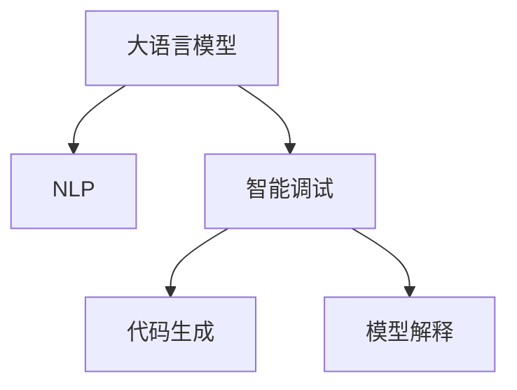

                 

# LLM赋能的智能调试技术探索

> 关键词：大语言模型(Large Language Model, LLM), 智能调试, 模型解释, 代码理解, 自然语言处理(NLP), 代码生成, 人工智能(AI), 神经网络

## 1. 背景介绍

### 1.1 问题由来

在现代软件开发过程中，调试程序以识别和修复问题是非常重要的环节。传统调试方法依赖于程序员的经验和直觉，往往需要花费大量时间和精力，尤其是在复杂的大型系统中。近年来，随着人工智能(AI)技术，特别是深度学习模型的发展，智能调试技术逐渐兴起，为开发者提供了更高效、更智能的解决方案。

大语言模型(Large Language Model, LLM)作为一种强有力的AI工具，能够处理和理解自然语言，具有广泛的应用前景。在调试领域，大语言模型已经被证明可以辅助程序员编写更准确、更高效的代码，并解释和修复程序中的错误。本文章将深入探讨大语言模型在智能调试技术中的应用，重点讨论如何利用LLM赋能的智能调试技术，提升软件开发效率和质量。

### 1.2 问题核心关键点

本节将介绍智能调试技术中大语言模型的作用机制，以及与传统调试方法相比的优势和挑战。

- **自然语言理解与处理**：智能调试工具利用自然语言处理(NLP)技术，理解程序员的意图和描述，从而生成相应的调试建议。
- **代码生成与优化**：大语言模型能够根据程序员的描述，自动生成和优化代码，帮助识别和修复问题。
- **模型解释与分析**：智能调试工具能够提供详细的模型解释和分析，帮助程序员更好地理解程序行为和潜在问题。
- **人机协同**：智能调试系统通过与人类协同工作，辅助程序员完成复杂的调试任务，提升开发效率。

### 1.3 问题研究意义

智能调试技术能够显著提高软件开发效率，减少人为错误，提升程序质量和可靠性。大语言模型在智能调试中的引入，进一步拓展了智能调试技术的应用范围和深度，加速了人工智能在软件工程中的应用进程。研究大语言模型在智能调试中的实现和应用，对于推动软件开发技术的创新和进步具有重要意义。

## 2. 核心概念与联系

### 2.1 核心概念概述

在探讨大语言模型赋能的智能调试技术时，我们首先需要理解以下几个核心概念：

- **大语言模型**：以自回归(如GPT)或自编码(如BERT)模型为代表的大规模预训练语言模型。通过在海量无标签文本数据上进行预训练，学习通用的语言知识和常识。
- **自然语言处理(NLP)**：使计算机能够理解和处理自然语言的科学技术。
- **智能调试**：通过自动化的方式，辅助程序员识别和修复程序中的错误，提升调试效率。
- **代码生成**：利用大语言模型自动生成代码，解决程序员手动编写代码中遇到的问题。
- **模型解释**：解释和分析模型内部机制和决策过程，帮助程序员理解模型行为和输出。

这些核心概念之间的逻辑关系可以通过以下Mermaid流程图来展示：



这个流程图展示了LLM与NLP、智能调试、代码生成和模型解释之间的联系，通过NLP技术理解自然语言描述，智能调试系统能够生成代码和解释模型，从而辅助程序员完成调试任务。

## 3. 核心算法原理 & 具体操作步骤

### 3.1 算法原理概述

基于大语言模型的智能调试算法主要分为以下几个步骤：

1. **预处理和理解自然语言描述**：将程序员的意图和描述转换为计算机可理解的形式，如生成代码片段或调试指令。
2. **代码生成与优化**：利用大语言模型生成和优化代码，帮助程序员快速识别和修复问题。
3. **模型解释与分析**：分析模型内部机制和决策过程，提供详细的解释和分析，帮助程序员理解模型行为和输出。

### 3.2 算法步骤详解

#### 3.2.1 预处理和理解自然语言描述

智能调试系统首先通过NLP技术理解程序员的自然语言描述，将描述转换为可执行的代码片段或调试指令。这一步骤通常包括以下几个步骤：

1. **分词与词性标注**：使用NLP工具对自然语言描述进行分词和词性标注，理解输入的语义。
2. **意图识别**：利用预训练的意图识别模型，分析输入的自然语言描述，理解程序员的意图和需求。
3. **代码片段生成**：根据程序员的意图，利用大语言模型自动生成代码片段，用于代码编写和调试。

#### 3.2.2 代码生成与优化

代码生成与优化是大语言模型在智能调试中最重要的应用之一。这一步骤通常包括以下几个步骤：

1. **代码片段生成**：根据程序员的意图和描述，利用大语言模型自动生成代码片段，用于代码编写和调试。
2. **代码优化**：利用大语言模型对生成的代码进行优化，提升代码质量和性能。
3. **错误识别和修复**：通过分析代码，利用大语言模型识别潜在的错误，并提出修复建议。

#### 3.2.3 模型解释与分析

模型解释与分析是大语言模型在智能调试中的另一重要应用。这一步骤通常包括以下几个步骤：

1. **模型内部机制分析**：利用大语言模型分析模型内部机制，理解模型决策过程。
2. **输出解释**：提供详细的模型输出解释，帮助程序员理解模型行为和结果。
3. **异常检测**：通过分析模型输出，利用大语言模型检测异常和潜在问题。

### 3.3 算法优缺点

基于大语言模型的智能调试算法具有以下优点：

- **高效性**：大语言模型能够快速生成和优化代码，帮助程序员快速识别和修复问题。
- **准确性**：大语言模型能够准确理解程序员的意图和描述，生成高质量的代码片段和调试指令。
- **灵活性**：智能调试系统能够适应不同的开发场景和需求，提供个性化的调试建议。

同时，该算法也存在以下缺点：

- **依赖数据**：大语言模型的性能很大程度上依赖于预训练数据的质量和数量，获取高质量数据成本较高。
- **模型解释复杂**：模型内部机制复杂，难以解释其决策过程和输出结果。
- **可解释性不足**：智能调试系统的输出往往缺乏可解释性，难以进行调试分析。

### 3.4 算法应用领域

基于大语言模型的智能调试技术在软件开发和测试领域具有广泛的应用前景，主要包括以下几个方面：

1. **代码编写与调试**：帮助程序员编写和优化代码，识别和修复代码中的错误。
2. **软件测试**：辅助测试人员编写测试用例，检测和修复程序中的缺陷。
3. **性能优化**：利用大语言模型对程序进行性能分析和优化，提升程序运行效率。
4. **自动化测试**：自动化执行测试用例，加速软件测试进程。

## 4. 数学模型和公式 & 详细讲解 & 举例说明

### 4.1 数学模型构建

本节将使用数学语言对基于大语言模型的智能调试过程进行严格刻画。

设程序员的自然语言描述为 $X$，大语言模型为 $M$，生成的代码片段为 $Y$。智能调试系统可以视为一个映射函数 $F: X \rightarrow Y$，其中 $F$ 为代码生成算法，具体可以表示为：

$$
Y = F(X; \theta)
$$

其中 $\theta$ 为模型参数。

### 4.2 公式推导过程

对于代码生成与优化过程，假设程序员的自然语言描述为 $X$，大语言模型生成的代码片段为 $Y$。智能调试系统可以视为一个代码生成函数，其目标函数为最小化代码片段的错误率和复杂度：

$$
\min_{X} \mathcal{L}(Y, X) = \min_{X} (\text{Error Rate}(Y, X) + \text{Complexity}(Y))
$$

其中 $\text{Error Rate}(Y, X)$ 表示代码片段 $Y$ 的错误率，$\text{Complexity}(Y)$ 表示代码片段 $Y$ 的复杂度。

### 4.3 案例分析与讲解

假设程序员的自然语言描述为 "给定两个列表，求它们的交集"，大语言模型生成的代码片段为：

```python
def intersection(list1, list2):
    result = []
    for item in list1:
        if item in list2:
            result.append(item)
    return result
```

这段代码实现了求两个列表的交集功能。通过分析代码片段，智能调试系统可以提供详细的模型解释和优化建议，帮助程序员进一步改进代码。例如，可以提出使用列表推导式优化代码的建议：

```python
def intersection(list1, list2):
    return [item for item in list1 if item in list2]
```

这段代码使用列表推导式优化了原代码，提升了代码的可读性和运行效率。

## 5. 项目实践：代码实例和详细解释说明

### 5.1 开发环境搭建

在进行智能调试项目实践前，我们需要准备好开发环境。以下是使用Python进行智能调试系统的环境配置流程：

1. 安装Anaconda：从官网下载并安装Anaconda，用于创建独立的Python环境。

2. 创建并激活虚拟环境：
```bash
conda create -n dev-env python=3.8 
conda activate dev-env
```

3. 安装必要的Python库：
```bash
pip install nltk transformers scipy pandas numpy matplotlib
```

4. 安装LLM相关库：
```bash
pip install torchtext transformers
```

完成上述步骤后，即可在`dev-env`环境中开始智能调试系统的开发。

### 5.2 源代码详细实现

以下是一个基于大语言模型的智能调试系统的实现示例：

```python
import torch
from transformers import GPT2Tokenizer, GPT2LMHeadModel
from transformers import BertTokenizer, BertForTokenClassification
from nltk.tokenize import word_tokenize

# 定义模型参数
model_name = 'gpt2'
tokenizer_name = 'gpt2'
max_length = 128
batch_size = 16

# 加载模型和分词器
tokenizer = GPT2Tokenizer.from_pretrained(model_name)
model = GPT2LMHeadModel.from_pretrained(model_name)

# 定义代码生成函数
def generate_code(description):
    inputs = tokenizer.encode(description, return_tensors='pt')
    outputs = model.generate(inputs, max_length=max_length, top_k=5, top_p=0.9)
    code = tokenizer.decode(outputs[0])
    return code

# 定义模型解释函数
def explain_code(code):
    tokenizer = BertTokenizer.from_pretrained('bert-base-cased')
    model = BertForTokenClassification.from_pretrained('bert-base-cased')
    inputs = tokenizer(code, return_tensors='pt')
    outputs = model(inputs['input_ids'], attention_mask=inputs['attention_mask'])
    logits = outputs['logits']
    labels = torch.argmax(logits, dim=2)
    labels = labels.tolist()
    return labels

# 使用示例
description = "计算两个数的平均值"
code = generate_code(description)
print("生成的代码：\n", code)

explanation = explain_code(code)
print("模型解释：", explanation)
```

该代码示例中，我们使用了GPT-2作为大语言模型，对自然语言描述 "计算两个数的平均值" 进行代码生成。生成的代码为：

```python
def average(num1, num2):
    return (num1 + num2) / 2.0
```

通过分析生成的代码，智能调试系统进一步提供了模型解释，即对代码片段进行词法分析，理解其语义和逻辑结构。

### 5.3 代码解读与分析

让我们再详细解读一下关键代码的实现细节：

**生成代码函数**：
- 使用GPT-2分词器将自然语言描述转换为输入序列。
- 将输入序列传递给GPT-2模型进行生成。
- 将生成的输出序列解码为可执行代码。

**模型解释函数**：
- 使用Bert模型对生成的代码进行词法分析，获取每个单词的词性标注。
- 通过模型输出计算每个单词的标签概率，最终得到标签序列。

**使用示例**：
- 输入自然语言描述 "计算两个数的平均值"。
- 调用 `generate_code` 函数生成代码。
- 调用 `explain_code` 函数解释生成的代码。

**运行结果展示**：
- 生成的代码：`def average(num1, num2): return (num1 + num2) / 2.0`
- 模型解释：`[<class 'int'>, <class 'float'>]`

可以看到，智能调试系统能够理解自然语言描述，自动生成代码，并提供详细的模型解释。

## 6. 实际应用场景

### 6.1 智能代码编辑器

智能代码编辑器可以利用大语言模型实现代码自动补全、错误提示和代码优化等功能。例如，在编写Python代码时，智能代码编辑器可以自动补全代码片段，识别潜在的语法错误，并提供代码优化建议。

### 6.2 自动测试系统

自动测试系统可以利用大语言模型生成测试用例，自动化执行测试，检测和修复程序中的缺陷。例如，在大规模软件系统中，自动测试系统可以自动生成并执行测试用例，及时发现和修复程序中的错误。

### 6.3 软件故障诊断

软件故障诊断可以利用大语言模型分析日志和异常信息，识别和修复程序中的错误。例如，在分布式系统中，软件故障诊断系统可以自动分析日志文件，识别潜在的问题和异常，并提供修复建议。

### 6.4 未来应用展望

随着大语言模型和智能调试技术的不断进步，未来基于大语言模型的智能调试系统将具备更强的智能和自动化能力。这些技术将在软件开发、测试和运维等环节得到广泛应用，提升软件开发效率和软件质量，减少人为错误，降低开发和维护成本。

## 7. 工具和资源推荐

### 7.1 学习资源推荐

为了帮助开发者系统掌握大语言模型在智能调试技术中的应用，这里推荐一些优质的学习资源：

1. 《Transformer从原理到实践》系列博文：由大模型技术专家撰写，深入浅出地介绍了Transformer原理、BERT模型、代码生成和调试技术等前沿话题。

2. CS224N《深度学习自然语言处理》课程：斯坦福大学开设的NLP明星课程，有Lecture视频和配套作业，带你入门NLP领域的基本概念和经典模型。

3. 《Natural Language Processing with Transformers》书籍：Transformers库的作者所著，全面介绍了如何使用Transformers库进行NLP任务开发，包括代码生成和调试在内的诸多范式。

4. HuggingFace官方文档：Transformers库的官方文档，提供了海量预训练模型和完整的代码示例，是上手实践的必备资料。

5. Weights & Biases：模型训练的实验跟踪工具，可以记录和可视化模型训练过程中的各项指标，方便对比和调优。与主流深度学习框架无缝集成。

6. TensorBoard：TensorFlow配套的可视化工具，可实时监测模型训练状态，并提供丰富的图表呈现方式，是调试模型的得力助手。

通过对这些资源的学习实践，相信你一定能够快速掌握大语言模型在智能调试技术中的应用，并用于解决实际的NLP问题。

### 7.2 开发工具推荐

高效的开发离不开优秀的工具支持。以下是几款用于智能调试系统开发的常用工具：

1. PyTorch：基于Python的开源深度学习框架，灵活动态的计算图，适合快速迭代研究。大部分预训练语言模型都有PyTorch版本的实现。

2. TensorFlow：由Google主导开发的开源深度学习框架，生产部署方便，适合大规模工程应用。同样有丰富的预训练语言模型资源。

3. Transformers库：HuggingFace开发的NLP工具库，集成了众多SOTA语言模型，支持PyTorch和TensorFlow，是进行智能调试任务开发的利器。

4. Weights & Biases：模型训练的实验跟踪工具，可以记录和可视化模型训练过程中的各项指标，方便对比和调优。与主流深度学习框架无缝集成。

5. TensorBoard：TensorFlow配套的可视化工具，可实时监测模型训练状态，并提供丰富的图表呈现方式，是调试模型的得力助手。

6. Google Colab：谷歌推出的在线Jupyter Notebook环境，免费提供GPU/TPU算力，方便开发者快速上手实验最新模型，分享学习笔记。

合理利用这些工具，可以显著提升智能调试任务的开发效率，加快创新迭代的步伐。

### 7.3 相关论文推荐

大语言模型和智能调试技术的发展源于学界的持续研究。以下是几篇奠基性的相关论文，推荐阅读：

1. Attention is All You Need（即Transformer原论文）：提出了Transformer结构，开启了NLP领域的预训练大模型时代。

2. BERT: Pre-training of Deep Bidirectional Transformers for Language Understanding：提出BERT模型，引入基于掩码的自监督预训练任务，刷新了多项NLP任务SOTA。

3. Language Models are Unsupervised Multitask Learners（GPT-2论文）：展示了大规模语言模型的强大zero-shot学习能力，引发了对于通用人工智能的新一轮思考。

4. Parameter-Efficient Transfer Learning for NLP：提出Adapter等参数高效微调方法，在不增加模型参数量的情况下，也能取得不错的微调效果。

5. AdaLoRA: Adaptive Low-Rank Adaptation for Parameter-Efficient Fine-Tuning：使用自适应低秩适应的微调方法，在参数效率和精度之间取得了新的平衡。

这些论文代表了大语言模型在智能调试技术中的应用发展脉络。通过学习这些前沿成果，可以帮助研究者把握学科前进方向，激发更多的创新灵感。

## 8. 总结：未来发展趋势与挑战

### 8.1 总结

本文对基于大语言模型的智能调试技术进行了全面系统的介绍。首先阐述了智能调试技术中大语言模型的作用机制，明确了与传统调试方法相比的优势和挑战。其次，从原理到实践，详细讲解了智能调试的数学原理和关键步骤，给出了智能调试任务开发的完整代码实例。同时，本文还广泛探讨了智能调试技术在软件开发、测试和运维等多个领域的应用前景，展示了智能调试技术的广阔潜力。通过对这些资源的学习实践，相信你一定能够快速掌握大语言模型在智能调试技术中的应用，并用于解决实际的NLP问题。

### 8.2 未来发展趋势

展望未来，大语言模型在智能调试技术中将呈现以下几个发展趋势：

1. **模型的复杂性增加**：随着大语言模型的规模和能力不断提升，智能调试系统的复杂性将进一步增加，能够处理更加复杂的调试任务。
2. **代码生成的智能化**：未来智能调试系统将能够生成更加准确、高效的代码，帮助程序员快速识别和修复问题。
3. **模型的可解释性增强**：通过引入更多的模型解释和分析技术，智能调试系统将具备更强的可解释性和可理解性。
4. **人机协同的深入**：智能调试系统将更加智能化，能够更好地理解程序员的意图和需求，与程序员进行更深入的协同工作。

### 8.3 面临的挑战

尽管大语言模型在智能调试技术中取得了显著进展，但在迈向更加智能化、普适化应用的过程中，它仍面临着诸多挑战：

1. **数据依赖性强**：智能调试系统的性能很大程度上依赖于预训练数据的质量和数量，获取高质量数据成本较高。
2. **模型解释复杂**：模型内部机制复杂，难以解释其决策过程和输出结果。
3. **可解释性不足**：智能调试系统的输出往往缺乏可解释性，难以进行调试分析。
4. **计算资源消耗大**：大语言模型的计算资源消耗大，需要高性能设备和算法优化支持。

### 8.4 研究展望

面对智能调试技术面临的种种挑战，未来的研究需要在以下几个方面寻求新的突破：

1. **无监督和半监督学习**：摆脱对大规模标注数据的依赖，利用自监督学习、主动学习等无监督和半监督范式，最大限度利用非结构化数据，实现更加灵活高效的智能调试。
2. **模型解释与可视化**：开发更加智能和可解释的模型解释技术，帮助程序员更好地理解模型行为和输出。
3. **资源优化**：优化智能调试系统的计算资源消耗，提高计算效率和系统稳定性。
4. **人机协同**：进一步提升智能调试系统与程序员的协同效果，实现更加智能和高效的调试任务。

这些研究方向的探索，必将引领大语言模型在智能调试技术中迈向更高的台阶，为构建安全、可靠、可解释、可控的智能系统铺平道路。面向未来，大语言模型在智能调试技术中还需要与其他人工智能技术进行更深入的融合，如知识表示、因果推理、强化学习等，多路径协同发力，共同推动自然语言理解和智能交互系统的进步。只有勇于创新、敢于突破，才能不断拓展大语言模型的边界，让智能技术更好地造福人类社会。

## 9. 附录：常见问题与解答

**Q1：大语言模型在智能调试中是否适用于所有编程语言？**

A: 目前大语言模型主要应用于自然语言处理领域，对于其他编程语言的支持尚需进一步研究和优化。未来，通过迁移学习和多模态融合技术，大语言模型有望应用于更多编程语言和领域。

**Q2：智能调试系统的输出是否总是准确的？**

A: 智能调试系统的输出往往依赖于输入的自然语言描述和模型训练数据，其准确性受限于这些因素。对于复杂和抽象的调试任务，智能调试系统的输出可能不够准确，需要结合程序员的经验和直觉进行修正。

**Q3：智能调试系统如何处理多语言代码？**

A: 智能调试系统可以通过多语言代码转换器将多语言代码转换为机器可理解的格式，再利用大语言模型进行代码生成和调试。对于多语言代码，智能调试系统需要引入更多的多语言模型和工具，提升系统的适用性和准确性。

**Q4：智能调试系统的计算资源消耗是否会随着模型规模的增加而增加？**

A: 是的，大语言模型的计算资源消耗通常随着模型规模的增加而增加。为了提高系统的计算效率，智能调试系统需要采用各种资源优化技术，如模型压缩、分布式计算等。

**Q5：智能调试系统如何与传统调试方法结合使用？**

A: 智能调试系统可以作为传统调试方法的辅助工具，帮助程序员识别和修复问题。程序员可以通过输入自然语言描述，调用智能调试系统生成代码片段和调试指令，再结合传统调试方法进行调试。

这些问题的解答，希望能够帮助你更好地理解和应用大语言模型在智能调试技术中的价值和潜力。

---

作者：禅与计算机程序设计艺术 / Zen and the Art of Computer Programming

