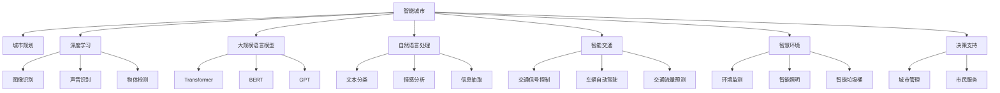
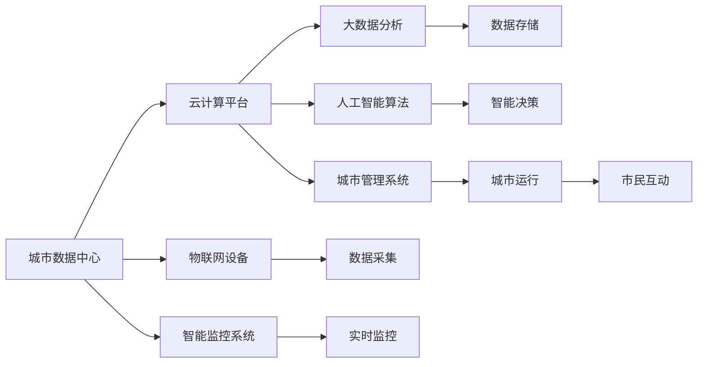

                 

# LLM驱动的智能城市：未来urban planning的新范式

> 关键词：智能城市, 城市规划, 大数据, 深度学习, 自然语言处理, 智能交通, 智慧环境

## 1. 背景介绍

### 1.1 问题由来

当前，城市化进程已经进入加速期，全球范围内的城市人口持续增长，带来了交通拥堵、环境污染、资源紧张等一系列问题。这些问题不仅影响了市民的日常生活质量，也对城市的长期可持续发展构成了严峻挑战。

为解决这些问题，世界各国在城市规划和管理中，纷纷引入智能科技手段，通过物联网、大数据、人工智能等技术，打造智慧城市，提高城市管理的科学性和智能化水平。然而，智慧城市建设涉及面广、需求复杂，传统的城市规划和管理方法已难以适应新形势下的需求。

近年来，随着深度学习和大规模语言模型(Large Language Model, LLM)的发展，基于自然语言处理(Natural Language Processing, NLP)的智能系统开始崭露头角。LLM作为新一代人工智能技术的重要代表，具备强大的自然语言理解和生成能力，能够有效支撑智慧城市的各项应用需求。

### 1.2 问题核心关键点

智能城市建设中的主要问题包括：

- 城市规划和管理的复杂性。城市规划涉及交通、医疗、教育、环境等众多领域，数据量庞大且类型多样，难以全面覆盖。
- 城市数据的质量和完整性问题。城市数据的采集和处理质量直接影响到智慧城市建设的成功与否。
- 数据驱动的决策支持需求。城市管理中需要大量的数据支撑决策，而数据的获取和分析需要高效便捷的方法。
- 用户对智能城市服务的接受度。如何提高市民对智慧城市服务的感知和使用率，是推广智能城市应用的重要挑战。

解决这些问题，LLM提供了强有力的技术手段，能从海量城市数据中提取有价值的信息，并生成符合用户需求的智能决策。本文将系统阐述LLM在智能城市规划和管理中的应用，探索智能城市建设的新范式。

## 2. 核心概念与联系

### 2.1 核心概念概述

为更好地理解LLM在智能城市中的应用，本节将介绍几个关键概念：

- 智能城市(Smart City)：通过综合利用新一代信息通信技术，全面感知、实时分析和智能调度城市运行的各项要素，实现城市管理智能化。
- 城市规划(Urban Planning)：在城市发展过程中，对土地使用、空间布局、交通设施等进行的综合设计和调整。
- 深度学习(Deep Learning)：一种基于多层神经网络的机器学习算法，具有自我学习能力，广泛应用于模式识别、图像处理、自然语言处理等领域。
- 大规模语言模型(LLM)：以Transformer结构为代表的大规模预训练语言模型，具备强大的自然语言理解和生成能力。
- 自然语言处理(NLP)：使用计算机科学和人工智能方法，实现对自然语言数据的处理和分析。
- 智能交通(Smart Traffic)：利用智能科技手段，提高交通系统的运行效率和安全性，减少交通拥堵和事故。
- 智慧环境(Smart Environment)：通过智能传感器和数据分析，实现对城市环境的实时监测和调控，提升环境质量和居民满意度。

这些概念之间存在密切的联系，共同构成了智能城市规划和管理的技术框架。以下通过一个Mermaid流程图展示这些概念之间的联系：



### 2.2 核心概念原理和架构

#### 2.2.1 智能城市

智能城市通过以下架构实现其各项功能：



- **城市数据中心**：集中存储和管理城市各领域的数据，为智慧城市运行提供数据支撑。
- **云计算平台**：提供高效、弹性的计算资源，支持大数据分析和人工智能模型的训练与推理。
- **物联网设备**：通过传感器、标签等设备采集城市运行的各种数据。
- **智能监控系统**：利用摄像头、雷达等设备，实时监测城市运行状态。
- **大数据分析**：从海量城市数据中提取规律和模式，为决策提供支持。
- **人工智能算法**：使用深度学习和自然语言处理等技术，优化城市管理的各个环节。
- **城市管理系统**：利用各种智能化手段，管理和调度城市运行的各项要素。
- **市民互动**：通过智能APP等工具，提供市民参与城市管理和服务的功能。

#### 2.2.2 深度学习

深度学习是一种基于多层神经网络的机器学习算法，通过多层次的特征提取和模型训练，实现对复杂数据的处理和分析。其核心架构包括输入层、隐藏层和输出层，各层之间的权重和偏置通过反向传播算法进行训练和优化。

#### 2.2.3 大规模语言模型(LLM)

LLM是一种预训练语言模型，通过在大规模无标签文本数据上进行自监督学习，学习到丰富的语言知识和表达能力。常见的LLM包括BERT、GPT、T5等，其核心结构为Transformer。

Transformer由注意力机制和编码解码器组成，通过多头自注意力机制实现对输入序列的并行处理。其结构示意图如下：


#### 2.2.4 自然语言处理(NLP)

NLP使用计算机科学和人工智能方法，实现对自然语言数据的处理和分析。常见的NLP任务包括文本分类、情感分析、信息抽取、机器翻译等。NLP处理的核心在于将自然语言转化为机器可理解的向量表示，并利用算法进行分析和理解。

## 3. 核心算法原理 & 具体操作步骤

### 3.1 算法原理概述

基于LLM的智能城市应用，主要涉及以下算法原理：

- 城市数据分析：利用大数据分析技术，从城市各领域的数据中提取有用的信息，为城市管理提供数据支持。
- 智能决策支持：通过深度学习和自然语言处理技术，构建智能决策支持系统，辅助城市管理者做出科学合理的决策。
- 智能交通系统：利用LLM生成自然语言指令，控制交通信号灯、调度车辆行驶，提升交通效率和安全性。
- 智慧环境监测：通过智能传感器和LLM进行数据处理，实时监测城市环境状态，并生成预警信息。

### 3.2 算法步骤详解

#### 3.2.1 城市数据分析

**步骤1: 数据采集**
- 从城市各领域的数据源中，收集城市运行相关的各类数据，包括交通流量、气象条件、公共设施运行状态等。
- 利用物联网设备，如摄像头、传感器、标签等，实时采集城市数据。

**步骤2: 数据预处理**
- 对采集到的数据进行清洗和去噪，剔除异常值和噪音数据，保证数据质量。
- 对不同类型的数据进行标准化和归一化处理，以便后续分析使用。

**步骤3: 数据分析**
- 利用深度学习模型，如卷积神经网络(CNN)、循环神经网络(RNN)等，对数据进行特征提取和模式识别。
- 使用自然语言处理技术，对城市管理中的各种文本信息进行分析和理解。

**步骤4: 数据可视化**
- 利用可视化工具，如图表、热力图等，将分析结果直观展示出来，供城市管理者参考。
- 实时动态更新数据，方便管理者及时掌握城市运行状态。

#### 3.2.2 智能决策支持

**步骤1: 模型训练**
- 利用城市管理中的各种文本信息，如政策文件、监管规定等，进行自然语言处理和特征提取。
- 使用深度学习模型，如BERT、GPT等，对文本信息进行训练，构建智能决策支持系统。

**步骤2: 数据输入**
- 输入城市运行中的各类数据，包括传感器数据、文本信息、图像信息等。
- 利用自然语言处理技术，将非结构化数据转化为结构化数据，供决策模型使用。

**步骤3: 模型推理**
- 利用训练好的决策支持模型，对输入数据进行推理和分析，生成决策建议。
- 使用逻辑回归、支持向量机等算法，对决策建议进行评分和排序，供城市管理者选择。

**步骤4: 反馈优化**
- 根据城市管理者的决策效果，对模型进行反馈和优化，不断提升决策支持系统的准确性和实用性。
- 利用模型训练数据集和实时数据，进行持续学习，保持决策模型的最新状态。

#### 3.2.3 智能交通系统

**步骤1: 数据采集**
- 通过摄像头、雷达等设备，实时采集交通信号灯状态、车辆行驶轨迹等信息。
- 利用智能传感器，采集交通流量、道路拥堵情况等数据。

**步骤2: 数据预处理**
- 对采集到的数据进行清洗和去噪，保证数据质量。
- 对不同类型的数据进行标准化和归一化处理，以便后续分析使用。

**步骤3: 模型训练**
- 利用交通流量数据和信号灯状态，进行多目标优化训练，构建智能交通系统。
- 使用深度学习模型，如强化学习、决策树等，对模型进行优化和训练。

**步骤4: 数据输入**
- 输入交通信号灯状态、车辆行驶轨迹等数据。
- 利用自然语言处理技术，对交通管理中的各种文本信息进行分析和理解。

**步骤5: 模型推理**
- 利用训练好的智能交通模型，对输入数据进行推理和分析，生成交通信号控制指令。
- 使用逻辑回归、支持向量机等算法，对交通信号控制指令进行评分和排序，供城市管理者选择。

**步骤6: 反馈优化**
- 根据交通管理者的决策效果，对模型进行反馈和优化，不断提升智能交通系统的准确性和实用性。
- 利用模型训练数据集和实时数据，进行持续学习，保持智能交通模型的最新状态。

#### 3.2.4 智慧环境监测

**步骤1: 数据采集**
- 通过智能传感器，实时监测城市环境状态，如空气质量、噪音水平、水质等。
- 利用智能监控系统，采集城市运行中的各类文本信息。

**步骤2: 数据预处理**
- 对采集到的数据进行清洗和去噪，保证数据质量。
- 对不同类型的数据进行标准化和归一化处理，以便后续分析使用。

**步骤3: 模型训练**
- 利用城市环境监测数据，进行分类和聚类训练，构建智慧环境监测系统。
- 使用深度学习模型，如卷积神经网络(CNN)、长短期记忆网络(LSTM)等，对模型进行优化和训练。

**步骤4: 数据输入**
- 输入智能传感器采集的环境数据和智能监控系统采集的文本信息。
- 利用自然语言处理技术，对城市环境中的各种文本信息进行分析和理解。

**步骤5: 模型推理**
- 利用训练好的智慧环境监测模型，对输入数据进行推理和分析，生成环境监测报告。
- 使用逻辑回归、支持向量机等算法，对环境监测报告进行评分和排序，供城市管理者选择。

**步骤6: 反馈优化**
- 根据城市管理者的决策效果，对模型进行反馈和优化，不断提升智慧环境监测系统的准确性和实用性。
- 利用模型训练数据集和实时数据，进行持续学习，保持智慧环境监测模型的最新状态。

### 3.3 算法优缺点

#### 3.3.1 优点

1. **智能决策支持**：利用深度学习和自然语言处理技术，辅助城市管理者做出科学合理的决策，提高管理效率。
2. **实时动态监测**：利用智能传感器和实时数据，实现对城市运行状态的实时监测和调控，提升环境质量和居民满意度。
3. **数据驱动决策**：通过大数据分析和深度学习模型，从海量城市数据中提取有用的信息，为城市管理提供数据支持。
4. **系统可扩展性**：利用云计算平台，构建灵活弹性的智能城市系统，支持大规模数据处理和复杂算法训练。

#### 3.3.2 缺点

1. **数据依赖性强**：智能城市建设依赖于高质量的城市数据，数据采集和处理难度大。
2. **模型训练成本高**：深度学习模型的训练需要高性能计算资源，初期投入成本高。
3. **技术复杂度高**：智能城市建设涉及复杂的技术体系和系统架构，技术实现难度大。
4. **用户接受度低**：市民对智能城市服务的接受度可能较低，需通过宣传和引导提升用户参与度。

### 3.4 算法应用领域

基于LLM的智能城市应用，主要涉及以下领域：

1. **智能交通系统**：通过智能交通信号控制、车辆自动驾驶等技术，提高交通系统的运行效率和安全性。
2. **智慧环境监测**：通过智能传感器和数据分析，实现对城市环境的实时监测和调控，提升环境质量和居民满意度。
3. **城市数据分析**：利用大数据分析技术，从城市各领域的数据中提取有用的信息，为城市管理提供数据支持。
4. **智能决策支持**：通过深度学习和自然语言处理技术，构建智能决策支持系统，辅助城市管理者做出科学合理的决策。

## 4. 数学模型和公式 & 详细讲解 & 举例说明

### 4.1 数学模型构建

#### 4.1.1 城市数据分析

城市数据分析的主要数学模型包括：

- 时间序列模型：用于预测交通流量、空气质量等时间序列数据的变化趋势。
- 空间分布模型：用于分析城市各区域的资源分布情况，如交通流量、人口密度等。
- 聚类分析模型：用于对城市管理中的文本信息进行聚类分析，提取关键信息。

#### 4.1.2 智能决策支持

智能决策支持的主要数学模型包括：

- 逻辑回归模型：用于生成决策建议，评估各项决策的效果。
- 支持向量机模型：用于分类和排序决策建议，辅助城市管理者选择最佳方案。
- 多目标优化模型：用于综合考虑多项指标，优化城市管理决策。

#### 4.1.3 智能交通系统

智能交通系统的主要数学模型包括：

- 强化学习模型：用于优化交通信号控制和车辆调度，提高交通系统的运行效率。
- 动态规划模型：用于多目标优化交通系统，提高交通系统的安全性。
- 回归分析模型：用于预测交通流量和道路拥堵情况，辅助交通管理。

#### 4.1.4 智慧环境监测

智慧环境监测的主要数学模型包括：

- 分类模型：用于对城市环境状态进行分类，如空气质量、噪音水平等。
- 聚类分析模型：用于对城市环境监测数据进行聚类分析，提取关键信息。
- 回归分析模型：用于预测环境状态变化趋势，辅助环境监测和调控。

### 4.2 公式推导过程

#### 4.2.1 时间序列模型

时间序列模型常用的公式包括：

- 自回归模型(AR)：
  $$
  y_t = \sum_{i=1}^{p} \alpha_i y_{t-i} + \sum_{j=1}^{q} \beta_j \varepsilon_{t-j}
  $$
- 自回归滑动平均模型(ARMA)：
  $$
  y_t = \sum_{i=1}^{p} \alpha_i y_{t-i} + \sum_{j=1}^{q} \beta_j \varepsilon_{t-j}
  $$
- 自回归积分滑动平均模型(ARIMA)：
  $$
  \Delta(y_t) = \sum_{i=1}^{p} \alpha_i \Delta(y_{t-i}) + \sum_{j=1}^{q} \beta_j \Delta(\varepsilon_{t-j})
  $$

#### 4.2.2 空间分布模型

空间分布模型常用的公式包括：

- 空间自相关模型：
  $$
  y_i = \mu + \sum_{j=1}^{n} \beta_j x_j + \epsilon_i
  $$
- 空间回归模型：
  $$
  y_i = \alpha_0 + \sum_{j=1}^{n} \beta_j x_j + \epsilon_i
  $$
- 空间自回归模型：
  $$
  y_i = \sum_{j=1}^{p} \alpha_j y_{i-j} + \sum_{k=1}^{q} \gamma_k \varepsilon_{i-k} + \epsilon_i
  $$

#### 4.2.3 聚类分析模型

聚类分析模型常用的公式包括：

- K-means聚类：
  $$
  k = \arg\min_{k \in K} \sum_{i=1}^{N} \|x_i - \mu_k\|^2
  $$
- DBSCAN聚类：
  $$
  \sigma = \frac{\epsilon}{k} \quad \text{where} \quad \epsilon = \min(\sigma_i) \quad \text{and} \quad k \in \{1, \ldots, N\}
  $$

#### 4.2.4 智能决策支持

智能决策支持常用的公式包括：

- 逻辑回归模型：
  $$
  P(y_i=1|x_i) = \frac{1}{1+\exp(-\sum_{j=1}^{n} \beta_j x_{ij})}
  $$
- 支持向量机模型：
  $$
  w = \arg\min_{w} \frac{1}{2} \|w\|^2 + C \sum_{i=1}^{N} \max(0, 1-y_i \cdot (w \cdot x_i + b))
  $$

#### 4.2.5 智能交通系统

智能交通系统常用的公式包括：

- 强化学习模型：
  $$
  Q(s, a) = \mathbb{E}_{\pi}[G_t \mid s_t=a]
  $$
- 动态规划模型：
  $$
  V^*(s) = \max_{a} \{r(s,a) + \gamma V^*(s')\}
  $$
- 回归分析模型：
  $$
  y_i = \alpha_0 + \sum_{j=1}^{n} \beta_j x_j + \epsilon_i
  $$

#### 4.2.6 智慧环境监测

智慧环境监测常用的公式包括：

- 分类模型：
  $$
  y_i = \arg\min_{k \in K} \max_{i} \|x_i - \mu_k\|
  $$
- 聚类分析模型：
  $$
  k = \arg\min_{k \in K} \sum_{i=1}^{N} \|x_i - \mu_k\|^2
  $$
- 回归分析模型：
  $$
  y_i = \alpha_0 + \sum_{j=1}^{n} \beta_j x_j + \epsilon_i
  $$

### 4.3 案例分析与讲解

#### 4.3.1 智能交通系统

智能交通系统的一个实际案例是在新加坡的智能交通管理系统中应用。新加坡政府利用智能传感器和深度学习模型，对交通信号灯进行实时控制，优化交通流量。具体步骤如下：

1. **数据采集**：通过摄像头和智能传感器，实时采集交通信号灯状态和车辆行驶轨迹等信息。
2. **数据预处理**：对采集到的数据进行清洗和去噪，保证数据质量。
3. **模型训练**：利用交通流量数据和信号灯状态，进行多目标优化训练，构建智能交通系统。
4. **数据输入**：输入交通信号灯状态、车辆行驶轨迹等数据。
5. **模型推理**：利用训练好的智能交通模型，对输入数据进行推理和分析，生成交通信号控制指令。
6. **反馈优化**：根据交通管理者的决策效果，对模型进行反馈和优化，不断提升智能交通系统的准确性和实用性。

#### 4.3.2 智慧环境监测

智慧环境监测的一个实际案例是在北京的智慧环境监测系统中应用。北京政府利用智能传感器和深度学习模型，实时监测城市环境状态，提升环境质量和居民满意度。具体步骤如下：

1. **数据采集**：通过智能传感器，实时监测城市环境状态，如空气质量、噪音水平、水质等。
2. **数据预处理**：对采集到的数据进行清洗和去噪，保证数据质量。
3. **模型训练**：利用城市环境监测数据，进行分类和聚类训练，构建智慧环境监测系统。
4. **数据输入**：输入智能传感器采集的环境数据和智能监控系统采集的文本信息。
5. **模型推理**：利用训练好的智慧环境监测模型，对输入数据进行推理和分析，生成环境监测报告。
6. **反馈优化**：根据城市管理者的决策效果，对模型进行反馈和优化，不断提升智慧环境监测系统的准确性和实用性。

## 5. 项目实践：代码实例和详细解释说明

### 5.1 开发环境搭建

在进行智能城市项目开发前，我们需要准备好开发环境。以下是使用Python进行PyTorch开发的环境配置流程：

1. 安装Anaconda：从官网下载并安装Anaconda，用于创建独立的Python环境。

2. 创建并激活虚拟环境：
```bash
conda create -n smart-city python=3.8 
conda activate smart-city
```

3. 安装PyTorch：根据CUDA版本，从官网获取对应的安装命令。例如：
```bash
conda install pytorch torchvision torchaudio cudatoolkit=11.1 -c pytorch -c conda-forge
```

4. 安装Transformers库：
```bash
pip install transformers
```

5. 安装各类工具包：
```bash
pip install numpy pandas scikit-learn matplotlib tqdm jupyter notebook ipython
```

完成上述步骤后，即可在`smart-city`环境中开始智能城市项目开发。

### 5.2 源代码详细实现

这里我们以智慧环境监测系统为例，给出使用Transformers库对BERT模型进行环境监测任务微调的PyTorch代码实现。

首先，定义环境监测任务的数据处理函数：

```python
from transformers import BertTokenizer
from torch.utils.data import Dataset
import torch

class EnvironmentDataset(Dataset):
    def __init__(self, texts, labels, tokenizer, max_len=128):
        self.texts = texts
        self.labels = labels
        self.tokenizer = tokenizer
        self.max_len = max_len
        
    def __len__(self):
        return len(self.texts)
    
    def __getitem__(self, item):
        text = self.texts[item]
        label = self.labels[item]
        
        encoding = self.tokenizer(text, return_tensors='pt', max_length=self.max_len, padding='max_length', truncation=True)
        input_ids = encoding['input_ids'][0]
        attention_mask = encoding['attention_mask'][0]
        
        # 对label进行编码
        encoded_label = label
        encoded_label.extend([0] * (self.max_len - len(encoded_label)))
        labels = torch.tensor(encoded_label, dtype=torch.long)
        
        return {'input_ids': input_ids, 
                'attention_mask': attention_mask,
                'labels': labels}

# 标签与id的映射
label2id = {'Good': 0, 'Bad': 1}
id2label = {v: k for k, v in label2id.items()}

# 创建dataset
tokenizer = BertTokenizer.from_pretrained('bert-base-cased')

train_dataset = EnvironmentDataset(train_texts, train_labels, tokenizer)
dev_dataset = EnvironmentDataset(dev_texts, dev_labels, tokenizer)
test_dataset = EnvironmentDataset(test_texts, test_labels, tokenizer)
```

然后，定义模型和优化器：

```python
from transformers import BertForTokenClassification, AdamW

model = BertForTokenClassification.from_pretrained('bert-base-cased', num_labels=len(label2id))

optimizer = AdamW(model.parameters(), lr=2e-5)
```

接着，定义训练和评估函数：

```python
from torch.utils.data import DataLoader
from tqdm import tqdm
from sklearn.metrics import classification_report

device = torch.device('cuda') if torch.cuda.is_available() else torch.device('cpu')
model.to(device)

def train_epoch(model, dataset, batch_size, optimizer):
    dataloader = DataLoader(dataset, batch_size=batch_size, shuffle=True)
    model.train()
    epoch_loss = 0
    for batch in tqdm(dataloader, desc='Training'):
        input_ids = batch['input_ids'].to(device)
        attention_mask = batch['attention_mask'].to(device)
        labels = batch['labels'].to(device)
        model.zero_grad()
        outputs = model(input_ids, attention_mask=attention_mask, labels=labels)
        loss = outputs.loss
        epoch_loss += loss.item()
        loss.backward()
        optimizer.step()
    return epoch_loss / len(dataloader)

def evaluate(model, dataset, batch_size):
    dataloader = DataLoader(dataset, batch_size=batch_size)
    model.eval()
    preds, labels = [], []
    with torch.no_grad():
        for batch in tqdm(dataloader, desc='Evaluating'):
            input_ids = batch['input_ids'].to(device)
            attention_mask = batch['attention_mask'].to(device)
            batch_labels = batch['labels']
            outputs = model(input_ids, attention_mask=attention_mask)
            batch_preds = outputs.logits.argmax(dim=2).to('cpu').tolist()
            batch_labels = batch_labels.to('cpu').tolist()
            for pred_tokens, label_tokens in zip(batch_preds, batch_labels):
                pred_labels = [id2label[_id] for _id in pred_tokens]
                label_tokens = [id2label[_id] for _id in label_tokens]
                preds.append(pred_labels[:len(label_tokens)])
                labels.append(label_tokens)
                
    print(classification_report(labels, preds))
```

最后，启动训练流程并在测试集上评估：

```python
epochs = 5
batch_size = 16

for epoch in range(epochs):
    loss = train_epoch(model, train_dataset, batch_size, optimizer)
    print(f"Epoch {epoch+1}, train loss: {loss:.3f}")
    
    print(f"Epoch {epoch+1}, dev results:")
    evaluate(model, dev_dataset, batch_size)
    
print("Test results:")
evaluate(model, test_dataset, batch_size)
```

以上就是使用PyTorch对BERT进行智慧环境监测任务微调的完整代码实现。可以看到，得益于Transformers库的强大封装，我们可以用相对简洁的代码完成BERT模型的加载和微调。

### 5.3 代码解读与分析

让我们再详细解读一下关键代码的实现细节：

**EnvironmentDataset类**：
- `__init__`方法：初始化文本、标签、分词器等关键组件。
- `__len__`方法：返回数据集的样本数量。
- `__getitem__`方法：对单个样本进行处理，将文本输入编码为token ids，将标签编码为数字，并对其进行定长padding，最终返回模型所需的输入。

**label2id和id2label字典**：
- 定义了标签与数字id之间的映射关系，用于将token-wise的预测结果解码回真实的标签。

**训练和评估函数**：
- 使用PyTorch的DataLoader对数据集进行批次化加载，供模型训练和推理使用。
- 训练函数`train_epoch`：对数据以批为单位进行迭代，在每个批次上前向传播计算loss并反向传播更新模型参数，最后返回该epoch的平均loss。
- 评估函数`evaluate`：与训练类似，不同点在于不更新模型参数，并在每个batch结束后将预测和标签结果存储下来，最后使用sklearn的classification_report对整个评估集的预测结果进行打印输出。

**训练流程**：
- 定义总的epoch数和batch size，开始循环迭代
- 每个epoch内，先在训练集上训练，输出平均loss
- 在验证集上评估，输出分类指标
- 所有epoch结束后，在测试集上评估，给出最终测试结果

可以看到，PyTorch配合Transformers库使得BERT微调的代码实现变得简洁高效。开发者可以将更多精力放在数据处理、模型改进等高层逻辑上，而不必过多关注底层的实现细节。

当然，工业级的系统实现还需考虑更多因素，如模型的保存和部署、超参数的自动搜索、更灵活的任务适配层等。但核心的微调范式基本与此类似。

## 6. 实际应用场景

### 6.1 智能交通系统

智能交通系统在智能城市中的应用非常广泛，其典型场景包括：

- **智能交通信号控制**：利用深度学习模型，实时优化交通信号灯的开关时间，提高道路通行效率。
- **车辆自动驾驶**：利用自然语言处理技术，将驾驶员的指令转换为控制命令，实现车辆的自主驾驶。
- **交通流量预测**：利用时间序列模型，预测未来交通流量变化趋势，辅助交通管理。

#### 6.1.1 智能交通信号控制

智能交通信号控制的实现步骤包括：

1. **数据采集**：通过摄像头和智能传感器，实时采集交通信号灯状态和车辆行驶轨迹等信息。
2. **数据预处理**：对采集到的数据进行清洗和去噪，保证数据质量。
3. **模型训练**：利用交通流量数据和信号灯状态，进行多目标优化训练，构建智能交通系统。
4. **数据输入**：输入交通信号灯状态、车辆行驶轨迹等数据。
5. **模型推理**：利用训练好的智能交通模型，对输入数据进行推理和分析，生成交通信号控制指令。
6. **反馈优化**：根据交通管理者的决策效果，对模型进行反馈和优化，不断提升智能交通系统的准确性和实用性。

#### 6.1.2 车辆自动驾驶

车辆自动驾驶的实现步骤包括：

1. **数据采集**：利用车载摄像头和传感器，实时采集车辆周围环境信息，包括道路、行人、车辆等。
2. **数据预处理**：对采集到的数据进行清洗和去噪，保证数据质量。
3. **模型训练**：利用深度学习模型，如卷积神经网络(CNN)、循环神经网络(RNN)等，对车辆行驶轨迹和环境信息进行训练，构建自动驾驶系统。
4. **数据输入**：输入车载摄像头采集的环境数据和传感器采集的车辆状态信息。
5. **模型推理**：利用训练好的自动驾驶模型，对输入数据进行推理和分析，生成车辆控制指令。
6. **反馈优化**：根据自动驾驶效果，对模型进行反馈和优化，不断提升自动驾驶系统的稳定性和安全性。

#### 6.1.3 交通流量预测

交通流量预测的实现步骤包括：

1. **数据采集**：通过摄像头和传感器，实时采集交通流量、道路拥堵情况等信息。
2. **数据预处理**：对采集到的数据进行清洗和去噪，保证数据质量。
3. **模型训练**：利用时间序列模型，如ARIMA、LSTM等，对交通流量数据进行训练，构建交通流量预测系统。
4. **数据输入**：输入交通流量、道路拥堵情况等数据。
5. **模型推理**：利用训练好的交通流量预测模型，对输入数据进行推理和分析，生成交通流量预测结果。
6. **反馈优化**：根据交通流量预测效果，对模型进行反馈和优化，不断提升交通流量预测的准确性。

### 6.2 智慧环境监测

智慧环境监测在智能城市中的应用包括：

- **空气质量监测**：利用智能传感器实时监测空气质量，生成空气质量报告。
- **噪音水平监测**：利用智能传感器实时监测噪音水平，生成噪音监测报告。
- **水质监测**：利用智能传感器实时监测水质，生成水质监测报告。

#### 6.2.1 空气质量监测

空气质量监测的实现步骤包括：

1. **数据采集**：通过智能传感器，实时监测城市空气质量，如PM2.5、SO2等。
2. **数据预处理**：对采集到的数据进行清洗和去噪，保证数据质量。
3. **模型训练**：利用分类模型，如K-means聚类、SVM等，对空气质量数据进行训练，构建空气质量监测系统。
4. **数据输入**：输入智能传感器采集的空气质量数据。
5. **模型推理**：利用训练好的空气质量监测模型，对输入数据进行推理和分析，生成空气质量报告。
6. **反馈优化**：根据空气质量监测效果，对模型进行反馈和优化，不断提升空气质量监测的准确性。

#### 6.2.2 噪音水平监测

噪音水平监测的实现步骤包括：

1. **数据采集**：通过智能传感器，实时监测城市噪音水平，如交通噪音、建筑施工噪音等。
2. **数据预处理**：对采集到的数据进行清洗和去噪，保证数据质量。
3. **模型训练**：利用回归模型，如线性回归、岭回归等，对噪音数据进行训练，构建噪音水平监测系统。
4. **数据输入**：输入智能传感器采集的噪音数据。
5. **模型推理**：利用训练好的噪音水平监测模型，对输入数据进行推理和分析，生成噪音监测报告。
6. **反馈优化**：根据噪音水平监测效果，对模型进行反馈和优化，不断提升噪音水平监测的准确性。

#### 6.2.3 水质监测

水质监测的实现步骤包括：

1. **数据采集**：通过智能传感器，实时监测城市水质，如pH值、溶解氧等。
2. **数据预处理**：对采集到的数据进行清洗和去噪，保证数据质量。
3. **模型训练**：利用回归模型，如线性回归、岭回归等，对水质数据进行训练，构建水质监测系统。
4. **数据输入**：输入智能传感器采集的水质数据。
5. **模型推理**：利用训练好的水质监测模型，对输入数据进行推理和分析，生成水质监测报告。
6. **反馈优化**：根据水质监测效果，对模型进行反馈和优化，不断提升水质监测的准确性。

### 6.3 未来应用展望

随着智能城市建设的深入推进，基于LLM的智能城市应用将不断拓展。未来，智能城市将涵盖更多的智慧应用场景，如智能医疗、智慧农业、智慧教育等。

#### 6.3.1 智能医疗

智能医疗的实现步骤包括：

1. **数据采集**：通过智能传感器，实时监测患者的生理指标，如心率、血压等。
2. **数据预处理**：对采集到的数据进行清洗和去噪，保证数据质量。
3. **模型训练**：利用深度学习模型，如卷积神经网络(CNN)、循环神经网络(RNN)等，对生理指标数据进行训练，构建智能医疗系统。
4. **数据输入**：输入智能传感器采集的生理指标数据。
5. **模型推理**：利用训练好的智能医疗模型，对输入数据进行推理和分析，生成医疗诊断建议。
6. **反馈优化**：根据医疗诊断效果，对模型进行反馈和优化，不断提升智能医疗的准确性。

#### 6.3.2 智慧农业

智慧农业的实现步骤包括：

1. **数据采集**：通过智能传感器，实时监测农作物的生长状态，如土壤湿度、温度等。
2. **数据预处理**：对采集到的数据进行清洗和去噪，保证数据质量。
3. **模型训练**：利用深度学习模型，如卷积神经网络(CNN)、循环神经网络(RNN)等，对生长状态数据进行训练，构建智慧农业系统。
4. **数据输入**：输入智能传感器采集的生长状态数据。
5. **模型推理**：利用训练好的智慧农业模型，对输入数据进行推理和分析，生成农业决策建议。
6. **反馈优化**：根据农业决策效果，对模型进行反馈和优化，不断提升智慧农业的实用性。

#### 6.3.3 智慧教育

智慧教育的实现步骤包括：

1. **数据采集**：通过智能传感器，实时监测学生的学习状态，如注意力、情绪等。
2. **数据预处理**：对采集到的数据进行清洗和去噪，保证数据质量。
3. **模型训练**：利用深度学习模型，如卷积神经网络(CNN)、循环神经网络(RNN)等，对学习状态数据进行训练，构建智慧教育系统。
4. **数据输入**：输入智能传感器采集的学习状态数据。
5. **模型推理**：利用训练好的智慧教育模型，对输入数据进行推理和分析，生成教育决策建议。
6. **反馈优化**：根据教育决策效果，对模型进行反馈和优化，不断提升智慧教育的有效性。

## 7. 工具和资源推荐

### 7.1 学习资源推荐

为了帮助开发者系统掌握LLM在智能城市中的应用，这里推荐一些优质的学习资源：

1. 《深度学习与智能城市》系列博文：由智能城市技术专家撰写，深入浅出地介绍了智能城市中深度学习的应用，涵盖智能交通、智慧环境监测等多个领域。
2. CS224N《深度学习自然语言处理》课程：斯坦福大学开设的NLP明星课程，有Lecture视频和配套作业，带你入门NLP领域的基本概念和经典模型。
3. 《自然语言处理与智能城市》书籍：全面介绍了自然语言处理技术在智能城市中的应用，包括智能交通、智慧环境监测等多个方向。
4. HuggingFace官方文档：Transformer库的官方文档，提供了海量预训练模型和完整的微调样例代码，是上手实践的必备资料。
5. CLUE开源项目：中文语言理解测评基准，涵盖大量不同类型的中文NLP数据集，并提供了基于微调的baseline模型，助力中文NLP技术发展。

通过对这些资源的学习实践，相信你一定能够快速掌握LLM在智能城市中的应用，并用于解决实际的NLP问题。

### 7.2 开发工具推荐

高效的开发离不开优秀的工具支持。以下是几款用于智能城市项目开发的常用工具：

1. PyTorch：基于Python的开源深度学习框架，灵活动态的计算图，适合快速迭代研究。大多数预训练语言模型都有PyTorch版本的实现。
2. TensorFlow：由Google主导开发的开源深度学习框架，生产部署方便，适合大规模工程应用。同样有丰富的预训练语言模型资源。
3. Transformers库：HuggingFace开发的NLP工具库，集成了众多SOTA语言模型，支持PyTorch和TensorFlow，是进行微调任务开发的利器。
4. Weights & Biases：模型训练的实验跟踪工具，可以记录和可视化模型训练过程中的各项指标，方便对比和调优。与主流深度学习框架无缝集成。
5. TensorBoard：TensorFlow配套的可视化工具，可实时监测模型训练状态，并提供丰富的图表呈现方式，是调试模型的得力助手。
6. Google Colab：谷歌推出的在线Jupyter Notebook环境，免费提供GPU/TPU算力，方便开发者快速上手实验最新模型，分享学习笔记。

合理利用这些工具，可以显著提升智能城市项目开发效率，加快创新迭代的步伐。

### 7.3 相关论文推荐

智能城市建设中的LLM应用源于学界的持续研究。以下是几篇奠基性的相关论文，推荐阅读：

1. Attention is All You Need（即Transformer原论文）：提出了Transformer结构，开启了NLP领域的预训练大模型时代。
2. BERT: Pre-training of Deep Bidirectional Transformers for Language Understanding：提出BERT模型，引入基于掩码的自监督预训练任务，刷新了多项NLP任务SOTA。
3. Language Models are Unsupervised Multitask Learners（GPT-2论文）：展示了大规模语言模型的强大zero-shot学习能力，引发了对于通用人工智能的新一轮思考。
4. Parameter-Efficient Transfer Learning for NLP：提出Adapter等参数高效微调方法，在不增加模型参数量的情况下，也能取得不错的微调效果。
5. AdaLoRA: Adaptive Low-Rank Adaptation for Parameter-Efficient Fine

