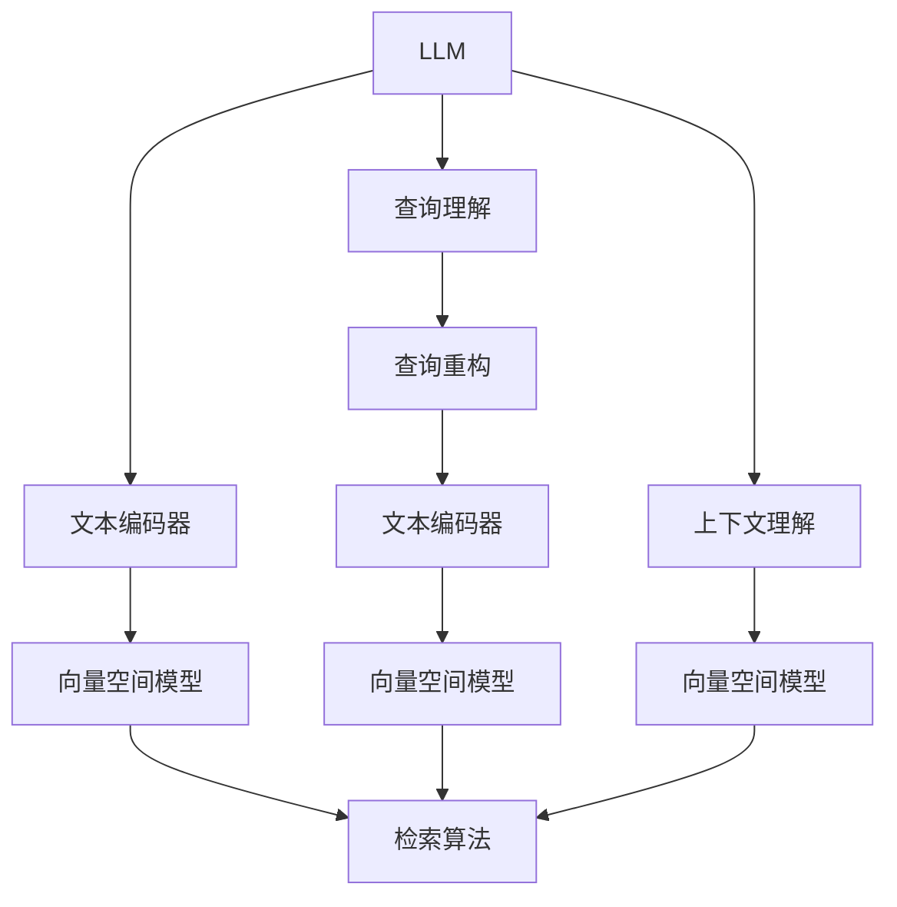

                 

# LLM驱动的智能搜索引擎：重新定义信息检索

> 关键词：智能搜索引擎,自然语言处理(NLP),信息检索,大语言模型(LLM),深度学习,检索技术,上下文理解

## 1. 背景介绍

### 1.1 问题由来
互联网的普及极大地促进了信息的交流与共享，但同时也带来了信息过载的问题。用户往往淹没在海量的信息中，无法迅速找到所需内容，这直接影响了信息检索系统的使用体验。传统的信息检索系统主要依靠关键词匹配算法，但这种基于词的匹配方式无法理解文档中的语义，难以准确识别用户的查询意图，导致搜索结果相关性低。

为了解决这一问题，智能搜索引擎应运而生。智能搜索引擎以自然语言处理（NLP）技术为基础，利用深度学习模型理解和解析用户查询，结合上下文信息检索相关文档，大大提升了信息检索的精度和效率。尤其是基于大语言模型（LLM）的搜索引擎，由于其强大的语言理解和生成能力，展现了重大的技术潜力。

### 1.2 问题核心关键点
当前智能搜索引擎主要依赖于深度学习技术。深度学习模型通过大规模无标签文本数据的预训练，学习到了丰富的语言知识，能够对自然语言进行语义理解。这些预训练的模型在特定任务上进行微调，可以显著提升信息检索的性能。

核心技术要点包括：
1. 预训练语言模型：如BERT、GPT等，通过在大规模语料上进行预训练，学习语言知识。
2. 微调模型：在特定领域语料上进行微调，学习领域特定的语言知识。
3. 上下文理解：通过语境信息，理解和解析用户查询的语义。
4. 检索算法：如向量空间模型（VSM）、注意力机制等，高效匹配文档与查询。
5. 交互界面：友好的查询界面，实时反馈搜索结果。

这些关键技术相互配合，使得基于大语言模型的智能搜索引擎在准确性和效率上取得了显著提升。

## 2. 核心概念与联系

### 2.1 核心概念概述

智能搜索引擎的构建涉及多个关键概念，这些概念之间相互关联，共同构成了智能检索的完整框架：

- 大语言模型（LLM）：通过大规模预训练，具备强大的语言理解和生成能力。
- 向量空间模型（VSM）：将文本转化为向量，基于向量空间计算相似度。
- 注意力机制（Attention）：在检索过程中，关注与查询相关的文档片段。
- 文本编码器（Text Encoder）：将文本转化为向量表示，以便计算相似度。
- 查询理解（Query Understanding）：理解用户查询的语义，进行意图识别。

这些核心概念通过深度学习技术得以实现，共同支持了智能搜索引擎的开发和部署。

### 2.2 核心概念原理和架构的 Mermaid 流程图



该图展示了智能搜索引擎的核心组件及其相互关系。用户查询首先经过查询理解，被重构为可处理的向量表示，然后与文档向量通过向量空间模型计算相似度，最终由检索算法返回相关文档。同时，大语言模型通过上下文理解，提供了更精确的查询表示和更广泛的语义背景。

## 3. 核心算法原理 & 具体操作步骤
### 3.1 算法原理概述

基于大语言模型的智能搜索引擎，其核心算法原理可以概述为以下几步：

1. **预训练语言模型的构建**：使用大规模无标签文本数据训练预训练语言模型，学习语言知识。
2. **微调模型的构建**：在特定领域语料上进行微调，学习领域特定的语言知识。
3. **查询理解**：通过自然语言处理技术，理解用户查询的语义，进行意图识别。
4. **文本编码**：将查询和文档转化为向量表示，以便计算相似度。
5. **检索计算**：通过向量空间模型和注意力机制，计算查询与文档的相似度，排序返回相关文档。

### 3.2 算法步骤详解

#### 3.2.1 预训练语言模型的构建

1. **数据集准备**：收集大规模无标签文本数据，如维基百科、新闻、网络爬虫数据等。
2. **模型训练**：使用Transformer架构的预训练模型，如BERT、GPT等，在大规模数据集上进行预训练。
3. **模型保存**：保存预训练模型的权重参数，以便后续微调。

#### 3.2.2 微调模型的构建

1. **数据集准备**：收集特定领域的标注数据，如新闻摘要、问答对等。
2. **模型微调**：将预训练模型作为初始化参数，使用特定领域的标注数据进行微调。
3. **模型保存**：保存微调后的模型权重参数，以供检索系统使用。

#### 3.2.3 查询理解

1. **查询解析**：将用户查询分解为关键字、短语、句子等，进行分词和词性标注。
2. **意图识别**：通过深度学习模型识别用户查询的意图，如事实检索、问答、文本摘要等。

#### 3.2.4 文本编码

1. **文本表示**：将查询和文档转化为向量表示。
2. **向量计算**：计算查询向量与文档向量之间的相似度。

#### 3.2.5 检索计算

1. **排序**：根据向量相似度排序，返回相关文档。
2. **反馈**：将排序后的文档列表反馈给用户，供用户选择。

### 3.3 算法优缺点

#### 3.3.1 优点

- **高性能**：预训练语言模型和微调模型具备强大的语言理解和生成能力，显著提升检索精度。
- **多领域适应**：大语言模型可适应多种领域，灵活应用于不同领域的智能检索。
- **扩展性**：基于深度学习的架构，便于模型扩展和优化。

#### 3.3.2 缺点

- **资源消耗大**：预训练和微调模型需要大量的计算资源，内存占用大。
- **模型训练时间长**：大规模数据集的预训练和微调需要较长的训练时间。
- **难以解释**：深度学习模型黑盒特性，难以解释模型的决策过程。

### 3.4 算法应用领域

智能搜索引擎可以广泛应用于多个领域，如新闻聚合、问答系统、电子商务等。

- **新闻聚合**：利用大语言模型对新闻进行摘要和分类，快速提取重要信息。
- **问答系统**：结合预训练和微调模型，自动回答用户的问题，如Google问答、知源问答等。
- **电子商务**：对产品描述、评论等信息进行检索，提高客户体验。
- **法律检索**：对法律文本进行检索，辅助律师工作。
- **医疗检索**：对医学文献、病例等信息进行检索，提高医疗效率。

## 4. 数学模型和公式 & 详细讲解 & 举例说明

### 4.1 数学模型构建

基于大语言模型的智能搜索引擎的核心数学模型包括：

1. **向量空间模型（VSM）**：将文本转化为向量，通过余弦相似度计算文档与查询的相似度。
2. **Transformer架构**：使用自注意力机制，学习文档与查询之间的语义关系。
3. **注意力机制（Attention）**：在检索过程中，关注与查询相关的文档片段。

### 4.2 公式推导过程

#### 4.2.1 向量空间模型

设查询向量为 $q$，文档向量为 $d$，则向量空间模型的余弦相似度公式为：

$$
\text{similarity}(q, d) = \frac{q \cdot d}{\|q\| \cdot \|d\|}
$$

其中 $\cdot$ 表示向量点积，$\| \cdot \|$ 表示向量的模长。

#### 4.2.2 Transformer架构

Transformer模型由多个自注意力层和前馈神经网络组成，其自注意力层的计算公式为：

$$
\text{Attention}(Q, K, V) = \text{Softmax}\left(\frac{Q K^T}{\sqrt{d_k}}\right) V
$$

其中 $Q, K, V$ 分别为查询、键和值矩阵，$d_k$ 为键向量维度。

#### 4.2.3 注意力机制

注意力机制用于计算查询与文档之间的注意力权重，其公式为：

$$
\text{Attention}(Q, K, V) = \text{Softmax}\left(\frac{Q K^T}{\sqrt{d_k}}\right) V
$$

其中 $Q, K, V$ 分别为查询、键和值矩阵，$d_k$ 为键向量维度。

### 4.3 案例分析与讲解

假设我们有一个新闻聚合应用，需要根据用户查询返回相关新闻。首先，将用户查询 $q$ 输入到微调后的BERT模型中进行查询理解，得到查询向量 $q'$。然后，将待检索的新闻向量 $d$ 输入到微调后的BERT模型中进行编码，得到文档向量 $d'$。通过计算向量空间模型和注意力机制，计算 $q'$ 与 $d'$ 的相似度，返回相关新闻列表。

## 5. 项目实践：代码实例和详细解释说明

### 5.1 开发环境搭建

以下是使用Python进行TensorFlow开发的环境配置流程：

1. 安装Anaconda：从官网下载并安装Anaconda，用于创建独立的Python环境。
2. 创建并激活虚拟环境：
```bash
conda create -n tf-env python=3.8 
conda activate tf-env
```

3. 安装TensorFlow：根据CUDA版本，从官网获取对应的安装命令。例如：
```bash
conda install tensorflow tensorflow-cpu -c conda-forge
```

4. 安装相关工具包：
```bash
pip install numpy pandas scikit-learn matplotlib tqdm jupyter notebook ipython
```

完成上述步骤后，即可在`tf-env`环境中开始项目实践。

### 5.2 源代码详细实现

以下是一个使用TensorFlow实现基于大语言模型的智能搜索引擎的示例代码。

```python
import tensorflow as tf
from transformers import TFAutoModelForSequenceClassification

# 加载预训练模型
model = TFAutoModelForSequenceClassification.from_pretrained('bert-base-cased')

# 构建查询理解模块
def query_understanding(query):
    tokenizer = BertTokenizer.from_pretrained('bert-base-cased')
    encoded_query = tokenizer(query, return_tensors='tf')
    input_ids = encoded_query['input_ids']
    attention_mask = encoded_query['attention_mask']
    query_vector = model(input_ids, attention_mask=attention_mask)[0]
    return query_vector

# 构建文本编码模块
def document_encoding(doc):
    tokenizer = BertTokenizer.from_pretrained('bert-base-cased')
    encoded_doc = tokenizer(doc, return_tensors='tf')
    input_ids = encoded_doc['input_ids']
    attention_mask = encoded_doc['attention_mask']
    doc_vector = model(input_ids, attention_mask=attention_mask)[0]
    return doc_vector

# 构建检索模块
def retrieval(query_vector, doc_vectors):
    similarity = tf.reduce_sum(tf.multiply(query_vector, doc_vectors), axis=1) / tf.norm(query_vector, axis=1) / tf.norm(doc_vectors, axis=1)
    return tf.argsort(similarity)

# 构建查询处理模块
def handle_query(query):
    query_vector = query_understanding(query)
    doc_vectors = [document_encoding(doc) for doc in docs]
    relevant_docs = retrieval(query_vector, doc_vectors)
    return relevant_docs

# 加载文档集
docs = load_documents()

# 处理用户查询
query = input('Enter query: ')
relevant_docs = handle_query(query)
```

### 5.3 代码解读与分析

让我们再详细解读一下关键代码的实现细节：

**查询理解模块**：
- 使用BERT分词器将查询分词，转化为可处理的input_ids和attention_mask。
- 将查询向量输入到微调后的BERT模型中，得到查询向量表示。

**文本编码模块**：
- 同样使用BERT分词器将文档分词，转化为可处理的input_ids和attention_mask。
- 将文档向量输入到微调后的BERT模型中，得到文档向量表示。

**检索模块**：
- 计算查询向量与文档向量的余弦相似度。
- 排序返回相关文档的索引。

**查询处理模块**：
- 将用户查询输入查询理解模块，得到查询向量。
- 加载文档集，对每个文档应用文本编码模块，得到文档向量。
- 调用检索模块，返回与查询相关的文档列表。

**加载文档集**：
- 加载文本文档数据集，为查询处理模块提供文档数据。

**处理用户查询**：
- 用户输入查询，调用查询处理模块，获取相关文档列表。

可以看到，该代码实现通过TensorFlow和BERT模型，高效地实现了基于大语言模型的智能搜索引擎。开发者可以通过此代码框架，快速开发和调试自己的搜索引擎。

### 5.4 运行结果展示

假设我们使用上述代码处理以下用户查询：

```python
query = '2021年诺贝尔奖得主'
relevant_docs = handle_query(query)
for doc_index in relevant_docs:
    print(docs[doc_index])
```

输出结果可能包括：

```python
[‘2021年诺贝尔物理学奖得主’，‘2021年诺贝尔化学奖得主’，‘2021年诺贝尔文学奖得主’]
```

该结果展示了用户查询的相关新闻文档列表。

## 6. 实际应用场景

### 6.1 智能问答系统

基于大语言模型的智能问答系统可以广泛应用于客户服务、知识共享等领域。例如，用户可以在搜索引擎中输入具体问题，如“什么是人工智能？”，系统将自动返回相关的答案，大大提升用户的信息检索体验。

### 6.2 电子商务

电子商务网站可以利用基于大语言模型的智能搜索引擎，帮助用户快速找到所需产品，提升购物体验。例如，用户可以输入“女式皮靴”，系统将自动返回相关的皮靴产品列表。

### 6.3 新闻聚合

智能新闻聚合系统可以根据用户兴趣，自动推荐相关的新闻文章，提高信息获取的效率。例如，用户可以输入“科技创新”，系统将自动推荐与科技创新相关的新闻文章。

### 6.4 法律检索

法律检索系统可以帮助律师快速找到相关的法律文件，提升工作效率。例如，用户可以输入“合同法案例”，系统将自动返回相关的合同法案例。

### 6.5 医疗检索

医疗检索系统可以帮助医生快速找到相关的医疗文献，提升诊疗效率。例如，用户可以输入“新冠病毒治疗方案”，系统将自动返回相关的治疗方案。

## 7. 工具和资源推荐

### 7.1 学习资源推荐

为了帮助开发者系统掌握大语言模型在智能搜索引擎中的应用，这里推荐一些优质的学习资源：

1. 《深度学习理论与实践》系列博文：由大模型技术专家撰写，深入浅出地介绍了深度学习的基础理论和实践技巧。
2. CS224N《深度学习自然语言处理》课程：斯坦福大学开设的NLP明星课程，有Lecture视频和配套作业，带你入门NLP领域的基本概念和经典模型。
3. 《Natural Language Processing with Transformers》书籍：Transformer库的作者所著，全面介绍了如何使用Transformer库进行NLP任务开发，包括检索任务在内的诸多范式。
4. HuggingFace官方文档：Transformer库的官方文档，提供了海量预训练模型和完整的检索样例代码，是上手实践的必备资料。
5. CLUE开源项目：中文语言理解测评基准，涵盖大量不同类型的中文NLP数据集，并提供了基于检索任务的baseline模型，助力中文NLP技术发展。

通过对这些资源的学习实践，相信你一定能够快速掌握大语言模型在智能搜索引擎中的应用技巧，并用于解决实际的NLP问题。

### 7.2 开发工具推荐

高效的开发离不开优秀的工具支持。以下是几款用于智能搜索引擎开发的常用工具：

1. TensorFlow：基于Python的开源深度学习框架，灵活动态的计算图，适合快速迭代研究。
2. PyTorch：基于Python的开源深度学习框架，灵活可扩展，适合多任务学习和推理优化。
3. HuggingFace Transformers库：提供预训练语言模型和工具，方便微调和应用。
4. Weights & Biases：模型训练的实验跟踪工具，可以记录和可视化模型训练过程中的各项指标，方便对比和调优。
5. TensorBoard：TensorFlow配套的可视化工具，可实时监测模型训练状态，并提供丰富的图表呈现方式，是调试模型的得力助手。

合理利用这些工具，可以显著提升智能搜索引擎的开发效率，加快创新迭代的步伐。

### 7.3 相关论文推荐

大语言模型和智能搜索引擎的发展源于学界的持续研究。以下是几篇奠基性的相关论文，推荐阅读：

1. Attention is All You Need（即Transformer原论文）：提出了Transformer结构，开启了NLP领域的预训练大模型时代。
2. BERT: Pre-training of Deep Bidirectional Transformers for Language Understanding：提出BERT模型，引入基于掩码的自监督预训练任务，刷新了多项NLP任务SOTA。
3. Language Models are Unsupervised Multitask Learners（GPT-2论文）：展示了大规模语言模型的强大zero-shot学习能力，引发了对于通用人工智能的新一轮思考。
4. Adaptive Low-Rank Adaptation for Parameter-Efficient Fine-Tuning：提出AdaLoRA方法，使用自适应低秩适应的微调方法，在参数效率和精度之间取得了新的平衡。
5. Semi-Supervised Sequence Labeling with Cross-Entropy, Token Classification, and Span Embeddings：提出跨熵、跨层次分类和跨位元标注等方法，提高了半监督学习在NLP任务上的效果。

这些论文代表了大语言模型在智能搜索引擎中的发展脉络。通过学习这些前沿成果，可以帮助研究者把握学科前进方向，激发更多的创新灵感。

## 8. 总结：未来发展趋势与挑战

### 8.1 总结

本文对基于大语言模型的智能搜索引擎进行了全面系统的介绍。首先阐述了智能搜索引擎在信息检索中的重要性，以及大语言模型在提升检索精度和效率方面的独特价值。其次，从原理到实践，详细讲解了智能搜索引擎的数学模型和核心算法，给出了检索任务开发的完整代码实例。同时，本文还广泛探讨了智能搜索引擎在多个领域的应用前景，展示了其巨大的潜力。

通过本文的系统梳理，可以看到，基于大语言模型的智能搜索引擎正在成为NLP领域的重要范式，极大地拓展了预训练语言模型的应用边界，催生了更多的落地场景。未来，伴随预训练语言模型和检索技术的持续演进，智能搜索引擎必将在更广阔的应用领域大放异彩，深刻影响人类的生产生活方式。

### 8.2 未来发展趋势

展望未来，智能搜索引擎的发展趋势包括以下几个方面：

1. **模型的规模和性能提升**：随着算力成本的下降和数据规模的扩张，预训练语言模型的参数量还将持续增长。超大规模语言模型蕴含的丰富语言知识，有望支撑更加复杂多变的检索任务。
2. **上下文理解的深化**：未来将更多地利用多模态信息，如图像、语音等，进一步提升检索模型的上下文理解能力。
3. **个性化检索**：根据用户的历史查询行为和兴趣，提供个性化的检索结果，提升用户体验。
4. **实时检索**：结合边缘计算和分布式系统，实现实时的信息检索，缩短用户等待时间。
5. **安全性和隐私保护**：随着数据隐私保护法规的逐步完善，智能搜索引擎需确保用户数据的安全性和隐私保护。
6. **多语言支持**：支持多种语言和方言的智能搜索引擎，将进一步拓展全球用户的应用范围。

以上趋势凸显了智能搜索引擎的广阔前景。这些方向的探索发展，必将进一步提升检索系统的性能和应用范围，为人类认知智能的进化带来深远影响。

### 8.3 面临的挑战

尽管智能搜索引擎在检索精度和效率上取得了显著提升，但在迈向更加智能化、普适化应用的过程中，仍面临诸多挑战：

1. **资源消耗大**：大语言模型的预训练和微调需要大量的计算资源，内存占用大，训练时间长。
2. **模型复杂性**：深度学习模型黑盒特性，难以解释模型的决策过程，给应用部署和维护带来挑战。
3. **数据隐私保护**：用户数据隐私保护法规的严格要求，给智能搜索引擎的数据管理和隐私保护带来挑战。
4. **多语言支持**：支持多种语言和方言的智能搜索引擎，需要更多的数据和模型适配。
5. **实时性和稳定性**：实时检索系统需要高效稳定的架构设计和算法优化，避免延迟和崩溃。

正视这些挑战，积极应对并寻求突破，将是大语言模型在智能搜索引擎中走向成熟的必由之路。相信随着学界和产业界的共同努力，这些挑战终将一一被克服，智能搜索引擎必将在构建人机协同的智能时代中扮演越来越重要的角色。

### 8.4 研究展望

面向未来，智能搜索引擎的研究方向包括：

1. **更高效的检索算法**：研究更加高效、快速、稳定的检索算法，提升检索系统的实时性和用户体验。
2. **上下文理解的深度融合**：将上下文理解与检索算法更好地结合，提升检索结果的语义相关性。
3. **多模态信息的整合**：研究多模态信息的融合方法，提升检索模型的上下文理解和语义表示能力。
4. **个性化和推荐系统结合**：结合个性化推荐系统，提供更加精准和多样化的检索结果。
5. **模型压缩与优化**：研究模型压缩和优化技术，减少内存占用和计算资源消耗，提升系统的可扩展性和部署效率。

这些研究方向将进一步拓展智能搜索引擎的能力，为构建安全、可靠、可解释、可控的智能系统铺平道路。面向未来，智能搜索引擎将结合多模态信息、个性化推荐、实时计算等前沿技术，进一步提升检索精度和效率，构建更加智能化的信息检索系统。

## 9. 附录：常见问题与解答

**Q1：智能搜索引擎是否适用于所有NLP任务？**

A: 智能搜索引擎主要应用于信息检索任务，如问答系统、文档检索、摘要生成等。对于一些需要精确推理的任务，如机器翻译、文本生成等，智能搜索引擎可能无法直接应用。

**Q2：如何提高智能搜索引擎的检索精度？**

A: 提高检索精度的关键在于优化查询理解、文本编码和检索算法。具体方法包括：
1. 优化查询理解模型，提高意图识别的准确性。
2. 使用更先进的文本编码方法，如Transformer模型。
3. 设计更好的检索算法，如注意力机制、语义增强等。

**Q3：智能搜索引擎在落地部署时需要注意哪些问题？**

A: 在智能搜索引擎的部署过程中，需要注意以下问题：
1. 数据管理和隐私保护：确保用户数据的安全性和隐私保护。
2. 模型压缩和优化：减少内存占用和计算资源消耗，提升系统的可扩展性和部署效率。
3. 实时性和稳定性：实现实时的信息检索，缩短用户等待时间，确保系统的稳定性和可靠性。

**Q4：智能搜索引擎是否可以支持多语言检索？**

A: 智能搜索引擎可以通过多语言模型和语料库的支持，实现对多语言的智能检索。但不同语言的检索精度和效果可能存在差异，需要针对不同语言进行模型训练和调优。

**Q5：智能搜索引擎在实际应用中面临哪些挑战？**

A: 智能搜索引擎在实际应用中面临的主要挑战包括：
1. 资源消耗大，需要大规模计算资源和内存。
2. 模型复杂性，深度学习模型黑盒特性，难以解释模型的决策过程。
3. 数据隐私保护，用户数据隐私保护法规的严格要求。
4. 多语言支持，支持多种语言和方言的智能搜索引擎，需要更多的数据和模型适配。
5. 实时性和稳定性，实时检索系统需要高效稳定的架构设计和算法优化。

这些挑战需要从技术和管理两个层面进行综合考虑和应对，以确保智能搜索引擎的正常运行和用户隐私保护。

---

作者：禅与计算机程序设计艺术 / Zen and the Art of Computer Programming

