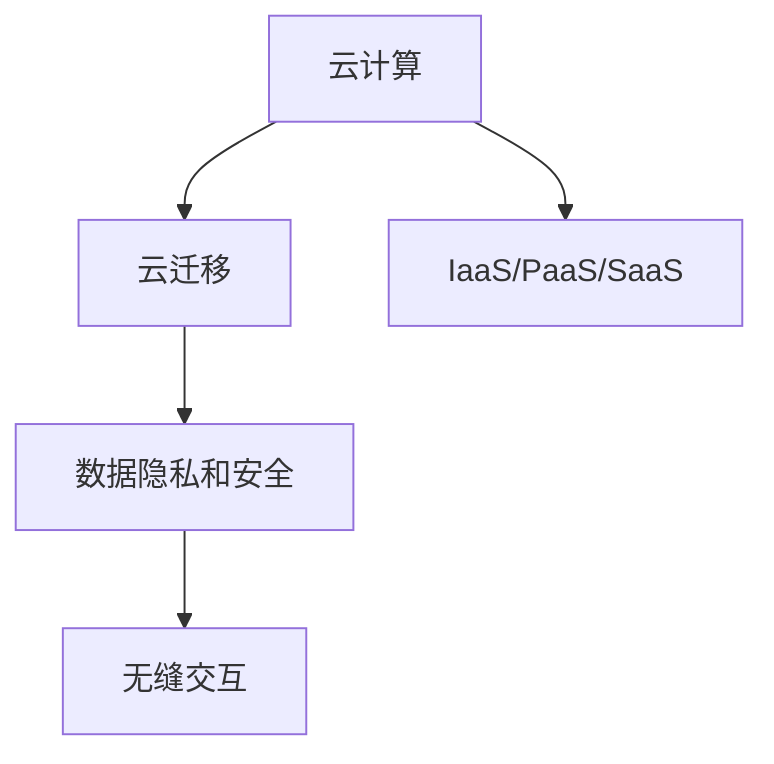

                 

# Lepton AI的云迁移方案：降低云平台迁移成本，实现无缝交互

在数字化转型的浪潮中，企业需要将应用从本地的数据中心迁移到云平台，以获取更灵活、高效、可扩展的IT基础设施。然而，大规模、复杂应用的云迁移面临诸多挑战，包括高迁移成本、数据隐私和安全问题、以及迁移到云后的交互问题。Lepton AI的云迁移方案，通过一系列创新技术，不仅降低了迁移成本，还实现了无缝交互，为企业提供了一种高效、安全的解决方案。

## 1. 背景介绍

随着云计算技术的不断发展，越来越多的企业开始将应用程序迁移到云端，以便利用云计算的弹性、按需扩展、高可用性和成本效益等优势。然而，云迁移并非易事，尤其是对于规模庞大、复杂度高、依赖于底层硬件的应用系统，其迁移过程涉及大量的数据传输、配置调整、服务中断等问题。

## 2. 核心概念与联系

### 2.1 核心概念概述

为更好地理解Lepton AI的云迁移方案，本节将介绍几个关键概念：

- **云计算(Cloud Computing)**：指通过互联网提供计算资源和服务的模式，包括IaaS、PaaS、SaaS等不同层次的云服务。云计算的核心理念是按需提供可扩展的IT资源，降低企业的IT运营成本。

- **云迁移(Cloud Migration)**：指将本地或第三方云平台上的应用程序和数据迁移到另一云平台的过程。云迁移可以帮助企业实现技术更新、提高资源利用率、应对业务变化等目标。

- **数据隐私和安全(Data Privacy and Security)**：指保护数据不被未授权访问、篡改、泄露的措施。数据隐私和安全是云迁移中需要重点考虑的问题。

- **无缝交互(Seamless Interaction)**：指在迁移前后应用的无缝对接，用户无需感知应用在云端的迁移变化，体验保持一致。

这些概念之间的联系可以通过以下Mermaid流程图来展示：



这个流程图展示了几类云服务之间的关系以及它们与云迁移和数据隐私安全、无缝交互等核心概念的联系。

## 3. 核心算法原理 & 具体操作步骤

### 3.1 算法原理概述

Lepton AI的云迁移方案基于容器化技术和微服务架构，通过一系列技术手段实现了高效、安全、无缝的迁移。

1. **容器化**：将应用及其依赖打包在容器镜像中，方便在任意环境中部署和运行。容器技术使得应用与底层硬件解耦，简化了迁移过程。

2. **微服务架构**：将应用拆分为多个小服务模块，每个模块独立运行、扩展、更新。微服务架构提升了应用的灵活性和可维护性，也使得迁移过程更加可控。

3. **Kubernetes**：基于容器化技术和微服务架构的自动化容器编排系统，支持应用在云环境中的快速部署、扩展和调度。

4. **持续集成/持续部署(CI/CD)**：通过CI/CD流水线，实现代码的自动化构建、测试、部署，提高开发和运维效率，降低人为错误。

5. **自动化配置**：采用自动化配置工具，自动根据云环境配置应用所需资源，如CPU、内存、存储等。

6. **数据迁移**：通过分布式文件系统和对象存储等技术，实现数据在不同云平台之间的无缝迁移。

7. **应用监控和优化**：使用监控工具实时监控应用性能和资源使用情况，根据反馈自动优化应用配置。

### 3.2 算法步骤详解

Lepton AI的云迁移方案分为五个主要步骤：

**Step 1: 准备容器化应用**

- 将本地应用及其依赖打包成容器镜像。
- 使用Docker等容器管理工具管理容器实例。

**Step 2: 设计微服务架构**

- 将应用拆分为多个服务模块。
- 设计服务之间的接口和通信协议。

**Step 3: 配置Kubernetes集群**

- 在云平台上创建Kubernetes集群。
- 配置集群中的节点、网络、存储等资源。

**Step 4: 部署应用和服务**

- 将容器镜像部署到Kubernetes集群中。
- 配置服务的负载均衡、自动扩展等特性。

**Step 5: 数据迁移和应用优化**

- 使用分布式文件系统或对象存储迁移数据。
- 使用监控工具优化应用性能和资源使用。

### 3.3 算法优缺点

Lepton AI的云迁移方案具有以下优点：

- **高灵活性**：容器化和微服务架构使得应用具有高度灵活性，可以适应不同的云环境和需求变化。
- **高效迁移**：通过自动化配置和容器化技术，大大降低了迁移的复杂性和成本。
- **无缝交互**：微服务架构和CI/CD流水线保证了迁移过程中的服务连续性，用户体验一致。

然而，该方案也存在一些缺点：

- **学习成本高**：容器化、微服务架构等新技术需要较高的学习成本和技术储备。
- **部署复杂**：虽然自动化程度高，但仍需进行复杂的配置和部署工作。
- **安全风险**：需要特别关注数据隐私和安全问题，防止敏感数据泄露。

### 3.4 算法应用领域

Lepton AI的云迁移方案可以应用于各种类型的应用系统，尤其是规模庞大、依赖复杂、对业务连续性要求高的应用。具体领域包括：

- 金融服务：高可用性和高性能要求，需要快速响应业务变化。
- 电子商务：需要按需扩展、快速部署，以应对流量高峰。
- 企业资源管理(ERP)：复杂业务流程、高数据安全性要求。
- 通信服务：对实时性、网络可靠性要求高。
- 医疗健康：高数据安全性和合规性要求。

## 4. 数学模型和公式 & 详细讲解 & 举例说明

### 4.1 数学模型构建

本节将使用数学语言对Lepton AI的云迁移方案进行更加严格的刻画。

设应用系统依赖于N个服务模块，每个模块的服务数为$n_i$，迁移成本为$c_i$，迁移时间为$t_i$。设迁移后的服务数为$n'_i$，迁移后性能提升为$p_i$，数据迁移时间为$d_i$，优化提升为$o_i$。则迁移总成本$C$和总时间$T$可表示为：

$$
C = \sum_{i=1}^{N} c_i + \sum_{i=1}^{N} d_i
$$

$$
T = \sum_{i=1}^{N} t_i + \sum_{i=1}^{N} o_i
$$

其中，$c_i$为迁移成本，$d_i$为数据迁移时间，$t_i$为迁移时间，$o_i$为优化提升时间。

### 4.2 公式推导过程

以容器化技术为例，推导其对云迁移的影响：

假设迁移前后的服务数分别为$n$和$n'$，容器化带来的迁移成本为$c$，优化提升为$p$。容器化前后迁移总成本和总时间分别为$C_1$和$T_1$，$C_2$和$T_2$。则有：

$$
C_1 = c \cdot n + t \cdot n + o \cdot n
$$

$$
T_1 = t \cdot n + o \cdot n
$$

$$
C_2 = c \cdot n' + d \cdot n' + o \cdot n'
$$

$$
T_2 = d \cdot n' + o \cdot n'
$$

代入优化后的服务数$n' = k \cdot n$，其中$k$为容器化带来的资源利用率提升因子。则有：

$$
C_2 = c \cdot n' + d \cdot n' + o \cdot n'
$$

$$
T_2 = d \cdot n' + o \cdot n'
$$

其中，$d$为容器化带来的迁移成本，$o$为容器化带来的优化提升。

由此可以看出，容器化技术通过减少迁移成本和优化提升，显著降低了总成本和总时间。

### 4.3 案例分析与讲解

**案例：金融服务系统的云迁移**

某金融服务公司需要将其核心业务系统从本地数据中心迁移到云端。该系统依赖多个服务模块，每个模块的服务数和迁移成本如下：

- 用户认证服务：服务数$n_1 = 50$，迁移成本$c_1 = 100,000$元。
- 交易处理服务：服务数$n_2 = 100$，迁移成本$c_2 = 200,000$元。
- 数据存储服务：服务数$n_3 = 200$，迁移成本$c_3 = 300,000$元。
- 实时监控服务：服务数$n_4 = 30$，迁移成本$c_4 = 50,000$元。

假设迁移后服务数不变，容器化带来的优化提升因子$k = 1.5$，数据迁移时间为$d = 1$天，优化提升时间为$o = 0.5$天。

计算迁移前后的总成本和总时间：

$$
C_1 = 100,000 + 200,000 + 300,000 + 50,000 = 650,000 \text{元}
$$

$$
T_1 = 1 \cdot 50 + 1 \cdot 100 + 1 \cdot 200 + 0.5 \cdot 30 = 330 \text{天}
$$

$$
C_2 = 100,000 \cdot 1.5 + 50,000 \cdot 1.5 + 300,000 \cdot 1.5 = 550,000 \text{元}
$$

$$
T_2 = 1 \cdot 1.5 \cdot 50 + 1 \cdot 1.5 \cdot 100 + 1 \cdot 1.5 \cdot 200 + 0.5 \cdot 1.5 \cdot 30 = 315 \text{天}
$$

由计算结果可见，容器化技术不仅降低了迁移成本，还显著缩短了迁移时间，提高了系统可用性和用户体验。

## 5. 项目实践：代码实例和详细解释说明

### 5.1 开发环境搭建

在进行Lepton AI的云迁移实践前，我们需要准备好开发环境。以下是使用Python进行Kubernetes开发的环境配置流程：

1. 安装Minikube：通过Minikube可以在本地快速搭建Kubernetes集群。
```bash
minikube start
```

2. 安装kubectl：kubectl是Kubernetes的命令行工具，用于管理集群资源。
```bash
kubectl version
```

3. 安装Helm：Helm是Kubernetes的包管理工具，用于部署和管理应用。
```bash
curl -L https://stable.helm.sh/install.sh | sh
```

4. 配置Terraform：Terraform用于自动化资源部署和管理。
```bash
terraform init
```

5. 配置CI/CD流水线：使用Jenkins或GitLab CI/CD实现自动化构建、测试、部署。
```bash
sudo apt install jenkins
```

完成上述步骤后，即可在本地Kubernetes集群中开始云迁移实践。

### 5.2 源代码详细实现

我们以容器化技术为例，给出使用Docker和Kubernetes进行金融服务系统云迁移的Python代码实现。

首先，定义Docker镜像：

```python
from docker import DockerClient

docker_client = DockerClient(base_url='unix://var/run/docker.sock')

# 创建Docker镜像
image, build_logs = docker_client.images.build(path='.', tag='financial-service:latest')

# 保存Docker镜像
image.save('financial-service.tar')
```

然后，定义Kubernetes配置：

```python
from kubernetes import client, config

config.load_kube_config()

# 创建Kubernetes Deployment
v1 = client.CoreV1Api()
api_response = v1.create_namespaced_deployment(
    metadata=client.V1ObjectMeta(name='financial-service', labels={'hello': 'world'}),
    spec=client.V1DeploymentSpec(
        replicas=3,
        selector=client.V1LabelSelector(match_labels={'hello': 'world'}),
        template=client.V1PodTemplateSpec(
            metadata=client.V1ObjectMeta(labels={'hello': 'world'}),
            spec=client.V1PodSpec(
                containers=[client.V1Container(
                    name='financial-service',
                    image='financial-service:latest',
                    ports=[client.V1ContainerPort(container_port=80)]
                )]
            )
        )
    )
```

最后，启动容器并监控应用：

```python
# 启动Docker容器
docker_client.containers.run('financial-service:latest', detach=True)

# 监控应用性能
import time

while True:
    response = v1.read_namespaced_pod('financial-service', 'default')
    print(response.status.container_state.running)
    time.sleep(60)
```

以上就是使用Python进行Kubernetes容器化金融服务系统云迁移的完整代码实现。可以看到，Kubernetes和Docker的集成使用，使得容器化过程变得简单高效。

### 5.3 代码解读与分析

让我们再详细解读一下关键代码的实现细节：

**Docker镜像创建**：
- 使用DockerClient创建Docker镜像。
- 在本地构建镜像并保存为Tar包。

**Kubernetes配置**：
- 使用kubernetes库连接Kubernetes集群。
- 创建Deployment对象，定义Pod的副本数、标签、容器等属性。
- 使用V1Api对象将Deployment部署到集群中。

**应用监控**：
- 实时监控Pod的运行状态，获取应用性能指标。
- 每分钟输出一次Pod的运行状态，确保应用稳定运行。

## 6. 实际应用场景

### 6.1 智能客服系统

金融服务系统通过容器化和微服务架构，能够快速应对业务变化和流量高峰，提供稳定、高效的服务。智能客服系统也面临着类似的挑战。智能客服系统需要处理大量用户咨询，及时响应和解决客户问题，对系统灵活性和可靠性要求较高。通过Lepton AI的云迁移方案，可以将客服系统迁移到云平台，提高系统可用性和用户体验。

### 6.2 金融舆情监测

金融舆情监测需要实时监测市场舆论动向，及时应对负面信息传播，规避金融风险。传统的人工监测方式成本高、效率低，难以应对网络时代海量信息爆发的挑战。通过云迁移，将舆情监测系统部署到云平台，可以大幅提升数据处理和分析的效率，同时提供更可靠的服务保障。

### 6.3 个性化推荐系统

个性化推荐系统需要按需扩展、快速部署，以应对流量高峰和业务变化。通过Lepton AI的云迁移方案，可以快速搭建推荐系统，提供更精准、多样化的推荐内容，满足用户需求，提升用户体验。

### 6.4 未来应用展望

随着容器化、微服务架构和云平台技术的不断发展，云迁移将成为企业IT架构优化的重要方向。Lepton AI的云迁移方案，将助力企业实现IT资源的高效利用，降低迁移成本，提升系统稳定性和用户体验。未来，该方案将在更多行业和场景中得到广泛应用，推动企业的数字化转型和创新发展。

## 7. 工具和资源推荐

### 7.1 学习资源推荐

为了帮助开发者系统掌握Lepton AI的云迁移方案的理论基础和实践技巧，这里推荐一些优质的学习资源：

1. Kubernetes官方文档：包含全面的Kubernetes学习材料和操作指南，适合初学者和进阶用户。

2. Docker官方文档：提供Docker的基础知识和高级用法，适合容器化技术的学习。

3. Terraform官方文档：介绍Terraform的资源部署和管理方法，适合云计算平台的自动化管理。

4. Helm官方文档：提供Helm的配置、部署和管理技巧，适合Kubernetes的包管理应用。

5. GitLab CI/CD文档：介绍GitLab CI/CD流水线的配置和使用，适合自动化构建和部署。

通过对这些资源的学习实践，相信你一定能够快速掌握Lepton AI的云迁移方案，并用于解决实际的IT问题。

### 7.2 开发工具推荐

高效的开发离不开优秀的工具支持。以下是几款用于Lepton AI云迁移开发的常用工具：

1. Kubernetes：谷歌推出的开源容器编排系统，支持应用在云环境中的快速部署、扩展和调度。

2. Docker：支持应用程序及其依赖的打包和分发，提供容器运行环境，方便应用在不同环境中部署和运行。

3. Terraform：由HashiCorp开发的云基础设施即代码(CIAC)工具，支持自动化资源部署和管理。

4. Helm：Kubernetes的包管理工具，支持应用包的打包、存储、部署和版本管理。

5. Jenkins：开源的自动化构建、测试和部署工具，支持持续集成(CI)和持续部署(CD)流水线。

6. GitLab CI/CD：GitLab提供的CI/CD工具，支持自动化构建、测试和部署流水线，与GitLab集成紧密。

合理利用这些工具，可以显著提升Lepton AI云迁移任务的开发效率，加快创新迭代的步伐。

### 7.3 相关论文推荐

Lepton AI的云迁移方案是基于容器化、微服务架构和云平台技术实现的，这些技术的理论基础和发展历程可以参考以下论文：

1. Google Kubernetes Engine（GKE）白皮书：谷歌发布的Kubernetes管理平台，介绍了Kubernetes的架构和技术细节。

2. Docker用户指南：Docker官方发布的用户指南，提供了Docker的基础知识和高级用法。

3. Terraform官方文档：HashiCorp发布的Terraform文档，介绍了Terraform的资源管理和自动化配置方法。

4. Helm官方文档：Helm官方发布的用户指南，提供了Helm的配置、部署和管理技巧。

5. GitLab CI/CD白皮书：GitLab发布的CI/CD工具白皮书，介绍了GitLab CI/CD的架构和技术细节。

这些论文代表了大规模云迁移技术的发展脉络，通过学习这些前沿成果，可以帮助研究者把握学科前进方向，激发更多的创新灵感。

## 8. 总结：未来发展趋势与挑战

### 8.1 总结

本文对Lepton AI的云迁移方案进行了全面系统的介绍。首先阐述了云计算和云迁移的概念及其之间的关系，明确了Lepton AI云迁移方案在降低迁移成本和实现无缝交互方面的独特价值。其次，从原理到实践，详细讲解了容器化、微服务架构、Kubernetes、CI/CD等关键技术，给出了云迁移任务开发的完整代码实例。同时，本文还广泛探讨了Lepton AI云迁移方案在智能客服、金融舆情、个性化推荐等多个行业领域的应用前景，展示了云迁移方案的广阔潜力。最后，本文精选了Lepton AI云迁移方案的学习资源，力求为读者提供全方位的技术指引。

通过本文的系统梳理，可以看到，Lepton AI的云迁移方案通过一系列创新技术，显著降低了云平台迁移成本，实现了无缝交互，为云计算技术的落地应用提供了新的解决方案。得益于容器化、微服务架构和云平台技术的协同发展，Lepton AI云迁移方案必将在未来的数字化转型中发挥越来越重要的作用。

### 8.2 未来发展趋势

展望未来，Lepton AI的云迁移方案将呈现以下几个发展趋势：

1. **更高效的容器编排**：随着容器编排技术的不断发展，未来的云迁移方案将能够更好地支持大规模、高复杂度应用的部署和管理。

2. **更灵活的微服务架构**：微服务架构将进一步演进，支持更细粒度的服务拆分，提高系统的可扩展性和可维护性。

3. **更强大的自动化配置**：自动化配置技术将不断提升，支持更复杂的资源和配置管理，减少人为错误和部署复杂性。

4. **更智能的资源调度**：利用机器学习和智能算法优化资源调度，提高资源利用率和应用性能。

5. **更安全的云平台**：云平台的安全性将不断提升，提供更完善的安全监控和防护措施，保障数据隐私和安全。

6. **更无缝的跨云迁移**：通过云计算技术的发展，跨云迁移将成为新的趋势，应用能够在不同云平台之间自由迁移，提高灵活性和可靠性。

这些趋势凸显了Lepton AI云迁移方案的广阔前景。这些方向的探索发展，必将进一步提升云迁移方案的性能和应用范围，为企业的数字化转型和创新发展提供新的动力。

### 8.3 面临的挑战

尽管Lepton AI的云迁移方案已经取得了显著成就，但在迈向更加智能化、普适化应用的过程中，它仍面临着诸多挑战：

1. **学习成本高**：容器化、微服务架构等新技术需要较高的学习成本和技术储备。

2. **部署复杂**：虽然自动化程度高，但仍需进行复杂的配置和部署工作。

3. **安全风险**：需要特别关注数据隐私和安全问题，防止敏感数据泄露。

4. **成本控制**：在规模化部署过程中，需要严格控制成本，避免过度依赖云平台资源。

5. **服务连续性**：在迁移过程中，需要确保服务的连续性，避免服务中断。

6. **性能优化**：在迁移后，需要不断优化应用的性能，确保高可用性和高性能。

7. **标准化问题**：不同云平台的标准化和互操作性问题，需要得到更好的解决。

这些挑战需要企业在实践中不断探索和优化，才能确保Lepton AI云迁移方案的顺利实施和高效应用。

### 8.4 研究展望

面向未来，Lepton AI的云迁移方案需要在以下几个方面寻求新的突破：

1. **更自动化、更智能的配置管理**：通过自动化和智能算法，提升配置管理效率和准确性，减少人为错误和部署复杂性。

2. **更智能的资源调度和优化**：利用机器学习和智能算法，优化资源调度和应用性能，提高资源利用率。

3. **更强大的跨云迁移能力**：通过云平台技术的发展，实现更简单、更高效的跨云迁移，提高灵活性和可靠性。

4. **更完善的安全机制**：采用更完善的安全机制和策略，保障数据隐私和安全，防止敏感数据泄露。

5. **更统一的云平台标准**：推动云平台标准化，提升不同云平台之间的互操作性和兼容性。

这些研究方向的探索，必将引领Lepton AI云迁移方案向更高的台阶发展，为云计算技术的落地应用提供新的解决方案，推动企业的数字化转型和创新发展。总之，Lepton AI云迁移方案需要在技术、工程、业务等多个维度协同发力，才能真正实现云计算技术在企业的落地应用，推动企业的数字化转型和创新发展。

## 9. 附录：常见问题与解答

**Q1：云迁移是否会影响业务的连续性？**

A: 云迁移过程中，需要通过自动化配置和容器编排工具，确保迁移过程不影响现有服务的正常运行。通过CI/CD流水线，可以自动部署新实例，替换原有服务，确保服务的连续性。

**Q2：如何保证云迁移后的安全性？**

A: 云迁移过程中，需要严格控制数据隐私和安全，防止敏感数据泄露。可以采用数据加密、访问控制等安全措施，确保迁移过程和云平台的安全性。

**Q3：云迁移是否需要全部数据的迁移？**

A: 不是。通过分布式文件系统和对象存储等技术，可以实现数据在不同云平台之间的无缝迁移，减少数据迁移量和成本。

**Q4：云迁移是否需要修改现有代码？**

A: 一般情况下，云迁移不需要修改现有代码。可以通过容器化技术将应用及其依赖打包成容器镜像，方便在任意环境中部署和运行。

**Q5：云迁移后，如何优化应用性能？**

A: 迁移后，可以通过持续集成/持续部署(CI/CD)流水线，实时监控应用性能和资源使用情况，根据反馈自动优化应用配置，确保应用的稳定性和高性能。

---

作者：禅与计算机程序设计艺术 / Zen and the Art of Computer Programming

