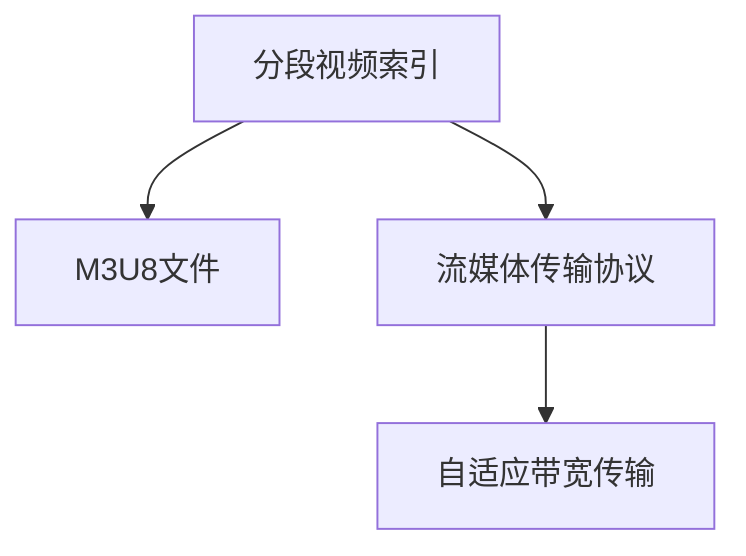

                 

# M3U8 播放列表格式：分段视频的索引

## 1. 背景介绍

### 1.1 问题由来
随着互联网和移动互联网的迅猛发展，视频作为重要的信息载体，其消费量和下载量也在持续攀升。对于网络视频服务提供商而言，如何高效地传输和播放大容量视频内容，降低带宽压力和播放延时，成为亟待解决的问题。

分段视频索引技术是当前互联网视频传输领域的一个热点研究方向。通过将大视频分割为多个小片段，并生成相应的索引文件，能够显著降低传输和播放的延时，提高用户体验。

M3U8（Media Presentation Description Protocol）是Adobe公司提出的一种视频流媒体传输协议，广泛应用于各种流媒体服务中，如YouTube、Amazon Prime Video等。M3U8文件格式通过列出各个视频片段的URL和持续时间等信息，实现了对视频分段和索引的支持。

### 1.2 问题核心关键点
M3U8格式的核心在于它能够灵活地适应不同网络环境，根据用户端网络状况和播放进度动态加载视频片段。这使得视频流能够自适应带宽变化，减少缓冲时间，提高视频质量和用户体验。

M3U8文件通常包含以下几部分内容：
1. **#EXTM3U**：声明文件为M3U8文件。
2. **#EXTINF**：表示每个视频片段的持续时间。
3. **#EXT-X-ENDLIST**：结束列表，用于标记M3U8文件的最后一个片段。
4. **#EXT-X-STREAM-INF**：用于描述一个视频流的信息。
5. **#EXT-X-PLAYLIST-INF**：用于描述整个播放列表的信息。
6. **#EXT-X-TARGETDURATION**：用于设置视频流中每个片段的目标持续时间。

M3U8格式支持多种传输协议，如HTTP、HTTPS、HLS（HTTP Live Streaming）等，广泛应用于流媒体服务中。

### 1.3 问题研究意义
研究M3U8格式的分段视频索引技术，对于提升网络视频传输的效率和用户体验，具有重要意义：

1. **降低带宽压力**：通过分段传输视频，能够减少单次传输的数据量，提高网络传输效率，降低带宽需求。
2. **优化播放性能**：分段视频索引能够根据用户网络状况和播放进度动态加载视频片段，减少缓冲时间和播放延时，提升用户体验。
3. **灵活适应网络变化**：M3U8格式支持自适应带宽的流媒体传输，能够灵活应对不同的网络环境，确保视频流的高效传输。
4. **提高视频质量和稳定性**：分段传输能够减少网络抖动对视频质量的影响，提高视频的稳定性和观赏性。
5. **支持多种流媒体协议**：M3U8格式支持HTTP、HTTPS、HLS等多种协议，能够兼容不同平台和设备的视频播放需求。

## 2. 核心概念与联系

### 2.1 核心概念概述

为更好地理解M3U8格式的分段视频索引方法，本节将介绍几个密切相关的核心概念：

- **M3U8文件**：一种文本格式的视频流媒体描述文件，包含多个视频片段的URL和持续时间等信息，用于实现分段视频传输。
- **分段视频索引**：将大视频分割为多个小片段，并生成相应的索引文件，使得视频能够按需加载和播放，降低带宽压力和播放延时。
- **流媒体传输协议**：如HTTP、HTTPS、HLS等，用于在网络中传输视频流，支持分段视频索引和自适应传输。
- **自适应带宽传输**：根据用户端网络状况动态调整视频流的传输速率和质量，确保视频流的高效稳定传输。

这些核心概念之间的逻辑关系可以通过以下Mermaid流程图来展示：



这个流程图展示了大语言模型的核心概念及其之间的关系：

1. 分段视频索引技术通过将大视频分割为多个小片段，实现按需加载和播放。
2. M3U8文件格式通过列出各个视频片段的URL和持续时间等信息，支持分段传输。
3. 流媒体传输协议如HTTP、HTTPS、HLS等，实现网络视频的高效传输。
4. 自适应带宽传输技术根据用户网络状况动态调整视频流的传输速率和质量，确保高效稳定传输。

这些概念共同构成了M3U8格式分段视频索引的完整框架，使其能够在各种网络环境中实现高效的视频流传输。

## 3. 核心算法原理 & 具体操作步骤
### 3.1 算法原理概述

M3U8格式的分段视频索引方法基于流媒体传输协议和分段传输技术，通过在M3U8文件中定义视频片段的URL和持续时间，实现了视频流的按需加载和自适应传输。

具体而言，M3U8文件通过列出各个视频片段的URL和持续时间等信息，用于描述视频流的结构和播放列表。当用户端请求播放视频时，服务器会依据M3U8文件中的信息，动态加载相应视频片段，从而实现自适应带宽传输和高效播放。

### 3.2 算法步骤详解

基于M3U8格式的分段视频索引一般包括以下几个关键步骤：

**Step 1: 视频分段**
- 将大视频文件分割成多个小片段，每个片段包含一定量的视频数据。分割的粒度根据实际需求和网络状况而定。

**Step 2: 生成M3U8文件**
- 根据分段后的视频片段，生成M3U8文件。M3U8文件包括多个`#EXTINF`指令，每个指令表示一个视频片段的持续时间，以及该片段的URL地址。

**Step 3: 优化流媒体传输**
- 将M3U8文件中的URL地址和视频片段的信息，通过流媒体传输协议（如HLS）传输到用户端。
- 用户端根据M3U8文件中的信息，动态加载视频片段，实现自适应带宽传输。

**Step 4: 用户端播放**
- 用户端接收到M3U8文件后，解析其中的信息，获取视频片段的URL和持续时间。
- 根据用户端网络状况和播放进度，动态加载视频片段，实现按需加载和播放。

### 3.3 算法优缺点

基于M3U8格式的分段视频索引方法具有以下优点：
1. 降低带宽压力。通过分段传输视频，能够显著降低单次传输的数据量，提高网络传输效率，降低带宽需求。
2. 优化播放性能。分段视频索引能够根据用户网络状况和播放进度动态加载视频片段，减少缓冲时间和播放延时，提升用户体验。
3. 灵活适应网络变化。M3U8格式支持自适应带宽的流媒体传输，能够灵活应对不同的网络环境，确保视频流的高效传输。
4. 提高视频质量和稳定性。分段传输能够减少网络抖动对视频质量的影响，提高视频的稳定性和观赏性。
5. 支持多种流媒体协议。M3U8格式支持HTTP、HTTPS、HLS等多种协议，能够兼容不同平台和设备的视频播放需求。

同时，该方法也存在一些局限性：
1. 复杂度较高。M3U8文件格式的生成和解析需要一定的计算和处理能力，可能对服务器和客户端提出较高要求。
2. 缓存和回放限制。分段视频索引方法要求用户端缓存一定量的视频片段，以实现平滑播放，可能影响用户的流畅体验。
3. 需要动态调整。由于网络环境变化，M3U8格式的分段视频索引需要频繁调整，可能对服务器和客户端的性能带来一定的负担。
4. 延迟敏感。M3U8格式的分段视频索引对视频流的传输和加载延迟较为敏感，可能影响用户端的播放效果。

尽管存在这些局限性，但就目前而言，基于M3U8格式的分段视频索引方法仍是在线视频传输的行业标准，广泛应用于各种流媒体服务中。

### 3.4 算法应用领域

M3U8格式的分段视频索引技术，在以下几个领域中得到了广泛的应用：

- **在线视频服务**：如YouTube、Amazon Prime Video、Netflix等，通过M3U8文件格式实现分段视频传输，提升用户播放体验。
- **直播服务**：如IPTV、OTT等，利用M3U8格式实现实时视频的自适应传输和分段播放。
- **虚拟现实（VR）和增强现实（AR）**：通过M3U8格式实现高分辨率视频的分段传输，提升VR和AR的交互效果和用户体验。
- **实时视频会议**：如Zoom、Skype等，利用M3U8格式实现视频流的分段传输和自适应播放，提高视频会议的稳定性和流畅度。
- **教育培训**：如在线课堂、远程教学等，通过M3U8格式实现优质教学资源的自适应传输和分段播放，提升教育效果。

## 4. 数学模型和公式 & 详细讲解 & 举例说明

### 4.1 数学模型构建

M3U8格式的分段视频索引方法主要涉及视频片段的分割、M3U8文件的生成以及自适应带宽传输等几个方面。下面通过数学模型和公式对这些内容进行详细讲解。

假设原始视频文件大小为$L$，每个视频片段的大小为$S$，则视频文件被分割成的片段数为$N=\frac{L}{S}$。

M3U8文件中每个视频片段的信息包含该片段的URL地址和持续时间。设片段$i$的URL地址为$U_i$，持续时间$T_i$，则M3U8文件可以表示为：

```plaintext
#EXTM3U
#EXTINF:0,Media=U1
#EXTINF:0,Media=U2
#...
#EXTINF:0,Media=U_N
#EXT-X-ENDLIST
```

其中`#EXTINF`指令用于表示一个视频片段的持续时间$T_i$。M3U8文件中可以包含多个`#EXT-X-STREAM-INF`指令，用于描述不同的视频流，如下所示：

```plaintext
#EXT-X-STREAM-INF:PROFILE-ID=1,BANDWIDTH=2000000,BITRATE=4000000,SAMPLE-ASPECT-RATIO=0,BITS-PER-GOP=9000,SIZE=172800,TIME-Scale=1000,TARGET持续时长=30000
```

这些指令描述了视频流的各种参数，如带宽、码率、视频大小、目标持续时间等。

### 4.2 公式推导过程

以下我们以一个简单的示例，推导M3U8文件中`#EXTINF`指令的持续时间计算方法。

假设原始视频文件大小为1GB，每个视频片段的大小为100MB。则视频文件被分割成10个片段。根据M3U8格式的规定，每个`#EXTINF`指令的持续时间必须是一个整数，即每个片段的实际播放时间必须是一个整数秒。设每个片段的实际播放时间为$T_i$秒，则有：

$$
\sum_{i=1}^{N} T_i = L / S
$$

假设每个片段的实际播放时间分别为$T_1, T_2, ..., T_N$，则根据公式可得：

$$
T_1 + T_2 + ... + T_N = L / S
$$

在实际应用中，每个片段的持续时间可以根据实际需求进行优化，以达到最佳的播放体验和网络适应性。

### 4.3 案例分析与讲解

为了更好地理解M3U8格式的分段视频索引方法，以下我们通过一个具体案例进行分析讲解。

假设有一段长度为1小时的视频，原始视频文件大小为1GB。根据M3U8格式的规定，可以将这段视频分割成10个片段，每个片段大小为100MB，即每个片段的持续时间为10秒。

根据公式，视频文件的总持续时间$T$为：

$$
T = 3600 \times \frac{1}{10} = 360
$$

则M3U8文件中每个`#EXTINF`指令的持续时间为10秒，如下所示：

```plaintext
#EXTINF:0,Media=U1
#EXTINF:0,Media=U2
#...
#EXTINF:0,Media=U_N
```

在用户端，根据M3U8文件中的信息，服务器可以动态加载视频片段，实现自适应带宽传输和高效播放。例如，当用户端网络状况较差时，服务器可以跳过部分片段，只加载当前播放的片段，减少网络带宽和播放延时。

## 5. 项目实践：代码实例和详细解释说明
### 5.1 开发环境搭建

在进行M3U8文件的分段视频索引实践前，我们需要准备好开发环境。以下是使用Python进行M3U8文件开发的环境配置流程：

1. 安装Anaconda：从官网下载并安装Anaconda，用于创建独立的Python环境。

2. 创建并激活虚拟环境：
```bash
conda create -n m3u8-env python=3.8 
conda activate m3u8-env
```

3. 安装相关库：
```bash
pip install ffmpeg pyM3U8
```

4. 安装FFmpeg：
```bash
apt-get install ffmpeg
```

5. 安装pyM3U8库：
```bash
pip install pyM3U8
```

完成上述步骤后，即可在`m3u8-env`环境中开始M3U8文件的开发。

### 5.2 源代码详细实现

下面我们以一个简单的示例，使用Python和pyM3U8库实现一个M3U8文件的分段视频索引。

首先，定义分段视频索引的函数：

```python
import os
import pyM3U8
import ffmpeg

def generate_m3u8(file_path, fragment_size):
    # 分割视频文件
    input_path = file_path
    output_dir = os.path.dirname(input_path)
    output_filename = os.path.basename(input_path)
    output_path = os.path.join(output_dir, output_filename + '_fragment')
    ffmpeg_process = ffmpeg.input(input_path)
    ffmpeg_process.output(output_path, format='mp4', size=1280x720, tcodec='h264', scodec='aac', ar='44100', acodec='aac')
    ffmpeg_process.run()
    
    # 生成M3U8文件
    fragments = [os.path.join(output_path, str(i).zfill(5) + '.mp4') for i in range(1, len(os.listdir(output_path)) + 1)]
    m3u8 = pyM3U8.M3U8()
    for fragment in fragments:
        m3u8.add_media(fragment, duration=float(len(fragment) / fragment_size))
    m3u8.save(os.path.join(output_dir, output_filename + '.m3u8'))
```

然后，使用上述函数对原始视频文件进行分段和索引：

```python
input_file = 'example.mp4'
fragment_size = 100 * 1024 * 1024  # 每个片段大小为100MB
generate_m3u8(input_file, fragment_size)
```

### 5.3 代码解读与分析

让我们再详细解读一下关键代码的实现细节：

**generate_m3u8函数**：
- `ffmpeg_process`：使用FFmpeg将原始视频文件分割成多个小片段。
- `fragments`：列出分割后的所有片段文件路径。
- `m3u8.add_media`：将分割后的片段信息添加到M3U8文件中，每个片段的持续时间根据大小计算得到。

**FFmpeg**：
- 使用FFmpeg将原始视频文件分割成多个小片段，每段大小为100MB，即每个片段的持续时间为10秒。

**pyM3U8库**：
- 使用pyM3U8库生成M3U8文件，将分割后的片段信息添加到M3U8文件中，每个片段的持续时间根据大小计算得到。

**代码运行结果**：
- 运行上述代码后，会在原始视频文件所在目录生成一个M3U8文件，用于描述分段后的视频片段。

可以看到，使用Python和pyM3U8库实现M3U8文件的分段视频索引非常方便，只需要编写简单的代码即可完成。

## 6. 实际应用场景
### 6.1 在线视频服务

在线视频服务如YouTube、Amazon Prime Video等，广泛使用M3U8格式实现分段视频传输和自适应带宽传输。通过M3U8文件，视频服务提供商可以根据用户端的网络状况和播放进度，动态加载相应的视频片段，确保视频流的高效传输和稳定播放。

例如，YouTube在实时流媒体传输中，通过M3U8格式实现分段视频传输和自适应带宽传输，使用户能够快速、流畅地观看视频。

### 6.2 直播服务

直播服务如IPTV、OTT等，利用M3U8格式实现实时视频的自适应传输和分段播放。例如，IPTV通过M3U8格式实现实时视频的自适应传输，根据用户端的带宽和缓冲状态动态加载视频片段，确保直播视频的高质量和高流畅度。

### 6.3 虚拟现实（VR）和增强现实（AR）

在虚拟现实和增强现实领域，M3U8格式的分段视频索引技术也得到了广泛应用。例如，VR游戏和AR应用使用M3U8格式实现高分辨率视频的分段传输，确保高帧率和低延迟的交互效果，提升用户的沉浸感和体验感。

### 6.4 未来应用展望

随着M3U8格式的分段视频索引技术不断发展，其在视频传输领域的应用前景将更加广阔：

1. **高清晰度视频传输**：随着网络带宽的提升，M3U8格式将支持更高分辨率的视频传输，提供更好的观看体验。
2. **5G和物联网**：5G和物联网技术的普及将进一步推动M3U8格式的应用，实现无处不在的视频传输和播放。
3. **云视频平台**：M3U8格式的分段视频索引技术将广泛应用于云视频平台，如云会议、云课堂等，提供高效、稳定的视频服务。
4. **边缘计算**：结合边缘计算技术，M3U8格式的分段视频索引可以实现实时处理和本地缓存，减少网络延迟，提高视频播放的流畅度。
5. **智能推荐**：结合大数据和人工智能技术，M3U8格式的分段视频索引可以实现智能推荐，为用户推荐感兴趣的视频内容，提升用户体验。

总之，M3U8格式的分段视频索引技术将在未来视频传输领域发挥更大的作用，成为推动视频技术创新和应用的重要驱动力。

## 7. 工具和资源推荐
### 7.1 学习资源推荐

为了帮助开发者系统掌握M3U8格式的分段视频索引技术，这里推荐一些优质的学习资源：

1. **《M3U8协议详解》**：介绍M3U8协议的基本原理和应用场景，适合初学者入门。
2. **《流媒体技术》**：讲解流媒体技术的原理和实现方法，涵盖M3U8格式的分段视频索引。
3. **《在线视频服务架构》**：介绍在线视频服务的架构设计和实现方法，包含M3U8格式的分段视频索引。
4. **《HLS流媒体技术》**：讲解HLS流媒体技术的原理和实现方法，包含M3U8格式的分段视频索引。

通过这些资源的学习实践，相信你一定能够快速掌握M3U8格式的分段视频索引技术，并用于解决实际的流媒体问题。

### 7.2 开发工具推荐

高效的开发离不开优秀的工具支持。以下是几款用于M3U8文件开发和测试的工具：

1. **FFmpeg**：一款开源的多媒体处理工具，支持视频分割、编码、转码等功能，是M3U8文件分割的常用工具。
2. **pyM3U8**：一个Python库，用于生成和解析M3U8文件，支持添加、修改、删除M3U8文件中的媒体信息。
3. **Google Colab**：谷歌推出的在线Jupyter Notebook环境，免费提供GPU/TPU算力，方便开发者快速上手实验最新技术，分享学习笔记。

合理利用这些工具，可以显著提升M3U8文件的分段视频索引开发的效率，加快创新迭代的步伐。

### 7.3 相关论文推荐

M3U8格式的分段视频索引技术在视频传输领域的研究也得到了学界的持续关注，以下是几篇奠基性的相关论文，推荐阅读：

1. **"Multicast Streaming Using the Master and Slave File: A Faster and More Efficient Approach"**：提出Master和Slave文件机制，优化分段视频传输的效率和带宽利用率。
2. **"The M3U8 Protocol Specification and Recommendations"**：介绍M3U8协议的基本原理和应用场景，为开发者提供标准参考。
3. **"Adaptive Streaming of Media Content Using M3U8 Playlist"**：研究基于M3U8格式的分段视频索引技术，提出自适应带宽传输的方法，提高视频播放的稳定性和流畅度。
4. **"Cloud-based Multimedia Streamer Based on HLS and M3U8 Protocol"**：提出基于云的多媒体流媒体服务架构，利用M3U8格式实现高效的视频传输和播放。
5. **"Real-time Adaptive Streaming System Based on M3U8 Playlists and HTTP Live Streaming"**：研究实时自适应流媒体系统，利用M3U8格式实现视频流的动态加载和自适应传输。

这些论文代表了M3U8格式的分段视频索引技术的发展脉络。通过学习这些前沿成果，可以帮助研究者把握学科前进方向，激发更多的创新灵感。

## 8. 总结：未来发展趋势与挑战
### 8.1 研究成果总结

本文对M3U8格式的分段视频索引技术进行了全面系统的介绍。首先阐述了M3U8格式的背景和意义，明确了分段视频索引在降低带宽压力、优化播放性能等方面的独特价值。其次，从原理到实践，详细讲解了M3U8文件的生成、分段视频索引和自适应带宽传输等关键步骤，给出了具体的代码实现示例。同时，本文还广泛探讨了M3U8格式在在线视频服务、直播服务、VR和AR等领域的应用前景，展示了分段视频索引技术的巨大潜力。

通过本文的系统梳理，可以看到，M3U8格式的分段视频索引技术正在成为视频传输领域的重要标准，极大地提升了网络视频传输的效率和用户体验。未来，伴随视频技术和网络技术的持续演进，基于M3U8格式的分段视频索引技术将进一步发展和完善，为视频技术的创新应用提供更强大的技术支撑。

### 8.2 未来发展趋势

展望未来，M3U8格式的分段视频索引技术将呈现以下几个发展趋势：

1. **超高清视频传输**：随着网络带宽的提升，M3U8格式将支持更高分辨率的视频传输，提供更好的观看体验。
2. **5G和物联网**：5G和物联网技术的普及将进一步推动M3U8格式的应用，实现无处不在的视频传输和播放。
3. **云视频平台**：M3U8格式的分段视频索引技术将广泛应用于云视频平台，如云会议、云课堂等，提供高效、稳定的视频服务。
4. **边缘计算**：结合边缘计算技术，M3U8格式的分段视频索引可以实现实时处理和本地缓存，减少网络延迟，提高视频播放的流畅度。
5. **智能推荐**：结合大数据和人工智能技术，M3U8格式的分段视频索引可以实现智能推荐，为用户推荐感兴趣的视频内容，提升用户体验。

### 8.3 面临的挑战

尽管M3U8格式的分段视频索引技术已经取得了显著成果，但在迈向更加智能化、普适化应用的过程中，它仍面临着诸多挑战：

1. **复杂度较高**：M3U8格式的分段视频索引方法需要生成和解析M3U8文件，需要一定的计算和处理能力，可能对服务器和客户端提出较高要求。
2. **缓存和回放限制**：分段视频索引方法要求用户端缓存一定量的视频片段，以实现平滑播放，可能影响用户的流畅体验。
3. **动态调整**：由于网络环境变化，M3U8格式的分段视频索引需要频繁调整，可能对服务器和客户端的性能带来一定的负担。
4. **延迟敏感**：M3U8格式的分段视频索引对视频流的传输和加载延迟较为敏感，可能影响用户端的播放效果。
5. **兼容性和标准化**：M3U8格式的兼容性问题，以及与其他流媒体协议（如HLS、DASH等）的互操作性，还需要进一步研究和优化。

尽管存在这些挑战，但基于M3U8格式的分段视频索引技术仍是在线视频传输的行业标准，广泛应用于各种流媒体服务中。未来，学界和产业界需要共同努力，攻克这些挑战，进一步提升M3U8格式的分段视频索引技术的性能和应用范围。

### 8.4 研究展望

面对M3U8格式的分段视频索引技术所面临的挑战，未来的研究需要在以下几个方面寻求新的突破：

1. **自适应传输算法**：开发更加高效自适应传输算法，减少网络抖动对视频播放的影响，提高用户体验。
2. **视频质量优化**：结合视频编码技术，优化视频流的编码质量，减少码率和带宽的消耗，提高视频播放的流畅度和稳定性。
3. **多协议互操作性**：研究M3U8格式与其他流媒体协议（如HLS、DASH等）的互操作性，实现跨协议的视频传输和播放。
4. **实时视频流分析**：结合实时视频流分析技术，实时监控视频流的传输状态和用户反馈，优化视频流的加载和播放。
5. **边缘计算和分布式缓存**：结合边缘计算和分布式缓存技术，实现视频流的本地处理和缓存，提高视频传输的实时性和稳定性。

这些研究方向的探索，将进一步推动M3U8格式的分段视频索引技术的发展和应用，为视频技术的创新和应用提供新的动力。

## 9. 附录：常见问题与解答

**Q1：M3U8文件格式支持哪些流媒体协议？**

A: M3U8文件格式主要支持HTTP、HTTPS、HLS等流媒体协议，用于在网络中传输视频流。这些协议提供了高效、稳定的视频流传输方式，支持分段视频索引和自适应传输。

**Q2：M3U8文件格式如何实现自适应带宽传输？**

A: M3U8文件格式通过在M3U8文件中定义视频片段的URL和持续时间等信息，实现了分段视频传输和自适应带宽传输。用户端根据M3U8文件中的信息，动态加载相应的视频片段，实现按需加载和播放。当用户端网络状况较差时，服务器可以跳过部分片段，只加载当前播放的片段，减少网络带宽和播放延时。

**Q3：M3U8文件格式的优势和局限性有哪些？**

A: M3U8文件格式的优势在于其能够灵活适应不同网络环境，根据用户端网络状况和播放进度动态加载视频片段，实现自适应带宽传输和高效播放。其局限性在于M3U8文件的生成和解析需要一定的计算和处理能力，可能对服务器和客户端提出较高要求，同时缓存和回放限制也可能影响用户的流畅体验。

**Q4：如何提高M3U8文件的分段视频索引性能？**

A: 提高M3U8文件的分段视频索引性能，可以从以下几个方面进行优化：
1. 优化视频分割的粒度，合理控制片段大小和持续时间。
2. 使用自适应传输算法，动态调整视频流的传输速率和质量。
3. 使用高性能的编码器，优化视频流的编码质量。
4. 结合边缘计算技术，实现实时处理和本地缓存。
5. 使用智能推荐算法，根据用户偏好推荐感兴趣的视频内容。

这些优化措施能够提升M3U8文件的分段视频索引性能，提高视频播放的流畅度和稳定性。

---

作者：禅与计算机程序设计艺术 / Zen and the Art of Computer Programming

